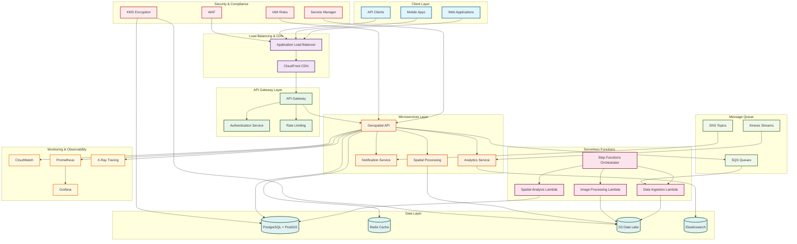

```mermaid
graph TB
    subgraph "Client Layer"
        WEB[Web Applications]
        MOBILE[Mobile Apps]
        API_CLIENT[API Clients]
    end

    subgraph "Load Balancing & CDN"
        ALB[Application Load Balancer]
        CDN[CloudFront CDN]
    end

    subgraph "API Gateway Layer"
        APIGW[API Gateway]
        AUTH[Authentication Service]
        RATE[Rate Limiting]
    end

    subgraph "Microservices Layer"
        GEO_API[Geospatial API]
        PROCESSING[Spatial Processing]
        ANALYTICS[Analytics Service]
        NOTIFICATIONS[Notification Service]
    end

    subgraph "Serverless Functions"
        LAMBDA1[Data Ingestion Lambda]
        LAMBDA2[Spatial Analysis Lambda]
        LAMBDA3[Image Processing Lambda]
        STEP[Step Functions Orchestrator]
    end

    subgraph "Data Layer"
        RDS[(PostgreSQL + PostGIS)]
        REDIS[(Redis Cache)]
        S3[(S3 Data Lake)]
        ELASTICSEARCH[(Elasticsearch)]
    end

    subgraph "Message Queue"
        SQS[SQS Queues]
        SNS[SNS Topics]
        KINESIS[Kinesis Streams]
    end

    subgraph "Monitoring & Observability"
        CLOUDWATCH[CloudWatch]
        PROMETHEUS[Prometheus]
        GRAFANA[Grafana]
        XRAY[X-Ray Tracing]
    end

    subgraph "Security & Compliance"
        WAF[WAF]
        SECRETS[Secrets Manager]
        KMS[KMS Encryption]
        IAM[IAM Roles]
    end

    %% Client connections
    WEB --> ALB
    MOBILE --> ALB
    API_CLIENT --> ALB
    ALB --> CDN
    CDN --> APIGW

    %% API Gateway connections
    APIGW --> AUTH
    APIGW --> RATE
    APIGW --> GEO_API

    %% Microservices connections
    GEO_API --> PROCESSING
    GEO_API --> ANALYTICS
    GEO_API --> NOTIFICATIONS

    %% Serverless connections
    STEP --> LAMBDA1
    STEP --> LAMBDA2
    STEP --> LAMBDA3
    LAMBDA1 --> S3
    LAMBDA2 --> RDS
    LAMBDA3 --> S3

    %% Data connections
    GEO_API --> RDS
    GEO_API --> REDIS
    PROCESSING --> S3
    ANALYTICS --> ELASTICSEARCH

    %% Message queue connections
    GEO_API --> SQS
    SQS --> LAMBDA1
    SNS --> NOTIFICATIONS
    KINESIS --> ANALYTICS

    %% Monitoring connections
    GEO_API --> CLOUDWATCH
    GEO_API --> PROMETHEUS
    PROMETHEUS --> GRAFANA
    GEO_API --> XRAY

    %% Security connections
    WAF --> ALB
    SECRETS --> GEO_API
    KMS --> RDS
    KMS --> S3
    IAM --> GEO_API

    %% Styling
    classDef client fill:#e1f5fe,stroke:#01579b,stroke-width:2px
    classDef loadbalancer fill:#f3e5f5,stroke:#4a148c,stroke-width:2px
    classDef apigateway fill:#e8f5e8,stroke:#1b5e20,stroke-width:2px
    classDef microservice fill:#fff3e0,stroke:#e65100,stroke-width:2px
    classDef serverless fill:#fce4ec,stroke:#880e4f,stroke-width:2px
    classDef data fill:#e0f2f1,stroke:#004d40,stroke-width:2px
    classDef messaging fill:#f1f8e9,stroke:#33691e,stroke-width:2px
    classDef monitoring fill:#fff8e1,stroke:#ff6f00,stroke-width:2px
    classDef security fill:#ffebee,stroke:#b71c1c,stroke-width:2px

    class WEB,MOBILE,API_CLIENT client
    class ALB,CDN loadbalancer
    class APIGW,AUTH,RATE apigateway
    class GEO_API,PROCESSING,ANALYTICS,NOTIFICATIONS microservice
    class LAMBDA1,LAMBDA2,LAMBDA3,STEP serverless
    class RDS,REDIS,S3,ELASTICSEARCH data
    class SQS,SNS,KINESIS messaging
    class CLOUDWATCH,PROMETHEUS,GRAFANA,XRAY monitoring
    class WAF,SECRETS,KMS,IAM security
```
