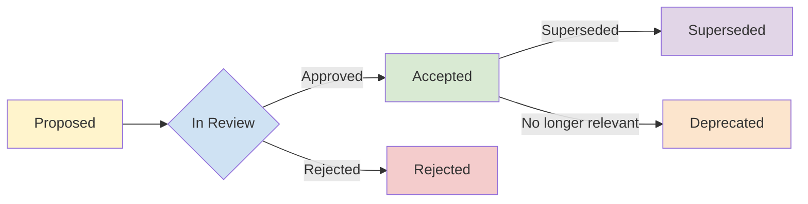

# Best Practices for Architecture Decision Records (ADRs) and Technical Decision Governance

**Objective**: Establish a consistent, discoverable practice for recording and governing architecture and technical decisions. When you need to understand why a system is built a certain way, when you want to make decisions explicit and reviewable, when you need to prevent architectural amnesia—this guide provides the framework.

## Goals & Non-Goals

### Goals

- **Create a consistent practice** for recording architecture and technical decisions
- **Make decisions discoverable, reviewable, and auditable** over time
- **Integrate ADRs into existing Git-based workflows** (PRs, issues, reviews)
- **Reduce tribal knowledge** and forgotten decisions
- **Enable better onboarding** by documenting "why" alongside "how"

### Non-Goals

- **Not replacing detailed design docs or RFCs**: ADRs capture decisions; design docs capture implementation details
- **Not mandating a single ADR tooling stack**: Focus on patterns and structure that work with any tooling
- **Not requiring ADRs for every change**: Only significant architectural decisions
- **Not a replacement for code review**: ADRs complement, don't replace, code review

## Why ADRs Matter (Especially in This Kind of Repo)

### The Problem: Architectural Amnesia

Your repository already contains extensive best-practices documentation:
- Docker and containerization patterns
- PostgreSQL optimization and security
- NGINX configuration and routing
- Observability stacks (Grafana, Prometheus, Loki)
- SBOM and CVE mitigation workflows
- Geospatial data engineering
- ML/AI deployment patterns

**These documents answer "how"**—they describe proven patterns and implementation details.

**What's missing is "why"**—the context, trade-offs, and rationale behind each decision.

### Problems Without ADRs

1. **Decisions live in ephemeral channels**: Chat, email, or someone's memory
2. **Repeated questions**: New contributors ask "Why Postgres here and not X?", "Why Loki over ELK?", "Why PgAudit instead of native logging?"
3. **Architectural thrash**: Teams make conflicting changes because original decisions are forgotten
4. **Onboarding friction**: New engineers spend weeks understanding "why things are this way"
5. **Compliance gaps**: Auditors ask "Why this security posture?" and there's no documented answer

### The Value of ADRs

ADRs provide:
- **Historical context**: Why a decision was made at a specific point in time
- **Trade-off transparency**: What alternatives were considered and why they were rejected
- **Decision audit trail**: Who decided, when, and what the expected consequences were
- **Living documentation**: Decisions can be superseded, but history is preserved

### Example: The PgAudit Decision

**Without ADR**: A new engineer sees PgAudit configured and wonders:
- "Why not use native PostgreSQL logging?"
- "Why CSV logs instead of JSON?"
- "Why PgCron for rotation instead of logrotate?"

**With ADR**: ADR-0005 documents:
- Context: Compliance requirements for audit trails
- Options: Native logging, PgAudit, third-party tools
- Decision: PgAudit + CSV logs + PgCron
- Rationale: Structured parsing, automated rotation, database-native scheduling
- Consequences: Performance overhead, maintenance complexity, compliance coverage

## ADR Basics: What, When, and How Much Detail

### What Is an ADR?

An **Architecture Decision Record (ADR)** is a short, versioned document that captures:
- **A single significant decision**
- **The context** that led to the decision
- **Options considered** and why they were rejected
- **The decision** itself
- **Expected consequences** (positive and negative)

### When to Write an ADR

Write an ADR when you make a decision that:
- **Introduces a new major technology** (e.g., switching from ELK to Loki)
- **Changes security posture** (e.g., adopting SBOM/Trivy policy)
- **Affects data model or storage architecture** (e.g., choosing Parquet over JSONB)
- **Defines a standard pattern** (e.g., GitFlow workflow, NGINX routing strategy)
- **Will be questioned later** ("Why did we choose X instead of Y?")

### When NOT to Write an ADR

Skip ADRs for:
- **Trivial refactors**: Code cleanup, variable renaming
- **Local implementation details**: Covered by code comments
- **Temporary workarounds**: Documented in issue trackers
- **Obvious choices**: When there's only one reasonable option

### Decision Checklist: "Should This Be an ADR?"

Ask yourself:
1. **Will a future engineer ask "why?"** about this decision?
2. **Does this affect multiple systems or teams?**
3. **Are there multiple reasonable alternatives?**
4. **Will this decision be referenced in design docs or runbooks?**
5. **Does this change our security, compliance, or operational posture?**
6. **Is this a pattern we'll reuse across projects?**
7. **Would reversing this decision be expensive or disruptive?**

If you answer "yes" to 3+ questions, write an ADR.

## ADR Repository Structure & Naming

### Recommended Structure

**For Documentation Repositories** (like `sempervent.github.io`):

```
/docs
  /adr
    /_templates
      0001-template-standard.md
      0002-template-lightweight.md
    0001-use-postgres-for-audit-log.md
    0002-standardize-on-openmaptiles-for-basemaps.md
    0003-sbom-trivy-policy-for-docker-images.md
    0004-observability-stack-standardization.md
    0005-pgaudit-pgcron-audit-pipeline.md
    index.md
```

**For Code Repositories**:

```
/adr
  0001-title.md
  0002-title.md
  index.md
```

### Naming Convention

**Format**: `NNNN-kebab-case-title.md`

- **Sequential numeric prefix**: `0001-`, `0002-`, etc. (padded to 4 digits)
- **Kebab-case title**: Lowercase, hyphens for spaces
- **No gaps**: If ADR-0005 is deleted, don't reuse the number; keep sequence continuous

**Examples**:
- `0001-use-postgres-for-audit-log.md`
- `0002-standardize-on-openmaptiles-for-basemaps.md`
- `0003-sbom-trivy-policy-for-docker-images.md`

### Status Labels

Each ADR must have a status:

- **`Proposed`**: Draft, under review, not yet accepted
- **`Accepted`**: Decision is active and should be followed
- **`Superseded`**: Replaced by a newer ADR (include link to superseding ADR)
- **`Rejected`**: Decision was not adopted (include reason)
- **`Deprecated`**: Decision is no longer relevant but kept for historical context

### Linking Related ADRs

Use explicit links in ADR documents:

```markdown
## Related ADRs

- **Supersedes**: [ADR-0003: Legacy Observability Stack](../adr/0003-legacy-observability-stack.md)
- **Superseded by**: [ADR-0010: Unified Observability Platform](../adr/0010-unified-observability-platform.md)
- **Related**: [ADR-0005: Database Auditing Strategy](../adr/0005-database-auditing-strategy.md)
```

## ADR Templates

### Standard ADR Template

Use this template for most architectural decisions:

```markdown
# ADR-XXXX: [Short Descriptive Title]

**Status**: Proposed | Accepted | Superseded | Rejected | Deprecated

**Date**: YYYY-MM-DD

**Deciders**: [Names or roles, e.g., "Architecture Working Group", "Tech Leads"]

**Tags**: [Optional: component, domain, e.g., "observability", "security", "data"]

---

## Context

[2-4 paragraphs describing the situation, problem, or requirement that led to this decision. Include:
- What problem are we solving?
- What constraints exist?
- What are the business/technical drivers?]

## Decision

[1-2 paragraphs stating the decision clearly and concisely. Be specific about what is being decided.]

We will [specific action/choice].

## Options Considered

### Option 1: [Name of Option]

**Description**: [What this option entails]

**Pros**:
- [Benefit 1]
- [Benefit 2]

**Cons**:
- [Drawback 1]
- [Drawback 2]

### Option 2: [Name of Option]

[Same structure as Option 1]

### Option 3: [Name of Option]

[Same structure as Option 1]

## Rationale

[2-3 paragraphs explaining why the chosen option was selected. Reference specific pros/cons, constraints, or requirements that drove the decision.]

## Consequences

### Positive

- [Expected positive outcome 1]
- [Expected positive outcome 2]

### Negative

- [Expected negative outcome 1]
- [Expected negative outcome 2]

### Neutral / Trade-offs

- [Trade-off or neutral consequence]

## Related Documents

- [Link to design doc, RFC, or implementation guide]
- [Link to best-practices document]
- [Link to runbook or operational guide]

## Implementation Notes

[Optional: Brief notes on how this decision will be implemented, key milestones, or dependencies]

## References

[Optional: Links to external resources, research, or benchmarks that informed the decision]
```

### Lightweight ADR Template

Use this template for smaller, focused decisions:

```markdown
# ADR-XXXX: [Short Descriptive Title]

**Status**: Proposed | Accepted | Superseded | Rejected | Deprecated

**Date**: YYYY-MM-DD

**Deciders**: [Names or roles]

---

## Context

[1-2 paragraphs: What problem or situation led to this decision?]

## Decision

[1 paragraph: What is being decided?]

We will [specific action/choice].

## Impact / Notes

[1-2 paragraphs: What are the key consequences, trade-offs, or implementation considerations?]

## Related Documents

- [Link to relevant docs]
```

## Decision Scope & Granularity

### Best Practices

**Each ADR should cover one main decision**. Avoid bundling unrelated choices into a single ADR.

### Scope Guidelines

| Scope | Example | Good/Bad |
|-------|---------|----------|
| **Too Big** | "Observability, Logging, Monitoring, and All Data Pipelines v3" | ❌ Too broad, multiple unrelated decisions |
| **Just Right** | "Standardize on Grafana + Prometheus + Loki for Observability" | ✅ Single coherent decision |
| **Just Right** | "Use PgAudit + CSV Logs + PgCron for Audit Logging Pipeline" | ✅ Related components, single purpose |
| **Just Right** | "Adopt GitFlow with Protected Main/Develop and Release Branches" | ✅ Single workflow decision |
| **Just Right** | "Generate Dark OpenMapTiles for US at Z≤12 as Default Basemap" | ✅ Single technology/pattern decision |
| **Too Small** | "Use `asyncpg` instead of `psycopg2` in service X" | ❌ Implementation detail, not architectural |

### Good ADR Examples (From This Ecosystem)

1. **"Standardize on Grafana + Prometheus + Loki for Observability"**
   - Single decision: Which observability stack?
   - Clear scope: Metrics, logs, dashboards
   - Related but distinct: Could have separate ADRs for alerting, tracing

2. **"Use PgAudit + CSV Logs + PgCron for Audit Logging Pipeline"**
   - Single decision: How to implement database auditing?
   - Related components: All part of one pipeline
   - Clear boundary: Database auditing, not application logging

3. **"Adopt GitFlow with Protected Main/Develop and Release Branches"**
   - Single decision: Which branching model?
   - Clear scope: Version control workflow
   - Related but distinct: Could have separate ADR for CI/CD integration

4. **"Generate Dark OpenMapTiles for US at Z≤12 as Default Basemap"**
   - Single decision: Which basemap technology and configuration?
   - Clear scope: Geospatial visualization
   - Related but distinct: Could have separate ADR for tile serving infrastructure

### When to Split or Combine

**Split if**:
- ADR covers multiple unrelated systems (e.g., "Database and Message Queue Strategy")
- Different teams own different parts
- Decisions can be made independently

**Combine if**:
- Components are tightly coupled (e.g., PgAudit + CSV logs + PgCron)
- One decision depends on another
- They form a single coherent pattern

## Integrating ADRs with Git & Pull Requests

### Workflow: Creating a New ADR

**Step 1: Create Branch**

```bash
# Create feature branch
git checkout -b adr/0007-sbom-trivy-policy

# Or use descriptive name
git checkout -b adr/0007-docker-image-security-policy
```

**Step 2: Create ADR File**

```bash
# Create ADR file
touch docs/adr/0007-sbom-trivy-policy-for-docker-images.md

# Copy template
cp docs/adr/_templates/0001-template-standard.md docs/adr/0007-sbom-trivy-policy-for-docker-images.md
```

**Step 3: Draft ADR**

- Set status to `Proposed`
- Fill in context, options, decision, rationale
- Link to related documents

**Step 4: Update ADR Index**

```markdown
# Architecture Decision Records

| Number | Title | Status | Date |
|--------|-------|--------|------|
| 0007 | SBOM and Trivy Policy for Docker Images | Proposed | 2024-01-15 |
```

### Workflow: Review Process

**Step 1: Open Pull Request**

**PR Title**: `ADR-0007: SBOM and Trivy Policy for Docker Images`

**PR Description Template**:

```markdown
## ADR Proposal

This PR proposes [brief summary of decision].

**Status**: Proposed

**Deciders**: @tech-lead-1, @security-lead, @ops-lead

**Related Issues**: #123, #456

## Review Checklist

- [ ] Context and problem statement are clear
- [ ] All reasonable options have been considered
- [ ] Rationale is well-documented
- [ ] Consequences (positive and negative) are identified
- [ ] Related documents are linked
- [ ] ADR index is updated

## Questions for Reviewers

- [Question 1]
- [Question 2]
```

**Step 2: Request Review**

Request review from:
- **Tech leads / architects**: Validate technical soundness
- **Stakeholders**: Security, ops, data teams affected by decision
- **Domain experts**: People with relevant expertise

**Step 3: Address Feedback**

- Update ADR based on review comments
- Document any changes in PR comments
- Keep status as `Proposed` until consensus

**Step 4: Acceptance**

Once approved:
- Change status to `Accepted`
- Merge PR
- Optionally tag repository with release that includes decision

### Commit Message Convention

**Format**: `docs(adr): add ADR-XXXX: [Title]`

**Examples**:

```bash
git commit -m "docs(adr): add ADR-0007: SBOM and Trivy Policy for Docker Images

- Proposes mandatory SBOM generation for all Docker images
- Requires Trivy scan with CRITICAL/HIGH severity gates
- Establishes automated CVE mitigation workflow

Status: Proposed"
```

### Workflow: Superseding an ADR

**Step 1: Create New ADR**

```bash
git checkout -b adr/0010-unified-observability-platform
touch docs/adr/0010-unified-observability-platform.md
```

**Step 2: Reference Old ADR**

In new ADR:

```markdown
## Related ADRs

- **Supersedes**: [ADR-0004: Observability Stack Standardization](../adr/0004-observability-stack-standardization.md)
```

**Step 3: Update Old ADR**

In old ADR:

```markdown
**Status**: Superseded

## Related ADRs

- **Superseded by**: [ADR-0010: Unified Observability Platform](../adr/0010-unified-observability-platform.md)
```

**Step 4: Merge Both Changes**

- New ADR: Status `Accepted`
- Old ADR: Status `Superseded`

## Linking ADRs to Best-Practices & Runbooks

### Best-Practices Documents Should Reference ADRs

**Pattern**: Add ADR references at the top or bottom of best-practices documents.

**Example: NGINX Best Practices**

```markdown
# NGINX Best Practices: Patterns, Hardening, and Multi-API Replication

**This document is guided by**: [ADR-0003: NGINX as Edge Reverse Proxy for Internal APIs](../adr/0003-nginx-edge-reverse-proxy.md)

[Rest of document...]

---

## Related Documents

- [ADR-0003: NGINX as Edge Reverse Proxy](../adr/0003-nginx-edge-reverse-proxy.md)
- [ADR-0008: Multi-API Gateway Pattern](../adr/0008-multi-api-gateway-pattern.md)
```

**Example: Observability Best Practices**

```markdown
# Best Practices for Monitoring & Observability

**This approach is defined by**: [ADR-0004: Observability Stack Standardization](../adr/0004-observability-stack-standardization.md)

[Rest of document...]
```

### ADRs Should Link to Implementation Guides

In ADR's "Related Documents" section:

```markdown
## Related Documents

- **[Best Practices: Grafana, Prometheus, Loki](../operations-monitoring/grafana-prometheus-loki-observability.md)** - Implementation guide
- **[Tutorial: Setting Up Prometheus Scraping](../tutorials/operations-monitoring/prometheus-setup.md)** - Step-by-step setup
- **[Runbook: Observability Stack Incident Response](../runbooks/observability-incident-response.md)** - Operational procedures
```

### Handling Divergence

If best-practices diverge from ADR:

```markdown
## Note on ADR Alignment

This document follows [ADR-0004: Observability Stack Standardization](../adr/0004-observability-stack-standardization.md) with one exception:

**Divergence**: We use Promtail instead of Fluentd for log ingestion.

**Reason**: Promtail provides better integration with Loki and reduces operational complexity in our Kubernetes environment.

**Impact**: This is an implementation detail that doesn't change the core decision in ADR-0004.
```

## Decision Lifecycle & Governance

### Governance Model

**Who Can Propose ADRs?**

- **Any engineer** can propose an ADR
- No gatekeeping on proposal; all proposals are welcome

**Who Can Approve ADRs?**

- **Architecture Working Group** (or equivalent): For system-wide decisions
- **Tech Leads Council**: For cross-team decisions
- **Domain Experts**: For domain-specific decisions (e.g., security team for security ADRs)
- **Consensus-based**: For smaller teams, require approval from 2-3 relevant stakeholders

**Decision Authority Matrix**:

| Decision Scope | Approver | Example |
|----------------|----------|---------|
| **System-wide** | Architecture Working Group | Observability stack, database strategy |
| **Security** | Security Team + Tech Leads | SBOM policy, audit logging |
| **Domain-specific** | Domain Experts + Tech Leads | Geospatial basemap, ML deployment |
| **Team-specific** | Team Tech Lead | Service-specific patterns |

### Decision Lifecycle



**States**:
- **Proposed**: Draft, under review
- **In Review**: Actively being discussed (optional explicit state)
- **Accepted**: Decision is active
- **Rejected**: Decision was not adopted
- **Superseded**: Replaced by newer ADR
- **Deprecated**: No longer relevant but kept for history

### Review Cadence

**Quarterly ADR Review Meeting**:

**Agenda**:
1. **Review stale ADRs**: Identify ADRs that may need updating
2. **Mark as Deprecated**: ADRs for systems that no longer exist
3. **Identify Superseded ADRs**: Find ADRs that have been implicitly replaced
4. **Update statuses**: Ensure all ADRs have correct status
5. **Archive old ADRs**: Move deprecated ADRs to archive (optional)

**Process**:
- Tech leads review ADR index
- Identify candidates for status changes
- Discuss in meeting
- Update ADRs via PRs

### Handling Disagreements

**Use ADRs to make disagreements explicit**:

1. **Capture competing options**: Document all serious alternatives
2. **Record rationale**: Explain why each option was considered
3. **Document trade-offs**: Be explicit about what's being traded off
4. **Record the compromise**: The decision is the documented compromise

**Example**:

```markdown
## Options Considered

### Option 1: ELK Stack (Elasticsearch, Logstash, Kibana)

**Pros**: Mature, feature-rich, excellent search capabilities

**Cons**: Resource-intensive, complex to operate, licensing costs at scale

### Option 2: Grafana + Prometheus + Loki

**Pros**: Lightweight, cost-effective, excellent Grafana integration

**Cons**: Less mature than ELK, different query language (LogQL vs Lucene)

## Rationale

After evaluation, we chose Option 2 (Grafana + Prometheus + Loki) because:
- Cost constraints favor open-source, self-hosted solutions
- Existing Prometheus investment reduces operational overhead
- LogQL, while different, is sufficient for our use cases
- Team familiarity with Grafana reduces training burden

**Trade-off**: We sacrifice some advanced search capabilities for operational simplicity and cost efficiency.
```

## Concrete Examples

### Example 1: Standardize on PgAudit + CSV Logs + PgCron for Database Auditing

```markdown
# ADR-0005: Use PgAudit + CSV Logs + PgCron for Database Auditing

**Status**: Accepted

**Date**: 2024-01-15

**Deciders**: Database Team, Security Team, Architecture Working Group

**Tags**: database, security, compliance

---

## Context

We need comprehensive audit logging for PostgreSQL databases to meet compliance requirements (SOC2, GDPR). The audit trail must:
- Log all DDL, DML, and function calls
- Be queryable and analyzable
- Rotate automatically to manage disk space
- Integrate with our existing observability stack

Current PostgreSQL native logging provides basic query logging but lacks structured audit events and automated rotation capabilities.

## Decision

We will use **PgAudit** for structured audit logging, **CSV logs** for parsing and ingestion, and **PgCron** for automated log rotation and data refresh.

## Options Considered

### Option 1: Native PostgreSQL Logging

**Description**: Use PostgreSQL's built-in `log_statement` and `log_min_duration_statement` settings.

**Pros**:
- No additional extensions required
- Simple configuration
- Low overhead

**Cons**:
- No structured audit events (just query text)
- Difficult to parse and analyze
- No automated rotation (requires external tools)
- Limited filtering capabilities

### Option 2: PgAudit + External Log Rotation

**Description**: Use PgAudit for audit logging, but rely on OS-level logrotate for rotation.

**Pros**:
- Structured audit events
- Standard OS tooling
- No database extension for rotation

**Cons**:
- Requires coordination between database and OS
- Less flexible for database-specific retention policies
- Harder to integrate with database-driven refresh jobs

### Option 3: PgAudit + CSV Logs + PgCron (Chosen)

**Description**: Use PgAudit for audit events, CSV logs for structured parsing, and PgCron for automated rotation and data refresh.

**Pros**:
- Structured audit events via PgAudit
- CSV format enables easy parsing and ingestion
- Database-native scheduling via PgCron
- Can build analytical views on audit data
- Automated refresh keeps audit tables current

**Cons**:
- Requires two extensions (pgaudit, pg_cron)
- Performance overhead from audit logging (5-15%)
- More complex setup and maintenance

## Rationale

We chose Option 3 because:
- **Compliance requirements** demand structured, queryable audit trails
- **CSV logs** enable us to build analytical views (top users, top tables, activity logs)
- **PgCron** provides database-native scheduling, reducing operational complexity
- **Integrated approach** allows us to refresh audit tables automatically and build dashboards

The performance overhead is acceptable given compliance requirements, and we can tune PgAudit settings (e.g., `pgaudit.log = 'ddl,write'` instead of `'all'`) to reduce impact.

## Consequences

### Positive

- Comprehensive audit trail for compliance
- Queryable audit data via database views
- Automated rotation and refresh reduce operational burden
- Can build dashboards and alerts on audit data

### Negative

- Performance overhead (5-15% depending on logging level)
- Additional maintenance for PgAudit and PgCron extensions
- Storage requirements for audit logs and parsed data

### Neutral / Trade-offs

- More complex setup, but better long-term maintainability
- Database-native scheduling vs OS-level tooling

## Related Documents

- **[Best Practices: PostgreSQL Security](../postgres/postgres-security-best-practices.md)**
- **[Tutorial: Auditing PostgreSQL with PgAudit and PgCron](../../tutorials/database-data-engineering/postgres-pgaudit-pgcron-auditing.md)**

## Implementation Notes

- Enable PgAudit and PgCron in `postgresql.conf`
- Configure CSV logging with appropriate rotation settings
- Create audit schema with staging and parsed log tables
- Build refresh function and analytical views
- Schedule PgCron jobs for rotation and refresh
```

### Example 2: Adopt Grafana + Prometheus + Loki as Default Observability Stack

```markdown
# ADR-0004: Standardize on Grafana + Prometheus + Loki for Observability

**Status**: Accepted

**Date**: 2024-01-10

**Deciders**: Architecture Working Group, Operations Team

**Tags**: observability, monitoring, logging

---

## Context

We need a unified observability stack for metrics, logs, and dashboards across all systems (infrastructure, applications, data pipelines). Current state:
- Metrics scattered across multiple systems
- Logs in various formats and locations
- No unified dashboarding solution
- High operational overhead from multiple tools

Requirements:
- Cost-effective (prefer open-source, self-hosted)
- Scalable to hundreds of services
- Easy integration with existing systems
- Strong visualization capabilities

## Decision

We will standardize on **Grafana** for dashboards, **Prometheus** for metrics, and **Loki** for logs. All new systems must integrate with this stack.

## Options Considered

### Option 1: ELK Stack (Elasticsearch, Logstash, Kibana)

**Description**: Use Elasticsearch for logs, Logstash for processing, Kibana for dashboards. Add Prometheus for metrics.

**Pros**:
- Mature, feature-rich
- Excellent search capabilities (Lucene)
- Strong ecosystem

**Cons**:
- Resource-intensive (Elasticsearch requires significant RAM/CPU)
- Complex to operate at scale
- Licensing costs for advanced features
- Different stack for logs vs metrics

### Option 2: Datadog / New Relic / Splunk (SaaS)

**Description**: Use commercial SaaS observability platform.

**Pros**:
- Fully managed, no operational overhead
- Excellent UI and features
- Strong support

**Cons**:
- High cost at scale (per-host or per-GB pricing)
- Vendor lock-in
- Data residency concerns for sensitive data
- Limited customization

### Option 3: Grafana + Prometheus + Loki (Chosen)

**Description**: Use Grafana for visualization, Prometheus for metrics, Loki for logs.

**Pros**:
- Cost-effective (open-source, self-hosted)
- Unified stack (metrics and logs in Grafana)
- PromQL and LogQL are powerful query languages
- Excellent Grafana integration
- Can reuse existing Prometheus investment

**Cons**:
- Less mature than ELK for log search
- LogQL different from Lucene (learning curve)
- Requires operational expertise

## Rationale

We chose Option 3 because:
- **Cost constraints** favor open-source, self-hosted solutions
- **Unified stack** reduces operational complexity (one dashboard tool)
- **Existing Prometheus investment** means we can leverage current setup
- **LogQL**, while different from Lucene, is sufficient for our use cases
- **Team familiarity** with Grafana reduces training burden

The trade-off of less advanced log search is acceptable given cost and operational simplicity benefits.

## Consequences

### Positive

- Unified observability stack reduces operational overhead
- Cost-effective (no per-host or per-GB SaaS fees)
- Strong Grafana integration for metrics and logs
- Can scale horizontally

### Negative

- Requires operational expertise to run Prometheus and Loki
- LogQL learning curve for teams used to Lucene
- Less mature log search than ELK

### Neutral / Trade-offs

- Self-hosted vs managed: More control, more operational burden
- LogQL vs Lucene: Different but sufficient for our needs

## Related Documents

- **[Best Practices: Monitoring & Observability](../operations-monitoring/grafana-prometheus-loki-observability.md)**
- **[Tutorial: Setting Up Prometheus Scraping](../../tutorials/operations-monitoring/prometheus-setup.md)**

## Implementation Notes

- Deploy Prometheus for metrics collection
- Deploy Loki for log aggregation
- Deploy Grafana with Prometheus and Loki datasources
- Migrate existing dashboards to Grafana
- Train teams on PromQL and LogQL
```

### Example 3: Use OpenMapTiles Dark Basemap (US z≤12) for All Geospatial Dashboards

```markdown
# ADR-0002: Standardize on OpenMapTiles Dark Basemap for Geospatial Dashboards

**Status**: Accepted

**Date**: 2024-01-05

**Deciders**: Data Engineering Team, Frontend Team

**Tags**: geospatial, visualization, frontend

---

## Context

We need a consistent basemap for all geospatial dashboards (Grafana, custom web apps, internal tools). Requirements:
- Dark theme (reduces eye strain, matches our dashboard aesthetic)
- Covers entire United States
- Vector tiles (for performance and customization)
- Self-hosted (for air-gapped environments and cost control)
- Zoom level 12 sufficient for strategic/overview maps

Current state: Mixed basemaps (some use Mapbox, some use OpenStreetMap, some have no basemap).

## Decision

We will generate and self-host **dark-themed OpenMapTiles** covering the entire United States at zoom level 12, and use this as the default basemap for all geospatial dashboards.

## Options Considered

### Option 1: Mapbox (SaaS)

**Description**: Use Mapbox's hosted vector tiles with dark style.

**Pros**:
- Fully managed, no operational overhead
- High-quality tiles and styles
- Easy integration

**Cons**:
- Cost at scale (per-request pricing)
- Not suitable for air-gapped environments
- Vendor lock-in

### Option 2: OpenStreetMap Raster Tiles

**Description**: Use standard OSM raster tiles (e.g., from tile.openstreetmap.org).

**Pros**:
- Free, no operational overhead
- Simple integration

**Cons**:
- Not dark-themed
- Raster tiles (larger, less customizable)
- Rate limiting on public servers
- Not self-hosted

### Option 3: OpenMapTiles Dark (Self-Hosted) (Chosen)

**Description**: Generate dark-themed OpenMapTiles for US at z≤12, host via tileserver-gl.

**Pros**:
- Self-hosted (air-gapped compatible, no per-request costs)
- Dark theme matches dashboard aesthetic
- Vector tiles (smaller, more customizable)
- Full control over style and data

**Cons**:
- Requires initial tile generation (time and storage)
- Operational overhead (hosting tileserver)
- Limited to z≤12 (may need higher zoom for specific regions)

## Rationale

We chose Option 3 because:
- **Air-gapped environments** require self-hosted solutions
- **Dark theme** matches our dashboard aesthetic and reduces eye strain
- **Cost control**: No per-request fees, one-time generation cost
- **Zoom level 12** is sufficient for strategic/overview maps (can generate higher zoom for specific regions if needed)

The operational overhead is acceptable given cost and flexibility benefits.

## Consequences

### Positive

- Consistent basemap across all dashboards
- Dark theme reduces eye strain
- Self-hosted enables air-gapped deployments
- No per-request costs

### Negative

- Initial tile generation requires time and storage
- Operational overhead for tileserver
- Limited to z≤12 (may need region-specific higher zoom tiles)

### Neutral / Trade-offs

- Self-hosted vs SaaS: More control, more operational burden
- z≤12 vs higher zoom: Balances coverage with storage/performance

## Related Documents

- **[Tutorial: Generating Dark OpenMapTiles for US at Z12](../../tutorials/database-data-engineering/openmaptiles-us-dark-z12.md)**
- **[Best Practices: Geospatial Data Engineering](../database-data/geospatial-data-engineering.md)**

## Implementation Notes

- Generate US-wide tiles at z≤12 using OpenMapTiles toolchain
- Deploy tileserver-gl for tile serving
- Create dark style JSON
- Integrate into Grafana and custom web apps
- Document tile generation process for future updates
```

### Example 4: Require SBOM + Trivy Scan for All Docker Images Before Release

```markdown
# ADR-0003: SBOM and Trivy Policy for Docker Images

**Status**: Accepted

**Date**: 2024-01-12

**Deciders**: Security Team, DevOps Team, Architecture Working Group

**Tags**: security, containers, compliance

---

## Context

We need to ensure container security and compliance with supply-chain security requirements. Current state:
- Docker images built and deployed without security scanning
- No Software Bill of Materials (SBOM) for containers
- No automated CVE detection or mitigation
- Compliance requirements (SOC2, SLSA) demand supply-chain visibility

Requirements:
- Generate SBOMs for all Docker images
- Scan images for CVEs before release
- Automate CVE mitigation where possible
- Fail builds on critical vulnerabilities

## Decision

We will require **SBOM generation** and **Trivy scanning** for all Docker images before release. Builds will fail on CRITICAL or HIGH severity CVEs unless explicitly allowed via ignore list.

## Options Considered

### Option 1: Manual Scanning (Current State)

**Description**: Developers manually run security scans before releases.

**Pros**:
- No tooling changes required
- Flexible process

**Cons**:
- Inconsistent application
- Easy to forget or skip
- No automation
- No SBOM generation

### Option 2: GitHub/GitLab Native Scanners

**Description**: Use built-in security scanning (e.g., GitHub Dependabot, GitLab Container Scanning).

**Pros**:
- Integrated into existing workflows
- No additional tooling

**Cons**:
- Limited to specific platforms
- Less control over policies
- May not generate SBOMs in required format
- Less flexible for custom workflows

### Option 3: Trivy + Syft (Chosen)

**Description**: Use Trivy for vulnerability scanning and Syft for SBOM generation, integrated into CI/CD pipelines.

**Pros**:
- Comprehensive scanning (vulnerabilities, misconfigurations, secrets)
- SBOM generation in multiple formats (CycloneDX, SPDX)
- Flexible policy enforcement
- Works with any CI/CD system
- Can automate CVE mitigation

**Cons**:
- Requires CI/CD integration
- Operational overhead for policy management
- May require base image updates to fix CVEs

## Rationale

We chose Option 3 because:
- **Comprehensive scanning**: Trivy covers vulnerabilities, misconfigurations, and secrets
- **SBOM generation**: Syft produces SBOMs in standard formats (CycloneDX, SPDX) for compliance
- **Flexible policies**: Can enforce different policies per environment (warn in dev, fail in prod)
- **Automation potential**: Can integrate with dependency update tools (Renovate, Dependabot) for auto-fix
- **Platform-agnostic**: Works with any CI/CD system, not tied to specific platforms

The operational overhead is acceptable given security and compliance benefits.

## Consequences

### Positive

- Comprehensive security scanning before release
- SBOMs enable supply-chain visibility and compliance
- Automated policy enforcement reduces human error
- Can integrate with automated CVE mitigation

### Negative

- CI/CD pipeline changes required
- May block releases until CVEs are fixed
- Operational overhead for policy management
- Requires base image and dependency updates

### Neutral / Trade-offs

- Security vs velocity: May slow releases, but improves security posture
- Automation vs flexibility: More automated, but requires policy definition

## Related Documents

- **[Best Practices: SBOMs, Trivy Scans, and Automated CVE Mitigation](../docker-infrastructure/docker-sbom-trivy-cve-mitigation.md)**
- **[Tutorial: Setting Up Trivy in CI/CD](../../tutorials/docker-infrastructure/trivy-ci-cd-setup.md)**

## Implementation Notes

- Integrate Trivy and Syft into CI/CD pipelines
- Configure severity thresholds (fail on CRITICAL/HIGH)
- Set up SBOM artifact storage
- Create ignore list process for unavoidable CVEs
- Document policy exceptions and approval process
```

## Tooling & Automation

### Pre-commit / CI Checks

**Validate ADR Structure**:

Create a simple script to validate ADR files:

```bash
#!/bin/bash
# scripts/validate-adr.sh

adr_file="$1"

# Check required fields
required_fields=("Status" "Date" "Deciders")
missing_fields=()

for field in "${required_fields[@]}"; do
    if ! grep -q "^\*\*${field}\*\*:" "$adr_file"; then
        missing_fields+=("$field")
    fi
done

if [ ${#missing_fields[@]} -ne 0 ]; then
    echo "ERROR: Missing required fields in $adr_file: ${missing_fields[*]}"
    exit 1
fi

# Check status is valid
status=$(grep "^\*\*Status\*\*:" "$adr_file" | sed 's/.*: //')
valid_statuses=("Proposed" "Accepted" "Superseded" "Rejected" "Deprecated")
if [[ ! " ${valid_statuses[@]} " =~ " ${status} " ]]; then
    echo "ERROR: Invalid status '$status' in $adr_file"
    exit 1
fi

# Check naming convention
filename=$(basename "$adr_file")
if ! [[ "$filename" =~ ^[0-9]{4}-.*\.md$ ]]; then
    echo "ERROR: ADR filename must match pattern NNNN-kebab-case-title.md"
    exit 1
fi

echo "✓ ADR $adr_file is valid"
```

**GitHub Actions Example**:

```yaml
# .github/workflows/validate-adrs.yml
name: Validate ADRs

on:
  pull_request:
    paths:
      - 'docs/adr/*.md'

jobs:
  validate:
    runs-on: ubuntu-latest
    steps:
      - uses: actions/checkout@v3
      - name: Validate ADRs
        run: |
          for adr in docs/adr/*.md; do
            if [[ "$adr" != "docs/adr/index.md" ]] && [[ "$adr" != "docs/adr/_templates"* ]]; then
              ./scripts/validate-adr.sh "$adr"
            fi
          done
```

### ADR Index Generation

**Auto-Generate Index**:

```bash
#!/bin/bash
# scripts/generate-adr-index.sh

index_file="docs/adr/index.md"
adr_dir="docs/adr"

cat > "$index_file" << 'EOF'
# Architecture Decision Records

This directory contains Architecture Decision Records (ADRs) for this project.

See [ADR Best Practices](../../best-practices/architecture-design/adr-decision-governance.md) for guidelines on creating and maintaining ADRs.

## ADR Index

| Number | Title | Status | Date | Deciders |
|--------|-------|--------|------|----------|
EOF

# Extract ADR metadata
for adr in "$adr_dir"/*.md; do
    if [[ "$adr" == "$index_file" ]] || [[ "$adr" == *"/_templates/"* ]]; then
        continue
    fi
    
    number=$(basename "$adr" | cut -d'-' -f1)
    title=$(grep "^# ADR-" "$adr" | sed 's/^# ADR-[0-9]*: //')
    status=$(grep "^\*\*Status\*\*:" "$adr" | sed 's/.*: //')
    date=$(grep "^\*\*Date\*\*:" "$adr" | sed 's/.*: //')
    deciders=$(grep "^\*\*Deciders\*\*:" "$adr" | sed 's/.*: //' | sed 's/|/\\|/g')
    
    if [ -n "$title" ]; then
        echo "| $number | [$title]($(basename "$adr")) | $status | $date | $deciders |" >> "$index_file"
    fi
done

echo "✓ Generated ADR index at $index_file"
```

**Make Target**:

```makefile
# Makefile

.PHONY: adr-index
adr-index:
	@./scripts/generate-adr-index.sh

.PHONY: validate-adrs
validate-adrs:
	@for adr in docs/adr/*.md; do \
		if [[ "$$adr" != "docs/adr/index.md" ]] && [[ "$$adr" != *"/_templates/"* ]]; then \
			./scripts/validate-adr.sh "$$adr"; \
		fi \
	done
```

### Tagging and Labeling

**GitHub/GitLab Labels**:

Create labels for ADR-related issues and PRs:
- `adr` - Architecture Decision Record
- `architecture` - Architectural change
- `adr/proposed` - ADR under review
- `adr/accepted` - ADR accepted

**PR Template**:

```markdown
## Type of Change

- [ ] Bug fix
- [ ] New feature
- [ ] ADR (Architecture Decision Record)
- [ ] Documentation
- [ ] Other

## ADR Details (if applicable)

- ADR Number: ADR-XXXX
- Status: Proposed | Accepted
- Related Issues: #123
```

### Dashboards and Search

**ADR Metadata Extraction**:

For advanced use cases, extract ADR metadata into a searchable format:

```python
# scripts/extract-adr-metadata.py
import re
import json
from pathlib import Path

adr_dir = Path("docs/adr")
adrs = []

for adr_file in adr_dir.glob("*.md"):
    if adr_file.name == "index.md":
        continue
    
    content = adr_file.read_text()
    
    adr = {
        "number": re.search(r"ADR-(\d+)", content).group(1) if re.search(r"ADR-(\d+)", content) else None,
        "title": re.search(r"# ADR-\d+: (.+)", content).group(1) if re.search(r"# ADR-\d+: (.+)", content) else None,
        "status": re.search(r"\*\*Status\*\*: (.+)", content).group(1).strip() if re.search(r"\*\*Status\*\*: (.+)", content) else None,
        "date": re.search(r"\*\*Date\*\*: (.+)", content).group(1).strip() if re.search(r"\*\*Date\*\*: (.+)", content) else None,
        "tags": re.findall(r"\*\*Tags\*\*: (.+)", content)[0].split(", ") if re.search(r"\*\*Tags\*\*: (.+)", content) else [],
        "file": str(adr_file.relative_to(Path(".")))
    }
    
    adrs.append(adr)

# Output as JSON for search/indexing
print(json.dumps(adrs, indent=2))
```

## Common Pitfalls & Anti-Patterns

### Pitfall 1: Writing ADRs Long After Decision

**Symptom**: ADR is written months or years after the decision was made.

**Why It's a Problem**:
- Context is lost or misremembered
- Alternatives considered are forgotten
- Rationale becomes post-hoc justification

**How to Prevent**:
- Write ADR **during or immediately after** decision-making
- Make ADR part of the decision process, not an afterthought
- If retroactively documenting, acknowledge uncertainty in context section

### Pitfall 2: Giant ADRs Combining Many Decisions

**Symptom**: ADR covers multiple unrelated systems or decisions (e.g., "Database, Message Queue, and API Gateway Strategy v3").

**Why It's a Problem**:
- Hard to find specific decisions
- Difficult to supersede individual parts
- Violates single-responsibility principle

**How to Prevent**:
- Split ADRs by decision, not by system
- Use "Related ADRs" section to link related decisions
- If decisions are tightly coupled, combine only if they form a single coherent pattern

### Pitfall 3: ADRs with No Recorded Alternatives

**Symptom**: ADR states the decision but doesn't document what alternatives were considered.

**Why It's a Problem**:
- No understanding of trade-offs
- Future engineers can't evaluate if decision is still valid
- Missed opportunity to learn from rejected options

**How to Prevent**:
- Always document at least 2-3 alternatives
- Even if one option is "obvious," document why others were rejected
- Use "Options Considered" section to force explicit comparison

### Pitfall 4: Never Marking ADRs as Superseded or Deprecated

**Symptom**: Old ADRs remain "Accepted" even when decisions have changed.

**Why It's a Problem**:
- Confusion about which decision is current
- New engineers follow outdated guidance
- No clear history of decision evolution

**How to Prevent**:
- Quarterly ADR review meetings
- When creating new ADR, check if it supersedes an old one
- Update old ADR status to "Superseded" with link to new ADR
- Use "Related ADRs" section to maintain decision lineage

### Pitfall 5: ADRs That Aren't Linked to Implementation

**Symptom**: ADR exists but no code, config, or documentation references it.

**Why It's a Problem**:
- ADR becomes "zombie document" (exists but unused)
- Decision may not actually be followed
- No way to verify implementation

**How to Prevent**:
- Link ADRs from best-practices documents
- Reference ADRs in design docs and RFCs
- Include ADR numbers in PR descriptions when implementing decisions
- Use ADR review to identify unlinked ADRs

### Pitfall 6: Vague or Incomplete Context

**Symptom**: ADR context section is too brief or doesn't explain the problem.

**Why It's a Problem**:
- Future readers can't understand why decision was made
- Can't evaluate if decision is still relevant
- Missing information leads to poor decisions

**How to Prevent**:
- Context section should be 2-4 paragraphs
- Explain the problem, constraints, and business/technical drivers
- Include relevant background (e.g., "We previously used X, but...")
- Review context section in ADR review process

## Implementation Roadmap

### Phase 1: Seed (Weeks 1-2)

**Goal**: Establish ADR practice with initial examples.

**Tasks**:
1. **Create ADR directory structure**:
   ```bash
   mkdir -p docs/adr/_templates
   ```

2. **Add templates**:
   - Copy standard ADR template to `docs/adr/_templates/0001-template-standard.md`
   - Copy lightweight ADR template to `docs/adr/_templates/0002-template-lightweight.md`

3. **Write 2-3 retrospective ADRs**:
   - Document already-decided major items:
     - Observability stack (Grafana + Prometheus + Loki)
     - Database auditing (PgAudit + PgCron)
     - SBOM/Trivy policy
   - Use "Accepted" status
   - Include as much context as you remember

4. **Create ADR index**:
   - Manually create `docs/adr/index.md` with table of ADRs
   - Link to ADR best practices document

**Deliverables**:
- ADR directory with templates
- 2-3 initial ADRs
- ADR index page

### Phase 2: Integrate (Weeks 3-4)

**Goal**: Make ADRs part of standard workflow.

**Tasks**:
1. **Update contribution guidelines**:
   - Add section on "When to Write an ADR"
   - Include link to ADR best practices
   - Add ADR checklist to PR template

2. **Require ADR for new major systems**:
   - When proposing new service/component, require ADR
   - Gate PRs on ADR review for architectural changes

3. **Link ADRs from best-practices docs**:
   - Add ADR references to relevant best-practices documents
   - Update existing docs to reference ADRs where applicable

4. **Train team**:
   - Share ADR best practices document
   - Walk through examples in team meeting
   - Answer questions and gather feedback

**Deliverables**:
- Updated contribution guidelines
- ADR references in best-practices docs
- Team trained on ADR process

### Phase 3: Normalize (Months 2-3)

**Goal**: Make ADRs a natural part of decision-making.

**Tasks**:
1. **Quarterly ADR reviews**:
   - Schedule first review meeting
   - Review all ADRs for stale status
   - Update superseded/deprecated ADRs

2. **CI checks on ADR structure**:
   - Add pre-commit hook or CI check
   - Validate ADR naming and required fields
   - Fail PRs with invalid ADRs

3. **Cross-links from best-practices**:
   - Ensure all major best-practices docs reference relevant ADRs
   - Add "Related ADRs" sections where missing

4. **Refine process**:
   - Gather feedback from team
   - Update ADR templates if needed
   - Adjust governance model based on experience

**Deliverables**:
- Quarterly review process established
- CI validation in place
- Complete cross-linking

### Phase 4: Mature (Months 4+)

**Goal**: ADRs are fully integrated and self-sustaining.

**Tasks**:
1. **Auto-generate ADR index**:
   - Create script to generate index from ADR files
   - Add to CI/CD or pre-commit hook
   - Keep index up-to-date automatically

2. **Searchable decision registry**:
   - Extract ADR metadata (optional)
   - Create searchable index or dashboard
   - Enable filtering by status, tags, date

3. **Integration into onboarding**:
   - Add ADR section to onboarding docs
   - Point new engineers to ADR index
   - Explain how to find "why" decisions were made

4. **Continuous improvement**:
   - Regular feedback collection
   - Refine templates and process
   - Share learnings with other teams

**Deliverables**:
- Auto-generated ADR index
- Searchable decision registry (optional)
- ADRs in onboarding process

## Summary

### Key Takeaways

1. **ADRs capture "why"** alongside "how" (best-practices docs)
2. **One decision per ADR** keeps them focused and maintainable
3. **Git-based workflow** integrates ADRs into existing PR/review process
4. **Quarterly reviews** prevent stale ADRs and maintain decision lineage
5. **Cross-linking** connects ADRs to implementation guides and runbooks

### Adoption Checklist

- [ ] Create `/docs/adr/` directory with templates
- [ ] Write 2-3 retrospective ADRs for major decisions
- [ ] Create ADR index page
- [ ] Update contribution guidelines
- [ ] Link ADRs from relevant best-practices docs
- [ ] Train team on ADR process
- [ ] Schedule first quarterly review
- [ ] Add CI validation for ADR structure
- [ ] Integrate ADRs into onboarding

### Next Steps

1. **Start with Phase 1**: Create directory, add templates, write initial ADRs
2. **Get feedback**: Share with team and iterate on process
3. **Normalize**: Make ADRs part of standard workflow
4. **Mature**: Automate and integrate into broader documentation system

**Remember**: ADRs are a tool, not a goal. The goal is better decision-making and knowledge sharing. Start simple, iterate based on feedback, and focus on value over process.

## See Also

- **[Architecture & Design Best Practices](index.md)** - Overview of architecture patterns
- **[Documentation Best Practices](documentation.md)** - General documentation guidelines
- **[Git Workflows & Collaboration](../../best-practices/git/git-workflows-collaboration.md)** - Version control patterns

---

*This guide provides a complete framework for Architecture Decision Records. Start with Phase 1, gather feedback, and iterate. The goal is better decisions, not perfect documentation.*

