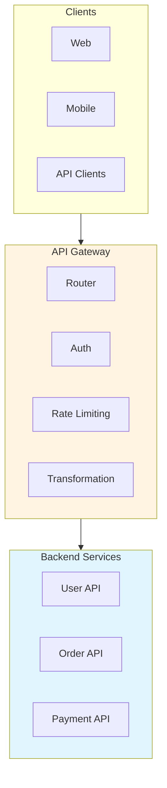

# API Gateway Architecture: Best Practices

**Objective**: Establish comprehensive API gateway architecture patterns for routing, security, rate limiting, and API management. When you need API gateway design, when you want unified API entry points, when you need API management—this guide provides the complete framework.

## Introduction

API gateways are the entry point for all API traffic, providing routing, security, rate limiting, and observability. This guide establishes patterns for API gateway architecture, routing strategies, and API management.

**What This Guide Covers**:
- API gateway patterns and topologies
- Routing and load balancing
- Authentication and authorization
- Rate limiting and throttling
- API versioning and routing
- Request/response transformation
- Circuit breakers and retries
- Observability and monitoring

**Prerequisites**:
- Understanding of API design and HTTP protocols
- Familiarity with reverse proxies and load balancers
- Experience with API management

**Related Documents**:
This document integrates with:
- **[API Governance, Backward Compatibility Rules, and Cross-Language Interface Stability](api-governance-interface-stability.md)** - API governance
- **[System Resilience, Rate Limiting, Concurrency Control & Backpressure](../operations-monitoring/system-resilience-and-concurrency.md)** - Resilience patterns
- **[Cross-Domain Identity Federation, AuthZ/AuthN Architecture & Identity Propagation Models](../security/identity-federation-authz-authn-architecture.md)** - Identity patterns

## The Philosophy of API Gateway Architecture

### Gateway Principles

**Principle 1: Single Entry Point**
- Unified API access
- Consistent security
- Centralized routing

**Principle 2: Cross-Cutting Concerns**
- Authentication
- Rate limiting
- Observability

**Principle 3: Backend Abstraction**
- Hide internal services
- Version management
- Service discovery

## API Gateway Architecture

### Gateway Topology

**Diagram**:


## Routing Strategies

### Path-Based Routing

**Pattern**:
```yaml
# Path-based routing
routing:
  rules:
    - path: "/api/v1/users/*"
      service: "user-service"
    - path: "/api/v1/orders/*"
      service: "order-service"
    - path: "/api/v1/payments/*"
      service: "payment-service"
```

## Architecture Fitness Functions

### Gateway Fitness Function

**Definition**:
```python
# Gateway fitness function
class GatewayFitnessFunction:
    def evaluate(self, gateway: Gateway) -> float:
        """Evaluate gateway quality"""
        # Check routing efficiency
        routing_efficiency = self.check_routing_efficiency(gateway)
        
        # Check security coverage
        security_coverage = self.check_security_coverage(gateway)
        
        # Check observability
        observability = self.check_observability(gateway)
        
        # Calculate fitness
        fitness = (routing_efficiency * 0.4) + \
                  (security_coverage * 0.3) + \
                  (observability * 0.3)
        
        return fitness
```

## See Also

- **[API Governance, Backward Compatibility Rules, and Cross-Language Interface Stability](api-governance-interface-stability.md)** - API governance
- **[System Resilience, Rate Limiting, Concurrency Control & Backpressure](../operations-monitoring/system-resilience-and-concurrency.md)** - Resilience
- **[Cross-Domain Identity Federation, AuthZ/AuthN Architecture & Identity Propagation Models](../security/identity-federation-authz-authn-architecture.md)** - Identity

---

*This guide establishes comprehensive API gateway patterns. Start with routing, extend to security, and continuously optimize for performance.*

