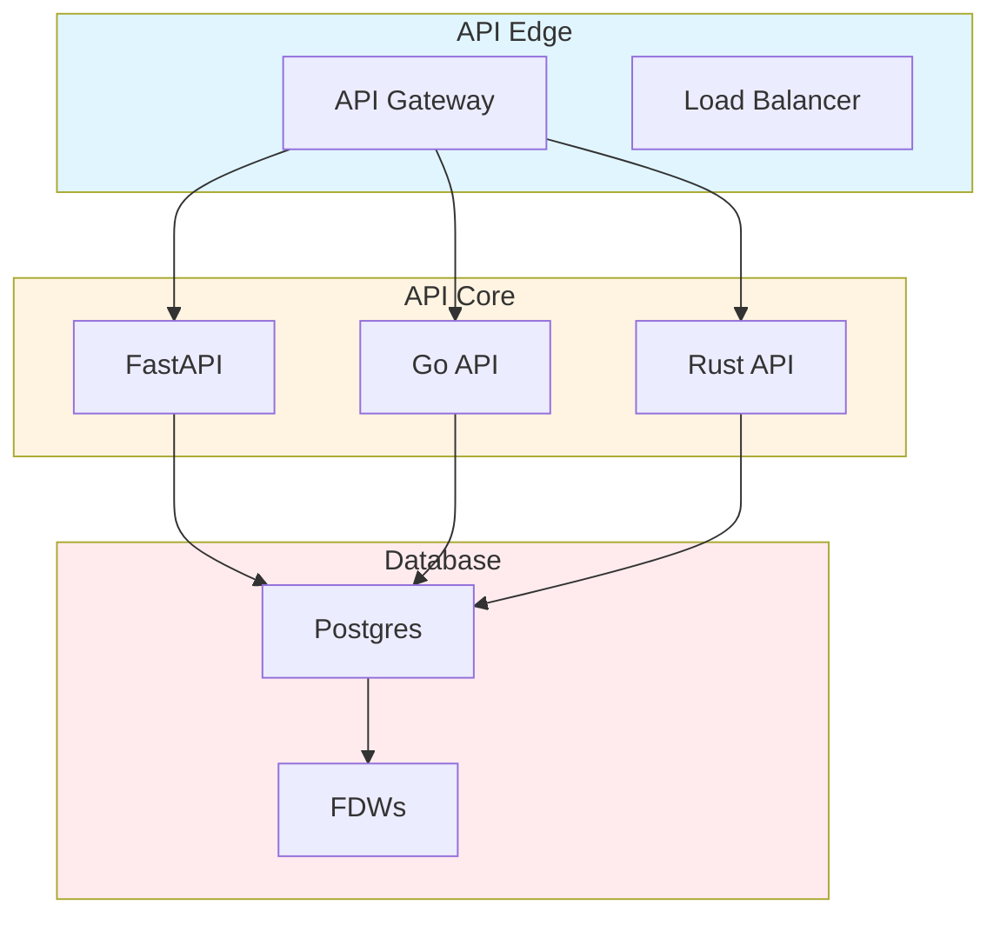
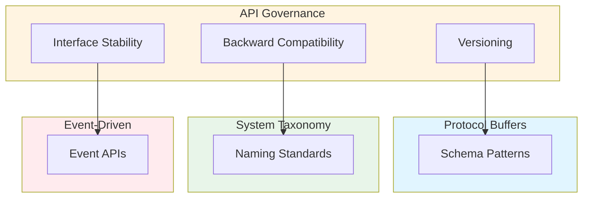

# API Governance, Backward Compatibility Rules, and Cross-Language Interface Stability: Best Practices

**Objective**: Establish comprehensive API governance that ensures backward compatibility, interface stability, and consistent patterns across Python, Go, Rust, and Postgres APIs. When you need API versioning, when you want interface stability, when you need cross-language coherence—this guide provides the complete framework.

## Introduction

API governance is the foundation of stable, evolvable distributed systems. Without unified API standards, interfaces fragment, breaking changes proliferate, and system integration becomes fragile. This guide establishes patterns for API versioning, backward compatibility, and cross-language interface stability.

**What This Guide Covers**:
- REST, gRPC, GraphQL, WebSocket governance
- OpenAPI → protobuf → JSON-schema coherence rules
- Breaking vs non-breaking change policies
- Golden-path versioning examples
- API edge → core → database flow
- Fitness functions: stability, breakage detection, contract health

**Prerequisites**:
- Understanding of API design and versioning
- Familiarity with REST, gRPC, GraphQL, and WebSocket protocols
- Experience with interface evolution and backward compatibility

**Related Documents**:
This document integrates with:
- **[Protocol Buffers with Python](protobuf-python.md)** - Protobuf patterns
- **[System-Wide Naming, Taxonomy, and Structural Vocabulary Governance](system-taxonomy-governance.md)** - Naming standards
- **[Event-Driven Architecture](event-driven-architecture.md)** - Event API patterns
- **[API Development](../python/api-development.md)** - Python API patterns

## The Philosophy of API Governance

### API Principles

**Principle 1: Backward Compatibility**
- Never break existing clients
- Version new features
- Deprecate gracefully

**Principle 2: Interface Stability**
- Stable contracts
- Clear versioning
- Predictable evolution

**Principle 3: Cross-Language Coherence**
- Consistent patterns
- Unified schemas
- Shared contracts

## API Versioning Strategies

### Semantic Versioning

**Pattern**:
```yaml
# API versioning
api_versioning:
  strategy: "semver"
  format: "v{major}.{minor}.{patch}"
  rules:
    major: "breaking changes"
    minor: "backward-compatible additions"
    patch: "bug fixes"
```

### URL Versioning

**Pattern**:
```python
# URL versioning
from fastapi import APIRouter

v1_router = APIRouter(prefix="/api/v1")
v2_router = APIRouter(prefix="/api/v2")

@v1_router.get("/users")
async def get_users_v1():
    """V1 endpoint"""
    return {"version": "v1", "users": []}

@v2_router.get("/users")
async def get_users_v2():
    """V2 endpoint"""
    return {"version": "v2", "users": []}
```

### Header Versioning

**Pattern**:
```python
# Header versioning
from fastapi import Header

@app.get("/users")
async def get_users(api_version: str = Header(..., alias="API-Version")):
    """Versioned endpoint"""
    if api_version == "v1":
        return get_users_v1()
    elif api_version == "v2":
        return get_users_v2()
    else:
        raise HTTPException(status_code=400, detail="Unsupported version")
```

## REST API Governance

### RESTful Design

**Pattern**:
```python
# RESTful API design
from fastapi import FastAPI, HTTPException

app = FastAPI()

@app.get("/api/v1/users")
async def list_users():
    """List users"""
    return {"users": []}

@app.get("/api/v1/users/{user_id}")
async def get_user(user_id: int):
    """Get user"""
    return {"id": user_id, "name": "Alice"}

@app.post("/api/v1/users")
async def create_user(user: User):
    """Create user"""
    return {"id": 1, **user.dict()}

@app.put("/api/v1/users/{user_id}")
async def update_user(user_id: int, user: User):
    """Update user"""
    return {"id": user_id, **user.dict()}

@app.delete("/api/v1/users/{user_id}")
async def delete_user(user_id: int):
    """Delete user"""
    return {"status": "deleted"}
```

### OpenAPI Specification

**Pattern**:
```yaml
# OpenAPI specification
openapi: 3.0.0
info:
  title: User API
  version: 1.0.0
paths:
  /api/v1/users:
    get:
      summary: List users
      responses:
        '200':
          description: Success
          content:
            application/json:
              schema:
                type: object
                properties:
                  users:
                    type: array
                    items:
                      $ref: '#/components/schemas/User'
```

## gRPC API Governance

### Protocol Buffers

**Pattern**:
```protobuf
// Protocol buffer definition
syntax = "proto3";

package api.v1;

service UserService {
  rpc GetUser(GetUserRequest) returns (User);
  rpc ListUsers(ListUsersRequest) returns (ListUsersResponse);
  rpc CreateUser(CreateUserRequest) returns (User);
  rpc UpdateUser(UpdateUserRequest) returns (User);
  rpc DeleteUser(DeleteUserRequest) returns (DeleteUserResponse);
}

message User {
  int32 id = 1;
  string name = 2;
  string email = 3;
}
```

### gRPC Versioning

**Pattern**:
```protobuf
// gRPC versioning
package api.v2;

service UserService {
  rpc GetUser(GetUserRequest) returns (User);
  // New fields added, old fields deprecated
}

message User {
  int32 id = 1;
  string name = 2;
  string email = 3;
  string phone = 4 [deprecated = true];  // Deprecated in v2
  string mobile = 5;  // New in v2
}
```

## GraphQL API Governance

### GraphQL Schema

**Pattern**:
```graphql
# GraphQL schema
type User {
  id: ID!
  name: String!
  email: String!
  createdAt: DateTime!
}

type Query {
  user(id: ID!): User
  users(limit: Int, offset: Int): [User!]!
}

type Mutation {
  createUser(input: CreateUserInput!): User!
  updateUser(id: ID!, input: UpdateUserInput!): User!
  deleteUser(id: ID!): Boolean!
}
```

### GraphQL Versioning

**Pattern**:
```graphql
# GraphQL versioning via schema evolution
type User {
  id: ID!
  name: String!
  email: String!
  phone: String @deprecated(reason: "Use mobile instead")
  mobile: String
}
```

## WebSocket API Governance

### WebSocket Protocol

**Pattern**:
```python
# WebSocket API
from fastapi import WebSocket

@app.websocket("/ws/v1/chat")
async def websocket_endpoint(websocket: WebSocket):
    """WebSocket endpoint"""
    await websocket.accept()
    
    while True:
        data = await websocket.receive_text()
        # Process message
        await websocket.send_text(f"Echo: {data}")
```

## Schema Coherence Rules

### OpenAPI → Protobuf → JSON Schema

**Coherence Pattern**:
```yaml
# Schema coherence
schema_coherence:
  source: "openapi"
  targets:
    - "protobuf"
    - "json_schema"
  rules:
    - "field_names_match"
    - "types_consistent"
    - "required_fields_consistent"
```

## Breaking vs Non-Breaking Changes

### Breaking Changes

**Definition**:
```yaml
# Breaking changes
breaking_changes:
  - "removing fields"
  - "changing field types"
  - "removing endpoints"
  - "changing authentication"
  - "changing response formats"
```

### Non-Breaking Changes

**Definition**:
```yaml
# Non-breaking changes
non_breaking_changes:
  - "adding new fields"
  - "adding new endpoints"
  - "adding optional parameters"
  - "extending enums"
```

## Deprecation Policies

### Deprecation Process

**Pattern**:
```python
# Deprecation process
from fastapi import Depends
from warnings import warn

@app.get("/api/v1/users")
async def get_users(deprecated: bool = False):
    """Deprecated endpoint"""
    if not deprecated:
        warn(
            "This endpoint is deprecated. Use /api/v2/users instead.",
            DeprecationWarning,
            stacklevel=2
        )
    return {"users": []}
```

## API Edge → Core → Database Flow

**Flow Diagram**:


## Architecture Fitness Functions

### API Stability Fitness Function

**Definition**:
```python
# API stability fitness function
class APIStabilityFitnessFunction:
    def evaluate(self, api: API) -> float:
        """Evaluate API stability"""
        # Calculate breaking change rate
        breaking_changes = self.count_breaking_changes(api)
        total_changes = self.count_total_changes(api)
        
        if total_changes == 0:
            stability = 1.0
        else:
            stability = 1.0 - (breaking_changes / total_changes)
        
        return stability
```

### Breakage Detection Fitness Function

**Definition**:
```python
# Breakage detection fitness function
class BreakageDetectionFitnessFunction:
    def evaluate(self, api: API) -> float:
        """Evaluate breakage detection"""
        # Check for breakage detection
        breakage_detected = self.detect_breakage(api)
        
        if breakage_detected:
            # Calculate detection score
            detection_score = self.calculate_detection_score(api)
            return detection_score
        else:
            return 1.0
```

### Contract Health Fitness Function

**Definition**:
```python
# Contract health fitness function
class ContractHealthFitnessFunction:
    def evaluate(self, api: API) -> float:
        """Evaluate contract health"""
        # Check contract coherence
        coherence_score = self.check_coherence(api)
        
        # Check versioning compliance
        versioning_score = self.check_versioning(api)
        
        # Check deprecation compliance
        deprecation_score = self.check_deprecation(api)
        
        # Calculate fitness
        fitness = (coherence_score * 0.4) + \
                  (versioning_score * 0.3) + \
                  (deprecation_score * 0.3)
        
        return fitness
```

## Cross-Document Architecture



## Checklists

### API Governance Checklist

- [ ] Versioning strategy defined
- [ ] REST API governance established
- [ ] gRPC API governance established
- [ ] GraphQL API governance established
- [ ] WebSocket API governance established
- [ ] Schema coherence rules defined
- [ ] Breaking change policies documented
- [ ] Deprecation policies implemented
- [ ] API flow documented
- [ ] Fitness functions defined
- [ ] Regular API reviews scheduled

## Anti-Patterns

### API Anti-Patterns

**Breaking Changes Without Versioning**:
```python
# Bad: Breaking change without versioning
@app.get("/api/users")
async def get_users():
    # Changed response format - breaks clients!
    return {"data": {"users": []}}

# Good: Versioned breaking change
@app.get("/api/v2/users")
async def get_users_v2():
    return {"data": {"users": []}}
```

## See Also

- **[Protocol Buffers with Python](protobuf-python.md)** - Protobuf patterns
- **[System-Wide Naming, Taxonomy, and Structural Vocabulary Governance](system-taxonomy-governance.md)** - Naming standards
- **[Event-Driven Architecture](event-driven-architecture.md)** - Event API patterns
- **[API Development](../python/api-development.md)** - Python API patterns

---

*This guide establishes comprehensive API governance patterns. Start with versioning, extend to backward compatibility, and continuously maintain interface stability.*

