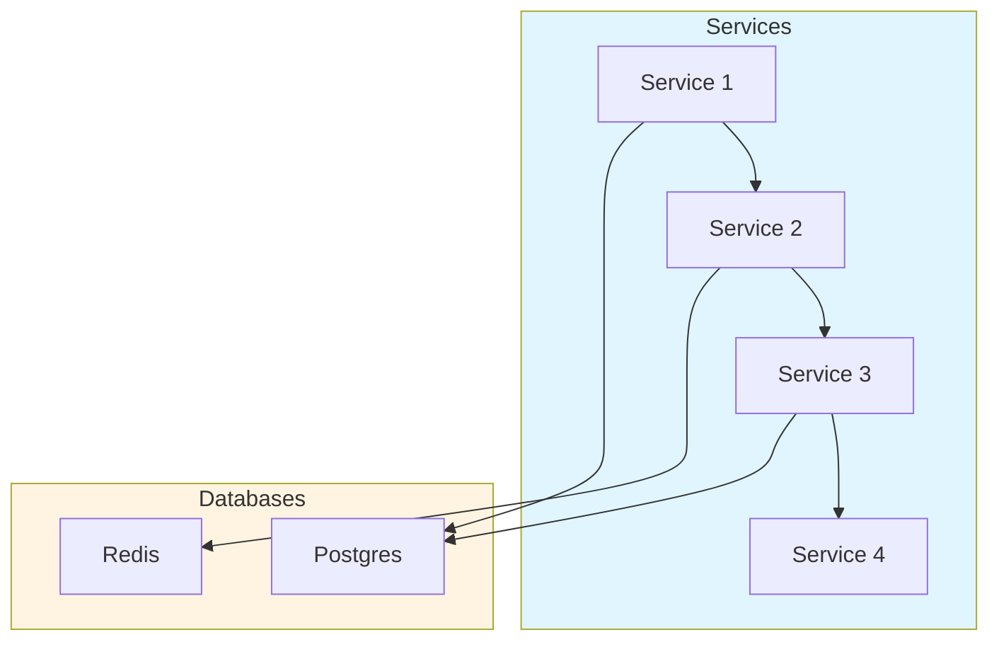
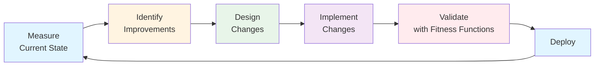

# Architectural Fitness Functions and Governance: Measuring and Evolving Architecture Quality

**Objective**: Master production-grade architectural fitness functions and governance across distributed systems, databases, ML pipelines, and polyglot microservices. When you need to measure, evaluate, monitor, and evolve architecture quality—this guide provides complete patterns and implementations.

## Introduction

Architectural fitness functions are measurable, automatable tests that ensure architecture aligns with desired qualities. Unlike unit tests that verify functionality, fitness functions verify architectural characteristics such as modularity, coupling, latency, and domain boundaries. This guide provides a complete framework for implementing continuous architecture governance.

**What This Guide Covers**:
- Architectural characteristics and qualities
- Fitness function categories and implementations
- Continuous Architecture (CA) discipline
- Architecture governance without bureaucracy
- Fitness functions for each subsystem
- Architecture observability and dashboards
- Anti-patterns and architectural debt
- End-to-end architectural evolution
- Agentic LLM integration for architecture

**Prerequisites**:
- Understanding of software architecture and design patterns
- Familiarity with distributed systems and microservices
- Experience with CI/CD and automated testing

## Architectural Characteristics (The Qualities That Define Good Systems)

### Modularity

**Definition**: System divided into cohesive, loosely-coupled modules.

**Example**: Postgres schema modularity
```sql
-- Good: Modular schema design
CREATE SCHEMA users;
CREATE SCHEMA orders;
CREATE SCHEMA payments;

-- Each schema is self-contained with clear boundaries
```

**Fitness Function**:
```python
# fitness_functions/modularity.py
def test_schema_modularity():
    """Ensure schemas don't have excessive cross-schema dependencies"""
    cross_schema_deps = count_cross_schema_dependencies()
    assert cross_schema_deps < 10, f"Too many cross-schema dependencies: {cross_schema_deps}"
```

### Cohesion & Coupling

**Cohesion**: Elements within a module work together.

**Coupling**: Dependencies between modules.

**Example**: Microservice coupling
```python
# Good: Low coupling
class UserService:
    def get_user(self, user_id: str):
        # Self-contained, no direct DB access
        return self.user_repository.find(user_id)

# Bad: High coupling
class UserService:
    def get_user(self, user_id: str):
        # Direct database access, tight coupling
        return db.execute("SELECT * FROM users WHERE id = %s", user_id)
```

**Fitness Function**:
```python
# fitness_functions/coupling.py
def test_service_coupling():
    """Ensure services don't have excessive dependencies"""
    dependency_graph = build_dependency_graph()
    max_dependencies = max(len(deps) for deps in dependency_graph.values())
    assert max_dependencies < 5, f"Service has too many dependencies: {max_dependencies}"
```

### Resilience

**Definition**: System's ability to recover from failures.

**Example**: Circuit breaker pattern
```python
# Resilience pattern
from circuitbreaker import circuit

@circuit(failure_threshold=5, recovery_timeout=60)
def call_external_service():
    """Resilient service call with circuit breaker"""
    return external_service.call()
```

**Fitness Function**:
```python
# fitness_functions/resilience.py
def test_circuit_breaker_coverage():
    """Ensure all external calls have circuit breakers"""
    external_calls = find_external_service_calls()
    protected_calls = find_circuit_breaker_protected_calls()
    coverage = len(protected_calls) / len(external_calls)
    assert coverage > 0.9, f"Circuit breaker coverage too low: {coverage}"
```

### Observability

**Definition**: Ability to understand system behavior from external outputs.

**Example**: Structured logging
```python
# Observability pattern
import structlog

logger = structlog.get_logger()

def process_request(request):
    logger.info("request_received", request_id=request.id, user_id=request.user_id)
    # Process request
    logger.info("request_processed", request_id=request.id, duration=duration)
```

**Fitness Function**:
```python
# fitness_functions/observability.py
def test_logging_coverage():
    """Ensure critical paths have logging"""
    critical_functions = find_critical_functions()
    logged_functions = find_logged_functions()
    coverage = len(logged_functions) / len(critical_functions)
    assert coverage > 0.8, f"Logging coverage too low: {coverage}"
```

### Scalability

**Definition**: System's ability to handle increased load.

**Example**: Horizontal scaling
```yaml
# Kubernetes HPA for scalability
apiVersion: autoscaling/v2
kind: HorizontalPodAutoscaler
metadata:
  name: app-hpa
spec:
  scaleTargetRef:
    apiVersion: apps/v1
    kind: Deployment
    name: app
  minReplicas: 2
  maxReplicas: 10
  metrics:
    - type: Resource
      resource:
        name: cpu
        target:
          type: Utilization
          averageUtilization: 70
```

**Fitness Function**:
```python
# fitness_functions/scalability.py
def test_horizontal_scaling():
    """Ensure services support horizontal scaling"""
    deployments = get_kubernetes_deployments()
    for deployment in deployments:
        assert deployment.replicas >= 2, f"{deployment.name} not horizontally scalable"
        assert has_hpa(deployment), f"{deployment.name} missing HPA"
```

### Data Integrity

**Definition**: Data remains accurate and consistent.

**Example**: Transaction boundaries
```python
# Data integrity pattern
@transactional
def transfer_funds(from_account, to_account, amount):
    """Atomic fund transfer"""
    from_account.debit(amount)
    to_account.credit(amount)
```

**Fitness Function**:
```python
# fitness_functions/data_integrity.py
def test_transaction_coverage():
    """Ensure data modifications are transactional"""
    data_modifications = find_data_modifications()
    transactional_modifications = find_transactional_modifications()
    coverage = len(transactional_modifications) / len(data_modifications)
    assert coverage > 0.95, f"Transaction coverage too low: {coverage}"
```

### Domain Isolation

**Definition**: Clear boundaries between business domains.

**Example**: Bounded contexts
```python
# Domain isolation
class UserDomain:
    """User domain with clear boundaries"""
    def create_user(self, user_data):
        # User domain logic only
        pass

class OrderDomain:
    """Order domain with clear boundaries"""
    def create_order(self, order_data):
        # Order domain logic only
        pass
```

**Fitness Function**:
```python
# fitness_functions/domain_isolation.py
def test_domain_boundaries():
    """Ensure domains don't leak into each other"""
    user_domain_code = get_domain_code("user")
    order_domain_code = get_domain_code("order")
    
    # Check for domain leakage
    user_in_order = check_code_references(user_domain_code, order_domain_code)
    assert not user_in_order, "Domain boundary violation detected"
```

### Interface Contract Strength

**Definition**: Well-defined, versioned interfaces between components.

**Example**: API versioning
```python
# Strong interface contract
from pydantic import BaseModel

class UserV1(BaseModel):
    id: int
    name: str

class UserV2(BaseModel):
    id: int
    name: str
    email: str  # Backward compatible addition
```

**Fitness Function**:
```python
# fitness_functions/interface_contracts.py
def test_api_versioning():
    """Ensure APIs are versioned"""
    api_endpoints = get_api_endpoints()
    versioned_endpoints = [ep for ep in api_endpoints if has_version(ep)]
    coverage = len(versioned_endpoints) / len(api_endpoints)
    assert coverage > 0.9, f"API versioning coverage too low: {coverage}"
```

### Latency Paths & Tail Tolerance

**Definition**: System handles latency spikes gracefully.

**Example**: Timeout and retry
```python
# Latency tolerance
from tenacity import retry, stop_after_attempt, wait_exponential

@retry(stop=stop_after_attempt(3), wait=wait_exponential(multiplier=1, min=4, max=10))
def call_service_with_retry():
    """Service call with exponential backoff"""
    return service.call()
```

**Fitness Function**:
```python
# fitness_functions/latency.py
def test_p95_latency():
    """Ensure P95 latency is within SLA"""
    latency_metrics = get_latency_metrics()
    p95_latency = calculate_percentile(latency_metrics, 95)
    assert p95_latency < 500, f"P95 latency too high: {p95_latency}ms"
```

### Time-Governance Architecture

**Definition**: Consistent time handling across system.

**Example**: NTP synchronization
```python
# Time governance
from datetime import datetime
import ntplib

def get_synchronized_time():
    """Get NTP-synchronized time"""
    ntp_client = ntplib.NTPClient()
    response = ntp_client.request('pool.ntp.org')
    return datetime.fromtimestamp(response.tx_time)
```

**Fitness Function**:
```python
# fitness_functions/time_governance.py
def test_time_synchronization():
    """Ensure all nodes are time-synchronized"""
    nodes = get_cluster_nodes()
    for node in nodes:
        time_skew = get_time_skew(node)
        assert time_skew < 0.1, f"Node {node} time skew too high: {time_skew}s"
```

### Predictability

**Definition**: System behavior is consistent and deterministic.

**Example**: Idempotent operations
```python
# Predictable, idempotent operation
def create_user(user_id: str, user_data: dict):
    """Idempotent user creation"""
    if user_exists(user_id):
        return get_user(user_id)
    return create_new_user(user_id, user_data)
```

**Fitness Function**:
```python
# fitness_functions/predictability.py
def test_idempotency():
    """Ensure critical operations are idempotent"""
    critical_operations = find_critical_operations()
    idempotent_operations = find_idempotent_operations()
    coverage = len(idempotent_operations) / len(critical_operations)
    assert coverage > 0.8, f"Idempotency coverage too low: {coverage}"
```

### Component Autonomy

**Definition**: Components can operate independently.

**Example**: Stateless services
```python
# Autonomous, stateless service
class StatelessService:
    def process_request(self, request):
        # No shared state, fully autonomous
        return self.process(request)
```

**Fitness Function**:
```python
# fitness_functions/autonomy.py
def test_stateless_services():
    """Ensure services are stateless"""
    services = get_services()
    for service in services:
        assert is_stateless(service), f"Service {service.name} is not stateless"
```

### Complexity Management

**Definition**: System complexity is controlled and measurable.

**Example**: Cyclomatic complexity limits
```python
# Complexity management
def simple_function(data):
    """Low complexity function"""
    if data:
        return process(data)
    return None

# Bad: High complexity
def complex_function(data):
    """High complexity function - should be refactored"""
    if data:
        if data.type == "A":
            if data.value > 10:
                # ... many nested conditions
                pass
```

**Fitness Function**:
```python
# fitness_functions/complexity.py
def test_cyclomatic_complexity():
    """Ensure functions don't exceed complexity threshold"""
    functions = get_all_functions()
    for func in functions:
        complexity = calculate_cyclomatic_complexity(func)
        assert complexity < 10, f"Function {func.name} too complex: {complexity}"
```

## Architectural Fitness Functions

### What Are Fitness Functions?

**Fitness Function**: A measurable, automatable test that ensures architecture aligns with desired qualities.

**Key Properties**:
- **Measurable**: Produces quantitative results
- **Automatable**: Can run in CI/CD
- **Architectural**: Tests architecture, not functionality
- **Evolutionary**: Enables architecture to evolve safely

### Structural Fitness Functions

**Purpose**: Verify architectural structure and boundaries.

**Example: Boundary Integrity**:
```python
# fitness_functions/structural/boundary_integrity.py
def test_layer_boundaries():
    """Ensure layers don't violate boundaries"""
    # Presentation layer should not import from data layer
    presentation_imports = get_imports("presentation")
    data_layer_imports = [imp for imp in presentation_imports if "data" in imp]
    assert len(data_layer_imports) == 0, f"Boundary violation: {data_layer_imports}"
```

**Example: Module Dependency Limits**:
```python
# fitness_functions/structural/dependency_limits.py
def test_module_dependencies():
    """Ensure modules don't have excessive dependencies"""
    modules = get_modules()
    for module in modules:
        dependencies = get_dependencies(module)
        assert len(dependencies) < 10, f"Module {module} has too many dependencies: {len(dependencies)}"
```

### Behavioral Fitness Functions

**Purpose**: Verify system behavior and performance.

**Example: Latency Ceilings**:
```python
# fitness_functions/behavioral/latency.py
def test_api_latency():
    """Ensure API latency is within SLA"""
    endpoints = get_api_endpoints()
    for endpoint in endpoints:
        latency = measure_latency(endpoint)
        assert latency.p95 < 500, f"Endpoint {endpoint} P95 latency too high: {latency.p95}ms"
```

**Example: Throughput Floors**:
```python
# fitness_functions/behavioral/throughput.py
def test_throughput():
    """Ensure system meets minimum throughput"""
    throughput = measure_throughput()
    assert throughput > 1000, f"Throughput too low: {throughput} req/s"
```

**Example: Tail-Latency Guarantees**:
```python
# fitness_functions/behavioral/tail_latency.py
def test_tail_latency():
    """Ensure P99 latency is acceptable"""
    latency_metrics = get_latency_metrics()
    p99_latency = calculate_percentile(latency_metrics, 99)
    assert p99_latency < 1000, f"P99 latency too high: {p99_latency}ms"
```

### Data Fitness Functions

**Purpose**: Verify data quality and integrity.

**Example: Schema Drift Detection**:
```python
# fitness_functions/data/schema_drift.py
def test_schema_consistency():
    """Ensure schemas don't drift"""
    expected_schema = load_expected_schema()
    actual_schema = get_actual_schema()
    
    drift = calculate_schema_drift(expected_schema, actual_schema)
    assert drift < 0.1, f"Schema drift detected: {drift}"
```

**Example: Data Quality**:
```python
# fitness_functions/data/quality.py
def test_data_quality():
    """Ensure data meets quality standards"""
    data = load_data()
    
    # Check null rates
    null_rates = calculate_null_rates(data)
    for column, rate in null_rates.items():
        assert rate < 0.05, f"Column {column} has too many nulls: {rate}"
    
    # Check value ranges
    ranges = get_expected_ranges()
    for column, expected_range in ranges.items():
        actual_range = get_actual_range(data[column])
        assert actual_range.within(expected_range), f"Column {column} out of range"
```

### Security Fitness Functions

**Purpose**: Verify security posture.

**Example: Dependency Scanning**:
```python
# fitness_functions/security/dependencies.py
def test_dependency_vulnerabilities():
    """Ensure no known vulnerabilities in dependencies"""
    vulnerabilities = scan_dependencies()
    critical_vulns = [v for v in vulnerabilities if v.severity == "critical"]
    assert len(critical_vulns) == 0, f"Critical vulnerabilities found: {critical_vulns}"
```

**Example: Secret Detection**:
```python
# fitness_functions/security/secrets.py
def test_secret_exposure():
    """Ensure no secrets in code"""
    secrets = scan_for_secrets()
    assert len(secrets) == 0, f"Secrets found in code: {secrets}"
```

### Resilience Fitness Functions

**Purpose**: Verify system resilience.

**Example: Circuit Breaker Coverage**:
```python
# fitness_functions/resilience/circuit_breakers.py
def test_circuit_breaker_coverage():
    """Ensure external calls have circuit breakers"""
    external_calls = find_external_calls()
    protected_calls = find_circuit_breaker_protected_calls()
    coverage = len(protected_calls) / len(external_calls)
    assert coverage > 0.9, f"Circuit breaker coverage too low: {coverage}"
```

**Example: Retry Logic**:
```python
# fitness_functions/resilience/retry.py
def test_retry_coverage():
    """Ensure transient failures have retry logic"""
    external_calls = find_external_calls()
    retry_protected = find_retry_protected_calls()
    coverage = len(retry_protected) / len(external_calls)
    assert coverage > 0.8, f"Retry coverage too low: {coverage}"
```

### ML Reproducibility Fitness Functions

**Purpose**: Verify ML model reproducibility.

**Example: Model Signature Validation**:
```python
# fitness_functions/ml/reproducibility.py
def test_model_signature_consistency():
    """Ensure model signatures are consistent"""
    model_versions = get_model_versions()
    for version in model_versions:
        signature = get_model_signature(version)
        expected_signature = get_expected_signature()
        assert signature == expected_signature, f"Model {version} signature mismatch"
```

**Example: Feature Parity**:
```python
# fitness_functions/ml/feature_parity.py
def test_feature_parity():
    """Ensure training and inference features match"""
    training_features = get_training_features()
    inference_features = get_inference_features()
    
    assert set(training_features) == set(inference_features), "Feature mismatch"
```

### Geospatial Consistency Fitness Functions

**Purpose**: Verify geospatial data consistency.

**Example: CRS Consistency**:
```python
# fitness_functions/geospatial/crs_consistency.py
def test_crs_consistency():
    """Ensure all geometries use consistent CRS"""
    geometries = get_geometries()
    crs_counts = count_crs(geometries)
    
    # Should have one dominant CRS
    dominant_crs_ratio = max(crs_counts.values()) / sum(crs_counts.values())
    assert dominant_crs_ratio > 0.95, f"CRS inconsistency: {crs_counts}"
```

**Example: Geometry Validity**:
```python
# fitness_functions/geospatial/validity.py
def test_geometry_validity():
    """Ensure all geometries are valid"""
    geometries = get_geometries()
    invalid = [g for g in geometries if not g.is_valid]
    
    invalid_ratio = len(invalid) / len(geometries)
    assert invalid_ratio < 0.01, f"Too many invalid geometries: {invalid_ratio}"
```

### API Stability Fitness Functions

**Purpose**: Verify API contract stability.

**Example: Breaking Change Detection**:
```python
# fitness_functions/api/stability.py
def test_api_breaking_changes():
    """Ensure no breaking API changes"""
    current_api = get_current_api_schema()
    previous_api = get_previous_api_schema()
    
    breaking_changes = detect_breaking_changes(current_api, previous_api)
    assert len(breaking_changes) == 0, f"Breaking changes detected: {breaking_changes}"
```

**Example: Version Compatibility**:
```python
# fitness_functions/api/versioning.py
def test_api_versioning():
    """Ensure APIs are properly versioned"""
    endpoints = get_api_endpoints()
    versioned_endpoints = [ep for ep in endpoints if has_version(ep)]
    
    coverage = len(versioned_endpoints) / len(endpoints)
    assert coverage > 0.9, f"API versioning coverage too low: {coverage}"
```

### Governance Fitness Functions

**Purpose**: Verify architectural governance.

**Example: ADR Consistency**:
```python
# fitness_functions/governance/adr.py
def test_adr_consistency():
    """Ensure ADRs are consistent with implementation"""
    adrs = load_adrs()
    implementations = get_implementations()
    
    for adr in adrs:
        implementation = find_implementation(adr)
        assert implementation.matches(adr), f"ADR {adr.id} not consistent with implementation"
```

**Example: Versioning Discipline**:
```python
# fitness_functions/governance/versioning.py
def test_versioning_discipline():
    """Ensure all components are versioned"""
    components = get_components()
    versioned_components = [c for c in components if has_version(c)]
    
    coverage = len(versioned_components) / len(components)
    assert coverage > 0.95, f"Versioning coverage too low: {coverage}"
```

**Example: Repo Structure Consistency**:
```python
# fitness_functions/governance/repo_structure.py
def test_repo_structure():
    """Ensure repos follow standard structure"""
    repos = get_repos()
    for repo in repos:
        structure = get_repo_structure(repo)
        expected_structure = get_standard_structure()
        
        drift = calculate_structure_drift(structure, expected_structure)
        assert drift < 0.1, f"Repo {repo} structure drift: {drift}"
```

## Continuous Architecture (CA) Overview

### Architecture as Continuously Validated Asset

**Principle**: Architecture is not a one-time design, but a continuously evolving, validated asset.

**Practice**:
- Fitness functions run in CI/CD
- Architecture metrics tracked over time
- Architectural decisions validated continuously
- Drift detected and remediated automatically

### Small, Iterative Architectural Experiments

**Principle**: Make small architectural changes, measure impact, iterate.

**Practice**:
- Feature flags for architectural changes
- A/B testing architectural patterns
- Gradual migration strategies
- Rollback capabilities

### Architecture Measurement in CI/CD

**Integration**:
```yaml
# .github/workflows/architecture-fitness.yml
name: Architecture Fitness
on: [push, pull_request]

jobs:
  fitness:
    runs-on: ubuntu-latest
    steps:
      - uses: actions/checkout@v3
      - name: Run Fitness Functions
        run: |
          pytest fitness_functions/
      - name: Generate Architecture Report
        run: |
          python scripts/generate_architecture_report.py
```

### Architectural Drift Detection

**Drift Types**:
- **Structural Drift**: Architecture diverges from intended design
- **Behavioral Drift**: Performance characteristics degrade
- **Governance Drift**: Policies not followed

**Detection**:
```python
# drift_detection/architectural_drift.py
class ArchitecturalDriftDetector:
    def detect_drift(self, baseline: dict, current: dict) -> dict:
        """Detect architectural drift"""
        drift = {
            'structural': self.detect_structural_drift(baseline, current),
            'behavioral': self.detect_behavioral_drift(baseline, current),
            'governance': self.detect_governance_drift(baseline, current)
        }
        return drift
```

### Architectural Technical Debt Tracking

**Debt Categories**:
- **Structural Debt**: Poor modularity, high coupling
- **Performance Debt**: Latency issues, scalability problems
- **Security Debt**: Vulnerabilities, weak security posture
- **Governance Debt**: Missing ADRs, inconsistent patterns

**Tracking**:
```python
# debt_tracking/architectural_debt.py
class ArchitecturalDebtTracker:
    def calculate_debt(self) -> dict:
        """Calculate architectural technical debt"""
        return {
            'structural': self.calculate_structural_debt(),
            'performance': self.calculate_performance_debt(),
            'security': self.calculate_security_debt(),
            'governance': self.calculate_governance_debt()
        }
```

### Evolutionary Adaptation

**Principle**: Architecture evolves based on fitness function feedback.

**Process**:
1. Measure current architecture
2. Identify improvement opportunities
3. Make small changes
4. Measure impact
5. Iterate

## Architecture Governance Without Bureaucracy

### Architectural Scorecards

**Scorecard Template**:
```yaml
# scorecards/architecture_scorecard.yaml
architecture_scorecard:
  component: "user-service"
  date: "2024-01-15"
  
  metrics:
    modularity: 8.5
    coupling: 7.0
    cohesion: 9.0
    resilience: 8.0
    observability: 7.5
    scalability: 8.0
  
  fitness_functions:
    - name: "boundary_integrity"
      status: "pass"
      score: 9.0
    - name: "latency_p95"
      status: "pass"
      score: 8.5
  
  recommendations:
    - "Reduce coupling with order-service"
    - "Add circuit breakers for external calls"
```

### Component Maturity Ratings

**Maturity Levels**:
- **Level 1 (Initial)**: Ad-hoc, no standards
- **Level 2 (Managed)**: Some standards, inconsistent
- **Level 3 (Defined)**: Standards defined, followed
- **Level 4 (Quantitatively Managed)**: Metrics-driven
- **Level 5 (Optimizing)**: Continuous improvement

**Rating**:
```python
# governance/maturity_rating.py
class ComponentMaturityRater:
    def rate_component(self, component: str) -> int:
        """Rate component maturity"""
        scores = {
            'standards': self.assess_standards(component),
            'metrics': self.assess_metrics(component),
            'automation': self.assess_automation(component),
            'documentation': self.assess_documentation(component)
        }
        
        average_score = sum(scores.values()) / len(scores)
        return int(average_score)  # 1-5 scale
```

### Quality Attribute Acceptance Criteria (QAAC)

**QAAC Template**:
```yaml
# qaac/quality_attributes.yaml
quality_attributes:
  availability:
    target: 99.9%
    measurement: "Uptime percentage"
    acceptance_criteria:
      - "Service available 99.9% of time"
      - "Automatic failover within 30 seconds"
  
  latency:
    target: "P95 < 500ms"
    measurement: "95th percentile response time"
    acceptance_criteria:
      - "P95 latency < 500ms"
      - "P99 latency < 1000ms"
  
  scalability:
    target: "Handle 10x load increase"
    measurement: "Throughput under load"
    acceptance_criteria:
      - "System handles 10x load with < 2x resources"
      - "No degradation in latency"
```

### Standard Architecture Review Cadence

**Review Schedule**:
- **Weekly**: Fitness function results review
- **Monthly**: Architecture scorecard review
- **Quarterly**: Comprehensive architecture review
- **Annually**: Architecture strategy review

**Review Process**:
1. Collect metrics
2. Analyze trends
3. Identify issues
4. Propose improvements
5. Track action items

### Golden Paths / Paved Roads

**Definition**: Standard, well-supported architectural patterns.

**Example**:
```yaml
# golden_paths/api_service.yaml
golden_path:
  name: "API Service"
  description: "Standard pattern for API services"
  
  components:
    - "FastAPI framework"
    - "Pydantic validation"
    - "Structured logging"
    - "Prometheus metrics"
    - "Circuit breakers"
  
  fitness_functions:
    - "test_api_versioning"
    - "test_latency_p95"
    - "test_circuit_breaker_coverage"
  
  templates:
    - "api-service-template"
```

### Architectural Guardrails

**Guardrails**: Automated enforcement of architectural rules.

**Example**:
```python
# guardrails/architectural_guardrails.py
class ArchitecturalGuardrails:
    def enforce_guardrails(self, change: dict) -> bool:
        """Enforce architectural guardrails"""
        # Check layer boundaries
        if not self.check_layer_boundaries(change):
            return False
        
        # Check dependency limits
        if not self.check_dependency_limits(change):
            return False
        
        # Check complexity limits
        if not self.check_complexity_limits(change):
            return False
        
        return True
```

### Architecture KPIs

**Data Pipelines**:
- Schema drift rate
- Data quality score
- Pipeline latency
- Failure rate

**Geospatial Processing**:
- Geometry validity rate
- CRS consistency
- Processing latency
- Tile generation time

**Postgres Clusters**:
- Replication lag
- Query performance
- Connection pool utilization
- WAL growth rate

**UI Architecture**:
- Component reusability
- Bundle size
- Load time
- User interaction latency

**Lakehouse Ingestion**:
- Ingestion latency
- Parquet file quality
- Metadata consistency
- Query performance

**ML Reproducibility**:
- Model signature consistency
- Feature parity
- Inference latency
- Prediction accuracy

## Creating Fitness Functions for This Ecosystem

### Postgres Fitness Functions

**Table Count Limits**:
```python
# fitness_functions/postgres/table_count.py
def test_schema_table_count():
    """Ensure schemas don't have excessive tables"""
    schemas = get_postgres_schemas()
    for schema in schemas:
        table_count = count_tables(schema)
        assert table_count < 50, f"Schema {schema} has too many tables: {table_count}"
```

**Relationship Density**:
```python
# fitness_functions/postgres/relationship_density.py
def test_relationship_density():
    """Ensure relationship density is reasonable"""
    tables = get_postgres_tables()
    for table in tables:
        relationships = count_relationships(table)
        density = relationships / count_columns(table)
        assert density < 0.5, f"Table {table} relationship density too high: {density}"
```

**WAL Growth Ceilings**:
```python
# fitness_functions/postgres/wal_growth.py
def test_wal_growth():
    """Ensure WAL growth is within limits"""
    wal_size = get_wal_size()
    wal_growth_rate = get_wal_growth_rate()
    
    assert wal_size < 100 * 1024 * 1024 * 1024, f"WAL size too large: {wal_size}"
    assert wal_growth_rate < 1 * 1024 * 1024 * 1024, f"WAL growth rate too high: {wal_growth_rate}"
```

**Geospatial Index Quality**:
```python
# fitness_functions/postgres/geospatial_index.py
def test_geospatial_index_quality():
    """Ensure geospatial indexes are effective"""
    spatial_tables = get_spatial_tables()
    for table in spatial_tables:
        index_usage = get_index_usage(table)
        assert index_usage > 0.8, f"Table {table} geospatial index usage too low: {index_usage}"
```

### Kubernetes Fitness Functions

**Pod Start Time SLA**:
```python
# fitness_functions/kubernetes/pod_startup.py
def test_pod_startup_time():
    """Ensure pods start within SLA"""
    pods = get_kubernetes_pods()
    for pod in pods:
        startup_time = measure_pod_startup_time(pod)
        assert startup_time < 30, f"Pod {pod.name} startup time too high: {startup_time}s"
```

**Service Dependency Graph Constraints**:
```python
# fitness_functions/kubernetes/dependency_graph.py
def test_service_dependencies():
    """Ensure service dependency graph is acyclic"""
    dependency_graph = build_service_dependency_graph()
    cycles = detect_cycles(dependency_graph)
    assert len(cycles) == 0, f"Cyclic dependencies detected: {cycles}"
```

**Maximum Hop Count**:
```python
# fitness_functions/kubernetes/hop_count.py
def test_interservice_hop_count():
    """Ensure interservice calls don't exceed hop limit"""
    service_calls = trace_service_calls()
    for call in service_calls:
        hop_count = count_hops(call)
        assert hop_count < 5, f"Service call {call} has too many hops: {hop_count}"
```

### Redis Fitness Functions

**Stream Lag Thresholds**:
```python
# fitness_functions/redis/stream_lag.py
def test_stream_lag():
    """Ensure Redis stream lag is within limits"""
    streams = get_redis_streams()
    for stream in streams:
        lag = get_stream_lag(stream)
        assert lag < 1000, f"Stream {stream} lag too high: {lag} messages"
```

**Memory Fragmentation**:
```python
# fitness_functions/redis/memory_fragmentation.py
def test_memory_fragmentation():
    """Ensure memory fragmentation is acceptable"""
    fragmentation = get_redis_memory_fragmentation()
    assert fragmentation < 1.5, f"Memory fragmentation too high: {fragmentation}"
```

### NiceGUI Fitness Functions

**UI Input → Backend Latency**:
```python
# fitness_functions/nicegui/latency.py
def test_ui_backend_latency():
    """Ensure UI to backend latency is acceptable"""
    ui_actions = get_ui_actions()
    for action in ui_actions:
        latency = measure_ui_backend_latency(action)
        assert latency < 200, f"UI action {action} latency too high: {latency}ms"
```

**Component Coupling Limits**:
```python
# fitness_functions/nicegui/coupling.py
def test_component_coupling():
    """Ensure UI components aren't overly coupled"""
    components = get_nicegui_components()
    for component in components:
        dependencies = get_component_dependencies(component)
        assert len(dependencies) < 5, f"Component {component} has too many dependencies: {len(dependencies)}"
```

### ML Inference Fitness Functions

**Model Load Time**:
```python
# fitness_functions/ml/load_time.py
def test_model_load_time():
    """Ensure model load time is acceptable"""
    models = get_ml_models()
    for model in models:
        load_time = measure_model_load_time(model)
        assert load_time < 5, f"Model {model} load time too high: {load_time}s"
```

**ONNX Shape Mismatch Detection**:
```python
# fitness_functions/ml/onnx_shape.py
def test_onnx_shape_consistency():
    """Ensure ONNX model shapes are consistent"""
    models = get_onnx_models()
    for model in models:
        input_shape = get_model_input_shape(model)
        expected_shape = get_expected_input_shape(model)
        assert input_shape == expected_shape, f"Model {model} shape mismatch"
```

**Reproducibility Confidence**:
```python
# fitness_functions/ml/reproducibility.py
def test_ml_reproducibility():
    """Ensure ML models are reproducible"""
    models = get_ml_models()
    for model in models:
        reproducibility_score = calculate_reproducibility_score(model)
        assert reproducibility_score > 0.95, f"Model {model} reproducibility too low: {reproducibility_score}"
```

### Data Pipeline Fitness Functions

**Schema Drift Fences**:
```python
# fitness_functions/pipelines/schema_drift.py
def test_schema_drift():
    """Ensure schemas don't drift beyond acceptable limits"""
    pipelines = get_data_pipelines()
    for pipeline in pipelines:
        drift = calculate_schema_drift(pipeline)
        assert drift < 0.1, f"Pipeline {pipeline} schema drift too high: {drift}"
```

**Transformation Idempotency**:
```python
# fitness_functions/pipelines/idempotency.py
def test_transformation_idempotency():
    """Ensure transformations are idempotent"""
    transformations = get_transformations()
    for transformation in transformations:
        is_idempotent = test_idempotency(transformation)
        assert is_idempotent, f"Transformation {transformation} is not idempotent"
```

### Lakehouse Fitness Functions

**Parquet Row-Group Consistency**:
```python
# fitness_functions/lakehouse/row_group_consistency.py
def test_parquet_row_group_consistency():
    """Ensure Parquet row groups are consistent"""
    parquet_files = get_parquet_files()
    for file in parquet_files:
        row_groups = get_row_groups(file)
        schemas = [get_row_group_schema(rg) for rg in row_groups]
        
        # All row groups should have same schema
        assert all(s == schemas[0] for s in schemas), f"File {file} has inconsistent row group schemas"
```

**Metadata Evolutionary Locks**:
```python
# fitness_functions/lakehouse/metadata_locks.py
def test_metadata_evolution():
    """Ensure metadata evolution is backward compatible"""
    metadata_versions = get_metadata_versions()
    for i in range(1, len(metadata_versions)):
        current = metadata_versions[i]
        previous = metadata_versions[i-1]
        
        assert is_backward_compatible(current, previous), f"Metadata version {i} not backward compatible"
```

## Architecture Observability

### Architecture Dashboards

**Dashboard Components**:
- Fitness function results
- Architecture metrics trends
- Component maturity scores
- Technical debt levels
- Drift indicators

**Example Dashboard**:
```json
{
  "dashboard": {
    "title": "Architecture Health",
    "panels": [
      {
        "title": "Fitness Function Pass Rate",
        "targets": [
          {
            "expr": "fitness_function_pass_rate",
            "legendFormat": "{{category}}"
          }
        ]
      },
      {
        "title": "Architectural Debt",
        "targets": [
          {
            "expr": "architectural_debt_score",
            "legendFormat": "{{component}}"
          }
        ]
      },
      {
        "title": "Component Maturity",
        "targets": [
          {
            "expr": "component_maturity_score",
            "legendFormat": "{{component}}"
          }
        ]
      }
    ]
  }
}
```

### Architecture Heat Maps

**Heat Map Types**:
- **Coupling Heat Map**: Shows coupling between components
- **Complexity Heat Map**: Shows complexity distribution
- **Debt Heat Map**: Shows technical debt concentration

**Example**:
```python
# observability/heat_maps.py
class ArchitectureHeatMap:
    def generate_coupling_heatmap(self):
        """Generate coupling heat map"""
        components = get_components()
        coupling_matrix = build_coupling_matrix(components)
        
        # Visualize as heat map
        import matplotlib.pyplot as plt
        plt.imshow(coupling_matrix, cmap='hot', interpolation='nearest')
        plt.colorbar()
        plt.title('Component Coupling Heat Map')
        plt.show()
```

### Dependency Graph Monitoring

**Monitoring**:


**Monitoring Code**:
```python
# observability/dependency_graph.py
class DependencyGraphMonitor:
    def monitor_dependencies(self):
        """Monitor dependency graph for changes"""
        current_graph = build_dependency_graph()
        baseline_graph = load_baseline_graph()
        
        changes = detect_graph_changes(current_graph, baseline_graph)
        if changes:
            alert_on_dependency_changes(changes)
```

### Complexity Growth Over Time

**Tracking**:
```python
# observability/complexity_tracking.py
class ComplexityTracker:
    def track_complexity(self):
        """Track complexity over time"""
        complexity_metrics = {
            'cyclomatic': calculate_cyclomatic_complexity(),
            'coupling': calculate_coupling(),
            'cohesion': calculate_cohesion(),
            'lines_of_code': count_lines_of_code()
        }
        
        store_complexity_metrics(complexity_metrics)
        plot_complexity_trends(complexity_metrics)
```

### Drift from Intended Domain Boundaries

**Detection**:
```python
# observability/domain_drift.py
class DomainDriftDetector:
    def detect_domain_drift(self):
        """Detect drift from intended domain boundaries"""
        intended_boundaries = load_intended_boundaries()
        actual_boundaries = detect_actual_boundaries()
        
        drift = calculate_boundary_drift(intended_boundaries, actual_boundaries)
        if drift > threshold:
            alert_on_domain_drift(drift)
```

### Architecture Health Scoring Models

**Health Score Calculation**:
```python
# observability/health_scoring.py
class ArchitectureHealthScorer:
    def calculate_health_score(self, component: str) -> float:
        """Calculate architecture health score"""
        metrics = {
            'modularity': self.measure_modularity(component),
            'coupling': self.measure_coupling(component),
            'cohesion': self.measure_cohesion(component),
            'resilience': self.measure_resilience(component),
            'observability': self.measure_observability(component)
        }
        
        # Weighted average
        weights = {
            'modularity': 0.2,
            'coupling': 0.2,
            'cohesion': 0.2,
            'resilience': 0.2,
            'observability': 0.2
        }
        
        health_score = sum(metrics[key] * weights[key] for key in metrics)
        return health_score
```

## Anti-Patterns

### Big Ball of Mud

**Symptom**: No clear structure, everything depends on everything.

**Detection**:
```python
# anti_patterns/big_ball_of_mud.py
def detect_big_ball_of_mud():
    """Detect Big Ball of Mud anti-pattern"""
    dependency_graph = build_dependency_graph()
    
    # Check for high average coupling
    avg_coupling = calculate_average_coupling(dependency_graph)
    if avg_coupling > 0.8:
        return True, "High average coupling indicates Big Ball of Mud"
    
    return False, None
```

**Fix**: Refactor into bounded contexts with clear boundaries.

### Invisible Architecture

**Symptom**: Architecture not documented or visible.

**Detection**:
```python
# anti_patterns/invisible_architecture.py
def detect_invisible_architecture():
    """Detect invisible architecture anti-pattern"""
    adr_count = count_adrs()
    component_count = count_components()
    
    if adr_count / component_count < 0.5:
        return True, "Low ADR coverage indicates invisible architecture"
    
    return False, None
```

**Fix**: Document architecture with ADRs and diagrams.

### Overcoupled Geospatial Pipelines

**Symptom**: Geospatial pipelines tightly coupled to specific formats or systems.

**Detection**:
```python
# anti_patterns/geospatial_coupling.py
def detect_overcoupled_geospatial():
    """Detect overcoupled geospatial pipelines"""
    pipelines = get_geospatial_pipelines()
    for pipeline in pipelines:
        dependencies = get_pipeline_dependencies(pipeline)
        if len(dependencies) > 10:
            return True, f"Pipeline {pipeline} has too many dependencies"
    
    return False, None
```

**Fix**: Introduce abstraction layers and interfaces.

### Monolithic Postgres Schemas

**Symptom**: Single schema with hundreds of tables.

**Detection**:
```python
# anti_patterns/monolithic_schema.py
def detect_monolithic_schema():
    """Detect monolithic Postgres schema"""
    schemas = get_postgres_schemas()
    for schema in schemas:
        table_count = count_tables(schema)
        if table_count > 50:
            return True, f"Schema {schema} is monolithic: {table_count} tables"
    
    return False, None
```

**Fix**: Split into domain-specific schemas.

### MLflow Artifact Sprawl

**Symptom**: Thousands of unorganized MLflow artifacts.

**Detection**:
```python
# anti_patterns/mlflow_sprawl.py
def detect_mlflow_sprawl():
    """Detect MLflow artifact sprawl"""
    artifacts = get_mlflow_artifacts()
    organized_artifacts = count_organized_artifacts(artifacts)
    
    organization_ratio = organized_artifacts / len(artifacts)
    if organization_ratio < 0.7:
        return True, f"Low artifact organization: {organization_ratio}"
    
    return False, None
```

**Fix**: Implement artifact organization and cleanup policies.

### Multi-Layer Cyclic Dependencies

**Symptom**: Circular dependencies across layers.

**Detection**:
```python
# anti_patterns/cyclic_dependencies.py
def detect_cyclic_dependencies():
    """Detect cyclic dependencies"""
    dependency_graph = build_dependency_graph()
    cycles = detect_cycles(dependency_graph)
    
    if len(cycles) > 0:
        return True, f"Cyclic dependencies detected: {cycles}"
    
    return False, None
```

**Fix**: Break cycles by introducing interfaces or dependency inversion.

### UI → DB Direct Coupling

**Symptom**: UI directly accesses database.

**Detection**:
```python
# anti_patterns/ui_db_coupling.py
def detect_ui_db_coupling():
    """Detect UI to DB direct coupling"""
    ui_components = get_ui_components()
    for component in ui_components:
        if has_direct_db_access(component):
            return True, f"UI component {component} directly accesses DB"
    
    return False, None
```

**Fix**: Introduce API layer between UI and database.

### Distributed Monolith

**Symptom**: Microservices that are tightly coupled like a monolith.

**Detection**:
```python
# anti_patterns/distributed_monolith.py
def detect_distributed_monolith():
    """Detect distributed monolith anti-pattern"""
    services = get_microservices()
    dependency_graph = build_service_dependency_graph()
    
    avg_dependencies = calculate_average_dependencies(dependency_graph)
    if avg_dependencies > 5:
        return True, f"High service coupling indicates distributed monolith"
    
    return False, None
```

**Fix**: Establish clear service boundaries and reduce coupling.

### Hard-Coded Spatial Assumptions

**Symptom**: Spatial logic hard-coded instead of configurable.

**Detection**:
```python
# anti_patterns/hard_coded_spatial.py
def detect_hard_coded_spatial():
    """Detect hard-coded spatial assumptions"""
    code = get_codebase()
    hard_coded_crs = find_hard_coded_crs(code)
    hard_coded_bounds = find_hard_coded_bounds(code)
    
    if len(hard_coded_crs) > 0 or len(hard_coded_bounds) > 0:
        return True, "Hard-coded spatial assumptions detected"
    
    return False, None
```

**Fix**: Move spatial configuration to config files or environment variables.

### Versionless Domain Contracts

**Symptom**: Domain contracts without versioning.

**Detection**:
```python
# anti_patterns/versionless_contracts.py
def detect_versionless_contracts():
    """Detect versionless domain contracts"""
    contracts = get_domain_contracts()
    versioned_contracts = [c for c in contracts if has_version(c)]
    
    coverage = len(versioned_contracts) / len(contracts)
    if coverage < 0.8:
        return True, f"Low contract versioning coverage: {coverage}"
    
    return False, None
```

**Fix**: Implement contract versioning and compatibility checks.

## End-to-End Architectural Scenario Walkthrough

### Writing Fitness Functions

**Example: Complete Fitness Function**:
```python
# fitness_functions/complete_example.py
import pytest
from architecture_metrics import ArchitectureMetrics

class TestServiceArchitecture:
    def test_boundary_integrity(self):
        """Ensure service boundaries are maintained"""
        service_code = get_service_code("user-service")
        
        # Check for direct database access
        db_imports = find_imports(service_code, "psycopg", "sqlalchemy")
        assert len(db_imports) == 0, "Service directly accesses database"
        
        # Check for UI dependencies
        ui_imports = find_imports(service_code, "nicegui", "react")
        assert len(ui_imports) == 0, "Service depends on UI components"
    
    def test_latency_sla(self):
        """Ensure service meets latency SLA"""
        metrics = ArchitectureMetrics()
        p95_latency = metrics.get_p95_latency("user-service")
        assert p95_latency < 500, f"P95 latency {p95_latency}ms exceeds SLA"
    
    def test_circuit_breaker_coverage(self):
        """Ensure external calls have circuit breakers"""
        external_calls = find_external_calls("user-service")
        protected_calls = find_circuit_breaker_protected_calls("user-service")
        
        coverage = len(protected_calls) / len(external_calls) if external_calls else 1.0
        assert coverage > 0.9, f"Circuit breaker coverage {coverage} too low"
```

### Integrating into CI/CD

**GitHub Actions Integration**:
```yaml
# .github/workflows/architecture-fitness.yml
name: Architecture Fitness Functions

on:
  push:
    branches: [main, develop]
  pull_request:
    branches: [main, develop]

jobs:
  architecture-fitness:
    runs-on: ubuntu-latest
    steps:
      - uses: actions/checkout@v3
      
      - name: Set up Python
        uses: actions/setup-python@v4
        with:
          python-version: '3.11'
      
      - name: Install dependencies
        run: |
          pip install -r requirements.txt
          pip install pytest architecture-metrics
      
      - name: Run fitness functions
        run: |
          pytest fitness_functions/ -v
      
      - name: Generate architecture report
        run: |
          python scripts/generate_architecture_report.py
      
      - name: Upload architecture report
        uses: actions/upload-artifact@v3
        with:
          name: architecture-report
          path: architecture-report.html
```

### Measuring Architecture Drift Quarterly

**Quarterly Drift Measurement**:
```python
# drift_measurement/quarterly_drift.py
class QuarterlyDriftMeasurement:
    def measure_drift(self):
        """Measure architecture drift quarterly"""
        baseline = load_baseline_architecture()
        current = capture_current_architecture()
        
        drift_report = {
            'structural_drift': self.measure_structural_drift(baseline, current),
            'behavioral_drift': self.measure_behavioral_drift(baseline, current),
            'governance_drift': self.measure_governance_drift(baseline, current),
            'recommendations': self.generate_recommendations(baseline, current)
        }
        
        save_drift_report(drift_report)
        return drift_report
```

### Evolving Architecture Intentionally

**Evolution Process**:


### Rejecting Harmful Changes Early

**Pre-Commit Hooks**:
```python
# pre_commit/architecture_guardrails.py
def pre_commit_architecture_check():
    """Reject harmful architectural changes"""
    changes = get_staged_changes()
    
    # Check for boundary violations
    if violates_boundaries(changes):
        print("ERROR: Boundary violation detected")
        return False
    
    # Check for dependency violations
    if violates_dependency_rules(changes):
        print("ERROR: Dependency rule violation")
        return False
    
    # Check for complexity increases
    if increases_complexity(changes):
        print("WARNING: Complexity increase detected")
        # Allow but warn
    
    return True
```

### Architecture "Fails Safely"

**Fail-Safe Patterns**:
```python
# fail_safe/architecture_failures.py
class ArchitectureFailSafe:
    def handle_architecture_failure(self, failure: dict):
        """Handle architecture failure safely"""
        # Log failure
        log_architecture_failure(failure)
        
        # Alert team
        alert_architecture_team(failure)
        
        # Attempt automatic remediation
        if can_remediate_automatically(failure):
            remediate(failure)
        else:
            # Escalate to manual intervention
            escalate_to_manual(failure)
```

## Agentic LLM Hooks

### Automatically Generating Fitness Functions

**LLM Fitness Function Generation**:
```python
# llm/fitness_function_generator.py
class LLMFitnessFunctionGenerator:
    def generate_fitness_function(self, quality_attribute: str, component: str) -> str:
        """Generate fitness function using LLM"""
        prompt = f"""
        Generate a fitness function for {quality_attribute} in {component}.
        
        Requirements:
        1. Measurable and automatable
        2. Tests architectural quality, not functionality
        3. Includes assertions with thresholds
        4. Can run in CI/CD
        
        Provide Python code with pytest.
        """
        
        response = self.llm_client.chat.completions.create(
            model="gpt-4",
            messages=[
                {"role": "system", "content": "You are an architecture fitness function expert."},
                {"role": "user", "content": prompt}
            ]
        )
        
        return response.choices[0].message.content
```

### Detecting Excessive Coupling

**LLM Coupling Analysis**:
```python
# llm/coupling_detector.py
class LLMCouplingDetector:
    def detect_excessive_coupling(self, codebase: dict) -> dict:
        """Detect excessive coupling using LLM"""
        prompt = f"""
        Analyze this codebase for excessive coupling:
        
        {json.dumps(codebase, indent=2)}
        
        Identify:
        1. Highly coupled components
        2. Coupling patterns
        3. Recommendations for reducing coupling
        """
        
        response = self.llm_client.chat.completions.create(
            model="gpt-4",
            messages=[
                {"role": "system", "content": "You are a coupling analysis expert."},
                {"role": "user", "content": prompt}
            ]
        )
        
        return json.loads(response.choices[0].message.content)
```

### Proposing Architecture Improvements

**LLM Architecture Improvement Proposer**:
```python
# llm/architecture_improver.py
class LLMArchitectureImprover:
    def propose_improvements(self, current_architecture: dict, metrics: dict) -> List[dict]:
        """Propose architecture improvements using LLM"""
        prompt = f"""
        Propose architecture improvements based on:
        
        Current architecture:
        {json.dumps(current_architecture, indent=2)}
        
        Metrics:
        {json.dumps(metrics, indent=2)}
        
        Provide:
        1. Improvement recommendations
        2. Expected impact
        3. Implementation steps
        4. Priority levels
        """
        
        response = self.llm_client.chat.completions.create(
            model="gpt-4",
            messages=[
                {"role": "system", "content": "You are an architecture improvement expert."},
                {"role": "user", "content": prompt}
            ]
        )
        
        return json.loads(response.choices[0].message.content)
```

### Analyzing Dependency Graphs

**LLM Dependency Graph Analysis**:
```python
# llm/dependency_analyzer.py
class LLMDependencyAnalyzer:
    def analyze_dependency_graph(self, graph: dict) -> dict:
        """Analyze dependency graph using LLM"""
        prompt = f"""
        Analyze this dependency graph:
        
        {json.dumps(graph, indent=2)}
        
        Identify:
        1. Cyclic dependencies
        2. Overly complex dependencies
        3. Missing abstractions
        4. Refactoring opportunities
        """
        
        response = self.llm_client.chat.completions.create(
            model="gpt-4",
            messages=[
                {"role": "system", "content": "You are a dependency graph analysis expert."},
                {"role": "user", "content": prompt}
            ]
        )
        
        return json.loads(response.choices[0].message.content)
```

### Converting ADRs → Measurable Standards

**LLM ADR to Standards Converter**:
```python
# llm/adr_to_standards.py
class LLMADRToStandardsConverter:
    def convert_adr_to_standards(self, adr: dict) -> dict:
        """Convert ADR to measurable standards using LLM"""
        prompt = f"""
        Convert this ADR to measurable architectural standards:
        
        {json.dumps(adr, indent=2)}
        
        Provide:
        1. Measurable criteria
        2. Fitness functions
        3. Acceptance thresholds
        4. Monitoring metrics
        """
        
        response = self.llm_client.chat.completions.create(
            model="gpt-4",
            messages=[
                {"role": "system", "content": "You are an ADR to standards conversion expert."},
                {"role": "user", "content": prompt}
            ]
        )
        
        return json.loads(response.choices[0].message.content)
```

### Predicting Architecture Failure Modes

**LLM Failure Mode Predictor**:
```python
# llm/failure_mode_predictor.py
class LLMFailureModePredictor:
    def predict_failure_modes(self, architecture: dict) -> List[dict]:
        """Predict architecture failure modes using LLM"""
        prompt = f"""
        Predict potential architecture failure modes for:
        
        {json.dumps(architecture, indent=2)}
        
        Provide:
        1. Likely failure modes
        2. Probability estimates
        3. Impact assessments
        4. Prevention strategies
        """
        
        response = self.llm_client.chat.completions.create(
            model="gpt-4",
            messages=[
                {"role": "system", "content": "You are a failure mode prediction expert."},
                {"role": "user", "content": prompt}
            ]
        )
        
        return json.loads(response.choices[0].message.content)
```

### Recommending Domain Refactor Boundaries

**LLM Domain Boundary Recommender**:
```python
# llm/domain_boundary_recommender.py
class LLMDomainBoundaryRecommender:
    def recommend_boundaries(self, codebase: dict) -> dict:
        """Recommend domain refactor boundaries using LLM"""
        prompt = f"""
        Recommend domain refactor boundaries for:
        
        {json.dumps(codebase, indent=2)}
        
        Provide:
        1. Proposed domain boundaries
        2. Rationale
        3. Migration strategy
        4. Risk assessment
        """
        
        response = self.llm_client.chat.completions.create(
            model="gpt-4",
            messages=[
                {"role": "system", "content": "You are a domain boundary design expert."},
                {"role": "user", "content": prompt}
            ]
        )
        
        return json.loads(response.choices[0].message.content)
```

### Identifying Hidden Architectural Risks

**LLM Risk Identifier**:
```python
# llm/risk_identifier.py
class LLMRiskIdentifier:
    def identify_risks(self, architecture: dict) -> List[dict]:
        """Identify hidden architectural risks using LLM"""
        prompt = f"""
        Identify hidden architectural risks in:
        
        {json.dumps(architecture, indent=2)}
        
        Provide:
        1. Hidden risks
        2. Risk severity
        3. Likelihood
        4. Mitigation strategies
        """
        
        response = self.llm_client.chat.completions.create(
            model="gpt-4",
            messages=[
                {"role": "system", "content": "You are an architectural risk analysis expert."},
                {"role": "user", "content": prompt}
            ]
        )
        
        return json.loads(response.choices[0].message.content)
```

### Generating Architecture Scorecards

**LLM Scorecard Generator**:
```python
# llm/scorecard_generator.py
class LLMScorecardGenerator:
    def generate_scorecard(self, component: str, metrics: dict) -> dict:
        """Generate architecture scorecard using LLM"""
        prompt = f"""
        Generate an architecture scorecard for {component}:
        
        Metrics:
        {json.dumps(metrics, indent=2)}
        
        Include:
        1. Overall score
        2. Category scores
        3. Strengths
        4. Weaknesses
        5. Recommendations
        """
        
        response = self.llm_client.chat.completions.create(
            model="gpt-4",
            messages=[
                {"role": "system", "content": "You are an architecture scorecard expert."},
                {"role": "user", "content": prompt}
            ]
        )
        
        return json.loads(response.choices[0].message.content)
```

## See Also

- **[ADR and Technical Decision Governance](adr-decision-governance.md)** - Decision recording
- **[Repository Standardization](repository-standardization-and-governance.md)** - Repository governance
- **[System Resilience](../operations-monitoring/system-resilience-and-concurrency.md)** - Resilience patterns

---

*This guide provides a complete framework for architectural fitness functions and governance. Start with measurable qualities, implement fitness functions, integrate into CI/CD, and continuously evolve. The goal is architecture that improves over time through measurement and intentional evolution.*

