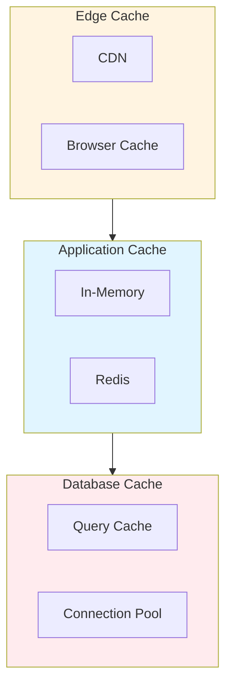

# Cache-Topology Architecture: Best Practices

**Objective**: Establish comprehensive multi-tier cache topology patterns that optimize performance, reduce latency, and manage cache hierarchies across edge, application, and data layers. When you need cache topology, when you want multi-tier caching, when you need cache strategy—this guide provides the complete framework.

## Introduction

Cache topology is fundamental to high-performance systems. Without proper cache hierarchies, systems suffer from latency, database load, and poor user experience. This guide establishes patterns for multi-tier cache topology, cache placement, and cache coherence.

**What This Guide Covers**:
- Multi-tier cache architecture (L1, L2, L3)
- Edge caching (CDN, browser)
- Application-level caching (in-memory, distributed)
- Database caching (query cache, connection pool)
- Cache coherence and invalidation
- Cache topology patterns
- Cache placement strategies

**Prerequisites**:
- Understanding of caching principles
- Familiarity with distributed systems
- Experience with performance optimization

**Related Documents**:
This document integrates with:
- **[End-to-End Caching Strategy](../performance/end-to-end-caching-strategy.md)** - Caching patterns
- **[System Resilience, Rate Limiting, Concurrency Control & Backpressure](../operations-monitoring/system-resilience-and-concurrency.md)** - Resilience
- **[Cost-Aware Architecture & Resource-Efficiency Governance](cost-aware-architecture-and-efficiency-governance.md)** - Cost optimization

## The Philosophy of Cache Topology

### Topology Principles

**Principle 1: Multi-Tier Hierarchy**
- Edge → Application → Database
- Closer to user = faster
- Hierarchical invalidation

**Principle 2: Cache Coherence**
- Consistent data
- Invalidation strategies
- Event-driven updates

**Principle 3: Optimal Placement**
- Right data, right tier
- Cost vs performance
- Latency optimization

## Multi-Tier Cache Architecture

### Topology Diagram

**Diagram**:


## Cache Placement Strategies

### Placement Rules

**Pattern**:
```yaml
# Cache placement
cache_placement:
  edge:
    data: "static_assets"
    ttl: "1 year"
  application:
    data: "user_sessions"
    ttl: "1 hour"
  database:
    data: "query_results"
    ttl: "5 minutes"
```

## Architecture Fitness Functions

### Cache Topology Fitness Function

**Definition**:
```python
# Cache topology fitness function
class CacheTopologyFitnessFunction:
    def evaluate(self, system: System) -> float:
        """Evaluate cache topology"""
        # Check hit rates
        hit_rates = self.check_hit_rates(system)
        
        # Check latency reduction
        latency_reduction = self.check_latency_reduction(system)
        
        # Check coherence
        coherence = self.check_cache_coherence(system)
        
        # Calculate fitness
        fitness = (hit_rates * 0.4) + \
                  (latency_reduction * 0.3) + \
                  (coherence * 0.3)
        
        return fitness
```

## See Also

- **[End-to-End Caching Strategy](../performance/end-to-end-caching-strategy.md)** - Caching patterns
- **[System Resilience, Rate Limiting, Concurrency Control & Backpressure](../operations-monitoring/system-resilience-and-concurrency.md)** - Resilience
- **[Cost-Aware Architecture & Resource-Efficiency Governance](cost-aware-architecture-and-efficiency-governance.md)** - Cost

---

*This guide establishes comprehensive cache topology patterns. Start with multi-tier hierarchy, extend to coherence, and continuously optimize placement.*

