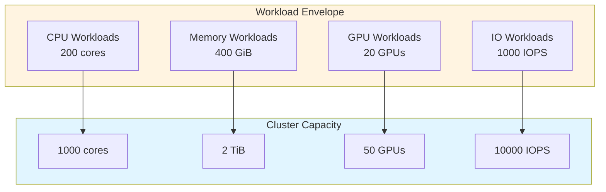
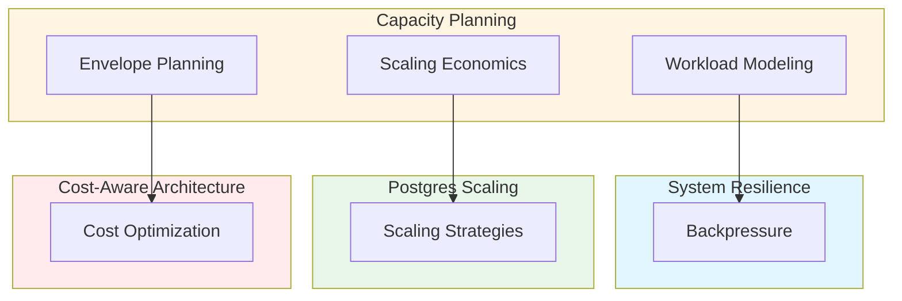

# Holistic Capacity Planning, Scaling Economics, and Workload Modeling: Best Practices

**Objective**: Establish comprehensive capacity planning frameworks that model workloads, predict resource needs, and optimize scaling economics across CPU/GPU clusters, data systems, and distributed services. When you need to plan capacity, when you want to model workloads, when you need scaling economics—this guide provides the complete framework.

## Introduction

Capacity planning is not guesswork—it's a systematic discipline that models workloads, predicts resource needs, and optimizes scaling economics. This guide establishes patterns for holistic capacity planning across all system layers and workload types.

**What This Guide Covers**:
- CPU/GPU saturation thresholds and workload classification
- Network load profiles (tiling, ETL shuffles, FDW scans, raster operations)
- Storage IO modeling (Parquet, DuckDB, Postgres, object stores)
- Memory-bound vs IO-bound workload classification
- Workload envelope planning in multi-cluster RKE2/Rancher deployments
- Cost vs performance tradeoff curves
- Workload modeling diagrams and formulas
- Cluster shape recommendations
- Autoscaling patterns and limits

**Prerequisites**:
- Understanding of distributed systems and resource management
- Familiarity with queueing theory and workload modeling
- Experience with capacity planning and performance analysis

**Related Documents**:
This document integrates with:
- **[System Resilience, Rate Limiting, Concurrency Control & Backpressure](../operations-monitoring/system-resilience-and-concurrency.md)** - Resilience patterns for capacity planning
- **[PostgreSQL Scaling Strategies](../postgres/postgres-scaling-strategies.md)** - Database scaling patterns
- **[Cost-Aware Architecture & Resource-Efficiency Governance](cost-aware-architecture-and-efficiency-governance.md)** - Cost optimization
- **[Operational Risk Modeling, Blast Radius Reduction & Failure Domain Architecture](../operations-monitoring/blast-radius-risk-modeling.md)** - Risk-aware capacity planning

## The Philosophy of Capacity Planning

### Capacity Planning Principles

**Principle 1: Model Before Scale**
- Understand workload characteristics
- Model resource requirements
- Predict scaling needs

**Principle 2: Measure Continuously**
- Monitor actual usage
- Track capacity utilization
- Alert on saturation

**Principle 3: Optimize Economics**
- Balance cost and performance
- Right-size resources
- Plan for growth

## Workload Classification

### Memory-Bound vs IO-Bound Workloads

**Classification Framework**:
```python
# Workload classification
class WorkloadClassifier:
    def classify(self, workload: Workload) -> WorkloadType:
        """Classify workload as memory-bound or IO-bound"""
        # Analyze resource usage
        cpu_utilization = workload.cpu_usage
        memory_utilization = workload.memory_usage
        io_utilization = workload.io_usage
        
        # Classify
        if memory_utilization > 0.8 and cpu_utilization > 0.7:
            return WorkloadType.MEMORY_BOUND
        elif io_utilization > 0.8:
            return WorkloadType.IO_BOUND
        else:
            return WorkloadType.COMPUTE_BOUND
```

**Examples**:
- **Memory-Bound**: In-memory analytics, ML training, vector search
- **IO-Bound**: ETL pipelines, data ingestion, Parquet queries
- **Compute-Bound**: Geospatial processing, raster operations, ONNX inference

## CPU/GPU Saturation Thresholds

### CPU Saturation Modeling

**Saturation Thresholds**:
```yaml
# CPU saturation thresholds
cpu_saturation:
  thresholds:
    optimal: 0.70
    warning: 0.85
    critical: 0.95
  workload_types:
    compute_bound:
      optimal: 0.80
      warning: 0.90
      critical: 0.98
    io_bound:
      optimal: 0.60
      warning: 0.75
      critical: 0.90
```

### GPU Saturation Modeling

**GPU Load Curves**:
```python
# GPU load curve modeling
class GPULoadCurve:
    def model_load(self, workload: MLWorkload) -> LoadCurve:
        """Model GPU load curve"""
        # Vector DB search
        if workload.type == "vector_search":
            return self.model_vector_search_load(workload)
        
        # ONNX inference
        elif workload.type == "onnx_inference":
            return self.model_onnx_inference_load(workload)
        
        # Raster processing
        elif workload.type == "raster_processing":
            return self.model_raster_processing_load(workload)
        
        return LoadCurve()
    
    def model_vector_search_load(self, workload: MLWorkload) -> LoadCurve:
        """Model vector search GPU load"""
        # Load curve: exponential with query rate
        query_rate = workload.queries_per_second
        gpu_utilization = 1 - math.exp(-query_rate / self.gpu_capacity)
        
        return LoadCurve(
            utilization=gpu_utilization,
            saturation_point=query_rate * 1.2
        )
```

## Network Load Profiles

### Tiling Network Load

**Tiling Load Model**:
```python
# Tiling network load
class TilingNetworkLoad:
    def model_load(self, tile_request: TileRequest) -> NetworkLoad:
        """Model tiling network load"""
        # Calculate tile size
        tile_size = self.calculate_tile_size(tile_request.zoom_level)
        
        # Calculate requests per second
        requests_per_second = tile_request.rate
        
        # Calculate bandwidth
        bandwidth_mbps = (tile_size * requests_per_second * 8) / 1_000_000
        
        return NetworkLoad(
            bandwidth_mbps=bandwidth_mbps,
            requests_per_second=requests_per_second,
            tile_size_bytes=tile_size
        )
```

### ETL Shuffle Network Load

**ETL Shuffle Model**:
```python
# ETL shuffle network load
class ETLShuffleNetworkLoad:
    def model_load(self, shuffle: ShuffleOperation) -> NetworkLoad:
        """Model ETL shuffle network load"""
        # Calculate data volume
        data_volume_gb = shuffle.data_size_gb
        
        # Calculate shuffle factor
        shuffle_factor = shuffle.partitions / shuffle.nodes
        
        # Calculate network load
        network_load_gb = data_volume_gb * shuffle_factor
        
        return NetworkLoad(
            data_volume_gb=network_load_gb,
            bandwidth_required_mbps=network_load_gb * 8 / shuffle.duration_seconds
        )
```

### FDW Scan Network Load

**FDW Scan Model**:
```python
# FDW scan network load
class FDWScanNetworkLoad:
    def model_load(self, scan: FDWScan) -> NetworkLoad:
        """Model FDW scan network load"""
        # Calculate scan size
        scan_size_gb = scan.table_size_gb * scan.selectivity
        
        # Calculate network load
        network_load_gb = scan_size_gb
        
        return NetworkLoad(
            data_volume_gb=network_load_gb,
            bandwidth_required_mbps=network_load_gb * 8 / scan.duration_seconds
        )
```

## Storage IO Modeling

### Parquet IO Model

**Parquet IO Characteristics**:
```python
# Parquet IO modeling
class ParquetIOModel:
    def model_io(self, query: ParquetQuery) -> IOLoad:
        """Model Parquet IO load"""
        # Calculate file size
        file_size_gb = query.file_size_gb
        
        # Calculate row group filtering
        row_groups_read = file_size_gb * query.selectivity / query.row_group_size_gb
        
        # Calculate IO
        io_gb = row_groups_read * query.row_group_size_gb
        
        return IOLoad(
            io_gb=io_gb,
            iops=io_gb / query.duration_seconds,
            bandwidth_mbps=io_gb * 8 / query.duration_seconds
        )
```

### DuckDB IO Model

**DuckDB IO Characteristics**:
```python
# DuckDB IO modeling
class DuckDBIOModel:
    def model_io(self, query: DuckDBQuery) -> IOLoad:
        """Model DuckDB IO load"""
        # Calculate scan size
        scan_size_gb = query.table_size_gb * query.selectivity
        
        # Calculate IO with columnar optimization
        io_gb = scan_size_gb * query.column_selectivity
        
        return IOLoad(
            io_gb=io_gb,
            iops=io_gb / query.duration_seconds,
            bandwidth_mbps=io_gb * 8 / query.duration_seconds
        )
```

### Postgres IO Model

**Postgres IO Characteristics**:
```python
# Postgres IO modeling
class PostgresIOModel:
    def model_io(self, query: PostgresQuery) -> IOLoad:
        """Model Postgres IO load"""
        # Calculate table size
        table_size_gb = query.table_size_gb
        
        # Calculate index usage
        index_io_gb = table_size_gb * query.index_selectivity
        
        # Calculate table scan IO
        table_io_gb = table_size_gb * (1 - query.index_selectivity) * query.selectivity
        
        # Total IO
        total_io_gb = index_io_gb + table_io_gb
        
        return IOLoad(
            io_gb=total_io_gb,
            iops=total_io_gb / query.duration_seconds,
            bandwidth_mbps=total_io_gb * 8 / query.duration_seconds
        )
```

## Workload Envelope Planning

### Multi-Cluster Envelope

**Envelope Definition**:
```yaml
# Workload envelope
workload_envelope:
  clusters:
    - name: "prod-cluster"
      capacity:
        cpu: "1000 cores"
        memory: "2 TiB"
        gpu: "50 GPUs"
        storage: "100 TiB"
      workloads:
        - type: "api"
          cpu: "200 cores"
          memory: "400 GiB"
        - type: "ml-inference"
          gpu: "20 GPUs"
          cpu: "100 cores"
        - type: "etl"
          cpu: "300 cores"
          memory: "600 GiB"
```

### RKE2/Rancher Envelope

**RKE2 Envelope Configuration**:
```yaml
# RKE2 workload envelope
rke2_envelope:
  cluster: "prod-cluster"
  nodes:
    - type: "control-plane"
      count: 3
      resources:
        cpu: "8 cores"
        memory: "32 GiB"
    - type: "worker"
      count: 20
      resources:
        cpu: "32 cores"
        memory: "128 GiB"
    - type: "gpu-worker"
      count: 5
      resources:
        cpu: "64 cores"
        memory: "256 GiB"
        gpu: "8 GPUs"
```

## Cost vs Performance Tradeoff Curves

### Tradeoff Analysis

**Tradeoff Model**:
```python
# Cost vs performance tradeoff
class CostPerformanceTradeoff:
    def analyze_tradeoff(self, workload: Workload) -> TradeoffCurve:
        """Analyze cost vs performance tradeoff"""
        # Generate tradeoff points
        points = []
        
        for resource_level in range(1, 11):
            # Calculate performance
            performance = self.calculate_performance(workload, resource_level)
            
            # Calculate cost
            cost = self.calculate_cost(workload, resource_level)
            
            points.append(TradeoffPoint(
                resource_level=resource_level,
                performance=performance,
                cost=cost
            ))
        
        return TradeoffCurve(points=points)
```

## Queueing Theory and Arrival Rates

### Queueing Models

**M/M/1 Queue Model**:
```python
# M/M/1 queue model
class MM1Queue:
    def __init__(self, arrival_rate: float, service_rate: float):
        self.arrival_rate = arrival_rate  # λ
        self.service_rate = service_rate  # μ
        self.utilization = arrival_rate / service_rate  # ρ
    
    def average_wait_time(self) -> float:
        """Calculate average wait time"""
        if self.utilization >= 1:
            return float('inf')
        return self.utilization / (self.service_rate * (1 - self.utilization))
    
    def average_queue_length(self) -> float:
        """Calculate average queue length"""
        if self.utilization >= 1:
            return float('inf')
        return self.utilization / (1 - self.utilization)
```

### ML Inference Concurrency Profiling

**Concurrency Model**:
```python
# ML inference concurrency profiling
class MLInferenceConcurrency:
    def profile_concurrency(self, model: MLModel) -> ConcurrencyProfile:
        """Profile ML inference concurrency"""
        # Test different concurrency levels
        concurrency_levels = [1, 2, 4, 8, 16, 32]
        
        profiles = []
        for concurrency in concurrency_levels:
            # Measure throughput
            throughput = self.measure_throughput(model, concurrency)
            
            # Measure latency
            latency_p99 = self.measure_latency(model, concurrency)
            
            # Measure GPU utilization
            gpu_utilization = self.measure_gpu_utilization(model, concurrency)
            
            profiles.append(ConcurrencyProfile(
                concurrency=concurrency,
                throughput=throughput,
                latency_p99=latency_p99,
                gpu_utilization=gpu_utilization
            ))
        
        return ConcurrencyProfiles(profiles=profiles)
```

## Cluster Shape Recommendations

### Cluster Sizing

**Sizing Framework**:
```yaml
# Cluster shape recommendations
cluster_shape:
  small:
    nodes: 3
    cpu_per_node: 8
    memory_per_node: "32Gi"
    use_cases: ["development", "testing"]
  
  medium:
    nodes: 10
    cpu_per_node: 16
    memory_per_node: "64Gi"
    use_cases: ["staging", "small-production"]
  
  large:
    nodes: 50
    cpu_per_node: 32
    memory_per_node: "128Gi"
    use_cases: ["production", "high-availability"]
  
  xlarge:
    nodes: 100
    cpu_per_node: 64
    memory_per_node: "256Gi"
    use_cases: ["large-scale-production", "multi-region"]
```

## Autoscaling Patterns

### RKE2 Autoscaling

**HPA Configuration**:
```yaml
# Horizontal Pod Autoscaler
apiVersion: autoscaling/v2
kind: HorizontalPodAutoscaler
metadata:
  name: user-api-hpa
spec:
  scaleTargetRef:
    apiVersion: apps/v1
    kind: Deployment
    name: user-api
  minReplicas: 3
  maxReplicas: 20
  metrics:
    - type: Resource
      resource:
        name: cpu
        target:
          type: Utilization
          averageUtilization: 70
    - type: Resource
      resource:
        name: memory
        target:
          type: Utilization
          averageUtilization: 80
  behavior:
    scaleDown:
      stabilizationWindowSeconds: 300
      policies:
        - type: Percent
          value: 50
          periodSeconds: 60
    scaleUp:
      stabilizationWindowSeconds: 0
      policies:
        - type: Percent
          value: 100
          periodSeconds: 15
        - type: Pods
          value: 4
          periodSeconds: 15
      selectPolicy: Max
```

### GPU Autoscaling

**GPU Autoscaler**:
```yaml
# GPU autoscaling
apiVersion: autoscaling/v2
kind: HorizontalPodAutoscaler
metadata:
  name: ml-inference-hpa
spec:
  scaleTargetRef:
    apiVersion: apps/v1
    kind: Deployment
    name: ml-inference
  minReplicas: 2
  maxReplicas: 10
  metrics:
    - type: Resource
      resource:
        name: nvidia.com/gpu
        target:
          type: Utilization
          averageUtilization: 60
```

## Workload Modeling Diagrams

### Workload Envelope Diagram



## Architecture Fitness Functions

### Throughput Fitness Function

**Definition**:
```python
# Throughput fitness function
class ThroughputFitnessFunction:
    def evaluate(self, system: System) -> float:
        """Evaluate throughput fitness"""
        # Calculate actual throughput
        actual_throughput = system.requests_per_second
        
        # Calculate target throughput
        target_throughput = system.target_throughput
        
        # Calculate fitness
        if actual_throughput >= target_throughput:
            fitness = 1.0
        else:
            fitness = actual_throughput / target_throughput
        
        return fitness
```

### Latency Fitness Function

**Definition**:
```python
# Latency fitness function
class LatencyFitnessFunction:
    def evaluate(self, system: System) -> float:
        """Evaluate latency fitness"""
        # Calculate p99 latency
        latency_p99 = system.latency_p99
        
        # Calculate target latency
        target_latency = system.target_latency_p99
        
        # Calculate fitness
        if latency_p99 <= target_latency:
            fitness = 1.0
        else:
            fitness = target_latency / latency_p99
        
        return fitness
```

### Cost-Efficiency Fitness Function

**Definition**:
```python
# Cost-efficiency fitness function
class CostEfficiencyFitnessFunction:
    def evaluate(self, system: System) -> float:
        """Evaluate cost-efficiency fitness"""
        # Calculate cost per request
        cost_per_request = system.total_cost / system.total_requests
        
        # Calculate target cost per request
        target_cost_per_request = system.target_cost_per_request
        
        # Calculate fitness
        if cost_per_request <= target_cost_per_request:
            fitness = 1.0
        else:
            fitness = target_cost_per_request / cost_per_request
        
        return fitness
```

### Oversubscription Tolerance Fitness Function

**Definition**:
```python
# Oversubscription tolerance fitness function
class OversubscriptionToleranceFitnessFunction:
    def evaluate(self, system: System) -> float:
        """Evaluate oversubscription tolerance"""
        # Calculate oversubscription ratio
        oversubscription = system.provisioned_resources / system.actual_usage
        
        # Calculate tolerance
        if oversubscription <= 1.2:
            fitness = 1.0
        elif oversubscription <= 1.5:
            fitness = 0.8
        elif oversubscription <= 2.0:
            fitness = 0.5
        else:
            fitness = 0.2
        
        return fitness
```

## Cross-Document Architecture



## Checklists

### Capacity Planning Checklist

- [ ] Workload classification completed
- [ ] Saturation thresholds defined
- [ ] Network load profiles modeled
- [ ] Storage IO requirements calculated
- [ ] Workload envelope planned
- [ ] Cost vs performance tradeoffs analyzed
- [ ] Autoscaling configured
- [ ] Cluster shape recommendations documented
- [ ] Fitness functions defined
- [ ] Regular capacity reviews scheduled

## Anti-Patterns

### Capacity Planning Anti-Patterns

**Underprovisioned Replicas**:
```yaml
# Bad: Underprovisioned
replicas: 1
resources:
  requests:
    cpu: "100m"
    memory: "128Mi"

# Good: Right-sized
replicas: 3
resources:
  requests:
    cpu: "500m"
    memory: "512Mi"
  limits:
    cpu: "2"
    memory: "2Gi"
```

**Mis-Sized GPU Jobs**:
```yaml
# Bad: Wrong GPU type
gpu:
  type: "a100"
  count: 1
  # Job only needs T4

# Good: Right GPU type
gpu:
  type: "t4"
  count: 1
  # Matches workload requirements
```

**WAL-Heavy Workloads**:
```yaml
# Bad: No WAL optimization
postgres:
  wal_level: "replica"
  max_wal_size: "1GB"
  # High WAL generation

# Good: WAL optimized
postgres:
  wal_level: "replica"
  max_wal_size: "4GB"
  wal_compression: true
  # Reduced WAL load
```

## See Also

- **[System Resilience, Rate Limiting, Concurrency Control & Backpressure](../operations-monitoring/system-resilience-and-concurrency.md)** - Resilience patterns
- **[PostgreSQL Scaling Strategies](../postgres/postgres-scaling-strategies.md)** - Database scaling
- **[Cost-Aware Architecture & Resource-Efficiency Governance](cost-aware-architecture-and-efficiency-governance.md)** - Cost optimization
- **[Operational Risk Modeling, Blast Radius Reduction & Failure Domain Architecture](../operations-monitoring/blast-radius-risk-modeling.md)** - Risk-aware planning

---

*This guide establishes comprehensive capacity planning patterns. Start with workload modeling, extend to scaling economics, and continuously optimize for cost and performance.*

