# Cloud Architecture Best Practices

This document establishes production-ready cloud architecture patterns for geospatial systems, covering AWS infrastructure, containerization, and Kubernetes deployment strategies.

## Architecture Overview

```mermaid
graph TB
    subgraph "Client Layer"
        WEB[Web Applications]
        MOBILE[Mobile Apps]
        API_CLIENT[API Clients]
    end

    subgraph "Load Balancing & CDN"
        ALB[Application Load Balancer]
        CDN[CloudFront CDN]
    end

    subgraph "API Gateway Layer"
        APIGW[API Gateway]
        AUTH[Authentication Service]
        RATE[Rate Limiting]
    end

    subgraph "Microservices Layer"
        GEO_API[Geospatial API]
        PROCESSING[Spatial Processing]
        ANALYTICS[Analytics Service]
        NOTIFICATIONS[Notification Service]
    end

    subgraph "Serverless Functions"
        LAMBDA1[Data Ingestion Lambda]
        LAMBDA2[Spatial Analysis Lambda]
        LAMBDA3[Image Processing Lambda]
        STEP[Step Functions Orchestrator]
    end

    subgraph "Data Layer"
        RDS[(PostgreSQL + PostGIS)]
        REDIS[(Redis Cache)]
        S3[(S3 Data Lake)]
        ELASTICSEARCH[(Elasticsearch)]
    end

    subgraph "Message Queue"
        SQS[SQS Queues]
        SNS[SNS Topics]
        KINESIS[Kinesis Streams]
    end

    subgraph "Monitoring & Observability"
        CLOUDWATCH[CloudWatch]
        PROMETHEUS[Prometheus]
        GRAFANA[Grafana]
        XRAY[X-Ray Tracing]
    end

    subgraph "Security & Compliance"
        WAF[WAF]
        SECRETS[Secrets Manager]
        KMS[KMS Encryption]
        IAM[IAM Roles]
    end

    %% Client connections
    WEB --> ALB
    MOBILE --> ALB
    API_CLIENT --> ALB
    ALB --> CDN
    CDN --> APIGW

    %% API Gateway connections
    APIGW --> AUTH
    APIGW --> RATE
    APIGW --> GEO_API

    %% Microservices connections
    GEO_API --> PROCESSING
    GEO_API --> ANALYTICS
    GEO_API --> NOTIFICATIONS

    %% Serverless connections
    STEP --> LAMBDA1
    STEP --> LAMBDA2
    STEP --> LAMBDA3
    LAMBDA1 --> S3
    LAMBDA2 --> RDS
    LAMBDA3 --> S3

    %% Data connections
    GEO_API --> RDS
    GEO_API --> REDIS
    PROCESSING --> S3
    ANALYTICS --> ELASTICSEARCH

    %% Message queue connections
    GEO_API --> SQS
    SQS --> LAMBDA1
    SNS --> NOTIFICATIONS
    KINESIS --> ANALYTICS

    %% Monitoring connections
    GEO_API --> CLOUDWATCH
    GEO_API --> PROMETHEUS
    PROMETHEUS --> GRAFANA
    GEO_API --> XRAY

    %% Security connections
    WAF --> ALB
    SECRETS --> GEO_API
    KMS --> RDS
    KMS --> S3
    IAM --> GEO_API

    %% Styling
    classDef client fill:#e1f5fe,stroke:#01579b,stroke-width:2px
    classDef loadbalancer fill:#f3e5f5,stroke:#4a148c,stroke-width:2px
    classDef apigateway fill:#e8f5e8,stroke:#1b5e20,stroke-width:2px
    classDef microservice fill:#fff3e0,stroke:#e65100,stroke-width:2px
    classDef serverless fill:#fce4ec,stroke:#880e4f,stroke-width:2px
    classDef data fill:#e0f2f1,stroke:#004d40,stroke-width:2px
    classDef messaging fill:#f1f8e9,stroke:#33691e,stroke-width:2px
    classDef monitoring fill:#fff8e1,stroke:#ff6f00,stroke-width:2px
    classDef security fill:#ffebee,stroke:#b71c1c,stroke-width:2px

    class WEB,MOBILE,API_CLIENT client
    class ALB,CDN loadbalancer
    class APIGW,AUTH,RATE apigateway
    class GEO_API,PROCESSING,ANALYTICS,NOTIFICATIONS microservice
    class LAMBDA1,LAMBDA2,LAMBDA3,STEP serverless
    class RDS,REDIS,S3,ELASTICSEARCH data
    class SQS,SNS,KINESIS messaging
    class CLOUDWATCH,PROMETHEUS,GRAFANA,XRAY monitoring
    class WAF,SECRETS,KMS,IAM security
```



**Why This Architecture Works**: This comprehensive cloud architecture provides scalable, secure, and observable geospatial systems. Each layer serves a specific purpose while maintaining loose coupling and high cohesion.

## AWS Infrastructure Patterns

### Serverless Geospatial Processing

```python
import boto3
import json
from aws_lambda_powertools import Logger, Tracer
from aws_lambda_powertools.utilities.typing import LambdaContext

logger = Logger()
tracer = Tracer()

@tracer.capture_lambda_handler
def lambda_handler(event: dict, context: LambdaContext) -> dict:
    """
    Serverless geospatial processing with AWS Lambda
    """
    try:
        # Extract parameters from event
        s3_bucket = event['s3_bucket']
        s3_key = event['s3_key']
        operation = event['operation']
        
        # Initialize S3 client
        s3_client = boto3.client('s3')
        
        # Process based on operation type
        if operation == 'spatial_analysis':
            result = perform_spatial_analysis(s3_bucket, s3_key)
        elif operation == 'raster_processing':
            result = perform_raster_processing(s3_bucket, s3_key)
        else:
            raise ValueError(f"Unknown operation: {operation}")
        
        return {
            'statusCode': 200,
            'body': json.dumps({
                'message': 'Processing completed successfully',
                'result': result
            })
        }
        
    except Exception as e:
        logger.error(f"Error processing geospatial data: {str(e)}")
        return {
            'statusCode': 500,
            'body': json.dumps({
                'error': str(e)
            })
        }

def perform_spatial_analysis(bucket: str, key: str) -> dict:
    """
    Perform spatial analysis on S3-stored data
    """
    # Implementation for spatial analysis
    pass

def perform_raster_processing(bucket: str, key: str) -> dict:
    """
    Perform raster processing on S3-stored data
    """
    # Implementation for raster processing
    pass
```

**Why:** Serverless architecture eliminates infrastructure management overhead while providing automatic scaling. Lambda functions are ideal for event-driven geospatial processing with predictable execution patterns.

### Infrastructure as Code (Terraform)

```hcl
# AWS VPC Configuration
resource "aws_vpc" "geospatial_vpc" {
  cidr_block           = "10.0.0.0/16"
  enable_dns_hostnames = true
  enable_dns_support   = true

  tags = {
    Name = "geospatial-vpc"
    Environment = "production"
  }
}

# Public Subnets
resource "aws_subnet" "public_subnets" {
  count             = 2
  vpc_id            = aws_vpc.geospatial_vpc.id
  cidr_block        = "10.0.${count.index + 1}.0/24"
  availability_zone = data.aws_availability_zones.available.names[count.index]

  map_public_ip_on_launch = true

  tags = {
    Name = "geospatial-public-${count.index + 1}"
  }
}

# Private Subnets
resource "aws_subnet" "private_subnets" {
  count             = 2
  vpc_id            = aws_vpc.geospatial_vpc.id
  cidr_block        = "10.0.${count.index + 10}.0/24"
  availability_zone = data.aws_availability_zones.available.names[count.index]

  tags = {
    Name = "geospatial-private-${count.index + 1}"
  }
}

# RDS PostgreSQL with PostGIS
resource "aws_db_instance" "geospatial_db" {
  identifier = "geospatial-postgres"
  engine     = "postgres"
  engine_version = "15.4"
  
  instance_class    = "db.r6g.large"
  allocated_storage = 100
  storage_type      = "gp3"
  storage_encrypted = true
  
  db_name  = "geospatial"
  username = "postgres"
  password = var.db_password
  
  vpc_security_group_ids = [aws_security_group.rds_sg.id]
  db_subnet_group_name   = aws_db_subnet_group.geospatial_subnet_group.name
  
  backup_retention_period = 7
  backup_window          = "03:00-04:00"
  maintenance_window     = "sun:04:00-sun:05:00"
  
  skip_final_snapshot = false
  final_snapshot_identifier = "geospatial-final-snapshot"
  
  tags = {
    Name = "geospatial-database"
  }
}

# S3 Bucket for Geospatial Data
resource "aws_s3_bucket" "geospatial_data" {
  bucket = "geospatial-data-${random_id.bucket_suffix.hex}"

  tags = {
    Name        = "Geospatial Data Storage"
    Environment = "production"
  }
}

resource "aws_s3_bucket_versioning" "geospatial_data_versioning" {
  bucket = aws_s3_bucket.geospatial_data.id
  versioning_configuration {
    status = "Enabled"
  }
}

resource "aws_s3_bucket_server_side_encryption_configuration" "geospatial_data_encryption" {
  bucket = aws_s3_bucket.geospatial_data.id

  rule {
    apply_server_side_encryption_by_default {
      sse_algorithm = "AES256"
    }
  }
}
```

**Why:** Infrastructure as Code ensures reproducible, version-controlled infrastructure deployments. Terraform provides state management and dependency resolution for complex cloud architectures.

## Containerized Microservices

### Multi-stage Dockerfile

```dockerfile
# Multi-stage build for geospatial processing
FROM python:3.11-slim as builder

# Install system dependencies
RUN apt-get update && apt-get install -y \
    gdal-bin \
    libgdal-dev \
    libspatialite-dev \
    && rm -rf /var/lib/apt/lists/*

# Set GDAL environment variables
ENV GDAL_CONFIG=/usr/bin/gdal-config
ENV CPLUS_INCLUDE_PATH=/usr/include/gdal
ENV C_INCLUDE_PATH=/usr/include/gdal

# Install Python dependencies
COPY requirements.txt .
RUN pip install --no-cache-dir -r requirements.txt

# Runtime stage
FROM python:3.11-slim

# Copy dependencies from builder
COPY --from=builder /usr/local/lib/python3.11/site-packages /usr/local/lib/python3.11/site-packages
COPY --from=builder /usr/local/bin /usr/local/bin

# Install runtime dependencies
RUN apt-get update && apt-get install -y \
    gdal-bin \
    libgdal32 \
    && rm -rf /var/lib/apt/lists/*

# Set working directory
WORKDIR /app

# Copy application code
COPY . .

# Create non-root user
RUN useradd -m -u 1000 appuser && chown -R appuser:appuser /app
USER appuser

# Health check
HEALTHCHECK --interval=30s --timeout=30s --start-period=5s --retries=3 \
    CMD curl -f http://localhost:8000/health || exit 1

# Expose port
EXPOSE 8000

# Start application
CMD ["python", "app.py"]
```

**Why:** Multi-stage builds minimize final image size while maintaining build efficiency. Non-root users and health checks improve security and observability.

### Docker Compose for Development

```yaml
version: '3.8'

services:
  geospatial-api:
    build: .
    ports:
      - "8000:8000"
    environment:
      - DATABASE_URL=postgresql://postgres:password@db:5432/geospatial
      - REDIS_URL=redis://redis:6379
    depends_on:
      - db
      - redis
    volumes:
      - ./data:/app/data
    networks:
      - geospatial-network

  db:
    image: postgis/postgis:15-3.3
    environment:
      - POSTGRES_DB=geospatial
      - POSTGRES_USER=postgres
      - POSTGRES_PASSWORD=password
    ports:
      - "5432:5432"
    volumes:
      - postgres_data:/var/lib/postgresql/data
      - ./init.sql:/docker-entrypoint-initdb.d/init.sql
    networks:
      - geospatial-network

  redis:
    image: redis:7-alpine
    ports:
      - "6379:6379"
    volumes:
      - redis_data:/data
    networks:
      - geospatial-network

  nginx:
    image: nginx:alpine
    ports:
      - "80:80"
    volumes:
      - ./nginx.conf:/etc/nginx/nginx.conf
    depends_on:
      - geospatial-api
    networks:
      - geospatial-network

volumes:
  postgres_data:
  redis_data:

networks:
  geospatial-network:
    driver: bridge
```

**Why:** Docker Compose enables local development with production-like services. Service dependencies and networking ensure proper startup order and communication.

## Kubernetes Deployment Patterns

### Geospatial Service Deployment

```yaml
apiVersion: apps/v1
kind: Deployment
metadata:
  name: geospatial-api
  labels:
    app: geospatial-api
spec:
  replicas: 3
  selector:
    matchLabels:
      app: geospatial-api
  template:
    metadata:
      labels:
        app: geospatial-api
    spec:
      containers:
      - name: geospatial-api
        image: sempervent/geospatial-api:latest
        ports:
        - containerPort: 8000
        env:
        - name: DATABASE_URL
          valueFrom:
            secretKeyRef:
              name: geospatial-secrets
              key: database-url
        - name: REDIS_URL
          valueFrom:
            secretKeyRef:
              name: geospatial-secrets
              key: redis-url
        resources:
          requests:
            memory: "512Mi"
            cpu: "250m"
          limits:
            memory: "1Gi"
            cpu: "500m"
        livenessProbe:
          httpGet:
            path: /health
            port: 8000
          initialDelaySeconds: 30
          periodSeconds: 10
        readinessProbe:
          httpGet:
            path: /ready
            port: 8000
          initialDelaySeconds: 5
          periodSeconds: 5
---
apiVersion: v1
kind: Service
metadata:
  name: geospatial-api-service
spec:
  selector:
    app: geospatial-api
  ports:
    - protocol: TCP
      port: 80
      targetPort: 8000
  type: LoadBalancer
```

### Horizontal Pod Autoscaler

```yaml
apiVersion: autoscaling/v2
kind: HorizontalPodAutoscaler
metadata:
  name: geospatial-api-hpa
spec:
  scaleTargetRef:
    apiVersion: apps/v1
    kind: Deployment
    name: geospatial-api
  minReplicas: 3
  maxReplicas: 10
  metrics:
  - type: Resource
    resource:
      name: cpu
      target:
        type: Utilization
        averageUtilization: 70
  - type: Resource
    resource:
      name: memory
      target:
        type: Utilization
        averageUtilization: 80
```

### ConfigMap and Secrets

```yaml
apiVersion: v1
kind: ConfigMap
metadata:
  name: geospatial-config
data:
  LOG_LEVEL: "INFO"
  MAX_WORKERS: "4"
  CACHE_TTL: "3600"
  SPATIAL_INDEX_SIZE: "10000"

---
apiVersion: v1
kind: Secret
metadata:
  name: geospatial-secrets
type: Opaque
data:
  database-url: cG9zdGdyZXNxbDovL3VzZXI6cGFzc3dvcmRAZGI6NTQzMi9nZW9zcGF0aWFs
  redis-url: cmVkaXM6Ly9yZWRpczozNjM5
  api-key: YWJjZGVmZ2hpams=
```

**Why:** Kubernetes provides declarative deployment management with automatic scaling, health checks, and service discovery. ConfigMaps and Secrets separate configuration from application code.

## Monitoring and Observability

### Prometheus Metrics

```python
from prometheus_client import Counter, Histogram, Gauge, start_http_server
import time

# Define metrics
REQUEST_COUNT = Counter('geospatial_requests_total', 'Total requests', ['method', 'endpoint'])
REQUEST_DURATION = Histogram('geospatial_request_duration_seconds', 'Request duration')
ACTIVE_CONNECTIONS = Gauge('geospatial_active_connections', 'Active connections')
SPATIAL_QUERIES = Counter('geospatial_spatial_queries_total', 'Spatial queries', ['operation'])

def track_request(func):
    """Decorator to track request metrics"""
    def wrapper(*args, **kwargs):
        start_time = time.time()
        REQUEST_COUNT.labels(method='GET', endpoint=func.__name__).inc()
        
        try:
            result = func(*args, **kwargs)
            return result
        finally:
            REQUEST_DURATION.observe(time.time() - start_time)
    
    return wrapper

# Start metrics server
start_http_server(8001)
```

### Grafana Dashboard Configuration

```json
{
  "dashboard": {
    "title": "Geospatial API Metrics",
    "panels": [
      {
        "title": "Request Rate",
        "type": "graph",
        "targets": [
          {
            "expr": "rate(geospatial_requests_total[5m])",
            "legendFormat": "{{method}} {{endpoint}}"
          }
        ]
      },
      {
        "title": "Response Time",
        "type": "graph",
        "targets": [
          {
            "expr": "histogram_quantile(0.95, rate(geospatial_request_duration_seconds_bucket[5m]))",
            "legendFormat": "95th percentile"
          }
        ]
      },
      {
        "title": "Spatial Query Operations",
        "type": "graph",
        "targets": [
          {
            "expr": "rate(geospatial_spatial_queries_total[5m])",
            "legendFormat": "{{operation}}"
          }
        ]
      }
    ]
  }
}
```

**Why:** Comprehensive monitoring enables proactive issue detection and performance optimization. Metrics provide quantitative insights into system behavior and user patterns.

## Security Best Practices

### Network Security

```yaml
apiVersion: networking.k8s.io/v1
kind: NetworkPolicy
metadata:
  name: geospatial-network-policy
spec:
  podSelector:
    matchLabels:
      app: geospatial-api
  policyTypes:
  - Ingress
  - Egress
  ingress:
  - from:
    - namespaceSelector:
        matchLabels:
          name: ingress-nginx
    ports:
    - protocol: TCP
      port: 8000
  egress:
  - to:
    - namespaceSelector:
        matchLabels:
          name: database
    ports:
    - protocol: TCP
      port: 5432
  - to:
    - namespaceSelector:
        matchLabels:
          name: cache
    ports:
    - protocol: TCP
      port: 6379
```

### Pod Security Standards

```yaml
apiVersion: v1
kind: Pod
metadata:
  name: geospatial-api-secure
spec:
  securityContext:
    runAsNonRoot: true
    runAsUser: 1000
    fsGroup: 2000
  containers:
  - name: geospatial-api
    image: sempervent/geospatial-api:latest
    securityContext:
      allowPrivilegeEscalation: false
      readOnlyRootFilesystem: true
      capabilities:
        drop:
        - ALL
    volumeMounts:
    - name: tmp
      mountPath: /tmp
    - name: cache
      mountPath: /app/cache
  volumes:
  - name: tmp
    emptyDir: {}
  - name: cache
    emptyDir: {}
```

**Why:** Network policies enforce micro-segmentation, while pod security contexts prevent privilege escalation and limit attack surfaces.
