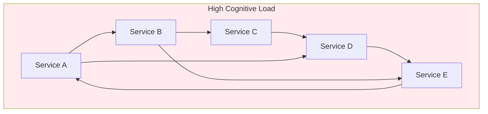
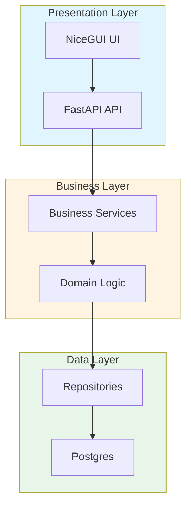
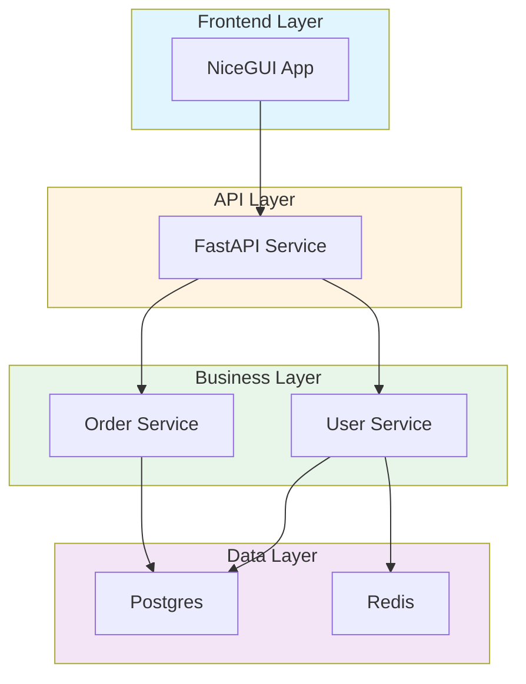
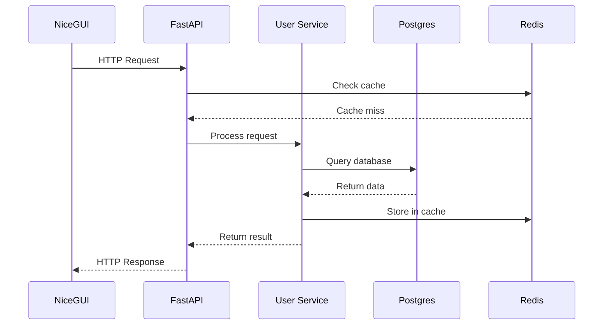
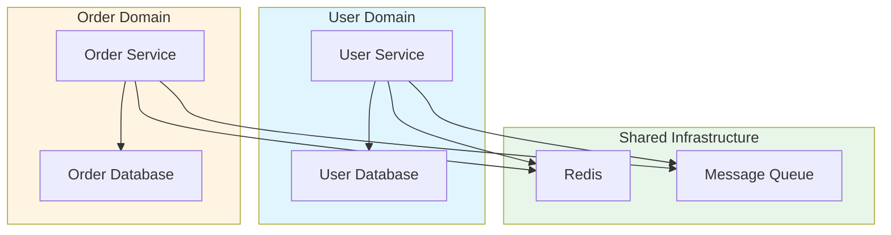
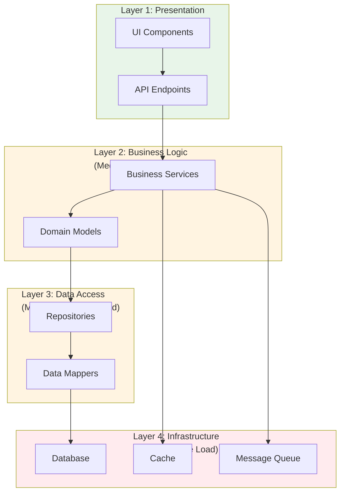
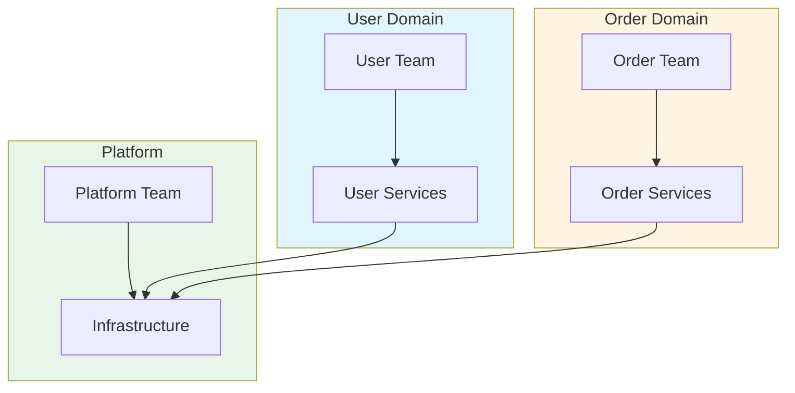

# Cognitive Load Management and Developer Experience Architecture: Best Practices for Complex Technical Ecosystems

**Objective**: Master production-grade cognitive load management and developer experience patterns across distributed systems, polyglot microservices, and complex technical ecosystems. When you need to minimize cognitive load, maximize developer experience, and enable effective reasoning about architecture—this guide provides complete patterns and implementations.

## Introduction

Cognitive load management is the foundation of sustainable, scalable engineering systems. Without proper cognitive load management, systems become mentally intractable, onboarding slows, errors increase, and architectural evolution stalls. This guide provides a complete framework for designing systems that remain mentally tractable despite complexity.

**What This Guide Covers**:
- The nature of cognitive load in systems architecture
- Principles of Developer Experience (DX) Architecture
- Architectural patterns that reduce cognitive load
- Anti-patterns that increase cognitive load
- Developer-facing architecture maps and mental models
- Knowledge management and internal documentation strategy
- Cognitive load metrics and evaluation practices
- High-signal developer tooling and automation
- Organizational patterns for cognitive load distribution
- Agentic LLM integration for cognitive load reduction

**Prerequisites**:
- Understanding of software architecture and distributed systems
- Familiarity with developer experience and team dynamics
- Experience with complex technical ecosystems

## The Nature of Cognitive Load in Systems Architecture

### Intrinsic Cognitive Load

**Definition**: Inherent complexity of the problem domain.

**Examples**:
- **Postgres Schema Complexity**: Understanding relationships between 50+ tables
- **ML Pipeline Complexity**: Feature engineering, model training, inference coordination
- **Geospatial Processing**: Coordinate systems, projections, spatial indexing

**Management**:
- Break complex domains into smaller, understandable pieces
- Use domain-driven design boundaries
- Provide clear abstractions

### Extraneous Cognitive Load

**Definition**: Unnecessary complexity introduced by poor design.

**Examples**:
- **Inconsistent Naming**: `getUser()` vs `fetch_user()` vs `retrieveUser()`
- **Hidden Dependencies**: Services that depend on each other without clear contracts
- **Magic Configuration**: Configs that work but no one knows why

**Management**:
- Standardize naming conventions
- Make dependencies explicit
- Document configuration clearly

### Germane Cognitive Load

**Definition**: Mental effort spent building mental models and understanding.

**Examples**:
- **Learning System Architecture**: Understanding how components interact
- **Building Mental Models**: Creating internal representations of system behavior
- **Pattern Recognition**: Identifying recurring patterns and abstractions

**Management**:
- Provide clear architecture documentation
- Use consistent patterns
- Enable pattern discovery

### API Surface Complexity

**Problem**: Complex APIs require significant mental effort to understand.

**Example**:
```python
# High cognitive load API
class ComplexAPI:
    def process(self, data, options=None, config=None, context=None, 
                callback=None, timeout=None, retry=None, ...):
        # 20+ parameters, unclear interactions
        pass

# Low cognitive load API
class SimpleAPI:
    def process(self, request: ProcessRequest) -> ProcessResponse:
        # Single, well-typed parameter
        return self._process(request)
```

**Management**:
- Use strong typing (Pydantic, TypeScript)
- Limit parameter count
- Use builder patterns for complex configurations

### Schema and Data Model Comprehension

**Problem**: Complex schemas are hard to understand and reason about.

**Example**:
```sql
-- High cognitive load: 50+ tables in one schema
CREATE SCHEMA monolithic;
-- Tables: users, orders, products, payments, shipping, inventory, ...

-- Low cognitive load: Domain-separated schemas
CREATE SCHEMA users;
CREATE SCHEMA orders;
CREATE SCHEMA products;
```

**Management**:
- Separate schemas by domain
- Document relationships clearly
- Use visual schema diagrams

### Cross-Service Dependency Webs

**Problem**: Complex dependency graphs are mentally intractable.

**Example**:


**Management**:
- Limit dependency depth
- Use event-driven architecture
- Implement circuit breakers

### Operator Workflows / Runbooks

**Problem**: Complex runbooks require deep knowledge to execute.

**Example**:
```bash
# High cognitive load: Unclear, multi-step process
# Step 1: Do something (unclear what)
# Step 2: Check something (unclear how)
# Step 3: Fix something (unclear why)

# Low cognitive load: Clear, documented process
#!/bin/bash
# runbooks/postgres-failover.sh
# Purpose: Failover Postgres primary to replica
# Prerequisites: Replica must be in sync
set -euo pipefail

echo "=== Postgres Failover ==="
echo "1. Verifying replica sync..."
kubectl exec postgres-replica -- psql -c "SELECT pg_is_in_recovery();"

echo "2. Promoting replica..."
kubectl patch postgrescluster postgres --type merge -p '{"spec":{"instances":[{"name":"replica","replicationRole":"primary"}]}}'

echo "3. Verifying new primary..."
kubectl exec postgres-replica -- psql -c "SELECT pg_is_in_recovery();"
```

**Management**:
- Write clear, executable runbooks
- Include purpose and prerequisites
- Test runbooks regularly

### Observability Pipelines

**Problem**: Complex observability setups are hard to navigate.

**Management**:
- Standardize log formats
- Use consistent metric naming
- Provide clear dashboards

### Organizational Knowledge Entropy

**Problem**: Knowledge becomes scattered and inconsistent.

**Management**:
- Centralize documentation
- Version knowledge artifacts
- Regular knowledge audits

### Consequences of Unmanaged Cognitive Load

**Increased Error Rate**:
- Developers make mistakes when systems are too complex
- Example: Misconfiguring Postgres replication due to unclear documentation

**Operational Fragility**:
- Systems break in unexpected ways
- Example: Cascading failures due to hidden dependencies

**Slow Onboarding**:
- New developers take weeks to become productive
- Example: 3-week onboarding for a microservice

**Knowledge Silos**:
- Information trapped in individual heads
- Example: Only one person knows how to deploy ML models

**Architectural Brittleness**:
- Small changes cause large failures
- Example: Changing one service breaks three others

**Maintenance Burden**:
- High cost to maintain and evolve
- Example: 80% of time spent on maintenance

**Degraded System Evolution**:
- System becomes harder to change over time
- Example: Fear of making changes due to complexity

## Principles of Developer Experience (DX) Architecture

### "Paved Road" Environments

**Definition**: Standard, well-supported development environments.

**Example**:
```yaml
# paved-road/dev-environment.yaml
development_environment:
  name: "Standard Development Environment"
  components:
    - "Python 3.11"
    - "Postgres 15"
    - "Redis 7"
    - "Docker Compose"
  
  setup:
    - "make install"
    - "make setup-db"
    - "make start-services"
  
  tools:
    - "pre-commit hooks"
    - "ruff linter"
    - "pytest test runner"
```

**Benefits**:
- Fast onboarding
- Consistent experience
- Reduced cognitive load

### Standardized Repo Topologies

**Definition**: Consistent repository structures across projects.

**Example**:
```
# Standard Python service repo
service-name/
├── .github/workflows/
├── src/
│   └── service_name/
│       ├── __init__.py
│       ├── main.py
│       ├── handlers/
│       ├── models/
│       └── services/
├── tests/
├── docs/
├── .pre-commit-config.yaml
├── Makefile
├── pyproject.toml
└── README.md
```

**Benefits**:
- Instant familiarity
- Predictable structure
- Easy navigation

### Clear Naming Conventions

**Definition**: Consistent, meaningful naming across codebase.

**Conventions**:
```python
# Python naming
class UserService:  # PascalCase for classes
    def get_user(self, user_id: str):  # snake_case for methods
        user_repository = UserRepository()  # snake_case for variables

# Go naming
type UserService struct {}  // PascalCase for exported
func (s *UserService) GetUser(userID string) {}  // PascalCase for exported

# Rust naming
struct UserService {}  // PascalCase
impl UserService {
    fn get_user(&self, user_id: &str) {}  // snake_case
}
```

**Benefits**:
- Self-documenting code
- Reduced mental translation
- Consistent patterns

### Consistent Code-Generation Pipelines

**Definition**: Automated code generation for common patterns.

**Example**:
```python
# codegen/api_client_generator.py
class APIClientGenerator:
    def generate_client(self, openapi_spec: dict) -> str:
        """Generate API client from OpenAPI spec"""
        # Generate typed client
        # Generate request/response models
        # Generate error handling
        pass
```

**Benefits**:
- Consistency
- Reduced boilerplate
- Type safety

### Golden-Path CLIs (Make/Task/Just)

**Definition**: Standard CLI commands for common tasks.

**Example Makefile**:
```makefile
# Makefile - Golden path commands
.PHONY: install test lint format build run

install:
	pip install -e ".[dev]"

test:
	pytest tests/ -v

lint:
	ruff check src/ tests/

format:
	ruff format src/ tests/

build:
	docker buildx bake

run:
	python -m src.main
```

**Benefits**:
- Consistent workflows
- Easy discovery
- Reduced cognitive load

### Stable Interface Boundaries

**Definition**: Well-defined, versioned interfaces.

**Example**:
```python
# Stable interface
from pydantic import BaseModel

class UserV1(BaseModel):
    id: int
    name: str

class UserV2(BaseModel):
    id: int
    name: str
    email: str  # Backward compatible

# Interface usage
def get_user(version: int = 1) -> BaseModel:
    if version == 1:
        return UserV1(id=1, name="Alice")
    elif version == 2:
        return UserV2(id=1, name="Alice", email="alice@example.com")
```

**Benefits**:
- Predictable changes
- Clear contracts
- Reduced coupling

### Replaceable Components with Low Coupling

**Definition**: Components that can be swapped without major changes.

**Example**:
```python
# Replaceable component
class CacheInterface(ABC):
    @abstractmethod
    def get(self, key: str) -> Optional[str]:
        pass
    
    @abstractmethod
    def set(self, key: str, value: str) -> None:
        pass

# Implementation can be swapped
class RedisCache(CacheInterface):
    def get(self, key: str) -> Optional[str]:
        return self.redis.get(key)
    
    def set(self, key: str, value: str) -> None:
        self.redis.set(key, value)

class MemoryCache(CacheInterface):
    def get(self, key: str) -> Optional[str]:
        return self.cache.get(key)
    
    def set(self, key: str, value: str) -> None:
        self.cache[key] = value
```

**Benefits**:
- Flexibility
- Testability
- Reduced cognitive load

### Automated Internal Documentation Generators

**Definition**: Tools that generate documentation from code.

**Example**:
```python
# docgen/api_docs_generator.py
class APIDocsGenerator:
    def generate_docs(self, openapi_spec: dict) -> str:
        """Generate API documentation from OpenAPI spec"""
        # Generate Markdown docs
        # Include examples
        # Include error codes
        pass
```

**Benefits**:
- Always up-to-date
- Consistent format
- Reduced maintenance

### Runtime Introspection Tools

**Definition**: Tools that help understand running systems.

**Example**:
```python
# introspection/system_introspection.py
class SystemIntrospector:
    def get_service_dependencies(self, service: str) -> List[str]:
        """Get service dependencies at runtime"""
        # Query service mesh
        # Query database connections
        # Query message queues
        pass
    
    def get_service_health(self, service: str) -> dict:
        """Get service health at runtime"""
        # Check endpoints
        # Check dependencies
        # Check metrics
        pass
```

**Benefits**:
- Runtime understanding
- Debugging aid
- Reduced cognitive load

## Architectural Patterns That Reduce Cognitive Load

### The "Layered Clarity" Principle

**Definition**: Clear separation of concerns across layers.

**Example**:


**Benefits**:
- Clear boundaries
- Predictable flow
- Reduced complexity

### Domain Isolation Boundaries

**Definition**: Clear boundaries between business domains.

**Example**:
```python
# Domain isolation
class UserDomain:
    """User domain with clear boundaries"""
    def create_user(self, user_data: dict):
        # User domain logic only
        pass

class OrderDomain:
    """Order domain with clear boundaries"""
    def create_order(self, order_data: dict):
        # Order domain logic only
        pass

# Domains communicate via events
class UserCreatedEvent:
    user_id: str
    timestamp: datetime
```

**Benefits**:
- Clear ownership
- Reduced coupling
- Easier reasoning

### Explicit Contract Surfaces

**Definition**: Well-defined, documented interfaces.

**Example**:
```python
# Explicit contract
from pydantic import BaseModel
from typing import Protocol

class UserServiceContract(Protocol):
    def get_user(self, user_id: str) -> User:
        """Get user by ID"""
        ...
    
    def create_user(self, user_data: UserCreate) -> User:
        """Create new user"""
        ...

class UserService:
    def get_user(self, user_id: str) -> User:
        """Get user by ID
        
        Args:
            user_id: Unique user identifier
        
        Returns:
            User object
        
        Raises:
            UserNotFoundError: If user doesn't exist
        """
        return self.repository.find(user_id)
```

**Benefits**:
- Clear expectations
- Type safety
- Reduced ambiguity

### Progressive Disclosure of Complexity

**Definition**: Hide complexity until needed.

**Example**:
```python
# Simple interface
class DataProcessor:
    def process(self, data: dict) -> dict:
        """Process data - simple interface"""
        return self._process_internal(data)
    
    # Complex internals hidden
    def _process_internal(self, data: dict) -> dict:
        # Complex processing logic
        pass
```

**Benefits**:
- Simple defaults
- Complexity when needed
- Reduced cognitive load

### Single-Source-of-Truth Metadata

**Definition**: One authoritative source for metadata.

**Example**:
```python
# Single source of truth
class MetadataStore:
    def __init__(self):
        self._metadata = {}
    
    def get_metadata(self, key: str) -> dict:
        """Get metadata from single source"""
        return self._metadata[key]
    
    def update_metadata(self, key: str, metadata: dict):
        """Update metadata in single source"""
        self._metadata[key] = metadata
```

**Benefits**:
- Consistency
- Reduced confusion
- Easier maintenance

### Clear Invariants and Constraints

**Definition**: Explicit rules that must always hold.

**Example**:
```python
# Clear invariants
class Account:
    def __init__(self, balance: float):
        # Invariant: balance >= 0
        assert balance >= 0, "Balance cannot be negative"
        self.balance = balance
    
    def withdraw(self, amount: float):
        # Invariant: balance >= 0 after withdrawal
        assert amount > 0, "Withdrawal amount must be positive"
        assert self.balance >= amount, "Insufficient funds"
        self.balance -= amount
        assert self.balance >= 0, "Invariant violated"
```

**Benefits**:
- Predictable behavior
- Early error detection
- Reduced cognitive load

### Easily Discoverable Code Artifacts

**Definition**: Code organized for easy discovery.

**Example**:
```
# Discoverable structure
service/
├── README.md           # Start here
├── ARCHITECTURE.md      # Architecture overview
├── API.md              # API documentation
├── src/
│   ├── handlers/       # Request handlers
│   ├── services/      # Business logic
│   ├── models/        # Data models
│   └── utils/         # Utilities
└── tests/
    ├── unit/          # Unit tests
    ├── integration/   # Integration tests
    └── e2e/           # End-to-end tests
```

**Benefits**:
- Fast navigation
- Reduced search time
- Better understanding

### High-Cohesion, Low-Coupling Module Design

**Definition**: Modules that work together internally, independently externally.

**Example**:
```python
# High cohesion, low coupling
class UserModule:
    """User module - high internal cohesion, low external coupling"""
    def __init__(self):
        self.repository = UserRepository()
        self.validator = UserValidator()
        self.notifier = UserNotifier()
    
    def create_user(self, user_data: dict):
        # All user-related logic in one place
        validated = self.validator.validate(user_data)
        user = self.repository.create(validated)
        self.notifier.notify_created(user)
        return user
```

**Benefits**:
- Clear boundaries
- Easier testing
- Reduced complexity

### Eliminating Cross-Cutting Ambiguity

**Definition**: Make cross-cutting concerns explicit.

**Example**:
```python
# Explicit cross-cutting concerns
from functools import wraps

def log_execution(func):
    """Explicit logging decorator"""
    @wraps(func)
    def wrapper(*args, **kwargs):
        logger.info(f"Executing {func.__name__}")
        result = func(*args, **kwargs)
        logger.info(f"Completed {func.__name__}")
        return result
    return wrapper

def cache_result(ttl: int):
    """Explicit caching decorator"""
    def decorator(func):
        @wraps(func)
        def wrapper(*args, **kwargs):
            # Caching logic
            pass
        return wrapper
    return decorator

@log_execution
@cache_result(ttl=300)
def get_user(user_id: str):
    """Function with explicit cross-cutting concerns"""
    return user_repository.find(user_id)
```

**Benefits**:
- Clear behavior
- Predictable execution
- Reduced surprises

## Anti-Patterns That Increase Cognitive Load

### Implicit Behavior / Magic Configs

**Problem**: System behavior not obvious from code.

**Example**:
```python
# Bad: Magic config
class Service:
    def __init__(self):
        # What does this config do? Where does it come from?
        self.config = load_config()  # Magic!

# Good: Explicit config
class Service:
    def __init__(self, config: ServiceConfig):
        """Initialize service with explicit config
        
        Args:
            config: Service configuration with documented fields
        """
        self.config = config
```

**Fix**: Make behavior explicit and documented.

### Unpredictable Side Effects

**Problem**: Functions have hidden side effects.

**Example**:
```python
# Bad: Hidden side effects
def get_user(user_id: str):
    # Also updates last_access_time - not obvious!
    user = db.get_user(user_id)
    db.update_last_access(user_id)  # Side effect
    return user

# Good: Explicit side effects
def get_user(user_id: str, update_access: bool = False):
    """Get user, optionally updating access time
    
    Args:
        user_id: User identifier
        update_access: If True, update last access time
    """
    user = db.get_user(user_id)
    if update_access:
        db.update_last_access(user_id)
    return user
```

**Fix**: Make side effects explicit and optional.

### Over-Flexible or Over-Generic Abstractions

**Problem**: Abstractions that try to do everything.

**Example**:
```python
# Bad: Over-generic
class Processor:
    def process(self, data, format=None, output=None, options=None):
        # Tries to handle everything - high cognitive load
        pass

# Good: Specific abstractions
class JSONProcessor:
    def process(self, data: dict) -> dict:
        """Process JSON data"""
        pass

class XMLProcessor:
    def process(self, data: str) -> dict:
        """Process XML data"""
        pass
```

**Fix**: Use specific, focused abstractions.

### Hidden Global State

**Problem**: Global state that's not obvious.

**Example**:
```python
# Bad: Hidden global state
current_user = None  # Global variable

def process_request(request):
    global current_user
    current_user = request.user  # Hidden mutation
    # ...

# Good: Explicit state
class RequestContext:
    def __init__(self, user: User):
        self.user = user

def process_request(request, context: RequestContext):
    # Explicit context
    user = context.user
    # ...
```

**Fix**: Make state explicit and pass it explicitly.

### Non-Obvious Failure Paths

**Problem**: Failures happen in unexpected ways.

**Example**:
```python
# Bad: Non-obvious failure
def process_data(data):
    # Fails silently if data is None
    return data.process()

# Good: Obvious failure
def process_data(data: dict):
    """Process data
    
    Raises:
        ValueError: If data is None or invalid
    """
    if data is None:
        raise ValueError("Data cannot be None")
    return data.process()
```

**Fix**: Make failure modes explicit and documented.

### YAML Sprawl

**Problem**: Configuration scattered across many files.

**Example**:
```
# Bad: YAML sprawl
config/
├── app.yaml
├── app-dev.yaml
├── app-prod.yaml
├── database.yaml
├── database-dev.yaml
├── database-prod.yaml
├── redis.yaml
├── redis-dev.yaml
└── redis-prod.yaml
```

**Fix**: Consolidate and organize configuration.

### Polyglot Inconsistency

**Problem**: Different patterns in different languages.

**Example**:
```python
# Python: snake_case
def get_user(user_id: str):
    pass

# Go: PascalCase
func GetUser(userID string) {
}

# Rust: snake_case
fn get_user(user_id: &str) {
}
```

**Fix**: Establish consistent patterns across languages.

### Inconsistent Error Handling

**Problem**: Different error handling patterns.

**Example**:
```python
# Inconsistent error handling
def function1():
    return None  # Error indicated by None

def function2():
    raise ValueError()  # Error indicated by exception

def function3():
    return (False, "error")  # Error indicated by tuple
```

**Fix**: Standardize error handling patterns.

### Naming Entropy

**Problem**: Inconsistent naming conventions.

**Example**:
```python
# Naming entropy
getUser()  # camelCase
fetch_user()  # snake_case
retrieveUser()  # mixed
```

**Fix**: Enforce naming conventions with linters.

### Architecture That Only Experts Can Mentally Simulate

**Problem**: System too complex for most developers to understand.

**Fix**: Simplify architecture, add documentation, provide mental models.

## Developer-Facing Architecture Maps & Mental Models

### Mermaid Component Maps

**Component Map**:


### Sequence Diagrams

**Request Flow**:


### Cognitive Maps of System Boundaries

**Boundary Map**:


### Dependency Graphs with Cognitive Hotspots

**Hotspot Detection**:
```python
# cognitive_hotspots/dependency_analyzer.py
class CognitiveHotspotDetector:
    def detect_hotspots(self, dependency_graph: dict) -> List[dict]:
        """Detect cognitive hotspots in dependency graph"""
        hotspots = []
        
        for node, deps in dependency_graph.items():
            # High dependency count = hotspot
            if len(deps) > 10:
                hotspots.append({
                    'node': node,
                    'type': 'high_dependencies',
                    'count': len(deps),
                    'severity': 'high'
                })
            
            # Circular dependencies = hotspot
            if self.has_circular_dependency(node, dependency_graph):
                hotspots.append({
                    'node': node,
                    'type': 'circular_dependency',
                    'severity': 'critical'
                })
        
        return hotspots
```

### Layered-System Diagrams

**Layered Architecture**:


## Knowledge Management & Internal Documentation Strategy

### Architectural READMEs per Domain

**Template**:
```markdown
# User Domain Architecture

## Overview
The user domain handles user management, authentication, and authorization.

## Components
- UserService: Core user business logic
- UserRepository: Data access layer
- UserAPI: REST API endpoints

## Dependencies
- Postgres: User data storage
- Redis: Session management
- AuthService: Authentication

## Key Decisions
- See ADR-001: User Domain Boundaries
- See ADR-005: Authentication Strategy

## Getting Started
1. Read this README
2. Review ADRs
3. Explore code structure
4. Run tests
```

### Internal RFC/ADR Pipelines

**ADR Template**:
```markdown
# ADR-001: User Domain Boundaries

## Status
Accepted

## Context
Need to define user domain boundaries.

## Decision
Separate user domain into:
- User management
- Authentication
- Authorization

## Consequences
- Clear boundaries
- Easier reasoning
- Reduced coupling
```

### Decision Logs

**Decision Log Template**:
```markdown
# Decision Log

## 2024-01-15: Use Pydantic for Validation
**Decision**: Use Pydantic for all data validation
**Rationale**: Type safety, clear contracts
**Impact**: All new code uses Pydantic

## 2024-01-10: Standardize on UTC
**Decision**: All timestamps in UTC
**Rationale**: Avoid timezone confusion
**Impact**: All services use UTC
```

### "Just Enough Documentation" Principles

**Principles**:
1. Document decisions, not obvious code
2. Keep documentation close to code
3. Update documentation with code changes
4. Remove outdated documentation

### Structured Onboarding Paths

**Onboarding Path**:
```markdown
# Onboarding Path: Backend Developer

## Week 1: Foundation
- [ ] Read architecture overview
- [ ] Set up development environment
- [ ] Complete "Hello World" service
- [ ] Review coding standards

## Week 2: Core Systems
- [ ] Understand Postgres schema
- [ ] Learn service communication patterns
- [ ] Review runbooks
- [ ] Shadow on-call engineer

## Week 3: Domain Deep Dive
- [ ] Choose primary domain
- [ ] Review domain ADRs
- [ ] Implement small feature
- [ ] Code review with domain expert

## Week 4: Integration
- [ ] Understand cross-service interactions
- [ ] Review observability setup
- [ ] Complete end-to-end feature
- [ ] Present to team
```

### Pattern Libraries and Coding Standards

**Pattern Library**:
```markdown
# Pattern Library

## API Service Pattern
Standard pattern for API services.

**Components**:
- FastAPI framework
- Pydantic validation
- Structured logging
- Prometheus metrics

**Example**:
[Code example]

**When to Use**:
- New REST API services
- Microservice endpoints

**When Not to Use**:
- Internal utilities
- Batch processing
```

### Versioned Internal Guides

**Guide Structure**:
```
docs/
├── guides/
│   ├── v1/
│   │   ├── getting-started.md
│   │   └── architecture.md
│   └── v2/
│       ├── getting-started.md
│       └── architecture.md
```

### Self-Explaining Infrastructure Artifacts

**Self-Explaining Config**:
```yaml
# Self-explaining Kubernetes config
apiVersion: apps/v1
kind: Deployment
metadata:
  name: user-service
  labels:
    app: user-service
    version: v1.2.3
spec:
  replicas: 3  # High availability
  selector:
    matchLabels:
      app: user-service
  template:
    metadata:
      labels:
        app: user-service
    spec:
      containers:
      - name: user-service
        image: user-service:v1.2.3
        resources:
          requests:
            cpu: 100m      # Minimum CPU
            memory: 256Mi  # Minimum memory
          limits:
            cpu: 500m      # Maximum CPU
            memory: 512Mi  # Maximum memory
```

## Cognitive Load Metrics & Evaluation Practices

### Service Interaction Complexity Scores

**Calculation**:
```python
# metrics/complexity_scoring.py
class ServiceInteractionComplexity:
    def calculate_complexity(self, service: str) -> float:
        """Calculate service interaction complexity"""
        # Factors:
        # - Number of dependencies
        # - Depth of dependency chain
        # - Cyclic dependencies
        # - Interface complexity
        
        dependencies = get_service_dependencies(service)
        depth = calculate_dependency_depth(service)
        cycles = detect_cycles(service)
        interface_complexity = calculate_interface_complexity(service)
        
        complexity = (
            len(dependencies) * 0.3 +
            depth * 0.2 +
            len(cycles) * 0.3 +
            interface_complexity * 0.2
        )
        
        return complexity
```

### Schema Entropy Index

**Calculation**:
```python
# metrics/schema_entropy.py
class SchemaEntropyCalculator:
    def calculate_entropy(self, schema: dict) -> float:
        """Calculate schema entropy (complexity measure)"""
        # Factors:
        # - Number of tables
        # - Relationship density
        # - Column count
        # - Constraint complexity
        
        table_count = len(schema['tables'])
        relationship_density = calculate_relationship_density(schema)
        avg_columns = calculate_avg_columns(schema)
        constraint_complexity = calculate_constraint_complexity(schema)
        
        entropy = (
            table_count * 0.25 +
            relationship_density * 0.25 +
            avg_columns * 0.25 +
            constraint_complexity * 0.25
        )
        
        return entropy
```

### Developer Onboarding Time Benchmarks

**Tracking**:
```python
# metrics/onboarding_tracking.py
class OnboardingTimeTracker:
    def track_onboarding(self, developer: str) -> dict:
        """Track developer onboarding time"""
        milestones = {
            'environment_setup': None,
            'first_commit': None,
            'first_pr_merged': None,
            'first_production_deploy': None,
            'on_call_ready': None
        }
        
        # Track milestone completion
        for milestone, completion_time in milestones.items():
            if is_completed(developer, milestone):
                milestones[milestone] = get_completion_time(developer, milestone)
        
        return milestones
```

### Incident Response Knowledge Burden

**Measurement**:
```python
# metrics/incident_knowledge.py
class IncidentKnowledgeBurden:
    def measure_burden(self, incident: dict) -> float:
        """Measure knowledge burden for incident response"""
        # Factors:
        # - Number of systems involved
        # - Documentation quality
        # - Runbook availability
        # - Expert knowledge required
        
        systems_involved = len(incident['affected_systems'])
        documentation_quality = assess_documentation_quality(incident)
        runbook_available = has_runbook(incident)
        expert_required = requires_expert(incident)
        
        burden = (
            systems_involved * 0.3 +
            (1 - documentation_quality) * 0.3 +
            (0 if runbook_available else 1) * 0.2 +
            (1 if expert_required else 0) * 0.2
        )
        
        return burden
```

### Architectural Readability Scores

**Calculation**:
```python
# metrics/readability.py
class ArchitecturalReadabilityScorer:
    def calculate_readability(self, component: str) -> float:
        """Calculate architectural readability score"""
        # Factors:
        # - Documentation quality
        # - Code clarity
        # - Naming consistency
        # - Structure clarity
        
        doc_quality = assess_documentation(component)
        code_clarity = assess_code_clarity(component)
        naming_consistency = assess_naming_consistency(component)
        structure_clarity = assess_structure(component)
        
        readability = (
            doc_quality * 0.25 +
            code_clarity * 0.25 +
            naming_consistency * 0.25 +
            structure_clarity * 0.25
        )
        
        return readability
```

### Codebase Navigability Heuristics

**Measurement**:
```python
# metrics/navigability.py
class CodebaseNavigabilityMeasurer:
    def measure_navigability(self, codebase: dict) -> float:
        """Measure codebase navigability"""
        # Factors:
        # - Directory structure clarity
        # - File naming consistency
        # - Import organization
        # - Documentation placement
        
        structure_clarity = assess_structure_clarity(codebase)
        naming_consistency = assess_naming_consistency(codebase)
        import_organization = assess_import_organization(codebase)
        doc_placement = assess_documentation_placement(codebase)
        
        navigability = (
            structure_clarity * 0.25 +
            naming_consistency * 0.25 +
            import_organization * 0.25 +
            doc_placement * 0.25
        )
        
        return navigability
```

### Drift Between Mental Models and Reality

**Detection**:
```python
# metrics/mental_model_drift.py
class MentalModelDriftDetector:
    def detect_drift(self, mental_model: dict, reality: dict) -> float:
        """Detect drift between mental model and reality"""
        # Compare:
        # - Component boundaries
        # - Dependency relationships
        # - Data flows
        # - Interface contracts
        
        boundary_drift = compare_boundaries(mental_model, reality)
        dependency_drift = compare_dependencies(mental_model, reality)
        flow_drift = compare_flows(mental_model, reality)
        contract_drift = compare_contracts(mental_model, reality)
        
        drift = (
            boundary_drift * 0.25 +
            dependency_drift * 0.25 +
            flow_drift * 0.25 +
            contract_drift * 0.25
        )
        
        return drift
```

### Quarterly Evaluation Process

**Process**:
```python
# evaluation/quarterly_review.py
class QuarterlyCognitiveLoadReview:
    def conduct_review(self) -> dict:
        """Conduct quarterly cognitive load review"""
        review = {
            'date': datetime.now(),
            'metrics': {
                'service_complexity': self.measure_service_complexity(),
                'schema_entropy': self.measure_schema_entropy(),
                'onboarding_time': self.measure_onboarding_time(),
                'incident_burden': self.measure_incident_burden(),
                'readability': self.measure_readability(),
                'navigability': self.measure_navigability(),
                'mental_model_drift': self.measure_mental_model_drift()
            },
            'trends': self.analyze_trends(),
            'recommendations': self.generate_recommendations()
        }
        
        return review
```

## High-Signal Developer Tooling & Automation

### Scaffolding Tools

**Service Scaffolding**:
```python
# tooling/scaffold_service.py
class ServiceScaffolder:
    def scaffold_service(self, name: str, language: str):
        """Scaffold new service from template"""
        template = load_template(language)
        
        # Generate service structure
        generate_structure(name, template)
        
        # Generate boilerplate
        generate_boilerplate(name, template)
        
        # Generate tests
        generate_tests(name, template)
        
        # Generate documentation
        generate_docs(name, template)
```

### CLI Wrappers

**Unified CLI**:
```python
# tooling/unified_cli.py
import click

@click.group()
def cli():
    """Unified development CLI"""
    pass

@cli.command()
def setup():
    """Set up development environment"""
    run_command("make install")
    run_command("make setup-db")
    run_command("make start-services")

@cli.command()
def test():
    """Run tests"""
    run_command("pytest tests/")

@cli.command()
def lint():
    """Lint code"""
    run_command("ruff check src/")

if __name__ == "__main__":
    cli()
```

### Interactive Dashboards

**Architecture Dashboard**:
```python
# dashboards/architecture_dashboard.py
class ArchitectureDashboard:
    def generate_dashboard(self):
        """Generate interactive architecture dashboard"""
        # Show:
        # - Component map
        # - Dependency graph
        # - Health status
        # - Metrics
        pass
```

### Linting and Static Analysis

**Comprehensive Linting**:
```yaml
# .pre-commit-config.yaml
repos:
  - repo: https://github.com/pre-commit/pre-commit-hooks
    rev: v4.5.0
    hooks:
      - id: trailing-whitespace
      - id: end-of-file-fixer
      - id: check-yaml
      - id: check-json
  
  - repo: https://github.com/astral-sh/ruff-pre-commit
    rev: v0.1.0
    hooks:
      - id: ruff
        args: [--fix]
      - id: ruff-format
  
  - repo: https://github.com/pre-commit/mirrors-mypy
    rev: v1.7.0
    hooks:
      - id: mypy
```

### Code Indexers

**Code Indexing**:
```python
# tooling/code_indexer.py
class CodeIndexer:
    def index_codebase(self, codebase_path: str):
        """Index codebase for fast search"""
        # Index:
        # - Functions
        # - Classes
        # - Imports
        # - Dependencies
        
        index = {
            'functions': index_functions(codebase_path),
            'classes': index_classes(codebase_path),
            'imports': index_imports(codebase_path),
            'dependencies': index_dependencies(codebase_path)
        }
        
        save_index(index)
```

### Internal AI Agents

**AI Code Assistant**:
```python
# tooling/ai_assistant.py
class InternalAIAssistant:
    def answer_question(self, question: str, context: dict) -> str:
        """Answer developer questions using AI"""
        prompt = f"""
        Answer this question about the codebase:
        
        Question: {question}
        
        Context:
        {json.dumps(context, indent=2)}
        """
        
        response = self.llm_client.chat.completions.create(
            model="gpt-4",
            messages=[
                {"role": "system", "content": "You are a codebase expert."},
                {"role": "user", "content": prompt}
            ]
        )
        
        return response.choices[0].message.content
```

### Autogenerated Documentation Pipelines

**Documentation Generation**:
```python
# tooling/doc_generator.py
class DocumentationGenerator:
    def generate_docs(self, codebase_path: str):
        """Generate documentation from code"""
        # Extract:
        # - API documentation
        # - Architecture diagrams
        # - Dependency graphs
        # - Code examples
        
        docs = {
            'api': generate_api_docs(codebase_path),
            'architecture': generate_architecture_docs(codebase_path),
            'dependencies': generate_dependency_docs(codebase_path),
            'examples': generate_code_examples(codebase_path)
        }
        
        write_docs(docs)
```

### Dependency Map Validators

**Dependency Validation**:
```python
# tooling/dependency_validator.py
class DependencyMapValidator:
    def validate_dependencies(self, dependency_map: dict) -> List[str]:
        """Validate dependency map"""
        violations = []
        
        # Check for cycles
        cycles = detect_cycles(dependency_map)
        if cycles:
            violations.append(f"Cyclic dependencies: {cycles}")
        
        # Check for excessive dependencies
        for component, deps in dependency_map.items():
            if len(deps) > 10:
                violations.append(f"{component} has too many dependencies: {len(deps)}")
        
        return violations
```

## Organizational Patterns for Cognitive Load Distribution

### Team Topologies

**Team Types**:
- **Stream-Aligned Teams**: Own end-to-end delivery
- **Platform Teams**: Provide internal platforms
- **Enabling Teams**: Help other teams
- **Complicated-Subsystem Teams**: Handle complex subsystems

**Example**:
```yaml
# team-topologies.yaml
teams:
  - name: "User Domain Team"
    type: "stream-aligned"
    domains:
      - "user-management"
      - "authentication"
    cognitive_load: "medium"
  
  - name: "Platform Team"
    type: "platform"
    responsibilities:
      - "Kubernetes infrastructure"
      - "CI/CD pipelines"
      - "Observability stack"
    cognitive_load: "high"
  
  - name: "Data Platform Team"
    type: "platform"
    responsibilities:
      - "Postgres clusters"
      - "Data pipelines"
      - "Lakehouse"
    cognitive_load: "high"
```

### Fracture Planes for Splitting Responsibility

**Fracture Planes**:
- **Business Domain**: Split by business capability
- **Technology**: Split by technology stack
- **Data**: Split by data ownership
- **Regulatory**: Split by compliance requirements

**Example**:


### Cognitive Load Alignment with Domain Boundaries

**Alignment Strategy**:
- Map cognitive load to domain boundaries
- Ensure teams own complete cognitive domains
- Minimize cross-team cognitive dependencies

### Avoiding Accidental Monolith Teams

**Anti-Pattern**: One team owns everything.

**Fix**: Split by domain boundaries and cognitive load.

### Reducing Cross-Team Coordination Tax

**Strategies**:
- Clear interfaces between teams
- Async communication patterns
- Self-service platforms
- Documentation standards

### Flow Efficiency & Developer Throughput

**Measurement**:
```python
# metrics/flow_efficiency.py
class FlowEfficiencyMeasurer:
    def measure_flow_efficiency(self, team: str) -> float:
        """Measure team flow efficiency"""
        # Factors:
        # - Time from idea to production
        # - Blocked time
        # - Rework percentage
        # - Throughput
        
        lead_time = measure_lead_time(team)
        blocked_time = measure_blocked_time(team)
        rework_percentage = measure_rework(team)
        throughput = measure_throughput(team)
        
        efficiency = (
            (1 / lead_time) * 0.3 +
            (1 / blocked_time) * 0.2 +
            (1 - rework_percentage) * 0.3 +
            throughput * 0.2
        )
        
        return efficiency
```

## Agentic LLM Integration Hooks

### Generate Architectural Summaries

**LLM Summary Generator**:
```python
# llm/architectural_summarizer.py
class LLMArchitecturalSummarizer:
    def generate_summary(self, architecture: dict) -> str:
        """Generate architectural summary using LLM"""
        prompt = f"""
        Summarize this architecture:
        
        {json.dumps(architecture, indent=2)}
        
        Include:
        1. High-level overview
        2. Key components
        3. Data flows
        4. Key decisions
        """
        
        response = self.llm_client.chat.completions.create(
            model="gpt-4",
            messages=[
                {"role": "system", "content": "You are an architecture summarization expert."},
                {"role": "user", "content": prompt}
            ]
        )
        
        return response.choices[0].message.content
```

### Identify Complexity Hotspots

**LLM Complexity Detector**:
```python
# llm/complexity_detector.py
class LLMComplexityDetector:
    def identify_hotspots(self, codebase: dict) -> List[dict]:
        """Identify complexity hotspots using LLM"""
        prompt = f"""
        Identify complexity hotspots in:
        
        {json.dumps(codebase, indent=2)}
        
        Provide:
        1. Hotspot locations
        2. Complexity reasons
        3. Impact assessment
        4. Simplification recommendations
        """
        
        response = self.llm_client.chat.completions.create(
            model="gpt-4",
            messages=[
                {"role": "system", "content": "You are a complexity analysis expert."},
                {"role": "user", "content": prompt}
            ]
        )
        
        return json.loads(response.choices[0].message.content)
```

### Suggest Simplifications

**LLM Simplification Suggester**:
```python
# llm/simplification_suggester.py
class LLMSimplificationSuggester:
    def suggest_simplifications(self, component: dict) -> List[dict]:
        """Suggest simplifications using LLM"""
        prompt = f"""
        Suggest simplifications for:
        
        {json.dumps(component, indent=2)}
        
        Provide:
        1. Simplification opportunities
        2. Implementation steps
        3. Expected benefits
        4. Risk assessment
        """
        
        response = self.llm_client.chat.completions.create(
            model="gpt-4",
            messages=[
                {"role": "system", "content": "You are a code simplification expert."},
                {"role": "user", "content": prompt}
            ]
        )
        
        return json.loads(response.choices[0].message.content)
```

### Predict Cognitive Risks from Diff Reviews

**LLM Cognitive Risk Predictor**:
```python
# llm/cognitive_risk_predictor.py
class LLMCognitiveRiskPredictor:
    def predict_risks(self, diff: dict) -> List[dict]:
        """Predict cognitive risks from code diff"""
        prompt = f"""
        Analyze this code diff for cognitive risks:
        
        {json.dumps(diff, indent=2)}
        
        Identify:
        1. Cognitive load increases
        2. Complexity additions
        3. Ambiguity introductions
        4. Documentation needs
        """
        
        response = self.llm_client.chat.completions.create(
            model="gpt-4",
            messages=[
                {"role": "system", "content": "You are a cognitive risk analysis expert."},
                {"role": "user", "content": prompt}
            ]
        )
        
        return json.loads(response.choices[0].message.content)
```

### Generate Onboarding Curricula

**LLM Onboarding Generator**:
```python
# llm/onboarding_generator.py
class LLMOnboardingGenerator:
    def generate_curriculum(self, role: str, system: dict) -> dict:
        """Generate onboarding curriculum using LLM"""
        prompt = f"""
        Generate onboarding curriculum for {role}:
        
        System:
        {json.dumps(system, indent=2)}
        
        Include:
        1. Learning path
        2. Key concepts
        3. Hands-on exercises
        4. Milestones
        """
        
        response = self.llm_client.chat.completions.create(
            model="gpt-4",
            messages=[
                {"role": "system", "content": "You are an onboarding curriculum expert."},
                {"role": "user", "content": prompt}
            ]
        )
        
        return json.loads(response.choices[0].message.content)
```

### Produce Visual Mental Models on Demand

**LLM Mental Model Generator**:
```python
# llm/mental_model_generator.py
class LLMMentalModelGenerator:
    def generate_mental_model(self, system: dict) -> str:
        """Generate visual mental model using LLM"""
        prompt = f"""
        Generate a Mermaid diagram mental model for:
        
        {json.dumps(system, indent=2)}
        
        Include:
        1. Component relationships
        2. Data flows
        3. Key boundaries
        """
        
        response = self.llm_client.chat.completions.create(
            model="gpt-4",
            messages=[
                {"role": "system", "content": "You are a mental model visualization expert."},
                {"role": "user", "content": prompt}
            ]
        )
        
        return response.choices[0].message.content
```

### Maintain Internal Knowledge Graphs

**LLM Knowledge Graph Maintainer**:
```python
# llm/knowledge_graph.py
class LLMKnowledgeGraphMaintainer:
    def update_knowledge_graph(self, new_information: dict):
        """Update knowledge graph using LLM"""
        prompt = f"""
        Update knowledge graph with:
        
        {json.dumps(new_information, indent=2)}
        
        Identify:
        1. New entities
        2. New relationships
        3. Updated information
        4. Conflicts to resolve
        """
        
        response = self.llm_client.chat.completions.create(
            model="gpt-4",
            messages=[
                {"role": "system", "content": "You are a knowledge graph expert."},
                {"role": "user", "content": prompt}
            ]
        )
        
        return json.loads(response.choices[0].message.content)
```

### Suggest Naming and Structural Cleanups

**LLM Cleanup Suggester**:
```python
# llm/cleanup_suggester.py
class LLMCleanupSuggester:
    def suggest_cleanups(self, codebase: dict) -> List[dict]:
        """Suggest naming and structural cleanups"""
        prompt = f"""
        Suggest cleanups for:
        
        {json.dumps(codebase, indent=2)}
        
        Identify:
        1. Naming inconsistencies
        2. Structural improvements
        3. Organization opportunities
        4. Refactoring suggestions
        """
        
        response = self.llm_client.chat.completions.create(
            model="gpt-4",
            messages=[
                {"role": "system", "content": "You are a code cleanup expert."},
                {"role": "user", "content": prompt}
            ]
        )
        
        return json.loads(response.choices[0].message.content)
```

### Auto-Refactor Code to Improve Clarity

**LLM Code Refactorer**:
```python
# llm/refactorer.py
class LLMCodeRefactorer:
    def refactor_for_clarity(self, code: str) -> str:
        """Refactor code to improve clarity using LLM"""
        prompt = f"""
        Refactor this code to improve clarity:
        
        {code}
        
        Focus on:
        1. Reducing cognitive load
        2. Improving readability
        3. Making intent clear
        4. Reducing complexity
        """
        
        response = self.llm_client.chat.completions.create(
            model="gpt-4",
            messages=[
                {"role": "system", "content": "You are a code refactoring expert."},
                {"role": "user", "content": prompt}
            ]
        )
        
        return response.choices[0].message.content
```

## Cognitive Risk Review Workflow

### Pre-Commit Cognitive Risk Check

**Workflow**:
```python
# workflows/cognitive_risk_review.py
class CognitiveRiskReview:
    def review_changes(self, diff: dict) -> dict:
        """Review changes for cognitive risk"""
        risks = []
        
        # Check for complexity increases
        if increases_complexity(diff):
            risks.append({
                'type': 'complexity_increase',
                'severity': 'medium',
                'recommendation': 'Consider simplifying'
            })
        
        # Check for naming inconsistencies
        if has_naming_inconsistencies(diff):
            risks.append({
                'type': 'naming_inconsistency',
                'severity': 'low',
                'recommendation': 'Follow naming conventions'
            })
        
        # Check for documentation needs
        if needs_documentation(diff):
            risks.append({
                'type': 'missing_documentation',
                'severity': 'medium',
                'recommendation': 'Add documentation'
            })
        
        return {'risks': risks, 'approved': len(risks) == 0}
```

### Architecture Review Checklist

**Checklist**:
- [ ] Cognitive load assessed
- [ ] Documentation updated
- [ ] Naming conventions followed
- [ ] Complexity within limits
- [ ] Dependencies minimized
- [ ] Interfaces clearly defined
- [ ] Mental models documented
- [ ] Onboarding path updated

## See Also

- **[Architectural Fitness Functions](architecture-fitness-functions-governance.md)** - Architecture measurement
- **[Repository Standardization](repository-standardization-and-governance.md)** - Repository governance
- **[ADR and Technical Decision Governance](adr-decision-governance.md)** - Decision recording

---

*This guide provides a complete framework for cognitive load management and developer experience. Start with measuring cognitive load, implement DX patterns, reduce complexity, and continuously improve. The goal is systems that remain mentally tractable and enable effective reasoning about architecture.*

