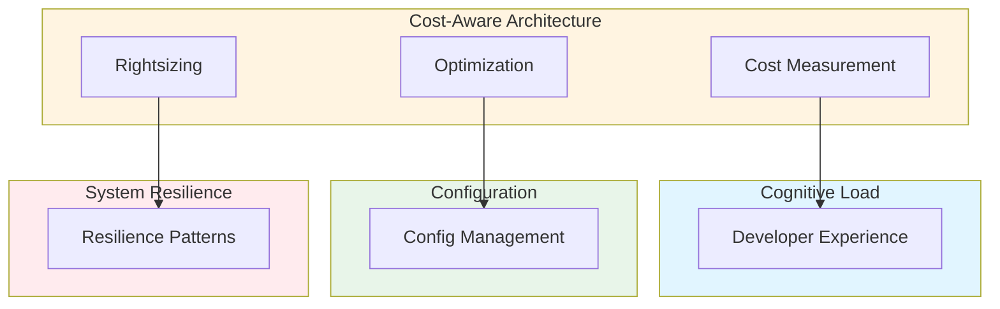

# Cost-Aware Architecture & Resource-Efficiency Governance: Best Practices

**Objective**: Establish comprehensive cost governance frameworks that measure, optimize, and control resource costs across Kubernetes clusters, data systems, ML pipelines, and geospatial workloads. When you need to optimize costs, when you want to rightsize resources, when you need capacity planning—this guide provides the complete framework.

## Introduction

Cost-aware architecture is not about cutting corners—it's about optimizing resource utilization while maintaining performance and reliability. This guide establishes patterns for measuring, governing, and optimizing costs across all system layers.

**What This Guide Covers**:
- Framework for measuring and governing cost across Kubernetes, data systems, ML pipelines, and geospatial workloads
- Tooling: cost exporters, Kubecost, Prometheus-based cost estimation
- Cost-aware CI workloads, caching rules, and build pipelines
- Rightsizing strategies (compute, memory, GPU, storage IO)
- Capacity planning for HPC-like mixed CPU/GPU clusters
- Anti-patterns: overprovisioning, zombie PVCs, lakehouse sprawl
- Fitness functions for cost efficiency

**Prerequisites**:
- Understanding of cloud economics and resource management
- Familiarity with Kubernetes, databases, and ML workloads
- Experience with cost optimization and capacity planning

**Related Documents**:
This document integrates with:
- **[Cognitive Load Management and Developer Experience](cognitive-load-developer-experience.md)** - Cost-aware developer workflows
- **[Configuration Management](../operations-monitoring/configuration-management.md)** - Cost-aware configuration
- **[System Resilience, Rate Limiting, Concurrency Control & Backpressure](../operations-monitoring/system-resilience-and-concurrency.md)** - Cost-aware resilience patterns
- **[Data Freshness, SLA/SLO Governance, and Pipeline Reliability Contracts](../data-governance/data-freshness-sla-governance.md)** - Cost-aware data pipelines

## The Philosophy of Cost-Aware Architecture

### Cost Principles

**Principle 1: Measure First**
- Instrument all resource usage
- Track costs at granular levels
- Establish cost baselines

**Principle 2: Optimize Continuously**
- Regular cost reviews
- Automated optimization
- Rightsizing recommendations

**Principle 3: Balance Cost and Performance**
- Don't sacrifice performance for cost
- Optimize for value, not just cost
- Consider total cost of ownership

## Cost Measurement Framework

### Kubernetes Cost Measurement

**Kubecost Integration**:
```yaml
# Kubecost configuration
kubecost:
  enabled: true
  exporter:
    enabled: true
    namespace: "kubecost"
  cost_model:
    cpu_cost_per_hour: 0.024
    ram_cost_per_hour: 0.01
    storage_cost_per_gb_month: 0.10
```

**Prometheus Cost Metrics**:
```yaml
# Prometheus cost metrics
cost_metrics:
  - name: "pod_cost_per_hour"
    query: "sum(rate(container_cpu_usage_seconds_total[5m])) * cpu_cost_per_hour"
  - name: "storage_cost_per_month"
    query: "sum(persistentvolumeclaim_info) * storage_cost_per_gb_month"
```

### Data Systems Cost Measurement

**Postgres Cost Tracking**:
```sql
-- Postgres cost tracking
CREATE TABLE cost_tracking (
    id SERIAL PRIMARY KEY,
    resource_type VARCHAR(50) NOT NULL,
    resource_name VARCHAR(255) NOT NULL,
    cost_per_hour DECIMAL(10, 4),
    usage_hours DECIMAL(10, 2),
    total_cost DECIMAL(10, 2),
    recorded_at TIMESTAMPTZ NOT NULL DEFAULT NOW()
);

-- Track connection costs
INSERT INTO cost_tracking (resource_type, resource_name, cost_per_hour, usage_hours)
SELECT 
    'connection',
    database_name,
    0.001,  -- Cost per connection per hour
    EXTRACT(EPOCH FROM (NOW() - backend_start)) / 3600
FROM pg_stat_activity
WHERE state = 'active';
```

**Object Store Cost Tracking**:
```python
# Object store cost tracking
class ObjectStoreCostTracker:
    def track_costs(self, bucket: str) -> dict:
        """Track object store costs"""
        # Get storage size
        storage_gb = self.get_storage_size(bucket)
        
        # Get request counts
        requests = self.get_request_counts(bucket)
        
        # Calculate costs
        storage_cost = storage_gb * self.storage_cost_per_gb_month
        request_cost = requests * self.request_cost_per_1000
        
        return {
            'storage_cost': storage_cost,
            'request_cost': request_cost,
            'total_cost': storage_cost + request_cost
        }
```

### ML Pipeline Cost Measurement

**ML Cost Tracking**:
```python
# ML cost tracking
class MLCostTracker:
    def track_training_cost(self, experiment: Experiment) -> dict:
        """Track ML training costs"""
        # Get GPU hours
        gpu_hours = experiment.gpu_count * experiment.duration_hours
        
        # Get compute costs
        compute_cost = gpu_hours * self.gpu_cost_per_hour
        
        # Get storage costs
        storage_cost = experiment.data_size_gb * self.storage_cost_per_gb_month
        
        return {
            'compute_cost': compute_cost,
            'storage_cost': storage_cost,
            'total_cost': compute_cost + storage_cost
        }
```

### Geospatial Pipeline Cost Measurement

**Geospatial Cost Tracking**:
```python
# Geospatial cost tracking
class GeospatialCostTracker:
    def track_tiling_cost(self, pipeline: TilingPipeline) -> dict:
        """Track geospatial tiling costs"""
        # Get compute costs
        compute_cost = pipeline.compute_hours * self.compute_cost_per_hour
        
        # Get storage costs
        storage_cost = pipeline.tile_storage_gb * self.storage_cost_per_gb_month
        
        # Get network costs
        network_cost = pipeline.data_transfer_gb * self.network_cost_per_gb
        
        return {
            'compute_cost': compute_cost,
            'storage_cost': storage_cost,
            'network_cost': network_cost,
            'total_cost': compute_cost + storage_cost + network_cost
        }
```

## Rightsizing Strategies

### Compute Rightsizing

**CPU Rightsizing**:
```yaml
# CPU rightsizing
rightsizing:
  cpu:
    strategy: "based_on_usage"
    target_utilization: 70
    min_cpu: "100m"
    max_cpu: "4"
    recommendations:
      - service: "user-api"
        current: "2"
        recommended: "1"
        savings: "50%"
```

**Memory Rightsizing**:
```yaml
# Memory rightsizing
rightsizing:
  memory:
    strategy: "based_on_usage"
    target_utilization: 80
    min_memory: "256Mi"
    max_memory: "8Gi"
    recommendations:
      - service: "user-api"
        current: "4Gi"
        recommended: "2Gi"
        savings: "50%"
```

### GPU Rightsizing

**GPU Rightsizing**:
```yaml
# GPU rightsizing
rightsizing:
  gpu:
    strategy: "based_on_inference_load"
    target_utilization: 60
    gpu_types:
      - type: "nvidia-t4"
        cost_per_hour: 0.35
      - type: "nvidia-a100"
        cost_per_hour: 3.06
    recommendations:
      - workload: "ml-inference"
        current: "a100"
        recommended: "t4"
        savings: "88%"
```

### Storage IO Rightsizing

**Storage IO Rightsizing**:
```yaml
# Storage IO rightsizing
rightsizing:
  storage_io:
    strategy: "based_on_iops"
    target_iops: 1000
    storage_classes:
      - name: "ssd"
        cost_per_gb_month: 0.10
        iops: 3000
      - name: "hdd"
        cost_per_gb_month: 0.05
        iops: 500
    recommendations:
      - volume: "analytics-data"
        current: "ssd"
        recommended: "hdd"
        savings: "50%"
```

## Capacity Planning

### HPC-Like Mixed CPU/GPU Clusters

**Capacity Planning Model**:
```python
# Capacity planning
class CapacityPlanner:
    def plan_capacity(self, workload: Workload) -> CapacityPlan:
        """Plan capacity for mixed CPU/GPU cluster"""
        # Analyze workload requirements
        cpu_requirements = self.analyze_cpu_requirements(workload)
        gpu_requirements = self.analyze_gpu_requirements(workload)
        memory_requirements = self.analyze_memory_requirements(workload)
        
        # Calculate node requirements
        cpu_nodes = math.ceil(cpu_requirements / self.cpu_per_node)
        gpu_nodes = math.ceil(gpu_requirements / self.gpu_per_node)
        
        # Optimize for cost
        optimized = self.optimize_node_allocation(cpu_nodes, gpu_nodes)
        
        return CapacityPlan(
            cpu_nodes=optimized.cpu_nodes,
            gpu_nodes=optimized.gpu_nodes,
            estimated_cost=optimized.cost
        )
```

## Cost-Aware CI Workloads

### CI Cost Optimization

**CI Cost Configuration**:
```yaml
# CI cost optimization
ci_cost:
  strategies:
    - name: "caching"
      enabled: true
      cache_ttl: "7 days"
      savings: "30%"
    
    - name: "parallel_execution"
      enabled: true
      max_parallel: 4
      savings: "40%"
    
    - name: "spot_instances"
      enabled: true
      spot_price: "70% of on-demand"
      savings: "30%"
```

### Build Pipeline Optimization

**Build Cost Optimization**:
```yaml
# Build cost optimization
build_optimization:
  docker:
    multi_stage: true
    layer_caching: true
    savings: "50%"
  
  dependencies:
    caching: true
    cache_ttl: "30 days"
    savings: "40%"
```

## Anti-Patterns

### Overprovisioning

**Problem**: Resources provisioned but not used.

**Example**:
```yaml
# Bad: Overprovisioned
resources:
  requests:
    cpu: "8"
    memory: "32Gi"
  # Actual usage: 0.5 CPU, 2Gi memory

# Good: Right-sized
resources:
  requests:
    cpu: "1"
    memory: "4Gi"
  limits:
    cpu: "2"
    memory: "8Gi"
```

### Zombie PVCs

**Problem**: Persistent volumes not cleaned up.

**Fix**: Automated cleanup.

```yaml
# PVC cleanup policy
pvc_cleanup:
  enabled: true
  retention: "30 days"
  orphaned_pvc_cleanup: true
```

### Lakehouse Sprawl

**Problem**: Unused data accumulating in lakehouse.

**Fix**: Data lifecycle policies.

```yaml
# Data lifecycle policy
data_lifecycle:
  retention:
    raw: "90 days"
    processed: "365 days"
    aggregated: "indefinite"
  archival:
    enabled: true
    cold_storage: "s3-glacier"
```

## Architecture Fitness Functions

### Cost Efficiency Fitness Function

**Definition**:
```python
# Cost efficiency fitness function
class CostEfficiencyFitnessFunction:
    def evaluate(self, system: System) -> float:
        """Evaluate cost efficiency"""
        # Calculate cost per request
        cost_per_request = system.total_cost / system.total_requests
        
        # Calculate resource utilization
        resource_utilization = system.actual_usage / system.provisioned
        
        # Calculate efficiency score
        efficiency = (1 / cost_per_request) * resource_utilization
        
        return efficiency
```

## Cross-Document Architecture



## Checklists

### Cost Governance Checklist

- [ ] Cost measurement enabled
- [ ] Rightsizing recommendations active
- [ ] Capacity planning documented
- [ ] CI cost optimization configured
- [ ] Anti-patterns addressed
- [ ] Fitness functions defined
- [ ] Regular cost reviews scheduled
- [ ] Cost alerts configured

## See Also

- **[Cognitive Load Management and Developer Experience](cognitive-load-developer-experience.md)** - Cost-aware developer workflows
- **[Configuration Management](../operations-monitoring/configuration-management.md)** - Cost-aware configuration
- **[System Resilience, Rate Limiting, Concurrency Control & Backpressure](../operations-monitoring/system-resilience-and-concurrency.md)** - Cost-aware resilience patterns
- **[Data Freshness, SLA/SLO Governance, and Pipeline Reliability Contracts](../data-governance/data-freshness-sla-governance.md)** - Cost-aware data pipelines

---

*This guide establishes comprehensive cost governance patterns. Start with measurement, extend to optimization, and continuously rightsize resources for efficiency.*

