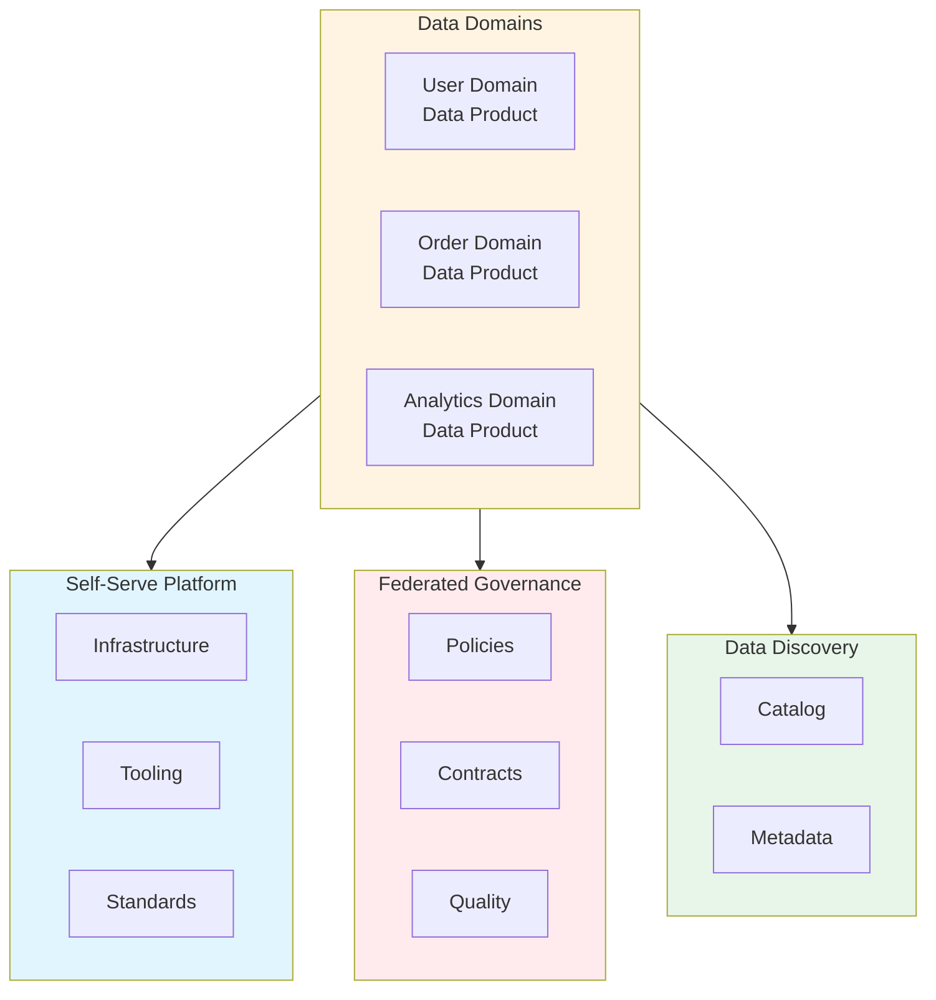

# Data Mesh Architecture: Best Practices

**Objective**: Establish comprehensive data mesh architecture that enables domain-driven data ownership, decentralized data products, and federated governance. When you need domain ownership, when you want decentralized data, when you need federated governance—this guide provides the complete framework.

## Introduction

Data mesh is a paradigm shift from centralized data platforms to decentralized, domain-oriented data architecture. This guide establishes patterns for data mesh implementation, domain ownership, data products, and federated governance across all data systems.

**What This Guide Covers**:
- Domain-driven data ownership
- Data product architecture
- Federated governance
- Self-serve data infrastructure
- Data product discovery and consumption
- Cross-domain data contracts
- Data mesh observability
- Polyglot storage in data mesh

**Prerequisites**:
- Understanding of domain-driven design
- Familiarity with data platforms and governance
- Experience with distributed data systems

**Related Documents**:
This document integrates with:
- **[Cross-System Data Lineage, Inter-Service Metadata Contracts & Provenance Enforcement](../database-data/data-lineage-contracts.md)** - Lineage in data mesh
- **[Data Quality SLAs, Validation Layers, and Observability for Tabular, Geospatial, and ML Data](../data-governance/data-quality-sla-validation-observability.md)** - Quality in data mesh
- **[Semantic Layer Engineering, Domain Models, and Knowledge Graph Alignment](../database-data/semantic-layer-engineering.md)** - Semantic layer in data mesh

## The Philosophy of Data Mesh

### Data Mesh Principles

**Principle 1: Domain Ownership**
- Domain teams own their data
- Data as a product
- Domain expertise embedded

**Principle 2: Federated Governance**
- Global standards
- Local autonomy
- Federated policies

**Principle 3: Self-Serve Infrastructure**
- Platform capabilities
- Domain autonomy
- Standardized tooling

## Data Mesh Architecture

### Architecture Model

**Diagram**:


## Domain Ownership

### Domain Data Product

**Pattern**:
```yaml
# Domain data product
data_product:
  domain: "user"
  owner: "user-domain-team"
  products:
    - name: "user-profile"
      schema: "user_profile_v1"
      storage: "parquet"
      location: "s3://data-mesh/user/profile"
    - name: "user-activity"
      schema: "user_activity_v1"
      storage: "parquet"
      location: "s3://data-mesh/user/activity"
```

## Federated Governance

### Governance Model

**Pattern**:
```yaml
# Federated governance
federated_governance:
  global_standards:
    - "schema_versioning"
    - "data_quality_sla"
    - "privacy_policies"
  domain_autonomy:
    - "storage_choice"
    - "processing_tools"
    - "team_structure"
  policies:
    - "data_retention"
    - "access_control"
    - "quality_requirements"
```

## Self-Serve Infrastructure

### Platform Capabilities

**Pattern**:
```yaml
# Self-serve platform
self_serve_platform:
  capabilities:
    - "data_storage"
    - "data_processing"
    - "data_catalog"
    - "data_quality"
    - "data_lineage"
  tooling:
    - "schema_registry"
    - "data_pipeline_templates"
    - "quality_frameworks"
```

## Architecture Fitness Functions

### Data Mesh Fitness Function

**Definition**:
```python
# Data mesh fitness function
class DataMeshFitnessFunction:
    def evaluate(self, system: System) -> float:
        """Evaluate data mesh maturity"""
        # Check domain ownership
        domain_ownership = self.check_domain_ownership(system)
        
        # Check federated governance
        federated_governance = self.check_federated_governance(system)
        
        # Check self-serve infrastructure
        self_serve = self.check_self_serve_infrastructure(system)
        
        # Calculate fitness
        fitness = (domain_ownership * 0.4) + \
                  (federated_governance * 0.3) + \
                  (self_serve * 0.3)
        
        return fitness
```

## See Also

- **[Cross-System Data Lineage, Inter-Service Metadata Contracts & Provenance Enforcement](../database-data/data-lineage-contracts.md)** - Lineage
- **[Data Quality SLAs, Validation Layers, and Observability](../data-governance/data-quality-sla-validation-observability.md)** - Quality
- **[Semantic Layer Engineering](../database-data/semantic-layer-engineering.md)** - Semantic layer

---

*This guide establishes comprehensive data mesh patterns. Start with domain ownership, extend to federated governance, and continuously enable self-serve infrastructure.*

