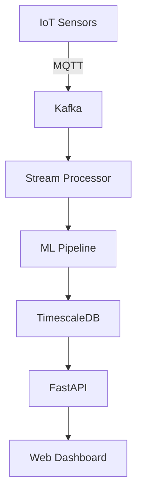

# Documentation Best Practices (2025 Edition)

**Objective**: Docs aren't optional—they're survival kits. Without them, your brilliant pipelines collapse into archaeology.

Docs aren't optional—they're survival kits. Without them, your brilliant pipelines collapse into archaeology.

## 0) Prerequisites (Read Once, Live by Them)

### The Five Commandments

1. **Documentation is a first-class artifact**
   - Not an afterthought or "nice to have"
   - Versioned alongside code
   - Reviewed like code
   - Maintained like code

2. **Keep docs close to the code**
   - MkDocs, Sphinx, Rustdoc, JSDoc
   - Same repository as source code
   - Automated generation from code
   - Single source of truth

3. **Automation beats memory**
   - Generate API docs automatically
   - Update changelogs programmatically
   - Run link checkers in CI
   - Validate documentation in pipelines

4. **Treat docs like code**
   - Version control everything
   - Code review for documentation
   - CI validation and testing
   - Automated publishing

5. **Documentation ownership is non-negotiable**
   - Assign clear ownership
   - Update docs with code changes
   - Regular audits and maintenance
   - No orphaned documentation

**Why These Principles**: Documentation requires understanding information architecture, automation patterns, and maintenance strategies. Understanding these patterns prevents knowledge chaos and enables reliable software development.

## 1) Core Principles

### The Documentation Reality

```yaml
# What you thought documentation was
docs_fantasy:
  "effort": "Write once, forget forever"
  "maintenance": "Docs maintain themselves"
  "value": "Nice to have, not essential"
  "ownership": "Someone else's problem"

# What documentation actually is
docs_reality:
  "effort": "Continuous investment in clarity"
  "maintenance": "Docs rot faster than bananas"
  "value": "Survival kit for your future self"
  "ownership": "Everyone's responsibility"
```

**Why Reality Checks Matter**: Understanding the true nature of documentation enables proper investment in clarity and maintenance. Understanding these patterns prevents knowledge chaos and enables reliable software development.

### Documentation Lifecycle

```markdown
## Documentation Lifecycle

### Creation Phase
- [ ] Identify documentation needs
- [ ] Choose appropriate format and tools
- [ ] Write initial content
- [ ] Review for clarity and completeness

### Maintenance Phase
- [ ] Update with code changes
- [ ] Regular content audits
- [ ] Link validation and testing
- [ ] User feedback incorporation

### Evolution Phase
- [ ] Refactor for clarity
- [ ] Migrate to better tools
- [ ] Archive outdated content
- [ ] Measure documentation effectiveness
```

**Why Lifecycle Management Matters**: Proper documentation lifecycle enables sustainable knowledge management and prevents documentation rot. Understanding these patterns prevents knowledge chaos and enables reliable software development.

## 2) Types of Documentation

### README (The Front Door)

```markdown
# MyAwesomeProject

> A data processing pipeline that transforms raw telemetry into actionable insights.

## Quick Start

```bash
# Clone and setup
git clone https://github.com/org/myawesomeproject.git
cd myawesomeproject
pip install -e .

# Run the pipeline
python -m myawesomeproject.cli --config config.yaml
```

## What This Does

- **Ingests** IoT sensor data from Kafka
- **Processes** telemetry using ML models
- **Stores** results in TimescaleDB
- **Exposes** insights via FastAPI

## Configuration

See [Configuration Guide](docs/configuration.md) for detailed setup.

## Contributing

See [Contributing Guide](CONTRIBUTING.md) for development setup.

## License

MIT License - see [LICENSE](LICENSE) for details.
```

**Why README Matters**: README files serve as the entry point and first impression of your project. Understanding these patterns prevents user confusion and enables reliable software adoption.

### Architecture Documentation

```markdown
# System Architecture

## Overview

The MyAwesomeProject system processes IoT telemetry data through a multi-stage pipeline.



## Components

### Data Ingestion
- **Kafka**: Message streaming platform
- **Schema Registry**: Data serialization
- **Dead Letter Queue**: Error handling

### Processing
- **Stream Processor**: Real-time data transformation
- **ML Pipeline**: Anomaly detection and classification
- **Feature Store**: ML feature management

### Storage
- **TimescaleDB**: Time-series data storage
- **Redis**: Caching and session storage
- **S3**: Long-term data archival

### API Layer
- **FastAPI**: REST API for data access
- **WebSocket**: Real-time updates
- **Authentication**: JWT-based security
```

**Why Architecture Docs Matter**: Architecture documentation enables understanding of system design and component interactions. Understanding these patterns prevents architectural chaos and enables reliable software development.

### How-To Guides

```markdown
# How to Deploy to Production

## Prerequisites

- Docker and Docker Compose installed
- Kubernetes cluster access
- Helm 3.x installed
- Production secrets configured

## Step 1: Build Production Images

```bash
# Build multi-architecture images
docker buildx bake --file docker-bake.hcl production

# Verify image integrity
docker run --rm myapp:latest python -c "import myapp; print('OK')"
```

## Step 2: Deploy to Kubernetes

```bash
# Create namespace
kubectl create namespace myapp-prod

# Install with Helm
helm install myapp ./helm/myapp \
  --namespace myapp-prod \
  --values values/production.yaml

# Verify deployment
kubectl get pods -n myapp-prod
```

## Step 3: Configure Monitoring

```bash
# Deploy Prometheus
helm install prometheus prometheus-community/kube-prometheus-stack

# Configure alerts
kubectl apply -f monitoring/alerts.yaml
```

## Troubleshooting

### Common Issues

**Issue**: Pods stuck in Pending state
**Solution**: Check resource quotas and node capacity

**Issue**: Database connection failures
**Solution**: Verify database credentials and network policies

**Issue**: High memory usage
**Solution**: Check for memory leaks and adjust resource limits
```

**Why How-To Guides Matter**: How-to guides enable reproducible procedures and reduce knowledge transfer friction. Understanding these patterns prevents operational chaos and enables reliable software deployment.

### Reference Documentation

```markdown
# API Reference

## Authentication

All API endpoints require authentication via JWT token.

```http
Authorization: Bearer <jwt_token>
```

## Endpoints

### GET /api/v1/telemetry

Retrieve telemetry data for a time range.

**Parameters:**
- `start_time` (required): ISO 8601 timestamp
- `end_time` (required): ISO 8601 timestamp
- `sensor_id` (optional): Filter by sensor ID
- `limit` (optional): Maximum results (default: 1000)

**Response:**
```json
{
  "data": [
    {
      "sensor_id": "sensor_001",
      "timestamp": "2024-01-15T10:30:00Z",
      "temperature": 23.5,
      "humidity": 65.2
    }
  ],
  "pagination": {
    "total": 1500,
    "page": 1,
    "per_page": 1000
  }
}
```

### POST /api/v1/telemetry

Submit new telemetry data.

**Request Body:**
```json
{
  "sensor_id": "sensor_001",
  "timestamp": "2024-01-15T10:30:00Z",
  "temperature": 23.5,
  "humidity": 65.2
}
```

**Response:**
```json
{
  "status": "success",
  "id": "telemetry_12345"
}
```
```

**Why Reference Docs Matter**: Reference documentation enables precise API usage and reduces integration errors. Understanding these patterns prevents integration chaos and enables reliable software development.

### Architecture Decision Records (ADRs)

```markdown
# ADR-001: Use TimescaleDB for Time-Series Data

## Status
Accepted

## Context
We need to store and query large volumes of IoT telemetry data with time-based patterns.

## Decision
Use TimescaleDB as the primary time-series database.

## Consequences

### Positive
- Native time-series optimization
- PostgreSQL compatibility
- Excellent query performance
- Mature ecosystem

### Negative
- Additional infrastructure complexity
- Learning curve for team
- Potential vendor lock-in

## Alternatives Considered
- InfluxDB: Good performance but limited SQL support
- ClickHouse: Excellent performance but complex setup
- PostgreSQL with custom partitioning: More work, less optimization

## Implementation
- Deploy TimescaleDB in Kubernetes
- Migrate existing data
- Update application code
- Train team on TimescaleDB features
```

**Why ADRs Matter**: ADRs document architectural decisions and their rationale, enabling future understanding and decision-making. Understanding these patterns prevents architectural chaos and enables reliable software development.

## 3) Documentation in Practice

### MkDocs Configuration

```yaml
# mkdocs.yml
site_name: MyAwesomeProject Documentation
site_description: Data processing pipeline documentation
site_url: https://myorg.github.io/myawesomeproject
repo_url: https://github.com/myorg/myawesomeproject
edit_uri: edit/main/docs/

theme:
  name: material
  palette:
    - scheme: default
      primary: indigo
      accent: indigo
      toggle:
        icon: material/brightness-7
        name: Switch to dark mode
    - scheme: slate
      primary: indigo
      accent: indigo
      toggle:
        icon: material/brightness-4
        name: Switch to light mode
  features:
    - navigation.tabs
    - navigation.sections
    - navigation.expand
    - navigation.top
    - search.highlight
    - search.share
    - content.code.copy
  icon:
    repo: fontawesome/brands/github

nav:
  - Home: index.md
  - Getting Started:
    - Installation: getting-started/installation.md
    - Configuration: getting-started/configuration.md
    - Quick Start: getting-started/quickstart.md
  - User Guide:
    - Overview: user-guide/overview.md
    - API Reference: user-guide/api.md
    - Examples: user-guide/examples.md
  - Developer Guide:
    - Architecture: developer-guide/architecture.md
    - Contributing: developer-guide/contributing.md
    - Testing: developer-guide/testing.md
  - Operations:
    - Deployment: operations/deployment.md
    - Monitoring: operations/monitoring.md
    - Troubleshooting: operations/troubleshooting.md

plugins:
  - search
  - mkdocs-material
  - mkdocstrings:
      handlers:
        python:
          paths: [src]
          options:
            docstring_style: google
            show_source: true
            show_root_heading: true
            show_root_toc_entry: true
  - mermaid2

markdown_extensions:
  - pymdownx.highlight:
      anchor_linenums: true
  - pymdownx.inlinehilite
  - pymdownx.superfences
  - pymdownx.tabbed:
      alternate_style: true
  - pymdownx.snippets
  - admonition
  - pymdownx.details
  - pymdownx.superfences
  - attr_list
  - md_in_html
  - tables
  - footnotes
  - toc:
      permalink: true
```

**Why MkDocs Matters**: MkDocs provides lightweight, maintainable documentation with excellent search and navigation. Understanding these patterns prevents documentation chaos and enables reliable software development.

### Python Documentation

```python
# src/myapp/models.py
"""Data models for the MyAwesomeProject application."""

from typing import Optional, List
from datetime import datetime
from pydantic import BaseModel, Field


class TelemetryData(BaseModel):
    """Represents a single telemetry data point.
    
    This model captures IoT sensor data including environmental
    measurements and metadata.
    
    Attributes:
        sensor_id: Unique identifier for the sensor
        timestamp: When the measurement was taken
        temperature: Temperature reading in Celsius
        humidity: Humidity reading as percentage
        pressure: Atmospheric pressure in hPa
        location: Optional GPS coordinates
    """
    
    sensor_id: str = Field(..., description="Unique sensor identifier")
    timestamp: datetime = Field(..., description="Measurement timestamp")
    temperature: float = Field(..., ge=0, le=100, description="Temperature in Celsius")
    humidity: float = Field(..., ge=0, le=100, description="Humidity percentage")
    pressure: float = Field(..., ge=0, description="Pressure in hPa")
    location: Optional[dict] = Field(None, description="GPS coordinates if available")
    
    class Config:
        """Pydantic configuration."""
        json_encoders = {
            datetime: lambda v: v.isoformat()
        }
    
    def validate_temperature(self) -> bool:
        """Validate temperature reading is within reasonable range.
        
        Returns:
            True if temperature is within normal operating range
            
        Raises:
            ValueError: If temperature is outside acceptable range
        """
        if self.temperature < -50 or self.temperature > 150:
            raise ValueError(f"Temperature {self.temperature}°C outside acceptable range")
        return True


class TelemetryBatch(BaseModel):
    """Batch of telemetry data points.
    
    Used for bulk operations and API responses.
    """
    
    data: List[TelemetryData] = Field(..., description="List of telemetry data points")
    batch_id: str = Field(..., description="Unique batch identifier")
    created_at: datetime = Field(default_factory=datetime.utcnow)
    
    def __len__(self) -> int:
        """Return number of data points in batch."""
        return len(self.data)
    
    def add_data_point(self, data_point: TelemetryData) -> None:
        """Add a new data point to the batch.
        
        Args:
            data_point: TelemetryData instance to add
            
        Raises:
            ValueError: If data point is invalid
        """
        data_point.validate_temperature()
        self.data.append(data_point)
```

**Why Python Documentation Matters**: Python docstrings enable automatic API documentation generation and improve code maintainability. Understanding these patterns prevents code chaos and enables reliable software development.

### Rust Documentation

```rust
//! # MyAwesomeProject Core Library
//! 
//! This crate provides the core functionality for processing IoT telemetry data.
//! It includes data structures, processing algorithms, and utility functions.

use serde::{Deserialize, Serialize};
use std::collections::HashMap;
use chrono::{DateTime, Utc};

/// Represents a single telemetry data point from an IoT sensor.
/// 
/// This struct captures environmental measurements and metadata
/// for time-series analysis and anomaly detection.
/// 
/// # Examples
/// 
/// ```rust
/// use myawesomeproject::TelemetryData;
/// use chrono::Utc;
/// 
/// let data = TelemetryData {
///     sensor_id: "sensor_001".to_string(),
///     timestamp: Utc::now(),
///     temperature: 23.5,
///     humidity: 65.2,
///     pressure: 1013.25,
///     location: None,
/// };
/// 
/// assert!(data.is_valid());
/// ```
#[derive(Debug, Clone, Serialize, Deserialize)]
pub struct TelemetryData {
    /// Unique identifier for the sensor
    pub sensor_id: String,
    /// When the measurement was taken
    pub timestamp: DateTime<Utc>,
    /// Temperature reading in Celsius
    pub temperature: f64,
    /// Humidity reading as percentage (0-100)
    pub humidity: f64,
    /// Atmospheric pressure in hPa
    pub pressure: f64,
    /// Optional GPS coordinates
    pub location: Option<Location>,
}

impl TelemetryData {
    /// Creates a new telemetry data point.
    /// 
    /// # Arguments
    /// 
    /// * `sensor_id` - Unique identifier for the sensor
    /// * `timestamp` - When the measurement was taken
    /// * `temperature` - Temperature in Celsius
    /// * `humidity` - Humidity percentage (0-100)
    /// * `pressure` - Pressure in hPa
    /// 
    /// # Returns
    /// 
    /// A new `TelemetryData` instance.
    /// 
    /// # Examples
    /// 
    /// ```rust
    /// use myawesomeproject::TelemetryData;
    /// use chrono::Utc;
    /// 
    /// let data = TelemetryData::new(
    ///     "sensor_001".to_string(),
    ///     Utc::now(),
    ///     23.5,
    ///     65.2,
    ///     1013.25,
    /// );
    /// ```
    pub fn new(
        sensor_id: String,
        timestamp: DateTime<Utc>,
        temperature: f64,
        humidity: f64,
        pressure: f64,
    ) -> Self {
        Self {
            sensor_id,
            timestamp,
            temperature,
            humidity,
            pressure,
            location: None,
        }
    }
    
    /// Validates the telemetry data for reasonable values.
    /// 
    /// # Returns
    /// 
    /// `true` if the data is within acceptable ranges, `false` otherwise.
    /// 
    /// # Examples
    /// 
    /// ```rust
    /// use myawesomeproject::TelemetryData;
    /// use chrono::Utc;
    /// 
    /// let valid_data = TelemetryData::new(
    ///     "sensor_001".to_string(),
    ///     Utc::now(),
    ///     23.5,  // Reasonable temperature
    ///     65.2,  // Reasonable humidity
    ///     1013.25, // Reasonable pressure
    /// );
    /// 
    /// assert!(valid_data.is_valid());
    /// ```
    pub fn is_valid(&self) -> bool {
        self.temperature >= -50.0 && self.temperature <= 150.0
            && self.humidity >= 0.0 && self.humidity <= 100.0
            && self.pressure >= 0.0
    }
}

/// Location coordinates for GPS data.
#[derive(Debug, Clone, Serialize, Deserialize)]
pub struct Location {
    /// Latitude in decimal degrees
    pub latitude: f64,
    /// Longitude in decimal degrees
    pub longitude: f64,
    /// Optional altitude in meters
    pub altitude: Option<f64>,
}
```

**Why Rust Documentation Matters**: Rust documentation enables automatic API docs generation and improves code understanding. Understanding these patterns prevents code chaos and enables reliable software development.

### FastAPI Auto-Documentation

```python
# src/myapp/api.py
"""FastAPI application with automatic OpenAPI documentation."""

from fastapi import FastAPI, HTTPException, Depends
from fastapi.middleware.cors import CORSMiddleware
from typing import List, Optional
from datetime import datetime
from myapp.models import TelemetryData, TelemetryBatch
from myapp.database import get_db_session
from myapp.services import TelemetryService

app = FastAPI(
    title="MyAwesomeProject API",
    description="IoT telemetry data processing API",
    version="1.0.0",
    docs_url="/docs",
    redoc_url="/redoc",
    openapi_url="/openapi.json"
)

# CORS middleware
app.add_middleware(
    CORSMiddleware,
    allow_origins=["*"],
    allow_credentials=True,
    allow_methods=["*"],
    allow_headers=["*"],
)

@app.get(
    "/",
    summary="Health Check",
    description="Check if the API is running",
    response_description="API status information"
)
async def health_check():
    """Check API health status.
    
    Returns basic information about the API status and version.
    """
    return {
        "status": "healthy",
        "version": "1.0.0",
        "timestamp": datetime.utcnow().isoformat()
    }

@app.post(
    "/telemetry",
    response_model=dict,
    summary="Submit Telemetry Data",
    description="Submit new telemetry data points for processing",
    response_description="Submission confirmation with batch ID"
)
async def submit_telemetry(
    data: TelemetryData,
    service: TelemetryService = Depends(get_telemetry_service)
):
    """Submit a single telemetry data point.
    
    This endpoint accepts telemetry data from IoT sensors and
    processes it through the data pipeline.
    
    Args:
        data: TelemetryData instance with sensor measurements
        service: Injected TelemetryService for data processing
        
    Returns:
        dict: Confirmation with batch ID and processing status
        
    Raises:
        HTTPException: If data validation fails or processing errors occur
    """
    try:
        result = await service.process_telemetry(data)
        return {
            "status": "success",
            "batch_id": result.batch_id,
            "processed_at": result.processed_at.isoformat()
        }
    except ValueError as e:
        raise HTTPException(status_code=400, detail=str(e))
    except Exception as e:
        raise HTTPException(status_code=500, detail="Internal processing error")

@app.get(
    "/telemetry",
    response_model=List[TelemetryData],
    summary="Retrieve Telemetry Data",
    description="Get telemetry data for a time range",
    response_description="List of telemetry data points"
)
async def get_telemetry(
    start_time: datetime,
    end_time: datetime,
    sensor_id: Optional[str] = None,
    limit: int = 1000,
    service: TelemetryService = Depends(get_telemetry_service)
):
    """Retrieve telemetry data for a specified time range.
    
    Args:
        start_time: Start of time range (ISO 8601 format)
        end_time: End of time range (ISO 8601 format)
        sensor_id: Optional sensor ID filter
        limit: Maximum number of results (default: 1000)
        service: Injected TelemetryService for data retrieval
        
    Returns:
        List[TelemetryData]: Telemetry data points matching criteria
        
    Raises:
        HTTPException: If query parameters are invalid or data retrieval fails
    """
    try:
        return await service.get_telemetry(
            start_time=start_time,
            end_time=end_time,
            sensor_id=sensor_id,
            limit=limit
        )
    except ValueError as e:
        raise HTTPException(status_code=400, detail=str(e))
    except Exception as e:
        raise HTTPException(status_code=500, detail="Data retrieval error")

def get_telemetry_service() -> TelemetryService:
    """Dependency injection for TelemetryService."""
    return TelemetryService()
```

**Why FastAPI Auto-Docs Matter**: FastAPI automatically generates OpenAPI documentation from code, reducing maintenance overhead. Understanding these patterns prevents API chaos and enables reliable software development.

## 4) Automation & CI

### Documentation Linting

```yaml
# .github/workflows/docs.yml
name: Documentation CI

on:
  push:
    branches: [ main, develop ]
    paths: [ 'docs/**', '*.md' ]
  pull_request:
    branches: [ main ]
    paths: [ 'docs/**', '*.md' ]

jobs:
  lint-docs:
    runs-on: ubuntu-latest
    steps:
    - uses: actions/checkout@v4
    
    - name: Setup Python
      uses: actions/setup-python@v4
      with:
        python-version: '3.11'
        cache: 'pip'
    
    - name: Install dependencies
      run: |
        pip install markdownlint-cli2
        pip install codespell
        pip install mkdocs-material
        pip install mkdocs-mermaid2-plugin
    
    - name: Lint Markdown
      run: |
        markdownlint-cli2 "**/*.md" "#node_modules"
    
    - name: Spell check
      run: |
        codespell --skip="*.pyc,*.pyo" --ignore-words-list="fo,bar" .
    
    - name: Check links
      run: |
        mkdocs build --strict
        mkdocs serve --dev-addr=0.0.0.0:8000 &
        sleep 10
        # Add link checking logic here

  build-docs:
    runs-on: ubuntu-latest
    needs: lint-docs
    steps:
    - uses: actions/checkout@v4
    
    - name: Setup Python
      uses: actions/setup-python@v4
      with:
        python-version: '3.11'
        cache: 'pip'
    
    - name: Install dependencies
      run: |
        pip install mkdocs-material
        pip install mkdocs-mermaid2-plugin
        pip install mkdocstrings
    
    - name: Build documentation
      run: |
        mkdocs build --strict
    
    - name: Upload artifacts
      uses: actions/upload-artifact@v3
      with:
        name: documentation
        path: site/

  deploy-docs:
    runs-on: ubuntu-latest
    needs: build-docs
    if: github.ref == 'refs/heads/main'
    steps:
    - uses: actions/checkout@v4
    
    - name: Download artifacts
      uses: actions/download-artifact@v3
      with:
        name: documentation
        path: site/
    
    - name: Deploy to GitHub Pages
      uses: peaceiris/actions-gh-pages@v3
      with:
        github_token: ${{ secrets.GITHUB_TOKEN }}
        publish_dir: ./site
```

**Why Documentation CI Matters**: Automated documentation validation prevents broken links, typos, and formatting issues. Understanding these patterns prevents documentation chaos and enables reliable software development.

### Automated Changelog Generation

```yaml
# .github/workflows/changelog.yml
name: Generate Changelog

on:
  push:
    tags:
      - 'v*'

jobs:
  changelog:
    runs-on: ubuntu-latest
    steps:
    - uses: actions/checkout@v4
      with:
        fetch-depth: 0
    
    - name: Generate changelog
      uses: conventional-changelog-action@v3
      with:
        version-file: 'package.json'
        release-count: 0
        output-file: 'CHANGELOG.md'
        tag-prefix: 'v'
        skip-on-empty: true
    
    - name: Commit changelog
      run: |
        git config --local user.email "action@github.com"
        git config --local user.name "GitHub Action"
        git add CHANGELOG.md
        git commit -m "chore: update changelog" || exit 0
        git push
```

**Why Automated Changelogs Matter**: Automated changelog generation reduces manual work and ensures consistent release documentation. Understanding these patterns prevents release chaos and enables reliable software development.

## 5) Keeping Docs Alive

### Documentation Ownership

```markdown
# Documentation Ownership Matrix

## Primary Owners
- **API Documentation**: Backend team lead
- **User Guides**: Product manager
- **Architecture Docs**: Principal engineer
- **Operations Docs**: DevOps team lead

## Secondary Owners
- **Code Documentation**: Individual contributors
- **Troubleshooting Guides**: Support team
- **Integration Guides**: Solution architects

## Review Process
1. **Content Review**: Technical accuracy and completeness
2. **Style Review**: Clarity and consistency
3. **User Testing**: Usability and accessibility
4. **Regular Audits**: Quarterly content review
```

**Why Ownership Matters**: Clear ownership prevents documentation rot and ensures accountability. Understanding these patterns prevents knowledge chaos and enables reliable software development.

### Documentation Review Checklist

```markdown
# Documentation Review Checklist

## Content Quality
- [ ] Information is accurate and up-to-date
- [ ] Examples work and are tested
- [ ] Code snippets are complete and runnable
- [ ] Screenshots are current and clear
- [ ] Links are valid and functional

## Structure and Organization
- [ ] Logical flow and progression
- [ ] Clear headings and sections
- [ ] Consistent formatting and style
- [ ] Appropriate level of detail
- [ ] Good use of examples and diagrams

## User Experience
- [ ] Easy to find information
- [ ] Clear and concise language
- [ ] Appropriate for target audience
- [ ] Good use of visual elements
- [ ] Accessible and inclusive

## Technical Aspects
- [ ] Proper version control
- [ ] Automated validation passes
- [ ] Mobile-friendly formatting
- [ ] Search functionality works
- [ ] Performance is acceptable
```

**Why Review Checklists Matter**: Systematic review processes ensure documentation quality and consistency. Understanding these patterns prevents documentation chaos and enables reliable software development.

## 6) Anti-Patterns

### Common Documentation Mistakes

```yaml
# What NOT to do
docs_anti_patterns:
  "giant_word_docs": "Don't use massive Word documents in SharePoint",
  "todo_placeholders": "Don't leave 'TODO: fill in later' that never get filled",
  "out_of_sync": "Don't let diagrams and screenshots become outdated",
  "junior_work": "Don't treat docs as 'junior work' or afterthought",
  "no_ownership": "Don't leave docs without clear ownership",
  "no_automation": "Don't manually maintain everything",
  "no_review": "Don't skip documentation review",
  "no_audits": "Don't ignore documentation rot",
  "no_feedback": "Don't ignore user feedback",
  "no_metrics": "Don't skip measuring documentation effectiveness"
```

**Why Anti-Patterns Matter**: Understanding common mistakes prevents documentation failures and user frustration. Understanding these patterns prevents documentation chaos and enables reliable software development.

### Documentation Rot Prevention

```markdown
## Signs of Documentation Rot

### Content Issues
- [ ] Outdated information
- [ ] Broken examples
- [ ] Missing sections
- [ ] Inconsistent formatting
- [ ] Poor organization

### Technical Issues
- [ ] Broken links
- [ ] Outdated screenshots
- [ ] Non-functional code examples
- [ ] Missing dependencies
- [ ] Version mismatches

### Process Issues
- [ ] No regular updates
- [ ] No review process
- [ ] No user feedback
- [ ] No ownership
- [ ] No automation
```

**Why Rot Prevention Matters**: Proactive documentation maintenance prevents knowledge decay and user frustration. Understanding these patterns prevents documentation chaos and enables reliable software development.

## 7) Tooling Recommendations

### Documentation Stack

```yaml
# Recommended documentation tools
documentation_stack:
  "static_sites": "MkDocs, Docusaurus, GitBook"
  "api_docs": "Sphinx, Rustdoc, JSDoc, Swagger"
  "diagrams": "Mermaid, PlantUML, TikZ, draw.io"
  "collaboration": "Git, GitHub, GitLab, Notion"
  "automation": "GitHub Actions, GitLab CI, Netlify"
  "hosting": "GitHub Pages, Netlify, Vercel, AWS S3"
  "search": "Algolia, Elasticsearch, local search"
  "analytics": "Google Analytics, Plausible, Fathom"
```

**Why Tool Selection Matters**: Right tools enable efficient documentation workflows and better user experience. Understanding these patterns prevents tool chaos and enables reliable software development.

### ADR Template

```markdown
# ADR-XXX: [Title]

## Status
[Proposed | Accepted | Rejected | Superseded]

## Context
[Describe the context and problem statement]

## Decision
[State the architectural decision]

## Consequences

### Positive
- [List positive consequences]

### Negative
- [List negative consequences]

## Alternatives Considered
- [List alternatives that were considered]

## Implementation
- [Describe implementation steps]

## References
- [Link to related documents]
```

**Why ADR Templates Matter**: Standardized ADR templates ensure consistent architectural decision documentation. Understanding these patterns prevents architectural chaos and enables reliable software development.

## 8) TL;DR Runbook

### Essential Commands

```bash
# Build documentation locally
mkdocs serve

# Build and deploy documentation
mkdocs build
mkdocs gh-deploy

# Lint documentation
markdownlint "**/*.md"
codespell --skip="*.pyc,*.pyo" .

# Generate API documentation
sphinx-build -b html docs/ docs/_build/html
cargo doc --open

# Check for broken links
linkchecker http://localhost:8000
```

### Essential Patterns

```yaml
# Essential documentation patterns
docs_patterns:
  "version_control": "Keep docs in repo, versioned with code",
  "automation": "Automate generation, linting, and publishing",
  "comprehensive_coverage": "Cover quickstart, how-to, reference, explainers",
  "code_review": "Review docs like code",
  "regular_audits": "Run regular audits to kill rot",
  "clear_ownership": "Assign clear documentation ownership",
  "user_feedback": "Collect and act on user feedback",
  "accessibility": "Make docs accessible and inclusive",
  "search_friendly": "Optimize for search and discovery",
  "mobile_responsive": "Ensure mobile-friendly documentation"
```

### Quick Reference

```markdown
## Emergency Documentation Response

### If Documentation is Outdated
1. **Identify outdated content**
2. **Update with current information**
3. **Test all examples and links**
4. **Review with stakeholders**
5. **Deploy updated documentation**

### If Users Can't Find Information
1. **Analyze search queries and analytics**
2. **Improve navigation and structure**
3. **Add missing content**
4. **Test with real users**
5. **Iterate based on feedback**

### If Documentation is Broken
1. **Fix broken links and examples**
2. **Update outdated screenshots**
3. **Test all code snippets**
4. **Validate with automated tools**
5. **Deploy fixes immediately**
```

**Why This Runbook**: These patterns cover 90% of documentation needs. Master these before exploring advanced documentation scenarios.

## 9) The Machine's Summary

Documentation requires understanding information architecture, automation patterns, and maintenance strategies. When used correctly, effective documentation enables knowledge transfer, reduces onboarding time, and prevents knowledge loss. The key is understanding documentation types, automation tools, and maintenance processes.

**The Dark Truth**: Without proper documentation, your brilliant code becomes archaeology. Documentation is your weapon. Use it wisely.

**The Machine's Mantra**: "In the clarity we trust, in the automation we find efficiency, and in the maintenance we find the path to living documentation."

**Why This Matters**: Documentation enables knowledge transfer that can handle complex systems, prevent knowledge loss, and provide insights into system design while ensuring technical accuracy and reliability.

---

*This guide provides the complete machinery for documentation. The patterns scale from simple README files to complex multi-site documentation systems, from basic automation to advanced CI/CD integration.*
