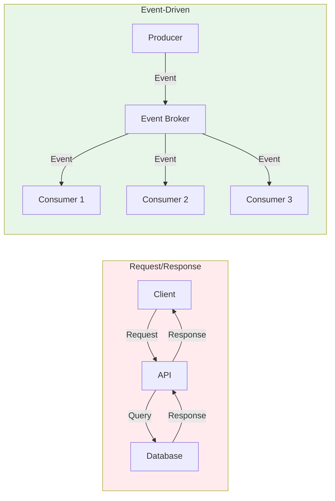
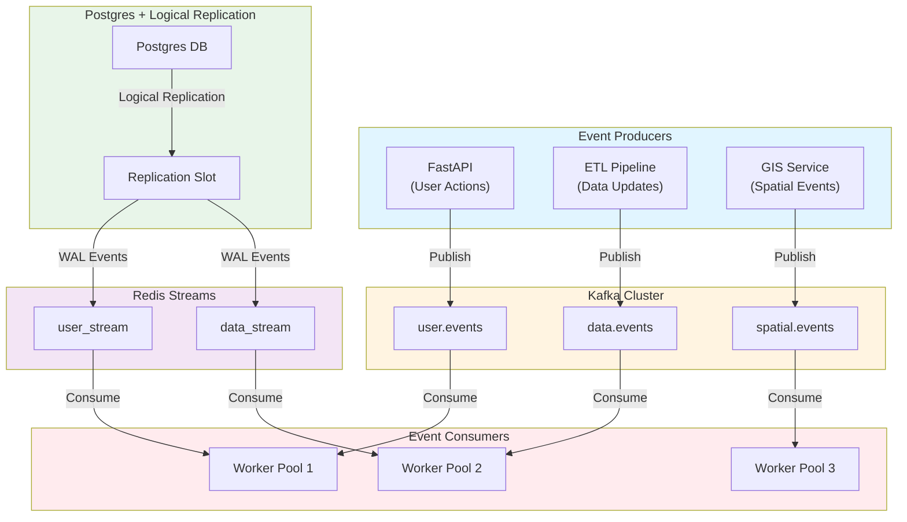
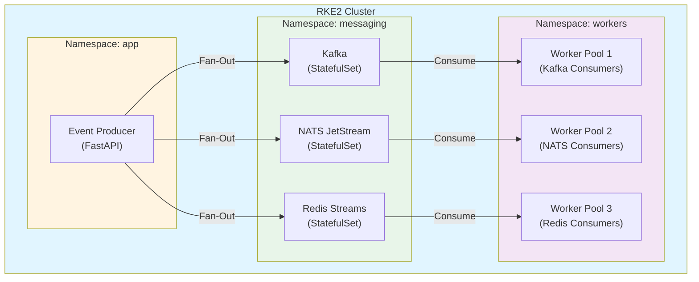
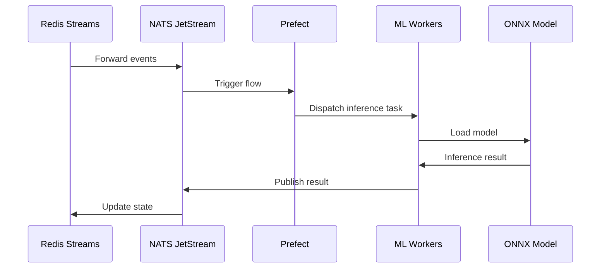
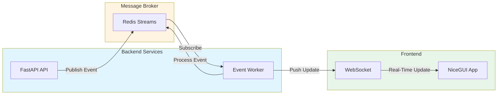
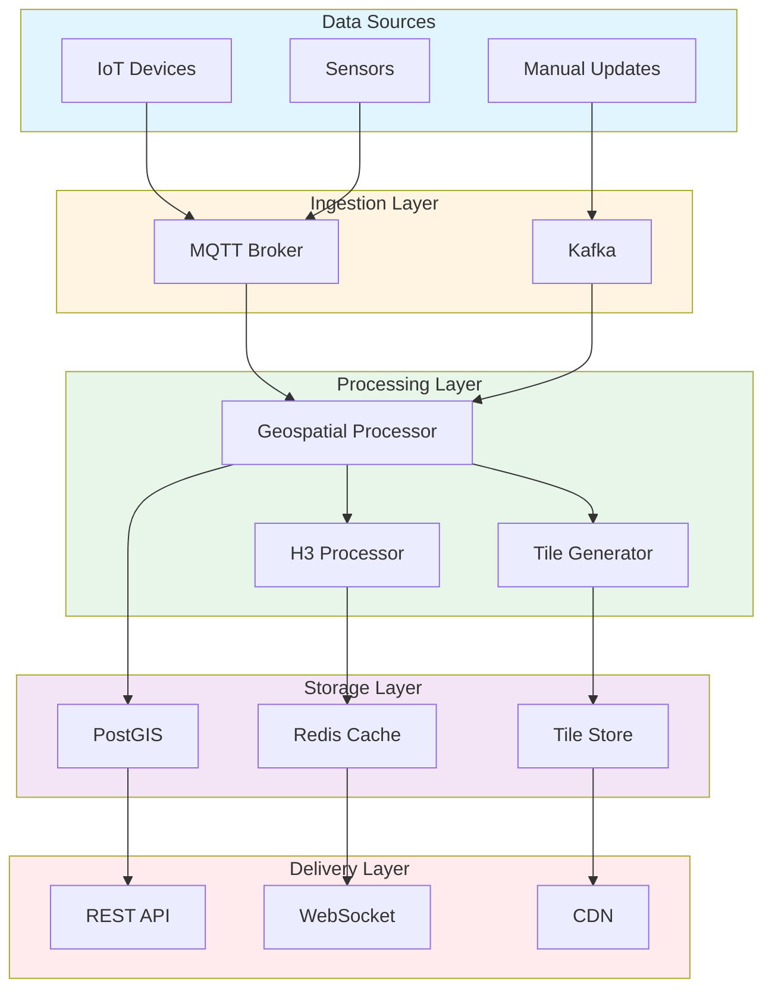
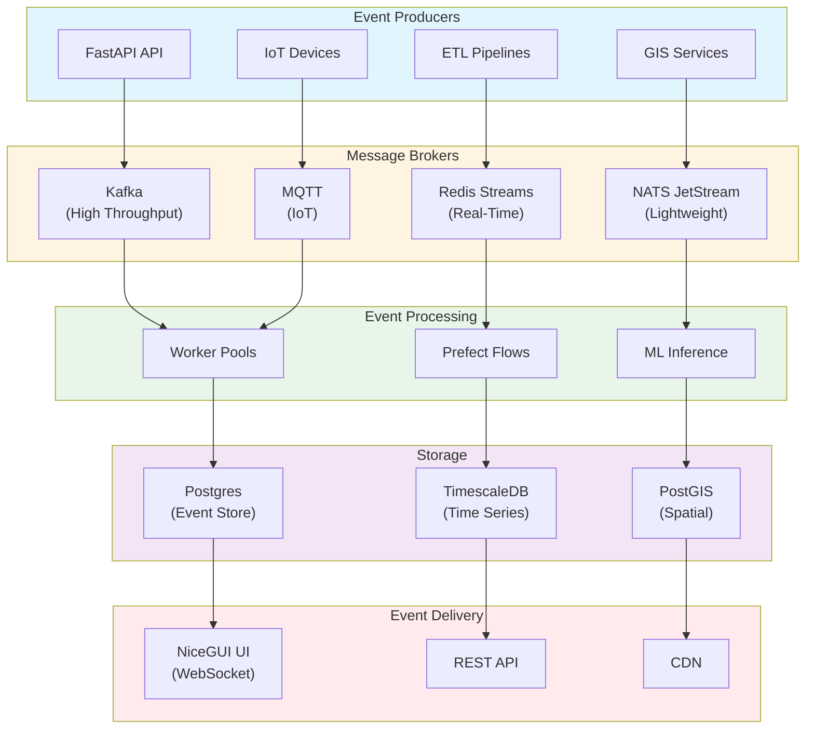

# Event-Driven Architecture: Design, Deployment, and Hardening Best Practices

**Objective**: Master production-grade event-driven architecture across Kubernetes, messaging systems, databases, and distributed services. When you need to build resilient, scalable event-driven systems with proper observability and security—this guide provides complete patterns and implementations.

## Introduction

Event-driven architecture (EDA) is the foundation of modern distributed systems. By decoupling producers and consumers through events, EDA enables scalable, resilient systems that can handle high throughput, recover from failures, and evolve independently. This guide provides a complete framework for designing, deploying, and operating event-driven systems.

**What This Guide Covers**:
- Foundations of event-driven architecture
- Critical messaging concepts (idempotency, backpressure, DLQs)
- System integration patterns (Postgres, Redis, Kafka, NATS, MQTT)
- Event contract design and schema evolution
- End-to-end architecture examples
- Operational best practices and observability
- Security and hardening
- Failure modes and recovery
- Hands-on implementation examples

**Prerequisites**:
- Understanding of distributed systems and messaging patterns
- Familiarity with Kubernetes, databases, and containerization
- Experience with at least one messaging system (Redis, Kafka, NATS, etc.)

## Foundations of Event-Driven Architecture (EDA)

### The Philosophy of EDA vs Request/Response

**Request/Response (Synchronous)**:
- Tight coupling between services
- Blocking operations
- Difficult to scale
- Single point of failure
- Hard to handle partial failures

**Event-Driven (Asynchronous)**:
- Loose coupling between services
- Non-blocking operations
- Natural horizontal scaling
- Resilient to failures
- Graceful degradation



### Producers, Consumers, Brokers, Topics, Partitions

**Producer**: Service that publishes events to a topic/stream.

**Consumer**: Service that subscribes to events and processes them.

**Broker**: Message broker that routes events from producers to consumers.

**Topic/Stream**: Logical channel for events of a specific type.

**Partition**: Physical division of a topic for parallel processing.

```python
# Producer example
class EventProducer:
    def __init__(self, broker):
        self.broker = broker
    
    async def publish(self, topic: str, event: dict):
        """Publish event to topic"""
        await self.broker.publish(topic, event)

# Consumer example
class EventConsumer:
    def __init__(self, broker):
        self.broker = broker
    
    async def consume(self, topic: str, handler: callable):
        """Consume events from topic"""
        async for event in self.broker.subscribe(topic):
            await handler(event)
```

### Push vs Pull Delivery Models

**Push Model**:
- Broker pushes messages to consumers
- Lower latency
- Requires backpressure handling
- Examples: MQTT, WebSockets, NATS

**Pull Model**:
- Consumers pull messages from broker
- Better flow control
- Higher latency
- Examples: Kafka, Redis Streams (XREAD)

```python
# Push model (NATS)
async def push_consumer():
    async def handler(msg):
        await process_message(msg.data)
    
    await nc.subscribe("events.>", cb=handler)

# Pull model (Kafka)
async def pull_consumer():
    consumer = aiokafka.AIOKafkaConsumer("events")
    async for msg in consumer:
        await process_message(msg.value)
```

### Command vs Event vs Fact Messages

**Command**: Instruction to perform an action (imperative).
```json
{
  "type": "command",
  "action": "create_user",
  "payload": {
    "username": "alice",
    "email": "alice@example.com"
  }
}
```

**Event**: Notification that something happened (past tense).
```json
{
  "type": "event",
  "event": "user_created",
  "timestamp": "2024-01-15T10:00:00Z",
  "payload": {
    "user_id": "123",
    "username": "alice"
  }
}
```

**Fact**: Immutable statement of truth.
```json
{
  "type": "fact",
  "fact": "user_exists",
  "user_id": "123",
  "verified_at": "2024-01-15T10:00:00Z"
}
```

### Event Sourcing Basics

**Event Sourcing**: Store all changes as a sequence of events.

```python
# Event store
class EventStore:
    def __init__(self, db):
        self.db = db
    
    async def append(self, stream_id: str, event: dict):
        """Append event to stream"""
        await self.db.execute("""
            INSERT INTO events (stream_id, event_type, payload, version)
            VALUES (%s, %s, %s, 
                (SELECT COALESCE(MAX(version), 0) + 1 
                 FROM events WHERE stream_id = %s))
        """, (stream_id, event["type"], json.dumps(event), stream_id))
    
    async def get_stream(self, stream_id: str) -> List[dict]:
        """Reconstruct state from events"""
        events = await self.db.fetch("""
            SELECT event_type, payload, version
            FROM events
            WHERE stream_id = %s
            ORDER BY version
        """, stream_id)
        
        return [{"type": e["event_type"], "payload": json.loads(e["payload"])} 
                for e in events]
```

### Durable vs Transient Messaging

**Durable**: Messages persisted to disk, survive broker restarts.
- Use for: Critical business events, audit logs, financial transactions
- Examples: Kafka, NATS JetStream, Redis Streams (with persistence)

**Transient**: Messages in memory only, lost on restart.
- Use for: Real-time notifications, metrics, ephemeral state
- Examples: NATS Core, MQTT (QoS 0), Redis Pub/Sub

### Ordering, Consistency, Delivery Semantics

**Ordering**:
- **Per-partition ordering**: Messages in same partition processed in order
- **Global ordering**: All messages processed in order (single partition)

**Consistency**:
- **Eventual consistency**: Systems converge over time
- **Strong consistency**: Immediate consistency (harder to scale)

**Delivery Semantics**:
- **At-most-once**: May lose messages, no duplicates
- **At-least-once**: May duplicate, no loss
- **Exactly-once**: No loss, no duplicates (hardest to achieve)

```python
# At-least-once delivery with idempotency
class IdempotentConsumer:
    def __init__(self, db):
        self.db = db
    
    async def process(self, event: dict):
        """Process event with idempotency"""
        event_id = event["id"]
        
        # Check if already processed
        processed = await self.db.fetchval("""
            SELECT 1 FROM processed_events WHERE event_id = %s
        """, event_id)
        
        if processed:
            return  # Already processed, skip
        
        # Process event
        await handle_event(event)
        
        # Mark as processed
        await self.db.execute("""
            INSERT INTO processed_events (event_id, processed_at)
            VALUES (%s, NOW())
        """, event_id)
```

## Critical Messaging Concepts

### Idempotency

**Dedup Keys**:
```python
# Natural key deduplication
class DedupProcessor:
    def __init__(self, redis_client):
        self.redis = redis_client
    
    async def process(self, event: dict):
        """Process with natural key deduplication"""
        # Use natural key (e.g., user_id + action)
        dedup_key = f"event:{event['user_id']}:{event['action']}"
        
        # Check if already processed
        if await self.redis.get(dedup_key):
            return  # Duplicate, skip
        
        # Process event
        await handle_event(event)
        
        # Mark as processed (TTL for cleanup)
        await self.redis.setex(dedup_key, 86400, "1")
```

**Hash-Based Deduplication**:
```python
import hashlib

class HashDedupProcessor:
    def __init__(self, redis_client):
        self.redis = redis_client
    
    def event_hash(self, event: dict) -> str:
        """Generate hash for event"""
        # Normalize event (remove timestamp, etc.)
        normalized = {
            "type": event["type"],
            "payload": event["payload"]
        }
        event_str = json.dumps(normalized, sort_keys=True)
        return hashlib.sha256(event_str.encode()).hexdigest()
    
    async def process(self, event: dict):
        """Process with hash-based deduplication"""
        event_hash = self.event_hash(event)
        dedup_key = f"event_hash:{event_hash}"
        
        if await self.redis.get(dedup_key):
            return  # Duplicate
        
        await handle_event(event)
        await self.redis.setex(dedup_key, 86400, "1")
```

### Backpressure

**Slow Consumer Handling**:
```python
# Backpressure with Redis Streams
class BackpressureConsumer:
    def __init__(self, redis_client, max_queue_size: int = 1000):
        self.redis = redis_client
        self.max_queue_size = max_queue_size
        self.processing = asyncio.Semaphore(10)  # Max 10 concurrent
    
    async def consume(self, stream: str, group: str, consumer: str):
        """Consume with backpressure"""
        while True:
            # Check queue size
            queue_size = await self.redis.xlen(stream)
            
            if queue_size > self.max_queue_size:
                # Backpressure: slow down
                await asyncio.sleep(1.0)
                continue
            
            # Read messages
            messages = await self.redis.xreadgroup(
                group, consumer, {stream: ">"},
                count=10, block=1000
            )
            
            # Process with concurrency limit
            for stream_name, msg_list in messages:
                for msg_id, data in msg_list:
                    async with self.processing:
                        await self.process_message(msg_id, data)
                        await self.redis.xack(stream, group, msg_id)
```

**Unbounded Queue Prevention**:
```python
class BoundedQueue:
    def __init__(self, maxsize: int = 1000):
        self.queue = asyncio.Queue(maxsize=maxsize)
        self.dropped = 0
    
    async def put(self, item):
        """Put item with backpressure"""
        try:
            await asyncio.wait_for(
                self.queue.put(item),
                timeout=0.1
            )
        except asyncio.TimeoutError:
            # Queue full, drop message
            self.dropped += 1
            # Optionally: send to DLQ
            await self.send_to_dlq(item)
```

### Dead-Letter Queues (DLQs)

```python
class DLQHandler:
    def __init__(self, broker, dlq_topic: str):
        self.broker = broker
        self.dlq_topic = dlq_topic
    
    async def send_to_dlq(self, event: dict, error: Exception, retry_count: int):
        """Send failed event to DLQ"""
        dlq_event = {
            "original_event": event,
            "error": str(error),
            "retry_count": retry_count,
            "failed_at": datetime.now().isoformat(),
            "dlq_reason": self.classify_error(error)
        }
        
        await self.broker.publish(self.dlq_topic, dlq_event)
    
    def classify_error(self, error: Exception) -> str:
        """Classify error for DLQ routing"""
        if isinstance(error, ValueError):
            return "invalid_data"
        elif isinstance(error, TimeoutError):
            return "timeout"
        elif isinstance(error, ConnectionError):
            return "connection_error"
        else:
            return "unknown"
```

### Replay and Time-Travel

```python
class EventReplayer:
    def __init__(self, event_store):
        self.event_store = event_store
    
    async def replay_from(self, stream_id: str, from_version: int):
        """Replay events from specific version"""
        events = await self.event_store.get_stream(stream_id)
        
        # Filter events from version
        events_to_replay = [
            e for e in events 
            if e["version"] >= from_version
        ]
        
        # Replay in order
        for event in events_to_replay:
            await self.process_event(event)
    
    async def replay_time_range(self, stream_id: str, start: datetime, end: datetime):
        """Replay events in time range"""
        events = await self.event_store.get_events_in_range(
            stream_id, start, end
        )
        
        for event in events:
            await self.process_event(event)
```

### Event Versioning

```python
class VersionedEvent:
    def __init__(self, event_type: str, version: int, payload: dict):
        self.event_type = event_type
        self.version = version
        self.payload = payload
    
    def to_dict(self) -> dict:
        return {
            "type": self.event_type,
            "version": self.version,
            "payload": self.payload,
            "schema_version": f"{self.event_type}_v{self.version}"
        }

# Event versioning with schema evolution
class EventVersionHandler:
    def __init__(self):
        self.handlers = {}
    
    def register_handler(self, event_type: str, version: int, handler: callable):
        """Register handler for specific event version"""
        key = f"{event_type}_v{version}"
        self.handlers[key] = handler
    
    async def handle(self, event: dict):
        """Handle event with version routing"""
        event_type = event["type"]
        version = event.get("version", 1)
        key = f"{event_type}_v{version}"
        
        handler = self.handlers.get(key)
        if not handler:
            # Try to find compatible handler
            handler = self.find_compatible_handler(event_type, version)
        
        if handler:
            await handler(event)
        else:
            raise ValueError(f"No handler for {key}")
```

### Topic Evolution

```python
class TopicEvolution:
    """Handle topic evolution and migration"""
    
    def migrate_topic(self, old_topic: str, new_topic: str):
        """Migrate from old topic to new topic"""
        # Strategy 1: Dual-write during migration
        async def dual_write(event: dict):
            await broker.publish(old_topic, event)
            await broker.publish(new_topic, event)
        
        # Strategy 2: Consumer bridge
        async def bridge_consumer():
            async for event in broker.subscribe(old_topic):
                # Transform if needed
                transformed = self.transform_event(event)
                await broker.publish(new_topic, transformed)
        
        # Strategy 3: Gradual migration
        # - Start dual-write
        # - Migrate consumers one by one
        # - Stop writing to old topic
        # - Deprecate old topic
```

### Retry Policies & Exponential Backoff

```python
class RetryPolicy:
    def __init__(
        self,
        max_retries: int = 3,
        initial_delay: float = 1.0,
        max_delay: float = 60.0,
        multiplier: float = 2.0
    ):
        self.max_retries = max_retries
        self.initial_delay = initial_delay
        self.max_delay = max_delay
        self.multiplier = multiplier
    
    async def execute_with_retry(self, func: callable, *args, **kwargs):
        """Execute function with exponential backoff retry"""
        delay = self.initial_delay
        
        for attempt in range(self.max_retries):
            try:
                return await func(*args, **kwargs)
            except Exception as e:
                if attempt == self.max_retries - 1:
                    raise  # Last attempt, re-raise
                
                # Exponential backoff with jitter
                jitter = random.uniform(0, delay * 0.1)
                await asyncio.sleep(delay + jitter)
                delay = min(delay * self.multiplier, self.max_delay)
```

### Recoverability vs Non-Recoverability

**Recoverable Events**: Can be reprocessed if failed.
- Store in durable queue
- Implement idempotency
- Support replay

**Non-Recoverable Events**: Cannot be reprocessed (time-sensitive).
- Transient messaging
- Best-effort delivery
- Accept loss

```python
class RecoverableEventProcessor:
    async def process(self, event: dict):
        """Process recoverable event"""
        try:
            await handle_event(event)
            await self.mark_processed(event["id"])
        except Exception as e:
            await self.send_to_retry_queue(event, e)

class NonRecoverableEventProcessor:
    async def process(self, event: dict):
        """Process non-recoverable event (best effort)"""
        try:
            await handle_event(event)
        except Exception as e:
            # Log and continue (don't retry)
            logger.error(f"Failed to process non-recoverable event: {e}")
```

## System Integration Patterns

### Postgres LISTEN/NOTIFY Patterns

```python
# Postgres LISTEN/NOTIFY producer
class PostgresEventProducer:
    def __init__(self, db_pool):
        self.db_pool = db_pool
    
    async def notify_event(self, channel: str, payload: dict):
        """Send NOTIFY event"""
        async with self.db_pool.acquire() as conn:
            await conn.execute(
                "SELECT pg_notify(%s, %s)",
                channel,
                json.dumps(payload)
            )

# Postgres LISTEN/NOTIFY consumer
class PostgresEventConsumer:
    def __init__(self, db_pool):
        self.db_pool = db_pool
        self.listeners = {}
    
    async def listen(self, channel: str, handler: callable):
        """Listen for NOTIFY events"""
        async with self.db_pool.acquire() as conn:
            await conn.execute(f"LISTEN {channel}")
            
            async for notify in conn.notifies():
                payload = json.loads(notify.payload)
                await handler(payload)
```

**Trigger-Based Events**:
```sql
-- Postgres trigger for event generation
CREATE OR REPLACE FUNCTION notify_user_event()
RETURNS TRIGGER AS $$
BEGIN
    PERFORM pg_notify(
        'user_events',
        json_build_object(
            'event_type', TG_OP,
            'user_id', NEW.id,
            'data', row_to_json(NEW)
        )::text
    );
    RETURN NEW;
END;
$$ LANGUAGE plpgsql;

CREATE TRIGGER user_event_trigger
AFTER INSERT OR UPDATE OR DELETE ON users
FOR EACH ROW EXECUTE FUNCTION notify_user_event();
```

### Logical Replication Slots as Event Streams

```python
# Logical replication consumer
class LogicalReplicationConsumer:
    def __init__(self, connection_string: str, slot_name: str):
        self.conn_string = connection_string
        self.slot_name = slot_name
    
    async def consume_changes(self, handler: callable):
        """Consume changes via logical replication"""
        conn = await asyncpg.connect(self.conn_string)
        
        # Create replication slot if not exists
        await conn.execute(f"""
            SELECT * FROM pg_create_logical_replication_slot(
                '{self.slot_name}',
                'pgoutput'
            )
        """)
        
        # Start replication
        async with conn.cursor(
            f"START_REPLICATION SLOT {self.slot_name} LOGICAL 0/0"
        ) as cur:
            async for change in cur:
                event = self.parse_wal_message(change)
                await handler(event)
```

### FDW Triggers as Event Sources

```sql
-- FDW trigger for external data changes
CREATE OR REPLACE FUNCTION notify_fdw_change()
RETURNS TRIGGER AS $$
BEGIN
    PERFORM pg_notify(
        'fdw_changes',
        json_build_object(
            'table', TG_TABLE_NAME,
            'operation', TG_OP,
            'old', row_to_json(OLD),
            'new', row_to_json(NEW)
        )::text
    );
    RETURN NEW;
END;
$$ LANGUAGE plpgsql;

-- Apply to FDW table
CREATE TRIGGER fdw_change_trigger
AFTER INSERT OR UPDATE OR DELETE ON s3_data
FOR EACH ROW EXECUTE FUNCTION notify_fdw_change();
```

### PostGIS-Driven Event Updates

```sql
-- PostGIS spatial event trigger
CREATE OR REPLACE FUNCTION notify_spatial_change()
RETURNS TRIGGER AS $$
DECLARE
    geom_changed BOOLEAN;
BEGIN
    -- Check if geometry changed
    IF TG_OP = 'UPDATE' THEN
        geom_changed := NOT ST_Equals(OLD.geom, NEW.geom);
    ELSE
        geom_changed := TRUE;
    END IF;
    
    IF geom_changed THEN
        PERFORM pg_notify(
            'spatial_events',
            json_build_object(
                'event_type', TG_OP,
                'feature_id', NEW.id,
                'geometry', ST_AsGeoJSON(NEW.geom),
                'bounds', ST_AsGeoJSON(ST_Envelope(NEW.geom))
            )::text
        );
    END IF;
    
    RETURN NEW;
END;
$$ LANGUAGE plpgsql;

CREATE TRIGGER spatial_event_trigger
AFTER INSERT OR UPDATE ON features
FOR EACH ROW EXECUTE FUNCTION notify_spatial_change();
```

### Redis Streams

**Stream Groups**:
```python
# Redis Streams consumer group
class RedisStreamConsumer:
    def __init__(self, redis_client: redis.Redis, stream: str, group: str, consumer: str):
        self.redis = redis_client
        self.stream = stream
        self.group = group
        self.consumer = consumer
    
    async def consume(self, handler: callable):
        """Consume from stream group"""
        # Create consumer group if not exists
        try:
            await self.redis.xgroup_create(
                self.stream, self.group, id="0", mkstream=True
            )
        except redis.ResponseError as e:
            if "BUSYGROUP" not in str(e):
                raise
        
        while True:
            # Read messages
            messages = await self.redis.xreadgroup(
                self.group, self.consumer,
                {self.stream: ">"},
                count=10, block=1000
            )
            
            for stream_name, msg_list in messages:
                for msg_id, data in msg_list:
                    try:
                        await handler(msg_id, data)
                        # Acknowledge message
                        await self.redis.xack(self.stream, self.group, msg_id)
                    except Exception as e:
                        # Handle failure (retry, DLQ, etc.)
                        await self.handle_failure(msg_id, data, e)
```

**Consumer Recovery**:
```python
class RedisStreamRecovery:
    async def recover_pending_messages(self, stream: str, group: str, consumer: str):
        """Recover pending messages for consumer"""
        # Get pending messages
        pending = await self.redis.xpending_range(
            stream, group, min="-", max="+", count=100,
            consumername=consumer
        )
        
        for msg in pending:
            msg_id = msg["message_id"]
            idle_time = msg["time_since_delivered"]
            
            # Claim if idle too long
            if idle_time > 60000:  # 60 seconds
                claimed = await self.redis.xclaim(
                    stream, group, consumer, 60000, msg_id
                )
                
                if claimed:
                    await self.process_message(msg_id, claimed[0][1])
```

**Multi-Worker Coordination**:
```python
class MultiWorkerCoordinator:
    def __init__(self, redis_client: redis.Redis):
        self.redis = redis_client
        self.worker_id = str(uuid.uuid4())
    
    async def coordinate_workers(self, stream: str, group: str, num_workers: int):
        """Coordinate multiple workers"""
        # Register worker
        await self.redis.sadd(f"workers:{group}", self.worker_id)
        await self.redis.expire(f"workers:{group}", 60)
        
        # Heartbeat
        asyncio.create_task(self.heartbeat(group))
        
        # Consume
        consumer = RedisStreamConsumer(
            self.redis, stream, group, f"worker-{self.worker_id}"
        )
        await consumer.consume(self.handle_message)
    
    async def heartbeat(self, group: str):
        """Send heartbeat to indicate worker is alive"""
        while True:
            await self.redis.setex(
                f"worker:{self.worker_id}:heartbeat",
                30,
                datetime.now().isoformat()
            )
            await asyncio.sleep(10)
```

### Kafka + TimescaleDB IoT Pipelines

```python
# Kafka to TimescaleDB IoT pipeline
class KafkaTimescaleDBPipeline:
    def __init__(self, kafka_consumer, timescale_client):
        self.kafka = kafka_consumer
        self.timescale = timescale_client
    
    async def ingest_iot_data(self):
        """Ingest IoT data from Kafka to TimescaleDB"""
        async for msg in self.kafka:
            # Parse message
            data = json.loads(msg.value)
            
            # Downsample if needed
            if self.should_downsample(data):
                await self.downsample(data)
            else:
                # Insert raw data
                await self.timescale.execute("""
                    INSERT INTO sensor_data (device_id, timestamp, value, location)
                    VALUES (%s, %s, %s, ST_MakePoint(%s, %s))
                """, (
                    data["device_id"],
                    data["timestamp"],
                    data["value"],
                    data["lon"],
                    data["lat"]
                ))
    
    def should_downsample(self, data: dict) -> bool:
        """Determine if data should be downsampled"""
        # Downsample if older than 1 hour
        data_time = datetime.fromisoformat(data["timestamp"])
        return (datetime.now() - data_time).total_seconds() > 3600
    
    async def downsample(self, data: dict):
        """Downsample data to hourly aggregates"""
        await self.timescale.execute("""
            INSERT INTO sensor_data_hourly (device_id, hour, avg_value, location)
            VALUES (%s, date_trunc('hour', %s), %s, ST_MakePoint(%s, %s))
            ON CONFLICT (device_id, hour) 
            DO UPDATE SET avg_value = (sensor_data_hourly.avg_value + %s) / 2
        """, (
            data["device_id"],
            data["timestamp"],
            data["value"],
            data["lon"],
            data["lat"],
            data["value"]
        ))
```

**Schema Registry Patterns**:
```python
# Kafka with schema registry
from confluent_kafka.schema_registry import SchemaRegistryClient
from confluent_kafka.schema_registry.avro import AvroSerializer

class SchemaRegistryProducer:
    def __init__(self, schema_registry_url: str):
        self.schema_registry = SchemaRegistryClient({
            "url": schema_registry_url
        })
    
    async def publish_with_schema(self, topic: str, event: dict, schema: str):
        """Publish event with schema validation"""
        # Get or register schema
        schema_id = await self.get_or_register_schema(topic, schema)
        
        # Serialize with schema
        serializer = AvroSerializer(
            self.schema_registry,
            schema,
            event
        )
        
        # Publish
        await self.kafka_producer.produce(topic, serializer)
```

**Partitioning Best Practices**:
```python
# Kafka partitioning strategy
class KafkaPartitioner:
    def partition_key(self, event: dict) -> str:
        """Generate partition key for event"""
        # Strategy 1: By user_id (ensures user events in order)
        if "user_id" in event:
            return str(event["user_id"])
        
        # Strategy 2: By device_id (for IoT)
        if "device_id" in event:
            return str(event["device_id"])
        
        # Strategy 3: By geographic region
        if "location" in event:
            return self.geohash_partition(event["location"])
        
        # Default: round-robin
        return None
    
    def geohash_partition(self, location: dict) -> str:
        """Partition by geohash for geographic distribution"""
        import geohash2
        return geohash2.encode(location["lat"], location["lon"], precision=3)
```

### NATS / JetStream

**Real-Time Geospatial Micro-Updates**:
```python
# NATS for geospatial updates
import nats
from nats.aio.client import Client as NATS

class GeospatialNATSProducer:
    def __init__(self, nc: NATS):
        self.nc = nc
    
    async def publish_location_update(self, device_id: str, location: dict):
        """Publish real-time location update"""
        subject = f"location.updates.{device_id}"
        payload = json.dumps({
            "device_id": device_id,
            "timestamp": datetime.now().isoformat(),
            "lat": location["lat"],
            "lon": location["lon"],
            "accuracy": location.get("accuracy", 0)
        })
        
        await self.nc.publish(subject, payload.encode())

class GeospatialNATSConsumer:
    async def subscribe_location_updates(self, device_pattern: str):
        """Subscribe to location updates"""
        async def handler(msg):
            data = json.loads(msg.data.decode())
            await self.update_map(data)
        
        await self.nc.subscribe(f"location.updates.{device_pattern}", cb=handler)
```

**Command/Control Channels**:
```python
# NATS command/control
class CommandControl:
    def __init__(self, nc: NATS):
        self.nc = nc
    
    async def send_command(self, device_id: str, command: dict):
        """Send command to device"""
        subject = f"commands.{device_id}"
        await self.nc.publish(subject, json.dumps(command).encode())
    
    async def request_response(self, device_id: str, request: dict, timeout: float = 5.0):
        """Request-response pattern"""
        subject = f"requests.{device_id}"
        response = await self.nc.request(
            subject,
            json.dumps(request).encode(),
            timeout=timeout
        )
        return json.loads(response.data.decode())
```

**Lightweight Sensor Messaging**:
```python
# NATS for sensor data
class SensorNATS:
    async def publish_sensor_data(self, sensor_id: str, data: dict):
        """Publish sensor data (lightweight)"""
        subject = f"sensors.{sensor_id}.data"
        # Use msgpack for efficiency
        import msgpack
        payload = msgpack.packb(data)
        await self.nc.publish(subject, payload)
```

### MQTT

**Production-Safe MQTT Design**:
```python
# MQTT with QoS and LWT
import paho.mqtt.client as mqtt

class ProductionMQTTClient:
    def __init__(self, broker: str, client_id: str):
        self.client = mqtt.Client(client_id=client_id)
        self.client.on_connect = self.on_connect
        self.client.on_message = self.on_message
        self.client.connect(broker, 1883, 60)
    
    def on_connect(self, client, userdata, flags, rc):
        """Handle connection"""
        if rc == 0:
            # Subscribe with QoS 1 (at-least-once)
            client.subscribe("sensors/+/data", qos=1)
        else:
            raise ConnectionError(f"MQTT connection failed: {rc}")
    
    def setup_lwt(self, topic: str, payload: str):
        """Setup Last Will and Testament"""
        self.client.will_set(topic, payload, qos=1, retain=False)
    
    def publish_with_retain(self, topic: str, payload: dict, retain: bool = True):
        """Publish with retain flag for last known state"""
        self.client.publish(
            topic,
            json.dumps(payload),
            qos=1,
            retain=retain
        )
```

**MQTT Heartbeats**:
```python
class MQTTHeartbeat:
    def __init__(self, client: mqtt.Client, device_id: str):
        self.client = client
        self.device_id = device_id
        self.heartbeat_topic = f"devices/{device_id}/heartbeat"
    
    async def start_heartbeat(self, interval: int = 30):
        """Start heartbeat loop"""
        while True:
            self.client.publish(
                self.heartbeat_topic,
                json.dumps({
                    "device_id": self.device_id,
                    "timestamp": datetime.now().isoformat(),
                    "status": "alive"
                }),
                qos=1
            )
            await asyncio.sleep(interval)
```

## Designing Event Contracts

### Schema Evolution

```python
# Schema evolution with versioning
class EventSchema:
    def __init__(self, event_type: str, version: int, schema: dict):
        self.event_type = event_type
        self.version = version
        self.schema = schema
    
    def validate(self, event: dict) -> bool:
        """Validate event against schema"""
        import jsonschema
        try:
            jsonschema.validate(event, self.schema)
            return True
        except jsonschema.ValidationError:
            return False
    
    def migrate(self, event: dict, target_version: int) -> dict:
        """Migrate event to target version"""
        if self.version == target_version:
            return event
        
        # Apply migration rules
        migrated = event.copy()
        for v in range(self.version, target_version):
            migrated = self.apply_migration(migrated, v, v + 1)
        
        return migrated
```

### OpenAPI/AsyncAPI Patterns

```yaml
# AsyncAPI schema
asyncapi: '2.6.0'
info:
  title: User Events API
  version: '1.0.0'
channels:
  user.created:
    publish:
      message:
        payload:
          type: object
          properties:
            user_id:
              type: string
            username:
              type: string
            email:
              type: string
            created_at:
              type: string
              format: date-time
```

### Event Contracts as Code

```python
# Event contract definition
from dataclasses import dataclass
from typing import Optional
from datetime import datetime

@dataclass
class UserCreatedEvent:
    """User created event contract"""
    user_id: str
    username: str
    email: str
    created_at: datetime
    
    def to_dict(self) -> dict:
        return {
            "type": "user.created",
            "version": 1,
            "payload": {
                "user_id": self.user_id,
                "username": self.username,
                "email": self.email,
                "created_at": self.created_at.isoformat()
            }
        }
    
    @classmethod
    def from_dict(cls, data: dict) -> 'UserCreatedEvent':
        return cls(
            user_id=data["payload"]["user_id"],
            username=data["payload"]["username"],
            email=data["payload"]["email"],
            created_at=datetime.fromisoformat(data["payload"]["created_at"])
        )
```

### Protocol Buffers

```protobuf
// events/user_events.proto
syntax = "proto3";

package events;

message UserCreated {
    string user_id = 1;
    string username = 2;
    string email = 3;
    int64 created_at = 4;  // Unix timestamp
}

message UserUpdated {
    string user_id = 1;
    repeated string changed_fields = 2;
    int64 updated_at = 3;
}

message EventEnvelope {
    string event_type = 1;
    int32 version = 2;
    int64 timestamp = 3;
    bytes payload = 4;  // Serialized event
}
```

**Python Usage**:
```python
# Python with Protocol Buffers
from events_pb2 import UserCreated, EventEnvelope

class ProtobufEventProducer:
    def publish_user_created(self, user_id: str, username: str, email: str):
        """Publish user created event with protobuf"""
        event = UserCreated(
            user_id=user_id,
            username=username,
            email=email,
            created_at=int(datetime.now().timestamp())
        )
        
        envelope = EventEnvelope(
            event_type="user.created",
            version=1,
            timestamp=int(datetime.now().timestamp()),
            payload=event.SerializeToString()
        )
        
        await self.broker.publish("user.events", envelope.SerializeToString())
```

**Go Usage**:
```go
// Go with Protocol Buffers
package main

import (
    "events"
    "github.com/nats-io/nats.go"
)

func publishUserCreated(nc *nats.Conn, userID, username, email string) error {
    event := &events.UserCreated{
        UserId:    userID,
        Username:  username,
        Email:     email,
        CreatedAt: time.Now().Unix(),
    }
    
    data, err := event.Marshal()
    if err != nil {
        return err
    }
    
    return nc.Publish("user.events", data)
}
```

**Rust Usage**:
```rust
// Rust with Protocol Buffers
use prost::Message;
use events::UserCreated;

pub fn publish_user_created(
    broker: &mut Broker,
    user_id: String,
    username: String,
    email: String,
) -> Result<(), Error> {
    let event = UserCreated {
        user_id,
        username,
        email,
        created_at: SystemTime::now()
            .duration_since(UNIX_EPOCH)
            .unwrap()
            .as_secs() as i64,
    };
    
    let mut buf = Vec::new();
    event.encode(&mut buf)?;
    
    broker.publish("user.events", buf)
}
```

### Avro

```python
# Avro schema and serialization
from avro.schema import parse
import avro.io
import io

class AvroEventProducer:
    def __init__(self, schema_json: str):
        self.schema = parse(schema_json)
    
    def serialize(self, event: dict) -> bytes:
        """Serialize event with Avro"""
        writer = avro.io.DatumWriter(self.schema)
        bytes_writer = io.BytesIO()
        encoder = avro.io.BinaryEncoder(bytes_writer)
        writer.write(event, encoder)
        return bytes_writer.getvalue()
    
    def deserialize(self, data: bytes) -> dict:
        """Deserialize Avro event"""
        reader = avro.io.DatumReader(self.schema)
        bytes_reader = io.BytesIO(data)
        decoder = avro.io.BinaryDecoder(bytes_reader)
        return reader.read(decoder)
```

### JSON Schema

```json
{
  "$schema": "http://json-schema.org/draft-07/schema#",
  "type": "object",
  "properties": {
    "type": {
      "type": "string",
      "enum": ["user.created", "user.updated", "user.deleted"]
    },
    "version": {
      "type": "integer",
      "minimum": 1
    },
    "timestamp": {
      "type": "string",
      "format": "date-time"
    },
    "payload": {
      "type": "object",
      "properties": {
        "user_id": {"type": "string"},
        "username": {"type": "string"},
        "email": {"type": "string", "format": "email"}
      },
      "required": ["user_id", "username", "email"]
    }
  },
  "required": ["type", "version", "timestamp", "payload"]
}
```

### RDF/OWL Metadata Envelopes

```python
# RDF/OWL event metadata
from rdflib import Graph, Namespace, Literal
from rdflib.namespace import RDF, RDFS

class RDFEventEnvelope:
    def __init__(self):
        self.graph = Graph()
        self.EV = Namespace("http://example.org/events/")
    
    def create_envelope(self, event: dict) -> str:
        """Create RDF envelope for event"""
        event_id = self.EV[f"event/{uuid.uuid4()}"]
        
        self.graph.add((event_id, RDF.type, self.EV.Event))
        self.graph.add((event_id, self.EV.eventType, Literal(event["type"])))
        self.graph.add((event_id, self.EV.timestamp, Literal(event["timestamp"])))
        self.graph.add((event_id, self.EV.payload, Literal(json.dumps(event["payload"]))))
        
        return self.graph.serialize(format="json-ld")
```

### Event Signature Hashing

```python
# Event signature for reproducibility
import hashlib
import hmac

class EventSigner:
    def __init__(self, secret_key: str):
        self.secret_key = secret_key.encode()
    
    def sign_event(self, event: dict) -> str:
        """Sign event for authenticity"""
        # Create canonical representation
        canonical = json.dumps(event, sort_keys=True, separators=(',', ':'))
        
        # Generate HMAC signature
        signature = hmac.new(
            self.secret_key,
            canonical.encode(),
            hashlib.sha256
        ).hexdigest()
        
        return signature
    
    def verify_event(self, event: dict, signature: str) -> bool:
        """Verify event signature"""
        expected = self.sign_event(event)
        return hmac.compare_digest(expected, signature)
```

## End-to-End Architecture Examples

### Kafka + Postgres + Redis Streams



### RKE2 Cluster with Multi-Queue Fan-Out



### Stateful ML Inference Workers



### EDA Pipeline with NiceGUI UI Push-Updates



### Geospatial Streaming Architecture



## Operational Best Practices

### Capacity Planning for Queues

```python
# Queue capacity planning
class QueueCapacityPlanner:
    def calculate_queue_size(
        self,
        message_rate: float,  # messages per second
        processing_time: float,  # seconds per message
        peak_multiplier: float = 3.0,
        retention_hours: float = 24.0
    ) -> int:
        """Calculate required queue size"""
        # Base queue size
        base_size = message_rate * processing_time
        
        # Peak capacity
        peak_size = base_size * peak_multiplier
        
        # Retention capacity
        retention_size = message_rate * 3600 * retention_hours
        
        # Total required
        total_size = max(peak_size, retention_size)
        
        return int(total_size * 1.2)  # 20% buffer
```

### Horizontal Scaling of Consumers

```yaml
# Kubernetes HPA for consumers
apiVersion: autoscaling/v2
kind: HorizontalPodAutoscaler
metadata:
  name: event-consumer-hpa
spec:
  scaleTargetRef:
    apiVersion: apps/v1
    kind: Deployment
    name: event-consumer
  minReplicas: 2
  maxReplicas: 10
  metrics:
    - type: Pods
      pods:
        metric:
          name: consumer_lag
        target:
          type: AverageValue
          averageValue: "100"  # Scale when lag > 100 messages
```

### Hot Partition Avoidance

```python
# Hot partition detection and mitigation
class HotPartitionDetector:
    def detect_hot_partitions(self, topic: str, threshold: float = 0.8) -> List[str]:
        """Detect hot partitions"""
        partition_metrics = self.get_partition_metrics(topic)
        
        total_load = sum(p["message_rate"] for p in partition_metrics.values())
        avg_load = total_load / len(partition_metrics)
        
        hot_partitions = []
        for partition, metrics in partition_metrics.items():
            if metrics["message_rate"] > avg_load * (1 + threshold):
                hot_partitions.append(partition)
        
        return hot_partitions
    
    def rebalance_partitions(self, hot_partitions: List[str]):
        """Rebalance to reduce hot partitions"""
        # Strategy 1: Increase partition count
        # Strategy 2: Redistribute keys
        # Strategy 3: Add more consumers to hot partitions
        pass
```

### Multi-Node Leader Election

```python
# Leader election with Redis
class LeaderElection:
    def __init__(self, redis_client: redis.Redis, key: str, ttl: int = 30):
        self.redis = redis_client
        self.key = key
        self.ttl = ttl
        self.leader_id = str(uuid.uuid4())
    
    async def try_acquire_leadership(self) -> bool:
        """Try to acquire leadership"""
        acquired = await self.redis.set(
            self.key,
            self.leader_id,
            nx=True,  # Only set if not exists
            ex=self.ttl
        )
        
        if acquired:
            # Renew lease periodically
            asyncio.create_task(self.renew_lease())
            return True
        
        return False
    
    async def renew_lease(self):
        """Renew leadership lease"""
        while True:
            await asyncio.sleep(self.ttl // 2)
            
            # Check if still leader
            current_leader = await self.redis.get(self.key)
            if current_leader == self.leader_id.encode():
                await self.redis.expire(self.key, self.ttl)
            else:
                break  # Lost leadership
```

### Handling Node Churn in RKE2 Clusters

```python
# Node churn handling
class NodeChurnHandler:
    def __init__(self, k8s_client):
        self.k8s = k8s_client
    
    async def handle_node_removal(self, node_name: str):
        """Handle node removal gracefully"""
        # 1. Drain node
        await self.k8s.drain_node(node_name)
        
        # 2. Rebalance partitions
        await self.rebalance_partitions(node_name)
        
        # 3. Migrate stateful workloads
        await self.migrate_stateful_workloads(node_name)
        
        # 4. Update consumer groups
        await self.update_consumer_groups(node_name)
    
    async def handle_node_addition(self, node_name: str):
        """Handle node addition"""
        # 1. Label node
        await self.k8s.label_node(node_name, "role=worker")
        
        # 2. Rebalance workloads
        await self.rebalance_workloads()
        
        # 3. Update consumer groups
        await self.update_consumer_groups()
```

### Event TTL Governance

```python
# Event TTL management
class EventTTLManager:
    def __init__(self, broker):
        self.broker = broker
    
    async def set_event_ttl(self, topic: str, ttl_seconds: int):
        """Set TTL for events in topic"""
        # Kafka: retention.ms
        # Redis: EXPIRE on stream
        # NATS: max_age in stream config
        await self.broker.set_topic_config(topic, {
            "retention_ms": ttl_seconds * 1000
        })
    
    async def cleanup_expired_events(self, topic: str):
        """Cleanup expired events"""
        # Get events older than TTL
        cutoff = datetime.now() - timedelta(seconds=self.get_ttl(topic))
        
        # Delete expired events
        await self.broker.delete_events_before(topic, cutoff)
```

### Snapshotting State Stores

```python
# State store snapshots
class StateStoreSnapshotter:
    def __init__(self, state_store, snapshot_store):
        self.state_store = state_store
        self.snapshot_store = snapshot_store
    
    async def create_snapshot(self, stream_id: str, version: int):
        """Create snapshot of state at version"""
        # Get current state
        state = await self.state_store.get_state(stream_id)
        
        # Create snapshot
        snapshot = {
            "stream_id": stream_id,
            "version": version,
            "state": state,
            "timestamp": datetime.now().isoformat()
        }
        
        # Store snapshot
        await self.snapshot_store.save(snapshot)
    
    async def restore_from_snapshot(self, stream_id: str, snapshot_version: int):
        """Restore state from snapshot"""
        snapshot = await self.snapshot_store.load(stream_id, snapshot_version)
        
        # Restore state
        await self.state_store.set_state(stream_id, snapshot["state"])
        
        # Replay events after snapshot
        await self.replay_events_after(stream_id, snapshot_version)
```

## Observability & Monitoring

### Metrics to Track

**Redis Streams Metrics**:
```python
# Redis Streams metrics
redis_stream_metrics = {
    "stream_length": "XLEN stream_name",
    "consumer_lag": "XPENDING stream_name group_name",
    "consumer_group_members": "XINFO GROUPS stream_name",
    "memory_usage": "MEMORY USAGE stream_name"
}
```

**Kafka Metrics**:
```python
# Kafka metrics
kafka_metrics = {
    "consumer_lag": "kafka_consumer_lag_sum",
    "producer_throughput": "kafka_producer_throughput",
    "broker_partition_count": "kafka_broker_partition_count",
    "topic_size": "kafka_log_size_bytes"
}
```

**NATS Metrics**:
```python
# NATS metrics
nats_metrics = {
    "messages_sent": "nats_core_messages_sent_total",
    "messages_received": "nats_core_messages_received_total",
    "jetstream_messages": "nats_jetstream_messages_total",
    "jetstream_consumers": "nats_jetstream_consumers"
}
```

**Postgres Metrics**:
```python
# Postgres logical replication metrics
postgres_metrics = {
    "replication_lag": "pg_replication_lag_bytes",
    "replication_slot_size": "pg_replication_slot_size_bytes",
    "notify_events": "pg_notify_events_total"
}
```

### Grafana Dashboards

```json
{
  "dashboard": {
    "title": "Event-Driven Architecture Monitoring",
    "panels": [
      {
        "title": "Consumer Lag",
        "targets": [
          {
            "expr": "kafka_consumer_lag_sum",
            "legendFormat": "{{topic}}/{{partition}}"
          }
        ],
        "alert": {
          "conditions": [
            {
              "evaluator": {"params": [1000], "type": "gt"},
              "operator": {"type": "and"},
              "query": {"params": ["A", "5m", "now"]},
              "reducer": {"type": "last"},
              "type": "query"
            }
          ]
        }
      },
      {
        "title": "Message Throughput",
        "targets": [
          {
            "expr": "rate(kafka_producer_throughput[5m])",
            "legendFormat": "{{topic}}"
          }
        ]
      },
      {
        "title": "Backpressure",
        "targets": [
          {
            "expr": "queue_size / queue_capacity",
            "legendFormat": "{{queue}}"
          }
        ]
      }
    ]
  }
}
```

### Prometheus Alert Rules

```yaml
# monitoring/eda-alerts.yaml
groups:
  - name: eda_alerts
    interval: 5m
    rules:
      - alert: HighConsumerLag
        expr: kafka_consumer_lag_sum > 1000
        for: 5m
        labels:
          severity: warning
        annotations:
          summary: "High consumer lag in {{ $labels.topic }}/{{ $labels.partition }}"
      
      - alert: BackpressureGrowing
        expr: rate(queue_size[5m]) > 0.1
        for: 10m
        labels:
          severity: critical
        annotations:
          summary: "Backpressure growing in {{ $labels.queue }}"
      
      - alert: BrokerPartitionImbalance
        expr: |
          (
            max(kafka_broker_partition_count) - 
            min(kafka_broker_partition_count)
          ) > 10
        for: 15m
        labels:
          severity: warning
        annotations:
          summary: "Broker partition imbalance detected"
      
      - alert: DroppedMessages
        expr: rate(dropped_messages_total[5m]) > 0
        for: 5m
        labels:
          severity: critical
        annotations:
          summary: "Messages being dropped in {{ $labels.topic }}"
```

### Loki Structured Event Logs

```python
# Structured event logging
import structlog

logger = structlog.get_logger()

class EventLogger:
    def log_event(self, event: dict, level: str = "info"):
        """Log event with structured logging"""
        logger.log(
            level,
            event_type=event["type"],
            event_id=event.get("id"),
            timestamp=event.get("timestamp"),
            payload=event.get("payload"),
            component="event_processor"
        )
```

**Loki Queries**:
```logql
# Find all error events
{component="event_processor"} |= "error"

# Events by type
{component="event_processor"} | json | event_type="user.created"

# Consumer lag events
{component="consumer"} | json | lag > 1000
```

## Security & Hardening

### mTLS

```yaml
# Kafka mTLS configuration
apiVersion: v1
kind: ConfigMap
metadata:
  name: kafka-mtls-config
data:
  server.properties: |
    listeners=SSL://0.0.0.0:9093
    ssl.keystore.location=/etc/kafka/secrets/kafka.keystore
    ssl.keystore.password=${KAFKA_KEYSTORE_PASSWORD}
    ssl.truststore.location=/etc/kafka/secrets/kafka.truststore
    ssl.truststore.password=${KAFKA_TRUSTSTORE_PASSWORD}
    ssl.client.auth=required
```

### Topic-Level ACLs

```python
# Kafka ACL management
class KafkaACLManager:
    def grant_topic_access(self, principal: str, topic: str, operation: str):
        """Grant topic access"""
        subprocess.run([
            "kafka-acls",
            "--authorizer-properties", "zookeeper.connect=localhost:2181",
            "--add",
            "--allow-principal", principal,
            "--operation", operation,
            "--topic", topic
        ])
```

### Multi-Tenant Isolation

```python
# Multi-tenant event isolation
class MultiTenantEventRouter:
    def __init__(self, broker):
        self.broker = broker
    
    def get_tenant_topic(self, tenant_id: str, base_topic: str) -> str:
        """Get tenant-specific topic"""
        return f"{base_topic}.tenant.{tenant_id}"
    
    async def publish_tenant_event(self, tenant_id: str, event: dict):
        """Publish event to tenant-specific topic"""
        topic = self.get_tenant_topic(tenant_id, event["type"])
        await self.broker.publish(topic, event)
```

### Preventing Event Injection

```python
# Event injection prevention
class EventSanitizer:
    def sanitize_event(self, event: dict) -> dict:
        """Sanitize event to prevent injection"""
        sanitized = {}
        
        for key, value in event.items():
            # Sanitize keys
            sanitized_key = self.sanitize_key(key)
            
            # Sanitize values
            if isinstance(value, str):
                sanitized_value = self.sanitize_string(value)
            elif isinstance(value, dict):
                sanitized_value = self.sanitize_event(value)
            else:
                sanitized_value = value
            
            sanitized[sanitized_key] = sanitized_value
        
        return sanitized
    
    def sanitize_key(self, key: str) -> str:
        """Sanitize event key"""
        # Remove dangerous characters
        return re.sub(r'[^a-zA-Z0-9_]', '', key)
    
    def sanitize_string(self, value: str) -> str:
        """Sanitize string value"""
        # Remove script tags, etc.
        return re.sub(r'<script[^>]*>.*?</script>', '', value, flags=re.DOTALL)
```

### Signing & Verifying Messages

```python
# Message signing
class MessageSigner:
    def __init__(self, private_key: bytes):
        from cryptography.hazmat.primitives import hashes
        from cryptography.hazmat.primitives.asymmetric import rsa, padding
        
        self.private_key = private_key
    
    def sign_message(self, message: bytes) -> bytes:
        """Sign message with private key"""
        return self.private_key.sign(
            message,
            padding.PSS(
                mgf=padding.MGF1(hashes.SHA256()),
                salt_length=padding.PSS.MAX_LENGTH
            ),
            hashes.SHA256()
        )
    
    def verify_message(self, message: bytes, signature: bytes, public_key) -> bool:
        """Verify message signature"""
        try:
            public_key.verify(
                signature,
                message,
                padding.PSS(
                    mgf=padding.MGF1(hashes.SHA256()),
                    salt_length=padding.PSS.MAX_LENGTH
                ),
                hashes.SHA256()
            )
            return True
        except Exception:
            return False
```

### Audit Logging for EDA

```python
# EDA audit logging
class EDAAuditLogger:
    def log_event_publication(self, event: dict, producer: str):
        """Log event publication"""
        self.audit_log.info(
            "event_published",
            event_id=event.get("id"),
            event_type=event.get("type"),
            producer=producer,
            timestamp=datetime.now().isoformat()
        )
    
    def log_event_consumption(self, event: dict, consumer: str):
        """Log event consumption"""
        self.audit_log.info(
            "event_consumed",
            event_id=event.get("id"),
            event_type=event.get("type"),
            consumer=consumer,
            timestamp=datetime.now().isoformat()
        )
```

### Redaction Chains for Sensitive Geospatial Data

```python
# Geospatial data redaction
class GeospatialRedactor:
    def redact_sensitive_data(self, event: dict) -> dict:
        """Redact sensitive geospatial data"""
        redacted = event.copy()
        
        if "location" in redacted.get("payload", {}):
            location = redacted["payload"]["location"]
            
            # Reduce precision for privacy
            redacted["payload"]["location"] = {
                "lat": round(location["lat"], 2),  # Reduce to ~1km precision
                "lon": round(location["lon"], 2)
            }
        
        return redacted
```

## Failure Modes & Real-World Disaster Scenarios

### Broker Failure

**Scenario**: Kafka broker crashes, losing in-flight messages.

**Recovery**:
```python
# Broker failure recovery
class BrokerFailureRecovery:
    async def recover_from_broker_failure(self):
        """Recover from broker failure"""
        # 1. Detect failure
        if not await self.broker.is_healthy():
            # 2. Failover to backup broker
            await self.failover_to_backup()
            
            # 3. Replay uncommitted messages
            await self.replay_uncommitted_messages()
            
            # 4. Verify consumer positions
            await self.verify_consumer_positions()
```

### Duplicate Event Storms

**Scenario**: Network partition causes duplicate events.

**Mitigation**:
```python
# Duplicate event storm mitigation
class DuplicateStormMitigator:
    def __init__(self, redis_client: redis.Redis):
        self.redis = redis_client
        self.dedup_window = 3600  # 1 hour
    
    async def handle_event_storm(self, events: List[dict]):
        """Handle duplicate event storm"""
        # Group by dedup key
        grouped = {}
        for event in events:
            key = self.get_dedup_key(event)
            if key not in grouped:
                grouped[key] = []
            grouped[key].append(event)
        
        # Process only first occurrence
        for key, event_list in grouped.items():
            # Check if already processed
            if not await self.redis.get(f"processed:{key}"):
                # Process first event
                await self.process_event(event_list[0])
                
                # Mark as processed
                await self.redis.setex(
                    f"processed:{key}",
                    self.dedup_window,
                    "1"
                )
```

### Consumer Blackout

**Scenario**: All consumers fail, messages accumulate.

**Recovery**:
```python
# Consumer blackout recovery
class ConsumerBlackoutRecovery:
    async def recover_from_blackout(self):
        """Recover from consumer blackout"""
        # 1. Restart consumers
        await self.restart_consumers()
        
        # 2. Check queue depth
        queue_depth = await self.get_queue_depth()
        
        if queue_depth > self.threshold:
            # 3. Scale up consumers
            await self.scale_up_consumers(queue_depth)
            
            # 4. Process in batches
            await self.process_in_batches()
```

### Schema Mismatch

**Scenario**: Producer sends new schema, consumers expect old.

**Mitigation**:
```python
# Schema mismatch handling
class SchemaMismatchHandler:
    def handle_schema_mismatch(self, event: dict, expected_schema: dict):
        """Handle schema mismatch"""
        try:
            # Try to validate
            jsonschema.validate(event, expected_schema)
        except jsonschema.ValidationError as e:
            # Schema mismatch detected
            # Option 1: Reject and send to DLQ
            await self.send_to_dlq(event, str(e))
            
            # Option 2: Transform to compatible schema
            transformed = self.transform_event(event, expected_schema)
            await self.process_event(transformed)
```

### Stale Replicas

**Scenario**: Consumer reads from stale replica.

**Mitigation**:
```python
# Stale replica detection
class StaleReplicaDetector:
    def detect_stale_replica(self, replica_lag: float, threshold: float = 10.0):
        """Detect stale replica"""
        if replica_lag > threshold:
            # Switch to primary
            await self.switch_to_primary()
            
            # Alert
            await self.alert_stale_replica(replica_lag)
```

### Network Partitions in RKE2 Cluster

**Scenario**: Network partition splits cluster.

**Recovery**:
```python
# Network partition recovery
class NetworkPartitionRecovery:
    async def recover_from_partition(self):
        """Recover from network partition"""
        # 1. Detect partition
        if await self.detect_partition():
            # 2. Isolate affected nodes
            await self.isolate_partitioned_nodes()
            
            # 3. Continue with majority partition
            await self.continue_with_majority()
            
            # 4. Rejoin when partition heals
            await self.rejoin_partitioned_nodes()
```

### Air-Gapped Cluster Drift

**Scenario**: Air-gapped cluster drifts from upstream.

**Mitigation**:
```python
# Air-gapped drift mitigation
class AirGapDriftMitigator:
    async def sync_from_upstream(self, upstream_config: dict):
        """Sync configuration from upstream"""
        # 1. Compare configurations
        drift = await self.compare_configs(upstream_config)
        
        if drift:
            # 2. Apply upstream configuration
            await self.apply_upstream_config(upstream_config)
            
            # 3. Verify sync
            await self.verify_sync()
```

### Redis Stream Corruption

**Scenario**: Redis stream data corruption.

**Recovery**:
```python
# Redis stream corruption recovery
class RedisStreamRecovery:
    async def recover_from_corruption(self, stream: str):
        """Recover from stream corruption"""
        # 1. Backup corrupted stream
        await self.backup_stream(stream)
        
        # 2. Recreate stream from backup
        await self.recreate_stream(stream)
        
        # 3. Replay events from event store
        await self.replay_events_from_store(stream)
```

## Full Hands-On Examples

### Python asyncio + Redis Streams

```python
# Complete Redis Streams consumer with asyncio
import asyncio
import redis.asyncio as redis
import json
from datetime import datetime

class AsyncRedisStreamConsumer:
    def __init__(self, redis_url: str, stream: str, group: str, consumer: str):
        self.redis = None
        self.redis_url = redis_url
        self.stream = stream
        self.group = group
        self.consumer = consumer
        self.running = False
    
    async def connect(self):
        """Connect to Redis"""
        self.redis = await redis.from_url(self.redis_url)
        
        # Create consumer group
        try:
            await self.redis.xgroup_create(
                self.stream, self.group, id="0", mkstream=True
            )
        except redis.ResponseError as e:
            if "BUSYGROUP" not in str(e):
                raise
    
    async def consume(self, handler: callable):
        """Consume events from stream"""
        self.running = True
        
        while self.running:
            try:
                # Read messages
                messages = await self.redis.xreadgroup(
                    self.group, self.consumer,
                    {self.stream: ">"},
                    count=10, block=1000
                )
                
                for stream_name, msg_list in messages:
                    for msg_id, data in msg_list:
                        try:
                            # Parse event
                            event = json.loads(data[b"data"].decode())
                            
                            # Process event
                            await handler(event)
                            
                            # Acknowledge
                            await self.redis.xack(
                                self.stream, self.group, msg_id
                            )
                        except Exception as e:
                            # Handle error
                            await self.handle_error(msg_id, data, e)
            
            except Exception as e:
                logger.error(f"Consumer error: {e}")
                await asyncio.sleep(1)
    
    async def handle_error(self, msg_id: str, data: dict, error: Exception):
        """Handle processing error"""
        # Send to DLQ after max retries
        retry_count = await self.get_retry_count(msg_id)
        
        if retry_count >= 3:
            await self.send_to_dlq(msg_id, data, error)
        else:
            # Retry with backoff
            await asyncio.sleep(2 ** retry_count)
            await self.redis.xadd(
                f"{self.stream}:retry",
                {"data": json.dumps(data), "retry_count": retry_count + 1}
            )

# Usage
async def main():
    consumer = AsyncRedisStreamConsumer(
        "redis://localhost:6379",
        "events",
        "workers",
        "worker-1"
    )
    
    await consumer.connect()
    
    async def handle_event(event: dict):
        print(f"Processing event: {event['type']}")
        # Process event
        await process_event(event)
    
    await consumer.consume(handle_event)

if __name__ == "__main__":
    asyncio.run(main())
```

### Go + NATS JetStream

```go
// Go NATS JetStream consumer
package main

import (
    "context"
    "encoding/json"
    "fmt"
    "log"
    "time"
    
    "github.com/nats-io/nats.go"
    "github.com/nats-io/nats.go/jetstream"
)

type EventConsumer struct {
    js  jetstream.JetStream
    ctx context.Context
}

func NewEventConsumer(nc *nats.Conn) (*EventConsumer, error) {
    js, err := jetstream.New(nc)
    if err != nil {
        return nil, err
    }
    
    return &EventConsumer{
        js:  js,
        ctx: context.Background(),
    }, nil
}

func (ec *EventConsumer) Consume(streamName, consumerName string, handler func([]byte) error) error {
    // Get stream
    stream, err := ec.js.Stream(ec.ctx, streamName)
    if err != nil {
        return err
    }
    
    // Get or create consumer
    consumer, err := stream.CreateOrUpdateConsumer(ec.ctx, jetstream.ConsumerConfig{
        Name:          consumerName,
        Durable:      consumerName,
        AckPolicy:    jetstream.AckExplicitPolicy,
        MaxDeliver:   3,
        AckWait:      30 * time.Second,
    })
    if err != nil {
        return err
    }
    
    // Consume messages
    messages, err := consumer.Messages()
    if err != nil {
        return err
    }
    
    for msg := range messages {
        if err := handler(msg.Data()); err != nil {
            log.Printf("Error processing message: %v", err)
            msg.Nak()
            continue
        }
        
        msg.Ack()
    }
    
    return nil
}

func main() {
    nc, err := nats.Connect("nats://localhost:4222")
    if err != nil {
        log.Fatal(err)
    }
    defer nc.Close()
    
    consumer, err := NewEventConsumer(nc)
    if err != nil {
        log.Fatal(err)
    }
    
    handler := func(data []byte) error {
        var event map[string]interface{}
        if err := json.Unmarshal(data, &event); err != nil {
            return err
        }
        
        fmt.Printf("Processing event: %v\n", event)
        return nil
    }
    
    if err := consumer.Consume("EVENTS", "worker-1", handler); err != nil {
        log.Fatal(err)
    }
}
```

### Rust + Kafka Event Consumer

```rust
// Rust Kafka consumer
use rdkafka::config::ClientConfig;
use rdkafka::consumer::{Consumer, StreamConsumer};
use rdkafka::message::BorrowedMessage;
use rdkafka::Message;
use std::time::Duration;

async fn consume_events() -> Result<(), Box<dyn std::error::Error>> {
    let consumer: StreamConsumer = ClientConfig::new()
        .set("bootstrap.servers", "localhost:9092")
        .set("group.id", "rust-consumer")
        .set("enable.partition.eof", "false")
        .set("session.timeout.ms", "6000")
        .set("enable.auto.commit", "false")
        .create()?;
    
    consumer.subscribe(&["events"])?;
    
    let mut message_stream = consumer.stream();
    
    while let Some(message) = message_stream.next().await {
        match message {
            Ok(m) => {
                process_message(&m)?;
                consumer.commit_message(&m, rdkafka::consumer::CommitMode::Async)?;
            }
            Err(e) => {
                eprintln!("Error receiving message: {:?}", e);
            }
        }
    }
    
    Ok(())
}

fn process_message(message: &BorrowedMessage) -> Result<(), Box<dyn std::error::Error>> {
    let payload = message.payload().ok_or("No payload")?;
    let event: serde_json::Value = serde_json::from_slice(payload)?;
    
    println!("Processing event: {:?}", event);
    
    Ok(())
}
```

### Prefect Flows Orchestrating Multi-Stage Event Pipelines

```python
# Prefect event pipeline
from prefect import flow, task
from prefect.blocks.core import Block

@task
async def consume_events(stream: str) -> List[dict]:
    """Consume events from stream"""
    # Implementation
    pass

@task
async def transform_event(event: dict) -> dict:
    """Transform event"""
    # Implementation
    pass

@task
async def enrich_event(event: dict) -> dict:
    """Enrich event with additional data"""
    # Implementation
    pass

@task
async def publish_event(event: dict, topic: str):
    """Publish transformed event"""
    # Implementation
    pass

@flow
async def event_pipeline_flow(stream: str, output_topic: str):
    """Multi-stage event pipeline"""
    # Stage 1: Consume
    events = await consume_events(stream)
    
    # Stage 2: Transform and enrich in parallel
    transformed = await transform_event.map(events)
    enriched = await enrich_event.map(transformed)
    
    # Stage 3: Publish
    await publish_event.map(enriched, output_topic)
```

### Postgres Triggers → Event Bus → Workers

```sql
-- Postgres trigger for event generation
CREATE OR REPLACE FUNCTION publish_to_event_bus()
RETURNS TRIGGER AS $$
DECLARE
    event_payload JSONB;
BEGIN
    event_payload := jsonb_build_object(
        'event_type', TG_OP,
        'table', TG_TABLE_NAME,
        'old', row_to_json(OLD),
        'new', row_to_json(NEW),
        'timestamp', NOW()
    );
    
    -- Publish to Redis Streams via pg_notify
    PERFORM pg_notify('event_bus', event_payload::text);
    
    RETURN NEW;
END;
$$ LANGUAGE plpgsql;

CREATE TRIGGER user_events_trigger
AFTER INSERT OR UPDATE OR DELETE ON users
FOR EACH ROW EXECUTE FUNCTION publish_to_event_bus();
```

```python
# Worker consuming from event bus
class PostgresEventWorker:
    async def consume_from_bus(self):
        """Consume events from Postgres event bus"""
        async with self.db_pool.acquire() as conn:
            await conn.execute("LISTEN event_bus")
            
            async for notify in conn.notifies():
                event = json.loads(notify.payload)
                await self.process_event(event)
```

### NiceGUI UI Live Updates Using WebSocket Events

```python
# NiceGUI with WebSocket events
from nicegui import ui, app
import asyncio
import redis.asyncio as redis

class NiceGUIEventUpdater:
    def __init__(self, redis_url: str):
        self.redis_url = redis_url
        self.redis = None
    
    async def connect(self):
        """Connect to Redis"""
        self.redis = await redis.from_url(self.redis_url)
    
    @ui.page("/dashboard")
    async def dashboard(self):
        """Dashboard with live updates"""
        # Create UI elements
        status_label = ui.label("Status: Connecting...")
        data_table = ui.table(columns=["Time", "Event", "Data"], rows=[])
        
        # WebSocket for live updates
        @app.on_connect
        async def handle_connect():
            # Subscribe to events
            pubsub = self.redis.pubsub()
            await pubsub.subscribe("ui_events")
            
            async def update_ui():
                async for message in pubsub.listen():
                    if message["type"] == "message":
                        event = json.loads(message["data"])
                        
                        # Update UI
                        status_label.text = f"Status: {event['type']}"
                        data_table.add_rows([[
                            datetime.now().strftime("%H:%M:%S"),
                            event["type"],
                            json.dumps(event["payload"])
                        ]])
            
            asyncio.create_task(update_ui())
        
        return ui.column([status_label, data_table])
```

## Choose Your Broker: Decision Matrix

| Broker | Use Case | Strengths | Weaknesses | Best For |
|--------|----------|----------|------------|----------|
| **Kafka** | High throughput, durability | High throughput, durability, partitioning | Complex setup, resource intensive | IoT pipelines, event sourcing, data lakes |
| **Redis Streams** | Real-time, lightweight | Fast, simple, integrated with Redis | Memory-bound, limited retention | Real-time dashboards, coordination, caching |
| **NATS/JetStream** | Lightweight, cloud-native | Simple, fast, cloud-native | Less mature ecosystem | Microservices, command/control, sensor data |
| **MQTT** | IoT, constrained devices | Lightweight, QoS levels, LWT | Limited features | IoT devices, sensor networks |
| **Postgres LISTEN/NOTIFY** | Database-driven events | Integrated, transactional | Limited scalability | Database change events, triggers |

## Reference Architecture



## Checklists

### Event-Driven System Design Checklist

- [ ] Choose appropriate broker(s) for use case
- [ ] Design event contracts with versioning
- [ ] Implement idempotency for all consumers
- [ ] Set up dead-letter queues
- [ ] Configure retry policies
- [ ] Design for backpressure
- [ ] Plan for schema evolution
- [ ] Implement event signing/verification
- [ ] Set up observability (metrics, logs, traces)
- [ ] Design failure recovery procedures

### Deployment Checklist

- [ ] Configure broker persistence/durability
- [ ] Set up consumer groups
- [ ] Configure partitioning strategy
- [ ] Set up monitoring and alerting
- [ ] Configure security (mTLS, ACLs)
- [ ] Test failure scenarios
- [ ] Document recovery procedures
- [ ] Set up capacity planning

### Operational Checklist

- [ ] Monitor consumer lag
- [ ] Track message throughput
- [ ] Monitor broker health
- [ ] Check for backpressure
- [ ] Review DLQ regularly
- [ ] Audit event processing
- [ ] Review and update schemas
- [ ] Test disaster recovery

## See Also

- **[System Resilience](../operations-monitoring/system-resilience-and-concurrency.md)** - Resilience patterns
- **[Configuration Management](../operations-monitoring/configuration-management.md)** - Config governance
- **[Release Management](../operations-monitoring/release-management-and-progressive-delivery.md)** - Deployment practices

---

*This guide provides a complete framework for event-driven architecture. Start with the right broker for your use case, design solid event contracts, implement proper observability, and plan for failure. The goal is resilient, scalable event-driven systems that can evolve independently.*

