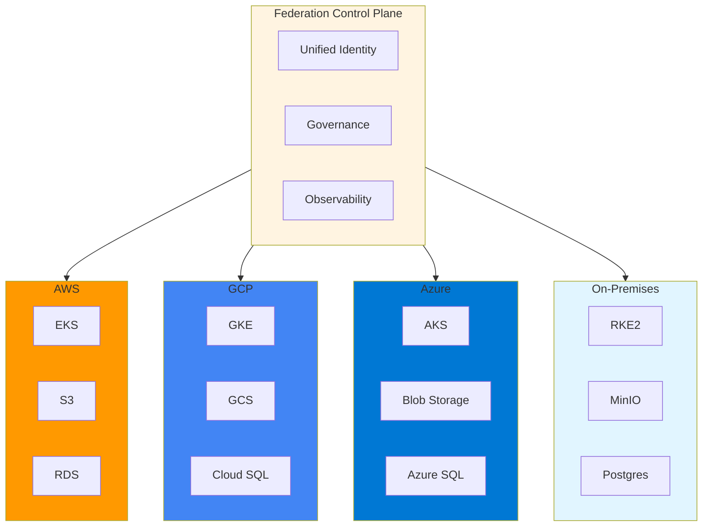
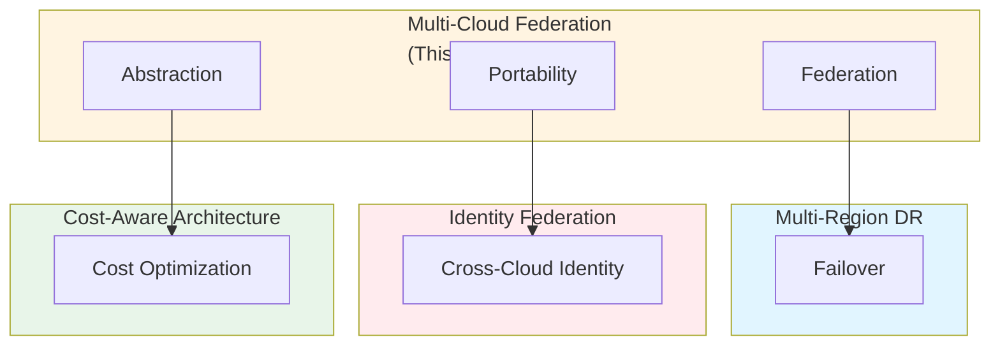

# Multi-Cloud Federation & Portability Architecture: Best Practices

**Objective**: Establish comprehensive multi-cloud federation and portability patterns that enable workload portability, vendor independence, and unified operations across AWS, GCP, Azure, and on-premises infrastructure. When you need cloud portability, when you want vendor independence, when you need unified multi-cloud operations—this guide provides the complete framework.

## Introduction

Multi-cloud federation is the foundation of vendor-independent, portable architectures. Without proper federation patterns, systems become locked to specific clouds, portability degrades, and operational complexity increases. This guide establishes patterns for multi-cloud federation, workload portability, and unified operations across all cloud providers.

**What This Guide Covers**:
- Multi-cloud federation patterns (AWS, GCP, Azure, on-prem)
- Workload portability strategies
- Unified identity and access management across clouds
- Cross-cloud networking and data replication
- Multi-cloud observability and governance
- Vendor lock-in prevention
- Cloud-native abstraction layers
- Hybrid cloud architectures
- Air-gapped cloud patterns

**Prerequisites**:
- Understanding of cloud platforms and services
- Familiarity with Kubernetes and container orchestration
- Experience with multi-cloud deployments

**Related Documents**:
This document integrates with:
- **[Multi-Region, Multi-Cluster Disaster Recovery, Failover Topologies, and Data Sovereignty](multi-region-dr-strategy.md)** - DR across clouds
- **[Cross-Domain Identity Federation, AuthZ/AuthN Architecture & Identity Propagation Models](../security/identity-federation-authz-authn-architecture.md)** - Identity across clouds
- **[Cost-Aware Architecture & Resource-Efficiency Governance](cost-aware-architecture-and-efficiency-governance.md)** - Cost optimization across clouds
- **[Cloud Architecture](cloud-architecture.md)** - AWS-specific patterns

## The Philosophy of Multi-Cloud Federation

### Federation Principles

**Principle 1: Vendor Independence**
- Avoid vendor lock-in
- Abstract cloud services
- Enable workload portability

**Principle 2: Unified Operations**
- Single pane of glass
- Consistent tooling
- Unified governance

**Principle 3: Optimal Placement**
- Right workload, right cloud
- Cost optimization
- Performance optimization

## Multi-Cloud Federation Architecture

### Federation Model

**Architecture Diagram**:


## Workload Portability Strategies

### Container-Based Portability

**Pattern**:
```yaml
# Container portability
portability:
  strategy: "containers"
  abstraction:
    - "Kubernetes (EKS, GKE, AKS, RKE2)"
    - "Container images (OCI)"
    - "Helm charts"
  requirements:
    - "No cloud-specific APIs"
    - "Standard Kubernetes APIs"
    - "Portable storage classes"
```

### Service Mesh Portability

**Pattern**:
```yaml
# Service mesh portability
service_mesh:
  strategy: "istio"
  portability:
    - "Multi-cluster federation"
    - "Cross-cloud networking"
    - "Unified traffic management"
  clouds:
    - "AWS (EKS)"
    - "GCP (GKE)"
    - "Azure (AKS)"
    - "On-prem (RKE2)"
```

## Unified Identity and Access

### Cross-Cloud Identity

**Pattern**:
```yaml
# Cross-cloud identity
cross_cloud_identity:
  provider: "oidc"
  federation:
    aws:
      role_arn: "arn:aws:iam::account:role/federation"
      oidc_provider: "https://idp.example.com"
    gcp:
      workload_identity: "projects/project-id/serviceAccounts/sa@project.iam.gserviceaccount.com"
    azure:
      managed_identity: "/subscriptions/sub-id/resourcegroups/rg/providers/Microsoft.ManagedIdentity/userAssignedIdentities/identity"
```

## Cross-Cloud Networking

### Network Federation

**Pattern**:
```yaml
# Network federation
network_federation:
  strategy: "vpn-mesh"
  connections:
    - from: "aws"
      to: "gcp"
      type: "vpn"
    - from: "aws"
      to: "azure"
      type: "vpn"
    - from: "gcp"
      to: "azure"
      type: "vpn"
  routing:
    strategy: "bgp"
    asn: "64512"
```

## Data Replication Across Clouds

### Multi-Cloud Data Replication

**Pattern**:
```python
# Multi-cloud data replication
class MultiCloudDataReplication:
    def replicate(self, data: bytes, clouds: list[str]):
        """Replicate data across clouds"""
        for cloud in clouds:
            if cloud == "aws":
                self.replicate_to_s3(data)
            elif cloud == "gcp":
                self.replicate_to_gcs(data)
            elif cloud == "azure":
                self.replicate_to_blob(data)
            elif cloud == "on-prem":
                self.replicate_to_minio(data)
```

## Cloud-Native Abstraction Layers

### Storage Abstraction

**Pattern**:
```python
# Storage abstraction
class StorageAbstraction:
    def __init__(self, provider: str):
        if provider == "aws":
            self.client = S3Client()
        elif provider == "gcp":
            self.client = GCSClient()
        elif provider == "azure":
            self.client = BlobClient()
        elif provider == "on-prem":
            self.client = MinIOClient()
    
    def put(self, key: str, data: bytes):
        """Put object (cloud-agnostic)"""
        return self.client.put_object(key, data)
    
    def get(self, key: str) -> bytes:
        """Get object (cloud-agnostic)"""
        return self.client.get_object(key)
```

## Architecture Fitness Functions

### Portability Fitness Function

**Definition**:
```python
# Portability fitness function
class PortabilityFitnessFunction:
    def evaluate(self, system: System) -> float:
        """Evaluate portability"""
        # Count cloud-specific dependencies
        cloud_dependencies = self.count_cloud_dependencies(system)
        
        # Count portable components
        portable_components = self.count_portable_components(system)
        
        # Calculate portability ratio
        if cloud_dependencies == 0:
            portability = 1.0
        else:
            portability = portable_components / (portable_components + cloud_dependencies)
        
        return portability
```

## Cross-Document Architecture



## Checklists

### Multi-Cloud Federation Checklist

- [ ] Federation architecture designed
- [ ] Workload portability strategy defined
- [ ] Unified identity configured
- [ ] Cross-cloud networking established
- [ ] Data replication configured
- [ ] Abstraction layers implemented
- [ ] Vendor lock-in prevention active
- [ ] Observability unified
- [ ] Governance policies defined
- [ ] Fitness functions implemented
- [ ] Regular portability reviews scheduled

## Anti-Patterns

### Multi-Cloud Anti-Patterns

**Vendor Lock-In**:
```python
# Bad: Cloud-specific APIs
import boto3
s3 = boto3.client('s3')  # AWS-specific!

# Good: Abstraction layer
from storage import StorageClient
storage = StorageClient(provider='aws')  # Portable!
```

## See Also

- **[Multi-Region, Multi-Cluster Disaster Recovery, Failover Topologies, and Data Sovereignty](multi-region-dr-strategy.md)** - DR across clouds
- **[Cross-Domain Identity Federation, AuthZ/AuthN Architecture & Identity Propagation Models](../security/identity-federation-authz-authn-architecture.md)** - Identity across clouds
- **[Cost-Aware Architecture & Resource-Efficiency Governance](cost-aware-architecture-and-efficiency-governance.md)** - Cost optimization
- **[Cloud Architecture](cloud-architecture.md)** - AWS patterns

---

*This guide establishes comprehensive multi-cloud federation patterns. Start with abstraction layers, extend to portability, and continuously optimize for vendor independence.*

