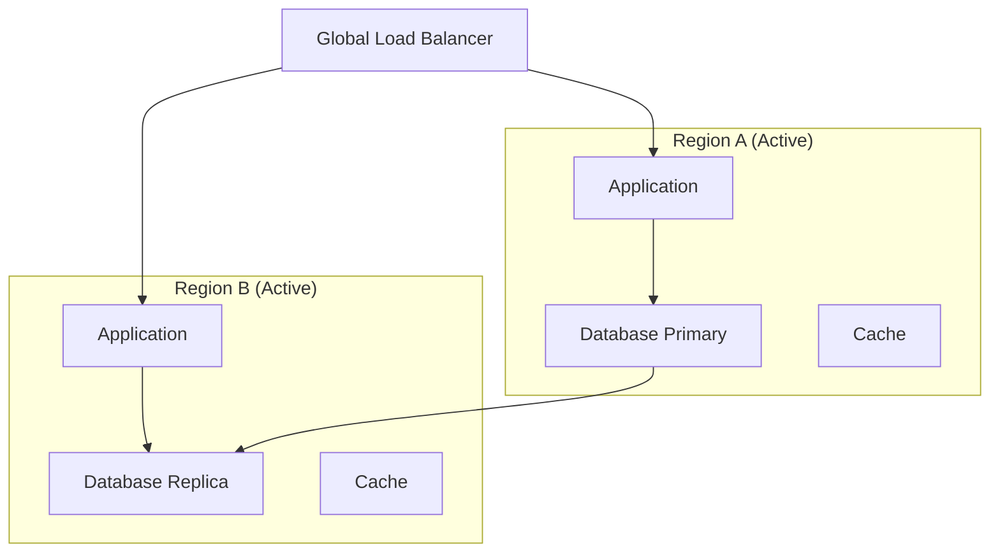
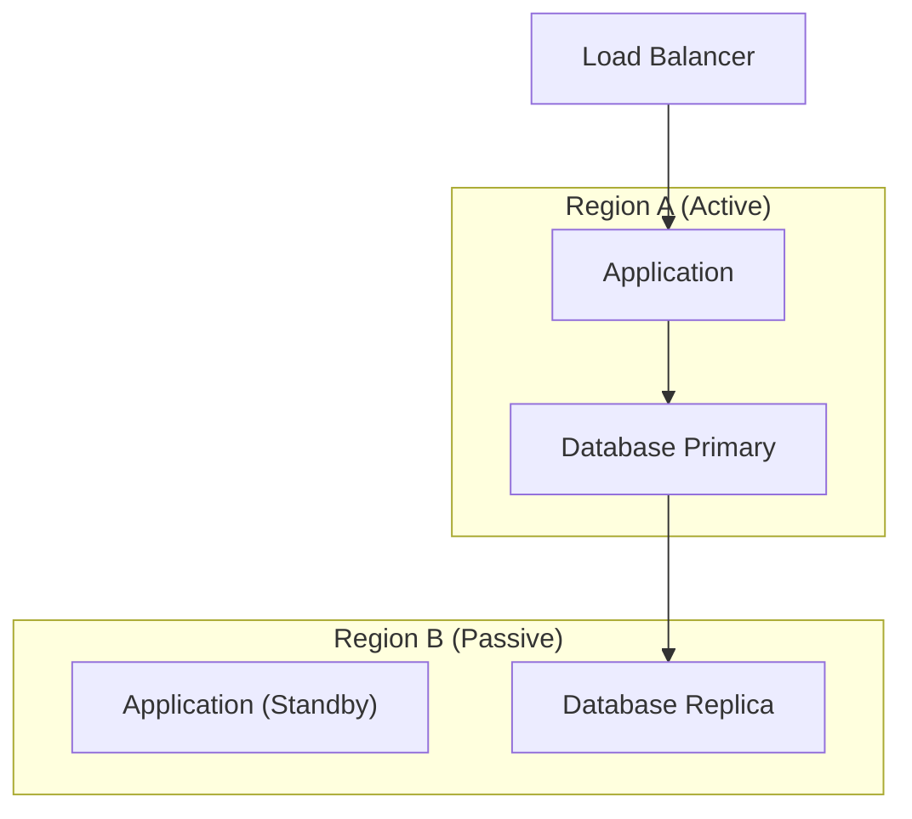
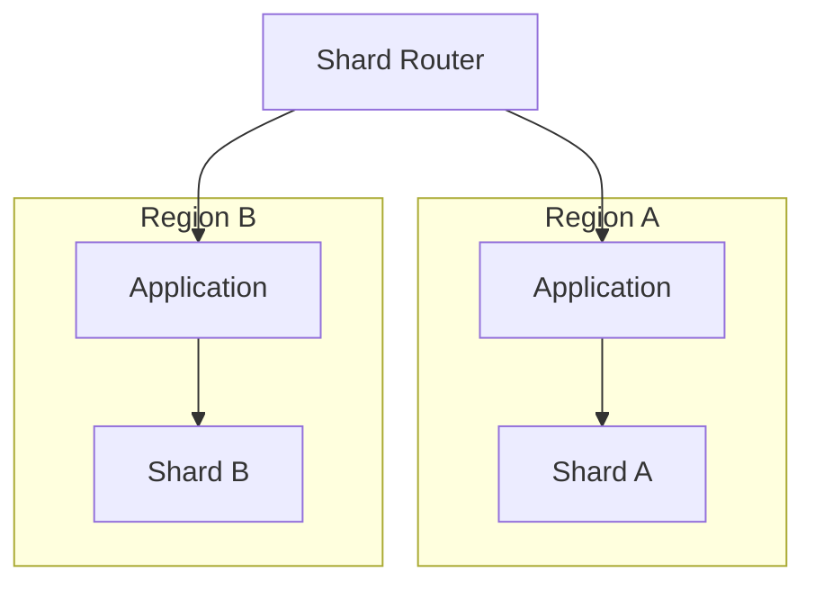
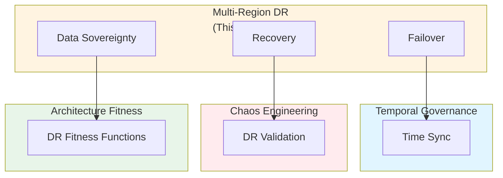

# Multi-Region, Multi-Cluster Disaster Recovery, Failover Topologies, and Data Sovereignty: Best Practices

**Objective**: Establish comprehensive disaster recovery strategies across multiple regions, clusters, and cloud providers. When you need cross-region failover, when you want data sovereignty compliance, when you need air-gapped DR—this guide provides the complete framework.

## Introduction

Disaster recovery is not optional—it's a fundamental requirement for production systems. This guide establishes patterns for multi-region DR, failover topologies, and data sovereignty across all deployment scenarios.

**What This Guide Covers**:
- Cross-region topology patterns (active/active, active/passive, regional sharding)
- RKE2 multi-cluster federation
- GitOps-based DR promotion rules
- Postgres + Patroni + WAL-shipping architectures
- FDW cross-region failure isolation
- Multi-cloud + hybrid + air-gapped DR design
- Geospatial data sovereignty for regulated environments
- DR runbooks and Recovery Time Objective (RTO) frameworks
- Checklist for cluster reincarnation after full loss

**Prerequisites**:
- Understanding of distributed systems and high availability
- Familiarity with Kubernetes, databases, and networking
- Experience with multi-region deployments

**Related Documents**:
This document integrates with:
- **[Temporal Governance and Time Synchronization](temporal-governance-and-time-synchronization.md)** - Time consistency across regions
- **[Architectural Fitness Functions and Governance](architecture-fitness-functions-governance.md)** - DR as fitness function
- **[Lakes vs Lakehouses vs Warehouses](../database-data/lake-vs-lakehouse-vs-warehouse.md)** - Data architecture for DR
- **[Chaos Engineering Governance](../operations-monitoring/chaos-engineering-governance.md)** - DR validation through chaos
- **[Semantic Layer Engineering](../database-data/semantic-layer-engineering.md)** - Semantic layer DR
- **[ML Systems Architecture Governance](../ml-ai/ml-systems-architecture-governance.md)** - ML system DR

## The Philosophy of Multi-Region DR

### DR Principles

**Principle 1: RTO/RPO Alignment**
- Define Recovery Time Objectives (RTO)
- Define Recovery Point Objectives (RPO)
- Align architecture with objectives

**Principle 2: Automated Failover**
- Minimize manual intervention
- Test failover regularly
- Document all procedures

**Principle 3: Data Sovereignty**
- Respect regulatory requirements
- Implement data residency controls
- Audit data location

## Cross-Region Topology Patterns

### Active/Active Topology

**Pattern**: Both regions serve traffic simultaneously.

**Architecture**:


**Configuration**:
```yaml
# Active/Active configuration
topology:
  type: "active-active"
  regions:
    - name: "us-east-1"
      role: "active"
      traffic_weight: 50
    - name: "us-west-2"
      role: "active"
      traffic_weight: 50
  failover:
    automatic: true
    health_check_interval: "30s"
```

### Active/Passive Topology

**Pattern**: One region active, one standby.

**Architecture**:


**Configuration**:
```yaml
# Active/Passive configuration
topology:
  type: "active-passive"
  regions:
    - name: "us-east-1"
      role: "active"
    - name: "us-west-2"
      role: "passive"
  failover:
    automatic: true
    rto: "5 minutes"
    rpo: "1 minute"
```

### Regional Sharding

**Pattern**: Data sharded by region.

**Architecture**:


## RKE2 Multi-Cluster Federation

### Cluster Federation Setup

**Federation Configuration**:
```yaml
# RKE2 federation
federation:
  clusters:
    - name: "cluster-us-east"
      region: "us-east-1"
      role: "primary"
    - name: "cluster-us-west"
      region: "us-west-2"
      role: "secondary"
  failover:
    automatic: true
    health_check: "kubernetes"
```

### GitOps-Based DR Promotion

**Promotion Rules**:
```yaml
# GitOps DR promotion
dr_promotion:
  rules:
    - name: "auto-failover"
      condition: "primary_cluster_down"
      action: "promote_secondary"
      validation:
        - "health_check"
        - "data_consistency"
```

## Postgres + Patroni + WAL-Shipping

### WAL Shipping Architecture

**Configuration**:
```yaml
# WAL shipping
wal_ship:
  primary: "postgres-primary-us-east"
  replicas:
    - "postgres-replica-us-west"
  shipping:
    method: "streaming"
    compression: true
    encryption: true
```

### Patroni HA Configuration

**Patroni Setup**:
```yaml
# Patroni configuration
patroni:
  scope: "postgres-cluster"
  namespace: "/db/"
  restapi:
    listen: "0.0.0.0:8008"
  postgresql:
    parameters:
      wal_level: "replica"
      max_wal_senders: 3
      hot_standby: "on"
```

## FDW Cross-Region Failure Isolation

### FDW Isolation Pattern

**Pattern**: Isolate FDW failures to prevent cascading.

**Configuration**:
```sql
-- FDW isolation
CREATE SERVER remote_db
FOREIGN DATA WRAPPER postgres_fdw
OPTIONS (
    host 'remote-region.example.com',
    port '5432',
    connect_timeout '10',
    fetch_size '1000'
);

-- Isolation policy
ALTER SERVER remote_db
OPTIONS (
    ADD isolation_level 'region',
    ADD failover_enabled 'true'
);
```

## Multi-Cloud + Hybrid + Air-Gapped DR

### Multi-Cloud DR

**Architecture**:
```yaml
# Multi-cloud DR
dr_strategy:
  primary:
    cloud: "aws"
    region: "us-east-1"
  secondary:
    cloud: "gcp"
    region: "us-central1"
  tertiary:
    cloud: "azure"
    region: "eastus"
```

### Air-Gapped DR

**Pattern**: Offline DR for air-gapped environments.

**Configuration**:
```yaml
# Air-gapped DR
air_gapped_dr:
  primary: "on-prem-cluster"
  secondary: "air-gapped-cluster"
  sync_method: "manual"
  sync_frequency: "daily"
  data_transfer: "secure-media"
```

## Geospatial Data Sovereignty

### Data Residency Controls

**Configuration**:
```yaml
# Data sovereignty
data_sovereignty:
  regulations:
    - type: "gdpr"
      requirement: "eu-data-only"
      regions: ["eu-west-1", "eu-central-1"]
    - type: "hipaa"
      requirement: "us-only"
      regions: ["us-east-1"]
  enforcement:
    - "network_policies"
    - "storage_policies"
    - "access_controls"
```

## DR Runbooks

### Failover Runbook

**Runbook Template**:
```markdown
# Failover Runbook

## Prerequisites
- [ ] Primary region confirmed down
- [ ] Secondary region healthy
- [ ] Data replication verified

## Steps
1. Initiate failover
2. Verify secondary region
3. Update DNS/routing
4. Verify application health
5. Monitor for issues

## Rollback
- [ ] Primary region restored
- [ ] Data synchronized
- [ ] Failback initiated
```

## RTO Frameworks

### RTO Calculation

**Framework**:
```yaml
# RTO framework
rto:
  service: "user-api"
  target: "5 minutes"
  components:
    - name: "database"
      rto: "2 minutes"
    - name: "application"
      rto: "1 minute"
    - name: "network"
      rto: "1 minute"
    - name: "dns"
      rto: "1 minute"
```

## Cluster Reincarnation Checklist

### Post-Disaster Recovery

**Checklist**:
- [ ] Assess damage
- [ ] Restore infrastructure
- [ ] Restore data from backups
- [ ] Verify data consistency
- [ ] Restore applications
- [ ] Verify functionality
- [ ] Update documentation
- [ ] Conduct post-mortem

## Integration with Temporal Governance

### Time Consistency

**Pattern**: Maintain time consistency across regions.

See: **[Temporal Governance and Time Synchronization](temporal-governance-and-time-synchronization.md)**

## Cross-Document Architecture



## Checklists

### DR Readiness Checklist

- [ ] RTO/RPO defined
- [ ] Failover topology designed
- [ ] Data replication configured
- [ ] Failover automation tested
- [ ] Runbooks documented
- [ ] Team trained
- [ ] Regular drills scheduled
- [ ] Monitoring configured
- [ ] Data sovereignty verified
- [ ] Post-disaster procedures documented

## Anti-Patterns

### DR Anti-Patterns

**No Automation**:
```yaml
# Bad: Manual failover
failover:
  automatic: false
  manual_steps: 20
  estimated_time: "2 hours"

# Good: Automated failover
failover:
  automatic: true
  rto: "5 minutes"
  validation: "automated"
```

**Untested DR**:
```yaml
# Bad: Never tested
dr_strategy:
  tested: false
  last_test: "never"

# Good: Regularly tested
dr_strategy:
  tested: true
  test_frequency: "monthly"
  last_test: "2024-01-15"
```

## See Also

- **[Temporal Governance and Time Synchronization](temporal-governance-and-time-synchronization.md)** - Time consistency
- **[Architectural Fitness Functions and Governance](architecture-fitness-functions-governance.md)** - DR fitness functions
- **[Lakes vs Lakehouses vs Warehouses](../database-data/lake-vs-lakehouse-vs-warehouse.md)** - Data architecture
- **[Chaos Engineering Governance](../operations-monitoring/chaos-engineering-governance.md)** - DR validation
- **[Semantic Layer Engineering](../database-data/semantic-layer-engineering.md)** - Semantic layer DR
- **[ML Systems Architecture Governance](../ml-ai/ml-systems-architecture-governance.md)** - ML system DR

---

*This guide establishes comprehensive multi-region DR strategies. Start with topology design, extend to automation, and continuously validate through chaos engineering.*

