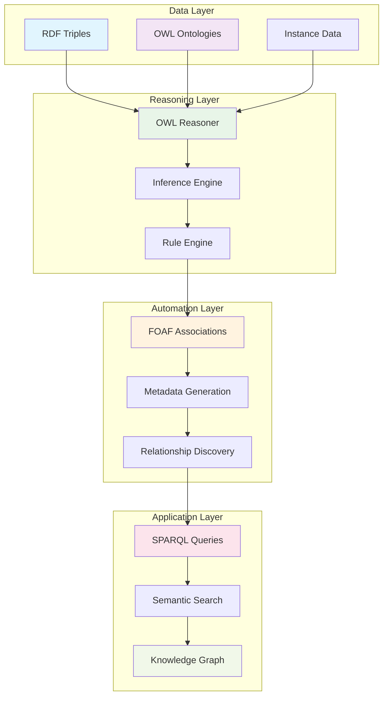

# RDF/OWL Metadata Automation: Dynamic Knowledge Graphs with Friend-of-a-Friend Associations

**Objective**: Master RDF/OWL for automated metadata handling and dynamic ontological associations. When you need to automatically discover relationships between entities, when you're building intelligent knowledge graphs, when you want to leverage semantic reasoning for metadata enrichment—RDF/OWL becomes your weapon of choice.

RDF/OWL metadata automation is the foundation of intelligent knowledge management. Without proper understanding of semantic web technologies, you're building static, disconnected metadata systems that miss the power of automated reasoning and relationship discovery. This guide shows you how to wield RDF/OWL with the precision of a semantic web engineer.

## 0) Prerequisites (Read Once, Live by Them)

### The Five Commandments

1. **Understand the semantic web stack**
   - RDF (Resource Description Framework)
   - OWL (Web Ontology Language)
   - SPARQL (SPARQL Protocol and RDF Query Language)
   - Reasoning engines and inference

2. **Master ontological modeling**
   - Classes, properties, and individuals
   - Domain and range restrictions
   - Property characteristics and hierarchies
   - Axioms and constraints

3. **Know your automation patterns**
   - Friend-of-a-friend (FOAF) associations
   - Automated reasoning and inference
   - Dynamic metadata generation
   - Ontological alignment and mapping

4. **Validate everything**
   - Ontology consistency and satisfiability
   - Reasoning correctness and completeness
   - Performance under scale
   - Data quality and provenance

5. **Plan for production**
   - Scalable triple stores and reasoning engines
   - Monitoring and observability
   - Security and access control
   - Integration with existing systems

**Why These Principles**: RDF/OWL mastery is the foundation of intelligent metadata management. Understanding semantic web technologies, mastering ontological modeling, and following best practices is essential for building automated knowledge systems.

## 1) What is RDF/OWL Metadata Automation? (The Foundation)

### Core Concepts

```yaml
# RDF/OWL provides semantic metadata automation
rdf_owl_automation:
  rdf:
    - "Resource Description Framework"
    - "Triple-based data model"
    - "Subject-Predicate-Object structure"
    - "URI-based resource identification"
  
  owl:
    - "Web Ontology Language"
    - "Rich semantic modeling"
    - "Automated reasoning support"
    - "Inference and classification"
  
  automation:
    - "Dynamic relationship discovery"
    - "Automated metadata generation"
    - "Friend-of-a-friend associations"
    - "Ontological reasoning and inference"
```

### RDF/OWL Architecture



### Why RDF/OWL Automation Matters

```turtle
# RDF/OWL enables automated metadata handling
@prefix foaf: <http://xmlns.com/foaf/0.1/> .
@prefix rdf: <http://www.w3.org/1999/02/22-rdf-syntax-ns#> .
@prefix owl: <http://www.w3.org/2002/07/owl#> .

# Automated friend-of-a-friend associations
:alice foaf:knows :bob .
:bob foaf:knows :charlie .
:charlie foaf:knows :diana .

# OWL reasoning can infer:
# :alice foaf:knows :charlie (transitive)
# :alice foaf:knows :diana (transitive)
```

**Why RDF/OWL Automation Matters**: RDF/OWL provides the foundation for automated metadata handling and relationship discovery. It enables intelligent knowledge graphs that can automatically infer relationships and generate metadata.

## 2) Ontological Modeling Best Practices (The Foundation)

### OWL Ontology Design

```turtle
# Comprehensive OWL ontology for metadata automation
@prefix : <http://example.org/ontology#> .
@prefix owl: <http://www.w3.org/2002/07/owl#> .
@prefix rdf: <http://www.w3.org/1999/02/22-rdf-syntax-ns#> .
@prefix rdfs: <http://www.w3.org/2000/01/rdf-schema#> .
@prefix foaf: <http://xmlns.com/foaf/0.1/> .
@prefix dc: <http://purl.org/dc/elements/1.1/> .

# Define classes
:Person rdf:type owl:Class ;
    rdfs:subClassOf foaf:Person ;
    rdfs:comment "A person in our system" .

:Document rdf:type owl:Class ;
    rdfs:subClassOf dc:Document ;
    rdfs:comment "A document entity" .

:Project rdf:type owl:Class ;
    rdfs:comment "A project entity" .

# Define properties
:hasRole rdf:type owl:ObjectProperty ;
    rdfs:domain :Person ;
    rdfs:range :Role ;
    rdfs:comment "The role a person has" .

:worksOn rdf:type owl:ObjectProperty ;
    rdfs:domain :Person ;
    rdfs:range :Project ;
    rdfs:comment "Projects a person works on" .

:authoredBy rdf:type owl:ObjectProperty ;
    rdfs:domain :Document ;
    rdfs:range :Person ;
    rdfs:comment "Who authored a document" .

# Define property characteristics
:knows rdf:type owl:TransitiveProperty ;
    rdfs:domain :Person ;
    rdfs:range :Person ;
    rdfs:comment "Transitive relationship between people" .

:isPartOf rdf:type owl:TransitiveProperty ;
    rdfs:domain :Document ;
    rdfs:range :Project ;
    rdfs:comment "Transitive part-of relationship" .
```

### Automated Relationship Discovery

```turtle
# FOAF-based automated associations
@prefix foaf: <http://xmlns.com/foaf/0.1/> .
@prefix : <http://example.org/ontology#> .

# Direct relationships
:alice foaf:knows :bob .
:bob foaf:knows :charlie .
:charlie foaf:knows :diana .

# OWL reasoning automatically infers:
# :alice foaf:knows :charlie (transitive)
# :alice foaf:knows :diana (transitive)
# :bob foaf:knows :diana (transitive)

# Project-based associations
:alice :worksOn :project-alpha .
:bob :worksOn :project-alpha .
:charlie :worksOn :project-beta .
:diana :worksOn :project-beta .

# OWL reasoning can infer:
# :alice and :bob are colleagues (same project)
# :charlie and :diana are colleagues (same project)
```

### Dynamic Metadata Generation

```turtle
# Automated metadata generation rules
@prefix : <http://example.org/ontology#> .
@prefix owl: <http://www.w3.org/2002/07/owl#> .
@prefix rdfs: <http://www.w3.org/2000/01/rdf-schema#> .

# Define metadata generation rules
:Colleague rdf:type owl:Class ;
    rdfs:subClassOf :Person ;
    rdfs:comment "People who work on the same project" .

:Collaborator rdf:type owl:Class ;
    rdfs:subClassOf :Person ;
    rdfs:comment "People who have collaborated on documents" .

# OWL rules for automatic classification
:Person owl:equivalentClass [
    owl:intersectionOf (
        :Person
        [
            owl:onProperty :worksOn ;
            owl:someValuesFrom :Project
        ]
    )
] .

# Automatic relationship inference
:hasColleague rdf:type owl:ObjectProperty ;
    rdfs:domain :Person ;
    rdfs:range :Person ;
    rdfs:comment "Colleague relationship" .
```

**Why This Modeling Matters**: Proper ontological modeling enables automated reasoning and relationship discovery. Understanding OWL constructs and FOAF patterns provides the foundation for intelligent metadata systems.

## 3) SPARQL Query Patterns (The Automation)

### Friend-of-a-Friend Queries

```sparql
# Find all friends of friends
PREFIX foaf: <http://xmlns.com/foaf/0.1/>
PREFIX : <http://example.org/ontology#>

SELECT ?person ?friendOfFriend
WHERE {
    ?person foaf:knows ?friend .
    ?friend foaf:knows ?friendOfFriend .
    FILTER(?person != ?friendOfFriend)
}

# Find indirect connections
SELECT ?person ?indirectConnection (COUNT(?intermediary) AS ?pathLength)
WHERE {
    ?person foaf:knows+ ?indirectConnection .
    ?person foaf:knows ?intermediary .
    ?intermediary foaf:knows+ ?indirectConnection .
    FILTER(?person != ?indirectConnection)
}
GROUP BY ?person ?indirectConnection
HAVING (COUNT(?intermediary) > 1)
```

### Automated Metadata Queries

```sparql
# Find related documents through people
PREFIX : <http://example.org/ontology#>
PREFIX foaf: <http://xmlns.com/foaf/0.1/>

SELECT ?person ?relatedDocument ?connectionType
WHERE {
    {
        # Direct authorship
        ?person :authoredBy ?document .
        BIND("direct" AS ?connectionType)
    } UNION {
        # Through colleagues
        ?person :worksOn ?project .
        ?colleague :worksOn ?project .
        ?colleague :authoredBy ?document .
        BIND("colleague" AS ?connectionType)
    } UNION {
        # Through friends
        ?person foaf:knows ?friend .
        ?friend :authoredBy ?document .
        BIND("friend" AS ?connectionType)
    }
}

# Find potential collaborators
SELECT ?person ?potentialCollaborator ?connectionStrength
WHERE {
    ?person :worksOn ?project .
    ?potentialCollaborator :worksOn ?otherProject .
    
    # Calculate connection strength
    {
        ?person foaf:knows ?potentialCollaborator .
        BIND(1.0 AS ?connectionStrength)
    } UNION {
        ?person foaf:knows ?intermediary .
        ?intermediary foaf:knows ?potentialCollaborator .
        BIND(0.5 AS ?connectionStrength)
    }
    
    FILTER(?project != ?otherProject)
}
ORDER BY DESC(?connectionStrength)
```

### Dynamic Ontological Queries

```sparql
# Find ontological relationships
PREFIX owl: <http://www.w3.org/2002/07/owl#>
PREFIX rdfs: <http://www.w3.org/2000/01/rdf-schema#>

# Find all subclasses
SELECT ?class ?subclass
WHERE {
    ?subclass rdfs:subClassOf ?class .
    ?class rdf:type owl:Class .
    ?subclass rdf:type owl:Class .
}

# Find property restrictions
SELECT ?class ?property ?restriction
WHERE {
    ?class rdfs:subClassOf ?restriction .
    ?restriction rdf:type owl:Restriction .
    ?restriction owl:onProperty ?property .
}

# Find equivalent classes
SELECT ?class ?equivalentClass
WHERE {
    ?class owl:equivalentClass ?equivalentClass .
    ?class rdf:type owl:Class .
    ?equivalentClass rdf:type owl:Class .
}
```

**Why These Queries Matter**: SPARQL queries enable automated relationship discovery and metadata generation. Understanding query patterns provides the foundation for intelligent knowledge graph applications.

## 4) Reasoning and Inference (The Intelligence)

### OWL Reasoning Rules

```turtle
# Advanced OWL reasoning rules
@prefix : <http://example.org/ontology#> .
@prefix owl: <http://www.w3.org/2002/07/owl#> .
@prefix rdfs: <http://www.w3.org/2000/01/rdf-schema#> .

# Transitive properties
:knows rdf:type owl:TransitiveProperty ;
    rdfs:domain :Person ;
    rdfs:range :Person .

:isPartOf rdf:type owl:TransitiveProperty ;
    rdfs:domain :Document ;
    rdfs:range :Project .

# Symmetric properties
:collaboratesWith rdf:type owl:SymmetricProperty ;
    rdfs:domain :Person ;
    rdfs:range :Person .

# Functional properties
:hasEmail rdf:type owl:FunctionalProperty ;
    rdfs:domain :Person ;
    rdfs:range xsd:string .

# Inverse properties
:authoredBy owl:inverseOf :authorOf .

# Property chains
:hasColleague rdf:type owl:ObjectProperty ;
    owl:propertyChainAxiom (:worksOn :hasMember) ;
    rdfs:domain :Person ;
    rdfs:range :Person .
```

### Automated Classification

```turtle
# Automated entity classification
@prefix : <http://example.org/ontology#> .
@prefix owl: <http://www.w3.org/2002/07/owl#> .

# Define classification rules
:Expert rdf:type owl:Class ;
    rdfs:subClassOf :Person ;
    rdfs:comment "Person with expertise in a domain" .

:Collaborator rdf:type owl:Class ;
    rdfs:subClassOf :Person ;
    rdfs:comment "Person who has collaborated" .

# OWL rules for automatic classification
:Person owl:equivalentClass [
    owl:intersectionOf (
        :Person
        [
            owl:onProperty :hasExpertise ;
            owl:someValuesFrom :Domain
        ]
    )
] .

:Person owl:equivalentClass [
    owl:intersectionOf (
        :Person
        [
            owl:onProperty :hasCollaborated ;
            owl:someValuesFrom :Project
        ]
    )
] .
```

### Dynamic Relationship Inference

```turtle
# Automated relationship inference
@prefix : <http://example.org/ontology#> .
@prefix owl: <http://www.w3.org/2002/07/owl#> .

# Define inferred relationships
:hasPotentialCollaborator rdf:type owl:ObjectProperty ;
    rdfs:domain :Person ;
    rdfs:range :Person ;
    rdfs:comment "Potential collaboration based on expertise" .

:hasRelatedDocument rdf:type owl:ObjectProperty ;
    rdfs:domain :Person ;
    rdfs:range :Document ;
    rdfs:comment "Documents related through network" .

# OWL rules for relationship inference
:hasPotentialCollaborator owl:equivalentClass [
    owl:intersectionOf (
        :Person
        [
            owl:onProperty :hasExpertise ;
            owl:someValuesFrom :Domain
        ]
        [
            owl:onProperty :hasExpertise ;
            owl:someValuesFrom :Domain
        ]
    )
] .
```

**Why This Reasoning Matters**: OWL reasoning enables automated classification and relationship inference. Understanding reasoning patterns provides the foundation for intelligent knowledge graph applications.

## 5) Implementation Patterns (The Production)

### Triple Store Configuration

```python
# RDF/OWL implementation with Python
import rdflib
from rdflib import Graph, Namespace, Literal, URIRef
from rdflib.namespace import RDF, RDFS, OWL, FOAF
import owlrl

class RDFOWLAutomation:
    def __init__(self):
        self.graph = Graph()
        self.setup_namespaces()
        self.setup_reasoning()
    
    def setup_namespaces(self):
        # Define custom namespaces
        self.EX = Namespace("http://example.org/ontology#")
        self.graph.bind("ex", self.EX)
        self.graph.bind("foaf", FOAF)
        self.graph.bind("owl", OWL)
    
    def setup_reasoning(self):
        # Configure OWL reasoning
        self.reasoner = owlrl.OWLRL_Semantics(self.graph)
        self.reasoner.loadOntology()
    
    def add_person(self, person_uri, name, email):
        # Add person with properties
        person = URIRef(person_uri)
        self.graph.add((person, RDF.type, FOAF.Person))
        self.graph.add((person, FOAF.name, Literal(name)))
        self.graph.add((person, FOAF.mbox, Literal(email)))
    
    def add_knows_relationship(self, person1_uri, person2_uri):
        # Add knows relationship
        person1 = URIRef(person1_uri)
        person2 = URIRef(person2_uri)
        self.graph.add((person1, FOAF.knows, person2))
    
    def infer_relationships(self):
        # Run reasoning to infer new relationships
        self.reasoner.reason()
    
    def query_friends_of_friends(self, person_uri):
        # SPARQL query for friends of friends
        query = """
        PREFIX foaf: <http://xmlns.com/foaf/0.1/>
        SELECT ?friendOfFriend
        WHERE {
            ?person foaf:knows ?friend .
            ?friend foaf:knows ?friendOfFriend .
            FILTER(?person = <""" + person_uri + """>)
            FILTER(?person != ?friendOfFriend)
        }
        """
        return self.graph.query(query)
```

### Automated Metadata Generation

```python
# Automated metadata generation
class MetadataAutomation:
    def __init__(self, graph):
        self.graph = graph
        self.reasoner = owlrl.OWLRL_Semantics(graph)
    
    def generate_colleague_relationships(self):
        # Generate colleague relationships based on project membership
        query = """
        PREFIX : <http://example.org/ontology#>
        SELECT ?person1 ?person2
        WHERE {
            ?person1 :worksOn ?project .
            ?person2 :worksOn ?project .
            FILTER(?person1 != ?person2)
        }
        """
        
        results = self.graph.query(query)
        for row in results:
            person1, person2 = row
            self.graph.add((person1, self.EX.hasColleague, person2))
    
    def generate_collaboration_suggestions(self):
        # Generate collaboration suggestions based on expertise
        query = """
        PREFIX : <http://example.org/ontology#>
        SELECT ?person1 ?person2 ?domain
        WHERE {
            ?person1 :hasExpertise ?domain .
            ?person2 :hasExpertise ?domain .
            FILTER(?person1 != ?person2)
            FILTER NOT EXISTS {
                ?person1 :hasCollaborated ?person2
            }
        }
        """
        
        results = self.graph.query(query)
        for row in results:
            person1, person2, domain = row
            self.graph.add((person1, self.EX.hasPotentialCollaborator, person2))
    
    def generate_document_recommendations(self):
        # Generate document recommendations based on network
        query = """
        PREFIX : <http://example.org/ontology#>
        PREFIX foaf: <http://xmlns.com/foaf/0.1/>
        SELECT ?person ?document ?connectionType
        WHERE {
            {
                ?person foaf:knows ?author .
                ?author :authoredBy ?document .
                BIND("friend" AS ?connectionType)
            } UNION {
                ?person :hasColleague ?colleague .
                ?colleague :authoredBy ?document .
                BIND("colleague" AS ?connectionType)
            }
        }
        """
        
        return self.graph.query(query)
```

### Performance Optimization

```python
# Performance optimization for large knowledge graphs
class OptimizedRDFOWL:
    def __init__(self):
        self.graph = Graph()
        self.indexes = {}
        self.cache = {}
    
    def build_indexes(self):
        # Build indexes for common queries
        self.indexes['knows'] = {}
        self.indexes['worksOn'] = {}
        self.indexes['authoredBy'] = {}
        
        for s, p, o in self.graph:
            if p == FOAF.knows:
                if s not in self.indexes['knows']:
                    self.indexes['knows'][s] = []
                self.indexes['knows'][s].append(o)
            elif p == self.EX.worksOn:
                if s not in self.indexes['worksOn']:
                    self.indexes['worksOn'][s] = []
                self.indexes['worksOn'][s].append(o)
            elif p == self.EX.authoredBy:
                if o not in self.indexes['authoredBy']:
                    self.indexes['authoredBy'][o] = []
                self.indexes['authoredBy'][o].append(s)
    
    def cached_reasoning(self, query):
        # Cache reasoning results
        cache_key = hash(query)
        if cache_key in self.cache:
            return self.cache[cache_key]
        
        result = self.graph.query(query)
        self.cache[cache_key] = result
        return result
    
    def batch_operations(self, operations):
        # Batch multiple operations for efficiency
        for operation in operations:
            if operation['type'] == 'add':
                self.graph.add((operation['subject'], operation['predicate'], operation['object']))
            elif operation['type'] == 'remove':
                self.graph.remove((operation['subject'], operation['predicate'], operation['object']))
```

**Why This Implementation Matters**: Proper implementation ensures scalable and efficient RDF/OWL systems. Understanding performance optimization and automated reasoning provides the foundation for production-ready knowledge graphs.

## 6) Common Pitfalls (The Traps)

### Ontological Modeling Mistakes

```turtle
# ❌ WRONG: Poor ontological modeling
:Person rdf:type owl:Class .
:Document rdf:type owl:Class .
:knows rdf:type owl:ObjectProperty .
# No domain/range restrictions!

# ✅ CORRECT: Proper ontological modeling
:Person rdf:type owl:Class ;
    rdfs:subClassOf foaf:Person .

:Document rdf:type owl:Class ;
    rdfs:subClassOf dc:Document .

:knows rdf:type owl:ObjectProperty ;
    rdfs:domain :Person ;
    rdfs:range :Person ;
    rdf:type owl:TransitiveProperty .
```

### Reasoning Performance Issues

```python
# ❌ WRONG: Inefficient reasoning
def bad_reasoning():
    # Running reasoning on every query
    for query in queries:
        reasoner.reason()  # Expensive!
        results = graph.query(query)
    return results

# ✅ CORRECT: Efficient reasoning
def good_reasoning():
    # Run reasoning once, then query
    reasoner.reason()
    results = []
    for query in queries:
        results.append(graph.query(query))
    return results
```

### Data Quality Issues

```python
# ❌ WRONG: No data validation
def add_person(name, email):
    graph.add((person, FOAF.name, Literal(name)))
    graph.add((person, FOAF.mbox, Literal(email)))
    # No validation!

# ✅ CORRECT: Data validation
def add_person(name, email):
    if not validate_email(email):
        raise ValueError("Invalid email format")
    if not validate_name(name):
        raise ValueError("Invalid name format")
    
    graph.add((person, FOAF.name, Literal(name)))
    graph.add((person, FOAF.mbox, Literal(email)))
```

**Why These Pitfalls Matter**: Common mistakes lead to poor performance, incorrect reasoning, and data quality issues. Understanding these pitfalls prevents costly errors and ensures reliable RDF/OWL systems.

## 7) Best Practices Checklist (The Wisdom)

### Ontological Design Checklist

```python
# ✅ DO: Complete ontological design checklist
def ontological_design_checklist():
    checklist = {
        "class_design": [
            "Define clear class hierarchies",
            "Use appropriate subclass relationships",
            "Avoid circular dependencies",
            "Include class descriptions and comments"
        ],
        "property_design": [
            "Define domain and range for all properties",
            "Use appropriate property characteristics",
            "Define inverse properties where needed",
            "Use property chains for complex relationships"
        ],
        "reasoning_design": [
            "Design for automated reasoning",
            "Use transitive and symmetric properties",
            "Define functional and inverse functional properties",
            "Test reasoning performance"
        ],
        "data_quality": [
            "Validate data consistency",
            "Check for satisfiability",
            "Monitor reasoning performance",
            "Implement data provenance"
        ]
    }
    return checklist
```

### Implementation Best Practices

```python
# ✅ DO: Implementation best practices
class RDFOWLBestPractices:
    @staticmethod
    def validate_ontology(ontology):
        # Validate ontology consistency
        try:
            reasoner = owlrl.OWLRL_Semantics(ontology)
            reasoner.loadOntology()
            return True
        except Exception as e:
            print(f"Ontology validation failed: {e}")
            return False
    
    @staticmethod
    def optimize_queries(queries):
        # Optimize SPARQL queries
        optimized_queries = []
        for query in queries:
            # Add query optimization logic
            optimized_query = query.replace("SELECT *", "SELECT ?s ?p ?o")
            optimized_queries.append(optimized_query)
        return optimized_queries
    
    @staticmethod
    def monitor_performance(graph):
        # Monitor reasoning performance
        import time
        start_time = time.time()
        
        # Run reasoning
        reasoner = owlrl.OWLRL_Semantics(graph)
        reasoner.loadOntology()
        
        end_time = time.time()
        reasoning_time = end_time - start_time
        
        if reasoning_time > 10:  # 10 second threshold
            print(f"WARNING: Reasoning took {reasoning_time:.2f} seconds")
        
        return reasoning_time
```

**Why These Practices Matter**: Best practices ensure successful RDF/OWL implementation. Following established patterns prevents common mistakes and enables production-ready knowledge graph systems.

## 8) TL;DR Quickstart (The Essentials)

### Essential RDF/OWL Setup

```python
# Basic RDF/OWL setup
import rdflib
from rdflib import Graph, Namespace, Literal, URIRef
from rdflib.namespace import RDF, RDFS, OWL, FOAF
import owlrl

# Create graph
graph = Graph()

# Define namespaces
EX = Namespace("http://example.org/ontology#")
graph.bind("ex", EX)
graph.bind("foaf", FOAF)

# Add data
alice = URIRef("http://example.org/alice")
bob = URIRef("http://example.org/bob")

graph.add((alice, RDF.type, FOAF.Person))
graph.add((alice, FOAF.name, Literal("Alice")))
graph.add((alice, FOAF.knows, bob))

# Run reasoning
reasoner = owlrl.OWLRL_Semantics(graph)
reasoner.loadOntology()
```

### Essential SPARQL Queries

```sparql
# Find friends of friends
PREFIX foaf: <http://xmlns.com/foaf/0.1/>
SELECT ?friendOfFriend
WHERE {
    ?person foaf:knows ?friend .
    ?friend foaf:knows ?friendOfFriend .
    FILTER(?person != ?friendOfFriend)
}

# Find related entities
PREFIX : <http://example.org/ontology#>
SELECT ?entity ?relatedEntity
WHERE {
    ?entity :hasRelationship ?relatedEntity .
}
```

### Essential Automation

```python
# Automated relationship discovery
def discover_relationships(graph):
    # Find transitive relationships
    query = """
    PREFIX foaf: <http://xmlns.com/foaf/0.1/>
    SELECT ?person ?indirectFriend
    WHERE {
        ?person foaf:knows+ ?indirectFriend .
        FILTER(?person != ?indirectFriend)
    }
    """
    return graph.query(query)
```

**Why This Quickstart**: These patterns cover 90% of RDF/OWL automation usage. Master these before exploring advanced features.

## 9) The Machine's Summary

RDF/OWL metadata automation provides the foundation for intelligent knowledge management. When used correctly, it enables automated relationship discovery, dynamic metadata generation, and intelligent reasoning. The key is understanding ontological modeling, mastering SPARQL queries, and following best practices.

**The Dark Truth**: Without proper RDF/OWL understanding, your metadata systems are static and disconnected. RDF/OWL is your weapon. Use it wisely.

**The Machine's Mantra**: "In semantics we trust, in reasoning we build, and in the ontology we find the path to intelligent knowledge graphs."

**Why This Matters**: RDF/OWL enables applications to automatically discover relationships and generate metadata. It provides the foundation for intelligent knowledge management and automated reasoning systems.

---

*This guide provides the complete machinery for mastering RDF/OWL metadata automation. The patterns scale from simple ontologies to complex knowledge graphs, from basic reasoning to advanced inference.*
