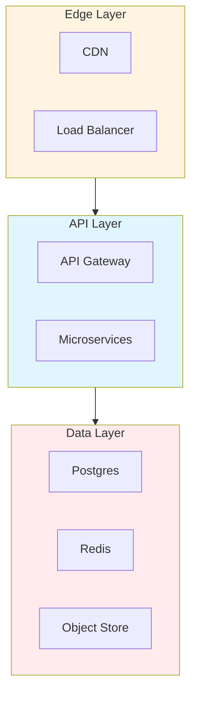

# Reference Architecture Diagrams: Best Practices

**Objective**: Establish comprehensive reference architecture diagrams that document system topologies, component relationships, and architectural patterns. When you need reference architectures, when you want system documentation, when you need architectural blueprints—this guide provides the complete framework.

## Introduction

Reference architecture diagrams are essential for understanding, communicating, and evolving system architectures. Without proper diagrams, architectures become opaque, communication breaks down, and evolution becomes difficult. This guide establishes patterns for reference architectures, diagram standards, and architectural documentation.

**What This Guide Covers**:
- Reference architecture patterns
- Diagram standards and conventions
- Component diagrams
- Deployment diagrams
- Sequence diagrams
- Data flow diagrams
- System topology diagrams
- Architecture decision documentation

**Prerequisites**:
- Understanding of system architecture
- Familiarity with diagramming tools
- Experience with architectural documentation

**Related Documents**:
This document integrates with:
- **[ADR and Technical Decision Governance](adr-decision-governance.md)** - Decision documentation
- **[Documentation](documentation.md)** - Documentation patterns
- **[System-Wide Naming, Taxonomy, and Structural Vocabulary Governance](system-taxonomy-governance.md)** - Naming standards

## The Philosophy of Reference Architectures

### Diagram Principles

**Principle 1: Clarity**
- Clear component boundaries
- Explicit relationships
- Standard notation

**Principle 2: Completeness**
- All components documented
- All relationships shown
- All patterns explained

**Principle 3: Evolution**
- Versioned diagrams
- Change tracking
- Living documentation

## Reference Architecture Patterns

### System Topology

**Diagram**:


## Diagram Standards

### Notation Standards

**Pattern**:
```yaml
# Diagram standards
diagram_standards:
  notation: "mermaid"
  components:
    - "rectangles for services"
    - "cylinders for databases"
    - "clouds for external systems"
  relationships:
    - "arrows for data flow"
    - "dashed for optional"
    - "colored for critical paths"
```

## See Also

- **[ADR and Technical Decision Governance](adr-decision-governance.md)** - Decisions
- **[Documentation](documentation.md)** - Documentation
- **[System-Wide Naming, Taxonomy, and Structural Vocabulary Governance](system-taxonomy-governance.md)** - Naming

---

*This guide establishes comprehensive reference architecture patterns. Start with standards, extend to diagrams, and continuously evolve documentation.*

