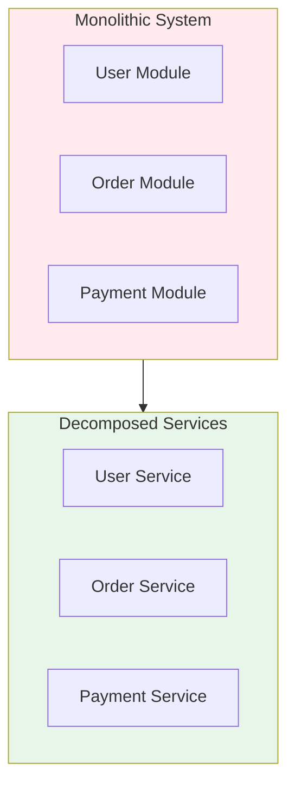

# Service Decomposition Strategy: Best Practices

**Objective**: Establish comprehensive service decomposition strategies that guide when and how to decompose monolithic systems into microservices, bounded contexts, and domain services. When you need decomposition guidance, when you want domain boundaries, when you need service boundaries—this guide provides the complete framework.

## Introduction

Service decomposition is fundamental to scalable, maintainable architectures. Without proper decomposition strategies, systems become monoliths, boundaries blur, and evolution becomes difficult. This guide establishes patterns for service decomposition, domain boundaries, and service design.

**What This Guide Covers**:
- Decomposition criteria and decision frameworks
- Domain-driven decomposition
- Bounded context identification
- Service boundary design
- Data ownership and service boundaries
- Decomposition anti-patterns
- Migration strategies from monoliths
- Service granularity guidelines

**Prerequisites**:
- Understanding of domain-driven design
- Familiarity with microservices architecture
- Experience with system decomposition

**Related Documents**:
This document integrates with:
- **[Event-Driven Architecture](event-driven-architecture.md)** - Event-based decomposition
- **[System-Wide Naming, Taxonomy, and Structural Vocabulary Governance](system-taxonomy-governance.md)** - Naming in decomposition
- **[Cognitive Load Management and Developer Experience](cognitive-load-developer-experience.md)** - Cognitive boundaries

## The Philosophy of Service Decomposition

### Decomposition Principles

**Principle 1: Domain-Driven**
- Align with business domains
- Respect bounded contexts
- Maintain domain integrity

**Principle 2: Autonomous Services**
- Independent deployment
- Own data and logic
- Clear interfaces

**Principle 3: Evolutionary Decomposition**
- Start monolithic
- Decompose when needed
- Continuous refinement

## Decomposition Criteria

### When to Decompose

**Decision Framework**:
```yaml
# Decomposition criteria
decomposition_criteria:
  triggers:
    - "team_scaling_issues"
    - "deployment_bottlenecks"
    - "technology_diversity"
    - "scaling_requirements"
    - "domain_complexity"
  thresholds:
    team_size: 8
    deployment_frequency: "daily"
    codebase_size: "100k_lines"
```

## Domain-Driven Decomposition

### Bounded Context Identification

**Pattern**:


## Service Boundary Design

### Boundary Patterns

**Pattern**:
```yaml
# Service boundaries
service_boundaries:
  user_service:
    owns:
      - "user_data"
      - "user_authentication"
      - "user_profile"
    exposes:
      - "user_api"
    depends_on:
      - "identity_service"
  order_service:
    owns:
      - "order_data"
      - "order_processing"
    exposes:
      - "order_api"
    depends_on:
      - "user_service"
      - "payment_service"
```

## Architecture Fitness Functions

### Decomposition Fitness Function

**Definition**:
```python
# Decomposition fitness function
class DecompositionFitnessFunction:
    def evaluate(self, system: System) -> float:
        """Evaluate decomposition quality"""
        # Check service autonomy
        autonomy = self.check_service_autonomy(system)
        
        # Check domain alignment
        domain_alignment = self.check_domain_alignment(system)
        
        # Check interface clarity
        interface_clarity = self.check_interface_clarity(system)
        
        # Calculate fitness
        fitness = (autonomy * 0.4) + \
                  (domain_alignment * 0.3) + \
                  (interface_clarity * 0.3)
        
        return fitness
```

## See Also

- **[Event-Driven Architecture](event-driven-architecture.md)** - Event-based services
- **[System-Wide Naming, Taxonomy, and Structural Vocabulary Governance](system-taxonomy-governance.md)** - Naming
- **[Cognitive Load Management and Developer Experience](cognitive-load-developer-experience.md)** - Boundaries

---

*This guide establishes comprehensive service decomposition patterns. Start with domain boundaries, extend to service design, and continuously refine decomposition.*

