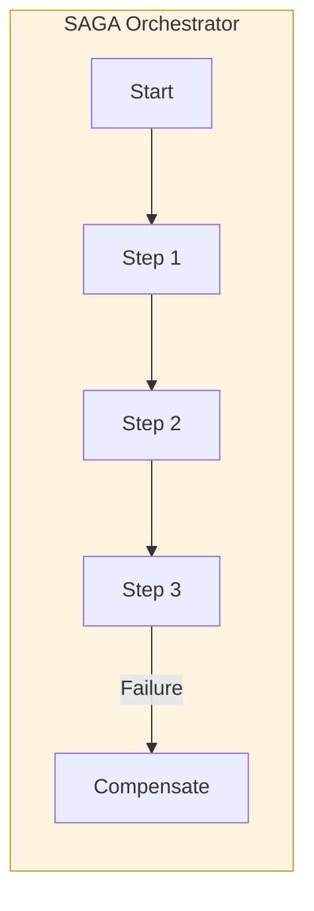
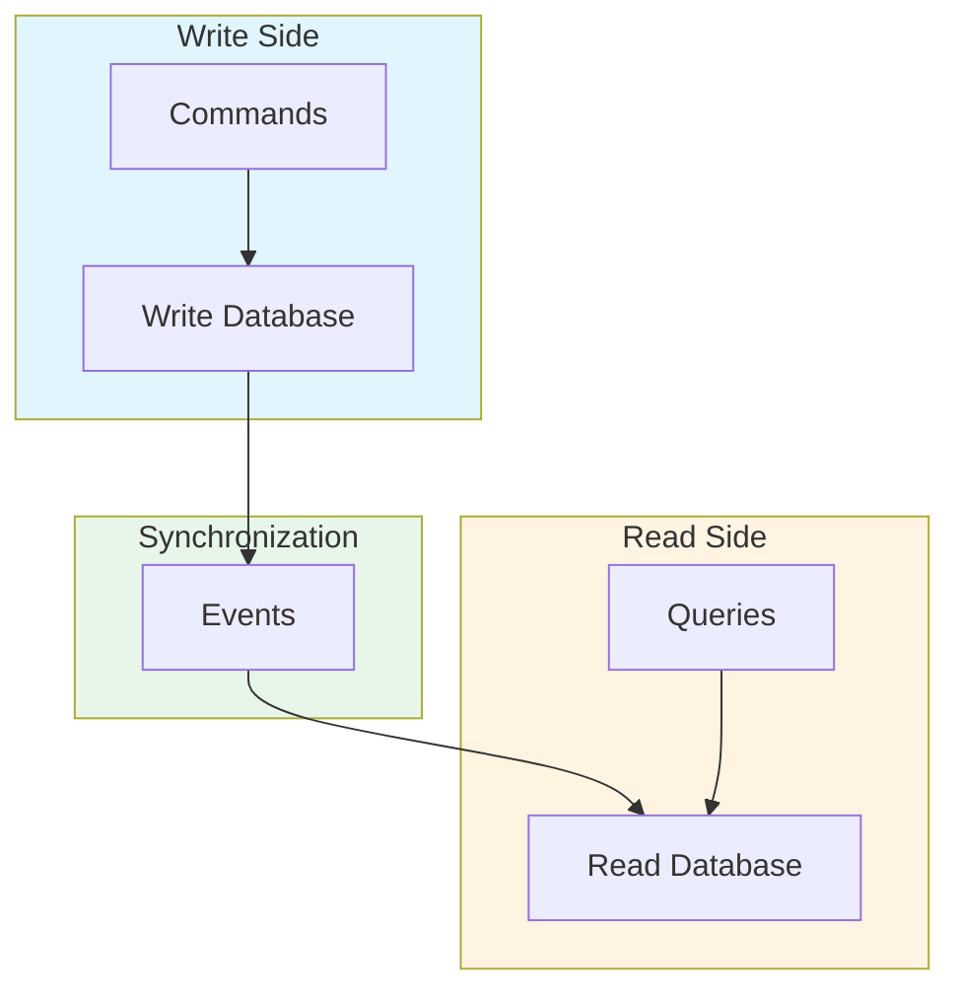

# Streaming Architecture Patterns: SAGA, CQRS, and Outbox: Best Practices

**Objective**: Establish comprehensive streaming architecture patterns including SAGA for distributed transactions, CQRS for read/write separation, and Outbox for reliable event publishing. When you need distributed transactions, when you want read/write separation, when you need reliable events—this guide provides the complete framework.

## Introduction

Streaming architecture patterns enable scalable, reliable distributed systems. Without proper patterns, systems suffer from consistency issues, performance bottlenecks, and reliability problems. This guide establishes patterns for SAGA, CQRS, and Outbox in streaming architectures.

**What This Guide Covers**:
- SAGA pattern for distributed transactions
- CQRS pattern for read/write separation
- Outbox pattern for reliable event publishing
- Event sourcing patterns
- Stream processing architectures
- Consistency models
- Failure handling and compensation

**Prerequisites**:
- Understanding of distributed systems
- Familiarity with event-driven architecture
- Experience with stream processing

**Related Documents**:
This document integrates with:
- **[Event-Driven Architecture](event-driven-architecture.md)** - Event patterns
- **[System Resilience, Rate Limiting, Concurrency Control & Backpressure](../operations-monitoring/system-resilience-and-concurrency.md)** - Resilience
- **[Operational Risk Modeling, Blast Radius Reduction & Failure Domain Architecture](../operations-monitoring/blast-radius-risk-modeling.md)** - Risk patterns

## The Philosophy of Streaming Patterns

### Pattern Principles

**Principle 1: Eventual Consistency**
- Accept eventual consistency
- Design for availability
- Compensate for failures

**Principle 2: Event-Driven**
- Events as first-class citizens
- Event sourcing
- Event replay

**Principle 3: Scalability**
- Read/write separation
- Horizontal scaling
- Stream processing

## SAGA Pattern

### SAGA Architecture

**Diagram**:


## CQRS Pattern

### CQRS Architecture

**Diagram**:


## Outbox Pattern

### Outbox Architecture

**Pattern**:
```python
# Outbox pattern
class OutboxPattern:
    def process_with_outbox(self, transaction):
        """Process transaction with outbox"""
        with transaction:
            # Write to database
            self.write_to_database(transaction.data)
            
            # Write to outbox
            self.write_to_outbox(transaction.event)
        
        # Publish from outbox
        self.publish_from_outbox()
```

## Architecture Fitness Functions

### Streaming Pattern Fitness Function

**Definition**:
```python
# Streaming pattern fitness function
class StreamingPatternFitnessFunction:
    def evaluate(self, system: System) -> float:
        """Evaluate streaming pattern quality"""
        # Check consistency
        consistency = self.check_consistency(system)
        
        # Check reliability
        reliability = self.check_reliability(system)
        
        # Check scalability
        scalability = self.check_scalability(system)
        
        # Calculate fitness
        fitness = (consistency * 0.4) + \
                  (reliability * 0.3) + \
                  (scalability * 0.3)
        
        return fitness
```

## See Also

- **[Event-Driven Architecture](event-driven-architecture.md)** - Event patterns
- **[System Resilience, Rate Limiting, Concurrency Control & Backpressure](../operations-monitoring/system-resilience-and-concurrency.md)** - Resilience
- **[Operational Risk Modeling, Blast Radius Reduction & Failure Domain Architecture](../operations-monitoring/blast-radius-risk-modeling.md)** - Risk

---

*This guide establishes comprehensive streaming architecture patterns. Start with SAGA, extend to CQRS, and continuously optimize for reliability.*

