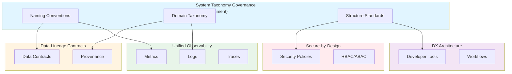

# System-Wide Naming, Taxonomy, and Structural Vocabulary Governance: Best Practices

**Objective**: Establish enterprise-wide naming conventions, domain taxonomy, and structural vocabulary that serve as the "lingua franca" across all systems, services, databases, and codebases. When you need consistent naming, when you want to reduce cognitive load, when you need cross-system clarity—this guide provides the complete framework.

## Introduction

System-wide taxonomy governance is the foundation of all other best practices. Without consistent naming, taxonomy, and structural vocabulary, systems become mentally intractable, cross-system integration fails, and operational entropy increases. This guide establishes the "lingua franca" that enables all other practices.

**What This Guide Covers**:
- Enterprise-wide naming conventions
- Domain taxonomy and service vocabulary
- Folder and repository structure standards
- Database and table naming invariants
- Schema and metadata naming standards
- Geospatial layer naming contracts
- Cross-language consistency rules (Python, Go, Rust)
- Multi-cluster resource naming patterns

**Prerequisites**:
- Understanding of distributed systems architecture
- Familiarity with multiple programming languages
- Experience with multi-environment deployments

**Related Documents**:
This document is foundational to:
- **[Data Lineage Contracts](../database-data/data-lineage-contracts.md)** - Lineage clarity depends on consistent naming
- **[Secure-by-Design Polyglot](../security/secure-by-design-polyglot.md)** - Security policies reference taxonomy
- **[Unified Observability Architecture](../operations-monitoring/unified-observability-architecture.md)** - Metrics and logs use taxonomy
- **[DX Architecture and Golden Paths](../python/dx-architecture-and-golden-paths.md)** - Developer tools enforce taxonomy

## The Philosophy of System Taxonomy

### Why Taxonomy Matters

**Cognitive Load Reduction**: Consistent naming reduces mental translation overhead.

**Example**:
```python
# Inconsistent: High cognitive load
def get_user_data():  # Python
func GetUserData()    # Go
fn get_user_data()    # Rust

# Consistent: Low cognitive load
def get_user_data():  # Python
func GetUserData()    # Go (exported)
fn get_user_data()    # Rust
```

**Cross-System Integration**: Consistent naming enables seamless integration.

**Example**:
```yaml
# Service naming enables auto-discovery
services:
  user-service:      # Consistent pattern
  order-service:    # Consistent pattern
  payment-service:  # Consistent pattern
```

**Operational Clarity**: Consistent naming makes operations predictable.

**Example**:
```bash
# Predictable resource names
kubectl get pods -l app=user-service
kubectl get svc -l app=order-service
```

### Taxonomy Principles

1. **Consistency First**: Same concept, same name everywhere
2. **Clarity Over Brevity**: Long names are better than ambiguous short ones
3. **Domain-Driven**: Names reflect business domains
4. **Language-Agnostic**: Core concepts transcend language syntax
5. **Hierarchical**: Names form hierarchies (domain → service → resource)
6. **Versioned**: Taxonomy evolves with versioning

## Enterprise-Wide Naming Conventions

### Core Naming Patterns

**Pattern**: `{domain}-{component}-{resource}`

**Examples**:
```
user-service-api
order-service-db
payment-service-cache
```

### Domain Taxonomy

**Domains**:
- `user`: User management, authentication, authorization
- `order`: Order processing, fulfillment
- `payment`: Payment processing, billing
- `inventory`: Inventory management
- `analytics`: Analytics and reporting
- `geospatial`: Geospatial data and processing

**Domain Rules**:
- Domains are business capabilities
- Domains are stable (change infrequently)
- Domains map to team ownership

### Service Vocabulary

**Service Types**:
- `api`: REST/GraphQL API service
- `worker`: Background job processor
- `scheduler`: Scheduled task runner
- `ingest`: Data ingestion service
- `transform`: Data transformation service
- `query`: Query service
- `gateway`: API gateway

**Service Naming Pattern**: `{domain}-{type}`

**Examples**:
```
user-api
order-worker
payment-gateway
analytics-query
geospatial-ingest
```

### Component Naming

**Components**:
- `db`: Database
- `cache`: Cache (Redis)
- `queue`: Message queue
- `storage`: Object storage
- `search`: Search index
- `ml`: Machine learning model

**Component Naming Pattern**: `{domain}-{component}`

**Examples**:
```
user-db
order-cache
payment-queue
analytics-storage
```

## Folder and Repository Structure Standards

### Repository Naming

**Pattern**: `{organization}-{domain}-{type}`

**Examples**:
```
org-user-service
org-order-api
org-analytics-pipeline
```

### Repository Structure

**Standard Structure**:
```
{repo-name}/
├── .github/
│   └── workflows/
├── src/
│   └── {domain}/
│       ├── __init__.py
│       ├── main.py
│       ├── handlers/
│       ├── services/
│       ├── models/
│       └── utils/
├── tests/
│   ├── unit/
│   ├── integration/
│   └── e2e/
├── docs/
├── config/
│   ├── base/
│   └── environments/
├── .pre-commit-config.yaml
├── Makefile
├── pyproject.toml
└── README.md
```

### Folder Naming Conventions

**Folders**:
- `src/`: Source code
- `tests/`: Test code
- `docs/`: Documentation
- `config/`: Configuration files
- `scripts/`: Utility scripts
- `deploy/`: Deployment manifests

## Database and Table Naming Invariants

### Database Naming

**Pattern**: `{domain}_{environment}`

**Examples**:
```
user_prod
order_staging
analytics_dev
```

### Schema Naming

**Pattern**: `{domain}` or `{domain}_{purpose}`

**Examples**:
```
user
order
analytics
analytics_warehouse
```

### Table Naming

**Pattern**: `{domain}_{entity}_{type}`

**Entity Types**:
- No suffix: Primary entity table
- `_log`: Audit/log table
- `_history`: Historical data table
- `_cache`: Cache table
- `_temp`: Temporary table

**Examples**:
```
user_account
user_session
order_item
order_log
payment_transaction
payment_transaction_history
```

### Column Naming

**Pattern**: `{entity}_{attribute}` or `{attribute}`

**Examples**:
```
user_id
user_email
user_created_at
order_id
order_total
order_status
```

### Index Naming

**Pattern**: `idx_{table}_{columns}`

**Examples**:
```
idx_user_account_email
idx_order_item_order_id
idx_payment_transaction_user_id
```

### Constraint Naming

**Pattern**: `{type}_{table}_{columns}`

**Types**:
- `pk_`: Primary key
- `fk_`: Foreign key
- `uk_`: Unique key
- `ck_`: Check constraint

**Examples**:
```
pk_user_account_id
fk_order_item_order_id
uk_user_account_email
ck_order_item_quantity_positive
```

## Schema and Metadata Naming Standards

### Schema Versioning

**Pattern**: `v{major}.{minor}.{patch}`

**Examples**:
```
v1.0.0
v1.1.0
v2.0.0
```

### Metadata Naming

**Pattern**: `{domain}_{entity}_{metadata_type}`

**Metadata Types**:
- `_schema`: Schema definition
- `_contract`: Data contract
- `_lineage`: Lineage metadata
- `_provenance`: Provenance metadata

**Examples**:
```
user_account_schema
order_item_contract
payment_transaction_lineage
analytics_report_provenance
```

## Geospatial Layer Naming Contracts

### Layer Naming

**Pattern**: `{domain}_{feature}_{resolution}_{style}`

**Components**:
- `domain`: Business domain
- `feature`: Feature type (roads, buildings, etc.)
- `resolution`: Zoom level or scale
- `style`: Visual style (dark, light, etc.)

**Examples**:
```
geospatial_roads_z12_dark
geospatial_buildings_z14_light
geospatial_boundaries_z10_default
```

### Geometry Naming

**Pattern**: `{entity}_geom` or `{entity}_geometry`

**Examples**:
```
user_location_geom
order_delivery_area_geometry
analytics_region_boundary_geom
```

### Spatial Index Naming

**Pattern**: `idx_{table}_{column}_spatial`

**Examples**:
```
idx_user_location_geom_spatial
idx_order_delivery_area_geometry_spatial
```

## Cross-Language Consistency Rules

### Python Naming

**Conventions**:
- Modules: `snake_case`
- Classes: `PascalCase`
- Functions: `snake_case`
- Constants: `UPPER_SNAKE_CASE`
- Private: `_leading_underscore`

**Examples**:
```python
# Module
import user_service

# Class
class UserService:
    pass

# Function
def get_user_data():
    pass

# Constant
MAX_RETRIES = 3

# Private
def _internal_helper():
    pass
```

### Go Naming

**Conventions**:
- Packages: `lowercase`
- Exported: `PascalCase`
- Unexported: `camelCase`
- Constants: `PascalCase` or `UPPER_SNAKE_CASE`

**Examples**:
```go
// Package
package userservice

// Exported
type UserService struct {}

func GetUserData() {}

// Unexported
type userService struct {}

// Constant
const MaxRetries = 3
```

### Rust Naming

**Conventions**:
- Modules: `snake_case`
- Types: `PascalCase`
- Functions: `snake_case`
- Constants: `UPPER_SNAKE_CASE`
- Private: Module-level privacy

**Examples**:
```rust
// Module
mod user_service;

// Type
struct UserService {}

// Function
fn get_user_data() {}

// Constant
const MAX_RETRIES: u32 = 3;
```

### Cross-Language Mapping

**Core Concepts** (Language-Agnostic):
- `UserService`: Service name
- `get_user_data`: Function name
- `UserAccount`: Entity name
- `user_id`: Identifier name

**Language-Specific Adaptations**:
- Python: `user_service`, `get_user_data`, `UserAccount`, `user_id`
- Go: `userservice`, `GetUserData`, `UserAccount`, `UserID`
- Rust: `user_service`, `get_user_data`, `UserAccount`, `user_id`

## Multi-Cluster Resource Naming Patterns

### Kubernetes Resource Naming

**Pattern**: `{domain}-{component}-{instance}`

**Examples**:
```
user-api-prod
order-worker-staging
payment-gateway-dev
```

### Namespace Naming

**Pattern**: `{environment}` or `{domain}-{environment}`

**Examples**:
```
prod
staging
dev
user-prod
order-staging
```

### Label Naming

**Standard Labels**:
- `app`: Application name
- `component`: Component type
- `environment`: Environment name
- `version`: Version tag
- `domain`: Business domain

**Examples**:
```yaml
labels:
  app: user-service
  component: api
  environment: prod
  version: v1.2.3
  domain: user
```

### Service Account Naming

**Pattern**: `{domain}-{component}-sa`

**Examples**:
```
user-api-sa
order-worker-sa
payment-gateway-sa
```

## Taxonomy Enforcement

### Automated Enforcement

**Linting Rules**:
```yaml
# .pre-commit-config.yaml
repos:
  - repo: local
    hooks:
      - id: naming-check
        name: Check naming conventions
        entry: scripts/check_naming.py
        language: system
```

**Validation Script**:
```python
# scripts/check_naming.py
import re
from pathlib import Path

def validate_naming(file_path: Path):
    """Validate naming conventions"""
    # Check service names
    # Check database names
    # Check table names
    # Check function names
    pass
```

### CI/CD Integration

**GitHub Actions**:
```yaml
# .github/workflows/naming-check.yml
name: Naming Convention Check
on: [push, pull_request]

jobs:
  check:
    runs-on: ubuntu-latest
    steps:
      - uses: actions/checkout@v3
      - name: Check naming
        run: |
          python scripts/check_naming.py
```

## Taxonomy Evolution

### Versioning Taxonomy

**Taxonomy Versions**:
- `v1.0.0`: Initial taxonomy
- `v1.1.0`: Additions (backward compatible)
- `v2.0.0`: Breaking changes

### Migration Strategy

**Migration Process**:
1. Document changes
2. Update tooling
3. Migrate codebases
4. Update documentation

## Integration with Other Practices

### Data Lineage Integration

**Lineage Naming**:
- Uses taxonomy for entity names
- Enables lineage clarity
- See: **[Data Lineage Contracts](../database-data/data-lineage-contracts.md)**

### Security Integration

**Security Naming**:
- Uses taxonomy for resource names
- Enables policy clarity
- See: **[Secure-by-Design Polyglot](../security/secure-by-design-polyglot.md)**

### Observability Integration

**Observability Naming**:
- Uses taxonomy for metric names
- Enables dashboard clarity
- See: **[Unified Observability Architecture](../operations-monitoring/unified-observability-architecture.md)**

### DX Integration

**DX Naming**:
- Uses taxonomy for tooling
- Enables developer clarity
- See: **[DX Architecture and Golden Paths](../python/dx-architecture-and-golden-paths.md)**

## Cross-Document Architecture



## Checklists

### Taxonomy Compliance Checklist

- [ ] All services follow naming pattern
- [ ] All databases follow naming pattern
- [ ] All tables follow naming pattern
- [ ] All functions follow naming pattern
- [ ] All repositories follow structure standard
- [ ] All Kubernetes resources follow naming pattern
- [ ] All geospatial layers follow naming pattern
- [ ] Cross-language consistency verified

### Taxonomy Review Checklist

- [ ] Taxonomy documented
- [ ] Tooling updated
- [ ] Codebases migrated
- [ ] Documentation updated
- [ ] CI/CD checks enabled
- [ ] Team trained

## Anti-Patterns

### Naming Anti-Patterns

**Inconsistent Naming**:
```python
# Bad: Inconsistent
def getUser(): pass
def get_user(): pass
def GetUser(): pass

# Good: Consistent
def get_user(): pass
```

**Ambiguous Names**:
```python
# Bad: Ambiguous
def process(): pass
def handle(): pass

# Good: Clear
def process_order(): pass
def handle_payment(): pass
```

**Magic Numbers/Strings**:
```python
# Bad: Magic values
if status == "A": pass

# Good: Named constants
if status == OrderStatus.ACTIVE: pass
```

## See Also

- **[Data Lineage Contracts](../database-data/data-lineage-contracts.md)** - Lineage clarity depends on taxonomy
- **[Secure-by-Design Polyglot](../security/secure-by-design-polyglot.md)** - Security policies reference taxonomy
- **[Unified Observability Architecture](../operations-monitoring/unified-observability-architecture.md)** - Metrics and logs use taxonomy
- **[DX Architecture and Golden Paths](../python/dx-architecture-and-golden-paths.md)** - Developer tools enforce taxonomy

---

*This guide establishes the foundational taxonomy that enables all other best practices. Start with naming conventions, extend to structure standards, and continuously enforce consistency across all systems.*

