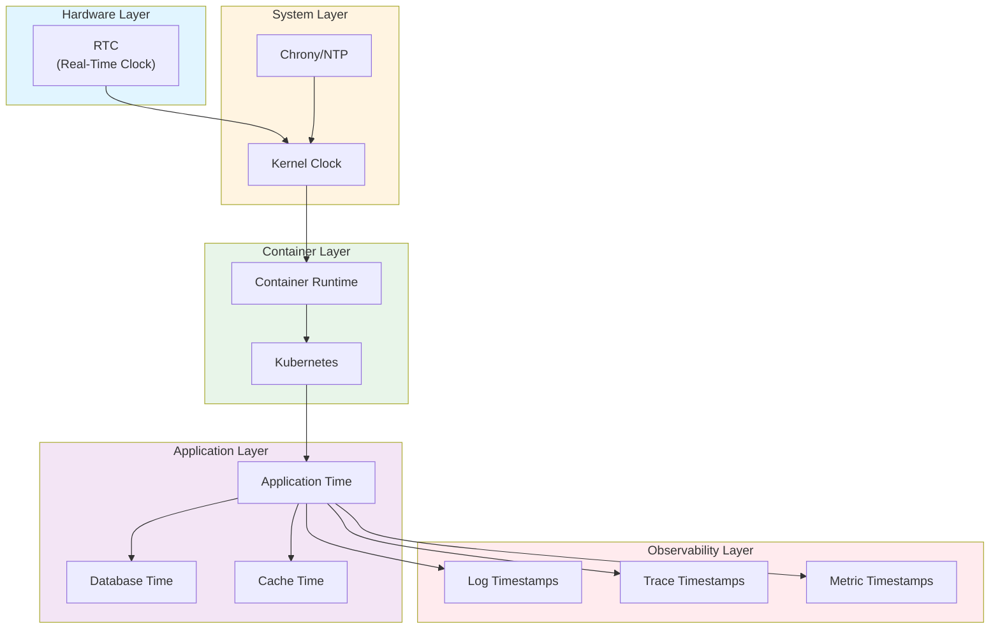
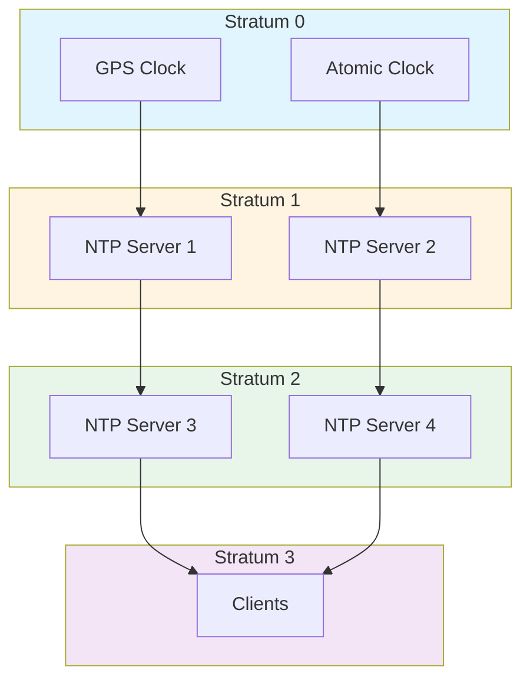
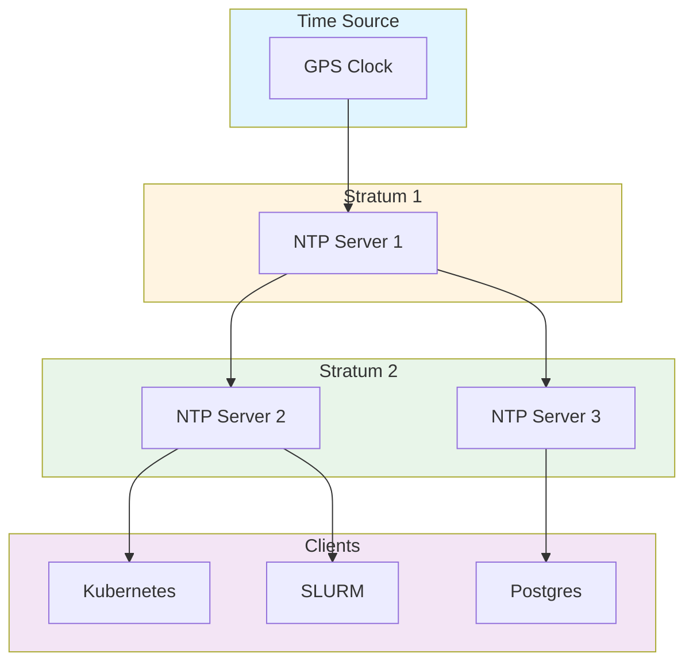

# Temporal Governance and Time Synchronization: Best Practices for Distributed Systems

**Objective**: Master production-grade time synchronization across Kubernetes, databases, ML pipelines, and distributed systems. When you need to ensure causality, prevent clock drift, and maintain temporal consistency—this guide provides complete patterns and implementations.

## Introduction

Time synchronization is foundational to distributed systems correctness. Without proper temporal governance, systems suffer from event ordering violations, transaction inconsistencies, cache invalidation failures, and security vulnerabilities. This guide provides a complete framework for maintaining correct time across all system layers.

**What This Guide Covers**:
- Why temporal governance matters (causality, clock drift, event ordering)
- Time hierarchy for distributed systems
- Chrony/NTP deep dive and configuration
- Kubernetes/RKE2 time governance
- Postgres and database time consistency
- ML/AI pipeline time issues
- Event-driven system time ordering
- Time drift monitoring and observability
- Air-gapped cluster time discipline
- Anti-patterns and failure modes
- Agentic LLM integration for time governance

**Prerequisites**:
- Understanding of distributed systems and network protocols
- Familiarity with NTP, Chrony, and time synchronization
- Experience with Kubernetes, databases, and observability stacks

## Why Temporal Governance Matters

### Causality Ordering

**Problem**: Events must be ordered correctly to maintain causality.

**Example**: User creates account → Account created event → Welcome email sent

If clocks are skewed, the email might be sent before the account is created, violating causality.

```python
# Causality violation example
class EventProcessor:
    def process_event(self, event: dict):
        """Process event with timestamp"""
        event_time = datetime.fromisoformat(event["timestamp"])
        current_time = datetime.now()
        
        # Check causality
        if event_time > current_time:
            raise ValueError("Event from future violates causality")
        
        # Process event
        self.handle_event(event)
```

### Clock Drift and Leap Seconds

**Clock Drift**: Clocks drift due to:
- Temperature variations
- Crystal oscillator imperfections
- System load
- Power supply fluctuations

**Typical Drift Rates**:
- Consumer hardware: ±50-100 ppm (parts per million)
- Server hardware: ±20-50 ppm
- GPS-disciplined clocks: ±0.1 ppm

**Leap Seconds**: UTC occasionally adds leap seconds to account for Earth's rotation variations.

```bash
# Check system clock drift
chrony tracking

# Output example:
# Reference time    : 2024-01-15T10:00:00Z
# System time       : 10.000123456 seconds slow
# Last offset       : +0.000123456 seconds
# RMS offset        : 0.000045678 seconds
# Frequency         : 15.234 ppm slow
# Residual freq     : +0.001 ppm
# Skew              : 0.123 ppm
# Root delay        : 0.001234 seconds
# Root dispersion   : 0.000567 seconds
# Update interval  : 64.0 seconds
# Leap status       : Normal
```

### Event Ordering and Distributed Consensus

**Problem**: Distributed systems require consistent event ordering.

**Solution**: Use logical clocks (Lamport timestamps) or synchronized physical clocks.

```python
# Logical clock for event ordering
class LogicalClock:
    def __init__(self):
        self.clock = 0
    
    def tick(self):
        """Increment logical clock"""
        self.clock += 1
        return self.clock
    
    def update(self, received_time: int):
        """Update clock based on received event"""
        self.clock = max(self.clock, received_time) + 1
        return self.clock

# Physical clock with NTP synchronization
class PhysicalClock:
    def __init__(self):
        self.ntp_client = NTPClient()
    
    def now(self) -> datetime:
        """Get synchronized time"""
        return self.ntp_client.get_time()
    
    def is_synchronized(self) -> bool:
        """Check if clock is synchronized"""
        return self.ntp_client.is_synchronized()
```

### Postgres Transaction Correctness

**Problem**: Postgres relies on system time for:
- Transaction timestamps
- WAL timestamps
- Replication slot timing
- Snapshot age calculations

**Impact of Drift**:
- Replication lag miscalculation
- Snapshot age violations
- Transaction ordering issues

```sql
-- Check Postgres time consistency
SELECT 
    now() AS postgres_time,
    clock_timestamp() AS system_time,
    now() - clock_timestamp() AS time_diff;

-- Check replication lag with time
SELECT 
    client_addr,
    state,
    sync_state,
    sync_priority,
    pg_wal_lsn_diff(pg_current_wal_lsn(), sent_lsn) AS sent_lag,
    pg_wal_lsn_diff(pg_current_wal_lsn(), write_lsn) AS write_lag,
    pg_wal_lsn_diff(pg_current_wal_lsn(), flush_lsn) AS flush_lag,
    pg_wal_lsn_diff(pg_current_wal_lsn(), replay_lsn) AS replay_lag,
    EXTRACT(EPOCH FROM (now() - backend_start)) AS connection_age
FROM pg_stat_replication;
```

### ML Model Reproducibility

**Problem**: ML models require consistent timestamps for:
- Feature store validity windows
- Model version timestamps
- Training data timestamps
- Inference timestamps

**Impact of Drift**:
- Feature store cache invalidation failures
- Model version timestamp mismatches
- Training data timestamp inconsistencies

```python
# MLflow timestamp consistency
import mlflow
from datetime import datetime

class MLflowTimeGovernance:
    def log_model_with_timestamp(self, model, name: str):
        """Log model with synchronized timestamp"""
        # Use NTP-synchronized time
        timestamp = self.get_synchronized_time()
        
        with mlflow.start_run():
            mlflow.log_param("timestamp", timestamp.isoformat())
            mlflow.log_model(model, name, registered_model_name=name)
    
    def get_synchronized_time(self) -> datetime:
        """Get NTP-synchronized time"""
        import ntplib
        ntp_client = ntplib.NTPClient()
        response = ntp_client.request('pool.ntp.org', version=3)
        return datetime.fromtimestamp(response.tx_time)
```

### Prefect/Dask/Spark Scheduling

**Problem**: Task schedulers rely on system time for:
- Task scheduling
- Retry backoff
- Timeout calculations
- Dependency resolution

**Impact of Drift**:
- Tasks scheduled at wrong times
- Retry backoff miscalculations
- Timeout failures

```python
# Prefect flow with time governance
from prefect import flow, task
from datetime import datetime, timedelta

class TimeGovernedPrefectFlow:
    @task
    def scheduled_task(self):
        """Task with time governance"""
        # Use synchronized time
        current_time = self.get_synchronized_time()
        
        # Check if task should run
        if current_time < self.scheduled_time:
            raise ValueError("Task scheduled in future")
        
        return self.execute_task()
    
    def get_synchronized_time(self) -> datetime:
        """Get synchronized time"""
        # Use NTP or system time with drift check
        return datetime.now()
```

### Grafana/Prometheus Alignment

**Problem**: Metrics must be aligned across systems.

**Impact of Drift**:
- Misaligned dashboards
- Incorrect alerting
- Correlation failures

```promql
# Prometheus time alignment check
time() - node_time_seconds{instance="node1"} > 1

# Alert on time drift
- alert: HighTimeDrift
  expr: abs(time() - node_time_seconds) > 0.5
  for: 5m
  annotations:
    summary: "Time drift detected on {{ $labels.instance }}"
```

### Redis Expiry Semantics

**Problem**: Redis TTL relies on system time.

**Impact of Drift**:
- Keys expire too early or too late
- Cache invalidation failures
- Session timeout issues

```python
# Redis with time governance
import redis
from datetime import datetime, timedelta

class TimeGovernedRedis:
    def __init__(self, redis_client: redis.Redis):
        self.redis = redis_client
        self.clock_skew = self.get_clock_skew()
    
    def set_with_ttl(self, key: str, value: str, ttl: int):
        """Set key with TTL accounting for clock skew"""
        # Adjust TTL for clock skew
        adjusted_ttl = ttl + abs(self.clock_skew)
        self.redis.setex(key, adjusted_ttl, value)
    
    def get_clock_skew(self) -> float:
        """Get clock skew from NTP"""
        # Compare local time with NTP time
        import ntplib
        ntp_client = ntplib.NTPClient()
        response = ntp_client.request('pool.ntp.org')
        local_time = time.time()
        ntp_time = response.tx_time
        return local_time - ntp_time
```

### JWT/Session/Token Lifetime Validation

**Problem**: Token validation relies on system time.

**Impact of Drift**:
- Tokens rejected as expired when valid
- Tokens accepted when expired
- Security vulnerabilities

```python
# JWT validation with time governance
import jwt
from datetime import datetime

class TimeGovernedJWT:
    def validate_token(self, token: str, clock_skew: int = 60):
        """Validate JWT with clock skew tolerance"""
        try:
            payload = jwt.decode(
                token,
                self.secret_key,
                algorithms=["HS256"],
                options={
                    "verify_signature": True,
                    "verify_exp": True,
                    "verify_iat": True,
                    "verify_nbf": True,
                },
                leeway=clock_skew  # Allow clock skew
            )
            return payload
        except jwt.ExpiredSignatureError:
            raise ValueError("Token expired")
        except jwt.InvalidTokenError:
            raise ValueError("Invalid token")
```

### TLS Certificate Trust Windows

**Problem**: TLS certificates have validity windows.

**Impact of Drift**:
- Certificates rejected as not yet valid
- Certificates accepted when expired
- Security vulnerabilities

```bash
# Check certificate validity with time
openssl x509 -in cert.pem -noout -dates

# Check if certificate is valid now
openssl x509 -in cert.pem -noout -checkend 0

# Alert on certificate expiration
certbot certificates
```

### Geospatial Data Timestamp Alignment

**Problem**: Geospatial data requires consistent timestamps.

**Impact of Drift**:
- Spatial-temporal queries fail
- Tile generation inconsistencies
- Data lineage violations

```sql
-- PostGIS time-aligned query
SELECT 
    geom,
    timestamp,
    ST_AsGeoJSON(geom) AS geometry
FROM features
WHERE timestamp BETWEEN 
    '2024-01-15 10:00:00'::timestamp - INTERVAL '1 second' AND
    '2024-01-15 10:00:00'::timestamp + INTERVAL '1 second'
ORDER BY timestamp;
```

### IoT Streaming Timestamp Normalization

**Problem**: IoT devices have varying clock accuracy.

**Impact of Drift**:
- Stream processing failures
- Time-window aggregation errors
- Event ordering violations

```python
# IoT timestamp normalization
class IoTTimestampNormalizer:
    def normalize_timestamp(self, device_timestamp: datetime, device_id: str) -> datetime:
        """Normalize device timestamp to server time"""
        # Get device clock offset
        device_offset = self.get_device_offset(device_id)
        
        # Normalize to server time
        normalized = device_timestamp + timedelta(seconds=device_offset)
        
        return normalized
    
    def get_device_offset(self, device_id: str) -> float:
        """Get device clock offset"""
        # Store device clock offset
        return self.device_offsets.get(device_id, 0.0)
```

## Time Hierarchy for Distributed Systems

### Architecture Layers



### Layer 1: Hardware Clock (RTC)

**Purpose**: Maintains time when system is powered off.

**Configuration**:
```bash
# Check RTC time
hwclock --show

# Set RTC from system time
hwclock --systohc

# Set system time from RTC
hwclock --hctosys

# Enable RTC auto-sync
echo "SYNC_HWCLOCK=yes" >> /etc/sysconfig/clock
```

### Layer 2: System Clock

**Purpose**: System-wide time maintained by kernel.

**Configuration**:
```bash
# Check system time
date
timedatectl status

# Set timezone
timedatectl set-timezone UTC

# Enable NTP synchronization
timedatectl set-ntp true
```

### Layer 3: Chrony/NTP Synchronization

**Purpose**: Synchronize system clock with authoritative time sources.

**Configuration**: See "Chrony/NTP Deep Dive" section.

### Layer 4: Container Runtime Time Isolation

**Problem**: Containers share host system time but may have different timezones.

**Solution**: Use host time with proper timezone configuration.

```dockerfile
# Dockerfile with timezone
FROM python:3.11-slim

# Set timezone
ENV TZ=UTC
RUN ln -snf /usr/share/zoneinfo/$TZ /etc/localtime && echo $TZ > /etc/timezone

# Use host time
# Docker: --network host or volume mount /etc/localtime
```

### Layer 5: Application-Level Timestamp Governance

**Purpose**: Applications must use synchronized time.

**Implementation**:
```python
# Application time governance
class ApplicationTimeGovernance:
    def __init__(self):
        self.ntp_client = NTPClient()
        self.clock_skew = 0.0
    
    def get_synchronized_time(self) -> datetime:
        """Get synchronized time"""
        if not self.ntp_client.is_synchronized():
            raise ValueError("Clock not synchronized")
        
        # Adjust for known clock skew
        return datetime.now() + timedelta(seconds=self.clock_skew)
    
    def update_clock_skew(self):
        """Update clock skew from NTP"""
        self.clock_skew = self.ntp_client.get_offset()
```

### Layer 6: Database Timestamps & Replication LSN Timing

**Purpose**: Databases must maintain consistent timestamps.

**Postgres Configuration**:
```sql
-- Check Postgres time settings
SHOW timezone;
SHOW log_timezone;

-- Set timezone
SET timezone = 'UTC';

-- Check replication timing
SELECT 
    now() AS current_time,
    pg_last_xact_replay_timestamp() AS last_replay_time,
    now() - pg_last_xact_replay_timestamp() AS replication_delay;
```

### Layer 7: Log Timestamps, Tracing Spans, Metrics Timestamps

**Purpose**: Observability data must have consistent timestamps.

**Configuration**:
```yaml
# Loki time configuration
loki:
  config:
    limits_config:
      reject_old_samples: true
      reject_old_samples_max_age: 168h
    ingestion_rate_mb: 10
    ingestion_burst_size_mb: 20
```

## Chrony/NTP Deep Dive

### LAN-Based NTP Configuration

**chrony.conf**:
```conf
# LAN-based NTP server configuration
pool 192.168.1.10 iburst
pool 192.168.1.11 iburst

# Allow LAN clients
allow 192.168.0.0/16

# Local stratum
local stratum 10

# Drift file
driftfile /var/lib/chrony/drift

# Log directory
logdir /var/log/chrony

# Key file for authentication
keyfile /etc/chrony.keys

# Command key
commandkey 1

# Generate command key
generatecommandkey

# Log measurements
log measurements statistics tracking
```

### GPS-Disciplined Clock Configuration

**chrony.conf**:
```conf
# GPS-disciplined clock
refclock SHM 0 offset 0.0 delay 0.0 refid GPS
refclock SHM 1 offset 0.0 delay 0.0 refid PPS

# Allow PPS
allow 127.0.0.1

# Local stratum
local stratum 1

# Drift file
driftfile /var/lib/chrony/drift

# Log directory
logdir /var/log/chrony

# Key file
keyfile /etc/chrony.keys

# Command key
commandkey 1

# Log measurements
log measurements statistics tracking
```

### Stratum Hierarchies



### Air-Gapped Cluster Configuration

**chrony.conf**:
```conf
# Air-gapped cluster with local stratum-1 server
server 192.168.1.1 iburst

# Local stratum
local stratum 2

# Allow cluster nodes
allow 192.168.0.0/16

# Drift file
driftfile /var/lib/chrony/drift

# Log directory
logdir /var/log/chrony

# Key file
keyfile /etc/chrony.keys

# Command key
commandkey 1

# Log measurements
log measurements statistics tracking

# Manual time correction (if needed)
# makestep 1.0 3
```

### Driftfile Location and Monitoring

**Driftfile**:
```bash
# Driftfile location
/var/lib/chrony/drift

# Check drift
chrony tracking

# Monitor drift over time
watch -n 1 'chrony tracking | grep "System time"'
```

**Monitoring Script**:
```bash
#!/bin/bash
# monitor_drift.sh

DRIFT_THRESHOLD=0.1  # 100ms

while true; do
    DRIFT=$(chrony tracking | grep "System time" | awk '{print $4}')
    
    if (( $(echo "$DRIFT > $DRIFT_THRESHOLD" | bc -l) )); then
        echo "WARNING: Clock drift exceeds threshold: $DRIFT seconds"
        # Send alert
    fi
    
    sleep 60
done
```

### Burst vs Iburst Semantics

**Burst**: Send multiple packets at startup for faster synchronization.

**Iburst**: Send packets more frequently at startup.

**Configuration**:
```conf
# Use iburst for faster initial sync
pool pool.ntp.org iburst

# Use burst for less aggressive sync
server ntp.example.com burst
```

### RTC Auto-Sync Best Practices

**Configuration**:
```bash
# Enable RTC auto-sync in chrony
# Add to chrony.conf:
rtcsync

# Or use systemd
systemctl enable chronyd
systemctl start chronyd

# Check RTC sync status
chrony tracking | grep "RTC"
```

### Time Smoothing Strategies

**Configuration**:
```conf
# Smooth time adjustments
makestep 1.0 3

# Maximum adjustment rate
maxchange 1000 1 2

# Minimum sources
minsources 2
```

### Detecting Upstream Flapping

**Monitoring Script**:
```bash
#!/bin/bash
# detect_ntp_flapping.sh

UPSTREAM="192.168.1.1"
FLAP_THRESHOLD=5

FLAP_COUNT=0

while true; do
    if ! chrony sources | grep -q "$UPSTREAM.*\*"; then
        FLAP_COUNT=$((FLAP_COUNT + 1))
        
        if [ $FLAP_COUNT -ge $FLAP_THRESHOLD ]; then
            echo "ALERT: NTP upstream $UPSTREAM is flapping"
            # Send alert
            FLAP_COUNT=0
        fi
    else
        FLAP_COUNT=0
    fi
    
    sleep 60
done
```

### Preventing Massive Time Jumps After Reboot

**Configuration**:
```conf
# Prevent large time jumps
makestep 1.0 3

# Maximum adjustment
maxchange 1000 1 2

# RTC sync
rtcsync
```

**Boot Script**:
```bash
#!/bin/bash
# prevent_time_jump.sh

# Check if time jump is needed
CURRENT_TIME=$(date +%s)
RTC_TIME=$(hwclock --show --epoch)

TIME_DIFF=$((CURRENT_TIME - RTC_TIME))

if [ $TIME_DIFF -gt 60 ] || [ $TIME_DIFF -lt -60 ]; then
    echo "WARNING: Large time difference detected: $TIME_DIFF seconds"
    # Gradual adjustment instead of jump
    chrony makestep
fi
```

## Kubernetes/RKE2 Time Governance

### Detecting Node Time Skew

**kubectl Commands**:
```bash
# Check node time
kubectl get nodes -o jsonpath='{range .items[*]}{.metadata.name}{"\t"}{.status.nodeInfo.systemUUID}{"\n"}{end}'

# Check node time via exec
kubectl exec -it node1 -- date
kubectl exec -it node2 -- date

# Compare times
for node in $(kubectl get nodes -o name); do
    echo "$node: $(kubectl exec $node -- date +%s)"
done
```

**Prometheus Query**:
```promql
# Node time drift
time() - node_time_seconds{instance="node1"}

# Alert on drift
- alert: NodeTimeDrift
  expr: abs(time() - node_time_seconds) > 0.5
  for: 5m
  annotations:
    summary: "Time drift detected on {{ $labels.instance }}"
```

### Ensuring Kubelet Doesn't Schedule with Broken Time

**Kubelet Configuration**:
```yaml
# kubelet-config.yaml
apiVersion: kubelet.config.k8s.io/v1beta1
kind: KubeletConfiguration
# Kubelet will fail if system time is not synchronized
# This is handled by the system, not kubelet config
```

**Node Health Check**:
```bash
#!/bin/bash
# check_node_time.sh

MAX_DRIFT=0.5  # 500ms

# Check if chrony is synchronized
if ! chrony tracking | grep -q "Leap status.*Normal"; then
    echo "ERROR: Chrony not synchronized"
    exit 1
fi

# Check time drift
DRIFT=$(chrony tracking | grep "System time" | awk '{print $4}' | sed 's/seconds//')

if (( $(echo "$DRIFT > $MAX_DRIFT" | bc -l) )); then
    echo "ERROR: Time drift exceeds threshold: $DRIFT seconds"
    exit 1
fi

echo "OK: Time synchronized"
```

### Time Skew Impact on Components

**Cert-Manager**:
```yaml
# cert-manager time check
apiVersion: v1
kind: Pod
metadata:
  name: cert-manager-time-check
spec:
  containers:
  - name: time-check
    image: busybox
    command:
    - sh
    - -c
    - |
      if [ $(date +%s) -lt $(date -d "2024-01-01" +%s) ]; then
        echo "ERROR: System time is in the past"
        exit 1
      fi
```

**Prometheus**:
```yaml
# prometheus-config.yaml
global:
  scrape_interval: 15s
  evaluation_interval: 15s
  # Prometheus uses system time for timestamps
  # Ensure nodes are synchronized
```

**PGO Operator**:
```yaml
# PGO time check
apiVersion: postgres-operator.crunchydata.com/v1beta1
kind: PostgresCluster
metadata:
  name: postgres-cluster
spec:
  # PGO relies on system time for:
  # - Backup scheduling
  # - Replication timing
  # - WAL archiving
```

**Rancher Agent**:
```yaml
# Rancher agent time check
# Rancher agent uses system time for:
# - Cluster state synchronization
# - Health checks
# - Event timestamps
```

**Longhorn**:
```yaml
# Longhorn time check
# Longhorn uses system time for:
# - Snapshot timestamps
# - Backup scheduling
# - Replication timing
```

**Istio/Traefik/Ingress Gateways**:
```yaml
# Gateway time check
# Gateways use system time for:
# - TLS certificate validation
# - JWT token validation
# - Rate limiting windows
```

### Drift Healing Workflows

**Automated Drift Healing**:
```yaml
# drift-healing-job.yaml
apiVersion: batch/v1
kind: CronJob
metadata:
  name: time-drift-healing
spec:
  schedule: "*/5 * * * *"  # Every 5 minutes
  jobTemplate:
    spec:
      template:
        spec:
          hostNetwork: true
          containers:
          - name: time-healing
            image: chrony:latest
            command:
            - sh
            - -c
            - |
              # Check drift
              DRIFT=$(chrony tracking | grep "System time" | awk '{print $4}')
              
              if [ $(echo "$DRIFT > 0.5" | bc -l) -eq 1 ]; then
                # Force sync
                chrony makestep
                
                # Alert
                echo "Time drift healed: $DRIFT seconds"
              fi
          restartPolicy: OnFailure
```

### Node Cordoning During Time Repair

**Cordon Script**:
```bash
#!/bin/bash
# cordon_for_time_repair.sh

NODE=$1
MAX_DRIFT=1.0  # 1 second

# Check drift
DRIFT=$(kubectl exec $NODE -- chrony tracking | grep "System time" | awk '{print $4}')

if [ $(echo "$DRIFT > $MAX_DRIFT" | bc -l) -eq 1 ]; then
    # Cordon node
    kubectl cordon $NODE
    
    # Drain pods
    kubectl drain $NODE --ignore-daemonsets --delete-emptydir-data
    
    # Repair time
    kubectl exec $NODE -- chrony makestep
    
    # Wait for sync
    sleep 30
    
    # Uncordon node
    kubectl uncordon $NODE
fi
```

## Postgres + Time Consistency

### WAL Timestamp Differences

**Check WAL Timestamps**:
```sql
-- Check WAL timestamps
SELECT 
    pg_current_wal_lsn() AS current_lsn,
    pg_wal_lsn_diff(pg_current_wal_lsn(), '0/0') AS wal_size,
    now() AS current_time;

-- Check replication lag with time
SELECT 
    client_addr,
    state,
    sent_lsn,
    write_lsn,
    flush_lsn,
    replay_lsn,
    EXTRACT(EPOCH FROM (now() - backend_start)) AS connection_age,
    EXTRACT(EPOCH FROM (now() - state_change)) AS state_age
FROM pg_stat_replication;
```

### Replication Slot Timing

**Check Replication Slot Timing**:
```sql
-- Check replication slot timing
SELECT 
    slot_name,
    slot_type,
    database,
    active,
    pg_wal_lsn_diff(pg_current_wal_lsn(), restart_lsn) AS lag_bytes,
    EXTRACT(EPOCH FROM (now() - confirmed_flush_lsn_time)) AS lag_time
FROM pg_replication_slots;
```

### Snapshot Age Drift

**Check Snapshot Age**:
```sql
-- Check snapshot age
SELECT 
    pid,
    usename,
    application_name,
    state,
    EXTRACT(EPOCH FROM (now() - xact_start)) AS xact_age,
    EXTRACT(EPOCH FROM (now() - query_start)) AS query_age,
    EXTRACT(EPOCH FROM (now() - state_change)) AS state_age
FROM pg_stat_activity
WHERE state != 'idle';
```

### Time-Based Partitioning

**TimescaleDB Time Partitioning**:
```sql
-- Create time-based hypertable
CREATE TABLE metrics (
    time TIMESTAMPTZ NOT NULL,
    device_id INTEGER,
    value DOUBLE PRECISION
);

SELECT create_hypertable('metrics', 'time');

-- Query with time alignment
SELECT 
    time_bucket('1 hour', time) AS bucket,
    device_id,
    AVG(value) AS avg_value
FROM metrics
WHERE time >= NOW() - INTERVAL '24 hours'
GROUP BY bucket, device_id
ORDER BY bucket;
```

**Postgres Native Partitioning**:
```sql
-- Create time-based partition
CREATE TABLE events (
    id SERIAL,
    event_time TIMESTAMPTZ NOT NULL,
    data JSONB
) PARTITION BY RANGE (event_time);

-- Create monthly partitions
CREATE TABLE events_2024_01 PARTITION OF events
    FOR VALUES FROM ('2024-01-01') TO ('2024-02-01');

CREATE TABLE events_2024_02 PARTITION OF events
    FOR VALUES FROM ('2024-02-01') TO ('2024-03-01');
```

### PgAudit Log Clock Correctness

**Check PgAudit Log Timing**:
```sql
-- Check audit log timing
SELECT 
    log_time,
    user_name,
    database_name,
    command_tag,
    EXTRACT(EPOCH FROM (NOW() - log_time)) AS log_age
FROM pg_audit_log
ORDER BY log_time DESC
LIMIT 100;
```

### Pg_cron Drift Failure

**Check Pg_cron Timing**:
```sql
-- Check pg_cron job timing
SELECT 
    jobid,
    schedule,
    command,
    nodename,
    nodeport,
    database,
    username,
    active,
    jobname
FROM cron.job;

-- Check job execution timing
SELECT 
    jobid,
    runid,
    job_pid,
    database,
    username,
    command,
    status,
    return_message,
    start_time,
    end_time,
    EXTRACT(EPOCH FROM (end_time - start_time)) AS duration
FROM cron.job_run_details
ORDER BY start_time DESC
LIMIT 100;
```

### FDW Time Consistency

**Check FDW Time Consistency**:
```sql
-- Check FDW time consistency
SELECT 
    schemaname,
    tablename,
    servername,
    EXTRACT(EPOCH FROM (NOW() - last_updated)) AS last_update_age
FROM information_schema.foreign_tables;

-- Query with time alignment
SELECT 
    time,
    value
FROM s3_data
WHERE time >= NOW() - INTERVAL '1 hour'
ORDER BY time;
```

### Time-Based ETL Validity Windows

**ETL Time Window Check**:
```python
# ETL time window validation
class ETLTimeWindow:
    def validate_time_window(self, start_time: datetime, end_time: datetime):
        """Validate ETL time window"""
        current_time = datetime.now()
        
        # Check if window is in the past
        if end_time > current_time:
            raise ValueError("ETL window extends into future")
        
        # Check if window is too old
        max_age = timedelta(days=30)
        if start_time < current_time - max_age:
            raise ValueError("ETL window is too old")
        
        return True
```

## MLflow / ONNX / GPU Node Time Issues

### Model Version Timestamp Mismatches

**Check Model Timestamps**:
```python
# MLflow timestamp consistency
import mlflow
from datetime import datetime

class MLflowTimeGovernance:
    def check_model_timestamps(self, model_name: str):
        """Check model version timestamps"""
        client = mlflow.tracking.MlflowClient()
        versions = client.search_model_versions(f"name='{model_name}'")
        
        for version in versions:
            # Check timestamp consistency
            creation_time = datetime.fromtimestamp(version.creation_timestamp / 1000)
            current_time = datetime.now()
            
            if creation_time > current_time:
                raise ValueError(f"Model version {version.version} has future timestamp")
            
            print(f"Version {version.version}: {creation_time}")
```

### Feature Store Validity Windows

**Feature Store Time Check**:
```python
# Feature store time governance
class FeatureStoreTimeGovernance:
    def get_feature(self, feature_name: str, timestamp: datetime):
        """Get feature with time validation"""
        # Check if timestamp is valid
        if timestamp > datetime.now():
            raise ValueError("Feature timestamp in future")
        
        # Get feature with validity window
        feature = self.feature_store.get_feature(
            feature_name,
            timestamp,
            validity_window=timedelta(hours=1)
        )
        
        return feature
```

### Misaligned Parquet Row Groups

**Parquet Time Alignment**:
```python
# Parquet time alignment
import pyarrow.parquet as pq

class ParquetTimeAlignment:
    def check_time_alignment(self, parquet_path: str):
        """Check Parquet file time alignment"""
        parquet_file = pq.ParquetFile(parquet_path)
        
        # Get time column statistics
        time_stats = parquet_file.metadata.row_group(0).column(0).statistics
        
        min_time = datetime.fromtimestamp(time_stats.min / 1e9)
        max_time = datetime.fromtimestamp(time_stats.max / 1e9)
        current_time = datetime.now()
        
        # Check alignment
        if max_time > current_time:
            raise ValueError("Parquet file contains future timestamps")
        
        return min_time, max_time
```

### GPU Kernels Sensitive to Stale Clocks

**GPU Time Check**:
```python
# GPU time governance
import cupy as cp

class GPUTimeGovernance:
    def check_gpu_time(self):
        """Check GPU time consistency"""
        # GPU kernels may be sensitive to time
        # Ensure system time is synchronized
        
        # Check CUDA events with timestamps
        start = cp.cuda.Event()
        end = cp.cuda.Event()
        
        start.record()
        # GPU computation
        end.record()
        
        cp.cuda.Stream.null.synchronize()
        
        # Check timing
        elapsed = cp.cuda.get_elapsed_time(start, end)
        
        return elapsed
```

### Distributed Training Time Drift Impact

**Distributed Training Time Check**:
```python
# Distributed training time governance
class DistributedTrainingTimeGovernance:
    def synchronize_clocks(self, nodes: List[str]):
        """Synchronize clocks across training nodes"""
        # Get time from each node
        node_times = {}
        for node in nodes:
            node_times[node] = self.get_node_time(node)
        
        # Find median time
        median_time = sorted(node_times.values())[len(node_times) // 2]
        
        # Adjust clocks
        for node, time in node_times.items():
            offset = median_time - time
            if abs(offset) > 0.1:  # 100ms threshold
                self.adjust_node_time(node, offset)
```

## Event-Driven Pipelines + Time Ordering

### Kafka Consumer Lag vs Clock Skew

**Kafka Time Check**:
```python
# Kafka time governance
from kafka import KafkaConsumer

class KafkaTimeGovernance:
    def check_consumer_lag(self, consumer: KafkaConsumer):
        """Check consumer lag with time validation"""
        # Get consumer lag
        partitions = consumer.assignment()
        lag = {}
        
        for partition in partitions:
            committed = consumer.committed(partition)
            high_water = consumer.get_partition_metadata(partition).high_water
            
            if committed:
                lag[partition] = high_water - committed.offset
        
        # Check if lag is reasonable given time
        current_time = datetime.now()
        for partition, lag_value in lag.items():
            # Estimate lag time
            lag_time = lag_value * self.avg_message_rate
            
            if lag_time > timedelta(hours=1):
                raise ValueError(f"Consumer lag too high: {lag_time}")
        
        return lag
```

### NATS JetStream Ordering Guarantees

**NATS Time Check**:
```python
# NATS JetStream time governance
import nats

class NATSTimeGovernance:
    async def check_message_ordering(self, stream: str):
        """Check message ordering with time"""
        nc = await nats.connect()
        js = nc.jetstream()
        
        # Get messages with timestamps
        messages = []
        async for msg in js.subscribe(stream):
            timestamp = datetime.fromisoformat(msg.headers["timestamp"])
            messages.append((timestamp, msg))
        
        # Check ordering
        for i in range(1, len(messages)):
            if messages[i][0] < messages[i-1][0]:
                raise ValueError("Message ordering violation")
        
        return messages
```

### Redis Streams XADD Timestamp Rules

**Redis Streams Time Check**:
```python
# Redis Streams time governance
import redis

class RedisStreamsTimeGovernance:
    def add_with_timestamp(self, stream: str, data: dict):
        """Add message with validated timestamp"""
        # Use synchronized time
        timestamp = int(datetime.now().timestamp() * 1000)
        
        # Add to stream
        message_id = self.redis.xadd(
            stream,
            {**data, "timestamp": str(timestamp)},
            id=f"{timestamp}-0"  # Use timestamp as ID
        )
        
        return message_id
```

### MQTT Retain/Expiry Affected by Skew

**MQTT Time Check**:
```python
# MQTT time governance
import paho.mqtt.client as mqtt

class MQTTTimeGovernance:
    def publish_with_expiry(self, topic: str, payload: dict, expiry: int):
        """Publish with expiry accounting for clock skew"""
        # Adjust expiry for clock skew
        clock_skew = self.get_clock_skew()
        adjusted_expiry = expiry + int(clock_skew)
        
        # Publish with expiry
        self.client.publish(
            topic,
            json.dumps({**payload, "expiry": adjusted_expiry}),
            qos=1,
            retain=True
        )
```

### Prefect Flow Scheduling Drift

**Prefect Time Check**:
```python
# Prefect time governance
from prefect import flow, task
from datetime import datetime

class PrefectTimeGovernance:
    @flow
    def scheduled_flow(self, scheduled_time: datetime):
        """Flow with time validation"""
        current_time = datetime.now()
        
        # Check if flow should run
        if current_time < scheduled_time:
            raise ValueError("Flow scheduled in future")
        
        # Check drift
        drift = (current_time - scheduled_time).total_seconds()
        if drift > 60:  # 1 minute threshold
            raise ValueError(f"Flow drift too high: {drift} seconds")
        
        return self.execute_flow()
```

### Airflow DAG Schedule Slippage

**Airflow Time Check**:
```python
# Airflow time governance
from airflow import DAG
from airflow.operators.python import PythonOperator

class AirflowTimeGovernance:
    def create_dag_with_time_check(self):
        """Create DAG with time validation"""
        dag = DAG(
            'time_governed_dag',
            schedule_interval='@daily',
            start_date=datetime(2024, 1, 1),
            catchup=False
        )
        
        def check_time(task_instance):
            """Check execution time"""
            execution_date = task_instance.execution_date
            current_time = datetime.now()
            
            # Check if execution is on time
            drift = (current_time - execution_date).total_seconds()
            if drift > 300:  # 5 minute threshold
                raise ValueError(f"DAG execution drift: {drift} seconds")
        
        check_task = PythonOperator(
            task_id='check_time',
            python_callable=check_time,
            dag=dag
        )
        
        return dag
```

### Time-Based Cache Invalidation

**Cache Time Check**:
```python
# Cache time governance
import redis

class CacheTimeGovernance:
    def invalidate_by_time(self, pattern: str, max_age: timedelta):
        """Invalidate cache entries by age"""
        keys = self.redis.keys(pattern)
        current_time = datetime.now()
        
        for key in keys:
            # Get key creation time
            ttl = self.redis.ttl(key)
            if ttl == -1:  # No expiry
                # Check key age from metadata
                key_age = self.get_key_age(key)
                if key_age > max_age:
                    self.redis.delete(key)
```

## Time Drift Monitoring & Observability

### Prometheus Metrics

**chronyd Metrics**:
```yaml
# chronyd_exporter configuration
chronyd_exporter:
  enabled: true
  metrics:
    - chronyd_tracking_offset_seconds
    - chronyd_tracking_frequency_ppm
    - chronyd_tracking_rms_offset_seconds
    - chronyd_tracking_root_delay_seconds
    - chronyd_tracking_root_dispersion_seconds
    - chronyd_tracking_leap_status
```

**Node Exporter Time Metrics**:
```yaml
# node_exporter time metrics
node_exporter:
  enabled: true
  collectors:
    - time
    - timex
  metrics:
    - node_time_seconds
    - node_timex_sync_status
    - node_timex_offset_seconds
    - node_timex_frequency_adjustment_ratio
    - node_timex_maxerror_seconds
    - node_timex_esterror_seconds
```

### Grafana Dashboard Templates

**Time Drift Dashboard**:
```json
{
  "dashboard": {
    "title": "Time Drift Monitoring",
    "panels": [
      {
        "title": "Clock Drift",
        "targets": [
          {
            "expr": "chronyd_tracking_offset_seconds",
            "legendFormat": "{{instance}}"
          }
        ],
        "alert": {
          "conditions": [
            {
              "evaluator": {"params": [0.5], "type": "gt"},
              "operator": {"type": "and"},
              "query": {"params": ["A", "5m", "now"]},
              "reducer": {"type": "last"},
              "type": "query"
            }
          ]
        }
      },
      {
        "title": "NTP Sync Status",
        "targets": [
          {
            "expr": "chronyd_tracking_leap_status",
            "legendFormat": "{{instance}}"
          }
        ]
      },
      {
        "title": "Time Drift by Node",
        "targets": [
          {
            "expr": "abs(time() - node_time_seconds)",
            "legendFormat": "{{instance}}"
          }
        ]
      }
    ]
  }
}
```

### Loki Log Time Parsing Pitfalls

**Loki Time Configuration**:
```yaml
# loki-config.yaml
limits_config:
  reject_old_samples: true
  reject_old_samples_max_age: 168h
  ingestion_rate_mb: 10
  ingestion_burst_size_mb: 20

# Time parsing
schema_config:
  configs:
    - from: "2024-01-01"
      store: boltdb
      object_store: filesystem
      schema: v11
      index:
        prefix: index_
        period: 168h
```

### Alerting Recipes

**NTP Unreachable Alert**:
```yaml
- alert: NTPUnreachable
  expr: up{job="chronyd_exporter"} == 0
  for: 5m
  annotations:
    summary: "NTP server unreachable on {{ $labels.instance }}"
    description: "Chronyd exporter is down on {{ $labels.instance }}"
```

**Clock Skew Alert**:
```yaml
- alert: HighClockSkew
  expr: abs(chronyd_tracking_offset_seconds) > 0.5
  for: 5m
  annotations:
    summary: "High clock skew detected on {{ $labels.instance }}"
    description: "Clock skew is {{ $value }} seconds on {{ $labels.instance }}"
```

**TLS Cert Not Yet Valid Alert**:
```yaml
- alert: TLSCertNotYetValid
  expr: (tls_cert_not_after - time()) < 0
  for: 1m
  annotations:
    summary: "TLS certificate not yet valid on {{ $labels.instance }}"
    description: "Certificate validity issue on {{ $labels.instance }}"
```

**Postgres Replication Lag Time Mismatch Alert**:
```yaml
- alert: PostgresReplicationTimeMismatch
  expr: |
    (
      pg_replication_lag_bytes{instance="postgres-primary"} /
      pg_replication_lag_bytes_rate{instance="postgres-primary"}
    ) > 10
  for: 5m
  annotations:
    summary: "Postgres replication time mismatch on {{ $labels.instance }}"
    description: "Replication lag time mismatch detected"
```

## Air-Gapped Cluster Time Discipline

### Stratum-1 Local NTP Servers

**Configuration**:
```conf
# Local stratum-1 server
refclock SHM 0 offset 0.0 delay 0.0 refid GPS
local stratum 1
allow 192.168.0.0/16
```

### Chrony with GPS or PPS Sources

**GPS Configuration**:
```conf
# GPS-disciplined clock
refclock SHM 0 offset 0.0 delay 0.0 refid GPS
refclock SHM 1 offset 0.0 delay 0.0 refid PPS
local stratum 1
```

### Manual Drift Correction Policies

**Drift Correction Script**:
```bash
#!/bin/bash
# manual_drift_correction.sh

MAX_DRIFT=1.0  # 1 second

# Check drift
DRIFT=$(chrony tracking | grep "System time" | awk '{print $4}')

if [ $(echo "$DRIFT > $MAX_DRIFT" | bc -l) -eq 1 ]; then
    # Manual correction
    echo "Manual drift correction needed: $DRIFT seconds"
    
    # Step time
    chrony makestep
    
    # Verify
    sleep 5
    NEW_DRIFT=$(chrony tracking | grep "System time" | awk '{print $4}')
    echo "New drift: $NEW_DRIFT seconds"
fi
```

### Offline Time Governance for SLURM, K8s, and Postgres

**SLURM Time Check**:
```bash
# SLURM time governance
scontrol show node | grep -i time

# Check job timing
squeue -o "%.18i %.9P %.8j %.8u %.2t %.10M %.6D %R %S"
```

**Kubernetes Time Check**:
```bash
# Kubernetes time governance
kubectl get nodes -o jsonpath='{range .items[*]}{.metadata.name}{"\t"}{.status.nodeInfo.systemUUID}{"\n"}{end}'

# Check pod timing
kubectl get pods -o wide
```

**Postgres Time Check**:
```sql
-- Postgres time governance
SELECT now(), clock_timestamp(), statement_timestamp();
```

### Golden Time Source Distribution Patterns

**Time Distribution Architecture**:


### Recovery After Long Power Outages

**Recovery Script**:
```bash
#!/bin/bash
# recover_after_power_outage.sh

# Check RTC time
RTC_TIME=$(hwclock --show --epoch)
SYSTEM_TIME=$(date +%s)

TIME_DIFF=$((SYSTEM_TIME - RTC_TIME))

if [ $TIME_DIFF -gt 3600 ]; then
    echo "Large time difference detected: $TIME_DIFF seconds"
    
    # Restore from RTC
    hwclock --hctosys
    
    # Sync with NTP
    chrony makestep
    
    # Verify
    sleep 5
    chrony tracking
fi
```

## Anti-Patterns, Failure Modes, and War Stories

### Allowing Each Server to Choose Its Own Upstream

**Problem**: Each server uses different NTP sources, causing drift.

**Fix**: Use centralized NTP hierarchy.

**Prevention**: Enforce NTP configuration via configuration management.

### Using Internet NTP in a Partially Offline Network

**Problem**: Internet NTP unreachable, causing time drift.

**Fix**: Use local NTP servers with GPS/atomic clocks.

**Prevention**: Design for air-gapped operation.

### Letting Containers Run Unsynchronized Chrony Services

**Problem**: Containers run their own chronyd, causing conflicts.

**Fix**: Use host time, disable container chronyd.

**Prevention**: Enforce time configuration in container images.

### Time Jumping Backwards (Catastrophic)

**Problem**: Time jumps backward, breaking causality.

**Fix**: Prevent backward time jumps, use gradual adjustment.

**Prevention**: Configure chrony to prevent large jumps.

### Running Distributed Databases with >1s Drift

**Problem**: Database replication fails due to time drift.

**Fix**: Ensure all nodes synchronized within 100ms.

**Prevention**: Monitor and alert on time drift.

### Logging Pipelines Breaking Due to Mismatched Clocks

**Problem**: Logs rejected due to future timestamps.

**Fix**: Synchronize all log sources.

**Prevention**: Enforce time synchronization in logging pipeline.

### Token Auth Failures Due to Skew

**Problem**: JWT tokens rejected due to clock skew.

**Fix**: Add clock skew tolerance to token validation.

**Prevention**: Configure appropriate leeway in token validation.

## Checklists

### Cluster Deploy Checklist

- [ ] Configure NTP/Chrony on all nodes
- [ ] Set timezone to UTC
- [ ] Enable RTC auto-sync
- [ ] Configure NTP hierarchy
- [ ] Test time synchronization
- [ ] Set up time drift monitoring
- [ ] Configure alerts
- [ ] Document time source

### Time Audit Checklist

- [ ] Check all node times
- [ ] Verify NTP synchronization
- [ ] Check clock drift
- [ ] Verify RTC sync
- [ ] Test time jump prevention
- [ ] Check database time consistency
- [ ] Verify application time usage
- [ ] Review observability timestamps

### NTP/Chrony Verification Checklist

- [ ] Chrony service running
- [ ] NTP sources reachable
- [ ] Clock synchronized
- [ ] Drift within threshold
- [ ] RTC synced
- [ ] Logs show normal operation
- [ ] No time jumps detected
- [ ] Stratum appropriate

### CI/CD Time-Stamping Reliability Checklist

- [ ] Build timestamps consistent
- [ ] Artifact timestamps valid
- [ ] Deployment timestamps correct
- [ ] Test execution times accurate
- [ ] Log timestamps synchronized
- [ ] Metrics timestamps aligned

### Postgres Drift Audit Checklist

- [ ] Postgres time matches system time
- [ ] Replication timing correct
- [ ] WAL timestamps consistent
- [ ] Snapshot ages reasonable
- [ ] Pg_cron jobs on time
- [ ] Audit logs timestamped correctly

### GPU Node Drift Checklist

- [ ] GPU nodes synchronized
- [ ] CUDA events timed correctly
- [ ] Training timestamps consistent
- [ ] Model version timestamps valid
- [ ] Feature store timestamps aligned

## Agentic LLM Integration Hooks

### Automated Drift Detection by LLM

```python
# LLM drift detection
class LLMDriftDetector:
    def detect_drift(self, metrics: dict) -> dict:
        """Detect time drift using LLM"""
        prompt = f"""
        Analyze these time metrics for drift:
        
        {json.dumps(metrics, indent=2)}
        
        Identify:
        1. Clock drift patterns
        2. Anomalies
        3. Recommendations
        """
        
        response = self.llm_client.chat.completions.create(
            model="gpt-4",
            messages=[
                {"role": "system", "content": "You are a time synchronization expert."},
                {"role": "user", "content": prompt}
            ]
        )
        
        return json.loads(response.choices[0].message.content)
```

### Continuous Timestamp Validation Pipelines

```python
# LLM timestamp validation
class LLMTimestampValidator:
    def validate_timestamps(self, events: List[dict]) -> dict:
        """Validate event timestamps using LLM"""
        prompt = f"""
        Validate these event timestamps for consistency:
        
        {json.dumps(events, indent=2)}
        
        Check:
        1. Causality violations
        2. Future timestamps
        3. Ordering issues
        """
        
        response = self.llm_client.chat.completions.create(
            model="gpt-4",
            messages=[
                {"role": "system", "content": "You are a temporal consistency expert."},
                {"role": "user", "content": prompt}
            ]
        )
        
        return json.loads(response.choices[0].message.content)
```

### LLM Suggestions for Chrony Config Tuning

```python
# LLM Chrony config tuning
class LLMChronyTuner:
    def tune_config(self, current_config: str, metrics: dict) -> str:
        """Tune Chrony config using LLM"""
        prompt = f"""
        Optimize this Chrony configuration based on metrics:
        
        Current config:
        {current_config}
        
        Metrics:
        {json.dumps(metrics, indent=2)}
        
        Provide optimized configuration.
        """
        
        response = self.llm_client.chat.completions.create(
            model="gpt-4",
            messages=[
                {"role": "system", "content": "You are a Chrony configuration expert."},
                {"role": "user", "content": prompt}
            ]
        )
        
        return response.choices[0].message.content
```

### Auto-Generation of Time-Governance Policy PRs

```python
# LLM policy generation
class LLMPolicyGenerator:
    def generate_policy_pr(self, repo: str, issues: List[str]) -> dict:
        """Generate time governance policy PR"""
        prompt = f"""
        Generate a time governance policy addressing:
        
        {json.dumps(issues, indent=2)}
        
        Include:
        1. NTP configuration standards
        2. Time drift thresholds
        3. Monitoring requirements
        4. Alerting rules
        """
        
        response = self.llm_client.chat.completions.create(
            model="gpt-4",
            messages=[
                {"role": "system", "content": "You are a policy generation expert."},
                {"role": "user", "content": prompt}
            ]
        )
        
        # Create PR
        policy = response.choices[0].message.content
        pr = self.create_pr(repo, "Time Governance Policy", policy)
        
        return pr
```

### Time Anomaly Detection Logs Interpreted by LLM

```python
# LLM anomaly detection
class LLMTimeAnomalyDetector:
    def detect_anomalies(self, logs: List[str]) -> dict:
        """Detect time anomalies using LLM"""
        prompt = f"""
        Analyze these time-related logs for anomalies:
        
        {json.dumps(logs, indent=2)}
        
        Identify:
        1. Time drift patterns
        2. Synchronization failures
        3. Clock jump events
        4. NTP flapping
        """
        
        response = self.llm_client.chat.completions.create(
            model="gpt-4",
            messages=[
                {"role": "system", "content": "You are a time anomaly detection expert."},
                {"role": "user", "content": prompt}
            ]
        )
        
        return json.loads(response.choices[0].message.content)
```

## See Also

- **[System Resilience](../operations-monitoring/system-resilience-and-concurrency.md)** - Resilience patterns
- **[Configuration Management](../operations-monitoring/configuration-management.md)** - Config governance
- **[Event-Driven Architecture](event-driven-architecture.md)** - Event ordering

---

*This guide provides a complete framework for temporal governance. Start with NTP/Chrony configuration, monitor drift continuously, and enforce time synchronization across all system layers. The goal is consistent, correct time that enables reliable distributed systems.*

