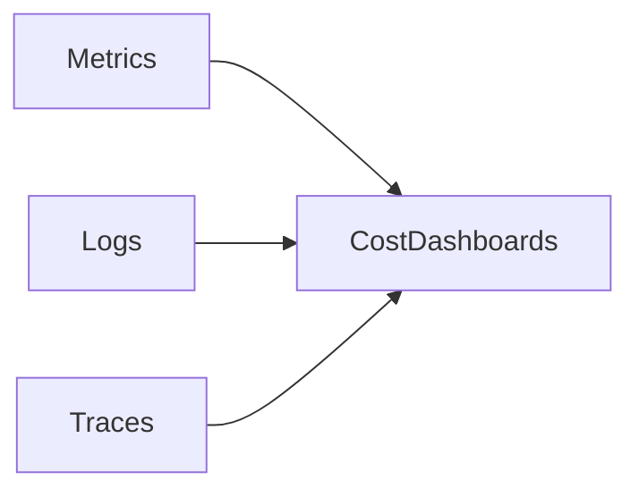

# Cost-Aware System Architecture

**Objective**: Design systems that account for operational cost as an architectural constraint, not an afterthought.

## Cost as an architectural constraint

Cost is a first-class constraint: it shapes scaling, technology choices, and operational patterns. Systems that ignore cost until late in the lifecycle often incur high run rates, overprovisioning, or technical debt (e.g. under-instrumentation) that is expensive to fix. Cost-aware design means making tradeoffs explicit and measurable from the start.

## Cost drivers

### Compute

Compute cost comes from CPUs, GPUs, and serverless invocations. Drivers include core count, utilization, burst behavior, and reservation vs on-demand. Right-sizing and autoscaling reduce waste; over-provisioning and idle capacity increase it.

### Storage

Storage cost depends on volume, tier (hot/cool/archive), redundancy, and access patterns. Unbounded retention, hot storage for rarely-accessed data, and duplicate copies across regions or formats all increase cost. Lifecycle policies and tiering are essential.

### Networking

Data transfer (egress, cross-AZ/cross-region) and API request volume drive networking cost. Architectures that move large volumes of data repeatedly or that rely on chatty cross-service calls amplify this. Co-location, caching, and batch transfers reduce it.

### Observability

Logging, metrics, traces, and dashboards have cost: ingestion, retention, and query. Over-instrumentation and unbounded retention can make observability one of the largest line items. Design retention and sampling policies and align instrumentation with real operational needs.

## Architecture cost tradeoffs

| Pattern | Pros | Cost risk |
|--------|------|-----------|
| Microservices | Scalability, team autonomy | High observability and networking cost; more moving parts to run and monitor |
| Monolith | Simplicity, lower operational surface | Scaling limits may force expensive vertical or replication later |
| Real-time streaming | Low latency, event-driven | Higher compute and storage than batch for equivalent throughput |
| Batch processing | Predictable cost, good throughput | Latency and scheduling constraints |
| Serverless | Pay per use, no idle capacity | Cold starts, egress, and per-invocation cost can add up at scale |

Choose patterns that match actual latency and scale requirements; avoid distributed or real-time complexity when batch or monolith would suffice. See [Why Most Microservices Should Be Monoliths](../../deep-dives/why-most-microservices-should-be-monoliths.md) and [Appropriate Use of Microservices](../../deep-dives/appropriate-use-of-microservices.md) for nuance.

## Cost optimization patterns

- **Right-sizing infrastructure**: Match CPU, memory, and GPU to measured usage; use autoscaling and scale-to-zero where appropriate. Avoid defaulting to large instance types.
- **Storage lifecycle tiers**: Move cold data to cheaper tiers (e.g. cool/archive, or compressed/partitioned formats). Define retention and deletion policies and automate them.
- **Batch vs real-time**: Use batch or micro-batch where latency allows; reserve real-time streaming for workloads that truly need it. See [The Hidden Cost of Real-Time Systems](../../deep-dives/the-hidden-cost-of-real-time-systems.md).

## Cost observability

Cost must be visible before it can be optimized. Instrument resource usage (compute, storage, network) and map it to cost (e.g. via cost exporters, tags, or allocation models). Dashboards and alerts should surface cost trends and anomalies.

Metrics, logs, and traces feed cost attribution and dashboards when tagged with resource and ownership metadata. Avoid [over-instrumentation](../../deep-dives/the-economics-of-observability.md) that itself becomes a major cost.

## Anti-patterns

- **Over-instrumentation**: Capturing more telemetry than is used, or retaining it indefinitely, drives observability cost up without proportional benefit. Define retention and sampling and review instrumentation regularly.
- **Premature distributed systems**: Introducing microservices, message queues, or multi-region complexity before scale or requirements justify it increases operational and networking cost. Prefer simpler designs until constraints demand otherwise.

For a broader cost governance framework (Kubernetes, data systems, ML, geospatial), see [Cost-Aware Architecture & Resource-Efficiency Governance](../architecture-design/cost-aware-architecture-and-efficiency-governance.md).

## See also

- [Cost-Aware Architecture & Resource-Efficiency Governance](../architecture-design/cost-aware-architecture-and-efficiency-governance.md) — full cost governance framework
- [Capacity Planning and Workload Modeling](../architecture-design/capacity-planning-and-workload-modeling.md) — capacity and cost modeling
- [The Economics of Observability](../../deep-dives/the-economics-of-observability.md) — cost of observability
- [The Myth of Serverless Simplicity](../../deep-dives/the-myth-of-serverless-simplicity.md) — serverless cost and complexity
- [Failure-Oriented System Design](../operations/failure-oriented-design.md) — resilience without over-spending on redundancy
