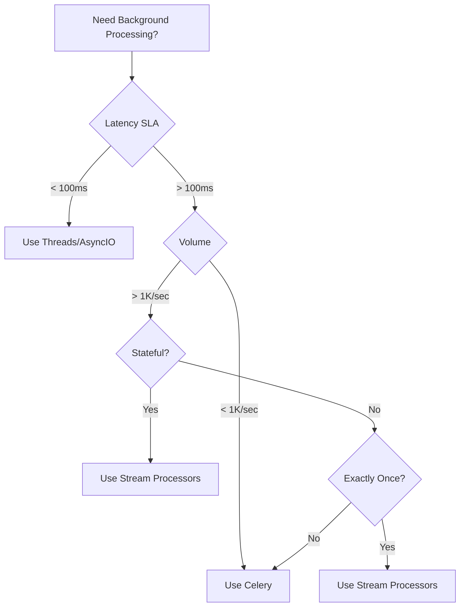

# Celery in Production: Picking the Right Jobs, Writing Safe Tasks, Running It Like You Mean It

**Objective**: Master Celery task queues for reliable distributed processing in Python applications. When you need to offload HTTP requests, when you want to process background jobs, when you're building scalable data pipelines—Celery becomes your weapon of choice.

Celery is a distributed task queue that provides reliable at-least-once execution with retries, scheduling, and monitoring. It's not a streaming processor or OLAP engine—it's designed for offloading work from web requests, processing scheduled jobs, and handling idempotent side effects at scale.

## 0) Prerequisites (Read Once, Live by Them)

### The Five Commandments

1. **Understand when to use Celery**
   - HTTP offloading (emails, webhooks, notifications)
   - CPU-intensive tasks that fit process pools
   - Scheduled jobs and periodic processing
   - Idempotent side effects and ETL micro-steps
   - Background processing with retry semantics

2. **Master task design patterns**
   - Idempotent operations with external keys
   - Bounded execution with time and rate limits
   - Observable tasks with structured logging
   - Retryable failures with exponential backoff
   - Compensating actions for multi-step workflows

3. **Know your infrastructure**
   - Broker selection (Redis vs RabbitMQ)
   - Result backend configuration
   - Worker pool types and concurrency
   - Queue routing and priority handling
   - Monitoring and observability tools

4. **Validate everything**
   - Test task logic as pure functions
   - Verify retry behavior and error handling
   - Check queue routing and priority
   - Monitor worker health and performance
   - Validate graceful shutdown procedures

5. **Plan for production**
   - Design for high-throughput scenarios
   - Enable proper monitoring and alerting
   - Implement dead letter queues and replay
   - Configure security and multi-tenancy
   - Document operational procedures

**Why These Principles**: Celery requires understanding both distributed systems patterns and Python concurrency. Understanding these patterns prevents system failures and enables reliable distributed processing.

## 1) When to Use Celery (Decision Matrix)

### Decision Matrix



**Why Decision Matrix Matters**: Proper tool selection prevents architectural mistakes. Understanding these patterns prevents over-engineering and enables optimal system design.

### Use Cases

```python
# Celery use cases
celery_use_cases = {
    "http_offloading": "Send emails, webhooks, notifications after HTTP response",
    "cpu_intensive": "Image processing, data transformation, ML inference",
    "scheduled_jobs": "Daily reports, cleanup tasks, periodic maintenance",
    "etl_microsteps": "Data validation, transformation, loading steps",
    "idempotent_side_effects": "File generation, cache warming, external API calls"
}

# When NOT to use Celery
not_celery_cases = {
    "in_request_io": "Use threads/asyncio for parallel I/O within request",
    "streaming_data": "Use Kafka/Beam for event-time windows and exactly-once",
    "olap_queries": "Use specialized OLAP engines for analytical workloads",
    "real_time": "Use WebSockets or streaming for real-time communication"
}
```

**Why Use Case Analysis Matters**: Clear use case definition prevents architectural confusion. Understanding these patterns prevents tool misuse and enables optimal system design.

## 2) Minimal, Opinionated Setup (Redis broker + Flower)

### Docker Compose for Local Development

```yaml
# docker-compose.yml
version: "3.9"
services:
  redis:
    image: redis:7.2-alpine
    ports: ["6379:6379"]
    command: redis-server --appendonly yes
    
  worker:
    image: python:3.11-slim
    working_dir: /app
    command: bash -lc "pip install 'celery==5.3.*' 'redis==5.0.*' && celery -A app.celery worker -l INFO"
    volumes: [".:/app"]
    environment:
      - CELERY_BROKER_URL=redis://redis:6379/0
      - CELERY_RESULT_BACKEND=redis://redis:6379/1
    depends_on: [redis]
    
  beat:
    image: python:3.11-slim
    working_dir: /app
    command: bash -lc "pip install 'celery==5.3.*' 'redis==5.0.*' && celery -A app.celery beat -l INFO"
    volumes: [".:/app"]
    environment:
      - CELERY_BROKER_URL=redis://redis:6379/0
      - CELERY_RESULT_BACKEND=redis://redis:6379/1
    depends_on: [redis]
    
  flower:
    image: mher/flower:2.0
    command: ["flower", "--port=5555", "--broker=redis://redis:6379/0"]
    ports: ["5555:5555"]
    depends_on: [redis]
```

**Why Docker Compose Matters**: One-command local stack separates broker from results DB to reduce key churn. Understanding these patterns prevents local development issues and enables consistent environments.

### Quick Start

```bash
# Start the stack
docker-compose up -d

# Check Flower UI
open http://localhost:5555

# Run a test task
python -c "from app.tasks import ping; print(ping.delay().get())"
```

**Why Quick Start Matters**: Immediate feedback enables rapid development and testing. Understanding these patterns prevents setup frustration and enables efficient development.

## 3) App Factory & Task Module Layout

### App Factory

```python
# app/__init__.py
from celery import Celery
import os

def make_celery() -> Celery:
    app = Celery(
        "myapp",
        broker=os.getenv("CELERY_BROKER_URL", "redis://localhost:6379/0"),
        backend=os.getenv("CELERY_RESULT_BACKEND", "redis://localhost:6379/1"),
        include=["app.tasks"],  # modules to autodiscover
    )
    app.conf.update(
        task_serializer="json",
        accept_content=["json"],
        result_serializer="json",
        timezone="UTC",
        task_acks_late=True,            # ack after task completes
        task_reject_on_worker_lost=True,# don't ghost-ack on crashes
        worker_max_tasks_per_child=1000,# avoid leaks
        broker_heartbeat=30,
    )
    return app

celery = make_celery()
```

**Why App Factory Matters**: Central config, predictable imports, sane defaults for ack/reject behavior and worker hygiene. Understanding these patterns prevents circular imports and enables framework integration.

### Task Module Structure

```python
# app/tasks.py
from . import celery
from celery import shared_task
import time, httpx

@shared_task(
    bind=True,
    autoretry_for=(httpx.HTTPError,),
    retry_backoff=2,            # 2, 4, 8, …
    retry_jitter=True,
    retry_kwargs={"max_retries": 5},
    time_limit=60,              # hard kill
    soft_time_limit=55,         # graceful timeout
    rate_limit="10/m",          # protect downstream
    acks_late=True,
)
def send_webhook(self, url: str, payload: dict, idem_key: str | None = None) -> dict:
    """
    Idempotent side-effect: POST with Idempotency-Key so retries don't duplicate work.
    """
    headers = {"Idempotency-Key": idem_key} if idem_key else {}
    with httpx.Client(timeout=10) as c:
        r = c.post(url, json=payload, headers=headers)
        r.raise_for_status()
        return {"status": r.status_code}

@shared_task
def ping() -> str:
    return "pong"
```

**Why Task Design Matters**: Retries with jitter, rate limits, and time limits; acks_late avoids losing tasks on worker death; idempotency key prevents double effects. Understanding these patterns prevents task failures and enables reliable processing.

## 4) Writing Safe Tasks: Idempotent, Bounded, Observable

### Idempotent Task Pattern

```python
# Idempotent task with external key
@shared_task(bind=True, acks_late=True)
def process_payment(self, user_id: str, amount: int, idem_key: str) -> dict:
    """
    Idempotent payment processing with external key.
    """
    # Check if already processed
    existing = get_payment_by_idem_key(idem_key)
    if existing:
        return {"status": "already_processed", "payment_id": existing.id}
    
    # Process payment
    payment = create_payment(user_id, amount, idem_key)
    return {"status": "processed", "payment_id": payment.id}
```

**Why Idempotency Matters**: External keys prevent duplicate processing and enable safe retries. Understanding these patterns prevents data corruption and enables reliable distributed processing.

### Bounded Task Pattern

```python
# Bounded task with limits
@shared_task(
    bind=True,
    time_limit=300,           # 5 minutes hard limit
    soft_time_limit=270,     # 4.5 minutes graceful
    rate_limit="5/m",         # 5 per minute
    autoretry_for=(Exception,),
    retry_kwargs={"max_retries": 3}
)
def generate_report(self, report_type: str, user_id: str) -> dict:
    """
    Generate report with bounded execution.
    """
    start_time = time.time()
    
    try:
        # Generate report
        report_data = build_report(report_type, user_id)
        
        # Save to storage
        report_url = save_report_to_s3(report_data)
        
        return {
            "status": "completed",
            "report_url": report_url,
            "duration": time.time() - start_time
        }
    except Exception as exc:
        # Log error and retry
        self.retry(countdown=60, exc=exc)
```

**Why Bounded Tasks Matter**: Time and rate limits prevent resource exhaustion and protect downstream services. Understanding these patterns prevents system overload and enables reliable processing.

### Observable Task Pattern

```python
# Observable task with structured logging
import logging
import json

logger = logging.getLogger(__name__)

@shared_task(bind=True, acks_late=True)
def process_data(self, data_id: str, operation: str) -> dict:
    """
    Observable data processing with structured logging.
    """
    task_id = self.request.id
    logger.info(json.dumps({
        "event": "task_started",
        "task_id": task_id,
        "data_id": data_id,
        "operation": operation,
        "timestamp": time.time()
    }))
    
    try:
        # Process data
        result = perform_operation(data_id, operation)
        
        logger.info(json.dumps({
            "event": "task_completed",
            "task_id": task_id,
            "data_id": data_id,
            "operation": operation,
            "result": result,
            "timestamp": time.time()
        }))
        
        return result
        
    except Exception as exc:
        logger.error(json.dumps({
            "event": "task_failed",
            "task_id": task_id,
            "data_id": data_id,
            "operation": operation,
            "error": str(exc),
            "timestamp": time.time()
        }))
        raise
```

**Why Observable Tasks Matter**: Structured logging enables debugging and monitoring. Understanding these patterns prevents silent failures and enables operational visibility.

## 5) Routing, Queues, and Priority

### Queue Configuration

```python
# app/celery_routes.py
ROUTES = {
    "app.tasks.send_webhook": {"queue": "io"},
    "app.tasks.generate_report": {"queue": "cpu"},
    "app.tasks.send_email": {"queue": "io"},
    "app.tasks.process_image": {"queue": "cpu"},
}

# app/__init__.py (add to make_celery)
app.conf.task_routes = "app.celery_routes.ROUTES"
app.conf.task_queues = (
    {
        "name": "io",
        "exchange": "io",
        "routing_key": "io",
    },
    {
        "name": "cpu",
        "exchange": "cpu",
        "routing_key": "cpu",
    },
)
```

**Why Queue Routing Matters**: Isolation prevents slow CPU jobs from starving I/O tasks; explicit queues enable SLO-by-queue. Understanding these patterns prevents performance issues and enables optimal resource utilization.

### Worker Configuration

```bash
# Run workers per queue
celery -A app.celery worker -Q io -n io@%h -l INFO
celery -A app.celery worker -Q cpu -n cpu@%h -l INFO --concurrency=2 --pool=solo

# Autoscale workers
celery -A app.celery worker --autoscale=16,2  # max,min
```

**Why Worker Configuration Matters**: Match pool to task profile; prevent oversubscription and context-switch hell. Understanding these patterns prevents resource contention and enables optimal performance.

## 6) Concurrency, Pools, and Autoscaling

### Pool Types

```python
# Pool configuration
pool_configs = {
    "prefork": "Default for CPU/most tasks",
    "gevent": "High-concurrency I/O (only if libs are compatible)",
    "eventlet": "Alternative to gevent for I/O",
    "solo": "Debugging and single-threaded execution"
}

# Worker configuration
worker_configs = {
    "concurrency": "≈ cores for CPU or higher for I/O",
    "autoscale": "Dynamic scaling based on queue length",
    "max_tasks_per_child": "Prevent memory leaks",
    "time_limit": "Hard kill for runaway tasks"
}
```

**Why Pool Selection Matters**: Right pool type prevents performance bottlenecks and resource waste. Understanding these patterns prevents concurrency issues and enables optimal worker utilization.

### Autoscaling Configuration

```python
# Autoscaling settings
app.conf.update(
    worker_autoscaler="celery.worker.autoscale:Autoscaler",
    worker_max_tasks_per_child=1000,
    worker_max_memory_per_child=200000,  # 200MB
)
```

**Why Autoscaling Matters**: Dynamic scaling enables efficient resource utilization and cost optimization. Understanding these patterns prevents over-provisioning and enables responsive processing.

## 7) Task Composition: Chains, Groups, Chords

### Task Composition Patterns

```python
# app/task_composition.py
from celery import chain, group, chord
from .tasks import fetch, transform, store, notify

# Chain: sequential execution
workflow = chain(
    fetch.s("data_source"),
    transform.s(),
    store
)

# Group: parallel execution
parallel_tasks = group(
    fetch.s("source1"),
    fetch.s("source2"),
    fetch.s("source3")
)

# Chord: fan-in after parallel execution
chord_workflow = chord(
    group(fetch.s(i) for i in range(100)),
    transform.s()
)

# Complex workflow
complex_workflow = chain(
    group(fetch.s(i) for i in range(100)) |
    transform.s() |
    chord(store.s(), notify.s())
)
```

**Why Task Composition Matters**: Powerful DAGs without a separate orchestrator; chords give fan-in semantics. Understanding these patterns prevents complex orchestration and enables efficient workflow design.

### Workflow Execution

```python
# Execute workflow
result = complex_workflow.apply_async()

# Check status
print(f"Workflow ID: {result.id}")
print(f"Status: {result.status}")

# Get results
if result.ready():
    print(f"Results: {result.get()}")
```

**Why Workflow Execution Matters**: Proper execution enables complex processing patterns. Understanding these patterns prevents workflow failures and enables sophisticated data processing.

## 8) Scheduling with Beat (UTC and robust)

### Beat Configuration

```python
# app/beat.py
from . import celery
from celery.schedules import crontab

celery.conf.beat_schedule = {
    "nightly-report": {
        "task": "app.tasks.generate_report",
        "schedule": crontab(minute=0, hour=2),  # 02:00 UTC
        "options": {"queue": "cpu", "expires": 3600},
    },
    "cleanup-temp-files": {
        "task": "app.tasks.cleanup_temp_files",
        "schedule": crontab(minute=0, hour=1),  # 01:00 UTC
        "options": {"queue": "io", "expires": 1800},
    },
    "health-check": {
        "task": "app.tasks.health_check",
        "schedule": crontab(minute="*/5"),  # Every 5 minutes
        "options": {"queue": "io", "expires": 300},
    },
}
```

**Why Beat Scheduling Matters**: Centralized schedule; expires prevents zombie runs if delayed; UTC only to dodge DST. Understanding these patterns prevents scheduling issues and enables reliable periodic processing.

### Beat Execution

```bash
# Run Beat scheduler
celery -A app.celery beat -l INFO

# Run Beat with persistence
celery -A app.celery beat -l INFO --pidfile=/tmp/celerybeat.pid
```

**Why Beat Execution Matters**: Proper execution enables reliable scheduling and prevents duplicate runs. Understanding these patterns prevents scheduling failures and enables consistent periodic processing.

## 9) Observability & Operability

### Flower Monitoring

```python
# Flower configuration
flower_config = {
    "port": 5555,
    "broker": "redis://localhost:6379/0",
    "basic_auth": ["admin:password"],  # Production auth
    "persistent": True,
    "db": "/tmp/flower.db"
}
```

**Why Flower Monitoring Matters**: Real-time monitoring enables operational visibility and debugging. Understanding these patterns prevents silent failures and enables proactive system management.

### Structured Logging

```python
# Structured logging configuration
import logging
import json

class CeleryFormatter(logging.Formatter):
    def format(self, record):
        log_entry = {
            "timestamp": record.created,
            "level": record.levelname,
            "logger": record.name,
            "message": record.getMessage(),
            "task_id": getattr(record, "task_id", None),
            "task_name": getattr(record, "task_name", None),
        }
        return json.dumps(log_entry)

# Configure logging
logging.basicConfig(
    level=logging.INFO,
    handlers=[logging.StreamHandler()],
    format="%(message)s"
)
```

**Why Structured Logging Matters**: JSON logs enable parsing and analysis. Understanding these patterns prevents debugging difficulties and enables operational insights.

### Prometheus Metrics

```python
# Prometheus metrics
from prometheus_client import Counter, Histogram, Gauge

# Metrics
task_counter = Counter('celery_tasks_total', 'Total tasks', ['task_name', 'status'])
task_duration = Histogram('celery_task_duration_seconds', 'Task duration', ['task_name'])
active_tasks = Gauge('celery_active_tasks', 'Active tasks', ['queue'])

# Task decorator for metrics
def track_metrics(task_func):
    def wrapper(*args, **kwargs):
        start_time = time.time()
        try:
            result = task_func(*args, **kwargs)
            task_counter.labels(task_name=task_func.__name__, status='success').inc()
            return result
        except Exception as exc:
            task_counter.labels(task_name=task_func.__name__, status='failure').inc()
            raise
        finally:
            task_duration.labels(task_name=task_func.__name__).observe(time.time() - start_time)
    return wrapper
```

**Why Prometheus Metrics Matter**: Metrics enable monitoring and alerting. Understanding these patterns prevents monitoring gaps and enables proactive system management.

## 10) Framework Integration (FastAPI/Django)

### FastAPI Integration

```python
# api/main.py
from fastapi import FastAPI, HTTPException
from app.tasks import send_webhook, generate_report

app = FastAPI()

@app.post("/submit")
def submit(item: dict):
    """Submit item for processing."""
    task = send_webhook.delay(
        "https://hooks.example.com",
        item,
        idem_key=item.get("id")
    )
    return {"queued": True, "task_id": task.id}

@app.get("/status/{task_id}")
def get_status(task_id: str):
    """Get task status."""
    task = send_webhook.AsyncResult(task_id)
    return {
        "task_id": task_id,
        "status": task.status,
        "result": task.result if task.ready() else None
    }
```

**Why FastAPI Integration Matters**: Keep HTTP request fast; 202 Accepted pattern with a task id for status. Understanding these patterns prevents request timeouts and enables responsive APIs.

### Django Integration

```python
# settings.py
CELERY_BROKER_URL = "redis://localhost:6379/0"
CELERY_RESULT_BACKEND = "redis://localhost:6379/1"
CELERY_ACCEPT_CONTENT = ["json"]
CELERY_TASK_SERIALIZER = "json"
CELERY_RESULT_SERIALIZER = "json"

# views.py
from django.http import JsonResponse
from .tasks import send_webhook

def submit_view(request):
    """Submit for processing."""
    task = send_webhook.delay(
        "https://hooks.example.com",
        request.POST.dict()
    )
    return JsonResponse({"queued": True, "task_id": task.id})
```

**Why Django Integration Matters**: Use CELERY_BROKER_URL in settings; start workers with Django's settings module. Understanding these patterns prevents integration issues and enables seamless framework integration.

## 11) Results Backend: Do You Really Need It?

### Results Backend Guidance

```python
# Results backend configuration
app.conf.update(
    result_expires=3600,        # 1 hour TTL
    result_extended=True,        # Include task metadata
    result_persistent=True,      # Persist to disk
)

# Fire-and-forget pattern
@shared_task
def fire_and_forget_task(data: dict):
    """Task that doesn't need results."""
    process_data(data)
    # No return value needed
```

**Why Results Backend Matters**: Prefer fire-and-forget with event/log observability. Understanding these patterns prevents unnecessary storage and enables efficient processing.

### Results Storage Strategy

```python
# Store artifacts externally
@shared_task
def generate_large_report(self, report_type: str) -> dict:
    """Generate report and store externally."""
    # Generate report
    report_data = build_report(report_type)
    
    # Store to S3
    report_url = save_to_s3(report_data)
    
    # Return only reference
    return {"report_url": report_url}
```

**Why External Storage Matters**: Avoid storing large payloads—write artifacts to S3 and return a pointer. Understanding these patterns prevents memory issues and enables scalable processing.

## 12) Reliability Patterns

### Idempotency Patterns

```python
# Idempotent task with external key
@shared_task(bind=True, acks_late=True)
def idempotent_task(self, business_key: str, data: dict) -> dict:
    """Idempotent task with business key."""
    # Check if already processed
    existing = get_by_business_key(business_key)
    if existing:
        return {"status": "already_processed", "id": existing.id}
    
    # Process and store
    result = process_and_store(business_key, data)
    return {"status": "processed", "id": result.id}
```

**Why Idempotency Matters**: Make tasks safe on retry (use external Idempotency-Key or upsert by business key). Understanding these patterns prevents duplicate processing and enables reliable distributed systems.

### Retry Patterns

```python
# Retry with exponential backoff
@shared_task(
    bind=True,
    autoretry_for=(Exception,),
    retry_backoff=2,
    retry_jitter=True,
    retry_kwargs={"max_retries": 5}
)
def retryable_task(self, data: dict) -> dict:
    """Task with retry logic."""
    try:
        return process_data(data)
    except Exception as exc:
        # Log error and retry
        logger.error(f"Task failed: {exc}")
        self.retry(countdown=60, exc=exc)
```

**Why Retry Patterns Matter**: Retry budget: cap retries; raise to DLQ after N attempts; include retry context in logs. Understanding these patterns prevents infinite retries and enables reliable error handling.

### Saga Patterns

```python
# Saga pattern for multi-step workflows
@shared_task
def saga_step_1(data: dict) -> dict:
    """First step of saga."""
    result = process_step_1(data)
    return {"step_1_result": result, "data": data}

@shared_task
def saga_step_2(step_1_result: dict) -> dict:
    """Second step of saga."""
    try:
        result = process_step_2(step_1_result)
        return {"step_2_result": result}
    except Exception as exc:
        # Compensate for step 1
        compensate_step_1(step_1_result)
        raise

# Compensating action
@shared_task
def compensate_step_1(step_1_result: dict) -> None:
    """Compensate for step 1 failure."""
    rollback_step_1(step_1_result)
```

**Why Saga Patterns Matter**: Design compensating tasks for multi-step side effects. Understanding these patterns prevents partial failures and enables reliable complex workflows.

## 13) Security & Multi-Tenancy

### Security Configuration

```python
# Security settings
app.conf.update(
    broker_connection_retry_on_startup=True,
    broker_connection_retry=True,
    broker_connection_max_retries=10,
    broker_ssl_cert_reqs="required",
    broker_ssl_ca_certs="/path/to/ca.pem",
    broker_ssl_certfile="/path/to/cert.pem",
    broker_ssl_keyfile="/path/to/key.pem",
)
```

**Why Security Matters**: Broker auth/TLS; don't expose Redis to the world. Understanding these patterns prevents security vulnerabilities and enables secure distributed processing.

### Multi-Tenancy

```python
# Multi-tenant task
@shared_task
def tenant_aware_task(tenant_id: str, data: dict) -> dict:
    """Task with tenant isolation."""
    # Set tenant context
    set_tenant_context(tenant_id)
    
    # Process with tenant isolation
    result = process_with_tenant_isolation(data)
    
    return {"tenant_id": tenant_id, "result": result}
```

**Why Multi-Tenancy Matters**: Tag tasks with tenant_id; use per-tenant queues if necessary. Understanding these patterns prevents data leakage and enables secure multi-tenant processing.

## 14) Testing & CI

### Unit Testing

```python
# test_tasks.py
import pytest
from unittest.mock import patch
from app.tasks import send_webhook

def test_send_webhook_success(mocker):
    """Test webhook task success."""
    mock_post = mocker.patch("httpx.Client.post")
    mock_post.return_value.status_code = 200
    
    result = send_webhook.run("http://example.com", {"test": "data"})
    
    assert result == {"status": 200}
    mock_post.assert_called_once()

def test_send_webhook_retry(mocker):
    """Test webhook task retry."""
    mock_post = mocker.patch("httpx.Client.post")
    mock_post.side_effect = httpx.HTTPError("Connection failed")
    
    with pytest.raises(httpx.HTTPError):
        send_webhook.run("http://example.com", {"test": "data"})
```

**Why Unit Testing Matters**: Unit-test task logic as pure functions; don't spin workers for unit tests. Understanding these patterns prevents testing complexity and enables reliable test coverage.

### Integration Testing

```python
# test_integration.py
import pytest
from app.tasks import send_webhook

@pytest.fixture
def celery_app():
    """Test Celery app."""
    from app import make_celery
    app = make_celery()
    app.conf.update(
        task_always_eager=True,
        task_eager_propagates=True,
    )
    return app

def test_webhook_integration(celery_app):
    """Test webhook integration."""
    result = send_webhook.delay("http://example.com", {"test": "data"})
    assert result.status == "SUCCESS"
```

**Why Integration Testing Matters**: For integration tests, run a worker + broker in CI (docker service), use .apply() for sync execution. Understanding these patterns prevents integration issues and enables reliable testing.

## 15) Anti-Patterns (Red Flags)

### Common Anti-Patterns

```python
# DON'T: Giant tasks that run for hours
@shared_task
def bad_giant_task(data: list):
    """This will timeout and fail."""
    for item in data:  # Process 1M items
        process_item(item)  # This takes hours

# DO: Split into subtasks
@shared_task
def good_chunked_task(chunk: list):
    """Process chunk of data."""
    for item in chunk:
        process_item(item)

# Orchestrate with chord
chord(
    group(good_chunked_task.s(chunk) for chunk in chunks),
    finalize.s()
)

# DON'T: Non-idempotent side effects
@shared_task
def bad_charge_card(amount: int):
    """This will double-charge on retry."""
    charge_card(amount)  # No idempotency key!

# DO: Use idempotency key
@shared_task
def good_charge_card(amount: int, idem_key: str):
    """Idempotent card charging."""
    charge_card_with_key(amount, idem_key)
```

**Why Anti-Patterns Matter**: Common mistakes lead to system failures and data corruption. Understanding these patterns prevents implementation errors and enables reliable distributed processing.

### Performance Anti-Patterns

```python
# DON'T: Mix CPU hogs with latency-sensitive tasks
# Same queue for both:
@shared_task
def cpu_intensive_task():
    """This will block I/O tasks."""
    return sum(range(1000000))

@shared_task
def latency_sensitive_task():
    """This needs fast response."""
    return send_notification()

# DO: Separate queues
# CPU queue: cpu_intensive_task
# I/O queue: latency_sensitive_task
```

**Why Performance Anti-Patterns Matter**: Proper queue separation prevents performance issues. Understanding these patterns prevents resource contention and enables optimal performance.

## 16) TL;DR Runbook

### Essential Commands

```bash
# Start workers
celery -A app.celery worker -l INFO

# Start Beat scheduler
celery -A app.celery beat -l INFO

# Start Flower monitoring
celery -A app.celery flower

# Run specific queue
celery -A app.celery worker -Q io -l INFO

# Autoscale workers
celery -A app.celery worker --autoscale=16,2
```

### Essential Patterns

```python
# Essential Celery patterns
celery_patterns = {
    "use_celery_for": "HTTP offloading, CPU bursts, scheduled jobs, idempotent side-effects",
    "task_design": "Idempotent, retryable, bounded by time & rate",
    "queue_separation": "Separate queues for different task types",
    "worker_config": "Right pool, autoscale thoughtfully",
    "scheduling": "UTC schedules with Beat, expire late jobs",
    "observability": "Flower + metrics, configure DLQ + replayer",
    "results": "Keep results short-lived, store artifacts externally"
}
```

### Quick Reference

```python
# Essential Celery operations
# 1. Create task
@shared_task(bind=True, acks_late=True)
def my_task(self, data):
    return process_data(data)

# 2. Execute task
result = my_task.delay(data)

# 3. Check status
print(result.status)

# 4. Get result
if result.ready():
    print(result.get())

# 5. Configure retries
@shared_task(autoretry_for=(Exception,), retry_kwargs={"max_retries": 3})
def retryable_task(data):
    return process_data(data)

# 6. Set time limits
@shared_task(time_limit=60, soft_time_limit=55)
def bounded_task(data):
    return process_data(data)
```

**Why This Runbook**: These patterns cover 90% of Celery needs. Master these before exploring advanced scenarios.

## 17) The Machine's Summary

Celery requires understanding both distributed systems patterns and Python concurrency. When used correctly, Celery enables reliable background processing, scalable task execution, and robust distributed workflows. The key is understanding when to use Celery, mastering task design patterns, and following operational best practices.

**The Dark Truth**: Without proper Celery understanding, your background processing is fragile and unreliable. Celery is your weapon. Use it wisely.

**The Machine's Mantra**: "In the queue we trust, in the retry we persist, and in the idempotency we find the path to reliable distributed processing."

**Why This Matters**: Celery enables efficient background processing that can handle complex workflows, maintain data consistency, and provide reliable distributed systems while ensuring performance and observability.

---

*This guide provides the complete machinery for Celery in production. The patterns scale from simple HTTP offloading to complex distributed workflows, from basic task execution to advanced orchestration.*
