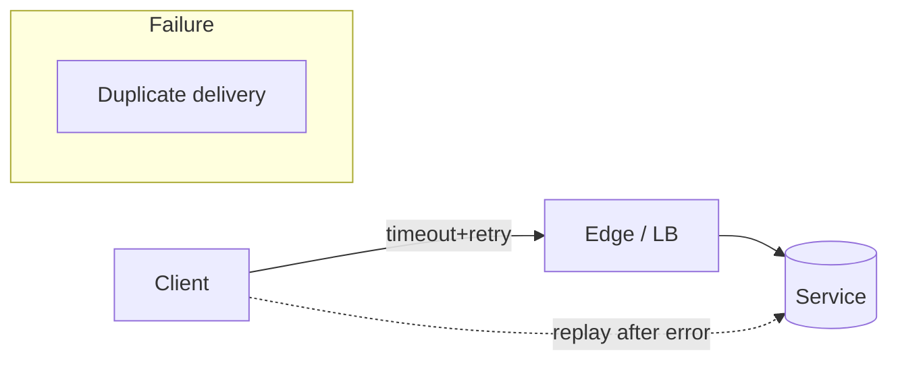
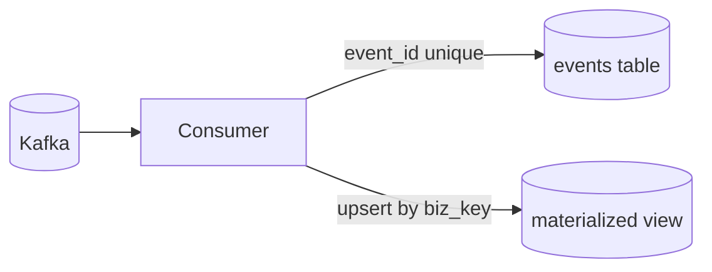

# Idempotency & De-dup: Designing Operations That Don't Double-Fire

**Objective**: Master idempotency and de-duplication patterns to prevent duplicate operations in distributed systems. When you need safe retries, when you want to prevent double-billing, when you're building reliable APIs and data pipelines—idempotency becomes your weapon of choice.

Retries happen (clients, proxies, workers). Without idempotency, you print money twice—or delete the same row twice. Build request identity, dedupe state, and committed outcomes into every layer.

## 0) Prerequisites (Read Once, Live by Them)

### The Five Commandments

1. **Understand duplicate sources**
   - Client retries on timeout
   - Load balancer resending
   - At-least-once queues and job restarts
   - Network splits and manual reruns
   - System failures and recovery

2. **Master idempotency patterns**
   - HTTP APIs with Idempotency-Key headers
   - Database UPSERT operations
   - Background job deduplication
   - Stream processing exactly-once semantics

3. **Know your deduplication strategies**
   - Request fingerprinting and caching
   - Business key uniqueness constraints
   - Content-addressed storage
   - Event sourcing and replay

4. **Validate everything**
   - Test retry scenarios and edge cases
   - Verify deduplication effectiveness
   - Check audit trails and observability
   - Monitor duplicate detection rates

5. **Plan for production**
   - Design for high-throughput scenarios
   - Implement proper TTL policies
   - Enable safe reprocessing and backfills
   - Document rollback procedures

**Why These Principles**: Idempotency requires understanding both system reliability and data consistency patterns. Understanding these patterns prevents data corruption and enables reliable distributed systems.

## 1) Threat Model: Where Duplicates Come From

### Duplicate Sources



**Why Threat Modeling Matters**: Understanding duplicate sources enables systematic prevention strategies. Understanding these patterns prevents data corruption and enables reliable system design.

### Common Duplicate Scenarios

```python
# Common duplicate scenarios
duplicate_scenarios = {
    "client_retry": "Client retries on timeout without idempotency",
    "load_balancer": "LB resends requests to different instances",
    "queue_replay": "Message queues redeliver on failures",
    "job_restart": "Background jobs restart after crashes",
    "manual_rerun": "Operators manually rerun failed jobs",
    "network_split": "Network partitions cause duplicate operations"
}
```

**Why Scenario Analysis Matters**: Systematic analysis of duplicate sources enables comprehensive prevention strategies. Understanding these patterns prevents overlooked failure modes and enables robust system design.

## 2) HTTP APIs — Idempotency Keys Done Right

### FastAPI Implementation

```python
# HTTP idempotency with Redis
from fastapi import FastAPI, Header, HTTPException
from pydantic import BaseModel
from redis import Redis
import json, hashlib, time

app = FastAPI()
r = Redis.from_url("redis://localhost:6379/0")

class ChargeReq(BaseModel):
    user_id: str
    amount_cents: int

def cache_key(idem_key: str) -> str:
    return f"idem:{idem_key}"

@app.post("/charges")
def create_charge(payload: ChargeReq, idempotency_key: str = Header(..., alias="Idempotency-Key")):
    k = cache_key(idempotency_key)
    
    # Reserve key if new (SETNX)
    if r.set(k, json.dumps({"state":"pending"}), nx=True, ex=24*3600):
        # Do side effect once
        charge_id = f"ch_{hashlib.sha1((payload.user_id+str(payload.amount_cents)+str(time.time())).encode()).hexdigest()[:12]}"
        
        # Persist outcome
        outcome = {"status": 201, "charge_id": charge_id, "amount": payload.amount_cents}
        r.set(k, json.dumps({"state":"done","outcome": outcome}), ex=24*3600)
        return outcome
    
    # Key exists: return cached outcome or 409 if pending
    data = json.loads(r.get(k))
    if data["state"] == "pending":
        raise HTTPException(status_code=409, detail="Operation in progress")
    return data["outcome"]
```

**Why Idempotency Keys Matter**: SETNX reserves the key atomically. On retries you return cached results, you don't re-execute side effects.

### Database Persistence

```sql
-- Idempotency audit table
CREATE TABLE idempotency_audit (
    idempotency_key TEXT PRIMARY KEY,
    request_fingerprint TEXT NOT NULL,
    outcome_hash TEXT NOT NULL,
    created_at TIMESTAMPTZ NOT NULL DEFAULT now(),
    expires_at TIMESTAMPTZ NOT NULL
);

-- Index for cleanup
CREATE INDEX idx_idempotency_expires ON idempotency_audit(expires_at);

-- Cleanup expired keys
DELETE FROM idempotency_audit WHERE expires_at < now();
```

**Why Database Persistence Matters**: DB becomes the source of truth for idempotent state, not just the cache. Understanding these patterns prevents cache-only solutions and enables audit trails.

## 3) Database Writes — UPSERT + Dedup Windows

### Postgres UPSERT Pattern

```sql
-- Payouts table with idempotency
CREATE TABLE payouts (
    id BIGSERIAL PRIMARY KEY,
    idem_key TEXT UNIQUE NOT NULL,
    user_id TEXT NOT NULL,
    amount_cents INT NOT NULL,
    outcome_hash TEXT NOT NULL,
    created_at TIMESTAMPTZ NOT NULL DEFAULT now()
);

-- Safe insert: conflict on idem_key returns existing row
INSERT INTO payouts (idem_key, user_id, amount_cents, outcome_hash)
VALUES ($1, $2, $3, $4)
ON CONFLICT (idem_key) DO UPDATE
SET user_id = EXCLUDED.user_id
RETURNING *;
```

**Why UPSERT Matters**: DB becomes the source of truth for idempotent state, not just the cache. Understanding these patterns prevents race conditions and enables reliable data consistency.

### Dedup Windows

```sql
-- Dedup window for sources without keys
CREATE TABLE external_transactions (
    id BIGSERIAL PRIMARY KEY,
    user_id TEXT NOT NULL,
    external_txn_id TEXT NOT NULL,
    amount_cents INT NOT NULL,
    processed_at TIMESTAMPTZ NOT NULL DEFAULT now()
);

-- Partial index for dedup window (last 24 hours)
CREATE UNIQUE INDEX idx_external_txn_dedup 
ON external_transactions (user_id, external_txn_id)
WHERE processed_at > now() - interval '24 hours';
```

**Why Dedup Windows Matter**: Time-bounded uniqueness prevents duplicates while allowing legitimate retries. Understanding these patterns prevents false positives and enables reliable deduplication.

## 4) Jobs & Schedulers — Make Re-runs Harmless

### Prefect Idempotent Tasks

```python
# Prefect 2.x idempotent task
from prefect import flow, task
import psycopg
import hashlib, json

def fingerprint(row) -> str:
    return hashlib.sha1(json.dumps(row, sort_keys=True).encode()).hexdigest()

@task(retries=3)
def upsert_row(conn_str, row):
    fp = fingerprint(row)
    with psycopg.connect(conn_str) as con, con.cursor() as cur:
        cur.execute("""
          INSERT INTO facts (biz_key, payload_hash, payload)
          VALUES (%s, %s, %s)
          ON CONFLICT (biz_key) DO UPDATE
          SET payload_hash = EXCLUDED.payload_hash,
              payload = EXCLUDED.payload
          WHERE facts.payload_hash <> EXCLUDED.payload_hash
        """, (row["id"], fp, json.dumps(row)))
```

**Why Job Idempotency Matters**: Reruns won't duplicate facts; updates are conditional on changed hash. Understanding these patterns prevents data corruption and enables reliable job execution.

### Run Ledger Pattern

```sql
-- Job run ledger
CREATE TABLE job_runs (
    run_id TEXT PRIMARY KEY,
    job_name TEXT NOT NULL,
    started_at TIMESTAMPTZ NOT NULL,
    completed_at TIMESTAMPTZ,
    status TEXT NOT NULL,
    business_key TEXT NOT NULL,
    outcome_hash TEXT
);

-- Idempotent job execution
INSERT INTO job_runs (run_id, job_name, started_at, status, business_key)
VALUES ($1, $2, now(), 'running', $3)
ON CONFLICT (run_id) DO NOTHING;
```

**Why Run Ledger Matters**: Job run tracking enables safe reruns and prevents duplicate execution. Understanding these patterns prevents job corruption and enables reliable automation.

## 5) Streams — "Exactly-Once-ish" Outcomes

### Kafka Producer Pattern

```python
# Kafka producer with deterministic keys
from kafka import KafkaProducer
import json
import ulid

def produce_event(business_key, event_data):
    producer = KafkaProducer(
        bootstrap_servers=['localhost:9092'],
        value_serializer=lambda v: json.dumps(v).encode('utf-8')
    )
    
    event = {
        'event_id': str(ulid.ULID()),
        'business_key': business_key,
        'payload': event_data,
        'timestamp': time.time()
    }
    
    # Use business key for partitioning
    producer.send('events', value=event, key=business_key.encode())
    producer.flush()
```

**Why Deterministic Keys Matter**: Business key partitioning ensures all events for the same entity land in the same partition. Understanding these patterns prevents ordering issues and enables reliable stream processing.

### Consumer Idempotent Sink

```python
# Kafka consumer with idempotent sink
def handle_event(event):
    with db_connection() as con:
        # Dedupe by event_id
        con.execute("""
          INSERT INTO events (event_id, biz_key, payload)
          VALUES (%s, %s, %s)
          ON CONFLICT (event_id) DO NOTHING
        """, (event['event_id'], event['business_key'], event['payload']))
        
        # Update materialized view by business key
        con.execute("""
          INSERT INTO materialized_orders (biz_key, state)
          VALUES (%s, %s)
          ON CONFLICT (biz_key) DO UPDATE
          SET state = EXCLUDED.state
        """, (event['business_key'], project_state(event)))
```

**Why Consumer Idempotency Matters**: Dedupe by event_id and update materialized views by business key; safe to reprocess or rewind. Understanding these patterns prevents duplicate processing and enables reliable stream consumption.

### Stream Processing Flow



**Why Flow Diagrams Matter**: Visual representation of stream processing enables understanding of data flow and consistency patterns. Understanding these patterns prevents processing errors and enables reliable stream architectures.

## 6) Object Stores — Content Addressing FTW

### S3 Content-Addressed Upload

```bash
#!/bin/bash
# S3 upload with content hash path
FILE="report.csv"
SHA=$(sha1sum "$FILE" | cut -d' ' -f1)
aws s3 cp "$FILE" "s3://bucket/reports/$SHA/$FILE"
```

**Why Content Addressing Matters**: Same bytes → same key. No duplicates, easy cache hits, trivial immutability. Understanding these patterns prevents storage waste and enables efficient content management.

### Python Content-Addressed Storage

```python
# Python content-addressed storage
import hashlib
import boto3

def upload_content_addressed(file_path, bucket, prefix=""):
    s3 = boto3.client('s3')
    
    # Calculate content hash
    with open(file_path, 'rb') as f:
        content = f.read()
        sha256_hash = hashlib.sha256(content).hexdigest()
    
    # Upload to content-addressed path
    key = f"{prefix}/{sha256_hash[:2]}/{sha256_hash[2:4]}/{sha256_hash}"
    s3.put_object(Bucket=bucket, Key=key, Body=content)
    
    return f"s3://{bucket}/{key}"
```

**Why Python Implementation Matters**: Programmatic content-addressed storage enables automated deduplication. Understanding these patterns prevents manual processes and enables scalable content management.

## 7) Reprocessing & Backfills — The Hard Part

### Watermark Table

```sql
-- Watermark tracking for reprocessing
CREATE TABLE watermarks (
    name TEXT PRIMARY KEY,
    position TEXT NOT NULL,     -- e.g., Kafka offset or timestamp
    updated_at TIMESTAMPTZ NOT NULL DEFAULT now()
);

-- Update watermark after successful processing
UPDATE watermarks 
SET position = $1, updated_at = now() 
WHERE name = $2;
```

**Why Watermarks Matter**: Watermark tracking enables safe reprocessing and prevents data loss. Understanding these patterns prevents reprocessing errors and enables reliable data recovery.

### Versioned Projections

```sql
-- Versioned projections for safe backfills
CREATE TABLE orders_v2 (
    id BIGINT PRIMARY KEY,
    user_id TEXT NOT NULL,
    status TEXT NOT NULL,
    created_at TIMESTAMPTZ NOT NULL,
    updated_at TIMESTAMPTZ NOT NULL DEFAULT now()
);

-- Atomic swap after backfill
BEGIN;
ALTER TABLE orders RENAME TO orders_v1;
ALTER TABLE orders_v2 RENAME TO orders;
COMMIT;
```

**Why Versioned Projections Matter**: Atomic swaps enable safe backfills without downtime. Understanding these patterns prevents data corruption and enables reliable system updates.

## 8) Observability & Auditing

### Idempotency Metrics

```python
# Idempotency metrics collection
import time
from prometheus_client import Counter, Histogram, Gauge

# Metrics
idempotency_hits = Counter('idempotency_hits_total', 'Idempotency cache hits', ['operation'])
idempotency_misses = Counter('idempotency_misses_total', 'Idempotency cache misses', ['operation'])
operation_duration = Histogram('operation_duration_seconds', 'Operation duration', ['operation'])
dedupe_rate = Gauge('dedupe_rate', 'Deduplication success rate')

def track_idempotency(operation, hit):
    if hit:
        idempotency_hits.labels(operation=operation).inc()
    else:
        idempotency_misses.labels(operation=operation).inc()
```

**Why Observability Matters**: Metrics enable monitoring of idempotency effectiveness and system health. Understanding these patterns prevents silent failures and enables proactive system management.

### Audit Logging

```python
# Comprehensive audit logging
import logging
import json

def log_idempotency_operation(operation, idempotency_key, request_fingerprint, outcome_hash, duration):
    audit_log = {
        'timestamp': time.time(),
        'operation': operation,
        'idempotency_key': idempotency_key,
        'request_fingerprint': request_fingerprint,
        'outcome_hash': outcome_hash,
        'duration_ms': duration * 1000
    }
    
    logging.info(json.dumps(audit_log))
```

**Why Audit Logging Matters**: Comprehensive logging enables debugging and compliance. Understanding these patterns prevents investigation difficulties and enables regulatory compliance.

## 9) Security & TTLs

### TTL Policy

```python
# TTL configuration
IDEMPOTENCY_TTL = 24 * 3600  # 24 hours
AUDIT_TTL = 7 * 24 * 3600    # 7 days
CLEANUP_INTERVAL = 3600      # 1 hour

def cleanup_expired_keys():
    """Clean up expired idempotency keys"""
    expired_keys = r.keys(f"idem:*")
    for key in expired_keys:
        if r.ttl(key) == -1:  # No expiration set
            r.delete(key)
```

**Why TTL Policies Matter**: Proper TTL management prevents storage bloat and enables compliance. Understanding these patterns prevents resource exhaustion and enables efficient system operation.

### Security Considerations

```python
# Secure idempotency key validation
import re
import uuid

def validate_idempotency_key(key):
    """Validate idempotency key format"""
    # Must be UUID v4 or ULID
    uuid_pattern = r'^[0-9a-f]{8}-[0-9a-f]{4}-4[0-9a-f]{3}-[89ab][0-9a-f]{3}-[0-9a-f]{12}$'
    ulid_pattern = r'^[0-9A-HJKMNP-TV-Z]{26}$'
    
    if re.match(uuid_pattern, key) or re.match(ulid_pattern, key):
        return True
    return False
```

**Why Security Matters**: Proper key validation prevents injection attacks and ensures system security. Understanding these patterns prevents security vulnerabilities and enables robust system design.

## 10) Anti-Patterns (Red Flags)

### Common Anti-Patterns

```python
# DON'T: Generate idempotency key on server
def bad_idempotency():
    idem_key = str(uuid.uuid4())  # Wrong! Must come from client
    # This defeats the purpose of idempotency

# DON'T: Use request body hash alone
def bad_fingerprint(request_body):
    return hashlib.sha256(request_body).hexdigest()  # Whitespace/order changes break it

# DON'T: Retry non-idempotent operations
def bad_retry():
    charge_card(amount)  # This will double-charge!
    # Always use idempotency keys for side effects

# DON'T: Delete and recreate
def bad_upsert():
    delete_row(id)
    insert_row(id, data)  # Breaks FKs and history
    # Use proper UPSERT instead
```

**Why Anti-Patterns Matter**: Common mistakes lead to data corruption and system failures. Understanding these patterns prevents implementation errors and enables reliable system design.

### Correct Patterns

```python
# DO: Use client-provided idempotency keys
def good_idempotency(idem_key_from_client):
    # Use the key provided by the client
    pass

# DO: Use stable fingerprints
def good_fingerprint(data):
    # Normalize data before hashing
    normalized = json.dumps(data, sort_keys=True)
    return hashlib.sha256(normalized.encode()).hexdigest()

# DO: Use proper UPSERTs
def good_upsert():
    # Use database UPSERT operations
    pass
```

**Why Correct Patterns Matter**: Proper implementation prevents data corruption and enables reliable systems. Understanding these patterns prevents common mistakes and enables robust system design.

## 11) TL;DR Runbook

### Essential Commands

```bash
# HTTP API idempotency
curl -X POST /charges \
  -H "Idempotency-Key: $(uuidgen)" \
  -d '{"user_id":"123","amount_cents":1000}'

# Database UPSERT
psql -c "INSERT INTO payouts (idem_key, user_id, amount_cents) VALUES ('key123', 'user456', 1000) ON CONFLICT (idem_key) DO UPDATE SET user_id = EXCLUDED.user_id;"

# Content-addressed storage
sha256=$(sha256sum file.txt | cut -d' ' -f1)
aws s3 cp file.txt "s3://bucket/$sha256/file.txt"
```

### Essential Patterns

```python
# Essential idempotency patterns
idempotency_patterns = {
    "http_apis": "Require Idempotency-Key for POST writes; cache outcome for 24h+",
    "database": "Use UPSERTs keyed by business identity; hash payloads to avoid rewrites",
    "streams": "Dedupe by event_id; materialize by biz_key",
    "objects": "Content-addressed paths (hash)",
    "reprocessing": "Versioned projections, watermarks, bounded windows",
    "observability": "Dedupe hit rate, conflicts, retries, replay progress"
}
```

### Quick Reference

```python
# Essential idempotency operations
# 1. HTTP API idempotency
@app.post("/charges")
def create_charge(payload: ChargeReq, idempotency_key: str = Header(..., alias="Idempotency-Key")):
    # Check cache, execute if new, return cached if exists
    pass

# 2. Database UPSERT
INSERT INTO table (idem_key, data) VALUES ($1, $2) ON CONFLICT (idem_key) DO UPDATE SET data = EXCLUDED.data;

# 3. Stream deduplication
INSERT INTO events (event_id, payload) VALUES ($1, $2) ON CONFLICT (event_id) DO NOTHING;

# 4. Content-addressed storage
sha256 = hashlib.sha256(content).hexdigest()
s3.put_object(Bucket=bucket, Key=sha256, Body=content)

# 5. Watermark tracking
UPDATE watermarks SET position = $1 WHERE name = $2;
```

**Why This Runbook**: These patterns cover 90% of idempotency needs. Master these before exploring advanced scenarios.

## 12) The Machine's Summary

Idempotency requires understanding both system reliability and data consistency patterns. When used correctly, idempotency prevents duplicate operations, enables safe retries, and maintains data integrity in distributed systems. The key is understanding request identity, mastering deduplication strategies, and following security best practices.

**The Dark Truth**: Without proper idempotency understanding, your system is fragile and unreliable. Idempotency is your weapon. Use it wisely.

**The Machine's Mantra**: "In idempotency we trust, in deduplication we prevent, and in the audit trail we find the path to system reliability."

**Why This Matters**: Idempotency enables efficient system operations that can handle complex retry scenarios, maintain data consistency, and provide reliable distributed systems while ensuring security and observability.

---

*This guide provides the complete machinery for idempotency and de-duplication. The patterns scale from simple HTTP APIs to complex distributed systems, from basic retry handling to advanced stream processing.*
