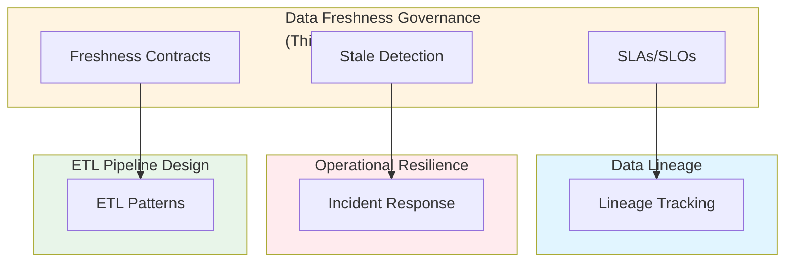

# Data Freshness, SLA/SLO Governance, and Pipeline Reliability Contracts: Best Practices

**Objective**: Establish comprehensive data freshness governance with SLA/SLO frameworks for ETL pipelines, real-time streaming, geospatial processing, and data serving layers. When you need to ensure data freshness, when you want to define reliability contracts, when you need pipeline SLOs—this guide provides the complete framework.

## Introduction

Data freshness is critical for operational systems—stale data leads to incorrect decisions, poor user experience, and operational failures. This guide establishes patterns for defining, measuring, and enforcing data freshness SLAs/SLOs across all data pipelines and serving layers.

**What This Guide Covers**:
- Defining freshness SLAs/SLOs for ETL pipelines, Airflow/Prefect orchestrations, GeoParquet pipelines, real-time streaming, and tiling pipelines
- Detecting stale data at ingestion, transformation, and serving layers
- Combining SLO policies with observability
- Designing escalations and on-call rules for data SLA failures
- Drift detection for geospatial datasets
- "Freshness contracts" for internal APIs and FDW sources
- Golden Path examples in Python and SQL
- Fitness functions for freshness and correctness

**Prerequisites**:
- Understanding of data pipelines and ETL workflows
- Familiarity with SLAs, SLOs, and reliability engineering
- Experience with observability and monitoring

**Related Documents**:
This document integrates with:
- **[Cross-System Data Lineage, Inter-Service Metadata Contracts & Provenance Enforcement](data-lineage-contracts.md)** - Lineage for freshness tracking
- **[Operational Resilience and Incident Response](../operations-monitoring/operational-resilience-and-incident-response.md)** - Incident response for SLA failures
- **[ETL Pipeline Design](../database-data/etl-pipeline-design.md)** - ETL pipeline patterns
- **[Cost-Aware Architecture & Resource-Efficiency Governance](../architecture-design/cost-aware-architecture-and-efficiency-governance.md)** - Cost-aware freshness policies

## The Philosophy of Data Freshness Governance

### Freshness Principles

**Principle 1: Define Clear SLAs**
- Establish freshness requirements
- Define acceptable staleness windows
- Set clear expectations

**Principle 2: Measure Continuously**
- Monitor freshness metrics
- Track SLA compliance
- Alert on violations

**Principle 3: Enforce Automatically**
- Automated freshness checks
- Automatic remediation
- Escalation workflows

## Freshness SLA/SLO Definition

### ETL Pipeline Freshness

**SLA Definition**:
```yaml
# ETL pipeline freshness SLA
freshness_sla:
  pipeline: "user-ingestion"
  sla:
    target_freshness: "1 hour"
    acceptable_staleness: "2 hours"
    critical_staleness: "4 hours"
  monitoring:
    check_interval: "5 minutes"
    alert_threshold: "acceptable_staleness"
```

**Implementation**:
```python
# ETL freshness monitoring
class ETLFreshnessMonitor:
    def check_freshness(self, pipeline: str) -> FreshnessStatus:
        """Check ETL pipeline freshness"""
        # Get last successful run
        last_run = self.get_last_successful_run(pipeline)
        
        # Calculate staleness
        staleness = datetime.now() - last_run.timestamp
        
        # Check SLA
        if staleness > self.sla.critical_staleness:
            status = FreshnessStatus.CRITICAL
        elif staleness > self.sla.acceptable_staleness:
            status = FreshnessStatus.WARNING
        else:
            status = FreshnessStatus.HEALTHY
        
        return FreshnessStatus(
            status=status,
            staleness=staleness,
            last_run=last_run
        )
```

### Airflow/Prefect Freshness

**Airflow Freshness**:
```python
# Airflow freshness check
from airflow import DAG
from airflow.operators.python import PythonOperator

def check_freshness(**context):
    """Check data freshness"""
    dag = context['dag']
    last_run = dag.get_last_dagrun()
    
    staleness = datetime.now() - last_run.execution_date
    
    if staleness > timedelta(hours=2):
        raise ValueError(f"Data stale: {staleness}")

dag = DAG('freshness_check')
check_task = PythonOperator(
    task_id='check_freshness',
    python_callable=check_freshness,
    dag=dag
)
```

**Prefect Freshness**:
```python
# Prefect freshness check
from prefect import flow, task
from prefect.tasks import task_input_hash

@task(cache_key_fn=task_input_hash)
def check_freshness(data_source: str):
    """Check data freshness"""
    last_update = get_last_update(data_source)
    staleness = datetime.now() - last_update
    
    if staleness > timedelta(hours=1):
        raise ValueError(f"Data stale: {staleness}")
    
    return staleness

@flow
def data_pipeline():
    freshness = check_freshness("s3://data/latest.parquet")
    # Process data...
```

### GeoParquet Pipeline Freshness

**GeoParquet Freshness**:
```python
# GeoParquet freshness monitoring
class GeoParquetFreshnessMonitor:
    def check_freshness(self, dataset: str) -> FreshnessStatus:
        """Check GeoParquet dataset freshness"""
        # Get dataset metadata
        metadata = self.get_dataset_metadata(dataset)
        
        # Check last update time
        last_update = metadata.get('last_updated')
        staleness = datetime.now() - last_update
        
        # Check spatial coverage
        coverage = metadata.get('spatial_coverage')
        expected_coverage = self.get_expected_coverage(dataset)
        
        if coverage != expected_coverage:
            status = FreshnessStatus.SPATIAL_DRIFT
        elif staleness > self.sla.acceptable_staleness:
            status = FreshnessStatus.STALE
        else:
            status = FreshnessStatus.FRESH
        
        return FreshnessStatus(
            status=status,
            staleness=staleness,
            coverage=coverage
        )
```

### Real-Time Streaming Freshness

**Kafka → Timescale → FDW Freshness**:
```python
# Real-time streaming freshness
class StreamingFreshnessMonitor:
    def check_freshness(self, stream: str) -> FreshnessStatus:
        """Check streaming data freshness"""
        # Get latest message timestamp
        latest_message = self.get_latest_message(stream)
        
        # Calculate lag
        lag = datetime.now() - latest_message.timestamp
        
        # Check consumer lag
        consumer_lag = self.get_consumer_lag(stream)
        
        if lag > timedelta(seconds=30) or consumer_lag > 1000:
            status = FreshnessStatus.STALE
        else:
            status = FreshnessStatus.FRESH
        
        return FreshnessStatus(
            status=status,
            lag=lag,
            consumer_lag=consumer_lag
        )
```

### Tiling Pipeline Freshness

**Tiling Freshness**:
```python
# Tiling pipeline freshness
class TilingFreshnessMonitor:
    def check_freshness(self, tile_set: str, zoom_level: int) -> FreshnessStatus:
        """Check tile freshness"""
        # Get tile metadata
        tile_metadata = self.get_tile_metadata(tile_set, zoom_level)
        
        # Check last update
        last_update = tile_metadata.get('last_updated')
        staleness = datetime.now() - last_update
        
        # Check coverage
        coverage = tile_metadata.get('coverage')
        expected_coverage = self.get_expected_coverage(tile_set, zoom_level)
        
        if coverage < expected_coverage * 0.95:
            status = FreshnessStatus.INCOMPLETE
        elif staleness > self.sla.acceptable_staleness:
            status = FreshnessStatus.STALE
        else:
            status = FreshnessStatus.FRESH
        
        return FreshnessStatus(
            status=status,
            staleness=staleness,
            coverage=coverage
        )
```

## Stale Data Detection

### Ingestion Layer Detection

**Pattern**: Detect stale data at ingestion.

**Example**:
```python
# Ingestion layer stale detection
class IngestionStaleDetector:
    def detect_stale(self, data: Data) -> bool:
        """Detect stale data at ingestion"""
        # Check data timestamp
        data_timestamp = data.get_timestamp()
        staleness = datetime.now() - data_timestamp
        
        if staleness > self.max_acceptable_staleness:
            return True
        
        return False
```

### Transformation Layer Detection

**Pattern**: Detect stale data during transformation.

**Example**:
```python
# Transformation layer stale detection
class TransformationStaleDetector:
    def detect_stale(self, transformed_data: Data) -> bool:
        """Detect stale data during transformation"""
        # Check source freshness
        source_freshness = self.check_source_freshness(transformed_data.source)
        
        if source_freshness.status != FreshnessStatus.FRESH:
            return True
        
        # Check transformation timestamp
        transform_timestamp = transformed_data.get_transform_timestamp()
        staleness = datetime.now() - transform_timestamp
        
        if staleness > self.max_transform_staleness:
            return True
        
        return False
```

### Serving Layer Detection

**Pattern**: Detect stale data at serving layer.

**Example**:
```sql
-- Serving layer stale detection
CREATE FUNCTION check_data_freshness(
    table_name TEXT,
    max_staleness INTERVAL
) RETURNS BOOLEAN AS $$
DECLARE
    last_update TIMESTAMPTZ;
    staleness INTERVAL;
BEGIN
    -- Get last update time
    SELECT MAX(updated_at) INTO last_update
    FROM table_name;
    
    -- Calculate staleness
    staleness := NOW() - last_update;
    
    -- Check against threshold
    IF staleness > max_staleness THEN
        RETURN FALSE;
    END IF;
    
    RETURN TRUE;
END;
$$ LANGUAGE plpgsql;
```

## SLO Policy Integration

### Observability Integration

**Pattern**: Integrate freshness SLOs with observability.

**Example**:
```yaml
# Freshness SLO policy
freshness_slo:
  service: "user-api"
  slo:
    target: "99.9%"
    window: "30 days"
    freshness_requirement: "1 hour"
  monitoring:
    metrics:
      - "data_freshness_ratio"
      - "staleness_duration"
    alerts:
      - name: "freshness_violation"
        condition: "freshness_ratio < 0.999"
        severity: "critical"
```

See: **[Unified Observability Architecture](../operations-monitoring/unified-observability-architecture.md)**

## Escalation and On-Call Rules

### Escalation Workflow

**Pattern**: Escalate on SLA failures.

**Example**:
```yaml
# Escalation workflow
escalation:
  levels:
    - level: 1
      delay: "5 minutes"
      notify: ["on-call-engineer"]
    - level: 2
      delay: "15 minutes"
      notify: ["team-lead", "on-call-engineer"]
    - level: 3
      delay: "30 minutes"
      notify: ["engineering-manager", "team-lead"]
  triggers:
    - condition: "freshness_violation > 1 hour"
      escalate_to: 2
    - condition: "freshness_violation > 4 hours"
      escalate_to: 3
```

## Geospatial Dataset Drift Detection

### Spatial Drift Detection

**Pattern**: Detect spatial coverage drift.

**Example**:
```python
# Spatial drift detection
class SpatialDriftDetector:
    def detect_drift(self, dataset: GeospatialDataset) -> DriftReport:
        """Detect spatial coverage drift"""
        # Get expected coverage
        expected = self.get_expected_coverage(dataset)
        
        # Get actual coverage
        actual = self.get_actual_coverage(dataset)
        
        # Calculate drift
        drift = self.calculate_spatial_drift(expected, actual)
        
        if drift > self.drift_threshold:
            return DriftReport(
                status=DriftStatus.DRIFT_DETECTED,
                drift_score=drift,
                expected=expected,
                actual=actual
            )
        
        return DriftReport(
            status=DriftStatus.NO_DRIFT,
            drift_score=drift
        )
```

## Freshness Contracts

### API Freshness Contracts

**Pattern**: Define freshness contracts for APIs.

**Example**:
```python
# API freshness contract
class APIFreshnessContract:
    def __init__(self):
        self.contracts = {
            'user-api': {
                'max_staleness': timedelta(minutes=5),
                'refresh_interval': timedelta(minutes=1)
            },
            'order-api': {
                'max_staleness': timedelta(minutes=15),
                'refresh_interval': timedelta(minutes=5)
            }
        }
    
    def validate(self, api: str, data: dict) -> bool:
        """Validate API freshness contract"""
        contract = self.contracts.get(api)
        if not contract:
            return True
        
        data_timestamp = data.get('timestamp')
        staleness = datetime.now() - data_timestamp
        
        return staleness <= contract['max_staleness']
```

### FDW Freshness Contracts

**Pattern**: Define freshness contracts for FDWs.

**Example**:
```sql
-- FDW freshness contract
CREATE FUNCTION validate_fdw_freshness(
    fdw_name TEXT,
    max_staleness INTERVAL
) RETURNS BOOLEAN AS $$
DECLARE
    last_sync TIMESTAMPTZ;
    staleness INTERVAL;
BEGIN
    -- Get last sync time
    SELECT last_sync_time INTO last_sync
    FROM fdw_sync_status
    WHERE fdw_name = validate_fdw_freshness.fdw_name;
    
    -- Calculate staleness
    staleness := NOW() - last_sync;
    
    -- Validate contract
    IF staleness > max_staleness THEN
        RETURN FALSE;
    END IF;
    
    RETURN TRUE;
END;
$$ LANGUAGE plpgsql;
```

## Golden Path Examples

### Python Golden Path

**Example**:
```python
# Golden path: Freshness monitoring
from datetime import datetime, timedelta

class FreshnessMonitor:
    def __init__(self, max_staleness: timedelta):
        self.max_staleness = max_staleness
    
    def check_freshness(self, data_source: str) -> bool:
        """Check data freshness - golden path"""
        # Get last update
        last_update = self.get_last_update(data_source)
        
        # Calculate staleness
        staleness = datetime.now() - last_update
        
        # Check against threshold
        if staleness > self.max_staleness:
            # Alert and escalate
            self.alert_freshness_violation(data_source, staleness)
            return False
        
        return True
```

### SQL Golden Path

**Example**:
```sql
-- Golden path: Freshness check
CREATE OR REPLACE FUNCTION check_table_freshness(
    schema_name TEXT,
    table_name TEXT,
    max_staleness INTERVAL
) RETURNS TABLE (
    is_fresh BOOLEAN,
    staleness INTERVAL,
    last_update TIMESTAMPTZ
) AS $$
BEGIN
    RETURN QUERY
    SELECT
        (NOW() - MAX(updated_at)) <= max_staleness AS is_fresh,
        NOW() - MAX(updated_at) AS staleness,
        MAX(updated_at) AS last_update
    FROM information_schema.tables t
    JOIN pg_class c ON c.relname = t.table_name
    WHERE t.table_schema = schema_name
      AND t.table_name = check_table_freshness.table_name;
END;
$$ LANGUAGE plpgsql;
```

## Architecture Fitness Functions

### Freshness Fitness Function

**Definition**:
```python
# Freshness fitness function
class FreshnessFitnessFunction:
    def evaluate(self, pipeline: Pipeline) -> float:
        """Evaluate freshness fitness"""
        # Calculate freshness ratio
        freshness_ratio = self.calculate_freshness_ratio(pipeline)
        
        # Calculate SLA compliance
        sla_compliance = self.calculate_sla_compliance(pipeline)
        
        # Calculate fitness score
        fitness = (freshness_ratio * 0.5) + (sla_compliance * 0.5)
        
        return fitness
```

### Correctness Fitness Function

**Definition**:
```python
# Correctness fitness function
class CorrectnessFitnessFunction:
    def evaluate(self, data: Data) -> float:
        """Evaluate data correctness"""
        # Check schema compliance
        schema_compliance = self.check_schema_compliance(data)
        
        # Check value constraints
        constraint_compliance = self.check_constraints(data)
        
        # Check completeness
        completeness = self.check_completeness(data)
        
        # Calculate fitness
        fitness = (schema_compliance * 0.4) + \
                  (constraint_compliance * 0.3) + \
                  (completeness * 0.3)
        
        return fitness
```

## Cross-Document Architecture



## Checklists

### Freshness Governance Checklist

- [ ] Freshness SLAs defined
- [ ] Stale data detection enabled
- [ ] Observability integration configured
- [ ] Escalation workflows defined
- [ ] On-call rules established
- [ ] Geospatial drift detection active
- [ ] Freshness contracts implemented
- [ ] Fitness functions defined
- [ ] Regular reviews scheduled

## Anti-Patterns

### Freshness Anti-Patterns

**No SLA Definition**:
```yaml
# Bad: No SLA
pipeline:
  name: "user-ingestion"
  # No freshness requirements

# Good: SLA defined
pipeline:
  name: "user-ingestion"
  freshness_sla:
    target: "1 hour"
    acceptable: "2 hours"
```

**No Monitoring**:
```python
# Bad: No monitoring
def process_data(data):
    # No freshness check
    return process(data)

# Good: Monitoring enabled
def process_data(data):
    if not check_freshness(data):
        raise ValueError("Data stale")
    return process(data)
```

## See Also

- **[Cross-System Data Lineage, Inter-Service Metadata Contracts & Provenance Enforcement](data-lineage-contracts.md)** - Lineage for freshness tracking
- **[Operational Resilience and Incident Response](../operations-monitoring/operational-resilience-and-incident-response.md)** - Incident response for SLA failures
- **[ETL Pipeline Design](../database-data/etl-pipeline-design.md)** - ETL pipeline patterns
- **[Cost-Aware Architecture & Resource-Efficiency Governance](../architecture-design/cost-aware-architecture-and-efficiency-governance.md)** - Cost-aware freshness policies

---

*This guide establishes comprehensive data freshness governance patterns. Start with SLA definition, extend to monitoring, and continuously enforce freshness contracts.*

