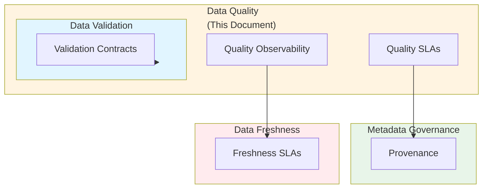

# Data Quality SLAs, Validation Layers, and Observability for Tabular, Geospatial, and ML Data: Best Practices

**Objective**: Establish comprehensive data quality governance with SLAs, multi-layer validation, and observability for tabular, geospatial, and ML data. When you need data quality assurance, when you want quality SLAs, when you need validation observability—this guide provides the complete framework.

## Introduction

Data quality is the foundation of trustworthy analytics and ML systems. Without quality governance, data degrades, models drift, and decisions become unreliable. This guide establishes patterns for data quality SLAs, multi-layer validation, and quality observability across all data types and systems.

**What This Guide Covers**:
- Multi-layer validation (schema, statistical, geospatial, semantic)
- Row-level, tile-level, and raster-level DQ expectations
- ML feature drift detection
- Tools: Great Expectations, Soda, Deequ, custom PostGIS assertions
- Quality SLAs for Parquet lakes, FDW sources, feature stores, raster/tiling pipelines
- Quality monitors feeding into Grafana/Loki
- Fitness functions for DQ stability

**Prerequisites**:
- Understanding of data quality principles
- Familiarity with validation frameworks and tools
- Experience with data observability and monitoring

**Related Documents**:
This document integrates with:
- **[Data Validation and Contract Governance](data-validation-and-contract-governance.md)** - Validation patterns
- **[Metadata Standards, Schema Governance & Data Provenance Contracts](metadata-provenance-contracts.md)** - Metadata governance
- **[Data Freshness, SLA/SLO Governance, and Pipeline Reliability Contracts](data-freshness-sla-governance.md)** - Freshness SLAs
- **[ML Systems Architecture: Feature Stores, Model Serving, Experiment Governance, and Cross-System Reproducibility](../ml-ai/ml-systems-architecture-governance.md)** - ML quality

## The Philosophy of Data Quality

### Quality Principles

**Principle 1: Multi-Layer Validation**
- Schema validation
- Statistical validation
- Geospatial validation
- Semantic validation

**Principle 2: Quality SLAs**
- Define quality expectations
- Measure quality continuously
- Enforce quality gates

**Principle 3: Observability First**
- Instrument all validation
- Monitor quality metrics
- Alert on quality violations

## Multi-Layer Validation

### Schema Validation

**Pattern**:
```python
# Schema validation
from pydantic import BaseModel, validator

class UserSchema(BaseModel):
    id: int
    email: str
    age: int
    
    @validator('email')
    def validate_email(cls, v):
        if '@' not in v:
            raise ValueError('Invalid email')
        return v
    
    @validator('age')
    def validate_age(cls, v):
        if v < 0 or v > 150:
            raise ValueError('Invalid age')
        return v
```

### Statistical Validation

**Pattern**:
```python
# Statistical validation
import pandas as pd
from scipy import stats

class StatisticalValidator:
    def validate(self, data: pd.DataFrame) -> ValidationResult:
        """Validate statistical properties"""
        results = []
        
        # Check for outliers
        for column in data.columns:
            z_scores = stats.zscore(data[column])
            outliers = (abs(z_scores) > 3).sum()
            
            if outliers > len(data) * 0.05:  # >5% outliers
                results.append(ValidationIssue(
                    column=column,
                    issue="excessive_outliers",
                    severity="warning"
                ))
        
        return ValidationResult(issues=results)
```

### Geospatial Validation

**Pattern**:
```sql
-- Geospatial validation
CREATE FUNCTION validate_geometry(
    geom GEOMETRY
) RETURNS BOOLEAN AS $$
BEGIN
    -- Check validity
    IF NOT ST_IsValid(geom) THEN
        RETURN FALSE;
    END IF;
    
    -- Check SRID
    IF ST_SRID(geom) != 4326 THEN
        RETURN FALSE;
    END IF;
    
    -- Check bounds
    IF NOT ST_Within(geom, ST_MakeEnvelope(-180, -90, 180, 90, 4326)) THEN
        RETURN FALSE;
    END IF;
    
    RETURN TRUE;
END;
$$ LANGUAGE plpgsql;
```

### Semantic Validation

**Pattern**:
```python
# Semantic validation
class SemanticValidator:
    def validate(self, data: pd.DataFrame) -> ValidationResult:
        """Validate semantic properties"""
        results = []
        
        # Check business rules
        if 'order_date' in data.columns and 'ship_date' in data.columns:
            invalid = data[data['ship_date'] < data['order_date']]
            if len(invalid) > 0:
                results.append(ValidationIssue(
                    issue="ship_date_before_order_date",
                    severity="error",
                    count=len(invalid)
                ))
        
        return ValidationResult(issues=results)
```

## Row-Level DQ Expectations

### Great Expectations

**Pattern**:
```python
# Great Expectations validation
import great_expectations as ge

context = ge.get_context()

# Define expectations
expectation_suite = context.create_expectation_suite("my_suite")

# Add expectations
validator = context.get_validator(
    batch_request={
        "datasource_name": "my_datasource",
        "data_connector_name": "default_inferred_data_connector_name",
        "data_asset_name": "my_table"
    },
    expectation_suite_name="my_suite"
)

validator.expect_column_values_to_not_be_null("id")
validator.expect_column_values_to_be_unique("id")
validator.expect_column_values_to_be_between("age", min_value=0, max_value=150)
```

### Soda Validation

**Pattern**:
```yaml
# Soda validation
checks for users:
  - row_count > 0
  - missing_count(id) = 0
  - invalid_count(email) = 0:
      valid format: email
  - duplicate_count(id) = 0
  - freshness(order_date) < 1d
```

## Tile-Level DQ Expectations

### Tile Quality Validation

**Pattern**:
```python
# Tile quality validation
class TileQualityValidator:
    def validate_tile(self, tile: Tile) -> QualityReport:
        """Validate tile quality"""
        issues = []
        
        # Check tile completeness
        if tile.coverage < 0.95:
            issues.append(QualityIssue(
                type="incomplete_coverage",
                severity="warning"
            ))
        
        # Check tile format
        if not tile.is_valid_format():
            issues.append(QualityIssue(
                type="invalid_format",
                severity="error"
            ))
        
        # Check tile bounds
        if not tile.is_valid_bounds():
            issues.append(QualityIssue(
                type="invalid_bounds",
                severity="error"
            ))
        
        return QualityReport(issues=issues)
```

## Raster-Level DQ Expectations

### Raster Quality Validation

**Pattern**:
```python
# Raster quality validation
import rasterio

class RasterQualityValidator:
    def validate_raster(self, raster_path: str) -> QualityReport:
        """Validate raster quality"""
        issues = []
        
        with rasterio.open(raster_path) as src:
            # Check CRS
            if src.crs is None:
                issues.append(QualityIssue(
                    type="missing_crs",
                    severity="error"
                ))
            
            # Check data type
            if src.dtypes[0] not in ['uint8', 'uint16', 'float32']:
                issues.append(QualityIssue(
                    type="invalid_data_type",
                    severity="warning"
                ))
            
            # Check no-data values
            if src.nodata is None:
                issues.append(QualityIssue(
                    type="missing_nodata",
                    severity="warning"
                ))
        
        return QualityReport(issues=issues)
```

## ML Feature Drift Detection

### Feature Drift Detection

**Pattern**:
```python
# ML feature drift detection
from evidently import ColumnMapping
from evidently.metric_preset import DataDriftPreset
from evidently.report import Report

class FeatureDriftDetector:
    def detect_drift(self, reference: pd.DataFrame, current: pd.DataFrame) -> DriftReport:
        """Detect feature drift"""
        # Define column mapping
        column_mapping = ColumnMapping(
            target=None,
            numerical_features=['age', 'income'],
            categorical_features=['category']
        )
        
        # Generate drift report
        report = Report(metrics=[DataDriftPreset()])
        report.run(
            reference_data=reference,
            current_data=current,
            column_mapping=column_mapping
        )
        
        # Extract drift metrics
        drift_metrics = report.as_dict()['metrics']
        
        return DriftReport(metrics=drift_metrics)
```

## Quality SLAs

### Parquet Lake Quality SLA

**SLA Definition**:
```yaml
# Parquet lake quality SLA
parquet_lake_quality:
  sla:
    completeness: "> 0.95"
    validity: "> 0.99"
    freshness: "< 1 hour"
  monitoring:
    check_interval: "5 minutes"
    alert_threshold: "sla_violation"
```

### FDW Source Quality SLA

**SLA Definition**:
```yaml
# FDW source quality SLA
fdw_source_quality:
  sla:
    availability: "> 0.99"
    latency: "< 100ms"
    data_quality: "> 0.95"
  monitoring:
    check_interval: "1 minute"
    alert_threshold: "sla_violation"
```

### Feature Store Quality SLA

**SLA Definition**:
```yaml
# Feature store quality SLA
feature_store_quality:
  sla:
    feature_completeness: "> 0.98"
    feature_freshness: "< 5 minutes"
    feature_drift: "< 0.05"
  monitoring:
    check_interval: "1 minute"
    alert_threshold: "sla_violation"
```

### Raster/Tiling Pipeline Quality SLA

**SLA Definition**:
```yaml
# Raster/tiling pipeline quality SLA
raster_tiling_quality:
  sla:
    tile_completeness: "> 0.99"
    tile_validity: "> 0.99"
    raster_validity: "> 0.99"
  monitoring:
    check_interval: "5 minutes"
    alert_threshold: "sla_violation"
```

## Quality Observability

### Grafana Quality Dashboard

**PromQL Queries**:
```promql
# Data quality metrics
data_quality_score{dataset="users"} > 0.95
data_completeness{dataset="users"} > 0.98
data_validity{dataset="users"} > 0.99

# Quality SLA compliance
data_quality_sla_compliance{dataset="users"} < 1.0
```

### Loki Quality Logs

**Log Queries**:
```logql
# Quality violation logs
{job="data-quality"} |= "quality_violation"
{job="data-quality"} | json | quality_score < 0.95
```

## Architecture Fitness Functions

### DQ Stability Fitness Function

**Definition**:
```python
# DQ stability fitness function
class DQStabilityFitnessFunction:
    def evaluate(self, system: System) -> float:
        """Evaluate DQ stability"""
        # Calculate quality variance
        quality_scores = self.get_quality_scores(system)
        quality_variance = np.var(quality_scores)
        
        # Calculate stability (lower variance = higher stability)
        if quality_variance == 0:
            stability = 1.0
        else:
            stability = 1.0 / (1.0 + quality_variance)
        
        return stability
```

## Cross-Document Architecture



## Checklists

### Data Quality Checklist

- [ ] Multi-layer validation implemented
- [ ] Row-level DQ expectations defined
- [ ] Tile-level DQ expectations defined
- [ ] Raster-level DQ expectations defined
- [ ] ML feature drift detection active
- [ ] Quality SLAs defined
- [ ] Quality monitors configured
- [ ] Grafana dashboards created
- [ ] Loki log queries defined
- [ ] Fitness functions implemented
- [ ] Regular quality reviews scheduled

## Anti-Patterns

### Quality Anti-Patterns

**No Quality Validation**:
```python
# Bad: No validation
def process_data(data):
    return process(data)  # No quality checks

# Good: Validation
def process_data(data):
    validator = DataQualityValidator()
    if not validator.validate(data):
        raise ValueError("Data quality violation")
    return process(data)
```

## See Also

- **[Data Validation and Contract Governance](data-validation-and-contract-governance.md)** - Validation patterns
- **[Metadata Standards, Schema Governance & Data Provenance Contracts](metadata-provenance-contracts.md)** - Metadata governance
- **[Data Freshness, SLA/SLO Governance, and Pipeline Reliability Contracts](data-freshness-sla-governance.md)** - Freshness SLAs
- **[ML Systems Architecture: Feature Stores, Model Serving, Experiment Governance, and Cross-System Reproducibility](../ml-ai/ml-systems-architecture-governance.md)** - ML quality

---

*This guide establishes comprehensive data quality patterns. Start with multi-layer validation, extend to quality SLAs, and continuously monitor quality observability.*

