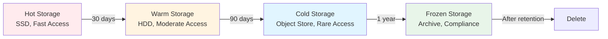
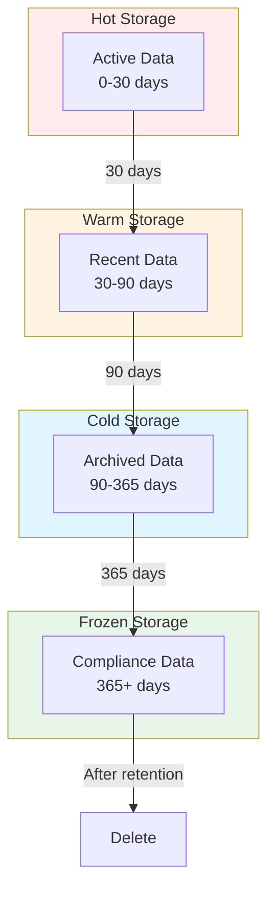
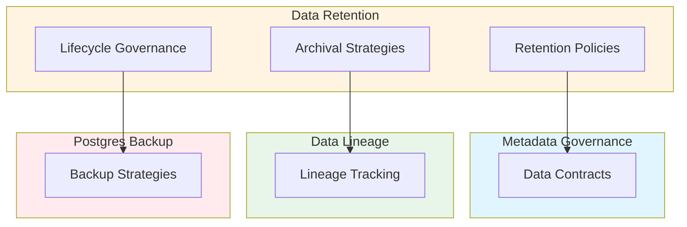

# Data Retention, Archival Strategy, Lifecycle Governance & Cold Storage Patterns: Best Practices

**Objective**: Establish comprehensive data retention and archival strategies that govern data lifecycle from hot to frozen storage, ensuring compliance, cost optimization, and operational efficiency. When you need retention policies, when you want archival strategies, when you need lifecycle governance—this guide provides the complete framework.

## Introduction

Data retention and archival are fundamental to sustainable data systems. Without proper lifecycle governance, systems accumulate unbounded data, costs spiral, and compliance risks increase. This guide establishes patterns for retention policies, archival strategies, and cold storage patterns across all data systems.

**What This Guide Covers**:
- Retention requirements and policy frameworks
- Hot → warm → cold → frozen storage transitions
- Partition lifecycle policies
- Archiving Parquet, Postgres partitions, and lakehouse objects
- Managing massive geospatial datasets (raster, tiles, vector, Parquet)
- Lifecycle policies for regulatory, operational, and cost constraints
- Backpressure prevention on pipelines
- TTL patterns, vacuum strategies, archival triggers
- Cold-storage access patterns
- Air-gapped retention strategies

**Prerequisites**:
- Understanding of data lifecycle and storage tiers
- Familiarity with data retention regulations
- Experience with archival and cold storage systems

**Related Documents**:
This document integrates with:
- **[Metadata Standards, Schema Governance & Data Provenance Contracts](metadata-provenance-contracts.md)** - Metadata for retention policies
- **[Cross-System Data Lineage, Inter-Service Metadata Contracts & Provenance Enforcement](data-lineage-contracts.md)** - Lineage for retention tracking
- **[PostgreSQL Backup & Recovery](../postgres/postgres-backup-recovery.md)** - Database retention patterns
- **[Apache Iceberg Mastery](../database-data/apache-iceberg-mastery.md)** - Table format retention
- **[Data Freshness, SLA/SLO Governance, and Pipeline Reliability Contracts](data-freshness-sla-governance.md)** - Freshness vs retention balance

## The Philosophy of Data Retention

### Retention Principles

**Principle 1: Policy-Driven**
- Define retention requirements
- Enforce policies automatically
- Audit compliance

**Principle 2: Cost-Optimized**
- Move to cheaper storage tiers
- Archive inactive data
- Delete obsolete data

**Principle 3: Compliance-First**
- Meet regulatory requirements
- Maintain audit trails
- Preserve evidence

## Retention Policy Framework

### Policy Definition

**Policy Structure**:
```yaml
# Retention policy framework
retention_policy:
  name: "user-data-retention"
  scope: "user_accounts"
  rules:
    - condition: "active"
      retention: "indefinite"
      storage_tier: "hot"
    - condition: "inactive < 90 days"
      retention: "90 days"
      storage_tier: "warm"
    - condition: "inactive >= 90 days"
      retention: "365 days"
      storage_tier: "cold"
    - condition: "deleted"
      retention: "30 days"
      storage_tier: "cold"
      then: "delete"
  compliance:
    regulations: ["gdpr", "ccpa"]
    audit_required: true
```

### Regulatory Retention

**GDPR Compliance**:
```yaml
# GDPR retention policy
gdpr_retention:
  personal_data:
    retention: "as_long_as_necessary"
    max_retention: "7 years"
    deletion_required: true
    right_to_erasure: true
  consent_records:
    retention: "indefinite"
    storage_tier: "cold"
```

## Storage Tier Transitions

### Hot → Warm → Cold → Frozen

**Transition Model**:


**Transition Configuration**:
```yaml
# Storage tier transitions
storage_tiers:
  hot:
    type: "ssd"
    cost_per_gb_month: 0.10
    access_latency: "< 10ms"
    transition_after: "30 days"
  
  warm:
    type: "hdd"
    cost_per_gb_month: 0.05
    access_latency: "< 100ms"
    transition_after: "90 days"
  
  cold:
    type: "object-store-standard"
    cost_per_gb_month: 0.02
    access_latency: "< 1s"
    transition_after: "365 days"
  
  frozen:
    type: "object-store-archive"
    cost_per_gb_month: 0.004
    access_latency: "< 5 minutes"
    transition_after: "7 years"
```

## Partition Lifecycle Policies

### Postgres Partition Lifecycle

**Partition Retention**:
```sql
-- Postgres partition lifecycle
CREATE FUNCTION manage_partition_lifecycle(
    table_name TEXT,
    retention_days INTEGER
) RETURNS void AS $$
DECLARE
    partition_name TEXT;
    partition_date DATE;
BEGIN
    -- Get old partitions
    FOR partition_name, partition_date IN
        SELECT 
            schemaname || '.' || tablename,
            (regexp_match(tablename, '\d{4}-\d{2}-\d{2}'))[1]::DATE
        FROM pg_tables
        WHERE tablename LIKE table_name || '_%'
          AND (regexp_match(tablename, '\d{4}-\d{2}-\d{2}'))[1]::DATE < 
              CURRENT_DATE - (retention_days || ' days')::INTERVAL
    LOOP
        -- Archive partition
        PERFORM archive_partition(partition_name);
        
        -- Drop partition
        EXECUTE format('DROP TABLE %s', partition_name);
    END LOOP;
END;
$$ LANGUAGE plpgsql;
```

### Parquet Partition Lifecycle

**Parquet Lifecycle**:
```python
# Parquet partition lifecycle
class ParquetPartitionLifecycle:
    def manage_lifecycle(self, dataset: str, retention_days: int):
        """Manage Parquet partition lifecycle"""
        # Get partitions
        partitions = self.list_partitions(dataset)
        
        for partition in partitions:
            # Check age
            age_days = (datetime.now() - partition.date).days
            
            if age_days > retention_days:
                # Archive to cold storage
                self.archive_to_cold_storage(partition)
                
                # Delete from hot storage
                self.delete_from_hot_storage(partition)
```

## Archiving Strategies

### Parquet Archival

**Archival Pattern**:
```python
# Parquet archival
class ParquetArchival:
    def archive(self, parquet_file: str, destination: str):
        """Archive Parquet file to cold storage"""
        # Read metadata
        metadata = self.read_metadata(parquet_file)
        
        # Compress if needed
        if not self.is_compressed(parquet_file):
            compressed = self.compress(parquet_file)
        else:
            compressed = parquet_file
        
        # Upload to cold storage
        self.upload_to_cold_storage(compressed, destination)
        
        # Update metadata
        self.update_metadata(parquet_file, {
            'archived': True,
            'archived_at': datetime.now(),
            'archived_location': destination
        })
```

### Postgres Partition Archival

**Postgres Archival**:
```sql
-- Postgres partition archival
CREATE FUNCTION archive_partition(
    partition_name TEXT
) RETURNS void AS $$
DECLARE
    archive_path TEXT;
BEGIN
    -- Export partition to Parquet
    archive_path := '/archive/' || partition_name || '.parquet';
    
    -- Export data
    COPY (
        SELECT * FROM partition_name
    ) TO PROGRAM 'python export_to_parquet.py ' || archive_path;
    
    -- Upload to cold storage
    PERFORM upload_to_cold_storage(archive_path);
    
    -- Drop partition
    EXECUTE format('DROP TABLE %s', partition_name);
END;
$$ LANGUAGE plpgsql;
```

### Lakehouse Object Archival

**Lakehouse Archival**:
```python
# Lakehouse object archival
class LakehouseArchival:
    def archive(self, object_path: str, retention_days: int):
        """Archive lakehouse object"""
        # Check age
        age_days = self.get_object_age(object_path)
        
        if age_days > retention_days:
            # Move to cold storage
            cold_path = self.move_to_cold_storage(object_path)
            
            # Update metadata
            self.update_metadata(object_path, {
                'archived': True,
                'cold_storage_path': cold_path
            })
```

## Geospatial Dataset Lifecycle

### Raster Lifecycle

**Raster Retention**:
```yaml
# Raster lifecycle policy
raster_lifecycle:
  raw_rasters:
    retention: "90 days"
    storage_tier: "hot"
    then: "warm"
  
  processed_rasters:
    retention: "365 days"
    storage_tier: "warm"
    then: "cold"
  
  aggregated_rasters:
    retention: "indefinite"
    storage_tier: "cold"
```

### Tile Lifecycle

**Tile Retention**:
```yaml
# Tile lifecycle policy
tile_lifecycle:
  high_zoom_tiles:
    zoom_levels: [13, 14, 15, 16]
    retention: "30 days"
    storage_tier: "hot"
    then: "warm"
  
  medium_zoom_tiles:
    zoom_levels: [10, 11, 12]
    retention: "90 days"
    storage_tier: "warm"
    then: "cold"
  
  low_zoom_tiles:
    zoom_levels: [0, 1, 2, 3, 4, 5, 6, 7, 8, 9]
    retention: "indefinite"
    storage_tier: "cold"
```

### Vector Lifecycle

**Vector Retention**:
```yaml
# Vector lifecycle policy
vector_lifecycle:
  raw_vectors:
    retention: "180 days"
    storage_tier: "hot"
    then: "warm"
  
  processed_vectors:
    retention: "365 days"
    storage_tier: "warm"
    then: "cold"
  
  indexed_vectors:
    retention: "indefinite"
    storage_tier: "cold"
```

## TTL Patterns

### TTL Configuration

**TTL Strategy**:
```yaml
# TTL patterns
ttl_patterns:
  redis:
    default_ttl: "1 hour"
    patterns:
      - key_pattern: "cache:*"
        ttl: "30 minutes"
      - key_pattern: "session:*"
        ttl: "24 hours"
      - key_pattern: "rate_limit:*"
        ttl: "1 hour"
  
  postgres:
    default_retention: "90 days"
    patterns:
      - table: "logs"
        retention: "30 days"
      - table: "metrics"
        retention: "365 days"
      - table: "audit"
        retention: "7 years"
```

## Vacuum Strategies

### Postgres Vacuum

**Vacuum Configuration**:
```sql
-- Postgres vacuum strategy
ALTER TABLE user_accounts SET (
    autovacuum_vacuum_scale_factor = 0.1,
    autovacuum_vacuum_threshold = 1000,
    autovacuum_analyze_scale_factor = 0.05,
    autovacuum_analyze_threshold = 500
);

-- Partition-specific vacuum
CREATE FUNCTION vacuum_partition(
    partition_name TEXT
) RETURNS void AS $$
BEGIN
    -- Vacuum partition
    EXECUTE format('VACUUM ANALYZE %s', partition_name);
    
    -- Check if should archive
    IF partition_age(partition_name) > retention_days THEN
        PERFORM archive_partition(partition_name);
    END IF;
END;
$$ LANGUAGE plpgsql;
```

## Archival Triggers

### Automatic Archival

**Trigger Configuration**:
```yaml
# Archival triggers
archival_triggers:
  time_based:
    - condition: "age > 90 days"
      action: "archive_to_warm"
    - condition: "age > 365 days"
      action: "archive_to_cold"
  
  size_based:
    - condition: "table_size > 100GB"
      action: "archive_old_partitions"
  
  access_based:
    - condition: "last_access > 180 days"
      action: "archive_to_cold"
```

## Cold-Storage Access Patterns

### DuckDB Cold Storage Queries

**Pattern**: Query archived Parquet with DuckDB.

**Example**:
```python
# DuckDB cold storage queries
import duckdb

def query_cold_storage(query: str, cold_storage_path: str):
    """Query cold storage with DuckDB"""
    conn = duckdb.connect()
    
    # Register cold storage
    conn.execute(f"INSTALL httpfs")
    conn.execute(f"LOAD httpfs")
    
    # Query archived Parquet
    result = conn.execute(f"""
        SELECT *
        FROM read_parquet('{cold_storage_path}/*.parquet')
        WHERE {query}
    """).fetchdf()
    
    return result
```

## Air-Gapped Retention Strategies

### Air-Gapped Archival

**Pattern**: Archive in air-gapped environments.

**Example**:
```yaml
# Air-gapped retention
air_gapped_retention:
  strategy: "local_archive"
  storage:
    type: "local_object_store"
    location: "/archive"
    encryption: true
  retention:
    hot: "30 days"
    warm: "90 days"
    cold: "365 days"
    frozen: "7 years"
  sync:
    frequency: "monthly"
    method: "secure_media"
```

## Backpressure Prevention

### Pipeline Backpressure

**Pattern**: Prevent backpressure from data growth.

**Example**:
```python
# Backpressure prevention
class PipelineBackpressurePrevention:
    def prevent_backpressure(self, pipeline: Pipeline):
        """Prevent backpressure from data growth"""
        # Check data growth rate
        growth_rate = self.calculate_growth_rate(pipeline)
        
        # Check storage capacity
        available_capacity = self.get_available_capacity()
        
        # Calculate time to capacity
        time_to_capacity = available_capacity / growth_rate
        
        # Trigger archival if needed
        if time_to_capacity < 30:  # days
            self.trigger_archival(pipeline)
```

## Lifecycle Diagrams

### Complete Lifecycle



## Cross-Document Architecture



## Checklists

### Retention Governance Checklist

- [ ] Retention policies defined
- [ ] Storage tier transitions configured
- [ ] Partition lifecycle policies active
- [ ] Archival strategies implemented
- [ ] Geospatial dataset lifecycle managed
- [ ] TTL patterns configured
- [ ] Vacuum strategies active
- [ ] Archival triggers enabled
- [ ] Cold storage access patterns documented
- [ ] Air-gapped retention configured
- [ ] Backpressure prevention active
- [ ] Compliance verified

## Anti-Patterns

### Retention Anti-Patterns

**Infinite ETL Accumulation**:
```yaml
# Bad: No retention
etl_pipeline:
  retention: "none"
  # Data accumulates forever

# Good: Retention policy
etl_pipeline:
  retention: "90 days"
  archival: "after 30 days"
  deletion: "after 90 days"
```

**WAL Bloat**:
```sql
-- Bad: No WAL management
-- WAL grows unbounded

-- Good: WAL management
ALTER SYSTEM SET max_wal_size = '4GB';
ALTER SYSTEM SET wal_compression = on;
```

**GIS Raster Hoarding**:
```yaml
# Bad: Keep all rasters
raster_storage:
  retention: "indefinite"
  # Storage costs spiral

# Good: Lifecycle policy
raster_storage:
  raw_retention: "90 days"
  processed_retention: "365 days"
  archival: "after retention"
```

## See Also

- **[Metadata Standards, Schema Governance & Data Provenance Contracts](metadata-provenance-contracts.md)** - Metadata for retention
- **[Cross-System Data Lineage, Inter-Service Metadata Contracts & Provenance Enforcement](data-lineage-contracts.md)** - Lineage tracking
- **[PostgreSQL Backup & Recovery](../postgres/postgres-backup-recovery.md)** - Database retention
- **[Apache Iceberg Mastery](../database-data/apache-iceberg-mastery.md)** - Table format retention
- **[Data Freshness, SLA/SLO Governance, and Pipeline Reliability Contracts](data-freshness-sla-governance.md)** - Freshness balance

---

*This guide establishes comprehensive data retention and archival patterns. Start with policy definition, extend to archival strategies, and continuously optimize lifecycle governance.*

