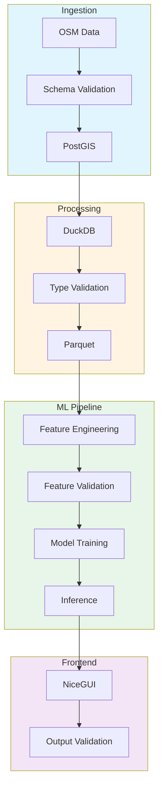

# Data Validation and Contract Governance: Best Practices for Polyglot Distributed Systems

**Objective**: Master production-grade data validation and contract governance across Postgres, DuckDB, MLflow, Parquet, ETL pipelines, and distributed systems. When you need to ensure data quality, prevent silent corruption, and maintain contract consistency—this guide provides complete patterns and implementations.

## Introduction

Data validation and contract governance are foundational to reliable distributed systems. Without proper validation, systems suffer from silent corruption, ML training failures, geospatial precision loss, and trust erosion. This guide provides a complete framework for validating data across all system layers.

**What This Guide Covers**:
- Philosophy of data quality and contract governance
- Types of data validation (schema, type, geospatial, statistical, temporal)
- Data contracts as code (JSON Schema, Protobuf, Avro, Pydantic)
- Geospatial validation patterns
- ML/AI pipeline validation
- ETL pipeline validation
- Database-level validation and enforcement
- API-level validation
- Distributed validation in Kubernetes
- Quality gates and CI/CD integration
- Data quality observability
- Anti-patterns and failure modes
- Agentic LLM integration for validation

**Prerequisites**:
- Understanding of data engineering, databases, and distributed systems
- Familiarity with Postgres, Parquet, ML pipelines, and ETL workflows
- Experience with validation frameworks and contract testing

## Philosophy of Data Quality & Contract Governance

### Silent Corruption

**Problem**: Data corruption goes undetected, propagating through systems.

**Example**: Invalid geometry in PostGIS causes downstream tile generation failures.

```python
# Silent corruption example
def process_geometry(geom_wkt: str):
    """Process geometry without validation"""
    # No validation - accepts invalid geometry
    geom = wkt.loads(geom_wkt)
    return geom.area  # May return NaN or incorrect value
```

**Solution**: Validate at ingestion boundaries.

```python
# Validation prevents silent corruption
def process_geometry(geom_wkt: str):
    """Process geometry with validation"""
    geom = wkt.loads(geom_wkt)
    
    # Validate geometry
    if not geom.is_valid:
        raise ValueError(f"Invalid geometry: {geom.wkt}")
    
    # Repair if possible
    geom = geom.buffer(0)  # Repair self-intersections
    
    return geom.area
```

### Alignment Drift

**Problem**: Schemas drift over time, causing compatibility issues.

**Example**: Parquet schema changes without versioning, breaking downstream consumers.

**Solution**: Versioned schemas with contract enforcement.

```python
# Schema versioning prevents drift
class SchemaVersion:
    def __init__(self, version: str, schema: dict):
        self.version = version
        self.schema = schema
    
    def validate(self, data: dict) -> bool:
        """Validate data against schema version"""
        import jsonschema
        try:
            jsonschema.validate(data, self.schema)
            return True
        except jsonschema.ValidationError:
            return False
```

### ML Training Failures

**Problem**: ML models trained on corrupted or misaligned data.

**Example**: Feature store contains null values where model expects floats.

**Solution**: Validate features before training.

```python
# ML feature validation
class FeatureValidator:
    def validate_features(self, features: dict, schema: dict) -> bool:
        """Validate features against schema"""
        for feature_name, feature_value in features.items():
            if feature_name not in schema:
                raise ValueError(f"Unknown feature: {feature_name}")
            
            expected_type = schema[feature_name]["type"]
            if not isinstance(feature_value, expected_type):
                raise ValueError(
                    f"Feature {feature_name} type mismatch: "
                    f"expected {expected_type}, got {type(feature_value)}"
                )
            
            # Check constraints
            if "min" in schema[feature_name]:
                if feature_value < schema[feature_name]["min"]:
                    raise ValueError(f"Feature {feature_name} below minimum")
        
        return True
```

### Geospatial Precision Loss

**Problem**: Coordinate precision lost during transformations.

**Example**: WGS84 coordinates rounded, causing boundary misalignment.

**Solution**: Maintain precision through transformations.

```python
# Geospatial precision preservation
class PrecisionPreservingTransform:
    def transform(self, geom, target_crs: str):
        """Transform geometry preserving precision"""
        # Use high-precision transformation
        transformer = pyproj.Transformer.from_crs(
            geom.crs,
            target_crs,
            always_xy=True,
            accuracy=0.001  # 1mm accuracy
        )
        
        # Transform with precision
        transformed = transform(transformer.transform, geom)
        
        return transformed
```

### ETL Cascade Failures

**Problem**: Validation failure in one stage cascades through pipeline.

**Example**: Invalid timestamp causes all downstream transformations to fail.

**Solution**: Fail fast with clear error messages.

```python
# ETL validation with fail-fast
class ETLValidator:
    def validate_stage(self, data: dict, stage: str):
        """Validate ETL stage with fail-fast"""
        try:
            self.validate_schema(data)
            self.validate_types(data)
            self.validate_constraints(data)
        except ValidationError as e:
            raise ETLValidationError(
                f"Validation failed at stage {stage}: {e}"
            ) from e
```

### Database Replication Inconsistencies

**Problem**: Replication fails due to constraint violations.

**Example**: Unique constraint violation on replica.

**Solution**: Validate before replication.

```sql
-- Validate before replication
CREATE OR REPLACE FUNCTION validate_before_replication()
RETURNS TRIGGER AS $$
BEGIN
    -- Validate constraints
    IF NOT (NEW.id IS NOT NULL AND NEW.id > 0) THEN
        RAISE EXCEPTION 'Invalid ID';
    END IF;
    
    -- Validate geometry
    IF NOT ST_IsValid(NEW.geom) THEN
        RAISE EXCEPTION 'Invalid geometry';
    END IF;
    
    RETURN NEW;
END;
$$ LANGUAGE plpgsql;

CREATE TRIGGER validate_replication
BEFORE INSERT OR UPDATE ON replicated_table
FOR EACH ROW EXECUTE FUNCTION validate_before_replication();
```

### Multi-Cluster Divergence

**Problem**: Data diverges between clusters.

**Example**: Different schemas in dev and prod.

**Solution**: Enforce schema consistency across clusters.

```python
# Multi-cluster schema consistency
class SchemaConsistencyEnforcer:
    def enforce_consistency(self, clusters: List[str], schema: dict):
        """Enforce schema consistency across clusters"""
        for cluster in clusters:
            current_schema = self.get_cluster_schema(cluster)
            
            if current_schema != schema:
                raise SchemaDivergenceError(
                    f"Schema mismatch in cluster {cluster}"
                )
```

### Trust Erosion in Analytics

**Problem**: Analytics results become untrustworthy due to data quality issues.

**Example**: Aggregations include invalid values.

**Solution**: Validate data before analytics.

```python
# Analytics data validation
class AnalyticsValidator:
    def validate_for_analytics(self, data: pd.DataFrame) -> pd.DataFrame:
        """Validate data for analytics"""
        # Remove invalid values
        data = data.dropna()
        
        # Validate ranges
        data = data[
            (data['value'] >= 0) &
            (data['value'] <= 100)
        ]
        
        # Validate timestamps
        data = data[
            (data['timestamp'] >= '2020-01-01') &
            (data['timestamp'] <= '2024-12-31')
        ]
        
        return data
```

### Metadata Contract Violations

**Problem**: Metadata doesn't match actual data.

**Example**: Parquet metadata says 1000 rows, file has 999.

**Solution**: Validate metadata against data.

```python
# Metadata validation
class MetadataValidator:
    def validate_metadata(self, metadata: dict, data: pd.DataFrame) -> bool:
        """Validate metadata against data"""
        # Check row count
        if metadata['row_count'] != len(data):
            raise ValueError("Row count mismatch")
        
        # Check schema
        if metadata['schema'] != data.dtypes.to_dict():
            raise ValueError("Schema mismatch")
        
        return True
```

## Types of Data Validation

### Schema Validation

**Purpose**: Ensure data structure matches expected schema.

**Example**:
```python
# JSON Schema validation
import jsonschema

schema = {
    "type": "object",
    "properties": {
        "id": {"type": "integer"},
        "name": {"type": "string"},
        "timestamp": {"type": "string", "format": "date-time"}
    },
    "required": ["id", "name", "timestamp"]
}

data = {
    "id": 1,
    "name": "test",
    "timestamp": "2024-01-15T10:00:00Z"
}

jsonschema.validate(data, schema)
```

### Type Enforcement

**Purpose**: Ensure data types match expectations.

**Example**:
```python
# Pydantic type enforcement
from pydantic import BaseModel, validator
from datetime import datetime

class DataModel(BaseModel):
    id: int
    name: str
    timestamp: datetime
    
    @validator('id')
    def validate_id(cls, v):
        if v <= 0:
            raise ValueError('ID must be positive')
        return v
    
    @validator('name')
    def validate_name(cls, v):
        if len(v) == 0:
            raise ValueError('Name cannot be empty')
        return v
```

### Geospatial Validity Checks

**Purpose**: Ensure geometries are valid.

**Example**:
```sql
-- PostGIS geometry validation
SELECT 
    id,
    ST_IsValid(geom) AS is_valid,
    ST_IsValidReason(geom) AS reason
FROM features
WHERE NOT ST_IsValid(geom);

-- Repair invalid geometries
UPDATE features
SET geom = ST_MakeValid(geom)
WHERE NOT ST_IsValid(geom);
```

**Python Example**:
```python
# Shapely geometry validation
from shapely.geometry import Polygon
from shapely.validation import make_valid

def validate_geometry(geom):
    """Validate and repair geometry"""
    if not geom.is_valid:
        # Repair geometry
        geom = make_valid(geom)
    
    return geom
```

### Statistical Validation

**Purpose**: Detect outliers and distribution anomalies.

**Example**:
```python
# Statistical validation
import numpy as np
from scipy import stats

class StatisticalValidator:
    def validate_distribution(self, data: np.ndarray, expected_mean: float, expected_std: float):
        """Validate data distribution"""
        # Check mean
        actual_mean = np.mean(data)
        if abs(actual_mean - expected_mean) > 0.1:
            raise ValueError(f"Mean mismatch: {actual_mean} vs {expected_mean}")
        
        # Check standard deviation
        actual_std = np.std(data)
        if abs(actual_std - expected_std) > 0.1:
            raise ValueError(f"Std mismatch: {actual_std} vs {expected_std}")
        
        # Check for outliers (3-sigma rule)
        z_scores = np.abs(stats.zscore(data))
        outliers = np.where(z_scores > 3)[0]
        
        if len(outliers) > len(data) * 0.05:  # More than 5% outliers
            raise ValueError(f"Too many outliers: {len(outliers)}")
        
        return True
```

### Temporal Validation

**Purpose**: Ensure timestamps are consistent and in valid ranges.

**Example**:
```python
# Temporal validation
from datetime import datetime, timedelta

class TemporalValidator:
    def validate_timestamp(self, timestamp: datetime, min_date: datetime, max_date: datetime):
        """Validate timestamp range"""
        if timestamp < min_date:
            raise ValueError(f"Timestamp before minimum: {timestamp}")
        
        if timestamp > max_date:
            raise ValueError(f"Timestamp after maximum: {timestamp}")
        
        # Check for future timestamps
        if timestamp > datetime.now():
            raise ValueError(f"Future timestamp: {timestamp}")
        
        return True
    
    def validate_temporal_consistency(self, events: List[dict]):
        """Validate temporal ordering"""
        timestamps = [e['timestamp'] for e in events]
        
        # Check ordering
        for i in range(1, len(timestamps)):
            if timestamps[i] < timestamps[i-1]:
                raise ValueError("Temporal ordering violation")
        
        return True
```

### Spatial-Temporal Sanity Checks

**Purpose**: Validate spatial and temporal relationships.

**Example**:
```sql
-- Spatial-temporal validation
SELECT 
    id,
    timestamp,
    geom,
    ST_IsValid(geom) AS geom_valid,
    timestamp > NOW() AS future_timestamp,
    ST_Area(geom) AS area
FROM events
WHERE 
    NOT ST_IsValid(geom) OR
    timestamp > NOW() OR
    ST_Area(geom) < 0;
```

### Constraint Validation

**Purpose**: Enforce database constraints.

**Example**:
```sql
-- Constraint validation
CREATE TABLE users (
    id SERIAL PRIMARY KEY,
    email VARCHAR(255) UNIQUE NOT NULL,
    age INTEGER CHECK (age >= 0 AND age <= 150),
    created_at TIMESTAMP DEFAULT NOW()
);

-- Validate constraints
ALTER TABLE users ADD CONSTRAINT email_format 
    CHECK (email ~* '^[A-Za-z0-9._%+-]+@[A-Za-z0-9.-]+\.[A-Z|a-z]{2,}$');
```

### Metadata Validation

**Purpose**: Validate metadata consistency.

**Example**:
```python
# Metadata validation
class MetadataValidator:
    def validate_parquet_metadata(self, parquet_path: str):
        """Validate Parquet file metadata"""
        import pyarrow.parquet as pq
        
        parquet_file = pq.ParquetFile(parquet_path)
        metadata = parquet_file.metadata
        
        # Check row count
        total_rows = sum(
            rg.num_rows for rg in metadata.row_groups
        )
        
        if total_rows != metadata.num_rows:
            raise ValueError("Row count mismatch in metadata")
        
        # Check schema
        schema = parquet_file.schema
        for field in schema:
            if field.name not in metadata.schema.names:
                raise ValueError(f"Field {field.name} missing from metadata")
        
        return True
```

### Contract Validation for ETL

**Purpose**: Validate data contracts in ETL pipelines.

**Example**:
```python
# ETL contract validation
class ETLContractValidator:
    def validate_contract(self, data: dict, contract: dict) -> bool:
        """Validate data against ETL contract"""
        # Check required fields
        for field in contract['required']:
            if field not in data:
                raise ValueError(f"Missing required field: {field}")
        
        # Check field types
        for field, expected_type in contract['types'].items():
            if field in data:
                if not isinstance(data[field], expected_type):
                    raise ValueError(
                        f"Field {field} type mismatch: "
                        f"expected {expected_type}, got {type(data[field])}"
                    )
        
        # Check constraints
        for field, constraints in contract.get('constraints', {}).items():
            if field in data:
                value = data[field]
                
                if 'min' in constraints and value < constraints['min']:
                    raise ValueError(f"Field {field} below minimum")
                
                if 'max' in constraints and value > constraints['max']:
                    raise ValueError(f"Field {field} above maximum")
        
        return True
```

### API Request/Response Validation

**Purpose**: Validate API inputs and outputs.

**Example**:
```python
# FastAPI validation
from fastapi import FastAPI, HTTPException
from pydantic import BaseModel, validator

app = FastAPI()

class RequestModel(BaseModel):
    id: int
    name: str
    
    @validator('id')
    def validate_id(cls, v):
        if v <= 0:
            raise ValueError('ID must be positive')
        return v

@app.post("/api/data")
async def create_data(data: RequestModel):
    """Create data with validation"""
    # Pydantic automatically validates
    return {"status": "created", "id": data.id}
```

### Cross-System Consistency Checks

**Purpose**: Validate consistency across systems.

**Example**:
```python
# Cross-system consistency
class CrossSystemValidator:
    def validate_consistency(self, systems: List[str], data_id: str):
        """Validate data consistency across systems"""
        values = {}
        
        for system in systems:
            values[system] = self.get_data(system, data_id)
        
        # Check consistency
        unique_values = set(values.values())
        
        if len(unique_values) > 1:
            raise ValueError(
                f"Data inconsistency for {data_id}: {values}"
            )
        
        return True
```

## Data Contracts as Code

### JSON Schema

**Example**:
```json
{
  "$schema": "http://json-schema.org/draft-07/schema#",
  "type": "object",
  "properties": {
    "id": {
      "type": "integer",
      "minimum": 1
    },
    "name": {
      "type": "string",
      "minLength": 1,
      "maxLength": 255
    },
    "timestamp": {
      "type": "string",
      "format": "date-time"
    },
    "location": {
      "type": "object",
      "properties": {
        "lat": {
          "type": "number",
          "minimum": -90,
          "maximum": 90
        },
        "lon": {
          "type": "number",
          "minimum": -180,
          "maximum": 180
        }
      },
      "required": ["lat", "lon"]
    }
  },
  "required": ["id", "name", "timestamp"]
}
```

### Protocol Buffers

**Example**:
```protobuf
syntax = "proto3";

package data;

message DataRecord {
    int32 id = 1;
    string name = 2;
    int64 timestamp = 3;
    Location location = 4;
}

message Location {
    double lat = 1;
    double lon = 2;
}
```

### Avro

**Example**:
```json
{
  "type": "record",
  "name": "DataRecord",
  "fields": [
    {
      "name": "id",
      "type": "int"
    },
    {
      "name": "name",
      "type": "string"
    },
    {
      "name": "timestamp",
      "type": "long",
      "logicalType": "timestamp-millis"
    },
    {
      "name": "location",
      "type": {
        "type": "record",
        "name": "Location",
        "fields": [
          {"name": "lat", "type": "double"},
          {"name": "lon", "type": "double"}
        ]
      }
    }
  ]
}
```

### OpenAPI/AsyncAPI

**Example**:
```yaml
openapi: 3.0.0
info:
  title: Data API
  version: 1.0.0
paths:
  /api/data:
    post:
      requestBody:
        required: true
        content:
          application/json:
            schema:
              type: object
              properties:
                id:
                  type: integer
                  minimum: 1
                name:
                  type: string
                  minLength: 1
              required:
                - id
                - name
      responses:
        '200':
          description: Success
          content:
            application/json:
              schema:
                type: object
                properties:
                  status:
                    type: string
                  id:
                    type: integer
```

### Great Expectations

**Example**:
```python
# Great Expectations validation
import great_expectations as ge

# Create expectation suite
suite = ge.ExpectationSuite("data_quality")

# Add expectations
suite.expect_column_to_exist("id")
suite.expect_column_values_to_be_of_type("id", "int")
suite.expect_column_values_to_be_between("id", min_value=1, max_value=1000000)

suite.expect_column_to_exist("name")
suite.expect_column_values_to_not_be_null("name")

suite.expect_column_to_exist("timestamp")
suite.expect_column_values_to_be_of_type("timestamp", "datetime64[ns]")

# Validate data
df = ge.read_parquet("data.parquet")
results = df.validate(suite)
```

### Pydantic/Pydantic-core

**Example**:
```python
# Pydantic validation
from pydantic import BaseModel, Field, validator
from datetime import datetime

class DataRecord(BaseModel):
    id: int = Field(..., gt=0)
    name: str = Field(..., min_length=1, max_length=255)
    timestamp: datetime
    location: dict = Field(..., alias="location")
    
    @validator('location')
    def validate_location(cls, v):
        if 'lat' not in v or 'lon' not in v:
            raise ValueError('Location must have lat and lon')
        
        if not (-90 <= v['lat'] <= 90):
            raise ValueError('Latitude must be between -90 and 90')
        
        if not (-180 <= v['lon'] <= 180):
            raise ValueError('Longitude must be between -180 and 180')
        
        return v

# Validate data
data = {
    "id": 1,
    "name": "test",
    "timestamp": "2024-01-15T10:00:00Z",
    "location": {"lat": 40.7128, "lon": -74.0060}
}

record = DataRecord(**data)
```

### DuckDB Schema Inference

**Example**:
```python
# DuckDB schema inference
import duckdb

# Infer schema from data
conn = duckdb.connect()
conn.execute("CREATE TABLE data AS SELECT * FROM read_parquet('data.parquet')")

# Get schema
schema = conn.execute("DESCRIBE data").fetchall()

# Validate schema
expected_schema = {
    "id": "INTEGER",
    "name": "VARCHAR",
    "timestamp": "TIMESTAMP"
}

for col_name, col_type, null, key, default, extra in schema:
    if col_name in expected_schema:
        if col_type != expected_schema[col_name]:
            raise ValueError(
                f"Schema mismatch for {col_name}: "
                f"expected {expected_schema[col_name]}, got {col_type}"
            )
```

### Data Versioning

**Example**:
```python
# Data versioning
class DataVersion:
    def __init__(self, version: str, schema: dict):
        self.version = version
        self.schema = schema
    
    def validate(self, data: dict) -> bool:
        """Validate data against versioned schema"""
        # Check version compatibility
        if not self.is_compatible(data.get('version')):
            raise ValueError("Version mismatch")
        
        # Validate schema
        return self.validate_schema(data)
    
    def is_compatible(self, data_version: str) -> bool:
        """Check version compatibility"""
        # Major version must match
        return self.version.split('.')[0] == data_version.split('.')[0]
```

### Validation Envelopes for Event-Driven Systems

**Example**:
```python
# Event validation envelope
class EventEnvelope:
    def __init__(self, event_type: str, version: str, payload: dict):
        self.event_type = event_type
        self.version = version
        self.payload = payload
    
    def validate(self, schema_registry: dict) -> bool:
        """Validate event against schema registry"""
        schema_key = f"{self.event_type}_v{self.version}"
        
        if schema_key not in schema_registry:
            raise ValueError(f"Schema not found: {schema_key}")
        
        schema = schema_registry[schema_key]
        return self.validate_payload(self.payload, schema)
```

## Validation for Geospatial Systems

### Valid Geometry vs Corrupted Geometry

**PostGIS Validation**:
```sql
-- Check geometry validity
SELECT 
    id,
    ST_IsValid(geom) AS is_valid,
    ST_IsValidReason(geom) AS reason
FROM features
WHERE NOT ST_IsValid(geom);

-- Common issues:
-- - Self-intersections
-- - Ring self-intersections
-- - Duplicate points
-- - Invalid coordinates
```

**Repair Routines**:
```sql
-- Repair invalid geometries
UPDATE features
SET geom = ST_MakeValid(geom)
WHERE NOT ST_IsValid(geom);

-- More aggressive repair
UPDATE features
SET geom = ST_Buffer(ST_MakeValid(geom), 0)
WHERE NOT ST_IsValid(geom);
```

### Multipolygon Shell/Hole Enforcement

**Validation**:
```sql
-- Validate multipolygon structure
SELECT 
    id,
    ST_NumGeometries(geom) AS num_polygons,
    ST_IsValid(geom) AS is_valid
FROM multipolygons
WHERE geometrytype(geom) = 'MULTIPOLYGON';

-- Check shell/hole relationships
SELECT 
    id,
    ST_Area(geom) AS area,
    CASE 
        WHEN ST_Area(geom) < 0 THEN 'Invalid (negative area)'
        ELSE 'Valid'
    END AS status
FROM multipolygons;
```

### CRS Consistency

**Validation**:
```sql
-- Check CRS consistency
SELECT 
    id,
    ST_SRID(geom) AS srid,
    ST_IsValid(geom) AS is_valid
FROM features
WHERE ST_SRID(geom) != 4326;  -- Expected SRID

-- Validate CRS transformations
SELECT 
    id,
    ST_Transform(geom, 3857) AS transformed_geom
FROM features
WHERE ST_SRID(geom) = 4326;
```

### Precision Strategies

**Precision Preservation**:
```python
# Preserve precision in transformations
from pyproj import Transformer

def transform_with_precision(geom, target_crs: str, precision: int = 6):
    """Transform geometry preserving precision"""
    transformer = Transformer.from_crs(
        geom.crs,
        target_crs,
        always_xy=True,
        accuracy=10 ** (-precision)
    )
    
    # Transform coordinates
    coords = [transformer.transform(x, y) for x, y in geom.coords]
    
    # Round to precision
    coords = [
        (round(x, precision), round(y, precision))
        for x, y in coords
    ]
    
    return coords
```

### Snapping & Tolerance Windows

**Snapping Validation**:
```sql
-- Snap geometries to grid
UPDATE features
SET geom = ST_SnapToGrid(geom, 0.0001)  -- 10cm tolerance
WHERE ST_IsValid(geom);

-- Validate snapping didn't break geometry
SELECT 
    id,
    ST_IsValid(geom) AS is_valid_after_snap
FROM features
WHERE NOT ST_IsValid(geom);
```

### Raster Alignment Validation

**Validation**:
```sql
-- Check raster alignment
SELECT 
    rast_id,
    ST_Width(rast) AS width,
    ST_Height(rast) AS height,
    ST_UpperLeftX(rast) AS upper_left_x,
    ST_UpperLeftY(rast) AS upper_left_y,
    ST_PixelWidth(rast) AS pixel_width,
    ST_PixelHeight(rast) AS pixel_height
FROM rasters
WHERE ST_UpperLeftX(rast) != 0 OR ST_UpperLeftY(rast) != 0;
```

### Tile Consistency Checks

**Validation**:
```python
# Tile consistency validation
class TileValidator:
    def validate_tile(self, tile: dict, expected_zoom: int, expected_x: int, expected_y: int):
        """Validate tile consistency"""
        if tile['z'] != expected_zoom:
            raise ValueError(f"Zoom mismatch: {tile['z']} vs {expected_zoom}")
        
        if tile['x'] != expected_x:
            raise ValueError(f"X mismatch: {tile['x']} vs {expected_x}")
        
        if tile['y'] != expected_y:
            raise ValueError(f"Y mismatch: {tile['y']} vs {expected_y}")
        
        # Check tile bounds
        bounds = self.get_tile_bounds(tile['z'], tile['x'], tile['y'])
        if not self.geom_within_bounds(tile['geometry'], bounds):
            raise ValueError("Tile geometry outside bounds")
        
        return True
```

### H3 Boundary & Resolution Validation

**Validation**:
```python
# H3 validation
import h3

class H3Validator:
    def validate_h3_index(self, h3_index: str, expected_resolution: int):
        """Validate H3 index"""
        # Check resolution
        resolution = h3.h3_get_resolution(h3_index)
        if resolution != expected_resolution:
            raise ValueError(
                f"Resolution mismatch: {resolution} vs {expected_resolution}"
            )
        
        # Check validity
        if not h3.h3_is_valid(h3_index):
            raise ValueError(f"Invalid H3 index: {h3_index}")
        
        return True
```

### Lakehouse Spatial Metadata Validation

**Validation**:
```python
# Lakehouse spatial metadata validation
class LakehouseSpatialValidator:
    def validate_metadata(self, metadata: dict):
        """Validate lakehouse spatial metadata"""
        # Check CRS
        if 'crs' not in metadata:
            raise ValueError("CRS missing from metadata")
        
        # Check bounds
        if 'bounds' not in metadata:
            raise ValueError("Bounds missing from metadata")
        
        bounds = metadata['bounds']
        if not (-180 <= bounds['minx'] <= 180):
            raise ValueError("Invalid minx")
        
        if not (-90 <= bounds['miny'] <= 90):
            raise ValueError("Invalid miny")
        
        return True
```

## Validation for ML/AI Pipelines

### Feature Parity Checks

**Validation**:
```python
# Feature parity validation
class FeatureParityValidator:
    def validate_feature_parity(self, training_features: dict, inference_features: dict):
        """Validate feature parity between training and inference"""
        # Check feature names
        training_keys = set(training_features.keys())
        inference_keys = set(inference_features.keys())
        
        if training_keys != inference_keys:
            missing = training_keys - inference_keys
            extra = inference_keys - training_keys
            raise ValueError(
                f"Feature mismatch: missing {missing}, extra {extra}"
            )
        
        # Check feature types
        for key in training_keys:
            training_type = type(training_features[key])
            inference_type = type(inference_features[key])
            
            if training_type != inference_type:
                raise ValueError(
                    f"Feature {key} type mismatch: "
                    f"{training_type} vs {inference_type}"
                )
        
        return True
```

### Model Signature Validation

**Validation**:
```python
# MLflow model signature validation
import mlflow

class ModelSignatureValidator:
    def validate_signature(self, model_uri: str, input_data: dict):
        """Validate input against model signature"""
        model = mlflow.pyfunc.load_model(model_uri)
        
        # Get model signature
        signature = model.metadata.signature
        
        # Validate input
        for input_name, input_spec in signature.inputs.items():
            if input_name not in input_data:
                raise ValueError(f"Missing input: {input_name}")
            
            # Validate type
            expected_type = input_spec.type
            actual_type = type(input_data[input_name])
            
            if not self.is_compatible_type(actual_type, expected_type):
                raise ValueError(
                    f"Input {input_name} type mismatch: "
                    f"{actual_type} vs {expected_type}"
                )
        
        return True
```

### ONNX Input/Output Shape Validation

**Validation**:
```python
# ONNX shape validation
import onnx
import numpy as np

class ONNXShapeValidator:
    def validate_shape(self, model_path: str, input_data: np.ndarray):
        """Validate input shape against ONNX model"""
        model = onnx.load(model_path)
        
        # Get input shape from model
        input_shape = model.graph.input[0].type.tensor_type.shape.dim
        expected_shape = [dim.dim_value for dim in input_shape]
        
        # Validate actual shape
        actual_shape = list(input_data.shape)
        
        if actual_shape != expected_shape:
            raise ValueError(
                f"Shape mismatch: {actual_shape} vs {expected_shape}"
            )
        
        return True
```

### Inference-Time Schema Checks

**Validation**:
```python
# Inference-time schema validation
class InferenceSchemaValidator:
    def validate_inference_input(self, input_data: dict, schema: dict):
        """Validate inference input against schema"""
        # Check required fields
        for field in schema['required']:
            if field not in input_data:
                raise ValueError(f"Missing required field: {field}")
        
        # Check types
        for field, expected_type in schema['types'].items():
            if field in input_data:
                actual_type = type(input_data[field])
                if not self.is_compatible_type(actual_type, expected_type):
                    raise ValueError(
                        f"Field {field} type mismatch: "
                        f"{actual_type} vs {expected_type}"
                    )
        
        return True
```

### Dataset Drift Detection

**Validation**:
```python
# Dataset drift detection
from scipy import stats

class DatasetDriftDetector:
    def detect_drift(self, reference_data: np.ndarray, current_data: np.ndarray):
        """Detect dataset drift"""
        # Kolmogorov-Smirnov test
        statistic, p_value = stats.ks_2samp(reference_data, current_data)
        
        if p_value < 0.05:  # Significant drift
            raise ValueError(
                f"Dataset drift detected: p-value {p_value}"
            )
        
        return True
```

### Training Window Verification

**Validation**:
```python
# Training window validation
class TrainingWindowValidator:
    def validate_window(self, start_date: datetime, end_date: datetime, data: pd.DataFrame):
        """Validate training data window"""
        # Check data coverage
        data_start = data['timestamp'].min()
        data_end = data['timestamp'].max()
        
        if data_start < start_date:
            raise ValueError(f"Data starts before window: {data_start}")
        
        if data_end > end_date:
            raise ValueError(f"Data ends after window: {data_end}")
        
        # Check for gaps
        gaps = self.detect_gaps(data['timestamp'])
        if gaps:
            raise ValueError(f"Gaps in training data: {gaps}")
        
        return True
```

### Label Leakage Detection

**Validation**:
```python
# Label leakage detection
class LabelLeakageDetector:
    def detect_leakage(self, features: pd.DataFrame, labels: pd.Series):
        """Detect label leakage in features"""
        # Check for perfect correlation
        for col in features.columns:
            correlation = features[col].corr(labels)
            
            if abs(correlation) > 0.99:
                raise ValueError(
                    f"Potential label leakage in feature {col}: "
                    f"correlation {correlation}"
                )
        
        return True
```

### Reproducible Model Artifacts

**Validation**:
```python
# Model artifact reproducibility
class ModelArtifactValidator:
    def validate_reproducibility(self, model_path: str, expected_hash: str):
        """Validate model artifact reproducibility"""
        import hashlib
        
        with open(model_path, 'rb') as f:
            actual_hash = hashlib.sha256(f.read()).hexdigest()
        
        if actual_hash != expected_hash:
            raise ValueError(
                f"Model artifact hash mismatch: "
                f"{actual_hash} vs {expected_hash}"
            )
        
        return True
```

### Embedding Dimension Checks

**Validation**:
```python
# Embedding dimension validation
class EmbeddingValidator:
    def validate_dimension(self, embedding: np.ndarray, expected_dim: int):
        """Validate embedding dimension"""
        actual_dim = embedding.shape[-1]
        
        if actual_dim != expected_dim:
            raise ValueError(
                f"Embedding dimension mismatch: "
                f"{actual_dim} vs {expected_dim}"
            )
        
        return True
```

## Validation in ETL Pipelines

### Prefect Flows

**Example**:
```python
# Prefect validation
from prefect import flow, task
from pydantic import BaseModel, ValidationError

class DataModel(BaseModel):
    id: int
    name: str
    timestamp: datetime

@task
def validate_data(data: dict) -> DataModel:
    """Validate data in Prefect task"""
    try:
        return DataModel(**data)
    except ValidationError as e:
        raise ValueError(f"Validation failed: {e}")

@flow
def etl_flow():
    """ETL flow with validation"""
    # Extract
    raw_data = extract_data()
    
    # Validate
    validated_data = validate_data.map(raw_data)
    
    # Transform
    transformed_data = transform_data.map(validated_data)
    
    # Load
    load_data(transformed_data)
```

### Spark Jobs

**Example**:
```python
# Spark validation
from pyspark.sql import SparkSession
from pyspark.sql.types import StructType, StructField, StringType, IntegerType

spark = SparkSession.builder.appName("ETL").getOrCreate()

# Define schema
schema = StructType([
    StructField("id", IntegerType(), False),
    StructField("name", StringType(), False),
    StructField("timestamp", StringType(), False)
])

# Read with schema validation
df = spark.read.schema(schema).json("data.json")

# Additional validation
df = df.filter(df.id > 0)
df = df.filter(df.name.isNotNull())
```

### DuckDB Transformations

**Example**:
```python
# DuckDB validation
import duckdb

conn = duckdb.connect()

# Create table with constraints
conn.execute("""
    CREATE TABLE data (
        id INTEGER PRIMARY KEY,
        name VARCHAR NOT NULL,
        timestamp TIMESTAMP
    )
""")

# Validate on insert
conn.execute("""
    INSERT INTO data (id, name, timestamp)
    SELECT 
        id,
        name,
        timestamp
    FROM read_parquet('input.parquet')
    WHERE id > 0 AND name IS NOT NULL
""")
```

### Python/Pydantic Transforms

**Example**:
```python
# Pydantic ETL validation
from pydantic import BaseModel, validator

class TransformModel(BaseModel):
    id: int
    name: str
    processed_at: datetime
    
    @validator('id')
    def validate_id(cls, v):
        if v <= 0:
            raise ValueError('ID must be positive')
        return v

def transform_with_validation(data: dict) -> TransformModel:
    """Transform data with validation"""
    return TransformModel(**data)
```

### Dask for Distributed QC

**Example**:
```python
# Dask distributed validation
import dask.dataframe as dd

# Read data
df = dd.read_parquet("data.parquet")

# Distributed validation
def validate_chunk(chunk):
    """Validate data chunk"""
    # Check constraints
    assert (chunk['id'] > 0).all()
    assert chunk['name'].notna().all()
    return chunk

# Apply validation
validated_df = df.map_partitions(validate_chunk)
```

### Streaming Ingestion Systems

**Example**:
```python
# Kafka validation
from kafka import KafkaConsumer
from pydantic import BaseModel, ValidationError

class EventModel(BaseModel):
    id: int
    event_type: str
    timestamp: datetime

consumer = KafkaConsumer('events')

for message in consumer:
    try:
        data = json.loads(message.value)
        event = EventModel(**data)
        process_event(event)
    except ValidationError as e:
        # Send to DLQ
        send_to_dlq(message, str(e))
```

### Air-Gapped Pipelines

**Example**:
```python
# Air-gapped validation
class AirGappedValidator:
    def validate_offline(self, data: dict, schema_path: str):
        """Validate data in air-gapped environment"""
        # Load schema from local file
        with open(schema_path) as f:
            schema = json.load(f)
        
        # Validate
        return self.validate_against_schema(data, schema)
```

### Iceberg/Hive Table Metadata Validation

**Example**:
```python
# Iceberg metadata validation
import pyiceberg

class IcebergValidator:
    def validate_table(self, table_path: str):
        """Validate Iceberg table metadata"""
        table = pyiceberg.Table.from_path(table_path)
        
        # Check schema
        schema = table.schema()
        for field in schema.fields:
            if field.required and field.default is None:
                # Check for nulls in required fields
                null_count = self.count_nulls(table, field.name)
                if null_count > 0:
                    raise ValueError(
                        f"Required field {field.name} has {null_count} nulls"
                    )
        
        return True
```

## Database-Level Validation & Enforcement

### Postgres Constraints

**Example**:
```sql
-- Postgres constraint validation
CREATE TABLE users (
    id SERIAL PRIMARY KEY,
    email VARCHAR(255) UNIQUE NOT NULL,
    age INTEGER CHECK (age >= 0 AND age <= 150),
    created_at TIMESTAMP DEFAULT NOW(),
    CONSTRAINT email_format CHECK (
        email ~* '^[A-Za-z0-9._%+-]+@[A-Za-z0-9.-]+\.[A-Z|a-z]{2,}$'
    )
);

-- Validate constraints
ALTER TABLE users ADD CONSTRAINT age_positive CHECK (age > 0);
```

### PostGIS Geometry Validation

**Example**:
```sql
-- PostGIS geometry validation
CREATE TABLE features (
    id SERIAL PRIMARY KEY,
    geom GEOMETRY(POLYGON, 4326) NOT NULL,
    CONSTRAINT valid_geometry CHECK (ST_IsValid(geom))
);

-- Validate on insert
CREATE OR REPLACE FUNCTION validate_geometry()
RETURNS TRIGGER AS $$
BEGIN
    IF NOT ST_IsValid(NEW.geom) THEN
        RAISE EXCEPTION 'Invalid geometry';
    END IF;
    
    RETURN NEW;
END;
$$ LANGUAGE plpgsql;

CREATE TRIGGER validate_geometry_trigger
BEFORE INSERT OR UPDATE ON features
FOR EACH ROW EXECUTE FUNCTION validate_geometry();
```

### FDW-Based Schema Assertions

**Example**:
```sql
-- FDW schema validation
CREATE SERVER s3_server
FOREIGN DATA WRAPPER parquet_s3_fdw
OPTIONS (
    endpoint 's3.amazonaws.com',
    bucket 'data-bucket'
);

CREATE FOREIGN TABLE s3_data (
    id INTEGER,
    name VARCHAR,
    timestamp TIMESTAMP
) SERVER s3_server
OPTIONS (
    filename 'data.parquet'
);

-- Validate FDW schema
SELECT 
    column_name,
    data_type,
    is_nullable
FROM information_schema.columns
WHERE table_name = 's3_data'
AND table_schema = 'public';
```

### Row-Level Contract Enforcement

**Example**:
```sql
-- Row-level security with validation
CREATE POLICY validate_user_data ON users
FOR ALL
USING (
    id > 0 AND
    email IS NOT NULL AND
    age BETWEEN 0 AND 150
);
```

### Triggers for Validation Pipelines

**Example**:
```sql
-- Validation trigger
CREATE OR REPLACE FUNCTION validate_data_pipeline()
RETURNS TRIGGER AS $$
BEGIN
    -- Validate schema
    IF NEW.id IS NULL OR NEW.id <= 0 THEN
        RAISE EXCEPTION 'Invalid ID';
    END IF;
    
    -- Validate geometry
    IF NEW.geom IS NOT NULL AND NOT ST_IsValid(NEW.geom) THEN
        RAISE EXCEPTION 'Invalid geometry';
    END IF;
    
    -- Validate timestamp
    IF NEW.timestamp > NOW() THEN
        RAISE EXCEPTION 'Future timestamp';
    END IF;
    
    RETURN NEW;
END;
$$ LANGUAGE plpgsql;

CREATE TRIGGER validate_data
BEFORE INSERT OR UPDATE ON data_table
FOR EACH ROW EXECUTE FUNCTION validate_data_pipeline();
```

### Lakehouse → Postgres Ingestion Validation

**Example**:
```python
# Lakehouse to Postgres validation
class LakehousePostgresValidator:
    def validate_ingestion(self, lakehouse_data: pd.DataFrame, postgres_schema: dict):
        """Validate lakehouse data before Postgres ingestion"""
        # Check column names
        lakehouse_cols = set(lakehouse_data.columns)
        postgres_cols = set(postgres_schema.keys())
        
        if lakehouse_cols != postgres_cols:
            raise ValueError(
                f"Column mismatch: {lakehouse_cols} vs {postgres_cols}"
            )
        
        # Check types
        for col in postgres_cols:
            expected_type = postgres_schema[col]
            actual_type = lakehouse_data[col].dtype
            
            if not self.is_compatible_type(actual_type, expected_type):
                raise ValueError(
                    f"Type mismatch for {col}: {actual_type} vs {expected_type}"
                )
        
        return True
```

### Partition Boundary Checks

**Example**:
```sql
-- Partition boundary validation
CREATE TABLE events (
    id SERIAL,
    event_time TIMESTAMPTZ NOT NULL,
    data JSONB
) PARTITION BY RANGE (event_time);

-- Validate partition boundaries
SELECT 
    schemaname,
    tablename,
    pg_get_expr(relpartbound, oid) AS partition_bound
FROM pg_class
WHERE relkind = 'p'
AND tablename LIKE 'events%';
```

### OSM → PostGIS → Tiles Pipelines QC

**Example**:
```python
# OSM to PostGIS to Tiles validation
class OSMPipelineValidator:
    def validate_osm_import(self, osm_data: dict):
        """Validate OSM data before PostGIS import"""
        # Check required OSM elements
        required_elements = ['nodes', 'ways', 'relations']
        for element in required_elements:
            if element not in osm_data:
                raise ValueError(f"Missing OSM element: {element}")
        
        return True
    
    def validate_postgis_geometry(self, geom):
        """Validate PostGIS geometry"""
        if not geom.is_valid:
            raise ValueError("Invalid geometry")
        
        return True
    
    def validate_tile_consistency(self, tiles: List[dict]):
        """Validate tile consistency"""
        for tile in tiles:
            if not self.is_valid_tile(tile):
                raise ValueError(f"Invalid tile: {tile}")
        
        return True
```

## API-Level Validation

### FastAPI Pydantic Models

**Example**:
```python
# FastAPI validation
from fastapi import FastAPI, HTTPException
from pydantic import BaseModel, Field, validator

app = FastAPI()

class RequestModel(BaseModel):
    id: int = Field(..., gt=0)
    name: str = Field(..., min_length=1, max_length=255)
    location: dict = Field(..., alias="location")
    
    @validator('location')
    def validate_location(cls, v):
        if 'lat' not in v or 'lon' not in v:
            raise ValueError('Location must have lat and lon')
        return v

@app.post("/api/data")
async def create_data(data: RequestModel):
    """Create data with validation"""
    return {"status": "created", "id": data.id}
```

### PostgREST Schema Validation

**Example**:
```sql
-- PostgREST validation via Postgres constraints
CREATE TABLE api_data (
    id SERIAL PRIMARY KEY,
    name VARCHAR(255) NOT NULL,
    CONSTRAINT name_length CHECK (LENGTH(name) BETWEEN 1 AND 255)
);

-- PostgREST automatically validates against constraints
```

### Input Contract Enforcement

**Example**:
```python
# Input contract enforcement
class InputContractValidator:
    def validate_input(self, input_data: dict, contract: dict) -> bool:
        """Validate input against contract"""
        # Check required fields
        for field in contract['required']:
            if field not in input_data:
                raise ValueError(f"Missing required field: {field}")
        
        # Check types
        for field, expected_type in contract['types'].items():
            if field in input_data:
                if not isinstance(input_data[field], expected_type):
                    raise ValueError(
                        f"Field {field} type mismatch: "
                        f"expected {expected_type}, got {type(input_data[field])}"
                    )
        
        return True
```

### Output Consistency Guarantees

**Example**:
```python
# Output consistency validation
class OutputValidator:
    def validate_output(self, output_data: dict, schema: dict) -> bool:
        """Validate output against schema"""
        # Check schema compliance
        return self.validate_against_schema(output_data, schema)
```

### Rate-Limit & Boundary Checks

**Example**:
```python
# Rate limit validation
from fastapi import Request, HTTPException
from slowapi import Limiter

limiter = Limiter(key_func=lambda request: request.client.host)

@app.post("/api/data")
@limiter.limit("10/minute")
async def create_data(request: Request, data: RequestModel):
    """Create data with rate limiting"""
    # Additional boundary checks
    if data.id > 1000000:
        raise HTTPException(status_code=400, detail="ID too large")
    
    return {"status": "created", "id": data.id}
```

### Event Payload Validators

**Example**:
```python
# Event payload validation
class EventPayloadValidator:
    def validate_payload(self, payload: dict, event_type: str):
        """Validate event payload"""
        schema = self.get_schema_for_event_type(event_type)
        return self.validate_against_schema(payload, schema)
```

## Distributed Validation in Kubernetes Environments

### Admission Controller Policy Enforcement

**Example**:
```yaml
# Kubernetes ValidatingAdmissionWebhook
apiVersion: admissionregistration.k8s.io/v1
kind: ValidatingAdmissionWebhook
metadata:
  name: data-validation-webhook
webhooks:
  - name: data-validation.example.com
    rules:
      - apiGroups: ["data.example.com"]
        apiVersions: ["v1"]
        operations: ["CREATE", "UPDATE"]
        resources: ["datasets"]
    clientConfig:
      service:
        name: validation-service
        namespace: default
        path: "/validate"
    admissionReviewVersions: ["v1"]
```

### Validation Webhooks

**Example**:
```python
# Validation webhook
from flask import Flask, request, jsonify

app = Flask(__name__)

@app.route("/validate", methods=["POST"])
def validate():
    """Kubernetes validation webhook"""
    admission_review = request.json
    
    # Extract object
    obj = admission_review["request"]["object"]
    
    # Validate
    try:
        validate_data_object(obj)
        allowed = True
        message = "Validation passed"
    except ValidationError as e:
        allowed = False
        message = str(e)
    
    # Return response
    return jsonify({
        "apiVersion": "admission.k8s.io/v1",
        "kind": "AdmissionReview",
        "response": {
            "uid": admission_review["request"]["uid"],
            "allowed": allowed,
            "status": {
                "message": message
            }
        }
    })
```

### Consistent Validation Across Nodes

**Example**:
```yaml
# ConfigMap for validation rules
apiVersion: v1
kind: ConfigMap
metadata:
  name: validation-rules
data:
  rules.yaml: |
    validation_rules:
      - name: schema_validation
        enabled: true
      - name: type_validation
        enabled: true
      - name: constraint_validation
        enabled: true
```

### Multi-Cluster Data Contract Consistency

**Example**:
```python
# Multi-cluster contract validation
class MultiClusterValidator:
    def validate_consistency(self, clusters: List[str], contract: dict):
        """Validate contract consistency across clusters"""
        for cluster in clusters:
            current_contract = self.get_cluster_contract(cluster)
            
            if current_contract != contract:
                raise ContractDivergenceError(
                    f"Contract mismatch in cluster {cluster}"
                )
```

### GitOps Alignment for Validation Rules

**Example**:
```yaml
# ArgoCD Application for validation rules
apiVersion: argoproj.io/v1alpha1
kind: Application
metadata:
  name: validation-rules
spec:
  source:
    repoURL: https://github.com/org/validation-rules
    path: rules/
    targetRevision: main
  destination:
    server: https://kubernetes.default.svc
    namespace: validation
```

### CronJobs for Periodic Validation Sweeps

**Example**:
```yaml
# Validation CronJob
apiVersion: batch/v1
kind: CronJob
metadata:
  name: validation-sweep
spec:
  schedule: "0 */6 * * *"  # Every 6 hours
  jobTemplate:
    spec:
      template:
        spec:
          containers:
          - name: validator
            image: validator:latest
            command:
            - python
            - validate_all.py
          restartPolicy: OnFailure
```

## Quality Gates

### CI/CD Quality Gates

**GitHub Actions Example**:
```yaml
# .github/workflows/data-quality.yml
name: Data Quality Gates
on:
  pull_request:
    paths:
      - 'data/**'
      - 'schemas/**'

jobs:
  validate:
    runs-on: ubuntu-latest
    steps:
      - uses: actions/checkout@v3
      
      - name: Validate Schemas
        run: |
          python scripts/validate_schemas.py
      
      - name: Run Data Quality Tests
        run: |
          pytest tests/data_quality/
      
      - name: Check Data Contracts
        run: |
          python scripts/check_contracts.py
```

### Data Ingestion Quality Gates

**Example**:
```python
# Ingestion quality gate
class IngestionQualityGate:
    def validate_ingestion(self, data: pd.DataFrame) -> bool:
        """Validate data before ingestion"""
        # Schema validation
        if not self.validate_schema(data):
            raise ValidationError("Schema validation failed")
        
        # Type validation
        if not self.validate_types(data):
            raise ValidationError("Type validation failed")
        
        # Constraint validation
        if not self.validate_constraints(data):
            raise ValidationError("Constraint validation failed")
        
        return True
```

### Lakehouse Updates Quality Gates

**Example**:
```python
# Lakehouse quality gate
class LakehouseQualityGate:
    def validate_update(self, update_data: pd.DataFrame, existing_schema: dict):
        """Validate lakehouse update"""
        # Schema compatibility
        if not self.is_schema_compatible(update_data, existing_schema):
            raise ValidationError("Schema incompatibility")
        
        # Data quality
        if not self.validate_data_quality(update_data):
            raise ValidationError("Data quality check failed")
        
        return True
```

### Schema Migration Quality Gates

**Example**:
```python
# Schema migration quality gate
class SchemaMigrationQualityGate:
    def validate_migration(self, old_schema: dict, new_schema: dict):
        """Validate schema migration"""
        # Check backward compatibility
        if not self.is_backward_compatible(old_schema, new_schema):
            raise ValidationError("Migration not backward compatible")
        
        # Check data migration
        if not self.validate_data_migration():
            raise ValidationError("Data migration validation failed")
        
        return True
```

### ML Model Deployment Quality Gates

**Example**:
```python
# ML model deployment quality gate
class ModelDeploymentQualityGate:
    def validate_deployment(self, model: dict, test_data: pd.DataFrame):
        """Validate model before deployment"""
        # Model signature validation
        if not self.validate_model_signature(model, test_data):
            raise ValidationError("Model signature mismatch")
        
        # Performance validation
        if not self.validate_performance(model, test_data):
            raise ValidationError("Performance below threshold")
        
        return True
```

### Prefect Task Runner Quality Gates

**Example**:
```python
# Prefect quality gate
from prefect import task, flow

@task
def quality_gate(data: dict) -> bool:
    """Quality gate task"""
    # Validate data
    if not validate_data(data):
        raise ValueError("Quality gate failed")
    
    return True

@flow
def etl_flow_with_gates():
    """ETL flow with quality gates"""
    data = extract_data()
    
    # Quality gate
    if not quality_gate(data):
        raise ValueError("Quality gate failed")
    
    # Continue processing
    transformed = transform_data(data)
    load_data(transformed)
```

### API Version Promotion Quality Gates

**Example**:
```python
# API version promotion quality gate
class APIVersionQualityGate:
    def validate_promotion(self, old_version: str, new_version: str):
        """Validate API version promotion"""
        # Backward compatibility
        if not self.is_backward_compatible(old_version, new_version):
            raise ValidationError("API not backward compatible")
        
        # Contract validation
        if not self.validate_contracts(new_version):
            raise ValidationError("Contract validation failed")
        
        return True
```

## Data Quality Observability

### Grafana Data Quality Dashboards

**Dashboard JSON**:
```json
{
  "dashboard": {
    "title": "Data Quality Monitoring",
    "panels": [
      {
        "title": "Validation Failures",
        "targets": [
          {
            "expr": "rate(validation_failures_total[5m])",
            "legendFormat": "{{validation_type}}"
          }
        ]
      },
      {
        "title": "Schema Drift",
        "targets": [
          {
            "expr": "schema_drift_detected",
            "legendFormat": "{{table}}"
          }
        ]
      },
      {
        "title": "Data Quality Score",
        "targets": [
          {
            "expr": "data_quality_score",
            "legendFormat": "{{dataset}}"
          }
        ]
      }
    ]
  }
}
```

### Prometheus Metrics

**Metrics**:
```python
# Prometheus metrics for data quality
from prometheus_client import Counter, Gauge, Histogram

validation_failures = Counter(
    'validation_failures_total',
    'Total validation failures',
    ['validation_type', 'dataset']
)

data_quality_score = Gauge(
    'data_quality_score',
    'Data quality score',
    ['dataset']
)

validation_duration = Histogram(
    'validation_duration_seconds',
    'Validation duration',
    ['validation_type']
)
```

### Loki Log-Based Validators

**Example**:
```python
# Loki log validation
class LokiLogValidator:
    def validate_logs(self, log_query: str, expected_pattern: str):
        """Validate logs against pattern"""
        logs = self.query_loki(log_query)
        
        for log in logs:
            if not re.match(expected_pattern, log['message']):
                raise ValidationError(f"Log pattern mismatch: {log['message']}")
        
        return True
```

### Drift Detection Time Series

**Example**:
```python
# Drift detection time series
class DriftDetector:
    def detect_drift(self, reference_data: pd.DataFrame, current_data: pd.DataFrame):
        """Detect data drift over time"""
        # Calculate drift metrics
        drift_metrics = {
            'mean_drift': self.calculate_mean_drift(reference_data, current_data),
            'std_drift': self.calculate_std_drift(reference_data, current_data),
            'distribution_drift': self.calculate_distribution_drift(reference_data, current_data)
        }
        
        # Store in time series
        self.store_drift_metrics(drift_metrics)
        
        return drift_metrics
```

### Lakehouse Metadata Change Monitoring

**Example**:
```python
# Lakehouse metadata monitoring
class LakehouseMetadataMonitor:
    def monitor_changes(self, table_path: str):
        """Monitor lakehouse metadata changes"""
        current_metadata = self.get_metadata(table_path)
        previous_metadata = self.get_previous_metadata(table_path)
        
        # Detect changes
        changes = self.detect_metadata_changes(current_metadata, previous_metadata)
        
        if changes:
            # Alert on significant changes
            self.alert_on_changes(changes)
        
        return changes
```

### Postgres QC Audit Logs

**Example**:
```sql
-- Postgres QC audit log
CREATE TABLE qc_audit_log (
    id SERIAL PRIMARY KEY,
    table_name VARCHAR(255),
    validation_type VARCHAR(100),
    status VARCHAR(50),
    error_message TEXT,
    validated_at TIMESTAMP DEFAULT NOW()
);

-- Log validation results
CREATE OR REPLACE FUNCTION log_qc_result()
RETURNS TRIGGER AS $$
BEGIN
    INSERT INTO qc_audit_log (
        table_name,
        validation_type,
        status,
        error_message
    ) VALUES (
        TG_TABLE_NAME,
        'constraint_validation',
        CASE WHEN NEW IS NULL THEN 'failed' ELSE 'passed' END,
        NULL
    );
    
    RETURN NEW;
END;
$$ LANGUAGE plpgsql;
```

### Kafka Stream Lag/Delay Correlated with Validation Failures

**Example**:
```python
# Kafka validation correlation
class KafkaValidationCorrelator:
    def correlate_lag_with_failures(self, topic: str):
        """Correlate Kafka lag with validation failures"""
        # Get consumer lag
        lag = self.get_consumer_lag(topic)
        
        # Get validation failures
        failures = self.get_validation_failures(topic)
        
        # Correlate
        correlation = self.calculate_correlation(lag, failures)
        
        if correlation > 0.7:
            # Alert on high correlation
            self.alert_on_correlation(correlation)
        
        return correlation
```

## Failure Modes & Anti-Patterns

### Accepting Malformed Geometry

**Problem**: Invalid geometries accepted, causing downstream failures.

**Fix**: Validate geometries at ingestion.

**Prevention**: Enforce geometry validation in schemas.

### ML Models Silently Trained on Corrupted Data

**Problem**: Models trained on invalid data without detection.

**Fix**: Validate training data before training.

**Prevention**: Implement data quality gates in ML pipelines.

### Mismatched CRS

**Problem**: Coordinate systems don't match, causing misalignment.

**Fix**: Validate CRS consistency.

**Prevention**: Enforce CRS validation in geospatial pipelines.

### Schema Drift in FDWs

**Problem**: Foreign data wrapper schemas drift over time.

**Fix**: Validate FDW schemas periodically.

**Prevention**: Version FDW schemas and validate on access.

### Inconsistent Parquet Row Groups

**Problem**: Parquet row groups have inconsistent schemas.

**Fix**: Validate row group consistency.

**Prevention**: Enforce schema consistency in Parquet writing.

### Timestamp Misalignment Causing Bad Joins

**Problem**: Timestamps misaligned, causing incorrect joins.

**Fix**: Validate timestamp alignment.

**Prevention**: Enforce temporal validation in join operations.

### Ignoring Constraints

**Problem**: Database constraints ignored, allowing invalid data.

**Fix**: Enforce constraints strictly.

**Prevention**: Use database constraints and validate in application code.

### Passing Around Unvalidated JSON Blobs

**Problem**: JSON data passed without validation.

**Fix**: Validate JSON against schemas.

**Prevention**: Use Pydantic or JSON Schema for validation.

### "Just Fix It in Production" Ingestion Hacks

**Problem**: Quick fixes in production bypass validation.

**Fix**: Enforce validation in all environments.

**Prevention**: Use quality gates and prevent production bypasses.

### Air-Gapped Validation Decay

**Problem**: Validation rules become stale in air-gapped environments.

**Fix**: Regularly update validation rules.

**Prevention**: Version validation rules and sync updates.

### Validation Bypass in Microservices

**Problem**: Microservices bypass validation for performance.

**Fix**: Enforce validation at API boundaries.

**Prevention**: Use API gateways with validation middleware.

## Checklists

### Ingestion Pipeline Checklist

- [ ] Schema validation configured
- [ ] Type validation enabled
- [ ] Constraint validation active
- [ ] Geospatial validation (if applicable)
- [ ] Temporal validation enabled
- [ ] Quality gates in place
- [ ] Error handling configured
- [ ] DLQ configured for failures
- [ ] Monitoring enabled
- [ ] Alerting configured

### Schema Change Checklist

- [ ] Backward compatibility checked
- [ ] Migration plan documented
- [ ] Validation rules updated
- [ ] Quality gates updated
- [ ] Monitoring updated
- [ ] Rollback plan prepared
- [ ] Stakeholders notified
- [ ] Testing completed

### ML Dataset Verification Checklist

- [ ] Feature parity validated
- [ ] Data quality checked
- [ ] Label leakage checked
- [ ] Training window verified
- [ ] Distribution validated
- [ ] Outliers identified
- [ ] Schema consistency verified
- [ ] Reproducibility ensured

### Postgres Migration QC Checklist

- [ ] Constraints validated
- [ ] Geometry validation (if applicable)
- [ ] Index validation
- [ ] Foreign key validation
- [ ] Data type validation
- [ ] Null constraint validation
- [ ] Performance impact assessed
- [ ] Rollback tested

### FDW Integration Checklist

- [ ] FDW schema validated
- [ ] Connection tested
- [ ] Query performance validated
- [ ] Error handling configured
- [ ] Monitoring enabled
- [ ] Documentation updated

### API Deployment Checklist

- [ ] Request validation configured
- [ ] Response validation enabled
- [ ] Rate limiting configured
- [ ] Error handling tested
- [ ] Contract validation active
- [ ] Monitoring enabled
- [ ] Documentation updated

### Geospatial QC Workflow Checklist

- [ ] Geometry validity checked
- [ ] CRS consistency verified
- [ ] Precision preserved
- [ ] Boundary checks performed
- [ ] Topology validated
- [ ] Spatial indexing verified
- [ ] Tile consistency checked

### Streaming Ingestion QC Checklist

- [ ] Schema validation enabled
- [ ] Type validation active
- [ ] Temporal validation configured
- [ ] DLQ configured
- [ ] Lag monitoring enabled
- [ ] Error alerting configured
- [ ] Recovery procedures documented

## End-to-End Example

### OSM → PostGIS → DuckDB → Parquet → ML Features → Model Training → Inference → NiceGUI



**Complete Pipeline Code**:
```python
# End-to-end validation pipeline
from prefect import flow, task
from pydantic import BaseModel

class OSMRecord(BaseModel):
    id: int
    geom: str
    tags: dict

class PostGISRecord(BaseModel):
    id: int
    geom: str
    validated: bool

class ParquetRecord(BaseModel):
    id: int
    features: dict

@task
def validate_osm(data: dict) -> OSMRecord:
    """Validate OSM data"""
    return OSMRecord(**data)

@task
def validate_postgis(data: dict) -> PostGISRecord:
    """Validate PostGIS data"""
    # Validate geometry
    if not validate_geometry(data['geom']):
        raise ValueError("Invalid geometry")
    
    return PostGISRecord(**data, validated=True)

@task
def validate_parquet(data: dict) -> ParquetRecord:
    """Validate Parquet data"""
    # Validate features
    if not validate_features(data['features']):
        raise ValueError("Invalid features")
    
    return ParquetRecord(**data)

@flow
def complete_pipeline():
    """Complete validation pipeline"""
    # OSM ingestion
    osm_data = extract_osm()
    validated_osm = validate_osm(osm_data)
    
    # PostGIS processing
    postgis_data = process_postgis(validated_osm)
    validated_postgis = validate_postgis(postgis_data)
    
    # DuckDB processing
    duckdb_data = process_duckdb(validated_postgis)
    
    # Parquet export
    parquet_data = export_parquet(duckdb_data)
    validated_parquet = validate_parquet(parquet_data)
    
    # ML features
    features = extract_features(validated_parquet)
    validated_features = validate_features(features)
    
    # Model training
    model = train_model(validated_features)
    
    # Inference
    predictions = run_inference(model, validated_features)
    
    # NiceGUI display
    display_in_nicegui(predictions)
```

## Agentic LLM Hooks

### Auto-Generate Validation Schemas

**Example**:
```python
# LLM schema generation
class LLMSchemaGenerator:
    def generate_schema(self, data_sample: dict) -> dict:
        """Generate validation schema using LLM"""
        prompt = f"""
        Generate a JSON Schema for this data sample:
        
        {json.dumps(data_sample, indent=2)}
        
        Include:
        1. Type definitions
        2. Required fields
        3. Constraints
        4. Validation rules
        """
        
        response = self.llm_client.chat.completions.create(
            model="gpt-4",
            messages=[
                {"role": "system", "content": "You are a schema generation expert."},
                {"role": "user", "content": prompt}
            ]
        )
        
        return json.loads(response.choices[0].message.content)
```

### Detect Anomalies in Data Previews

**Example**:
```python
# LLM anomaly detection
class LLMAnomalyDetector:
    def detect_anomalies(self, data_preview: pd.DataFrame) -> dict:
        """Detect anomalies using LLM"""
        prompt = f"""
        Analyze this data preview for anomalies:
        
        {data_preview.head(100).to_string()}
        
        Identify:
        1. Outliers
        2. Missing patterns
        3. Type inconsistencies
        4. Constraint violations
        """
        
        response = self.llm_client.chat.completions.create(
            model="gpt-4",
            messages=[
                {"role": "system", "content": "You are a data quality expert."},
                {"role": "user", "content": prompt}
            ]
        )
        
        return json.loads(response.choices[0].message.content)
```

### Create QC Dashboards

**Example**:
```python
# LLM dashboard generation
class LLMDashboardGenerator:
    def generate_dashboard(self, metrics: dict) -> dict:
        """Generate QC dashboard using LLM"""
        prompt = f"""
        Generate a Grafana dashboard JSON for these metrics:
        
        {json.dumps(metrics, indent=2)}
        
        Include:
        1. Validation failure panels
        2. Data quality score panels
        3. Drift detection panels
        4. Alert rules
        """
        
        response = self.llm_client.chat.completions.create(
            model="gpt-4",
            messages=[
                {"role": "system", "content": "You are a dashboard design expert."},
                {"role": "user", "content": prompt}
            ]
        )
        
        return json.loads(response.choices[0].message.content)
```

### Write Pydantic Models

**Example**:
```python
# LLM Pydantic model generation
class LLMPydanticGenerator:
    def generate_model(self, schema: dict) -> str:
        """Generate Pydantic model using LLM"""
        prompt = f"""
        Generate a Pydantic model for this schema:
        
        {json.dumps(schema, indent=2)}
        
        Include:
        1. Field definitions
        2. Validators
        3. Type hints
        4. Constraints
        """
        
        response = self.llm_client.chat.completions.create(
            model="gpt-4",
            messages=[
                {"role": "system", "content": "You are a Pydantic expert."},
                {"role": "user", "content": prompt}
            ]
        )
        
        return response.choices[0].message.content
```

### Reconcile Inconsistent Schemas

**Example**:
```python
# LLM schema reconciliation
class LLMSchemaReconciler:
    def reconcile_schemas(self, schema1: dict, schema2: dict) -> dict:
        """Reconcile inconsistent schemas using LLM"""
        prompt = f"""
        Reconcile these two schemas:
        
        Schema 1:
        {json.dumps(schema1, indent=2)}
        
        Schema 2:
        {json.dumps(schema2, indent=2)}
        
        Provide:
        1. Unified schema
        2. Migration path
        3. Compatibility notes
        """
        
        response = self.llm_client.chat.completions.create(
            model="gpt-4",
            messages=[
                {"role": "system", "content": "You are a schema reconciliation expert."},
                {"role": "user", "content": prompt}
            ]
        )
        
        return json.loads(response.choices[0].message.content)
```

### Propose Repair Steps

**Example**:
```python
# LLM repair proposal
class LLMRepairProposer:
    def propose_repair(self, validation_errors: List[dict]) -> dict:
        """Propose repair steps using LLM"""
        prompt = f"""
        Propose repair steps for these validation errors:
        
        {json.dumps(validation_errors, indent=2)}
        
        Include:
        1. Repair strategies
        2. Code examples
        3. Risk assessment
        4. Testing recommendations
        """
        
        response = self.llm_client.chat.completions.create(
            model="gpt-4",
            messages=[
                {"role": "system", "content": "You are a data repair expert."},
                {"role": "user", "content": prompt}
            ]
        )
        
        return json.loads(response.choices[0].message.content)
```

### Auto-Diff Expected vs Actual Data Shapes

**Example**:
```python
# LLM shape diff
class LLMShapeDiffer:
    def diff_shapes(self, expected: dict, actual: dict) -> dict:
        """Diff expected vs actual data shapes using LLM"""
        prompt = f"""
        Compare these data shapes:
        
        Expected:
        {json.dumps(expected, indent=2)}
        
        Actual:
        {json.dumps(actual, indent=2)}
        
        Identify:
        1. Missing fields
        2. Extra fields
        3. Type mismatches
        4. Constraint violations
        """
        
        response = self.llm_client.chat.completions.create(
            model="gpt-4",
            messages=[
                {"role": "system", "content": "You are a data shape analysis expert."},
                {"role": "user", "content": prompt}
            ]
        )
        
        return json.loads(response.choices[0].message.content)
```

### Create Contract Tests

**Example**:
```python
# LLM contract test generation
class LLMContractTestGenerator:
    def generate_tests(self, contract: dict) -> str:
        """Generate contract tests using LLM"""
        prompt = f"""
        Generate pytest tests for this data contract:
        
        {json.dumps(contract, indent=2)}
        
        Include:
        1. Schema validation tests
        2. Type validation tests
        3. Constraint validation tests
        4. Edge case tests
        """
        
        response = self.llm_client.chat.completions.create(
            model="gpt-4",
            messages=[
                {"role": "system", "content": "You are a test generation expert."},
                {"role": "user", "content": prompt}
            ]
        )
        
        return response.choices[0].message.content
```

### Enforce Lineage-Aware Validation

**Example**:
```python
# LLM lineage-aware validation
class LLMLineageValidator:
    def validate_with_lineage(self, data: dict, lineage: dict) -> bool:
        """Validate data with lineage awareness using LLM"""
        prompt = f"""
        Validate this data considering its lineage:
        
        Data:
        {json.dumps(data, indent=2)}
        
        Lineage:
        {json.dumps(lineage, indent=2)}
        
        Check:
        1. Lineage consistency
        2. Transformation correctness
        3. Schema evolution compatibility
        """
        
        response = self.llm_client.chat.completions.create(
            model="gpt-4",
            messages=[
                {"role": "system", "content": "You are a lineage validation expert."},
                {"role": "user", "content": prompt}
            ]
        )
        
        result = json.loads(response.choices[0].message.content)
        return result['valid']
```

## See Also

- **[Metadata Standards, Schema Governance & Data Provenance](metadata-provenance-contracts.md)** - Metadata and provenance patterns
- **[Repository Standardization](../architecture-design/repository-standardization-and-governance.md)** - Repository governance
- **[Event-Driven Architecture](../architecture-design/event-driven-architecture.md)** - Event validation

---

*This guide provides a complete framework for data validation and contract governance. Start with schema validation, enforce contracts at boundaries, monitor quality continuously, and use LLMs to automate validation tasks. The goal is reliable, trustworthy data across all system layers.*

