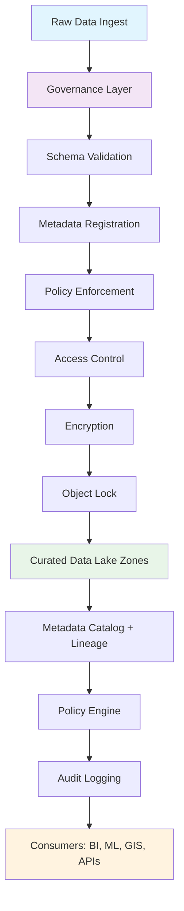

# Best Practices for Data Lake Governance

**Objective**: Master data lake governance for trustworthy, auditable, compliant data at scale. When you need to enforce data quality, when you're building compliance workflows, when you need to scale to billions of objects—data lake governance becomes your weapon of choice.

Data lake governance is the foundation of trustworthy data infrastructure. Without proper governance, data lakes become data swamps with shadow data, schema drift, and compliance violations. This guide shows you how to design and enforce governance with the precision of a data architect who has been burned before.

## 0) Prerequisites (Read Once, Live by Them)

### The Five Commandments

1. **Enforce governance from day one**
   - Schema validation at ingestion
   - Metadata registration for every object
   - Access controls from the start

2. **Master the governance pillars**
   - Data quality and lineage
   - Security and compliance
   - Lifecycle management

3. **Know your tools**
   - Open formats and table formats
   - Metadata catalogs and policy engines
   - Audit logging and monitoring

4. **Validate everything**
   - Schema evolution policies
   - Access control enforcement
   - Compliance requirements

5. **Plan for scale**
   - Multi-region replication
   - High-concurrency workloads
   - Mixed ETL and BI patterns

**Why These Principles**: Data lake governance is the foundation of trustworthy data infrastructure. Understanding the pillars, mastering the tools, and following best practices is essential for building scalable, compliant data lakes.

## 1) Governance Principles (The Foundation)

### Core Governance Pillars

```yaml
# governance-pillars.yaml
governance:
  data_quality:
    schema_validation: true
    deduplication: true
    null_thresholds: 0.05
    geospatial_validation: true
  
  metadata:
    lineage_tracking: true
    ownership_registration: true
    creation_timestamps: true
    classification_tags: true
  
  security:
    least_privilege: true
    encryption_at_rest: true
    encryption_in_transit: true
    access_audit_logging: true
  
  compliance:
    immutability_enforcement: true
    retention_policies: true
    legal_hold_support: true
    gdpr_hipaa_workflows: true
  
  lifecycle:
    tiering_policies: true
    archival_strategies: true
    deletion_workflows: true
    cost_optimization: true
```

### Data Quality Enforcement

```python
# Schema validation at ingestion
from pyspark.sql import SparkSession
from pyspark.sql.types import StructType, StructField, StringType, TimestampType
from pyspark.sql.functions import current_timestamp, col, when

def enforce_data_quality(spark, raw_data_path, governed_path):
    """Enforce data quality at ingestion"""
    
    # Define strict schema
    schema = StructType([
        StructField("id", StringType(), False),
        StructField("timestamp", TimestampType(), False),
        StructField("location", StringType(), True),
        StructField("value", StringType(), True)
    ])
    
    # Read with schema validation
    df = spark.read.schema(schema).parquet(raw_data_path)
    
    # Apply quality checks
    df_quality = df.withColumn(
        "quality_score",
        when(col("id").isNull(), 0.0)
        .when(col("timestamp").isNull(), 0.0)
        .otherwise(1.0)
    ).withColumn(
        "ingest_time", current_timestamp()
    )
    
    # Write to governed zone
    df_quality.write \
        .format("delta") \
        .option("mergeSchema", "false") \
        .option("delta.autoOptimize.optimizeWrite", "true") \
        .save(governed_path)
    
    return df_quality
```

### Metadata Management

```sql
-- Metadata catalog schema
CREATE TABLE metadata_catalog (
    object_id VARCHAR(255) PRIMARY KEY,
    object_path VARCHAR(500) NOT NULL,
    object_type VARCHAR(50) NOT NULL,
    schema_version VARCHAR(20) NOT NULL,
    owner VARCHAR(100) NOT NULL,
    created_at TIMESTAMP NOT NULL,
    updated_at TIMESTAMP NOT NULL,
    classification VARCHAR(50),
    compliance_flags JSONB,
    lineage_parents JSONB,
    lineage_children JSONB
);

-- Lineage tracking
CREATE TABLE data_lineage (
    lineage_id VARCHAR(255) PRIMARY KEY,
    source_object_id VARCHAR(255) NOT NULL,
    target_object_id VARCHAR(255) NOT NULL,
    transformation_type VARCHAR(100) NOT NULL,
    created_at TIMESTAMP NOT NULL,
    metadata JSONB
);

-- Compliance tracking
CREATE TABLE compliance_audit (
    audit_id VARCHAR(255) PRIMARY KEY,
    object_id VARCHAR(255) NOT NULL,
    action VARCHAR(50) NOT NULL,
    user_id VARCHAR(100) NOT NULL,
    timestamp TIMESTAMP NOT NULL,
    compliance_flags JSONB,
    audit_data JSONB
);
```

**Why These Principles**: Governance pillars provide the foundation for trustworthy data infrastructure. Data quality, metadata management, security, compliance, and lifecycle management are essential for building scalable, auditable data lakes.

## 2) Architectural Controls (The Structure)

### Schema Enforcement

```yaml
# iceberg-schema-enforcement.yaml
schema_registry:
  name: "data_lake_schemas"
  version: "1.0"
  
schemas:
  events:
    namespace: "com.company.events"
    type: "record"
    fields:
      - name: "event_id"
        type: "string"
        doc: "Unique event identifier"
      - name: "timestamp"
        type: "long"
        logicalType: "timestamp-millis"
      - name: "location"
        type: "record"
        fields:
          - name: "latitude"
            type: "double"
          - name: "longitude"
            type: "double"
      - name: "metadata"
        type: "map"
        values: "string"
    
  compliance:
    namespace: "com.company.compliance"
    type: "record"
    fields:
      - name: "object_id"
        type: "string"
      - name: "classification"
        type: "enum"
        symbols: ["PUBLIC", "INTERNAL", "CONFIDENTIAL", "RESTRICTED"]
      - name: "retention_period"
        type: "int"
      - name: "legal_hold"
        type: "boolean"
```

### Partitioning and Clustering

```python
# Partitioning strategy for governance
def create_governed_table(spark, table_name, schema):
    """Create governed table with proper partitioning"""
    
    spark.sql(f"""
        CREATE TABLE {table_name} (
            {schema}
        )
        USING DELTA
        PARTITIONED BY (year, month, day)
        CLUSTERED BY (id) INTO 100 BUCKETS
        TBLPROPERTIES (
            'delta.autoOptimize.optimizeWrite' = 'true',
            'delta.autoOptimize.autoCompact' = 'true',
            'delta.enableChangeDataFeed' = 'true'
        )
    """)
    
    # Register in Glue catalog
    spark.sql(f"""
        CREATE EXTERNAL TABLE {table_name}_external
        STORED AS PARQUET
        LOCATION 's3://data-lake/governed/{table_name}/'
        TBLPROPERTIES (
            'classification' = 'governed',
            'owner' = 'data-engineering',
            'compliance' = 'gdpr-ready'
        )
    """)
```

### Versioning and Time Travel

```python
# Delta Lake versioning for compliance
def create_governed_delta_table(spark, table_name):
    """Create Delta table with versioning and time travel"""
    
    # Create table with versioning
    spark.sql(f"""
        CREATE TABLE {table_name} (
            id STRING,
            data STRING,
            ingest_time TIMESTAMP,
            version INT
        )
        USING DELTA
        TBLPROPERTIES (
            'delta.logRetentionDuration' = 'interval 7 days',
            'delta.deletedFileRetentionDuration' = 'interval 7 days',
            'delta.enableChangeDataFeed' = 'true'
        )
    """)
    
    # Enable time travel for compliance
    spark.sql(f"""
        ALTER TABLE {table_name} SET TBLPROPERTIES (
            'delta.retentionDurationCheck.enabled' = 'false'
        )
    """)
```

**Why These Controls**: Architectural controls provide the structural foundation for governance. Schema enforcement, partitioning, and versioning enable scalable, auditable data lake operations.

## 3) Metadata & Catalogs (The Registry)

### Central Metadata Repository

```python
# Metadata catalog implementation
class DataLakeCatalog:
    def __init__(self, spark, catalog_name="data_lake"):
        self.spark = spark
        self.catalog_name = catalog_name
    
    def register_object(self, object_path, metadata):
        """Register object in metadata catalog"""
        
        # Extract object metadata
        object_id = self._generate_object_id(object_path)
        schema_version = metadata.get("schema_version", "1.0")
        owner = metadata.get("owner", "unknown")
        classification = metadata.get("classification", "INTERNAL")
        
        # Insert into catalog
        self.spark.sql(f"""
            INSERT INTO {self.catalog_name}.metadata_catalog
            VALUES (
                '{object_id}',
                '{object_path}',
                '{metadata.get("object_type", "table")}',
                '{schema_version}',
                '{owner}',
                current_timestamp(),
                current_timestamp(),
                '{classification}',
                '{json.dumps(metadata.get("compliance_flags", {}))}',
                '{json.dumps(metadata.get("lineage_parents", []))}',
                '{json.dumps(metadata.get("lineage_children", []))}'
            )
        """)
    
    def track_lineage(self, source_path, target_path, transformation):
        """Track data lineage"""
        
        lineage_id = self._generate_lineage_id(source_path, target_path)
        
        self.spark.sql(f"""
            INSERT INTO {self.catalog_name}.data_lineage
            VALUES (
                '{lineage_id}',
                '{source_path}',
                '{target_path}',
                '{transformation}',
                current_timestamp(),
                '{{}}'
            )
        """)
    
    def _generate_object_id(self, path):
        """Generate unique object ID"""
        import hashlib
        return hashlib.md5(path.encode()).hexdigest()
    
    def _generate_lineage_id(self, source, target):
        """Generate unique lineage ID"""
        import hashlib
        return hashlib.md5(f"{source}->{target}".encode()).hexdigest()
```

### Semantic Metadata with OWL

```xml
<!-- OWL ontology for data lake governance -->
<rdf:RDF xmlns:rdf="http://www.w3.org/1999/02/22-rdf-syntax-ns#"
         xmlns:owl="http://www.w3.org/2002/07/owl#"
         xmlns:rdfs="http://www.w3.org/2000/01/rdf-schema#">
  
  <owl:Class rdf:about="http://company.com/ontology#DataObject">
    <rdfs:label>Data Object</rdfs:label>
    <rdfs:comment>Represents a data object in the data lake</rdfs:comment>
  </owl:Class>
  
  <owl:Class rdf:about="http://company.com/ontology#GovernedDataObject">
    <rdfs:subClassOf rdf:resource="http://company.com/ontology#DataObject"/>
    <rdfs:label>Governed Data Object</rdfs:label>
    <rdfs:comment>Data object with governance metadata</rdfs:comment>
  </owl:Class>
  
  <owl:ObjectProperty rdf:about="http://company.com/ontology#hasOwner">
    <rdfs:label>has owner</rdfs:label>
    <rdfs:domain rdf:resource="http://company.com/ontology#DataObject"/>
    <rdfs:range rdf:resource="http://www.w3.org/2001/XMLSchema#string"/>
  </owl:ObjectProperty>
  
  <owl:ObjectProperty rdf:about="http://company.com/ontology#hasClassification">
    <rdfs:label>has classification</rdfs:label>
    <rdfs:domain rdf:resource="http://company.com/ontology#DataObject"/>
    <rdfs:range rdf:resource="http://company.com/ontology#Classification"/>
  </owl:ObjectProperty>
  
</rdf:RDF>
```

**Why These Catalogs**: Central metadata repositories provide the foundation for data discovery, lineage tracking, and governance enforcement. Semantic metadata enables interoperability and automated governance workflows.

## 4) Security & Compliance (The Shield)

### IAM Policies for Fine-Grained Access

```json
{
  "Version": "2012-10-17",
  "Statement": [
    {
      "Sid": "DataLakeGovernanceAccess",
      "Effect": "Allow",
      "Action": [
        "s3:GetObject",
        "s3:PutObject"
      ],
      "Resource": "arn:aws:s3:::data-lake/governed/*",
      "Condition": {
        "StringEquals": {
          "s3:x-amz-server-side-encryption": "AES256"
        },
        "ForAllValues:StringEquals": {
          "s3:ExistingObjectTag/Classification": [
            "PUBLIC",
            "INTERNAL"
          ]
        }
      }
    },
    {
      "Sid": "DenyUnencryptedAccess",
      "Effect": "Deny",
      "Action": [
        "s3:GetObject",
        "s3:PutObject"
      ],
      "Resource": "arn:aws:s3:::data-lake/*",
      "Condition": {
        "Bool": {
          "s3:x-amz-server-side-encryption": "false"
        }
      }
    }
  ]
}
```

### Object Lock for Legal Compliance

```python
# S3 Object Lock configuration
def configure_object_lock(bucket_name, retention_period=2555):  # 7 years
    """Configure S3 Object Lock for legal compliance"""
    
    import boto3
    
    s3_client = boto3.client('s3')
    
    # Enable Object Lock
    s3_client.put_object_lock_configuration(
        Bucket=bucket_name,
        ObjectLockConfiguration={
            'ObjectLockEnabled': 'Enabled',
            'Rule': {
                'DefaultRetention': {
                    'Mode': 'GOVERNANCE',
                    'Days': retention_period
                }
            }
        }
    )
    
    # Apply to specific objects
    s3_client.put_object(
        Bucket=bucket_name,
        Key='governed/legal-hold/data.parquet',
        Body=data,
        ObjectLockMode='GOVERNANCE',
        ObjectLockRetainUntilDate=datetime(2030, 12, 31),
        ObjectLockLegalHoldStatus='ON'
    )
```

### GDPR/HIPAA Workflows

```python
# PII/PHI tagging at ingestion
def tag_sensitive_data(spark, df, classification_rules):
    """Tag sensitive data at ingestion"""
    
    from pyspark.sql.functions import when, col, lit
    
    # Apply classification rules
    df_tagged = df
    for rule in classification_rules:
        if rule["type"] == "pii":
            df_tagged = df_tagged.withColumn(
                "pii_flag",
                when(col(rule["column"]).rlike(rule["pattern"]), lit(True))
                .otherwise(lit(False))
            )
        elif rule["type"] == "phi":
            df_tagged = df_tagged.withColumn(
                "phi_flag",
                when(col(rule["column"]).rlike(rule["pattern"]), lit(True))
                .otherwise(lit(False))
            )
    
    # Add compliance metadata
    df_tagged = df_tagged.withColumn(
        "compliance_flags",
        lit({
            "gdpr_applicable": True,
            "hipaa_applicable": True,
            "retention_period": 2555,  # 7 years
            "legal_hold": False
        })
    )
    
    return df_tagged
```

**Why This Security**: Security and compliance controls protect sensitive data and ensure regulatory compliance. IAM policies, object lock, and PII/PHI tagging provide the foundation for trustworthy data lake operations.

## 5) Operational Practices (The Execution)

### Schema Evolution Policy

```yaml
# schema-evolution-policy.yaml
schema_evolution:
  allowed_changes:
    - type: "add_column"
      description: "Add new columns to schema"
      validation: "nullable_by_default"
    
    - type: "modify_column"
      description: "Modify column properties"
      validation: "backward_compatible_only"
    
    - type: "add_metadata"
      description: "Add metadata properties"
      validation: "no_breaking_changes"
  
  forbidden_changes:
    - type: "delete_column"
      description: "Deleting columns breaks compatibility"
      migration_required: true
    
    - type: "rename_column"
      description: "Renaming columns breaks compatibility"
      migration_required: true
    
    - type: "change_column_type"
      description: "Changing types breaks compatibility"
      migration_required: true
  
  migration_workflow:
    - step: "create_new_schema"
    - step: "migrate_data"
    - step: "validate_migration"
    - step: "update_consumers"
    - step: "deprecate_old_schema"
```

### Immutable Ingestion Zones

```python
# Immutable ingestion pattern
def immutable_ingestion(spark, raw_data_path, governed_path):
    """Implement immutable ingestion pattern"""
    
    # Read raw data
    df = spark.read.parquet(raw_data_path)
    
    # Add governance metadata
    df_governed = df.withColumn(
        "ingest_time", current_timestamp()
    ).withColumn(
        "ingest_id", lit(uuid.uuid4().hex)
    ).withColumn(
        "schema_version", lit("1.0")
    )
    
    # Write to immutable zone
    df_governed.write \
        .format("delta") \
        .option("mergeSchema", "false") \
        .option("delta.autoOptimize.optimizeWrite", "true") \
        .mode("append") \
        .save(governed_path)
    
    # Register in catalog
    catalog.register_object(
        object_path=governed_path,
        metadata={
            "object_type": "table",
            "owner": "data-engineering",
            "classification": "INTERNAL",
            "compliance_flags": {
                "immutable": True,
                "retention_period": 2555
            }
        }
    )
```

### Automated Quality Checks

```python
# Automated quality validation
def validate_data_quality(spark, table_name, quality_rules):
    """Validate data quality against rules"""
    
    validation_results = {}
    
    for rule in quality_rules:
        if rule["type"] == "row_count":
            count = spark.table(table_name).count()
            validation_results[rule["name"]] = {
                "actual": count,
                "expected": rule["expected"],
                "passed": count >= rule["expected"]
            }
        
        elif rule["type"] == "null_threshold":
            null_count = spark.table(table_name).filter(
                col(rule["column"]).isNull()
            ).count()
            total_count = spark.table(table_name).count()
            null_percentage = null_count / total_count
            
            validation_results[rule["name"]] = {
                "actual": null_percentage,
                "threshold": rule["threshold"],
                "passed": null_percentage <= rule["threshold"]
            }
        
        elif rule["type"] == "geospatial_validity":
            invalid_geom_count = spark.table(table_name).filter(
                ~col(rule["column"]).rlike("^POINT\\(-?\\d+\\.\\d+ -?\\d+\\.\\d+\\)$")
            ).count()
            
            validation_results[rule["name"]] = {
                "invalid_geometries": invalid_geom_count,
                "passed": invalid_geom_count == 0
            }
    
    return validation_results
```

**Why These Practices**: Operational practices ensure consistent governance enforcement across the data lake. Schema evolution, immutable ingestion, and quality validation provide the foundation for reliable data operations.

## 6) Stress-Test Scenarios (The Validation)

### High-Concurrency BI Queries

```python
# Stress test concurrent queries
def stress_test_concurrent_queries(spark, table_name, num_queries=100):
    """Stress test concurrent BI queries"""
    
    import concurrent.futures
    import time
    
    def execute_query(query_id):
        """Execute single query"""
        start_time = time.time()
        
        # Simulate BI query
        result = spark.sql(f"""
            SELECT 
                partition_col,
                COUNT(*) as record_count,
                AVG(numeric_col) as avg_value
            FROM {table_name}
            WHERE partition_col >= '2024-01-01'
            GROUP BY partition_col
            ORDER BY partition_col
        """).collect()
        
        runtime = time.time() - start_time
        return {
            "query_id": query_id,
            "runtime": runtime,
            "result_count": len(result)
        }
    
    # Execute concurrent queries
    with concurrent.futures.ThreadPoolExecutor(max_workers=20) as executor:
        futures = [executor.submit(execute_query, i) for i in range(num_queries)]
        results = [future.result() for future in concurrent.futures.as_completed(futures)]
    
    # Analyze results
    avg_runtime = sum(r["runtime"] for r in results) / len(results)
    max_runtime = max(r["runtime"] for r in results)
    
    print(f"Concurrent queries: {num_queries}")
    print(f"Average runtime: {avg_runtime:.2f}s")
    print(f"Max runtime: {max_runtime:.2f}s")
    
    return results
```

### Multi-Region Replication

```python
# Multi-region governance reconciliation
def reconcile_multi_region_governance(spark, regions):
    """Reconcile governance across regions"""
    
    reconciliation_results = {}
    
    for region in regions:
        # Get governance metadata from each region
        region_metadata = spark.sql(f"""
            SELECT 
                object_id,
                object_path,
                classification,
                compliance_flags,
                updated_at
            FROM {region}.metadata_catalog
            WHERE updated_at >= current_timestamp() - interval 1 hour
        """).collect()
        
        reconciliation_results[region] = region_metadata
    
    # Detect conflicts
    conflicts = []
    for obj_id in set(obj["object_id"] for region_data in reconciliation_results.values() for obj in region_data):
        region_versions = {}
        for region, metadata in reconciliation_results.items():
            for obj in metadata:
                if obj["object_id"] == obj_id:
                    region_versions[region] = obj
        
        # Check for conflicts
        if len(set(obj["classification"] for obj in region_versions.values())) > 1:
            conflicts.append({
                "object_id": obj_id,
                "conflicting_regions": list(region_versions.keys()),
                "classifications": [obj["classification"] for obj in region_versions.values()]
            })
    
    return conflicts
```

### Data Deletion Under Compliance

```python
# GDPR right to be forgotten
def gdpr_data_deletion(spark, subject_id, deletion_request):
    """Implement GDPR data deletion"""
    
    # Find all data related to subject
    subject_data = spark.sql(f"""
        SELECT 
            object_id,
            object_path,
            classification,
            compliance_flags
        FROM metadata_catalog
        WHERE compliance_flags.pii_subject_id = '{subject_id}'
        OR object_path LIKE '%{subject_id}%'
    """).collect()
    
    deletion_results = []
    
    for data_obj in subject_data:
        # Check if deletion is allowed
        if data_obj["classification"] == "LEGAL_HOLD":
            deletion_results.append({
                "object_id": data_obj["object_id"],
                "status": "BLOCKED",
                "reason": "Legal hold prevents deletion"
            })
            continue
        
        # Perform deletion
        try:
            # Delete from storage
            spark.sql(f"DROP TABLE IF EXISTS {data_obj['object_path']}")
            
            # Update metadata
            spark.sql(f"""
                UPDATE metadata_catalog
                SET 
                    updated_at = current_timestamp(),
                    compliance_flags = jsonb_set(
                        compliance_flags,
                        '{{deleted}}',
                        'true'
                    )
                WHERE object_id = '{data_obj['object_id']}'
            """)
            
            deletion_results.append({
                "object_id": data_obj["object_id"],
                "status": "DELETED",
                "timestamp": datetime.now().isoformat()
            })
            
        except Exception as e:
            deletion_results.append({
                "object_id": data_obj["object_id"],
                "status": "ERROR",
                "error": str(e)
            })
    
    return deletion_results
```

**Why These Scenarios**: Stress testing validates governance under real-world conditions. High concurrency, multi-region replication, and compliance workflows ensure governance remains effective under load.

## 7) Governance Flow Diagram



**Why This Flow**: The governance flow diagram shows the complete pipeline from raw data ingestion through governance enforcement to consumption. It highlights the decision points and enforcement mechanisms that ensure data quality and compliance.

## 8) Pitfalls & Anti-Patterns

### Common Governance Mistakes

```bash
# ❌ WRONG: Shadow data lakes outside governance
echo "Don't create shadow data lakes"
echo "All data must go through governance layer"

# ❌ WRONG: Schema drift with no registry
echo "Don't allow uncontrolled schema changes"
echo "Enforce schema evolution policies"

# ❌ WRONG: Over-permissive access
echo "Don't use wildcard permissions"
echo "Implement least privilege access"

# ❌ WRONG: Governance as afterthought
echo "Don't treat governance as an afterthought"
echo "Build governance into the architecture"
```

### Anti-Pattern Examples

```python
# ❌ WRONG: No governance at ingestion
def bad_ingestion_pattern():
    """Don't ingest without governance"""
    # Raw data goes directly to data lake
    df = spark.read.parquet("s3://raw-data/")
    df.write.parquet("s3://data-lake/")  # No governance!

# ✅ CORRECT: Governance-first ingestion
def good_ingestion_pattern():
    """Governance-first ingestion"""
    # Apply governance at ingestion
    df = spark.read.parquet("s3://raw-data/")
    df_governed = apply_governance(df)
    df_governed.write.parquet("s3://data-lake/governed/")
    register_in_catalog(df_governed)

# ❌ WRONG: No lineage tracking
def bad_lineage_pattern():
    """Don't ignore lineage"""
    # Transform data without tracking lineage
    df1 = spark.read.table("source")
    df2 = df1.filter(col("status") == "active")
    df2.write.saveAsTable("target")  # No lineage!

# ✅ CORRECT: Lineage tracking
def good_lineage_pattern():
    """Track lineage for all transformations"""
    df1 = spark.read.table("source")
    df2 = df1.filter(col("status") == "active")
    df2.write.saveAsTable("target")
    track_lineage("source", "target", "filter_active")
```

**Why These Pitfalls Matter**: Common governance mistakes lead to data swamps, compliance violations, and security breaches. Understanding these pitfalls is essential for building effective governance.

## 9) Best Practices Checklist

### Pre-Implementation Checklist

```bash
# Architecture
echo "✓ Governance architecture designed"
echo "✓ Metadata catalog planned"
echo "✓ Security model defined"
echo "✓ Compliance requirements mapped"
echo "✓ Lifecycle policies configured"

# Implementation
echo "✓ Schema registry implemented"
echo "✓ Access controls configured"
echo "✓ Audit logging enabled"
echo "✓ Quality checks automated"
echo "✓ Lineage tracking active"

# Operations
echo "✓ Monitoring configured"
echo "✓ Alerting enabled"
echo "✓ Documentation complete"
echo "✓ Training delivered"
echo "✓ Testing validated"
```

### Governance Maturity Model

```python
# Governance maturity assessment
def assess_governance_maturity():
    """Assess governance maturity level"""
    
    maturity_levels = {
        "level_1": {
            "name": "Basic",
            "description": "Manual governance processes",
            "indicators": [
                "Manual schema validation",
                "Basic access controls",
                "Limited metadata"
            ]
        },
        "level_2": {
            "name": "Managed",
            "description": "Automated governance processes",
            "indicators": [
                "Automated schema validation",
                "Role-based access controls",
                "Centralized metadata catalog"
            ]
        },
        "level_3": {
            "name": "Optimized",
            "description": "Intelligent governance processes",
            "indicators": [
                "AI-powered data classification",
                "Dynamic access controls",
                "Automated compliance reporting"
            ]
        }
    }
    
    return maturity_levels
```

**Why This Checklist**: Comprehensive governance requires systematic implementation and validation. The checklist ensures all aspects of governance are covered and maturity is assessed.

## 10) TL;DR Quickstart (The Essentials)

### Essential Commands

```bash
# Setup governance infrastructure
aws glue create-database --database-input Name=governed
aws s3api put-bucket-versioning --bucket data-lake --versioning-configuration Status=Enabled
aws s3api put-bucket-object-lock-configuration --bucket data-lake --object-lock-configuration file://object-lock.json

# Enforce schema at ingestion
spark.read.schema(schema).parquet("s3://raw/") \
  .withColumn("ingest_time", current_timestamp()) \
  .write.format("delta").option("mergeSchema", "false") \
  .save("s3://governed/")

# Register in catalog
aws glue create-table --database governed --table-input file://table.json
```

### Essential Configuration

```yaml
# governance-config.yaml
governance:
  schema_registry:
    enabled: true
    validation: strict
  
  metadata_catalog:
    enabled: true
    lineage_tracking: true
  
  access_control:
    least_privilege: true
    audit_logging: true
  
  compliance:
    gdpr_ready: true
    hipaa_ready: true
    object_lock: true
  
  lifecycle:
    tiering: true
    retention: true
    archival: true
```

**Why This Quickstart**: These commands and configurations cover 90% of daily governance needs. Master these before exploring advanced features.

## 11) The Machine's Summary

Data lake governance provides the foundation for trustworthy, auditable, compliant data infrastructure. When implemented properly, it enables scalable data operations, regulatory compliance, and data quality assurance. The key is understanding the governance pillars, mastering the architectural controls, and following systematic implementation practices.

**The Dark Truth**: Without proper data lake governance, your data infrastructure is untrustworthy. Schema enforcement, metadata management, and compliance controls are your weapons. Use them wisely.

**The Machine's Mantra**: "In governance we trust, in metadata we build, and in the compliance we find the path to trustworthy data infrastructure."

**Why This Matters**: Data lake governance enables organizations to build trustworthy, auditable, compliant data infrastructure. It provides the foundation for data quality, security, and regulatory compliance at scale.

---

*This guide provides the complete machinery for mastering data lake governance. The patterns scale from development to production, from simple schemas to enterprise-grade compliance frameworks.*
