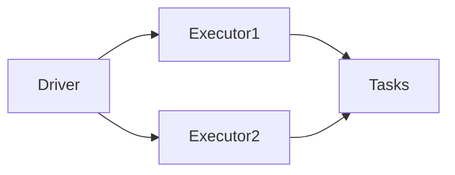

# Scaling Spark Clusters Correctly

**Objective**: Cluster sizing, executor strategy, and partitioning so Spark jobs run efficiently without waste or bottlenecks.

## Spark architecture overview

### Driver

The **driver** runs your application (e.g. `spark-submit` or a notebook kernel). It builds the logical and physical plans, schedules stages and tasks, and collects results (e.g. `collect()`, `show()`). The driver does not process data; it coordinates. It should have enough memory for the DAG, broadcast variables, and any collected results. Do not `collect()` large datasets to the driver.

### Executors

**Executors** run on worker nodes. Each executor holds a JVM process with configured CPU and memory. Tasks are scheduled onto executors; each task processes one partition. Executor memory is used for execution (joins, aggregations), caching, and shuffle buffers. Size executors so that tasks fit in memory and that you do not create so many small executors that overhead dominates.

### Tasks

A **task** is the unit of work for one partition. One stage runs one task per partition per executor (up to executor cores). Too few partitions → underutilization and large tasks (memory pressure, GC). Too many partitions → scheduling and shuffle overhead. Aim for a few thousand to tens of thousands of tasks per stage, with each task handling ~128–256 MB of data where applicable.

### Shuffle

**Shuffle** is the all-to-all data movement between stages (e.g. after `groupByKey`, `join`). Data is written to disk (and optionally memory) on the map side and read on the reduce side. Shuffle is often the bottleneck: disk I/O, network, and skew. Tune partition count, memory for shuffle buffers, and data layout to reduce shuffle cost. See [Spark Performance Tuning](spark-performance-tuning.md) for join strategies and skew.

### Architecture diagram

The driver schedules tasks onto executors; each executor runs many tasks over its partitions.

## Key scaling principles

- **Partition sizing**: Target ~128–256 MB per partition for read and shuffle. Too small → overhead; too large → memory pressure and poor parallelism.
- **Executor memory**: Enough for task working set, shuffle buffers, and cached data. Avoid executors so large that GC dominates; 8–16 GB per executor is a common range.
- **CPU allocation**: Match parallelism to cores. `spark.default.parallelism` and partition count should allow enough concurrent tasks to use the cluster.

## Partition sizing guidelines

Rule of thumb: **~128–256 MB per partition**.

- **Input**: When reading from Parquet/ORC, use `repartition()` or `coalesce()` (or input partitioning) so that downstream stages have a sensible number of partitions. For very large tables, hundreds to low thousands of partitions are typical.
- **Shuffle**: After wide transformations, partition count is determined by `spark.sql.shuffle.partitions` (default 200). Increase for large shuffle data; decrease if you have few executors and small shuffle. Avoid a single huge partition (skew) or millions of tiny partitions (overhead).
- **Output**: Writing too many small files (one per partition) can create small-file problems on object storage. Coalesce or repartition before write when appropriate; balance with parallelism.

## Shuffle considerations

- **Disk pressure**: Shuffle writes go to local disk (or configured directories). Fast local SSDs improve shuffle performance. Monitor disk I/O and full-disk conditions.
- **Network I/O**: Shuffle reads pull data over the network. Saturation can limit throughput. Right-size partitions and avoid unnecessary shuffle (e.g. broadcast when one side is small).
- **Skew**: If one key (or a few keys) gets a disproportionate share of data, one partition does most of the work and the stage is slow. Mitigate with salting, two-phase aggregation, or filtering skewed keys separately.

## Cluster scaling anti-patterns

| Anti-pattern | Problem | Prefer |
|--------------|---------|--------|
| **Too many executors** | Scheduling and heartbeat overhead; small executors increase GC and reduce cache efficiency | Fewer, larger executors within node capacity |
| **Oversized executors** | Long GC pauses, wasted memory, or OOM when many tasks share one JVM | Cap executor size (e.g. 16–24 GB); use multiple executors per node if needed |
| **Under-partitioned datasets** | Few tasks, underutilized cluster, large tasks that risk OOM or slow GC | Repartition or increase `shuffle.partitions` so tasks are in the 128–256 MB range |

## See also

- [When to Use Spark (and When Not To)](when-to-use-spark.md) — Decide if Spark is the right tool
- [Spark Performance Tuning](spark-performance-tuning.md) — Joins, memory, and data layout
- [Running Spark on Kubernetes](spark-on-kubernetes.md) — Executor and resource configuration on k8s
- [Reproducible Data Pipelines](../../data/reproducible-data-pipelines.md) — Pipeline and partitioning discipline
- [Parquet](../../database-data/parquet.md) — Partitioning and layout for Spark inputs/outputs
