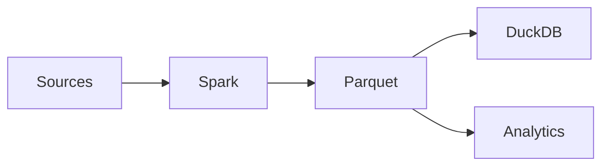

# Spark in Modern Data Architectures

**Objective**: Place Spark in context among lakehouse, object storage, and modern analytics tools so you can choose and integrate it correctly.

## Historical role of Spark

### Hadoop era

Spark emerged as a faster, in-memory alternative to MapReduce on Hadoop. It provided a unified programming model (RDDs, then DataFrames), SQL, streaming, and ML, and could run on HDFS and YARN. Many organizations adopted Spark for batch ETL and analytics on Hadoop clusters.

### Batch processing

Spark’s strength has always been **batch processing**: scheduled jobs over large datasets, with fault tolerance and scalability. It became the default engine for data lake ETL, warehouse ingestion, and large-scale ML training. Streaming in Spark (DStreams, Structured Streaming) is micro-batch, not true record-at-a-time streaming.

## Modern architecture patterns

### Lakehouse

The **lakehouse** pattern combines low-cost object storage (S3, GCS, Azure Blob) with table formats (Delta, Iceberg, Hudi) and engines (Spark, Presto/Trino, etc.). Data lives as Parquet (or similar) under a metadata layer that provides ACID and time travel. Spark is a first-class engine for writing and reading lakehouse tables. See [Lakes vs Lakehouses vs Warehouses](../../database-data/lake-vs-lakehouse-vs-warehouse.md) and [Lakehouse vs Warehouse vs Database](../../../deep-dives/lakehouse-vs-warehouse-vs-database.md).

### Object storage pipelines

Modern pipelines read from and write to **object storage** (Parquet, ORC, Avro) without HDFS. Spark integrates via Hadoop compatible filesystems (s3a, gs, abfs) or native cloud connectors. Orchestration (Airflow, Prefect, etc.) schedules Spark jobs; results land in object storage for downstream consumers (DuckDB, warehouses, BI, APIs). See [Reproducible Data Pipelines](../../data/reproducible-data-pipelines.md).

## Spark + other tools

Spark often sits in the middle: it consumes raw or normalized data and produces curated or analytical datasets that other tools then use.

- **Sources**: Event streams, object storage, databases. Spark (or other ingest) writes to the lake.
- **Spark**: Batch ETL, large joins, ML training, or format conversion. Outputs Parquet (or lakehouse tables) to object storage.
- **Parquet / lakehouse**: Single source of truth for downstream.
- **DuckDB / Polars / warehouse / BI**: Query the same Parquet or tables for ad-hoc analytics, reporting, or serving. Spark is not required for every consumer.

## Where Spark still excels

- **Large ETL pipelines**: Multi-step, shuffle-heavy jobs over TB-scale data. Scheduled batch runs that write to object storage or lakehouse tables.
- **Machine learning pipelines**: Feature computation and model training at scale. MLlib and integration with MLflow or custom code.
- **Geospatial batch processing**: Large-scale spatial joins, raster processing, or geometry operations when data and computation exceed single-node capacity. See [Geospatial System Architecture](../../geospatial/geospatial-system-design.md).

## Where alternatives are emerging

- **DuckDB**: Single-node analytics on Parquet/CSV; often faster and simpler when data fits. See [DuckDB vs PostgreSQL vs Spark](../../../deep-dives/duckdb-vs-postgres-vs-spark.md).
- **Polars**: Fast in-process columnar processing; good for medium-sized data and Python-native workflows.
- **Streaming engines**: For true low-latency streaming, dedicated engines (Flink, ksqlDB, or cloud services) may be a better fit than Spark’s micro-batch streaming.
- **SQL warehouses**: Cloud warehouses (Snowflake, BigQuery, etc.) can handle a lot of analytical SQL; use Spark when you need custom logic, very large scale, or tight integration with object storage and open formats.

Choose Spark when the workload is batch, large, and benefits from distribution; choose alternatives when the workload is local, low-latency, or better served by a warehouse or streaming engine.

## See also

- [When to Use Spark (and When Not To)](when-to-use-spark.md) — Decision framework
- [Scaling Spark Clusters Correctly](scaling-spark.md) — Sizing and partitioning
- [Reproducible Data Pipelines](../../data/reproducible-data-pipelines.md) — Pipeline discipline
- [Parquet](../../database-data/parquet.md) — Layout for Spark and downstream consumers
- [Lakes vs Lakehouses vs Warehouses](../../database-data/lake-vs-lakehouse-vs-warehouse.md) — Where Spark fits
- [DuckDB vs PostgreSQL vs Spark](../../../deep-dives/duckdb-vs-postgres-vs-spark.md) — When to use local vs distributed
- [Why Most Data Pipelines Fail](../../../deep-dives/why-most-data-pipelines-fail.md) — Organizational and architectural context
