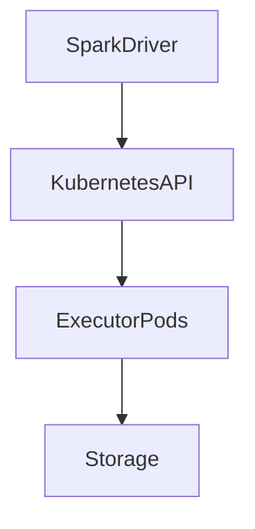

# Running Spark on Kubernetes

**Objective**: Operational best practices for running Apache Spark on Kubernetes: architecture, deployment modes, resources, and storage.

## Why Kubernetes for Spark

- **Dynamic clusters**: Scale executors up and down per job or use spot/preemptible nodes. Kubernetes scheduler and autoscalers manage pod lifecycle.
- **Containerized workloads**: Same image and toolchain for driver and executors; consistent with the rest of the platform.
- **Isolation**: Jobs run in their own pods and namespaces; resource limits and quotas apply. Easier multi-tenant or multi-team sharing of a single cluster.

Trade-off: operational complexity (Kubernetes, container images, networking) versus elasticity and uniformity. Use when you need elasticity or already run analytics on Kubernetes.

## Spark on k8s architecture

The Spark driver talks to the Kubernetes API to request executor pods. Executor pods run the Spark executor process and, when the job runs, read/write data to storage (object storage, distributed filesystem, or both). The driver does not run inside the cluster by default in cluster mode; it can run in a pod as well (cluster mode) or on your laptop/CI (client mode).

## Deployment patterns

### Client mode

The **driver** runs where you submit the job (e.g. your machine or a CI runner). The driver creates executor pods via the Kubernetes API. Pros: simple submission, easy debugging. Cons: driver is outside the cluster (network, resilience); if the submission host dies, the job fails. Use for dev or when the driver is a long-lived service that submits jobs.

### Cluster mode

The **driver** runs in a pod in the cluster. You submit the job (e.g. `spark-submit` or a job controller); the driver pod is created and then creates executor pods. Pros: driver is inside the cluster, no dependency on an external host. Cons: submission is asynchronous; logs and status are in the cluster. Use for production jobs and when you want the driver to be managed by Kubernetes.

## Resource configuration

- **CPU requests**: Set so the scheduler reserves cores for driver and executors. Executors typically need one or more cores per executor; request at least what you need for parallelism.
- **Memory limits**: Set memory limits for driver and executor pods. Spark’s `spark.driver.memory` and `spark.executor.memory` should be within the pod limit (leave headroom for off-heap and OS). Kubernetes will kill pods that exceed the limit (OOMKilled).
- **Ephemeral storage**: Shuffle and temporary files use local disk. Configure `emptyDir` or local ephemeral storage and request enough space. Monitor disk usage; full disk causes task failures.

Avoid requesting far more than you use; it wastes capacity and can prevent scheduling. Right-size based on actual job profiles.

## Persistent storage options

- **Object storage (S3, GCS, Azure Blob, MinIO)**: Primary storage for data lakes. Spark reads/writes Parquet, Iceberg, etc., via Hadoop FS or native cloud connectors. No persistent volumes needed for data; use for input/output.
- **Distributed filesystem (HDFS, NFS, etc.)**: When you need a POSIX-like or HDFS filesystem, use PVCs or a shared filesystem. Adds operational cost; use when required by the workload or tooling.

For most cloud-native Spark, **object storage is the primary data store**; executors need only ephemeral storage for shuffle and temp files.

## Common pitfalls

| Pitfall | Cause | Mitigation |
|---------|--------|------------|
| **Executor eviction** | Node pressure (CPU/memory), preemption, or resource limits too low | Set requests/limits appropriately; use PDBs for critical jobs; prefer dedicated or low-preemption node pools for large jobs |
| **Pod startup latency** | Image pull, JVM startup, or scheduler delay | Use cached images, smaller base images, and sufficient cluster capacity; accept cold-start for on-demand scaling |
| **Shuffle storage bottlenecks** | Ephemeral disk too small or slow; many shuffle-heavy stages | Increase ephemeral storage; use fast local SSDs; reduce shuffle (broadcast, repartition) |

## See also

- [Scaling Spark Clusters Correctly](scaling-spark.md) — Executor and partition sizing
- [Spark Performance Tuning](spark-performance-tuning.md) — Shuffle and memory tuning
- [When to Use Spark](when-to-use-spark.md) — When Kubernetes + Spark is justified
- [Why Most Kubernetes Clusters Shouldn't Exist](../../../deep-dives/why-most-kubernetes-clusters-shouldnt-exist.md) — When not to adopt k8s
- [Reproducible Data Pipelines](../../data/reproducible-data-pipelines.md) — Pipeline and artifact discipline
