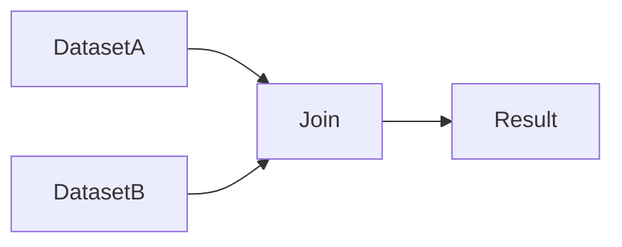

# Spark Performance Tuning

**Objective**: Tune Spark jobs and data layout for throughput and stability: data layout, execution plans, memory, and join strategies.

## Data layout matters

### Parquet

Spark reads and writes Parquet efficiently: columnar I/O, predicate pushdown, and column pruning. Use Parquet for analytical and lake storage. Follow [Parquet best practices](../../database-data/parquet.md): sensible row group size, partition columns for filters, and compression (e.g. Zstandard for cold data). Poor layout (e.g. no partitioning, huge row groups) forces full scans and hurts performance.

### Partitioning strategy

Partition data by columns used in filters and joins (e.g. date, region). Partitioning allows Spark to skip files (partition pruning) and can reduce shuffle when join keys align. Avoid over-partitioning (tiny files, many directories). Balance partition count with file size (e.g. 128–256 MB per file).

### Predicate pushdown

Push filters into the scan so the reader (Parquet, ORC) skips row groups or files. Use explicit filters in queries; avoid wrapping columns in functions that prevent pushdown when possible. Check plans with `explain()` to see whether filters are pushed to the scan.

## Execution plan analysis

### Explain plans

Use `df.explain("formatted")` or SQL `EXPLAIN EXTENDED` to inspect the logical and physical plan. Look for: filters pushed to the scan, join strategy (broadcast vs shuffle), and number of partitions in each stage. Large exchange (shuffle) or scans without predicate pushdown are tuning targets.

### Stage inspection

In the Spark UI, inspect stages: task count, shuffle read/write, and task duration distribution. Skew shows up as a few long-running tasks; many tiny tasks suggest too many partitions or small data. Use this to adjust partition count, broadcast, or skew handling.

## Memory tuning

- **Executor memory**: Set `spark.executor.memory` so that task working set, shuffle buffers, and cached data fit. Leave headroom for off-heap and GC. Very large heaps (e.g. 32 GB+) can cause long GC pauses; consider multiple executors per node with smaller heaps.
- **Off-heap memory**: Use off-heap for shuffle and cache when configured (e.g. `spark.memory.offHeap.enabled`) to reduce GC pressure. Sizing depends on workload.
- **Caching**: Cache only when a dataset is reused multiple times. Cache consumes memory; evict or unpersist when no longer needed. Use the right storage level (e.g. MEMORY_AND_DISK for large or spillable RDDs/DataFrames).

## Join strategies

- **Broadcast join**: When one side is small (e.g. under broadcast threshold), Spark can send it to every executor and avoid shuffle. Use `broadcast()` hint or set `spark.sql.autoBroadcastJoinThreshold`. Ideal for dimension tables and small lookups.
- **Shuffle join**: When both sides are large, Spark shuffles both by join key. Expensive; ensure partitions are sized and that skew is handled (salting, split skewed keys). Prefer broadcast when one side is small.

Choose broadcast when one of DatasetA/DatasetB is small; otherwise shuffle join with proper partitioning.

## Performance anti-patterns

| Anti-pattern | Problem | Prefer |
|--------------|---------|--------|
| **Wide transformations on skewed data** | A few keys get most of the data; one partition does most of the work | Salting, two-phase aggregation, or separate handling of hot keys |
| **Collecting large datasets to driver** | `collect()` pulls all data to the driver; OOM or extreme latency | Write to storage, stream, or aggregate on the cluster |
| **No predicate pushdown** | Full table scans when filters could prune | Use filter-friendly column types and avoid opaque UDFs in filters |
| **Over-caching** | Caching large datasets that are used once | Cache only when reused; unpersist when done |

## See also

- [Scaling Spark Clusters Correctly](scaling-spark.md) — Partition and executor sizing
- [Spark in Modern Data Architectures](spark-modern-architecture.md) — Lakehouse and object-storage context
- [Reproducible Data Pipelines](../../data/reproducible-data-pipelines.md) — Pipeline and layout discipline
- [Parquet](../../database-data/parquet.md) — File layout and partitioning for Spark
- [Lakehouse vs Warehouse vs Database](../../../deep-dives/lakehouse-vs-warehouse-vs-database.md) — Where Spark fits in the stack
- [Apache Spark Mastery](../../../tutorials/database-data-engineering/apache-spark-mastery.md) — API and usage patterns
