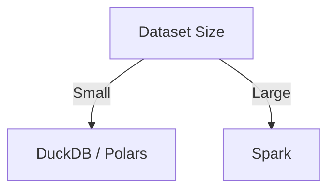

# When to Use Apache Spark (and When Not To)

**Objective**: Help engineers decide when Spark is the right tool and when alternatives are a better fit.

## What Spark is designed for

### Distributed batch processing

Spark is built for **batch workloads** that exceed single-machine capacity: scans, aggregations, and transformations over terabytes (or more) of data. The execution model—driver coordinates tasks across executors, data partitioned and processed in parallel—assumes large, bulk jobs. Use Spark when the dataset or the computation does not fit comfortably on one node.

### Large-scale ETL

Spark excels at **large-scale ETL**: reading from object storage or distributed filesystems, applying transformations (cleansing, joins, aggregations), and writing to data lakes, warehouses, or downstream systems. It integrates with Parquet, Iceberg, Delta, and cloud storage. For pipelines that process huge volumes on a schedule, Spark is a standard choice. See [Reproducible Data Pipelines](../../data/reproducible-data-pipelines.md) and [ETL Pipeline Design](../../database-data/etl-pipeline-design.md) for pipeline discipline.

### Wide transformations

Operations that **shuffle** data across the cluster—joins, wide aggregations, `groupBy` across keys—are Spark’s native territory. The engine is optimized for shuffle-heavy workloads and fault-tolerant execution. When your problem is “process and redistribute at scale,” Spark is a good fit.

## What Spark is not good at

### Small datasets

For **small or medium datasets** (e.g. under tens of GB that fit in memory or on fast local storage), Spark’s coordination and partitioning overhead often outweigh benefits. Startup cost, network and serialization overhead, and cluster management make it a poor fit for “run a query on 10 MB.” Prefer single-node or local engines.

### Low-latency microservices

Spark is **batch-oriented**. It is not designed for sub-second or low-latency request/response APIs. Using Spark to serve per-request queries or to power real-time APIs is an anti-pattern. Use a database, cache, or streaming/OLAP engine built for low latency instead.

### Single-node analytical workloads

When one machine can hold the data and run the job (e.g. DuckDB, Polars, or Pandas on a large RAM or NVMe box), a **single-node analytical engine** is usually faster and simpler. Distribution adds complexity and cost; use it only when scale demands it.

## Comparison with modern alternatives

| Tool | Best for |
|------|-----------|
| **Spark** | Distributed ETL, large batch jobs, shuffle-heavy analytics, ML pipelines at scale |
| **DuckDB** | Local analytics, single-node SQL on Parquet/CSV, embedded analytics |
| **Polars** | Fast columnar processing in-process, single-node or moderate data |
| **Dask** | Python-native scaling, familiar DataFrame API, moderate cluster size |

The break-even point between “single machine” and “Spark” depends on data size, cluster cost, and operational overhead. See [DuckDB vs PostgreSQL vs Spark](../../../deep-dives/duckdb-vs-postgres-vs-spark.md) for execution-model and economics.

## Decision diagram

Refine with: Is the workload batch ETL or ad-hoc? Do you need sub-second latency? If batch and large-scale, Spark is in scope. If small or low-latency, choose a local or OLAP-oriented tool.

## Common anti-patterns

| Anti-pattern | Problem | Prefer |
|--------------|---------|--------|
| **Spark for 10 MB datasets** | Cluster and serialization overhead dominate; slow and expensive | DuckDB, Polars, or Pandas |
| **Spark for streaming APIs** | Spark Streaming/Structured Streaming is for micro-batch, not request/response | Dedicated OLAP, cache, or streaming engine |
| **Spark when SQL warehouse would suffice** | If a cloud warehouse (Snowflake, BigQuery, etc.) can run the SQL and meet SLAs, adding Spark may add cost and complexity | Warehouse SQL, or Spark only for workloads the warehouse cannot handle |

## See also

- [Scaling Spark Clusters Correctly](scaling-spark.md) — Sizing and partitioning once you choose Spark
- [Spark in Modern Data Architectures](spark-modern-architecture.md) — Where Spark fits in lakehouse and object-storage pipelines
- [Reproducible Data Pipelines](../../data/reproducible-data-pipelines.md) — Deterministic, auditable pipelines
- [Parquet](../../database-data/parquet.md) — Format best practices for Spark inputs/outputs
- [DuckDB vs PostgreSQL vs Spark](../../../deep-dives/duckdb-vs-postgres-vs-spark.md) — When to use local vs distributed engines
- [Apache Spark Mastery](../../../tutorials/database-data-engineering/apache-spark-mastery.md) — Tutorial and API patterns
