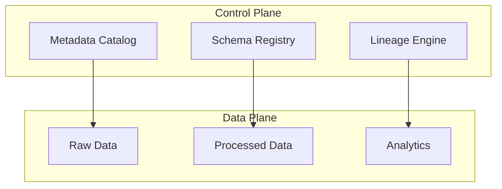

# Metadata as a Control Plane

**Objective**: Explain how metadata governs data systems and how to treat it as infrastructure rather than documentation.

## Metadata vs data

### Operational metadata

Operational metadata describes how the system runs: run IDs, schedules, task success/failure, durations, resource usage. It powers orchestration, alerting, and capacity planning. When stored and queried consistently, it becomes the source of truth for "what ran, when, and whether it succeeded."

### Schema metadata

Schema metadata describes structure: tables, columns, types, constraints, and evolution history. It enables validation at ingest and query time, safe schema evolution, and contract enforcement between producers and consumers. When enforced (e.g. via schema registries or migration checks), it prevents incompatible changes from breaking pipelines.

### Governance metadata

Governance metadata covers ownership, classification, retention, and access policy. It supports discovery, compliance, and access control. When tied to enforcement points (e.g. IAM, retention jobs), it turns policy into behavior rather than documentation.

## Metadata as infrastructure

### Dataset catalogs

Catalogs index datasets, their schemas, lineage, and ownership. They answer "what do we have and where?" and "who owns this?" Use them for discovery and as the backing store for lineage and governance metadata. Catalogs are infrastructure when they are fed automatically from pipelines and used to drive automation (e.g. access grants, retention).

### Schema registries

Schema registries store and version schemas (Avro, JSON Schema, Protobuf, etc.) and enforce compatibility rules on publish. They prevent breaking changes from reaching consumers. Treat them as required infrastructure for any system where multiple producers or consumers share a schema.

### Lineage systems

Lineage systems record how data flows from sources through transformations to sinks. They support impact analysis ("what uses this table?"), root-cause analysis ("where did this value come from?"), and compliance. Lineage is infrastructure when it is produced as a side effect of pipeline execution and kept up to date.

## Control plane vs data plane

The **data plane** carries the actual data (bytes in files, rows in tables, messages in streams). The **control plane** governs how that data is produced, moved, validated, and accessed—i.e. metadata and policy.

The control plane (catalog, registry, lineage) governs the data plane; the data plane should not drive the control plane. Decisions about what to run, what is valid, and who can access data are made from metadata, not inferred only from the data itself.

## Metadata-driven automation

### Pipeline generation

Use metadata to generate or configure pipelines: catalog entries define sources and sinks; schema and lineage define transformations and dependencies. This reduces manual wiring and keeps pipeline definitions aligned with the catalog and schema.

### Validation

Validate data against schema and quality rules at ingest or at stage boundaries. Reject or quarantine invalid data and record quality metrics in the catalog. Validation is metadata-driven when rules and thresholds are stored and versioned as metadata.

### Access governance

Tie access decisions to governance metadata: ownership, classification, and policy. Automate provisioning and deprovisioning from this metadata so that access reflects current policy without manual steps.

## Best practices

- **Treat metadata as first-class data**: Store it in versioned, queryable systems; apply the same rigor to schema and lineage as to business data.
- **Version metadata**: Schema and policy changes should be versioned and compatible where possible so that consumers can evolve predictably.
- **Enforce contracts**: Use schema registries and validation to enforce contracts at runtime; avoid "documentation only" schemas that drift from reality.

## See also

- [Reproducible Data Pipelines](reproducible-data-pipelines.md) — determinism and lineage in pipelines
- [Metadata as Infrastructure](../../deep-dives/metadata-as-infrastructure.md) — deep dive on metadata as control plane
- [Data Lineage, Contracts & Provenance](../database-data/data-lineage-contracts.md) — lineage and contract enforcement
- [Metadata, Provenance & Contracts](../data-governance/metadata-provenance-contracts.md) — governance and provenance
- [Why Most Data Pipelines Fail](../../deep-dives/why-most-data-pipelines-fail.md) — failure modes when metadata is weak
- [Why Most Data Lakes Become Data Swamps](../../deep-dives/why-data-lakes-become-swamps.md) — role of metadata in lake governance
