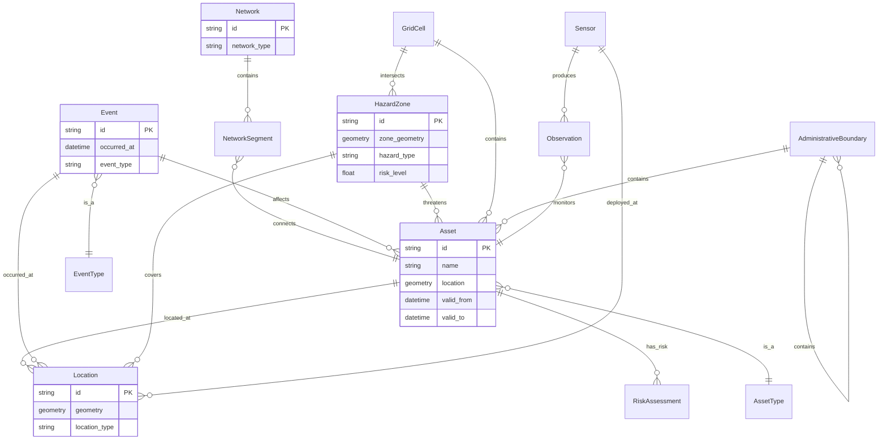
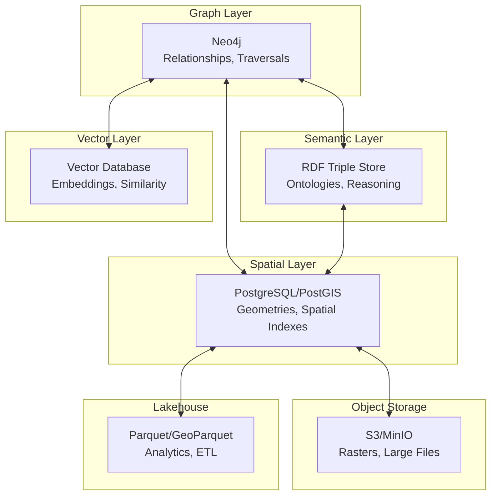
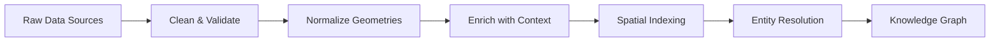
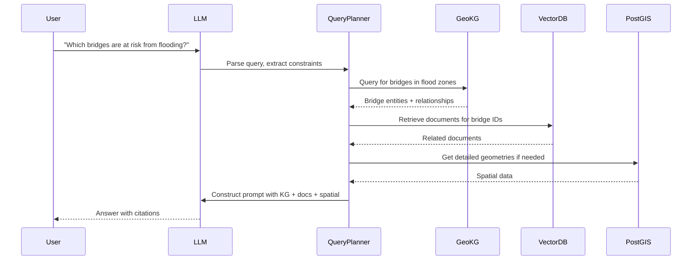

# Best Practices for Designing an AI-Ready, ML-Enabled Geospatial Knowledge Graph

**Objective**: Establish comprehensive best practices for designing, building, operating, and evolving an AI-ready, ML-enabled Geospatial Knowledge Graph (GeoKG) suitable for production environments, geospatial analytics, and advanced ML/RAG workflows. When you need to combine geospatial data with knowledge graphs, semantic layers, and ML systems—this guide provides the complete framework.

## Abstract

A Geospatial Knowledge Graph (GeoKG) integrates geospatial geometries, temporal attributes, graph relationships, and semantic layers into a unified, queryable structure that serves as the foundation for AI and ML workflows. This document provides production-grade patterns for building GeoKGs that are semantically rich, ML-friendly, observable, and governed—enabling use cases from network resilience analysis and infrastructure risk assessment to geo-aware RAG (Retrieval-Augmented Generation) and ML-assisted geocoding.

**What This Guide Covers**:
- Domain modeling for geospatial knowledge graphs
- Semantic layer design with RDF/OWL ontologies
- Physical storage and indexing architectures
- Data ingestion and graph construction pipelines
- AI/ML enablement (embeddings, graph ML, vector databases)
- RAG and LLM integration patterns
- Governance, metadata, and versioning strategies
- Performance, scalability, and operational best practices
- Security, privacy, and compliance considerations
- Production patterns, anti-patterns, and fitness functions

**Prerequisites**:
- Understanding of geospatial data (PostGIS, H3/S2, tiles, rasters, vector data)
- Familiarity with knowledge graphs (RDF/OWL, Property Graphs, SPARQL, Cypher)
- Experience with ML systems (embeddings, GNNs, vector databases, RAG)
- Knowledge of distributed systems and data engineering (ETL/ELT, data lakes, lakehouses)

**Related Documents**:
This document integrates with:
- **[Metadata Standards, Schema Governance & Data Provenance Contracts](../data-governance/metadata-provenance-contracts.md)** - Metadata and provenance
- **[Cross-System Data Lineage, Inter-Service Metadata Contracts & Provenance Enforcement](data-lineage-contracts.md)** - Lineage tracking
- **[RDF/OWL Metadata Automation](../architecture-design/rdf-owl-metadata-automation.md)** - Automated ontological associations
- **[Semantic Layer Engineering, Domain Models, and Knowledge Graph Alignment](semantic-layer-engineering.md)** - Semantic layer patterns
- **[PostgreSQL Lakehouse: PGLake, Parquet FDW, and Hybrid Storage](postgres-lakehouse-pglake-parquet-fdw.md)** - Hybrid storage patterns

## Table of Contents

1. [Introduction & Motivation](#1-introduction--motivation)
2. [Conceptual & Domain Modeling](#2-conceptual--domain-modeling)
3. [Semantic Layer & Ontologies](#3-semantic-layer--ontologies)
4. [Physical Storage & Indexing Architecture](#4-physical-storage--indexing-architecture)
5. [Data Ingestion, ETL/ELT, and Graph Construction](#5-data-ingestion-etlelt-and-graph-construction)
6. [AI/ML Enablement: Embeddings, Features, and Graph ML](#6-aiml-enablement-embeddings-features-and-graph-ml)
7. [GeoKG + RAG + LLM Integration Patterns](#7-geokg--rag--llm-integration-patterns)
8. [Governance, Metadata, and Versioning](#8-governance-metadata-and-versioning)
9. [Performance, Scalability, and Operations](#9-performance-scalability-and-operations)
10. [Security, Privacy, and Compliance](#10-security-privacy-and-compliance)
11. [Patterns, Anti-Patterns, and Architecture Fitness Functions](#11-patterns-anti-patterns-and-architecture-fitness-functions)

## Why This Matters

Geospatial knowledge graphs represent a fundamental shift in how we model, query, and reason about spatial data. Traditional geospatial systems excel at geometric operations (intersections, buffers, distance calculations) but struggle with semantic relationships, temporal dynamics, and ML integration. Knowledge graphs excel at relationship modeling and semantic reasoning but lack native geospatial capabilities.

**The Integration Challenge**: Combining these paradigms creates systems that can answer questions like:
- "Which critical infrastructure assets are within 10 minutes of a flood zone and depend on power substations that are at risk?"
- "What is the optimal routing path considering both network topology and real-time risk factors?"
- "Retrieve all bridges built before 1950 that are within 5km of earthquake fault lines and have maintenance records indicating structural concerns."

**AI/ML Readiness**: Modern AI systems require:
- **Semantic richness**: Structured relationships that capture domain knowledge
- **Multi-modal data**: Text, geometry, temporal, and graph structure
- **Embedding-friendly representations**: Entities and relationships that can be vectorized
- **Queryable structure**: Graph queries that complement vector similarity search
- **Provenance and lineage**: Metadata that enables model interpretability and debugging

**Production Requirements**: A production GeoKG must be:
- **Scalable**: Handle billions of nodes and edges across multiple regions
- **Performant**: Sub-second queries for common patterns, acceptable latency for complex traversals
- **Observable**: Metrics, tracing, and logging that reveal system behavior
- **Governed**: Versioning, access control, data quality, and compliance
- **Evolvable**: Schema changes, ontology updates, and data migrations without downtime

This guide provides the patterns, architectures, and practices needed to build such systems.

---

## 1. Introduction & Motivation

### 1.1 What is a Geospatial Knowledge Graph (GeoKG)?

A Geospatial Knowledge Graph (GeoKG) is a knowledge graph where nodes represent entities with geospatial properties (locations, regions, assets, events) and edges represent relationships that may be spatial (e.g., `located_in`, `adjacent_to`, `within_distance_of`), temporal (e.g., `occurred_during`, `valid_from`), semantic (e.g., `depends_on`, `affects`, `part_of`), or hybrid (e.g., `within_time_isochrone_of`).

**Key Characteristics**:

1. **Spatial Entities**: Nodes have geometric representations (points, lines, polygons, rasters) or spatial references (H3/S2 cells, administrative boundaries, linear references)
2. **Temporal Attributes**: Entities and relationships have temporal validity (valid time, transaction time, event timestamps)
3. **Graph Structure**: Rich relationship modeling beyond simple spatial containment
4. **Semantic Layer**: Ontological classification and property definitions (RDF/OWL, SKOS)
5. **ML Integration**: Embeddings, features, and graph ML capabilities built-in

### 1.2 Why Combine Geospatial, Graph, Semantic, and ML?

**Geospatial + Graph**: Spatial relationships (proximity, containment, connectivity) are naturally graph-structured. Roads connect to intersections, administrative boundaries nest hierarchically, and infrastructure networks form complex topologies.

**Graph + Semantics**: Ontologies provide shared vocabulary and enable reasoning. "A bridge is a type of infrastructure asset that spans a waterway" is both a graph relationship and a semantic assertion.

**Semantics + ML**: Ontological structure provides features for ML models (class hierarchies, property types, relationship patterns). ML models can learn from both graph structure and semantic labels.

**ML + Geospatial**: Spatial embeddings capture location semantics (e.g., "downtown" vs "suburban"), and graph ML can predict spatial relationships (e.g., "which roads are likely to flood?").

### 1.3 Core Use Cases

#### Network Resilience & Routing
- **Question**: "Find all alternative routes between two points that avoid high-risk areas and maintain connectivity if primary routes fail."
- **GeoKG Enables**: Graph traversal with spatial constraints, risk scoring per edge, temporal availability (e.g., seasonal closures)

#### Infrastructure Risk Assessment
- **Question**: "Identify critical infrastructure assets at risk from natural hazards, considering both direct spatial exposure and dependency chains."
- **GeoKG Enables**: Spatial intersection queries, dependency graph traversal, risk propagation modeling

#### Asset Management
- **Question**: "Track maintenance history, spatial relationships, and dependencies for all bridges in a transportation network."
- **GeoKG Enables**: Temporal queries, relationship traversal, provenance tracking

#### Proximity + Semantics
- **Question**: "Find all critical bridges within 10 minutes of response time from fire stations, considering road network topology."
- **GeoKG Enables**: Isochrone calculations, graph-based routing, semantic filtering (criticality classification)

#### ML-Assisted Geocoding
- **Question**: "Resolve ambiguous place names to precise locations using context (nearby landmarks, administrative boundaries, historical references)."
- **GeoKG Enables**: Entity resolution using graph structure, embeddings for similarity matching, semantic disambiguation

#### Geo-Aware RAG (Retrieval-Augmented Generation)
- **Question**: "Answer questions about regional infrastructure using both structured KG queries and unstructured documents, with spatial context."
- **GeoKG Enables**: Hybrid retrieval (graph + vector), spatial filtering, semantic reasoning, prompt construction from KG subgraphs

---

## 2. Conceptual & Domain Modeling

### 2.1 Domain Model Design

A well-designed GeoKG domain model separates concerns between core domain entities, technical artifacts, and operational metadata.

#### Core Domain Entities

**Assets**:
- Infrastructure assets (bridges, roads, power lines, water mains, buildings)
- Natural features (rivers, mountains, fault lines)
- Administrative boundaries (cities, counties, states, countries)
- Grid cells (H3, S2, custom grids for analysis)

**Locations**:
- Points of interest (POIs)
- Addresses and geocoded locations
- Regions (administrative, natural, custom)
- Linear features (roads, railways, pipelines)

**Networks**:
- Transportation networks (road, rail, air)
- Utility networks (power, water, gas, telecom)
- Social networks (communities, organizations)
- Dependency networks (infrastructure dependencies)

**Events**:
- Natural hazards (floods, earthquakes, wildfires)
- Incidents (accidents, outages, maintenance)
- Sensor readings (traffic, weather, structural health)
- Scheduled events (maintenance windows, closures)

**Hazards & Risks**:
- Hazard zones (flood plains, earthquake zones, wildfire risk areas)
- Risk assessments (per asset, per region, temporal)
- Vulnerability models

**Sensors & Observations**:
- Sensor deployments (locations, types, capabilities)
- Time-series observations
- Derived metrics and aggregations

#### Relationships

**Spatial Relationships**:
- `located_in`: Point/line/polygon containment
- `adjacent_to`: Spatial adjacency (shares boundary)
- `within_distance_of`: Proximity (with distance threshold)
- `intersects`: Geometric intersection
- `within_time_isochrone_of`: Reachable within time budget via network

**Topological Relationships**:
- `connected_to`: Network connectivity (roads, utilities)
- `flows_through`: Flow relationships (water, traffic, data)
- `depends_on`: Dependency (infrastructure, services)
- `serves`: Service relationships (power grid serves region)

**Temporal Relationships**:
- `occurred_during`: Event timing
- `valid_from` / `valid_to`: Temporal validity
- `preceded_by` / `followed_by`: Temporal ordering
- `scheduled_for`: Future events

**Semantic Relationships**:
- `is_a` / `type_of`: Classification
- `part_of` / `contains`: Composition
- `affects` / `impacted_by`: Causal relationships
- `managed_by` / `owned_by`: Ownership/management

**Hybrid Relationships**:
- `at_risk_from`: Spatial + semantic (asset within hazard zone)
- `accessible_via`: Spatial + temporal (reachable via network within time)

### 2.2 Separation of Concerns

**Core Domain vs. Technical Artifacts**:

- **Domain Entities**: Bridges, roads, regions, events (what the business cares about)
- **Technical Artifacts**: Tiles, rasters, vector layers, indexes (implementation details)

**Semantic Entities vs. Operational Nodes**:

- **Semantic Entities**: Real-world entities with ontological classification
- **Operational Nodes**: ETL jobs, API endpoints, data sources (supporting infrastructure)

**Best Practice**: Keep domain entities in the KG; reference technical artifacts (e.g., "Bridge X has geometry stored in PostGIS table Y, tile Z").

### 2.3 Multi-Scale Spatial Modeling

Geospatial data exists at multiple scales, and a GeoKG must model this hierarchy.

#### Grid-Based Indexing

**H3 (Uber's Hexagonal Grid)**:
- Hierarchical: 16 resolutions (0 = global, 15 = ~1m)
- Hexagonal cells for uniform area coverage
- Each cell has 7 neighbors (vs 8 for square grids)
- Use cases: Aggregation, proximity queries, heatmaps

**S2 (Google's Spherical Geometry)**:
- Hierarchical: 30 levels
- Spherical geometry (handles poles correctly)
- Use cases: Global indexing, spherical queries

**Custom Grids**:
- Administrative grids (census tracts, ZIP codes)
- Analysis-specific grids (risk zones, service areas)
- Regular grids (1km squares, custom projections)

**Modeling Pattern**: Grid cells as first-class KG nodes:
```
GridCell (H3:8a2b10726b7ffff) 
  → contains → Bridge (bridge_12345)
  → intersects → FloodZone (flood_zone_678)
  → aggregates → TrafficVolume (avg_daily_traffic)
```

#### Administrative Boundaries

Model hierarchical administrative structures:
```
Country (USA)
  → contains → State (California)
    → contains → County (Los Angeles)
      → contains → City (Los Angeles)
        → contains → Neighborhood (Downtown)
```

**Best Practice**: Use both geometric containment and explicit `contains` edges for query flexibility.

#### Linear Referencing

For linear features (roads, railways, pipelines):
```
Road (highway_101)
  → has_segment → RoadSegment (segment_1, from_mile: 0, to_mile: 5.2)
    → located_at → Point (lat: 34.052, lon: -118.243, mile_marker: 2.5)
```

### 2.4 Temporal Modeling

GeoKGs must handle temporal validity for both entities and relationships.

#### Valid Time vs Transaction Time

**Valid Time**: When the fact was true in the real world
- "Bridge X was built in 1950" → valid_from: 1950-01-01
- "Road Y was closed for maintenance" → valid_from: 2024-01-15, valid_to: 2024-01-20

**Transaction Time**: When the fact was recorded in the system
- "This record was added on 2024-01-10" → transaction_time: 2024-01-10

**Best Practice**: Track both for auditability and time-travel queries.

#### Events and Intervals

**Point Events**: Occur at a specific time
```
Earthquake (event_123)
  → occurred_at → Timestamp (2024-01-15T10:30:00Z)
  → located_at → Point (lat: 34.052, lon: -118.243)
```

**Interval Events**: Occur over a time range
```
MaintenanceWindow (maintenance_456)
  → started_at → Timestamp (2024-01-15T00:00:00Z)
  → ended_at → Timestamp (2024-01-20T23:59:59Z)
  → affects → Road (highway_101)
```

#### Time-Aware Edges

Relationships that exist only during specific intervals:
```
Bridge (bridge_123)
  → depends_on [valid_from: 1950-01-01, valid_to: 2020-06-15] → PowerSubstation (substation_old)
  → depends_on [valid_from: 2020-06-15] → PowerSubstation (substation_new)
```

### 2.5 Domain Model Diagram



---

## 3. Semantic Layer & Ontologies

### 3.1 RDF/OWL Ontologies for GeoKG

An AI-ready GeoKG requires a well-designed semantic layer that provides:
- **Shared Vocabulary**: Consistent terminology across systems
- **Reasoning Capabilities**: Inference of implicit relationships
- **ML Features**: Ontological structure as features for ML models
- **Interoperability**: Standards-based representation (RDF/OWL, GeoSPARQL)

#### Core Ontology Design Principles

**Limited but Expressive Hierarchies**:
- Avoid overly deep class hierarchies (>5 levels) that ML models struggle with
- Use property chains and restrictions for complex relationships
- Prefer composition over deep inheritance

**Property Naming Conventions**:
- Use clear, domain-specific property names (`geo:locatedIn`, `infra:dependsOn`)
- Follow GeoSPARQL and OGC naming patterns where applicable
- Avoid abbreviations unless universally understood

**IRI and Namespace Strategy**:
```
http://example.org/geo#     → GeoKG core spatial concepts
http://example.org/infra#   → Infrastructure domain
http://example.org/risk#    → Risk and hazard concepts
http://example.org/time#    → Temporal concepts
```

### 3.2 Class Hierarchies

#### Asset Hierarchy
```turtle
@prefix geo: <http://example.org/geo#> .
@prefix infra: <http://example.org/infra#> .
@prefix rdfs: <http://www.w3.org/2000/01/rdf-schema#> .
@prefix owl: <http://www.w3.org/2002/07/owl#> .

geo:Asset a owl:Class ;
    rdfs:label "Asset" ;
    rdfs:comment "Base class for all geospatial assets" .

infra:InfrastructureAsset rdfs:subClassOf geo:Asset ;
    rdfs:label "Infrastructure Asset" .

infra:Bridge rdfs:subClassOf infra:InfrastructureAsset ;
    rdfs:label "Bridge" ;
    rdfs:comment "A structure that spans a physical obstacle" .

infra:Road rdfs:subClassOf infra:InfrastructureAsset ;
    rdfs:label "Road" .

infra:PowerSubstation rdfs:subClassOf infra:InfrastructureAsset ;
    rdfs:label "Power Substation" .
```

#### Location Hierarchy
```turtle
geo:Location a owl:Class ;
    rdfs:label "Location" .

geo:PointLocation rdfs:subClassOf geo:Location ;
    rdfs:label "Point Location" .

geo:LinearLocation rdfs:subClassOf geo:Location ;
    rdfs:label "Linear Location" .

geo:ArealLocation rdfs:subClassOf geo:Location ;
    rdfs:label "Areal Location" .

geo:AdministrativeBoundary rdfs:subClassOf geo:ArealLocation ;
    rdfs:label "Administrative Boundary" .
```

### 3.3 Property Definitions

#### Spatial Properties
```turtle
geo:locatedIn a owl:ObjectProperty ;
    rdfs:domain geo:Asset ;
    rdfs:range geo:Location ;
    rdfs:label "located in" ;
    rdfs:comment "Spatial containment relationship" .

geo:adjacentTo a owl:SymmetricProperty, owl:ObjectProperty ;
    rdfs:domain geo:Location ;
    rdfs:range geo:Location ;
    rdfs:label "adjacent to" .

geo:withinDistanceOf a owl:ObjectProperty ;
    rdfs:domain geo:Location ;
    rdfs:range geo:Location ;
    rdfs:label "within distance of" ;
    geo:hasDistanceThreshold a owl:DatatypeProperty .
```

#### Temporal Properties
```turtle
time:validFrom a owl:DatatypeProperty ;
    rdfs:domain owl:Thing ;
    rdfs:range xsd:dateTime ;
    rdfs:label "valid from" .

time:validTo a owl:DatatypeProperty ;
    rdfs:domain owl:Thing ;
    rdfs:range xsd:dateTime ;
    rdfs:label "valid to" .
```

### 3.4 GeoSPARQL Integration

GeoSPARQL extends SPARQL with geospatial query capabilities:

```sparql
PREFIX geo: <http://www.opengis.net/ont/geosparql#>
PREFIX infra: <http://example.org/infra#>

SELECT ?bridge ?floodZone
WHERE {
    ?bridge a infra:Bridge .
    ?floodZone a geo:FloodZone .
    ?bridge geo:hasGeometry ?bridgeGeom .
    ?floodZone geo:hasGeometry ?floodGeom .
    FILTER geo:sfIntersects(?bridgeGeom, ?floodGeom)
}
```

### 3.5 Mapping from Relational/Parquet to RDF

**PostGIS to RDF Mapping**:
```python
def postgis_to_rdf(row, entity_type, geometry_column='geometry'):
    """Convert PostGIS row to RDF triples."""
    entity_id = f"http://example.org/{entity_type}/{row['id']}"
    triples = [
        (entity_id, RDF.type, f"http://example.org/{entity_type}"),
        (entity_id, RDFS.label, Literal(row['name']))
    ]
    
    # Convert geometry to GeoSPARQL
    if geometry_column in row:
        geom_wkt = row[geometry_column]
        geom_iri = f"{entity_id}/geometry"
        triples.extend([
            (entity_id, GEO.hasGeometry, geom_iri),
            (geom_iri, GEO.asWKT, Literal(geom_wkt, datatype=GEO.wktLiteral))
        ])
    
    return triples
```

**Parquet to RDF Mapping**:
```python
def parquet_to_rdf(df, entity_type, id_column='id', geometry_column=None):
    """Convert Parquet DataFrame to RDF triples."""
    triples = []
    for _, row in df.iterrows():
        entity_id = f"http://example.org/{entity_type}/{row[id_column]}"
        triples.append((entity_id, RDF.type, f"http://example.org/{entity_type}"))
        
        # Add properties
        for col in df.columns:
            if col != id_column and col != geometry_column:
                triples.append((entity_id, f"http://example.org/prop/{col}", Literal(row[col])))
        
        # Handle geometry if present
        if geometry_column and geometry_column in row:
            geom_wkt = row[geometry_column]
            geom_iri = f"{entity_id}/geometry"
            triples.extend([
                (entity_id, GEO.hasGeometry, geom_iri),
                (geom_iri, GEO.asWKT, Literal(geom_wkt, datatype=GEO.wktLiteral))
            ])
    
    return triples
```

### 3.6 ML-Friendly Ontology Design

**Feature Engineering from Ontology**:
- **Class Depth**: Distance from root class (e.g., `Bridge` → `InfrastructureAsset` → `Asset` = depth 2)
- **Sibling Count**: Number of sibling classes (diversity of types at same level)
- **Property Count**: Number of properties defined for a class
- **Relationship Patterns**: Common relationship types (e.g., all bridges have `spans` relationship)

**Best Practice**: Keep ontology shallow (3-5 levels max) and wide (many sibling classes) for better ML feature extraction.

---

## 4. Physical Storage & Indexing Architecture

### 4.1 Storage Options

#### Option 1: Property Graph Database (Neo4j, JanusGraph)

**Pros**:
- Native graph operations (traversals, shortest path)
- Rich query language (Cypher, Gremlin)
- Good performance for relationship-heavy queries

**Cons**:
- Limited geospatial capabilities (requires extensions)
- Scaling challenges for very large graphs
- May require separate PostGIS for complex spatial operations

**Architecture Pattern**:
```
Neo4j (graph structure, relationships)
  ←→ PostGIS (geometries, spatial indexes)
  ←→ Object Store (rasters, large geometries)
```

#### Option 2: RDF Triple Store (GraphDB, Stardog, Blazegraph)

**Pros**:
- Standards-based (RDF/OWL, SPARQL)
- Built-in reasoning capabilities
- Semantic query support

**Cons**:
- Geospatial support varies (GeoSPARQL implementation quality)
- Performance can be slower than property graphs
- Less intuitive for developers unfamiliar with RDF

**Architecture Pattern**:
```
RDF Triple Store (semantic layer, relationships)
  ←→ PostGIS (geometries, spatial operations)
  ←→ Vector DB (embeddings)
```

#### Option 3: Postgres/PostGIS + Graph Extensions + FDW

**Pros**:
- Excellent geospatial capabilities (PostGIS)
- Mature, proven technology
- Can use pgRouting for network analysis
- Foreign Data Wrappers (FDW) for hybrid storage

**Cons**:
- Graph operations require extensions (AGE, pgRouting)
- May be slower for deep traversals than native graph DBs
- SQL is less intuitive for graph queries than Cypher/SPARQL

**Architecture Pattern**:
```
PostgreSQL/PostGIS (primary storage)
  + AGE (Apache AGE) extension (graph queries)
  + pgRouting (network analysis)
  + Parquet FDW (lakehouse integration)
  + Vector extension (pgvector) (embeddings)
```

#### Option 4: Hybrid Architecture (Recommended for Production)

**Best Practice**: Use a hybrid approach that leverages strengths of each system:



### 4.2 Spatial Indexing

#### PostGIS Indexes

**GIST (Generalized Search Tree)**:
```sql
CREATE INDEX idx_bridges_geometry ON bridges USING GIST (geometry);
CREATE INDEX idx_roads_geometry ON roads USING GIST (geometry);
```

**SP-GIST (Space-Partitioned GIST)**:
- Better for non-overlapping geometries (e.g., administrative boundaries)

**BRIN (Block Range Index)**:
- Efficient for large, sorted datasets (e.g., time-series sensor data)

#### H3/S2 Indexing

**H3 Index Pattern**:
```python
import h3

def index_entity_by_h3(entity, resolution=10):
    """Index entity by H3 cell."""
    lat, lon = entity.geometry.centroid
    h3_cell = h3.geo_to_h3(lat, lon, resolution)
    
    # Create KG relationship
    kg.add_triple(
        subject=f"http://example.org/entity/{entity.id}",
        predicate="http://example.org/geo#indexedByH3",
        object=f"http://example.org/h3/{h3_cell}"
    )
    
    # Also index the H3 cell as a node
    kg.add_triple(
        subject=f"http://example.org/h3/{h3_cell}",
        predicate="http://www.w3.org/1999/02/22-rdf-syntax-ns#type",
        object="http://example.org/geo#H3Cell"
    )
```

**Query Pattern**:
```cypher
// Find all bridges within H3 cell and neighbors
MATCH (cell:H3Cell {id: $h3_cell})
MATCH (neighbor:H3Cell)-[:NEIGHBOR_OF]->(cell)
MATCH (bridge:Bridge)-[:INDEXED_BY_H3]->(neighbor)
RETURN bridge
```

### 4.3 Graph Indexing

#### Relationship Type Indexes

**Neo4j**:
```cypher
CREATE INDEX rel_type_index FOR ()-[r:DEPENDS_ON]-() ON (r.valid_from, r.valid_to);
```

**PostgreSQL/AGE**:
```sql
CREATE INDEX idx_depends_on ON edges(rel_type, valid_from, valid_to) 
WHERE rel_type = 'depends_on';
```

#### Path Query Optimization

**Materialized Paths**:
- Precompute common paths (e.g., all roads connecting two cities)
- Store as edges with `path_type` property
- Refresh periodically or on-demand

**Shortest Path Indexes**:
- Use graph algorithms (Dijkstra, A*) with spatial constraints
- Cache results for common origin-destination pairs

### 4.4 Sharding & Partitioning

#### By Region
```sql
-- Partition by geographic region
CREATE TABLE bridges_west PARTITION OF bridges
    FOR VALUES IN ('CA', 'OR', 'WA', 'NV', 'AZ');

CREATE TABLE bridges_east PARTITION OF bridges
    FOR VALUES IN ('NY', 'MA', 'FL', 'TX');
```

#### By H3 Resolution
```python
# Shard by H3 cell at resolution 7 (~5km cells)
def get_shard_for_entity(entity):
    h3_cell = h3.geo_to_h3(
        entity.geometry.centroid.y,
        entity.geometry.centroid.x,
        resolution=7
    )
    return f"shard_{h3_cell[:3]}"  # Use first 3 chars for shard key
```

#### By Domain
- Separate shards for different domains (transportation, utilities, hazards)
- Cross-domain queries require federation

### 4.5 Integration with Data Lake/Lakehouse

**Parquet/GeoParquet as External Facts**:
```sql
-- Use Parquet FDW for analytics
CREATE FOREIGN TABLE bridges_analytics (
    id TEXT,
    name TEXT,
    geometry GEOMETRY,
    traffic_volume INTEGER,
    last_inspection DATE
) SERVER parquet_srv
OPTIONS (filename '/data/bridges.parquet');

-- Query from KG and Parquet
SELECT 
    kg.bridge_id,
    kg.depends_on,
    parquet.traffic_volume
FROM knowledge_graph_bridges kg
JOIN bridges_analytics parquet ON kg.bridge_id = parquet.id;
```

**Object Storage for Rasters**:
- Store large rasters (DEM, satellite imagery) in S3/MinIO
- Reference from KG: `Bridge → hasElevationModel → s3://bucket/elevation.tif`

---

## 5. Data Ingestion, ETL/ELT, and Graph Construction

### 5.1 Data Sources

#### OpenStreetMap (OSM)
- **Format**: XML, PBF (Protocol Buffer Format)
- **Content**: Roads, buildings, POIs, administrative boundaries
- **Processing**: Use `osmium`, `osm2pgsql`, or `osmnx` for extraction

#### TIGER/Line (US Census)
- **Format**: Shapefiles
- **Content**: Roads, administrative boundaries, water features
- **Processing**: Use `geopandas` or PostGIS `shp2pgsql`

#### HIFLD (Homeland Infrastructure Foundation-Level Data)
- **Format**: Shapefiles, GeoJSON
- **Content**: Critical infrastructure (power plants, hospitals, schools)
- **Processing**: Standard geospatial ETL pipelines

#### Custom Sources
- GPS tracks, sensor readings, maintenance records
- Raster data (DEM, satellite imagery, risk maps)
- Tabular data with geocoded addresses

### 5.2 Pipeline Architecture

**Ingest → Clean → Normalize → Enrich → Index → Link → Write-to-KG**



### 5.3 ID Strategies

**Stable Identifiers**:
- Use deterministic IDs based on source + natural key
- Example: `bridge_osm_way_12345` or `bridge_nbi_12345`
- Avoid UUIDs for entities that should be deduplicated

**Handling Evolving Geometries**:
- Store geometry versions with `valid_from` / `valid_to`
- Create new entity version when geometry changes significantly
- Link versions with `replaced_by` / `replaces` relationships

### 5.4 Deduplication & Entity Resolution

#### Spatial + Textual Similarity

```python
def resolve_entities(entity1, entity2, spatial_threshold=100, text_threshold=0.8):
    """Resolve if two entities are the same."""
    # Spatial similarity
    distance = entity1.geometry.distance(entity2.geometry)
    if distance > spatial_threshold:  # meters
        return False
    
    # Textual similarity
    name_similarity = jaccard_similarity(entity1.name, entity2.name)
    if name_similarity < text_threshold:
        return False
    
    # Additional checks: type, properties
    if entity1.type != entity2.type:
        return False
    
    return True
```

#### Schema-Level Cues

- Use ontological relationships (e.g., `is_a Bridge`) to constrain matching
- Leverage property patterns (e.g., bridges have `spans` relationship)
- Consider temporal validity (don't match entities from different time periods)

### 5.5 Batch vs. Streaming

#### Batch Processing
- **Use Cases**: Initial KG construction, periodic updates, schema migrations
- **Tools**: Prefect, Airflow, Spark
- **Pattern**: Full or incremental batch loads

#### Streaming Updates
- **Use Cases**: Real-time incidents, sensor readings, live GPS tracks
- **Tools**: Kafka, Pulsar, Kinesis
- **Pattern**: Event-driven graph updates

**Hybrid Approach**:
- Streaming for high-frequency, low-latency updates
- Batch for complex transformations and periodic re-indexing

---

## 6. AI/ML Enablement: Embeddings, Features, and Graph ML

### 6.1 Embedding Strategies

#### Text Embeddings

**Entity Descriptions**:
```python
from sentence_transformers import SentenceTransformer

model = SentenceTransformer('all-MiniLM-L6-v2')

def embed_entity(entity):
    """Generate text embedding for entity."""
    text = f"{entity.name} {entity.description} {entity.type}"
    if entity.properties:
        text += " " + " ".join(f"{k}:{v}" for k, v in entity.properties.items())
    
    embedding = model.encode(text)
    return embedding
```

**Relationship Descriptions**:
- Embed relationship types and properties
- Example: `depends_on[valid_from:2020, criticality:high]`

#### Graph Embeddings

**Node2Vec**:
```python
import node2vec
import networkx as nx

def generate_node2vec_embeddings(kg_graph, dimensions=128):
    """Generate Node2Vec embeddings for KG nodes."""
    # Convert KG to NetworkX
    G = nx.Graph()
    for node in kg_graph.nodes:
        G.add_node(node.id, **node.properties)
    for edge in kg_graph.edges:
        G.add_edge(edge.from_node, edge.to_node, **edge.properties)
    
    # Generate embeddings
    n2v = node2vec.Node2Vec(G, dimensions=dimensions, walk_length=30, num_walks=200)
    model = n2v.fit(window=10, min_count=1)
    
    return {node: model.wv[node] for node in G.nodes()}
```

**GraphSAGE**:
- Inductive graph neural network
- Can embed new nodes without retraining
- Good for dynamic graphs

**GNNs (Graph Neural Networks)**:
- Use PyTorch Geometric or DGL
- Learn node representations from graph structure and node features
- Can be trained for specific tasks (link prediction, node classification)

#### Spatial Embeddings

**Location Semantics**:
```python
def embed_location(location, context_features):
    """Generate spatial embedding considering context."""
    # Base location embedding (lat/lon normalized)
    base_embedding = [
        normalize_lat(location.lat),
        normalize_lon(location.lon)
    ]
    
    # Context features
    context = [
        is_urban(location),
        is_coastal(location),
        elevation(location),
        population_density(location),
        nearby_poi_count(location)
    ]
    
    # Combine
    embedding = base_embedding + context
    return embedding
```

#### Multi-Modal Embeddings

**Combine Text + Graph + Spatial**:
```python
def multi_modal_embedding(entity):
    """Generate multi-modal embedding."""
    text_emb = embed_entity(entity)  # 384 dim
    graph_emb = get_graph_embedding(entity.id)  # 128 dim
    spatial_emb = embed_location(entity.location)  # 64 dim
    
    # Concatenate or use learned fusion
    combined = np.concatenate([text_emb, graph_emb, spatial_emb])
    return combined
```

### 6.2 Feature Engineering

#### Node Features

**Count Features**:
- Degree (total connections)
- In-degree / Out-degree
- Neighbors by type (e.g., number of bridges connected to this road)
- Relationship type distribution

**Spatial Features**:
- Distance to nearest critical asset
- Risk score (aggregated from hazard zones)
- Isochrone accessibility (reachable within time budget)
- Elevation, slope, proximity to water

**Temporal Features**:
- Age (time since creation)
- Last update recency
- Event frequency (number of incidents in last year)
- Maintenance frequency

**Ontological Features**:
- Class depth in hierarchy
- Sibling count
- Property count
- Relationship pattern matches

#### Edge Features

**Spatial Edge Features**:
- Distance (Euclidean, network distance)
- Shared boundary length
- Overlap area

**Temporal Edge Features**:
- Relationship duration
- Time since relationship established
- Temporal validity window

**Graph Structure Features**:
- Edge betweenness centrality
- Common neighbors count
- Path length (shortest path between nodes)

### 6.3 Graph ML Tasks

#### Link Prediction

**Problem**: Predict missing relationships (e.g., "Which bridges depend on which power substations?")

**Approach**:
```python
from sklearn.ensemble import RandomForestClassifier
import networkx as nx

def train_link_predictor(kg_graph, positive_edges, negative_edges):
    """Train link prediction model."""
    # Extract features for positive and negative edges
    X_pos = [extract_edge_features(e) for e in positive_edges]
    X_neg = [extract_edge_features(e) for e in negative_edges]
    
    X = X_pos + X_neg
    y = [1] * len(positive_edges) + [0] * len(negative_edges)
    
    model = RandomForestClassifier()
    model.fit(X, y)
    
    return model
```

#### Node Classification

**Problem**: Classify nodes (e.g., "Is this bridge at high risk?")

**Approach**: Use GNNs or traditional ML with graph features

#### Path Ranking

**Problem**: Rank paths by multiple criteria (distance, risk, time)

**Approach**: Multi-objective optimization with learned weights

#### Community Detection

**Problem**: Identify clusters of related assets (e.g., infrastructure networks)

**Approach**: Use Louvain, Leiden, or spectral clustering on graph

### 6.4 Vector Database Integration

#### Indexing KG Nodes/Edges

**Chroma / Pinecone / Weaviate**:
```python
import chromadb

client = chromadb.Client()
collection = client.create_collection("geokg_entities")

# Index entities
for entity in kg_entities:
    embedding = multi_modal_embedding(entity)
    collection.add(
        ids=[entity.id],
        embeddings=[embedding.tolist()],
        metadatas=[{
            "type": entity.type,
            "name": entity.name,
            "h3_cell": entity.h3_index
        }]
    )
```

**Query Pattern**:
```python
def hybrid_search(query_text, spatial_filter=None, graph_filter=None):
    """Hybrid search combining vector similarity and graph structure."""
    # Vector similarity search
    query_embedding = embed_text(query_text)
    vector_results = collection.query(
        query_embeddings=[query_embedding],
        n_results=100
    )
    
    # Apply spatial filter
    if spatial_filter:
        vector_results = filter_spatial(vector_results, spatial_filter)
    
    # Apply graph filter (e.g., only bridges)
    if graph_filter:
        vector_results = filter_graph(vector_results, graph_filter)
    
    return vector_results
```

### 6.5 ML Lifecycle

#### Data Snapshots
- Create KG snapshots for training data
- Version snapshots with timestamps
- Link model versions to KG schema versions

#### Feature Store Integration
- Store computed features in feature store (Feast, Tecton)
- Reference KG entities in feature definitions
- Enable feature versioning and lineage

#### Model Versioning
- Link model versions to KG schema/ontology versions
- Track which entities/relationships were used for training
- Enable model interpretability through KG structure

---

## 7. GeoKG + RAG + LLM Integration Patterns

### 7.1 RAG Patterns

#### KG-Driven Retrieval

**Query Flow**:
1. Parse natural language query
2. Extract spatial and semantic constraints
3. Query KG for relevant subgraph
4. Retrieve related documents using entity IDs
5. Construct prompt with KG context + documents

```python
def rag_query(query_text, llm):
    """RAG query using GeoKG."""
    # Step 1: Extract entities and spatial constraints
    entities, spatial_filter = extract_from_query(query_text)
    
    # Step 2: Query KG
    kg_subgraph = query_kg(entities, spatial_filter)
    
    # Step 3: Retrieve documents
    entity_ids = [e.id for e in kg_subgraph.nodes]
    documents = vector_db.query_by_entities(entity_ids)
    
    # Step 4: Construct prompt
    kg_context = serialize_subgraph(kg_subgraph)
    prompt = f"""
    Context from Knowledge Graph:
    {kg_context}
    
    Related Documents:
    {format_documents(documents)}
    
    Question: {query_text}
    """
    
    # Step 5: Generate answer
    answer = llm.generate(prompt)
    return answer
```

### 7.2 Query Planning

**When to Use KG vs Raster/Vector vs Textual Index**:

- **KG Queries**: Relationship traversal, semantic reasoning, dependency chains
- **Raster/Vector Queries**: Geometric operations, spatial analysis, proximity
- **Textual Index**: Full-text search, document retrieval, keyword matching

**Hybrid Query Planning**:
```python
def plan_query(query):
    """Plan query execution across multiple backends."""
    if requires_relationships(query):
        use_kg = True
    if requires_geometry(query):
        use_postgis = True
    if requires_documents(query):
        use_vector_db = True
    
    # Execute in parallel, merge results
    results = execute_hybrid(kg_query, postgis_query, vector_query)
    return merge_results(results)
```

### 7.3 Prompting Strategies

#### Serializing KG Subgraphs

**Structured Format**:
```
Entities:
- Bridge_12345 (type: Bridge, location: 34.052, -118.243)
  - depends_on: PowerSubstation_67890
  - located_in: Los_Angeles_County
  - at_risk_from: FloodZone_ABC

Relationships:
- Bridge_12345 --[depends_on]--> PowerSubstation_67890
- Bridge_12345 --[at_risk_from]--> FloodZone_ABC
```

#### Summarizing Local Neighborhoods

```python
def summarize_neighborhood(entity, radius=5):
    """Summarize entity neighborhood for LLM context."""
    neighbors = get_neighbors_within_radius(entity, radius)
    
    summary = f"""
    {entity.name} ({entity.type}) is located at {entity.location}.
    
    Nearby entities:
    {format_entities(neighbors[:10])}
    
    Key relationships:
    {format_relationships(entity.relationships[:5])}
    """
    
    return summary
```

### 7.4 Tooling & Agentic Workflows

#### MCP (Model Context Protocol) Integration

```python
@mcp_tool
def query_geokg(query: str, spatial_filter: dict = None):
    """Query GeoKG via MCP."""
    results = execute_kg_query(query, spatial_filter)
    return format_for_llm(results)

@mcp_tool
def get_spatial_context(location: dict, radius: float):
    """Get spatial context for location."""
    entities = query_within_radius(location, radius)
    return format_entities(entities)
```

#### Agentic Workflow

```python
def agentic_geokg_query(user_query):
    """Agentic workflow for GeoKG queries."""
    agent = Agent(
        tools=[query_geokg, get_spatial_context, query_postgis, search_documents],
        llm=llm
    )
    
    # Agent decides which tools to use based on query
    result = agent.run(user_query)
    return result
```

### 7.5 RAG Sequence Diagram



---

## 8. Governance, Metadata, and Versioning

### 8.1 Metadata Management

#### Provenance

**Entity-Level Provenance**:
```python
@dataclass
class EntityProvenance:
    entity_id: str
    source: str  # OSM, TIGER, HIFLD, custom
    source_id: str  # Original ID in source system
    ingested_at: datetime
    last_updated: datetime
    confidence_score: float  # 0-1, data quality confidence
    transformation_history: List[str]  # ETL steps applied
```

**Relationship Provenance**:
- Track how relationships were derived (explicit, inferred, ML-predicted)
- Store confidence scores for ML-predicted relationships
- Maintain lineage of relationship changes

#### Lineage

**Data Lineage Tracking**:
- Track data flow from source → ETL → KG
- Link KG entities to source records
- Enable "where did this data come from?" queries

**Transformation Lineage**:
- Record all transformations applied (normalization, enrichment, linking)
- Version transformation logic
- Enable reproducibility

#### Quality Tags

**Quality Metadata**:
```python
@dataclass
class QualityMetadata:
    completeness: float  # % of required fields populated
    accuracy: float  # Validation against ground truth
    timeliness: float  # How current is the data
    consistency: float  # Consistency across sources
    tags: List[str]  # Quality tags (e.g., "verified", "needs_review")
```

### 8.2 Ontology Versioning

#### Versioning Strategy

**Semantic Versioning for Ontologies**:
- Major version: Breaking changes (removed classes, changed property domains)
- Minor version: Additive changes (new classes, optional properties)
- Patch version: Bug fixes, clarifications

**Migration Paths**:
- Document breaking changes and migration steps
- Provide automated migration scripts where possible
- Maintain backward compatibility when feasible

#### Ontology Evolution

**Adding New Classes**:
```turtle
# v1.0
infra:Bridge rdfs:subClassOf infra:InfrastructureAsset .

# v1.1 (additive)
infra:SuspensionBridge rdfs:subClassOf infra:Bridge .
infra:CableStayedBridge rdfs:subClassOf infra:Bridge .
```

**Deprecating Classes**:
```turtle
# v1.0
infra:OldBridgeType rdfs:subClassOf infra:InfrastructureAsset .

# v2.0 (breaking)
infra:OldBridgeType owl:deprecated true .
# Migration: Map to infra:NewBridgeType
```

### 8.3 Entity-Level Metadata

**Metadata Schema**:
```sql
CREATE TABLE entity_metadata (
    entity_id TEXT PRIMARY KEY,
    source TEXT NOT NULL,
    source_id TEXT,
    ingested_at TIMESTAMP,
    last_updated TIMESTAMP,
    confidence_score FLOAT,
    quality_tags TEXT[],
    version INTEGER,
    metadata JSONB
);
```

### 8.4 Versioning Strategies

#### Schema/Ontology Versioning

**Approach 1: Immutable Versions**:
- Create new ontology version, keep old versions
- Entities reference specific ontology version
- Query with version context

**Approach 2: Migrating Versions**:
- Migrate entities to new schema
- Maintain migration history
- Enable time-travel queries

#### Snapshotting KG States

**Periodic Snapshots**:
- Create full KG snapshots (daily, weekly, monthly)
- Enable point-in-time queries
- Support rollback scenarios

**Temporal Graph Versions**:
- Version graph by valid time
- Query "what was the graph state on 2024-01-15?"
- Support historical analysis

### 8.5 Data Contracts

#### Source-to-KG Contracts

**Contract Definition**:
```yaml
contract:
  source: "OSM"
  schema_version: "1.0"
  required_fields:
    - id
    - name
    - geometry
  optional_fields:
    - description
    - tags
  quality_requirements:
    completeness: 0.95
    geometry_valid: true
  update_frequency: "daily"
```

#### KG-to-ML Contracts

**ML Consumer Contract**:
```yaml
contract:
  consumer: "risk_prediction_model"
  required_entities:
    - Bridge
    - FloodZone
    - PowerSubstation
  required_relationships:
    - depends_on
    - at_risk_from
  required_features:
    - embedding
    - risk_score
  freshness_requirement: "24h"
```

### 8.6 Access Control

#### Row/Edge-Level Security

**PostgreSQL Row-Level Security**:
```sql
CREATE POLICY entity_access_policy ON entities
    FOR SELECT
    USING (
        -- User can access entities in their region
        geometry && user_region_geometry(current_user_id())
        OR
        -- User has explicit access
        entity_id IN (SELECT entity_id FROM user_entity_access WHERE user_id = current_user_id())
    );
```

**Graph-Level Security**:
- Filter nodes/edges based on user permissions
- Implement attribute-based access control (ABAC)
- Support multi-tenant isolation

#### Multi-Tenant Constraints

**Tenant Isolation**:
```cypher
// Neo4j: Filter by tenant
MATCH (e:Entity)
WHERE e.tenant_id = $tenant_id
RETURN e
```

**Shared vs. Private Data**:
- Mark entities as `shared` or `tenant_specific`
- Apply tenant filters automatically
- Support cross-tenant queries for shared data

---

## 9. Performance, Scalability, and Operations

### 9.1 Query Design

#### Avoiding Pathological Traversals

**Problem**: Queries that traverse entire graph
```cypher
// BAD: No limit, no direction
MATCH (a)-[*]-(b)
RETURN a, b
```

**Solution**: Add constraints and limits
```cypher
// GOOD: Limited depth, specific relationship types
MATCH (a)-[:DEPENDS_ON*1..3]-(b)
WHERE a.id = $start_id
RETURN a, b
LIMIT 1000
```

#### Precomputations

**Materialized Views**:
```sql
CREATE MATERIALIZED VIEW bridge_risk_summary AS
SELECT 
    b.id,
    b.name,
    COUNT(DISTINCT hz.id) as hazard_zone_count,
    MAX(hz.risk_level) as max_risk_level,
    ARRAY_AGG(DISTINCT ps.id) as dependent_substations
FROM bridges b
LEFT JOIN hazard_zones hz ON ST_Intersects(b.geometry, hz.geometry)
LEFT JOIN bridge_dependencies bd ON bd.bridge_id = b.id
LEFT JOIN power_substations ps ON ps.id = bd.substation_id
GROUP BY b.id, b.name;

-- Refresh periodically
REFRESH MATERIALIZED VIEW CONCURRENTLY bridge_risk_summary;
```

**Common Neighborhoods**:
- Precompute frequently accessed subgraphs
- Cache results with TTL
- Invalidate on updates

### 9.2 Caching Strategies

#### Hot Subgraphs

**Cache Frequently Accessed Patterns**:
```python
from functools import lru_cache
import redis

redis_client = redis.Redis()

@lru_cache(maxsize=1000)
def get_bridge_neighborhood(bridge_id, radius=5):
    """Get cached bridge neighborhood."""
    cache_key = f"bridge_neighborhood:{bridge_id}:{radius}"
    
    # Check cache
    cached = redis_client.get(cache_key)
    if cached:
        return json.loads(cached)
    
    # Compute
    neighborhood = compute_neighborhood(bridge_id, radius)
    
    # Cache for 1 hour
    redis_client.setex(cache_key, 3600, json.dumps(neighborhood))
    
    return neighborhood
```

#### Query Result Caching

- Cache common query patterns
- Use query fingerprinting for cache keys
- Invalidate on data updates

### 9.3 Scaling Strategies

#### Vertical Scaling

- Increase memory for graph DB (Neo4j, RDF store)
- Add CPU for parallel query execution
- Increase storage for PostGIS

#### Horizontal Scaling

**Sharding by Region**:
- Partition graph by geographic region
- Route queries to appropriate shard
- Handle cross-shard queries

**Read Replicas**:
- Replicate read-only copies
- Distribute read load
- Use for analytics workloads

#### Partitioning Schemes

**PostgreSQL Partitioning**:
```sql
-- Partition by H3 cell
CREATE TABLE bridges (
    id TEXT,
    geometry GEOMETRY,
    h3_cell TEXT
) PARTITION BY LIST (h3_cell);

CREATE TABLE bridges_h3_8a2b PARTITION OF bridges
    FOR VALUES IN ('8a2b10726b7ffff', '8a2b10726bfffff', ...);
```

### 9.4 Observability

#### Metrics

**Key Metrics**:
- Query latency (p50, p95, p99)
- Node/edge counts (total, by type, growth rate)
- Ingestion lag (time from source to KG)
- Cache hit rates
- Error rates by query type

**Prometheus Metrics**:
```python
from prometheus_client import Counter, Histogram, Gauge

query_duration = Histogram('geokg_query_duration_seconds', 'Query duration', ['query_type'])
query_count = Counter('geokg_queries_total', 'Total queries', ['query_type', 'status'])
node_count = Gauge('geokg_nodes_total', 'Total nodes', ['node_type'])
edge_count = Gauge('geokg_edges_total', 'Total edges', ['edge_type'])
```

#### Logging

**Structured Logging**:
```python
import structlog

logger = structlog.get_logger()

logger.info(
    "kg_query_executed",
    query_type="spatial_traversal",
    entity_id="bridge_12345",
    depth=3,
    duration_ms=125,
    nodes_visited=42
)
```

#### Tracing

**Distributed Tracing**:
- Trace queries across services (API → KG → PostGIS → Vector DB)
- Use OpenTelemetry for instrumentation
- Correlate traces with logs and metrics

### 9.5 Operational SLOs

#### Availability

**Target**: 99.9% uptime (8.76 hours downtime/year)
- Multi-region deployment
- Automated failover
- Health checks and monitoring

#### Freshness

**Target**: Data no older than 24 hours
- Monitor ingestion lag
- Alert on stale data
- Track update frequency by source

#### Query Performance

**Targets**:
- Simple queries: < 100ms (p95)
- Complex traversals: < 1s (p95)
- Analytics queries: < 10s (p95)

**Query Time Budgets**:
- Set maximum query execution time
- Cancel long-running queries
- Provide query hints for optimization

---

## 10. Security, Privacy, and Compliance

### 10.1 Data Sensitivity

#### Sensitive Locations

**Critical Infrastructure**:
- Power plants, water treatment facilities
- Government buildings, military bases
- Healthcare facilities

**Access Control**:
- Restrict access to sensitive entities
- Audit all access to critical infrastructure data
- Implement need-to-know access policies

#### Personal Data

**Movement Patterns**:
- GPS tracks, location history
- Anonymize or aggregate before storage
- Implement retention policies

**Privacy-Preserving Storage**:
- Store aggregated data where possible
- Use differential privacy for statistics
- Implement data minimization principles

### 10.2 Access Control Models

#### Node/Edge-Level Restrictions

**Attribute-Based Filtering**:
```cypher
// Filter sensitive entities
MATCH (e:Entity)
WHERE e.sensitivity_level <= $user_clearance_level
RETURN e
```

**Relationship Filtering**:
- Hide sensitive relationships from unauthorized users
- Implement relationship-level permissions
- Support inheritance of permissions

### 10.3 Privacy-Preserving Transformations

#### Aggregation

**Spatial Aggregation**:
- Aggregate sensitive data to H3/S2 cells
- Report statistics at administrative boundary level
- Avoid point-level disclosure

#### Anonymization

**k-Anonymity**:
- Ensure each entity is indistinguishable from k-1 others
- Use spatial generalization (coarsen location)
- Suppress rare attributes

#### Differential Privacy

**Noise Addition**:
```python
import numpy as np

def add_differential_privacy_noise(count, epsilon=1.0):
    """Add Laplace noise for differential privacy."""
    sensitivity = 1  # Adding/removing one entity changes count by at most 1
    scale = sensitivity / epsilon
    noise = np.random.laplace(0, scale)
    return max(0, count + noise)
```

### 10.4 Compliance

#### Retention Policies

**Data Retention**:
- Define retention periods by data type
- Automatically delete expired data
- Archive before deletion for compliance

**Example Policy**:
```yaml
retention_policy:
  sensor_readings: "90 days"
  incidents: "2 years"
  maintenance_records: "7 years"
  infrastructure_assets: "indefinite"
```

#### Geo-Fencing and Data Sovereignty

**Regional Data Storage**:
- Store data in region of origin
- Respect data sovereignty requirements
- Implement geo-fencing for queries

**Compliance Frameworks**:
- GDPR (EU data protection)
- CCPA (California privacy)
- Sector-specific regulations (HIPAA, FISMA)

---

## 11. Patterns, Anti-Patterns, and Architecture Fitness Functions

### 11.1 Patterns

#### Well-Structured Domain Decomposition

**Pattern**: Separate domains into distinct subgraphs with clear boundaries

**Example**:
- Transportation domain (roads, bridges, intersections)
- Utilities domain (power, water, gas networks)
- Hazards domain (flood zones, earthquake faults)

**Benefits**:
- Clear ownership and governance
- Independent scaling and evolution
- Reduced query complexity

#### "Hub and Spoke" Ontology

**Pattern**: Central spatial ontology with domain-specific extensions

**Structure**:
```
geo: (core spatial concepts)
  ├── infra: (infrastructure extensions)
  ├── risk: (risk/hazard extensions)
  └── time: (temporal extensions)
```

**Benefits**:
- Shared vocabulary for spatial concepts
- Domain-specific extensions remain independent
- Easier to maintain and evolve

#### Hybrid KG + PostGIS + Parquet

**Pattern**: Use each system for its strengths

**Architecture**:
- KG: Relationships, semantic layer, graph queries
- PostGIS: Geometries, spatial operations, spatial indexes
- Parquet: Analytics, ETL, historical data

**Benefits**:
- Optimal performance for each use case
- Cost-effective storage
- Flexible query patterns

### 11.2 Anti-Patterns

#### "All-in-One Huge Monolithic Graph"

**Problem**: Single massive graph with all entities and relationships

**Issues**:
- Poor query performance
- Difficult to scale
- Hard to maintain and evolve

**Solution**: Domain decomposition, sharding, federation

#### Geometry Stored Without Indexes

**Problem**: Storing geometries without spatial indexes

**Issues**:
- Slow spatial queries
- Full table scans for proximity queries

**Solution**: Always create spatial indexes (GIST, SP-GIST)

#### Overly Deep Ontologies

**Problem**: Class hierarchies > 5 levels deep

**Issues**:
- ML models struggle with deep hierarchies
- Complex reasoning
- Maintenance burden

**Solution**: Keep hierarchies shallow (3-5 levels), use composition

#### Hidden Semantics in Text Fields

**Problem**: Storing structured information as text

**Example**: `description: "Bridge depends on power substation PS-123"`

**Issues**:
- Can't query relationships
- Can't reason about dependencies
- Hard to maintain

**Solution**: Extract to explicit relationships and properties

### 11.3 Architecture Fitness Functions

#### Graph Sparsity/Density Thresholds

**Metric**: Average node degree

**Target**: 5-20 edges per node (domain-dependent)

**Measurement**:
```cypher
MATCH (n)
WITH n, size((n)--()) as degree
RETURN avg(degree) as avg_degree, 
       min(degree) as min_degree, 
       max(degree) as max_degree
```

**Action**: Alert if average degree < 2 (too sparse) or > 100 (too dense)

#### Max Query Diameter

**Metric**: Maximum path length for normal operations

**Target**: 95% of queries have diameter ≤ 5

**Measurement**: Track query execution, measure path lengths

**Action**: Optimize or precompute if diameter > 10

#### Node Degree Distribution

**Metric**: Degree distribution should follow power law (many low-degree, few high-degree)

**Measurement**: Calculate degree distribution, check for power law fit

**Action**: Investigate if distribution is uniform (may indicate modeling issues)

#### Latency Budgets

**Metric**: Query latency by type

**Targets**:
- Simple lookups: < 50ms (p95)
- Spatial queries: < 200ms (p95)
- Graph traversals: < 1s (p95)
- Complex analytics: < 10s (p95)

**Action**: Optimize or cache queries exceeding budgets

#### Embedding Coverage

**Metric**: % of entities with valid embeddings

**Target**: > 95% coverage

**Measurement**:
```python
total_entities = count_entities()
entities_with_embeddings = count_entities_with_embeddings()
coverage = entities_with_embeddings / total_entities
```

**Action**: Re-run embedding pipeline if coverage < 90%

### 11.4 Checklists

#### "Is My GeoKG AI-Ready?"

- [ ] **Semantic Layer**: Ontology defined and versioned
- [ ] **Embeddings**: > 95% of entities have embeddings
- [ ] **Features**: Node and edge features computed and stored
- [ ] **Vector DB**: Entities indexed in vector database
- [ ] **ML Integration**: Feature store integration complete
- [ ] **Provenance**: Entity and relationship provenance tracked
- [ ] **Lineage**: Data lineage from source to KG documented
- [ ] **Quality**: Quality metrics computed and monitored
- [ ] **Versioning**: Schema/ontology versioning in place
- [ ] **Documentation**: ML features and usage documented

#### "Is My GeoKG ML-Usable in Practice?"

- [ ] **Query Performance**: Common queries < 1s (p95)
- [ ] **Freshness**: Data updated within SLA (e.g., 24h)
- [ ] **Coverage**: All required entity types present
- [ ] **Relationships**: Key relationships populated
- [ ] **Features**: Required features computed and accessible
- [ ] **Embeddings**: Embeddings up-to-date with KG changes
- [ ] **Monitoring**: ML pipeline health monitored
- [ ] **Reproducibility**: Training data snapshots versioned
- [ ] **Testing**: ML models tested on KG subsets
- [ ] **Documentation**: ML usage patterns documented

---

## See Also

- **[Metadata Standards, Schema Governance & Data Provenance Contracts](../data-governance/metadata-provenance-contracts.md)** - Comprehensive metadata and provenance patterns
- **[Cross-System Data Lineage, Inter-Service Metadata Contracts & Provenance Enforcement](data-lineage-contracts.md)** - Lineage tracking across systems
- **[RDF/OWL Metadata Automation](../architecture-design/rdf-owl-metadata-automation.md)** - Automated ontological associations and reasoning
- **[Semantic Layer Engineering, Domain Models, and Knowledge Graph Alignment](semantic-layer-engineering.md)** - Semantic layer design patterns
- **[PostgreSQL Lakehouse: PGLake, Parquet FDW, and Hybrid Storage](postgres-lakehouse-pglake-parquet-fdw.md)** - Hybrid storage architectures

---

*This guide provides comprehensive best practices for building AI-ready, ML-enabled Geospatial Knowledge Graphs. Start with domain modeling, extend to semantic layers and storage, enable ML capabilities, and continuously monitor and optimize for production workloads.*
