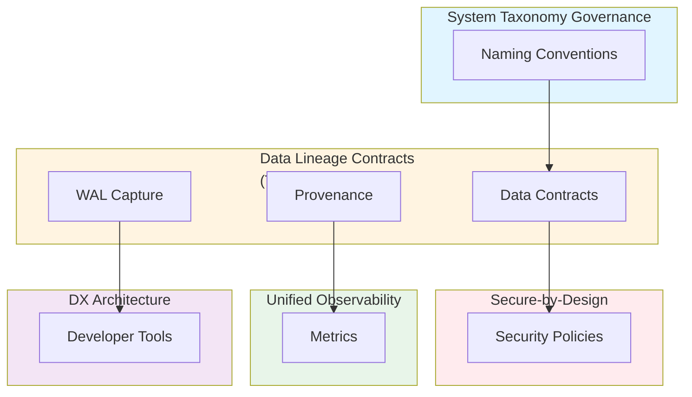

# Cross-System Data Lineage, Inter-Service Metadata Contracts & Provenance Enforcement: Best Practices

**Objective**: Establish comprehensive data lineage tracking, inter-service metadata contracts, and provenance enforcement across lakehouse → Postgres → microservices → UI. When you need to trace data flow, when you want to enforce data contracts, when you need reproducibility guarantees—this guide provides the complete framework.

## Introduction

Data lineage and provenance are essential for understanding data flow, enforcing contracts, and ensuring reproducibility. This guide establishes patterns for tracking data from source to consumption, enforcing contracts between services, and maintaining provenance across all systems.

**What This Guide Covers**:
- Lineage across lakehouse → Postgres → microservices → UI
- Data contracts for APIs, schemas, and ETL
- Versioned metadata descriptors
- Provenance graph generation
- WAL/shadow-table lineage capture
- DuckDB/FDW lineage validation
- Reproducibility guarantees
- Multi-environment lineage comparison

**Prerequisites**:
- Understanding of data architecture and ETL pipelines
- Familiarity with Postgres, DuckDB, and FDWs
- Experience with metadata management

**Related Documents**:
This document integrates with:
- **[System Taxonomy Governance](../architecture-design/system-taxonomy-governance.md)** - Lineage clarity depends on consistent naming
- **[Secure-by-Design Polyglot](../security/secure-by-design-polyglot.md)** - Security policies reference lineage
- **[Unified Observability Architecture](../operations-monitoring/unified-observability-architecture.md)** - Observability tracks lineage
- **[DX Architecture and Golden Paths](../python/dx-architecture-and-golden-paths.md)** - Developer tools use lineage

## The Philosophy of Data Lineage

### Why Lineage Matters

**Reproducibility**: Lineage enables reproducing data transformations.

**Example**:
```python
# Lineage enables reproduction
lineage = {
    'source': 's3://lakehouse/raw/users.parquet',
    'transformations': [
        {'type': 'filter', 'condition': 'status == "active"'},
        {'type': 'aggregate', 'group_by': 'region'}
    ],
    'destination': 'postgres://prod/user_summary',
    'timestamp': '2024-01-15T12:00:00Z'
}
```

**Contract Enforcement**: Lineage enables contract validation.

**Example**:
```python
# Contract validation
contract = {
    'source_schema': 'user_schema_v1',
    'target_schema': 'user_summary_schema_v1',
    'validation_rules': [
        {'field': 'user_id', 'type': 'integer', 'required': True},
        {'field': 'region', 'type': 'string', 'required': True}
    ]
}
```

**Debugging**: Lineage enables tracing data issues.

**Example**:
```python
# Trace data issue
issue = {
    'data_point': 'user_123',
    'lineage': trace_lineage('user_123'),
    'issue': 'missing_region',
    'root_cause': 'source_data_missing_region'
}
```

## Lineage Across Systems

### Lakehouse → Postgres Lineage

**Pattern**: Track data flow from lakehouse to Postgres.

**Example**:
```python
# Lakehouse to Postgres lineage
lineage = {
    'source': {
        'type': 'lakehouse',
        'location': 's3://lakehouse/raw/users.parquet',
        'schema': 'user_schema_v1',
        'timestamp': '2024-01-15T10:00:00Z'
    },
    'transformation': {
        'type': 'etl',
        'pipeline': 'user_ingestion',
        'version': 'v1.2.3',
        'steps': [
            {'type': 'read_parquet', 'file': 'users.parquet'},
            {'type': 'filter', 'condition': 'status == "active"'},
            {'type': 'transform', 'mapping': 'user_mapping_v1'}
        ]
    },
    'destination': {
        'type': 'postgres',
        'database': 'user_prod',
        'schema': 'user',
        'table': 'user_account',
        'timestamp': '2024-01-15T11:00:00Z'
    }
}
```

### Postgres → Microservices Lineage

**Pattern**: Track data flow from Postgres to microservices.

**Example**:
```python
# Postgres to microservice lineage
lineage = {
    'source': {
        'type': 'postgres',
        'database': 'user_prod',
        'schema': 'user',
        'table': 'user_account',
        'query': 'SELECT * FROM user_account WHERE status = "active"'
    },
    'transformation': {
        'type': 'api',
        'service': 'user-api',
        'version': 'v1.5.0',
        'endpoint': '/api/v1/users',
        'mapping': 'user_api_mapping_v1'
    },
    'destination': {
        'type': 'microservice',
        'service': 'order-service',
        'version': 'v2.1.0',
        'usage': 'user_lookup'
    }
}
```

### Microservices → UI Lineage

**Pattern**: Track data flow from microservices to UI.

**Example**:
```python
# Microservice to UI lineage
lineage = {
    'source': {
        'type': 'microservice',
        'service': 'user-api',
        'endpoint': '/api/v1/users',
        'response_schema': 'user_response_schema_v1'
    },
    'transformation': {
        'type': 'ui',
        'component': 'UserList',
        'version': 'v1.3.0',
        'mapping': 'user_ui_mapping_v1'
    },
    'destination': {
        'type': 'ui',
        'framework': 'NiceGUI',
        'component': 'UserList',
        'display_format': 'table'
    }
}
```

## Data Contracts

### API Contracts

**Contract Definition**:
```yaml
# api-contract.yaml
apiVersion: contract.example.com/v1
kind: APIContract
metadata:
  name: user-api-contract
  version: v1.0.0
spec:
  service: user-api
  endpoint: /api/v1/users
  request:
    schema: user_request_schema_v1
    validation:
      - type: required
        fields: [user_id]
      - type: format
        field: user_id
        pattern: "^[0-9]+$"
  response:
    schema: user_response_schema_v1
    validation:
      - type: required
        fields: [id, email, name]
      - type: format
        field: email
        pattern: "^[^@]+@[^@]+\\.[^@]+$"
```

### Schema Contracts

**Contract Definition**:
```yaml
# schema-contract.yaml
apiVersion: contract.example.com/v1
kind: SchemaContract
metadata:
  name: user-schema-contract
  version: v1.0.0
spec:
  schema: user_schema_v1
  fields:
    - name: user_id
      type: integer
      required: true
      constraints:
        - type: primary_key
    - name: email
      type: string
      required: true
      constraints:
        - type: unique
        - type: format
          pattern: "^[^@]+@[^@]+\\.[^@]+$"
    - name: name
      type: string
      required: true
```

### ETL Contracts

**Contract Definition**:
```yaml
# etl-contract.yaml
apiVersion: contract.example.com/v1
kind: ETLContract
metadata:
  name: user-etl-contract
  version: v1.0.0
spec:
  pipeline: user_ingestion
  source:
    type: lakehouse
    location: s3://lakehouse/raw/users.parquet
    schema: user_source_schema_v1
  transformation:
    steps:
      - type: filter
        condition: status == "active"
      - type: transform
        mapping: user_mapping_v1
  destination:
    type: postgres
    database: user_prod
    schema: user
    table: user_account
    schema: user_destination_schema_v1
```

## Versioned Metadata Descriptors

### Metadata Versioning

**Pattern**: Version all metadata descriptors.

**Example**:
```python
# Versioned metadata
metadata = {
    'version': 'v1.2.3',
    'schema': {
        'version': 'v1.0.0',
        'fields': [
            {'name': 'user_id', 'type': 'integer'},
            {'name': 'email', 'type': 'string'}
        ]
    },
    'contract': {
        'version': 'v1.1.0',
        'rules': [
            {'field': 'user_id', 'required': True},
            {'field': 'email', 'required': True}
        ]
    }
}
```

### Metadata Storage

**Pattern**: Store metadata in versioned format.

**Example**:
```sql
-- Metadata table
CREATE TABLE metadata_descriptors (
    id SERIAL PRIMARY KEY,
    name VARCHAR(255) NOT NULL,
    version VARCHAR(50) NOT NULL,
    type VARCHAR(50) NOT NULL,
    descriptor JSONB NOT NULL,
    created_at TIMESTAMPTZ NOT NULL DEFAULT NOW(),
    UNIQUE(name, version)
);

-- Index for lookups
CREATE INDEX idx_metadata_descriptors_name_version 
ON metadata_descriptors(name, version);
```

## Provenance Graph Generation

### Provenance Model

**Model Definition**:
```python
# Provenance model
class ProvenanceNode:
    def __init__(self, id: str, type: str, metadata: dict):
        self.id = id
        self.type = type
        self.metadata = metadata

class ProvenanceEdge:
    def __init__(self, source: str, target: str, relationship: str):
        self.source = source
        self.target = target
        self.relationship = relationship

class ProvenanceGraph:
    def __init__(self):
        self.nodes = {}
        self.edges = []
    
    def add_node(self, node: ProvenanceNode):
        self.nodes[node.id] = node
    
    def add_edge(self, edge: ProvenanceEdge):
        self.edges.append(edge)
```

### Graph Generation

**Generation Process**:
```python
# Generate provenance graph
def generate_provenance_graph(data_point: str) -> ProvenanceGraph:
    """Generate provenance graph for data point"""
    graph = ProvenanceGraph()
    
    # Trace lineage
    lineage = trace_lineage(data_point)
    
    # Add nodes
    for step in lineage:
        node = ProvenanceNode(
            id=step['id'],
            type=step['type'],
            metadata=step['metadata']
        )
        graph.add_node(node)
    
    # Add edges
    for i in range(len(lineage) - 1):
        edge = ProvenanceEdge(
            source=lineage[i]['id'],
            target=lineage[i+1]['id'],
            relationship='transformed_to'
        )
        graph.add_edge(edge)
    
    return graph
```

## WAL/Shadow-Table Lineage Capture

### WAL Capture

**Pattern**: Capture lineage from WAL.

**Example**:
```python
# WAL lineage capture
def capture_wal_lineage(wal_record: dict) -> dict:
    """Capture lineage from WAL record"""
    lineage = {
        'source': {
            'type': 'postgres_wal',
            'database': wal_record['database'],
            'schema': wal_record['schema'],
            'table': wal_record['table'],
            'operation': wal_record['operation'],
            'timestamp': wal_record['timestamp']
        },
        'data': {
            'old': wal_record.get('old'),
            'new': wal_record.get('new')
        }
    }
    return lineage
```

### Shadow-Table Lineage

**Pattern**: Use shadow tables for lineage.

**Example**:
```sql
-- Shadow table for lineage
CREATE TABLE user_account_lineage (
    id SERIAL PRIMARY KEY,
    user_id INTEGER NOT NULL,
    source_type VARCHAR(50) NOT NULL,
    source_id VARCHAR(255) NOT NULL,
    transformation_type VARCHAR(50) NOT NULL,
    transformation_id VARCHAR(255) NOT NULL,
    destination_type VARCHAR(50) NOT NULL,
    destination_id VARCHAR(255) NOT NULL,
    timestamp TIMESTAMPTZ NOT NULL DEFAULT NOW(),
    metadata JSONB
);

-- Index for lookups
CREATE INDEX idx_user_account_lineage_user_id 
ON user_account_lineage(user_id);
```

## DuckDB/FDW Lineage Validation

### DuckDB Lineage

**Pattern**: Validate DuckDB lineage.

**Example**:
```python
# DuckDB lineage validation
def validate_duckdb_lineage(query: str, lineage: dict) -> bool:
    """Validate DuckDB query lineage"""
    # Parse query
    parsed = parse_duckdb_query(query)
    
    # Extract sources
    sources = extract_sources(parsed)
    
    # Validate against lineage
    for source in sources:
        if source not in lineage['sources']:
            return False
    
    return True
```

### FDW Lineage

**Pattern**: Validate FDW lineage.

**Example**:
```sql
-- FDW lineage validation
CREATE FUNCTION validate_fdw_lineage(
    fdw_name TEXT,
    source_table TEXT,
    target_table TEXT
) RETURNS BOOLEAN AS $$
DECLARE
    lineage_record RECORD;
BEGIN
    -- Check lineage
    SELECT * INTO lineage_record
    FROM fdw_lineage
    WHERE fdw_name = validate_fdw_lineage.fdw_name
      AND source_table = validate_fdw_lineage.source_table
      AND target_table = validate_fdw_lineage.target_table;
    
    IF lineage_record IS NULL THEN
        RETURN FALSE;
    END IF;
    
    RETURN TRUE;
END;
$$ LANGUAGE plpgsql;
```

## Reproducibility Guarantees

### Reproducibility Model

**Model Definition**:
```python
# Reproducibility model
class ReproducibilityGuarantee:
    def __init__(self, data_point: str, lineage: dict):
        self.data_point = data_point
        self.lineage = lineage
        self.guarantees = []
    
    def add_guarantee(self, guarantee: dict):
        """Add reproducibility guarantee"""
        self.guarantees.append(guarantee)
    
    def verify(self) -> bool:
        """Verify reproducibility"""
        for guarantee in self.guarantees:
            if not self._verify_guarantee(guarantee):
                return False
        return True
```

### Reproducibility Validation

**Validation Process**:
```python
# Reproduce data transformation
def reproduce_transformation(lineage: dict) -> dict:
    """Reproduce data transformation from lineage"""
    # Load source data
    source_data = load_source_data(lineage['source'])
    
    # Apply transformations
    result = source_data
    for transformation in lineage['transformations']:
        result = apply_transformation(result, transformation)
    
    # Validate result
    if not validate_result(result, lineage['destination']):
        raise ValueError("Reproduction failed")
    
    return result
```

## Multi-Environment Lineage Comparison

### Environment Comparison

**Comparison Process**:
```python
# Compare lineage across environments
def compare_lineage(env1: str, env2: str, data_point: str) -> dict:
    """Compare lineage across environments"""
    lineage1 = get_lineage(env1, data_point)
    lineage2 = get_lineage(env2, data_point)
    
    comparison = {
        'data_point': data_point,
        'environments': [env1, env2],
        'differences': find_differences(lineage1, lineage2),
        'similarities': find_similarities(lineage1, lineage2)
    }
    
    return comparison
```

## Integration with Taxonomy

### Taxonomy-Based Lineage

**Pattern**: Use taxonomy for lineage clarity.

**Example**:
```python
# Taxonomy-based lineage
lineage = {
    'source': {
        'domain': 'user',  # From taxonomy
        'component': 'db',  # From taxonomy
        'entity': 'user_account',  # From taxonomy
        'location': 'user_prod.user.user_account'
    },
    'destination': {
        'domain': 'order',  # From taxonomy
        'component': 'api',  # From taxonomy
        'entity': 'user_lookup',  # From taxonomy
        'location': 'order-api.v1.user_lookup'
    }
}
```

See: **[System Taxonomy Governance](../architecture-design/system-taxonomy-governance.md)**

## Cross-Document Architecture



## Checklists

### Lineage Compliance Checklist

- [ ] All data sources have lineage tracking
- [ ] All transformations have lineage records
- [ ] All destinations have lineage validation
- [ ] All contracts are versioned
- [ ] All metadata is versioned
- [ ] WAL capture enabled
- [ ] Shadow tables created
- [ ] FDW lineage validated
- [ ] Reproducibility verified
- [ ] Multi-environment comparison enabled

## Anti-Patterns

### Lineage Anti-Patterns

**Missing Lineage**:
```python
# Bad: No lineage tracking
def transform_data(data):
    return process(data)

# Good: Lineage tracking
def transform_data(data, lineage_context):
    result = process(data)
    record_lineage(data, result, lineage_context)
    return result
```

**Incomplete Contracts**:
```yaml
# Bad: Incomplete contract
contract:
  source: s3://bucket/data.parquet
  destination: postgres://db/table

# Good: Complete contract
contract:
  source:
    location: s3://bucket/data.parquet
    schema: data_schema_v1
    validation: data_validation_v1
  destination:
    location: postgres://db/table
    schema: table_schema_v1
    validation: table_validation_v1
```

## See Also

- **[System Taxonomy Governance](../architecture-design/system-taxonomy-governance.md)** - Lineage clarity depends on taxonomy
- **[Secure-by-Design Polyglot](../security/secure-by-design-polyglot.md)** - Security policies reference lineage
- **[Unified Observability Architecture](../operations-monitoring/unified-observability-architecture.md)** - Observability tracks lineage
- **[DX Architecture and Golden Paths](../python/dx-architecture-and-golden-paths.md)** - Developer tools use lineage

---

*This guide establishes comprehensive data lineage and provenance patterns. Start with lineage tracking, extend to contracts, and continuously enforce reproducibility across all systems.*

