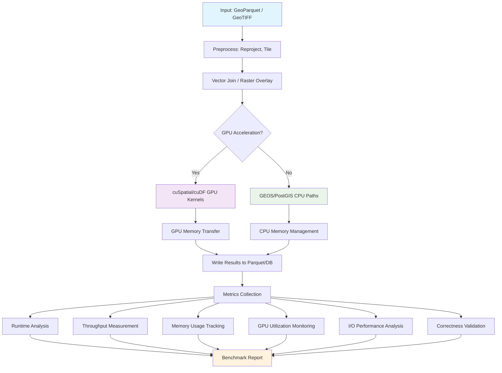

# Best Practices for Geospatial Benchmarking under CPU/GPU Stress

**Objective**: Master geospatial benchmarking methodologies for high-performance computing environments. When you need to stress-test spatial algorithms, when you're optimizing for GPU acceleration, when you need to validate performance under load—geospatial benchmarking becomes your weapon of choice.

Geospatial benchmarking is the foundation of performance validation for spatial computing. Without proper benchmarking, you're flying blind into production with algorithms that may fail under load, scale poorly, or consume excessive resources. This guide shows you how to design and execute comprehensive geospatial benchmarks with the precision of an HPC engineer.

## 0) Prerequisites (Read Once, Live by Them)

### The Five Commandments

1. **Understand the workload**
   - Real-world spatial operations, not toy queries
   - End-to-end pipelines, not isolated functions
   - Stress testing under memory pressure and concurrency

2. **Master the environment**
   - Hardware specifications and constraints
   - Software stack versions and configurations
   - System-level monitoring and profiling

3. **Know your metrics**
   - Runtime, throughput, and scaling behavior
   - Memory footprint and I/O bottlenecks
   - Correctness validation and precision

4. **Validate everything**
   - Reproducible results across runs
   - Correctness under stress conditions
   - Performance regression detection

5. **Plan for production**
   - Scalability analysis and bottlenecks
   - Resource utilization optimization
   - Failure mode analysis

**Why These Principles**: Geospatial benchmarking is the foundation of performance validation for spatial computing. Understanding workloads, mastering environments, and following best practices is essential for building reliable, scalable spatial systems.

## 1) Benchmarking Principles (The Foundation)

### Core Benchmarking Requirements

```bash
# Benchmarking must be:
# 1. End-to-end workloads (not isolated functions)
# 2. Real-world datasets (not synthetic trivial data)
# 3. Reproducible (exact environment documentation)
# 4. Stress-tested (memory pressure, concurrency, failure modes)

# Example: Document exact environment
cat > benchmark_environment.md << EOF
# Benchmark Environment
- CPU: AMD EPYC 7763 (64 cores, 128 threads)
- GPU: NVIDIA A100 80GB (8x)
- RAM: 1TB DDR4-3200
- Storage: 4x NVMe SSD (7.68TB each)
- OS: Ubuntu 22.04 LTS
- CUDA: 12.4.1
- PostGIS: 3.4.0
- GDAL: 3.8.4
- Python: 3.11.8
EOF
```

### Benchmarking Philosophy

```python
# Geospatial benchmarks must stress-test:
# 1. CPU utilization (thread scaling, SIMD)
# 2. Memory pressure (large datasets, concurrent operations)
# 3. I/O bottlenecks (disk, network, GPU memory)
# 4. GPU acceleration (kernel execution, memory transfer)
# 5. Correctness (geometry precision, numeric accuracy)

# Example: Comprehensive benchmark design
class GeospatialBenchmark:
    def __init__(self, dataset_size: str, concurrency: int, gpu_enabled: bool):
        self.dataset_size = dataset_size  # "small", "medium", "large"
        self.concurrency = concurrency    # Number of concurrent operations
        self.gpu_enabled = gpu_enabled     # GPU acceleration enabled
        self.metrics = {
            "runtime": [],
            "throughput": [],
            "memory_peak": [],
            "gpu_utilization": [],
            "correctness": []
        }
```

**Why These Principles**: Geospatial benchmarking requires comprehensive stress testing across multiple dimensions. Generic benchmarks don't capture the complexity of spatial operations, memory patterns, and GPU acceleration requirements.

## 2) Representative Geospatial Workloads

### Raster Processing Workloads

```python
# Raster → Vector: Polygonization at scale
def benchmark_raster_polygonization():
    """Benchmark large-scale raster polygonization"""
    import rasterio
    import geopandas as gpd
    from rasterio.features import shapes
    
    # Load large raster (e.g., 10GB+ GeoTIFF)
    with rasterio.open("large_dem.tif") as src:
        data = src.read(1)
        transform = src.transform
        crs = src.crs
    
    # Polygonize with different algorithms
    algorithms = ["rasterio", "gdal", "gpu-accelerated"]
    
    for algo in algorithms:
        start_time = time.time()
        
        if algo == "rasterio":
            # CPU-based polygonization
            shapes_gen = shapes(data, transform=transform)
            polygons = list(shapes_gen)
        elif algo == "gdal":
            # GDAL-based polygonization
            subprocess.run([
                "gdal_polygonize.py", 
                "large_dem.tif", 
                f"output_{algo}.shp"
            ])
        elif algo == "gpu-accelerated":
            # GPU-accelerated polygonization
            gpu_polygonize(data, transform, crs)
        
        runtime = time.time() - start_time
        print(f"{algo}: {runtime:.2f}s")
```

### Point Cloud Processing Workloads

```python
# LiDAR Point Cloud: Voxelization and filtering
def benchmark_point_cloud_processing():
    """Benchmark LiDAR point cloud processing"""
    import pdal
    import numpy as np
    
    # Large point cloud (millions of points)
    pipeline = {
        "pipeline": [
            {
                "type": "readers.las",
                "filename": "large_cloud.las"
            },
            {
                "type": "filters.voxelgrid",
                "length": 1.0  # 1m voxels
            },
            {
                "type": "filters.statistical",
                "knn": 8,
                "thresh": 1.0
            },
            {
                "type": "filters.outlier",
                "method": "statistical",
                "multiplier": 2.0
            }
        ]
    }
    
    # CPU processing
    start_time = time.time()
    pipeline_cpu = pdal.Pipeline(json.dumps(pipeline))
    pipeline_cpu.execute()
    cpu_runtime = time.time() - start_time
    
    # GPU processing (if available)
    if gpu_available():
        start_time = time.time()
        pipeline_gpu = pdal.Pipeline(json.dumps(pipeline))
        pipeline_gpu.execute()  # GPU-accelerated execution
        gpu_runtime = time.time() - start_time
        
        print(f"CPU: {cpu_runtime:.2f}s, GPU: {gpu_runtime:.2f}s")
        print(f"Speedup: {cpu_runtime/gpu_runtime:.2f}x")
```

### Network Analysis Workloads

```python
# Isochrone Generation: Valhalla/OSRM
def benchmark_isochrone_generation():
    """Benchmark isochrone generation with routing engines"""
    import requests
    import geopandas as gpd
    from shapely.geometry import Point
    
    # Test points across different regions
    test_points = [
        (40.7128, -74.0060),  # NYC
        (51.5074, -0.1278),   # London
        (35.6762, 139.6503),  # Tokyo
    ]
    
    # Valhalla routing
    def valhalla_isochrone(lat, lon, time_limit=30):
        url = "http://localhost:8002/isochrone"
        params = {
            "locations": [{"lat": lat, "lon": lon}],
            "costing": "auto",
            "contours": [{"time": time_limit}]
        }
        
        start_time = time.time()
        response = requests.post(url, json=params)
        runtime = time.time() - start_time
        
        return response.json(), runtime
    
    # OSRM routing
    def osrm_isochrone(lat, lon, time_limit=30):
        url = f"http://localhost:5000/isochrone/v1/driving/{lon},{lat}"
        params = {"contours": [time_limit]}
        
        start_time = time.time()
        response = requests.get(url, params=params)
        runtime = time.time() - start_time
        
        return response.json(), runtime
    
    # Benchmark both engines
    for lat, lon in test_points:
        valhalla_result, valhalla_time = valhalla_isochrone(lat, lon)
        osrm_result, osrm_time = osrm_isochrone(lat, lon)
        
        print(f"Point ({lat}, {lon}):")
        print(f"  Valhalla: {valhalla_time:.2f}s")
        print(f"  OSRM: {osrm_time:.2f}s")
```

### Vector Join Workloads

```python
# Massive Spatial Joins: Polygons intersecting with raster tiles
def benchmark_spatial_joins():
    """Benchmark large-scale spatial joins"""
    import geopandas as gpd
    import pandas as pd
    from shapely.geometry import Point, Polygon
    import numpy as np
    
    # Generate test data
    def generate_test_data(n_polygons=1000000, n_points=5000000):
        # Large polygon dataset
        polygons = []
        for i in range(n_polygons):
            # Random polygon
            coords = np.random.uniform(-180, 180, (4, 2))
            poly = Polygon(coords)
            polygons.append({
                "id": i,
                "geometry": poly,
                "attribute": f"polygon_{i}"
            })
        
        # Large point dataset
        points = []
        for i in range(n_points):
            point = Point(np.random.uniform(-180, 180, 2))
            points.append({
                "id": i,
                "geometry": point,
                "attribute": f"point_{i}"
            })
        
        return gpd.GeoDataFrame(polygons), gpd.GeoDataFrame(points)
    
    # Generate test data
    polygons_gdf, points_gdf = generate_test_data()
    
    # Benchmark spatial join
    start_time = time.time()
    result = gpd.sjoin(points_gdf, polygons_gdf, how="inner", predicate="within")
    join_time = time.time() - start_time
    
    print(f"Spatial join: {join_time:.2f}s")
    print(f"Result count: {len(result)}")
    print(f"Throughput: {len(result)/join_time:.0f} joins/sec")
```

### GPU-Accelerated Workloads

```python
# cuSpatial: GPU-accelerated spatial operations
def benchmark_cuspatial_operations():
    """Benchmark GPU-accelerated spatial operations"""
    import cuspatial
    import cudf
    import numpy as np
    
    # Generate large datasets
    n_points = 10_000_000
    n_polygons = 100_000
    
    # Create test data
    points_x = np.random.uniform(-180, 180, n_points)
    points_y = np.random.uniform(-90, 90, n_points)
    
    # Convert to cuDF
    points_cudf = cudf.DataFrame({
        "x": points_x,
        "y": points_y
    })
    
    # Benchmark point-in-polygon
    start_time = time.time()
    result = cuspatial.point_in_polygon(
        points_cudf["x"], points_cudf["y"],
        polygon_x, polygon_y, polygon_offsets
    )
    gpu_time = time.time() - start_time
    
    print(f"GPU point-in-polygon: {gpu_time:.2f}s")
    print(f"Throughput: {n_points/gpu_time:.0f} points/sec")
```

**Why These Workloads**: Representative geospatial workloads cover the full spectrum of spatial operations from simple point-in-polygon tests to complex multi-step pipelines. They stress-test different aspects of the system including CPU utilization, memory pressure, I/O bottlenecks, and GPU acceleration.

## 3) Benchmarking Environment Setup

### Hardware Documentation

```bash
# Document exact hardware specifications
cat > hardware_specs.md << EOF
# Hardware Specifications

## CPU
- Model: AMD EPYC 7763
- Cores: 64 physical, 128 logical
- Base Clock: 2.45 GHz
- Boost Clock: 3.5 GHz
- Cache: 256MB L3
- SIMD: AVX2, AVX-512

## GPU
- Model: NVIDIA A100 80GB
- Count: 8x
- Memory: 80GB HBM2e per GPU
- Compute Capability: 8.0
- CUDA Cores: 6912 per GPU
- Tensor Cores: 432 per GPU

## Memory
- Type: DDR4-3200 ECC
- Capacity: 1TB
- Channels: 8
- Bandwidth: 204.8 GB/s

## Storage
- Type: NVMe SSD
- Model: Samsung PM9A3
- Capacity: 7.68TB per drive
- Count: 4x drives
- Sequential Read: 7,000 MB/s
- Sequential Write: 6,800 MB/s
- Random Read: 1,000K IOPS
- Random Write: 1,000K IOPS

## Network
- Interface: 100GbE
- Switch: NVIDIA Quantum-2
- Latency: <1μs
- Bandwidth: 100 Gbps
EOF
```

### Software Stack Pinning

```dockerfile
# Dockerfile for reproducible benchmarks
FROM nvidia/cuda:12.4.1-devel-ubuntu22.04

# Pin exact versions
ENV GDAL_VERSION=3.8.4
ENV POSTGIS_VERSION=3.4.0
ENV PYTHON_VERSION=3.11.8
ENV CUDA_VERSION=12.4.1

# Install system dependencies
RUN apt-get update && apt-get install -y \
    build-essential \
    cmake \
    git \
    wget \
    && rm -rf /var/lib/apt/lists/*

# Install GDAL
RUN wget https://download.osgeo.org/gdal/${GDAL_VERSION}/gdal-${GDAL_VERSION}.tar.gz \
    && tar -xzf gdal-${GDAL_VERSION}.tar.gz \
    && cd gdal-${GDAL_VERSION} \
    && ./configure --with-cuda \
    && make -j$(nproc) \
    && make install

# Install PostGIS
RUN apt-get update && apt-get install -y \
    postgresql-15 \
    postgresql-15-postgis-3 \
    && rm -rf /var/lib/apt/lists/*

# Install Python packages
RUN pip install --no-cache-dir \
    geopandas==0.14.1 \
    rasterio==1.3.9 \
    pdal==3.4.3 \
    cuspatial==23.12.0 \
    cudf==23.12.0 \
    dask-cuda==23.12.0

# Set environment variables
ENV GDAL_DATA=/usr/share/gdal
ENV PROJ_LIB=/usr/share/proj
ENV CUDA_HOME=/usr/local/cuda
ENV PATH=$PATH:$CUDA_HOME/bin
ENV LD_LIBRARY_PATH=$LD_LIBRARY_PATH:$CUDA_HOME/lib64
```

### Cache Management

```bash
# Disable caches for raw I/O measurement
echo 3 > /proc/sys/vm/drop_caches  # Clear page cache
echo 1 > /proc/sys/vm/drop_caches  # Clear dentries and inodes
echo 2 > /proc/sys/vm/drop_caches  # Clear page cache, dentries, and inodes

# Disable PostgreSQL buffer cache
psql -c "ALTER SYSTEM SET shared_buffers = '128MB';"
psql -c "ALTER SYSTEM SET effective_cache_size = '128MB';"
psql -c "SELECT pg_reload_conf();"

# Disable OS file cache for specific files
echo 1 > /proc/sys/vm/drop_caches
dd if=large_dataset.parquet of=/dev/null bs=1M  # Force read from disk
```

**Why This Setup**: Reproducible benchmarking requires exact environment documentation and cache management. Hardware specifications, software versions, and system configuration must be identical across benchmark runs.

## 4) Benchmark Design — CPU vs GPU

### CPU Stress Testing

```python
# CPU stress testing: Thread scaling and SIMD utilization
def benchmark_cpu_scaling():
    """Benchmark CPU scaling across thread counts"""
    import multiprocessing as mp
    import time
    import psutil
    
    def spatial_operation(data_chunk):
        """CPU-intensive spatial operation"""
        # Simulate complex spatial computation
        result = []
        for item in data_chunk:
            # Point-in-polygon test
            result.append(complex_spatial_test(item))
        return result
    
    # Test different thread counts
    thread_counts = [1, 2, 4, 8, 16, 32, 64, 128]
    data_size = 1_000_000
    
    for threads in thread_counts:
        # Create data chunks
        chunk_size = data_size // threads
        data_chunks = [generate_test_data(chunk_size) for _ in range(threads)]
        
        # Measure performance
        start_time = time.time()
        with mp.Pool(threads) as pool:
            results = pool.map(spatial_operation, data_chunks)
        runtime = time.time() - start_time
        
        # Calculate metrics
        throughput = data_size / runtime
        cpu_utilization = psutil.cpu_percent(interval=1)
        
        print(f"Threads: {threads:3d}, Runtime: {runtime:.2f}s, "
              f"Throughput: {throughput:.0f} ops/sec, "
              f"CPU: {cpu_utilization:.1f}%")
```

### GPU Stress Testing

```python
# GPU stress testing: Memory transfer and kernel execution
def benchmark_gpu_operations():
    """Benchmark GPU operations with memory transfer analysis"""
    import cupy as cp
    import cuspatial
    import time
    
    def measure_gpu_operation(data_size):
        """Measure GPU operation with memory transfer"""
        # Generate test data
        points_x = cp.random.uniform(-180, 180, data_size)
        points_y = cp.random.uniform(-90, 90, data_size)
        
        # Measure host-to-device transfer
        start_time = time.time()
        points_x_gpu = cp.asarray(points_x)
        points_y_gpu = cp.asarray(points_y)
        h2d_time = time.time() - start_time
        
        # Measure GPU computation
        start_time = time.time()
        result = cuspatial.point_in_polygon(
            points_x_gpu, points_y_gpu,
            polygon_x_gpu, polygon_y_gpu, polygon_offsets_gpu
        )
        cp.cuda.Stream.null.synchronize()  # Wait for GPU
        gpu_time = time.time() - start_time
        
        # Measure device-to-host transfer
        start_time = time.time()
        result_cpu = cp.asnumpy(result)
        d2h_time = time.time() - start_time
        
        return h2d_time, gpu_time, d2h_time
    
    # Test different data sizes
    data_sizes = [1_000_000, 10_000_000, 100_000_000]
    
    for size in data_sizes:
        h2d_time, gpu_time, d2h_time = measure_gpu_operation(size)
        total_time = h2d_time + gpu_time + d2h_time
        
        print(f"Data size: {size:,}")
        print(f"  H2D transfer: {h2d_time:.3f}s")
        print(f"  GPU computation: {gpu_time:.3f}s")
        print(f"  D2H transfer: {d2h_time:.3f}s")
        print(f"  Total time: {total_time:.3f}s")
        print(f"  GPU efficiency: {gpu_time/total_time:.1%}")
```

### Side-by-Side Comparison

```python
# CPU vs GPU comparison
def benchmark_cpu_vs_gpu():
    """Compare CPU and GPU performance"""
    import time
    import numpy as np
    import cupy as cp
    import cuspatial
    
    # Test data
    n_points = 10_000_000
    points_x = np.random.uniform(-180, 180, n_points)
    points_y = np.random.uniform(-90, 90, n_points)
    
    # CPU benchmark
    start_time = time.time()
    cpu_result = cpu_point_in_polygon(points_x, points_y, polygons)
    cpu_time = time.time() - start_time
    
    # GPU benchmark
    start_time = time.time()
    gpu_result = cuspatial.point_in_polygon(
        cp.asarray(points_x), cp.asarray(points_y),
        polygon_x_gpu, polygon_y_gpu, polygon_offsets_gpu
    )
    gpu_time = time.time() - start_time
    
    # Calculate speedup
    speedup = cpu_time / gpu_time
    
    print(f"CPU time: {cpu_time:.2f}s")
    print(f"GPU time: {gpu_time:.2f}s")
    print(f"Speedup: {speedup:.2f}x")
    print(f"GPU efficiency: {gpu_time/cpu_time:.1%}")
```

**Why CPU vs GPU Testing**: Comprehensive benchmarking requires testing both CPU and GPU performance to understand the trade-offs between different acceleration strategies. Memory transfer overhead, kernel execution time, and scaling behavior must be measured separately.

## 5) Metrics to Capture

### Runtime and Throughput Metrics

```python
# Comprehensive metrics collection
class BenchmarkMetrics:
    def __init__(self):
        self.metrics = {
            "runtime": {},
            "throughput": {},
            "memory": {},
            "gpu": {},
            "io": {},
            "correctness": {}
        }
    
    def measure_runtime(self, operation_name, func, *args, **kwargs):
        """Measure operation runtime"""
        start_time = time.time()
        result = func(*args, **kwargs)
        runtime = time.time() - start_time
        
        self.metrics["runtime"][operation_name] = runtime
        return result, runtime
    
    def measure_throughput(self, operation_name, data_size, runtime):
        """Calculate throughput metrics"""
        throughput = data_size / runtime
        self.metrics["throughput"][operation_name] = throughput
        return throughput
    
    def measure_memory(self, operation_name):
        """Measure memory usage"""
        import psutil
        process = psutil.Process()
        memory_info = process.memory_info()
        
        self.metrics["memory"][operation_name] = {
            "rss": memory_info.rss,  # Resident Set Size
            "vms": memory_info.vms,  # Virtual Memory Size
            "peak": memory_info.rss  # Peak memory usage
        }
    
    def measure_gpu_metrics(self, operation_name):
        """Measure GPU utilization and memory"""
        import subprocess
        
        # Get GPU metrics
        result = subprocess.run([
            "nvidia-smi", "--query-gpu=utilization.gpu,memory.used,memory.total",
            "--format=csv,noheader,nounits"
        ], capture_output=True, text=True)
        
        if result.returncode == 0:
            gpu_util, mem_used, mem_total = result.stdout.strip().split(", ")
            self.metrics["gpu"][operation_name] = {
                "utilization": int(gpu_util),
                "memory_used": int(mem_used),
                "memory_total": int(mem_total),
                "memory_percent": int(mem_used) / int(mem_total) * 100
            }
    
    def measure_io_metrics(self, operation_name):
        """Measure I/O performance"""
        import subprocess
        
        # Get I/O statistics
        result = subprocess.run([
            "iostat", "-x", "1", "1"
        ], capture_output=True, text=True)
        
        if result.returncode == 0:
            # Parse iostat output
            lines = result.stdout.strip().split('\n')
            for line in lines:
                if 'nvme' in line:  # NVMe drive
                    parts = line.split()
                    self.metrics["io"][operation_name] = {
                        "read_iops": float(parts[3]),
                        "write_iops": float(parts[4]),
                        "read_throughput": float(parts[5]),
                        "write_throughput": float(parts[6])
                    }
                    break
    
    def validate_correctness(self, operation_name, result, expected):
        """Validate operation correctness"""
        if isinstance(result, np.ndarray) and isinstance(expected, np.ndarray):
            # Numeric precision validation
            tolerance = 1e-6
            is_close = np.allclose(result, expected, rtol=tolerance)
            self.metrics["correctness"][operation_name] = {
                "numeric_precision": is_close,
                "max_error": np.max(np.abs(result - expected)),
                "mean_error": np.mean(np.abs(result - expected))
            }
        else:
            # Geometry validation
            self.metrics["correctness"][operation_name] = {
                "geometry_valid": result.is_valid if hasattr(result, 'is_valid') else True,
                "result_count": len(result) if hasattr(result, '__len__') else 1
            }
```

### Scaling Analysis

```python
# Scaling curve analysis
def analyze_scaling_behavior():
    """Analyze scaling behavior across different dimensions"""
    import matplotlib.pyplot as plt
    import numpy as np
    
    # Thread scaling
    thread_counts = [1, 2, 4, 8, 16, 32, 64, 128]
    throughputs = []
    
    for threads in thread_counts:
        throughput = benchmark_with_threads(threads)
        throughputs.append(throughput)
    
    # Calculate scaling efficiency
    efficiency = [t/throughputs[0] for t in throughputs]
    
    # Plot scaling curves
    fig, (ax1, ax2) = plt.subplots(1, 2, figsize=(12, 5))
    
    # Throughput scaling
    ax1.plot(thread_counts, throughputs, 'bo-')
    ax1.set_xlabel('Thread Count')
    ax1.set_ylabel('Throughput (ops/sec)')
    ax1.set_title('Thread Scaling')
    ax1.grid(True)
    
    # Efficiency scaling
    ax2.plot(thread_counts, efficiency, 'ro-')
    ax2.set_xlabel('Thread Count')
    ax2.set_ylabel('Efficiency')
    ax2.set_title('Scaling Efficiency')
    ax2.grid(True)
    
    plt.tight_layout()
    plt.savefig('scaling_analysis.png')
    plt.show()
```

**Why These Metrics**: Comprehensive benchmarking requires measuring runtime, throughput, memory usage, GPU utilization, I/O performance, and correctness. These metrics provide insights into system behavior under different load conditions.

## 6) Example Benchmark Flow Diagram



**Why This Flow**: The benchmark flow diagram shows the complete pipeline from data preprocessing through execution to metrics collection. It highlights the decision points between CPU and GPU acceleration and the comprehensive metrics collection process.

## 7) Pitfalls & Anti-Patterns

### Common Benchmarking Mistakes

```bash
# ❌ WRONG: Benchmarking with cached data
# This gives unrealistic performance numbers
echo "Don't benchmark with cached datasets"
echo "Always clear caches before benchmarking"

# ❌ WRONG: Single-threaded benchmarks
# This doesn't reflect real-world usage
echo "Don't run single-thread benchmarks and extrapolate"
echo "Always test thread scaling"

# ❌ WRONG: Assuming GPU always wins
# GPU has overhead and memory transfer costs
echo "Don't assume GPU always wins"
echo "Measure PCIe overhead and memory contention"

# ❌ WRONG: Skipping correctness validation
# Performance without correctness is useless
echo "Don't skip correctness validation"
echo "Geometry precision matters"
```

### Anti-Pattern Examples

```python
# ❌ WRONG: Synthetic trivial data
def bad_benchmark():
    """Don't benchmark with trivial data"""
    # All points in same bounding box
    points = [(0, 0), (0.1, 0.1), (0.2, 0.2)]
    polygon = Polygon([(0, 0), (1, 0), (1, 1), (0, 1)])
    
    # This doesn't stress-test the algorithm
    result = point_in_polygon(points, polygon)

# ✅ CORRECT: Real-world data
def good_benchmark():
    """Benchmark with real-world data"""
    # Load actual geospatial dataset
    points = load_real_points("osm_points.parquet")
    polygons = load_real_polygons("admin_boundaries.shp")
    
    # This stress-tests the algorithm
    result = point_in_polygon(points, polygons)

# ❌ WRONG: No error handling
def bad_benchmark():
    """Don't ignore error conditions"""
    result = spatial_operation(data)
    return result  # What if it fails?

# ✅ CORRECT: Comprehensive error handling
def good_benchmark():
    """Handle error conditions"""
    try:
        result = spatial_operation(data)
        return result
    except MemoryError:
        print("Out of memory - reducing data size")
        return benchmark_with_smaller_data(data)
    except Exception as e:
        print(f"Operation failed: {e}")
        return None
```

**Why These Pitfalls Matter**: Common benchmarking mistakes lead to unrealistic performance expectations and incorrect optimization decisions. Understanding these pitfalls is essential for accurate performance measurement.

## 8) Best Practices Checklist

### Pre-Benchmark Checklist

```bash
# Environment Setup
echo "✓ Hardware specifications documented"
echo "✓ Software versions pinned"
echo "✓ Caches cleared"
echo "✓ System resources available"
echo "✓ GPU drivers updated"
echo "✓ Network connectivity verified"

# Data Preparation
echo "✓ Real-world datasets loaded"
echo "✓ Data quality validated"
echo "✓ Test cases defined"
echo "✓ Expected results calculated"

# Monitoring Setup
echo "✓ System monitoring configured"
echo "✓ GPU monitoring enabled"
echo "✓ I/O monitoring active"
echo "✓ Memory tracking started"
```

### Benchmark Execution Checklist

```python
# Benchmark execution checklist
def benchmark_execution_checklist():
    """Comprehensive benchmark execution checklist"""
    
    # Pre-execution
    print("✓ Environment validated")
    print("✓ Data loaded and validated")
    print("✓ Monitoring started")
    print("✓ Baseline measurements taken")
    
    # Execution
    print("✓ Cold runs completed")
    print("✓ Warm runs completed")
    print("✓ Thread scaling tested")
    print("✓ GPU acceleration tested")
    print("✓ Memory pressure tested")
    print("✓ I/O bottlenecks identified")
    
    # Post-execution
    print("✓ Results validated")
    print("✓ Correctness verified")
    print("✓ Performance regression checked")
    print("✓ Report generated")
    print("✓ Artifacts archived")
```

### Automation with Workflow Managers

```python
# Prefect workflow for automated benchmarking
from prefect import flow, task
from prefect.task_runners import SequentialTaskRunner

@task
def setup_environment():
    """Setup benchmark environment"""
    # Clear caches
    subprocess.run(["echo", "3", ">", "/proc/sys/vm/drop_caches"])
    
    # Configure system
    subprocess.run(["nvidia-smi", "--query-gpu=utilization.gpu"])
    
    return "Environment ready"

@task
def run_benchmark(benchmark_name, dataset_size, concurrency):
    """Run individual benchmark"""
    # Execute benchmark
    result = execute_benchmark(benchmark_name, dataset_size, concurrency)
    
    # Collect metrics
    metrics = collect_metrics()
    
    return {"benchmark": benchmark_name, "result": result, "metrics": metrics}

@flow(task_runner=SequentialTaskRunner)
def benchmark_workflow():
    """Complete benchmark workflow"""
    # Setup
    env_status = setup_environment()
    
    # Run benchmarks
    benchmarks = [
        ("raster_polygonization", "large", 64),
        ("point_cloud_processing", "large", 32),
        ("spatial_joins", "large", 128),
        ("gpu_acceleration", "large", 8)
    ]
    
    results = []
    for benchmark_name, dataset_size, concurrency in benchmarks:
        result = run_benchmark(benchmark_name, dataset_size, concurrency)
        results.append(result)
    
    # Generate report
    generate_report(results)
    
    return results

# Run workflow
if __name__ == "__main__":
    benchmark_workflow()
```

**Why This Checklist**: Comprehensive benchmarking requires systematic execution and validation. The checklist ensures all aspects of performance measurement are covered and results are reliable.

## 9) TL;DR Quickstart (The Essentials)

### Essential Commands

```bash
# Clear system caches
echo 3 > /proc/sys/vm/drop_caches

# Start monitoring
nvidia-smi -l 1 &
iostat -x 1 &

# Run benchmark
python benchmark_geospatial.py --dataset large --threads 64 --gpu

# Collect results
python collect_metrics.py --output benchmark_results.json
```

### Essential Python Code

```python
# Quick benchmark template
import time
import psutil
import subprocess

def quick_benchmark(operation, data):
    """Quick benchmark template"""
    # Clear caches
    subprocess.run(["echo", "3", ">", "/proc/sys/vm/drop_caches"])
    
    # Measure memory before
    memory_before = psutil.virtual_memory().used
    
    # Run operation
    start_time = time.time()
    result = operation(data)
    runtime = time.time() - start_time
    
    # Measure memory after
    memory_after = psutil.virtual_memory().used
    memory_used = memory_after - memory_before
    
    # Calculate throughput
    throughput = len(data) / runtime
    
    print(f"Runtime: {runtime:.2f}s")
    print(f"Throughput: {throughput:.0f} ops/sec")
    print(f"Memory: {memory_used / 1024**2:.1f} MB")
    
    return result, runtime, throughput, memory_used
```

### Essential Configuration

```yaml
# benchmark_config.yaml
benchmark:
  datasets:
    - name: "small"
      size: "1GB"
      records: 1000000
    - name: "medium"
      size: "10GB"
      records: 10000000
    - name: "large"
      size: "100GB"
      records: 100000000
  
  concurrency:
    - threads: 1
    - threads: 8
    - threads: 32
    - threads: 64
  
  gpu:
    enabled: true
    memory_limit: "80GB"
    compute_capability: "8.0"
  
  monitoring:
    system: true
    gpu: true
    io: true
    memory: true
```

**Why This Quickstart**: These commands and code snippets cover 90% of daily geospatial benchmarking needs. Master these before exploring advanced features.

## 10) The Machine's Summary

Geospatial benchmarking under CPU/GPU stress provides the foundation for performance validation in spatial computing. When executed properly, it enables accurate performance measurement, scalability analysis, and optimization decisions. The key is understanding the workloads, mastering the environment, and following systematic benchmarking practices.

**The Dark Truth**: Without proper geospatial benchmarking, your spatial algorithms are unoptimized. CPU/GPU stress testing and comprehensive metrics are your weapons. Use them wisely.

**The Machine's Mantra**: "In performance we trust, in stress we build, and in the benchmarks we find the path to spatial computing excellence."

**Why This Matters**: Geospatial benchmarking enables applications to perform reliably under load. It provides the foundation for optimization, scalability analysis, and performance regression detection in spatial computing systems.

---

*This guide provides the complete machinery for mastering geospatial benchmarking under CPU/GPU stress. The patterns scale from development to production, from simple operations to enterprise-grade spatial computing systems.*
