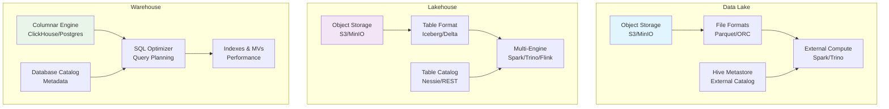
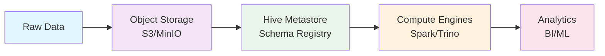
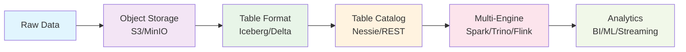
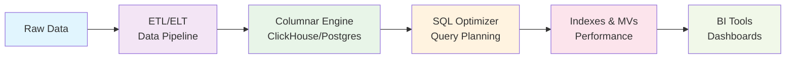
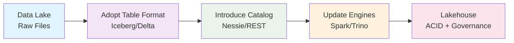
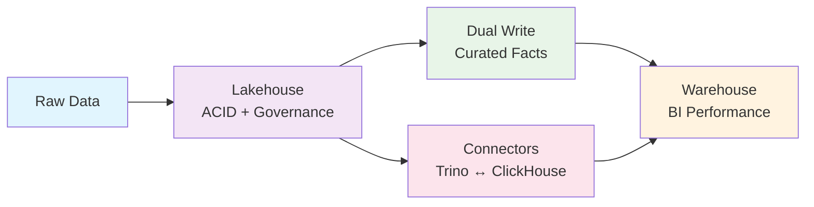
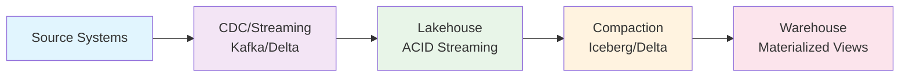

# Choosing Data Lakes, Lakehouses, and Warehouses: Trade-offs, Patterns, and Free Stacks

**Objective**: Master the architectural trade-offs between data lakes, lakehouses, and warehouses for modern data infrastructure. When you need to choose the right data architecture, when you're building scalable analytics platforms, when you need to balance cost, performance, and governance—data architecture becomes your weapon of choice.

Data architecture decisions determine the fate of your analytics platform. Without proper understanding of the trade-offs, you'll build expensive, slow, or ungovernable systems. This guide shows you how to choose and implement the right architecture with the precision of a principal data architect.

## 0) Prerequisites (Read Once, Live by Them)

### The Five Commandments

1. **Understand the architectures**
   - Data Lake: object storage, schema-on-read, external compute
   - Lakehouse: lake + table format with ACID and governance
   - Warehouse: database with tight ACID and SQL optimization

2. **Master the decision matrix**
   - Workload characteristics and latency requirements
   - Cost profiles and governance needs
   - Schema evolution and streaming requirements

3. **Know your patterns**
   - Migration paths between architectures
   - Coexistence strategies
   - Operational best practices

4. **Validate everything**
   - Performance under load
   - Governance enforcement
   - Cost optimization

5. **Plan for evolution**
   - Architecture migration strategies
   - Technology stack evolution
   - Operational complexity management

**Why These Principles**: Data architecture decisions have long-term consequences. Understanding the trade-offs, mastering the patterns, and following best practices is essential for building scalable, cost-effective data infrastructure.

## 1) Precise Definitions (No Marketing)

### Data Lake: The Foundation

```yaml
# Data Lake Architecture
data_lake:
  storage: "Object storage (S3-compatible)"
  formats: "Open file formats (Parquet, ORC, Avro)"
  schema: "Schema-on-read"
  acid: "Loose ACID (per-file)"
  compute: "External (Spark, Trino, Presto)"
  metastore: "External (Hive Metastore, AWS Glue)"
  governance: "Basic (file-level)"
  latency: "High (minutes to hours)"
  cost: "Low (storage + compute separation)"
```

**Data Lake Characteristics**:
- **Storage**: Object storage with open file formats
- **Schema**: Schema-on-read with flexible data ingestion
- **ACID**: File-level atomicity, no cross-file transactions
- **Compute**: Decoupled compute engines (Spark, Trino, Presto)
- **Metastore**: External catalog (Hive Metastore, AWS Glue)
- **Governance**: Basic file-level metadata and access controls

### Lakehouse: The Evolution

```yaml
# Lakehouse Architecture
lakehouse:
  storage: "Object storage + table format"
  formats: "Parquet + Iceberg/Delta/Hudi"
  schema: "Schema-on-write with evolution"
  acid: "Table-level ACID transactions"
  compute: "Multi-engine (Spark, Trino, Flink)"
  metastore: "Table format catalog"
  governance: "Advanced (lineage, time travel)"
  latency: "Medium (seconds to minutes)"
  cost: "Medium (storage + compute + catalog)"
```

**Lakehouse Characteristics**:
- **Storage**: Object storage with table format layer
- **Schema**: Schema-on-write with evolution support
- **ACID**: Table-level ACID transactions
- **Compute**: Multi-engine support with shared catalog
- **Metastore**: Table format catalog (Iceberg, Delta, Hudi)
- **Governance**: Advanced metadata, lineage, time travel

### Warehouse: The Performance

```yaml
# Data Warehouse Architecture
warehouse:
  storage: "Database with columnar engine"
  formats: "Native columnar (ClickHouse, PostgreSQL)"
  schema: "Schema-on-write (strict)"
  acid: "Full ACID compliance"
  compute: "Integrated SQL engine"
  metastore: "Database catalog"
  governance: "Database-level (users, roles, permissions)"
  latency: "Low (milliseconds to seconds)"
  cost: "High (integrated compute + storage)"
```

**Warehouse Characteristics**:
- **Storage**: Database with columnar storage engine
- **Schema**: Schema-on-write with strict validation
- **ACID**: Full ACID compliance with transactions
- **Compute**: Integrated SQL engine with optimization
- **Metastore**: Database catalog with metadata
- **Governance**: Database-level security and access controls

### Architecture Comparison Diagram



**Why These Definitions**: Precise definitions eliminate confusion and enable informed architectural decisions. Each architecture has distinct characteristics that determine its suitability for different workloads.

## 2) Decision Matrix (The Truth)

### Comprehensive Decision Matrix

| Criteria | Data Lake | Lakehouse | Warehouse |
|----------|-----------|-----------|-----------|
| **Workload** | Batch, ML, Raw Data | Batch + Streaming, ML | OLAP, BI, Dashboards |
| **Latency** | High (minutes) | Medium (seconds) | Low (milliseconds) |
| **Concurrency** | Low-Medium | Medium | High |
| **ACID Rigor** | File-level | Table-level | Full ACID |
| **Schema Evolution** | Manual | Automatic | Manual |
| **Streaming/CDC** | Append-only | ACID streaming | ETL/ELT |
| **Cost Profile** | Low | Medium | High |
| **Governance** | Basic | Advanced | Database-level |
| **BI Readiness** | Poor | Good | Excellent |
| **ML Ergonomics** | Excellent | Good | Poor |
| **Complexity** | Low | Medium | High |

### Pick This If...

**Data Lake**:
- Cost and openness matter most
- Heavy data science/ML on raw data
- Elasticity beats ACID guarantees
- Schema flexibility is critical
- Multi-format data ingestion

**Lakehouse**:
- Need ACID tables with lake economics
- Schema evolution and time travel
- Multi-engine access (Spark + Trino)
- Governance and lineage tracking
- Streaming + batch workloads

**Warehouse**:
- Low-latency BI requirements
- High-concurrency SQL workloads
- Strict SLAs and performance
- Rollups and materialized views
- Traditional BI tools integration

**Why This Matrix**: The decision matrix provides objective criteria for architectural selection. It eliminates guesswork and ensures the right architecture for specific requirements.

## 3) Architecture Patterns (The Blueprints)

### Classic Data Lake Pattern



**Rationale**: Classic data lake pattern separates storage from compute, enabling cost-effective scaling and multi-engine access. Object storage provides durability and cost efficiency, while external compute engines offer flexibility.

### Lakehouse Pattern



**Rationale**: Lakehouse pattern adds table format layer to object storage, providing ACID guarantees and schema evolution while maintaining lake economics. Multi-engine support enables diverse workloads.

### Warehouse Pattern



**Rationale**: Warehouse pattern integrates storage and compute for optimal performance. Columnar engine with SQL optimization provides low-latency analytics for BI workloads.

**Why These Patterns**: Architecture patterns provide proven blueprints for implementation. Each pattern optimizes for different characteristics and workloads.

## 4) Docker Compose Stacks (Free, Minimal, Runnable)

### 4.A — Data Lake: MinIO + Hive Metastore + Trino

```yaml
# docker-compose-lake.yml
version: "3.9"

services:
  minio:
    image: minio/minio:RELEASE.2024-01-16T16-07-38Z
    command: server /data --console-address ":9001"
    environment:
      MINIO_ROOT_USER: admin
      MINIO_ROOT_PASSWORD: password
    ports:
      - "9000:9000"
      - "9001:9001"
    volumes:
      - minio_data:/data
    healthcheck:
      test: ["CMD", "mc", "ready", "local"]
      interval: 10s
      timeout: 5s
      retries: 5

  mc:
    image: minio/mc:RELEASE.2024-01-13T08-44-48Z
    depends_on:
      minio:
        condition: service_healthy
    entrypoint: >
      /bin/sh -c "
      mc alias set local http://minio:9000 admin password &&
      mc mb -p local/lake &&
      tail -f /dev/null
      "

  postgres:
    image: postgres:15
    environment:
      POSTGRES_PASSWORD: metastore
      POSTGRES_DB: metastore
    ports:
      - "5432:5432"
    volumes:
      - pg_data:/var/lib/postgresql/data
    healthcheck:
      test: ["CMD-SHELL", "pg_isready -U postgres"]
      interval: 5s
      timeout: 5s
      retries: 5

  hive-metastore:
    image: bitsondatadev/hive-metastore:3.1.3
    environment:
      METASTORE_DB_HOSTNAME: postgres
      METASTORE_TYPE: postgres
      METASTORE_DB_NAME: metastore
      METASTORE_DB_USER: postgres
      METASTORE_DB_PASSWORD: metastore
      S3_ENDPOINT: http://minio:9000
      S3_ACCESS_KEY: admin
      S3_SECRET_KEY: password
      S3_PATH_STYLE_ACCESS: "true"
    depends_on:
      postgres:
        condition: service_healthy
      minio:
        condition: service_healthy
    ports:
      - "9083:9083"
    healthcheck:
      test: ["CMD-SHELL", "netstat -an | grep 9083"]
      interval: 10s
      timeout: 5s
      retries: 5

  trino:
    image: trinodb/trino:latest
    depends_on:
      hive-metastore:
        condition: service_healthy
    ports:
      - "8080:8080"
    volumes:
      - ./trino/catalog:/etc/trino/catalog
    healthcheck:
      test: ["CMD-SHELL", "curl -f http://localhost:8080/v1/info"]
      interval: 10s
      timeout: 5s
      retries: 5

volumes:
  minio_data:
  pg_data:
```

**Trino Hive Catalog Configuration**:

```properties
# trino/catalog/hive.properties
connector.name=hive
hive.metastore.uri=thrift://hive-metastore:9083
hive.s3.endpoint=http://minio:9000
hive.s3.path-style-access=true
hive.s3.aws-access-key=admin
hive.s3.aws-secret-key=password
```

**Smoke Test**:
```sql
-- Create external table on MinIO
CREATE TABLE hive.default.sales (
    id BIGINT,
    product VARCHAR,
    amount DECIMAL(10,2),
    sale_date DATE
) WITH (
    format = 'PARQUET',
    external_location = 's3a://lake/sales/'
);

-- Insert sample data
INSERT INTO hive.default.sales VALUES
(1, 'Widget A', 100.00, DATE '2024-01-01'),
(2, 'Widget B', 200.00, DATE '2024-01-02');

-- Query data
SELECT * FROM hive.default.sales;
```

### 4.B — Lakehouse: MinIO + Nessie + Spark + Trino

```yaml
# docker-compose-lakehouse.yml
version: "3.9"

services:
  minio:
    image: minio/minio:RELEASE.2024-01-16T16-07-38Z
    command: server /data --console-address ":9001"
    environment:
      MINIO_ROOT_USER: admin
      MINIO_ROOT_PASSWORD: password
    ports:
      - "9000:9000"
      - "9001:9001"
    volumes:
      - minio_data:/data
    healthcheck:
      test: ["CMD", "mc", "ready", "local"]
      interval: 10s
      timeout: 5s
      retries: 5

  mc:
    image: minio/mc:RELEASE.2024-01-13T08-44-48Z
    depends_on:
      minio:
        condition: service_healthy
    entrypoint: >
      /bin/sh -c "
      mc alias set local http://minio:9000 admin password &&
      mc mb -p local/lake &&
      tail -f /dev/null
      "

  nessie:
    image: ghcr.io/projectnessie/nessie:0.77.0
    environment:
      QUARKUS_PROFILE: prod
    ports:
      - "19120:19120"
    healthcheck:
      test: ["CMD-SHELL", "curl -f http://localhost:19120/api/v2/config"]
      interval: 10s
      timeout: 5s
      retries: 5

  trino:
    image: trinodb/trino:latest
    depends_on:
      nessie:
        condition: service_healthy
    ports:
      - "8080:8080"
    volumes:
      - ./trino/catalog:/etc/trino/catalog

  spark:
    image: bitnami/spark:3.5.0
    environment:
      SPARK_MODE: master
    ports:
      - "7077:7077"
      - "8081:8080"
    volumes:
      - ./spark/conf:/opt/bitnami/spark/conf

volumes:
  minio_data:
```

**Trino Iceberg Catalog Configuration**:

```properties
# trino/catalog/iceberg.properties
connector.name=iceberg
iceberg.catalog.type=rest
iceberg.rest-catalog.uri=http://nessie:19120/api/v2
iceberg.rest-catalog.warehouse=s3://lake/warehouse
s3.endpoint=http://minio:9000
s3.path-style-access=true
s3.aws-access-key=admin
s3.aws-secret-key=password
```

**Spark Configuration**:

```properties
# spark/conf/spark-defaults.conf
spark.sql.catalog.lh=org.apache.iceberg.spark.SparkCatalog
spark.sql.catalog.lh.type=rest
spark.sql.catalog.lh.uri=http://nessie:19120/api/v2
spark.sql.catalog.lh.warehouse=s3://lake/warehouse
spark.sql.catalog.lh.s3.endpoint=http://minio:9000
spark.sql.catalog.lh.s3.path-style-access=true
spark.sql.catalog.lh.s3.access-key=admin
spark.sql.catalog.lh.s3.secret-key=password
```

**Smoke Test**:
```sql
-- Create Iceberg table
CREATE TABLE iceberg.default.sales (
    id BIGINT,
    product VARCHAR,
    amount DECIMAL(10,2),
    sale_date DATE
) WITH (
    format = 'PARQUET'
);

-- Insert data
INSERT INTO iceberg.default.sales VALUES
(1, 'Widget A', 100.00, DATE '2024-01-01'),
(2, 'Widget B', 200.00, DATE '2024-01-02');

-- Schema evolution
ALTER TABLE iceberg.default.sales ADD COLUMN region VARCHAR;

-- Time travel
SELECT * FROM iceberg.default.sales FOR TIMESTAMP AS OF '2024-01-01 10:00:00';
```

### 4.C — Warehouse: ClickHouse

```yaml
services:
  clickhouse:
    image: clickhouse/clickhouse-server:24.8
    ports:
      - "8123:8123"
      - "9000:9000"
    ulimits:
      nofile:
        soft: 262144
        hard: 262144
    volumes:
      - ch_data:/var/lib/clickhouse
    healthcheck:
      test: ["CMD", "clickhouse-client", "--query", "SELECT 1"]
      interval: 10s
      timeout: 5s
      retries: 5

volumes:
  ch_data:
```

**Smoke Test**:
```sql
-- Create MergeTree table
CREATE TABLE sales (
    id UInt64,
    product String,
    amount Decimal(10,2),
    sale_date Date,
    region String
) ENGINE = MergeTree()
ORDER BY (sale_date, id);

-- Insert batch data
INSERT INTO sales VALUES
(1, 'Widget A', 100.00, '2024-01-01', 'North'),
(2, 'Widget B', 200.00, '2024-01-02', 'South'),
(3, 'Widget C', 300.00, '2024-01-03', 'East');

-- Create materialized view for rollups
CREATE MATERIALIZED VIEW sales_daily
ENGINE = SummingMergeTree()
ORDER BY (sale_date, region)
AS SELECT
    sale_date,
    region,
    sum(amount) as total_amount,
    count() as transaction_count
FROM sales
GROUP BY sale_date, region;

-- Query with aggregation
SELECT 
    sale_date,
    region,
    total_amount,
    transaction_count
FROM sales_daily
ORDER BY sale_date, region;
```

**Why These Stacks**: Free, minimal Docker Compose stacks provide hands-on experience with each architecture. They enable rapid prototyping and evaluation without vendor lock-in.

## 5) When to Choose What (Rules of Thumb)

### Data Lake: The Foundation

**Choose Data Lake When**:
- Cost and openness matter most
- Heavy data science/ML on raw data
- Elasticity beats ACID guarantees
- Schema flexibility is critical
- Multi-format data ingestion

**Anti-Patterns**:
- Using lake for sub-second BI without serving layer
- Treating lake as file dump without governance
- Ignoring small file problems

### Lakehouse: The Evolution

**Choose Lakehouse When**:
- Need ACID tables with lake economics
- Schema evolution and time travel
- Multi-engine access (Spark + Trino)
- Governance and lineage tracking
- Streaming + batch workloads

**Anti-Patterns**:
- Treating Iceberg like raw folders
- Bypassing table format guarantees
- Ignoring catalog management

### Warehouse: The Performance

**Choose Warehouse When**:
- Low-latency BI requirements
- High-concurrency SQL workloads
- Strict SLAs and performance
- Rollups and materialized views
- Traditional BI tools integration

**Anti-Patterns**:
- Using warehouse as data lake file dump
- Ignoring ETL/ELT complexity
- Underestimating operational overhead

**Why These Rules**: Clear decision criteria eliminate architectural confusion and ensure the right choice for specific requirements. Anti-patterns prevent common mistakes.

## 6) Migration & Coexistence Patterns

### Lake → Lakehouse Migration



**Migration Steps**:
1. **Adopt Table Format**: Convert raw files to Iceberg/Delta format
2. **Introduce Catalog**: Deploy Nessie or REST catalog
3. **Update Engines**: Configure Spark/Trino to use table format
4. **Migrate Workloads**: Update queries to use new catalog
5. **Governance**: Implement advanced metadata and lineage

### Warehouse ↔ Lakehouse Coexistence



**Coexistence Strategies**:
- **Dual Write**: Write curated facts to both systems
- **Connectors**: Use Trino to query ClickHouse from lakehouse
- **ETL/ELT**: Extract from lakehouse, transform, load to warehouse
- **Serving Layer**: Use warehouse as serving layer for lakehouse

### CDC/Streaming Patterns



**Streaming Patterns**:
- **Append-Only**: Stream to lakehouse with ACID guarantees
- **Compaction**: Regular compaction for performance
- **Materialization**: Create materialized views in warehouse
- **Serving**: Use warehouse for real-time BI

**Why These Patterns**: Migration and coexistence patterns enable architectural evolution without disruption. They provide proven strategies for transitioning between architectures.

## 7) Ops & Governance Best Practices

### Catalog Management

```yaml
# Catalog backup strategy
catalog_backup:
  hive_metastore:
    database: "postgresql"
    backup_frequency: "daily"
    retention: "30_days"
  
  nessie_catalog:
    type: "rest"
    backup_frequency: "hourly"
    retention: "7_days"
  
  clickhouse_catalog:
    type: "database"
    backup_frequency: "daily"
    retention: "30_days"
```

**Best Practices**:
- **Backup Catalogs**: Regular backups of metastore/catalog
- **Version Control**: Track catalog schema changes
- **Monitoring**: Alert on catalog failures
- **Recovery**: Test restore procedures

### Schema Evolution

```yaml
# Schema evolution policy
schema_evolution:
  allowed_changes:
    - "add_column"
    - "modify_column_type"
    - "add_metadata"
  
  forbidden_changes:
    - "delete_column"
    - "rename_column"
    - "change_column_type"
  
  migration_workflow:
    - "create_new_schema"
    - "migrate_data"
    - "validate_migration"
    - "update_consumers"
    - "deprecate_old_schema"
```

**Best Practices**:
- **Additive Changes**: Prefer additive schema changes
- **Validation**: Test schema changes in staging
- **Migration**: Plan for breaking changes
- **Documentation**: Document schema evolution

### Partitioning Strategy

```sql
-- Partitioning best practices
CREATE TABLE sales_partitioned (
    id BIGINT,
    product VARCHAR,
    amount DECIMAL(10,2),
    sale_date DATE,
    region VARCHAR
) PARTITIONED BY (sale_date, region)
STORED AS PARQUET;

-- Avoid small files
INSERT INTO sales_partitioned
SELECT * FROM sales
WHERE sale_date >= '2024-01-01'
AND sale_date < '2024-02-01';
```

**Best Practices**:
- **Partition Design**: Document partitioning strategy
- **File Size**: Target 128-512 MB Parquet files
- **Compaction**: Regular compaction for performance
- **Monitoring**: Track partition skew

### Security & Access Control

```yaml
# Security configuration
security:
  iam_policies:
    - "bucket_level_access"
    - "prefix_level_access"
    - "engine_level_auth"
  
  audit_logging:
    - "access_logs"
    - "query_logs"
    - "metadata_changes"
  
  encryption:
    - "at_rest"
    - "in_transit"
    - "client_side"
```

**Best Practices**:
- **Least Privilege**: Minimal required permissions
- **Audit Logging**: Comprehensive access logging
- **Encryption**: End-to-end encryption
- **Monitoring**: Security event monitoring

**Why These Practices**: Operational best practices ensure reliable, secure, and maintainable data infrastructure. They prevent common operational issues and enable effective governance.

## 8) Pitfalls (Red Flags)

### Data Lake Pitfalls

```bash
# ❌ WRONG: Hive Metastore outages
echo "Hive Metastore outages = blind engines"
echo "Trino/Spark can't see tables without metastore"

# ❌ WRONG: Small files kill performance
echo "Small files kill performance"
echo "Compaction is not optional"

# ❌ WRONG: No governance
echo "Treating lake as file dump"
echo "No metadata, no lineage, no governance"
```

### Lakehouse Pitfalls

```bash
# ❌ WRONG: Bypassing table format
echo "Treating Iceberg like raw folders"
echo "Bypassing table format corrupts guarantees"

# ❌ WRONG: Catalog management
echo "Ignoring catalog management"
echo "Catalog is the control plane"

# ❌ WRONG: Schema evolution
echo "Breaking schema evolution"
echo "Schema changes must be backward compatible"
```

### Warehouse Pitfalls

```bash
# ❌ WRONG: Using warehouse as file dump
echo "Using warehouse as data lake file dump"
echo "Warehouse is for structured, optimized data"

# ❌ WRONG: Ignoring ETL complexity
echo "Underestimating ETL/ELT complexity"
echo "Data transformation is not trivial"

# ❌ WRONG: Operational overhead
echo "Ignoring operational overhead"
echo "Warehouses require maintenance and tuning"
```

### Common Anti-Patterns

```python
# ❌ WRONG: Sub-second BI on lake
def bad_bi_pattern():
    """Don't push sub-second dashboards on lake"""
    # This will be slow and unreliable
    result = spark.sql("SELECT * FROM lake.raw_data WHERE timestamp > NOW() - INTERVAL 1 SECOND")

# ✅ CORRECT: Serving layer for BI
def good_bi_pattern():
    """Use serving layer for BI"""
    # Pre-aggregate in lakehouse
    aggregated = spark.sql("SELECT date, sum(amount) FROM lakehouse.sales GROUP BY date")
    # Load to warehouse for BI
    warehouse.load(aggregated)
```

**Why These Pitfalls Matter**: Common pitfalls lead to performance issues, operational problems, and architectural failures. Understanding these pitfalls prevents costly mistakes.

## 9) TL;DR Quickstarts (Per Stack)

### Data Lake Quickstart

```bash
# Start data lake stack
docker-compose -f docker-compose-lake.yml up -d

# Wait for services to be healthy
docker-compose -f docker-compose-lake.yml ps

# Open Trino UI: http://localhost:8080
# Create external table on s3a://lake/...
```

### Lakehouse Quickstart

```bash
# Start lakehouse stack
docker-compose -f docker-compose-lakehouse.yml up -d

# Wait for services to be healthy
docker-compose -f docker-compose-lakehouse.yml ps

# Open Trino UI: http://localhost:8080
# Create Iceberg table, test schema evolution
```

### Warehouse Quickstart

```bash
# Start warehouse stack
docker-compose -f docker-compose-warehouse.yml up -d

# Wait for services to be healthy
docker-compose -f docker-compose-warehouse.yml ps

# Connect to ClickHouse: clickhouse-client
# Create MergeTree table, insert data, test aggregations
```

### Essential Commands

```bash
# Data Lake
docker-compose -f docker-compose-lake.yml up -d
# Open Trino UI: http://localhost:8080

# Lakehouse
docker-compose -f docker-compose-lakehouse.yml up -d
# Open Trino UI: http://localhost:8080

# Warehouse
docker-compose -f docker-compose-warehouse.yml up -d
# Connect: clickhouse-client
```

**Why These Quickstarts**: Quickstart commands provide immediate hands-on experience with each architecture. They enable rapid evaluation and prototyping.

## 10) The Machine's Summary

Data architecture decisions determine the fate of your analytics platform. When chosen correctly, each architecture provides optimal performance, cost, and governance for specific workloads. The key is understanding the trade-offs, mastering the patterns, and following operational best practices.

**The Dark Truth**: Without proper architectural understanding, your data infrastructure will be expensive, slow, or ungovernable. Data lakes, lakehouses, and warehouses are your weapons. Use them wisely.

**The Machine's Mantra**: "In architecture we trust, in patterns we build, and in the trade-offs we find the path to scalable data infrastructure."

**Why This Matters**: Data architecture decisions have long-term consequences. Understanding the trade-offs between lakes, lakehouses, and warehouses enables informed decisions that balance performance, cost, and governance.

---

*This guide provides the complete machinery for choosing and implementing data architectures. The patterns scale from development to production, from simple analytics to enterprise-grade data platforms.*
