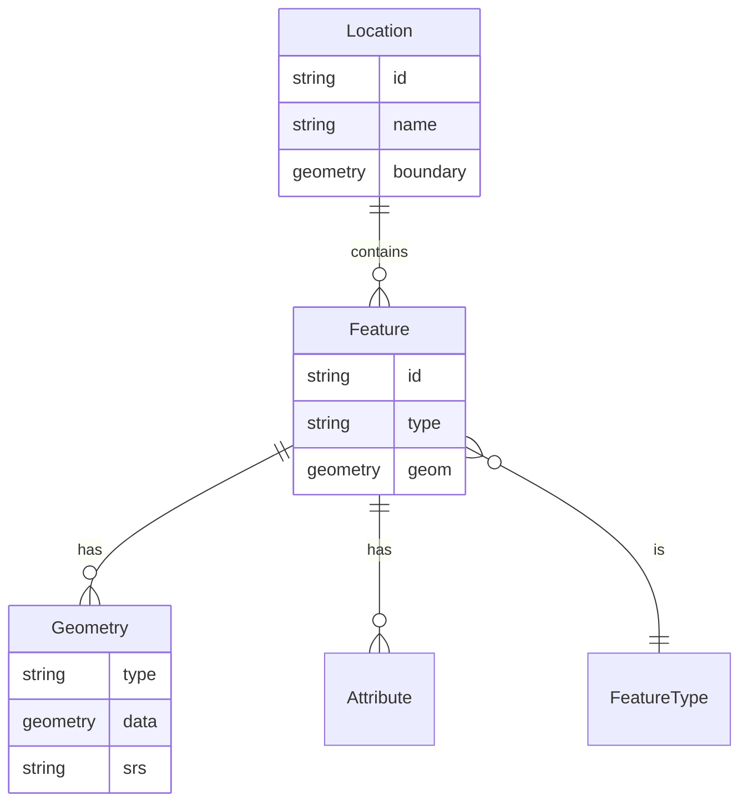
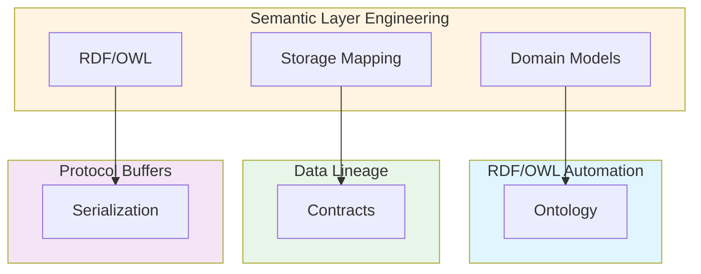

# Semantic Layer Engineering, Domain Models, and Knowledge Graph Alignment: Best Practices

**Objective**: Establish enterprise semantic layers that bridge business concepts to physical storage across geospatial, infrastructure, ML/AI, and data domains. When you need domain models, when you want knowledge graph alignment, when you need semantic versioning—this guide provides the complete framework.

## Introduction

Semantic layers provide the abstraction between business logic and physical data storage, enabling consistent domain models, knowledge graph alignment, and semantic versioning across all data systems.

**What This Guide Covers**:
- Enterprise semantic layers for geospatial, infrastructure, ML/AI, event streams, time-series, and lakehouse domains
- Mapping business entities to physical storage (Parquet, Postgres, object stores)
- RDF/OWL integration patterns
- Entity resolution and identity graph governance
- Semantic versioning strategy
- SQL/JSONB domain schemas
- Schema evolution models

**Prerequisites**:
- Understanding of data modeling and domain-driven design
- Familiarity with RDF/OWL, knowledge graphs, and semantic web technologies
- Experience with data architecture and schema design

**Related Documents**:
This document integrates with:
- **[RDF/OWL Metadata Automation](../architecture-design/rdf-owl-metadata-automation.md)** - Automated ontological associations
- **[Data Lineage Contracts](data-lineage-contracts.md)** - Lineage and provenance
- **[Protocol Buffers with Python](../architecture-design/protobuf-python.md)** - Data serialization
- **[Chaos Engineering Governance](../operations-monitoring/chaos-engineering-governance.md)** - Semantic layer resilience
- **[Multi-Region DR Strategy](../architecture-design/multi-region-dr-strategy.md)** - Semantic layer DR
- **[ML Systems Architecture Governance](../ml-ai/ml-systems-architecture-governance.md)** - ML semantic layers

## The Philosophy of Semantic Layers

### Semantic Layer Principles

**Principle 1: Business Abstraction**
- Hide physical storage details
- Expose business concepts
- Enable domain-driven design

**Principle 2: Consistency**
- Consistent domain models
- Unified vocabulary
- Standardized relationships

**Principle 3: Evolution**
- Versioned schemas
- Backward compatibility
- Migration strategies

## Enterprise Semantic Layers

### Geospatial Semantic Layer

**Domain Model**:


**Implementation**:
```python
# Geospatial semantic layer
class GeospatialSemanticLayer:
    def __init__(self):
        self.domain_model = GeospatialDomainModel()
        self.storage = GeospatialStorage()
    
    def map_to_storage(self, entity: GeospatialEntity) -> StorageLocation:
        """Map business entity to storage"""
        return self.storage.map(entity)
```

### Infrastructure Semantic Layer

**Domain Model**:
```python
# Infrastructure semantic layer
class InfrastructureSemanticLayer:
    def __init__(self):
        self.domain_model = InfrastructureDomainModel()
        self.storage = InfrastructureStorage()
    
    def map_to_storage(self, entity: InfrastructureEntity) -> StorageLocation:
        """Map infrastructure entity to storage"""
        return self.storage.map(entity)
```

### ML/AI Feature Store Semantic Layer

**Domain Model**:
```python
# ML feature store semantic layer
class MLFeatureStoreSemanticLayer:
    def __init__(self):
        self.domain_model = MLFeatureDomainModel()
        self.storage = FeatureStoreStorage()
    
    def map_to_storage(self, feature: MLFeature) -> StorageLocation:
        """Map ML feature to storage"""
        return self.storage.map(feature)
```

### Event Stream Semantic Layer

**Domain Model**:
```python
# Event stream semantic layer
class EventStreamSemanticLayer:
    def __init__(self):
        self.domain_model = EventDomainModel()
        self.storage = EventStorage()
    
    def map_to_storage(self, event: Event) -> StorageLocation:
        """Map event to storage"""
        return self.storage.map(event)
```

### Time-Series Semantic Layer

**Domain Model**:
```python
# Time-series semantic layer
class TimeSeriesSemanticLayer:
    def __init__(self):
        self.domain_model = TimeSeriesDomainModel()
        self.storage = TimeSeriesStorage()
    
    def map_to_storage(self, time_series: TimeSeries) -> StorageLocation:
        """Map time-series to storage"""
        return self.storage.map(time_series)
```

### Lakehouse Semantic Layer

**Domain Model**:
```python
# Lakehouse semantic layer
class LakehouseSemanticLayer:
    def __init__(self):
        self.domain_model = LakehouseDomainModel()
        self.storage = LakehouseStorage()
    
    def map_to_storage(self, dataset: Dataset) -> StorageLocation:
        """Map dataset to storage"""
        return self.storage.map(dataset)
```

## Mapping Business Entities to Physical Storage

### Storage Mapping Strategy

**Pattern**: Map entities to storage locations.

**Example**:
```python
# Storage mapping
class StorageMapper:
    def map_entity(self, entity: BusinessEntity) -> StorageLocation:
        """Map business entity to storage"""
        mapping_rules = {
            'geospatial': self.map_geospatial,
            'infrastructure': self.map_infrastructure,
            'ml_features': self.map_ml_features
        }
        
        entity_type = entity.get_type()
        mapper = mapping_rules.get(entity_type)
        
        if mapper:
            return mapper(entity)
        else:
            raise ValueError(f"Unknown entity type: {entity_type}")
```

### Parquet Storage Mapping

**Pattern**: Map to Parquet files.

**Example**:
```python
# Parquet mapping
class ParquetMapper:
    def map(self, entity: BusinessEntity) -> ParquetLocation:
        """Map entity to Parquet location"""
        return ParquetLocation(
            path=f"s3://lakehouse/{entity.domain}/{entity.name}.parquet",
            schema=entity.schema,
            partition=entity.partition
        )
```

### Postgres Storage Mapping

**Pattern**: Map to Postgres tables.

**Example**:
```python
# Postgres mapping
class PostgresMapper:
    def map(self, entity: BusinessEntity) -> PostgresLocation:
        """Map entity to Postgres location"""
        return PostgresLocation(
            database=entity.database,
            schema=entity.schema,
            table=entity.table
        )
```

## RDF/OWL Integration Patterns

### RDF Mapping

**Pattern**: Map entities to RDF.

**Example**:
```python
# RDF mapping
class RDFMapper:
    def map(self, entity: BusinessEntity) -> RDFGraph:
        """Map entity to RDF graph"""
        graph = Graph()
        
        # Add entity as subject
        subject = URIRef(f"http://example.com/{entity.id}")
        
        # Add properties
        for prop, value in entity.properties.items():
            predicate = URIRef(f"http://example.com/{prop}")
            graph.add((subject, predicate, Literal(value)))
        
        return graph
```

See: **[RDF/OWL Metadata Automation](../architecture-design/rdf-owl-metadata-automation.md)**

## Entity Resolution and Identity Graph

### Entity Resolution

**Pattern**: Resolve entity identities.

**Example**:
```python
# Entity resolution
class EntityResolver:
    def resolve(self, entity: BusinessEntity) -> ResolvedEntity:
        """Resolve entity identity"""
        # Check identity graph
        identity = self.identity_graph.get_identity(entity)
        
        if identity:
            return ResolvedEntity(entity, identity)
        else:
            # Create new identity
            identity = self.identity_graph.create_identity(entity)
            return ResolvedEntity(entity, identity)
```

### Identity Graph Governance

**Pattern**: Govern identity graph.

**Example**:
```python
# Identity graph governance
class IdentityGraphGovernance:
    def __init__(self):
        self.graph = IdentityGraph()
        self.policies = IdentityPolicies()
    
    def add_entity(self, entity: BusinessEntity) -> Identity:
        """Add entity with governance"""
        # Validate entity
        if not self.policies.validate(entity):
            raise ValueError("Entity validation failed")
        
        # Add to graph
        identity = self.graph.add_entity(entity)
        
        # Audit
        self.audit.add_record(entity, identity)
        
        return identity
```

## Semantic Versioning Strategy

### Versioning Model

**Pattern**: Version semantic schemas.

**Example**:
```python
# Semantic versioning
class SemanticVersioning:
    def version_schema(self, schema: Schema) -> VersionedSchema:
        """Version semantic schema"""
        version = self.calculate_version(schema)
        
        return VersionedSchema(
            schema=schema,
            version=version,
            changes=self.detect_changes(schema),
            compatibility=self.check_compatibility(schema)
        )
```

## SQL/JSONB Domain Schemas

### SQL Domain Schema

**Pattern**: Define SQL domain schemas.

**Example**:
```sql
-- SQL domain schema
CREATE SCHEMA geospatial_domain;

CREATE TABLE geospatial_domain.location (
    id UUID PRIMARY KEY,
    name VARCHAR(255) NOT NULL,
    boundary GEOMETRY(POLYGON, 4326),
    metadata JSONB
);

CREATE TABLE geospatial_domain.feature (
    id UUID PRIMARY KEY,
    location_id UUID REFERENCES geospatial_domain.location(id),
    type VARCHAR(50) NOT NULL,
    geometry GEOMETRY NOT NULL,
    attributes JSONB
);
```

### JSONB Domain Schema

**Pattern**: Use JSONB for flexible schemas.

**Example**:
```sql
-- JSONB domain schema
CREATE TABLE domain_entities (
    id UUID PRIMARY KEY,
    domain VARCHAR(50) NOT NULL,
    entity_type VARCHAR(50) NOT NULL,
    entity_data JSONB NOT NULL,
    created_at TIMESTAMPTZ NOT NULL DEFAULT NOW()
);

-- Index for JSONB queries
CREATE INDEX idx_domain_entities_entity_data 
ON domain_entities USING GIN (entity_data);
```

## Schema Evolution Models

### Evolution Strategy

**Pattern**: Evolve schemas safely.

**Example**:
```python
# Schema evolution
class SchemaEvolution:
    def evolve(self, old_schema: Schema, new_schema: Schema) -> EvolutionPlan:
        """Plan schema evolution"""
        changes = self.detect_changes(old_schema, new_schema)
        
        evolution_plan = EvolutionPlan(
            changes=changes,
            migration_steps=self.generate_migration_steps(changes),
            rollback_plan=self.generate_rollback_plan(changes),
            compatibility=self.check_compatibility(changes)
        )
        
        return evolution_plan
```

## Cross-Document Architecture



## Checklists

### Semantic Layer Compliance Checklist

- [ ] Domain models defined
- [ ] Storage mapping configured
- [ ] RDF/OWL integration enabled
- [ ] Entity resolution implemented
- [ ] Identity graph governed
- [ ] Semantic versioning active
- [ ] Schema evolution planned
- [ ] Documentation complete

## Anti-Patterns

### Semantic Layer Anti-Patterns

**Tight Coupling**:
```python
# Bad: Tight coupling to storage
class BadSemanticLayer:
    def get_data(self):
        return self.postgres.query("SELECT * FROM table")

# Good: Abstraction layer
class GoodSemanticLayer:
    def get_data(self):
        entity = self.domain_model.get_entity()
        storage = self.storage_mapper.map(entity)
        return storage.get_data()
```

**No Versioning**:
```python
# Bad: No versioning
schema = Schema(fields=[...])

# Good: Versioned
schema = VersionedSchema(
    version="v1.2.3",
    fields=[...],
    compatibility="backward"
)
```

## See Also

- **[RDF/OWL Metadata Automation](../architecture-design/rdf-owl-metadata-automation.md)** - Automated ontological associations
- **[Data Lineage Contracts](data-lineage-contracts.md)** - Lineage and provenance
- **[Protocol Buffers with Python](../architecture-design/protobuf-python.md)** - Data serialization
- **[Chaos Engineering Governance](../operations-monitoring/chaos-engineering-governance.md)** - Semantic layer resilience
- **[Multi-Region DR Strategy](../architecture-design/multi-region-dr-strategy.md)** - Semantic layer DR
- **[ML Systems Architecture Governance](../ml-ai/ml-systems-architecture-governance.md)** - ML semantic layers

---

*This guide establishes comprehensive semantic layer engineering patterns. Start with domain models, extend to storage mapping, and continuously evolve schemas safely.*

