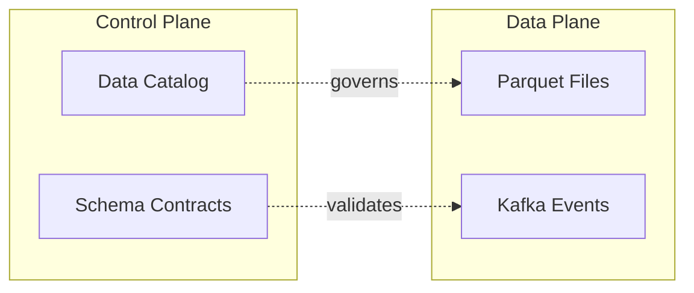
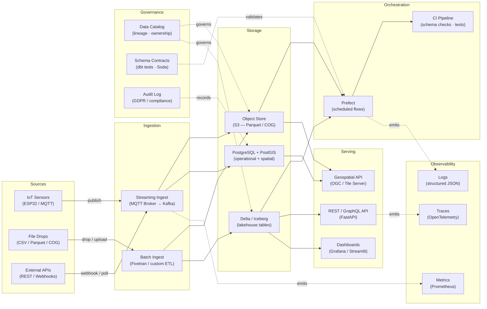

---
tags:
  - best-practices
  - diagrams
  - mermaid
  - svg
  - documentation
---

# Generating Complex Workflow Diagrams as SVG (Mermaid-First, Artifact-Driven)

**Themes:** Documentation · Architecture · Diagrams

---

## Why SVG for Workflows

For complex workflows — data platforms, service topologies, pipeline architectures — PNG and raster exports are a dead end. A PNG diagram:

- Cannot be scaled without resampling artifacts
- Produces broken rendering on high-density displays
- Cannot be searched or linked from within a document
- Is opaque to version control (every pixel change is a binary diff)

SVG diagrams are:

- **Infinitely scalable**: a 1280×720 viewBox renders crisply at any zoom level on any display
- **Self-contained**: a properly authored SVG embeds all fonts and geometry with no external references
- **Diffable in version control**: SVG is XML — structural changes appear in `git diff` as legible text diffs
- **Embeddable anywhere**: GitHub Pages, MkDocs Material, Confluence, ADRs, Notion, slide decks
- **Accessible**: `<title>` and `<desc>` elements provide screen-reader alt text

The practical objection to SVG — authoring friction — is addressed by treating Mermaid as the source of truth and SVG as a compiled artifact, exactly as TypeScript is the source and JavaScript is the output.

---

## Principles

### Diagram as Code

A diagram that cannot be version-controlled is a liability. The Mermaid `.mmd` file is the diagram's source code: it is reviewed in pull requests, changed atomically with the content it describes, and tagged with the same commit that changes the architecture.

The rendered SVG is an artifact — committed to the repository as a human-readable output, regenerated any time the `.mmd` source changes.

### Stable Naming

Diagrams are named after the concept they represent, not the date they were created or the ticket that produced them.

```
docs/assets/diagrams/workflows/data-platform-workflow.mmd
docs/assets/diagrams/workflows/data-platform-workflow.svg
docs/assets/diagrams/architecture/microservices-boundary.mmd
docs/assets/diagrams/architecture/microservices-boundary.svg
```

This naming produces stable URLs in published documentation, predictable paths in rendering scripts, and clear semantics in version history.

### Bounded Complexity

A single diagram must be readable in 10 seconds. The complexity limit is approximately 15 nodes per diagram. Beyond this:

- Split into a high-level topology diagram and a zoomed-in detail diagram
- Use subgraphs to group related nodes, reducing cognitive load while preserving structure
- Produce a series of diagrams that build on each other (each adding a layer of detail)

A diagram that requires explanation to parse has failed. Diagrams support the text; they do not replace it.

### Layering

Complex systems are not flat. A layered diagram approach — one diagram per architectural concern — produces more analytical value than a single omnibus diagram:

1. **Topology diagram**: what are the major subsystems and their boundaries?
2. **Data flow diagram**: how does data move between subsystems?
3. **Control plane diagram**: what governs each subsystem?
4. **Failure mode diagram**: what breaks when a specific component fails?

Each diagram is a standalone artifact with its own `.mmd` source and `.svg` output.

---

## Mermaid vs SVG Authoring

| Approach | When to use | Authoring cost | Revision cost |
|---|---|---|---|
| Mermaid → SVG (this guide) | Architecture, pipelines, state machines, topologies | Low | Low |
| Hand-authored SVG | Geospatial illustrations, custom figures, marketing-grade design | High | High |
| External tool export (draw.io, Figma) | Stakeholder-facing visual design | Medium | Medium |

**Mermaid as source of truth**: the `.mmd` file is the canonical representation. Never edit the `.svg` file directly — edits will be overwritten on the next render. Treat the SVG output as a build artifact.

**When to hand-author SVG**: geospatial maps, custom iconography, and figures that require precise visual positioning or custom styling beyond Mermaid's layout engine. These are exceptions; the rule is Mermaid.

---

## Repository Conventions

### Directory Layout

```
docs/assets/diagrams/         ← all diagram sources and outputs
  workflows/
    data-platform-workflow.mmd   ← source (committed, edited)
    data-platform-workflow.svg   ← artifact (committed, regenerated)
  architecture/
    ...
tools/diagrams/               ← rendering tooling
  package.json
  render_mermaid_svg.mjs       ← Node.js render script
  mermaid-config.json          ← Mermaid theme configuration
```

### Source Files (`.mmd`)

- Located under `docs/assets/diagrams/` in the appropriate subdirectory
- Named in `kebab-case` after the concept (not the date or ticket)
- Include `%%{init: ...}%%` directive for consistent rendering configuration
- Committed and reviewed in pull requests like code

### Output Files (`.svg`)

- Located next to the `.mmd` source (same directory, same basename)
- Regenerated by running `npm run render:workflow` or `npm run render:all` from `tools/diagrams/`
- Committed to the repository after generation so documentation renders correctly without a build step

### Rendering Tooling

The render script is at `tools/diagrams/render_mermaid_svg.mjs`. It:

1. Finds `.mmd` files under a given path (single file or recursive directory)
2. Invokes `@mermaid-js/mermaid-cli` (`mmdc`) with a consistent configuration
3. Outputs `.svg` next to each `.mmd` source
4. Prints a summary of rendered files

To render:

```bash
cd tools/diagrams
npm install          # first time only
npm run render:workflow   # renders data-platform-workflow.mmd → .svg
npm run render:all        # renders all .mmd under docs/assets/diagrams/
```

---

## Style Guide

### Orientation

Use `flowchart LR` (left-to-right) for workflow and pipeline diagrams. Left-to-right matches how most engineers read time and data flow — from inputs on the left to outputs on the right.

Use `flowchart TD` (top-down) for hierarchical structures: dependency trees, inheritance diagrams, layer stacks.

### Subgraph Boundaries

Use `subgraph` blocks to represent system boundaries: services, organizations, network zones, control plane vs data plane. Subgraph labels identify the boundary type. Internal nodes represent the components within it.



### Node Text Length

Node labels follow a strict character limit:

- **Line 1** (primary label): 3–5 words maximum, title-case
- **Line 2** (sub-label in parentheses): technology names or brief clarifiers
- Never embed multi-sentence descriptions in node labels

Poor: `"Processes incoming data records and validates them against the schema contract"`
Good: `"Schema Validation\n(dbt tests · Soda)"`

### Edge Semantics

| Edge type | Syntax | Meaning |
|---|---|---|
| Solid arrow | `-->` | Direct data flow or synchronous call |
| Labeled solid | `-->|"label"|` | Labeled data flow (use sparingly) |
| Dashed arrow | `-.->` | Governance, observability, or async cross-cut |
| Labeled dashed | `-.label.->` | Named cross-cut relationship |

Reserve dashed arrows for cross-cutting concerns (governance, observability, audit) that affect many nodes without being part of the primary data flow.

### Configuration

The `mermaid-config.json` file sets consistent theme variables for all rendered diagrams:

```json
{
  "theme": "default",
  "fontFamily": "ui-sans-serif, system-ui, ...",
  "flowchart": { "curve": "linear" },
  "themeVariables": {
    "primaryColor": "#e0f2f1",
    "primaryBorderColor": "#00897b"
  }
}
```

---

## CI-Ready Workflow

The SVG is committed to the repository as a build artifact. For teams that want to verify the committed SVG matches the `.mmd` source, a CI check can:

1. Run `npm run render:all` in a fresh environment
2. Compare the rendered output to the committed SVG using `git diff`
3. Fail if differences exist, requiring contributors to regenerate and commit the SVG before merge

This approach ensures the committed artifact always reflects the current source — the diagram equivalent of a lockfile check.

A future GitHub Actions workflow might look like:

```yaml
- name: Verify SVG diagrams are up to date
  run: |
    cd tools/diagrams && npm ci && npm run render:all
    git diff --exit-code docs/assets/diagrams/
```

---

## Example: Data Platform Workflow

The following Mermaid source represents the full data platform workflow for this site — sensors through serving, with governance and observability cross-cuts.

**Mermaid source** (`docs/assets/diagrams/workflows/data-platform-workflow.mmd`):



**Rendered SVG artifact** (`docs/assets/diagrams/workflows/data-platform-workflow.svg`):


---

!!! tip "See also"
    - [Mermaid → SVG Workflow Pipeline (Tutorial)](../tutorials/diagrams/mermaid-to-svg-workflow-pipeline.md) — step-by-step guide to setting up and running the render pipeline
    - [Diagram Style Guide](../diagrams/style-guide.md) — Mermaid snippet library and formatting conventions
    - [ADR 0015: Standardize Diagrams on Mermaid](../adr/0015-diagrams-mermaid.md) — the architectural decision record that established this standard
