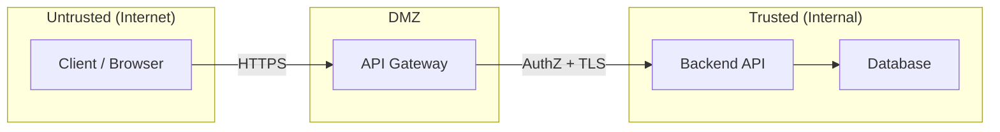
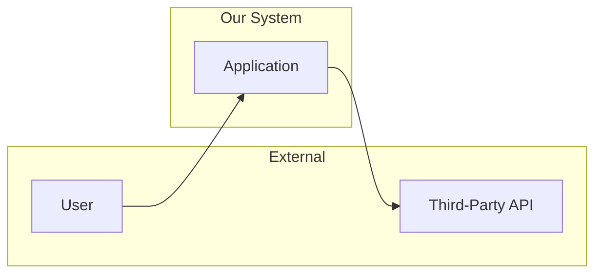
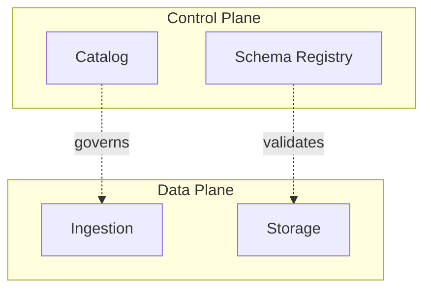
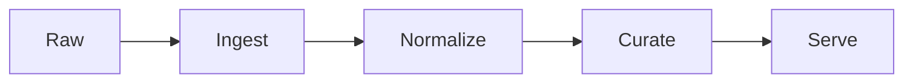
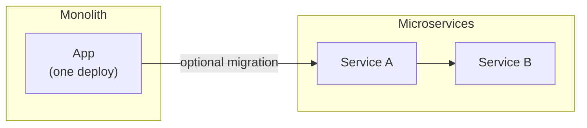
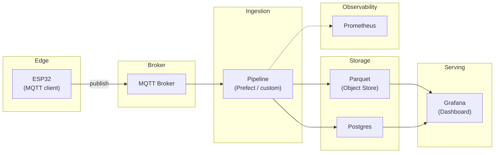
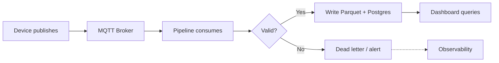

---
tags:
  - best-practices
  - diagrams
  - mermaid
  - svg
  - architecture
---

# Systems Diagramming Best Practices (Mermaid, SVG, and Diagram Discipline)

**Objective**: Define a clear doctrine for systems diagramming: conceptual vs physical diagrams, layering, system boundary clarity, and diagram entropy control so that diagrams remain accurate, readable, and maintainable.

---

## 1) Why diagrams fail in real systems documentation

Diagrams are first-class documentation—but in practice they often become liabilities. Four failure modes dominate:

- **Diagrams drift**: The system changes; the diagram does not. Without a process to update diagrams with code or design changes, they quickly misrepresent reality and mislead readers.
- **Diagrams lie**: Diagrams that omit failure paths, trust boundaries, or deployment details present a false picture. Stakeholders make decisions on incomplete or sanitized views.
- **Diagrams become unreadable**: One diagram that answers every question becomes a hairball. Too many nodes, crossing lines, and long labels make the diagram useless.
- **Diagrams overfit to tooling**: Diagrams locked in proprietary tools or binary formats cannot be reviewed in PRs, diffed, or regenerated. The tool dictates the workflow instead of the other way around.

### Diagram failure taxonomy

| Failure mode | Symptom | Antidote |
|--------------|---------|----------|
| **Drift** | Diagram shows components or flows that no longer exist, or omits new ones | Version diagrams with code; "Last verified" note; render from source |
| **Omission** | No failure paths, no trust boundaries, no deployment view | Layering (L0–L3); one diagram per question |
| **Entropy** | Too many nodes, crossing lines, unreadable labels | Node limit (~15); split by layer; short labels |
| **Tool lock-in** | Binary or proprietary format; no PR review | Mermaid as source; SVG as artifact; Git-friendly workflow |

---

## 2) Diagram types: conceptual vs logical vs physical

Use the right abstraction for the audience and the question.

| Diagram type | Purpose | What to exclude |
|--------------|---------|------------------|
| **Conceptual** | Problem-domain concepts, responsibilities, and boundaries. "What are we building and for whom?" | Implementation details, protocols, deployment |
| **Logical** | Component interactions, data flows, protocols. "How do parts talk and what moves where?" | Deployment topology, nodes, ports, runtime details |
| **Physical** | Deployment topology: nodes, networks, ports, storage, runtime. "Where does it run and how is it wired?" | Business concepts; keep to infra and placement |

- **Conceptual**: actors, system boundary, high-level capabilities. No technology names unless essential.
- **Logical**: services, queues, APIs, data flows. No server counts or AZs.
- **Physical**: hosts, clusters, load balancers, object stores, regions. No business logic.

---

## 3) Layering strategy (the antidote to entropy)

Layering prevents the single omnibus diagram. **One diagram answers one question.**

| Layer | Name | Question answered | Typical content |
|-------|------|--------------------|------------------|
| **L0** | Context | Who and what? | Actors, system boundary, external systems |
| **L1** | Containers / major components | What are the big building blocks? | Subsystems, bounded contexts, major services |
| **L2** | Key workflows | How does a flow succeed or fail? | Happy path + failure path; sequences or flows |
| **L3** | Deployment / physical | Where does it run? | Nodes, networks, regions, storage topology |

Strict rule: **one diagram, one question.** If you need to show both "what are the components?" and "how does data flow?", use two diagrams (e.g. L1 topology + L2 workflow).

---

## 4) System boundary clarity (the most important line)

The most important line on a diagram is the **boundary**. Make boundaries explicit.

- **System boundary**: What is inside vs outside the system you own or design?
- **Trust boundary**: Where does authentication/authorization or data classification change? (e.g. public API vs internal service.)
- **Ownership boundary**: Which team or system owns this component? (Relevant for data mesh and multi-team systems.)
- **Data classification boundary**: Where does data sensitivity or residency change?

### Example: trust boundary in Mermaid

The diagram makes the trust boundary explicit: Internet → DMZ → Internal. Use subgraphs for every boundary that matters for security or ownership.

---

## 5) Mermaid vs SVG: source vs artifact doctrine

- **Mermaid** is **diagram source code**: editable in PRs, diffable, reviewable. Use it for iteration and version control.
- **SVG** is the **compiled artifact**: high-fidelity, embeddable in slides, posters, and docs. Use it when you need pixel-perfect layout or reuse outside the site.

| Use Mermaid when | Use SVG when |
|------------------|--------------|
| Reviewability and PR diffs matter | Publication quality (slides, posters) |
| Fast iteration and co-editing in docs | Reuse in other tools; consistent layout |
| Diagram lives in the repo with the doc | You need a single export for external use |

### Repo convention

- **Source**: `.mmd` files under `docs/assets/diagrams/` (e.g. `examples/iot-mqtt-lakehouse-context.mmd`).
- **Artifact**: `.svg` committed **beside** the `.mmd` (same directory, same basename).
- **Render**: Run the site’s render script from `tools/diagrams/` (e.g. `npm run render:all`) so SVG is regenerated from source. Never edit the SVG by hand; it will be overwritten.

See [Generating Complex Workflow Diagrams as SVG](svg-workflow-generation.md) and the [Layered Systems Diagrams tutorial](../../tutorials/diagrams/layered-systems-diagrams-mermaid-to-svg.md) for the full pipeline.

---

## 6) Diagram entropy control

**Diagram entropy** is the tendency for a diagram to become cluttered and unreadable over time. Control it with discipline.

- **Keep node counts low**: Aim for ~7–15 nodes per diagram. Beyond that, split by layer or zoom into a subsystem.
- **Avoid crossing lines**: Prefer left-to-right or top-down flow; use subgraphs to group nodes so edges don’t cross unnecessarily.
- **Constrain text length**: Short labels (a few words per line). No sentences inside nodes.
- **Split by layer, not by whim**: Use L0/L1/L2/L3 to decide what goes in which diagram, not ad hoc "we need another slide."
- **Version diagrams with code changes**: Update the diagram in the same PR that changes the system. Tag or note "Last verified" with a date or commit.
- **Last verified note**: In the doc (frontmatter or a line near the diagram), record when the diagram was last checked against reality.

### Entropy control checklist

- [ ] This diagram answers exactly one question (one layer).
- [ ] Node count is under ~15; if not, split.
- [ ] All important boundaries are shown (system, trust, ownership as relevant).
- [ ] Labels are short (no full sentences in nodes).
- [ ] Diagram has a "Last verified" or is updated in the same change as the system.
- [ ] Source is `.mmd`; `.svg` is generated and committed beside it.

---

## 7) Tooling recommendations

| Tool | Strengths | Trade-offs |
|------|-----------|------------|
| **Lucid.app** | Collaborative; good for workshops and stakeholder review | Proprietary; export SVG and keep source elsewhere for Git |
| **diagrams.net (draw.io)** | Free, local/offline, exportable SVG | Export SVG + commit; optional .drawio source in repo |
| **Git-friendly (Mermaid + mmdc)** | Source in repo; PR review; reproducible SVG | Less visual polish; requires Node/npm for render |

- **Proprietary formats vs committed SVG**: Prefer committing SVG (and, when possible, Mermaid source) so the doc build and future readers don’t depend on a SaaS tool.
- **Collaboration vs reproducibility**: For one-off workshops, Lucid or draw.io may be faster. For long-lived docs, Mermaid + rendered SVG gives reproducibility and version control.

This site standardizes on **Mermaid as source** and **SVG as artifact** via `tools/diagrams/`. See the [Mermaid → SVG Workflow Pipeline](../../tutorials/diagrams/mermaid-to-svg-workflow-pipeline.md) and the [Diagram Style Guide](../../diagrams/style-guide.md).

---

## 8) Patterns library (Mermaid snippets)

Reusable templates you can copy and adapt.

### 1. Context boundary diagram (L0)

### 2. Control plane vs data plane

### 3. Pipeline stages

### 4. Monolith vs microservices boundary

---

## 9) Example diagram: layered set (mini case study)

Mini case study: **IoT → MQTT → Data Lake → Dashboard** (consistent with this site’s IoT and data-platform content).

**L1 — Major components (containers)**

Who are the main subsystems and where are the boundaries?

**L2 — Workflow (happy path + failure)**

How does a message flow from device to dashboard, and what happens on failure?

The full example—source `.mmd` files and rendered SVG artifacts—lives under `docs/assets/diagrams/examples/` and is used in the [Layered Systems Diagrams: Mermaid Source → SVG Artifact](../../tutorials/diagrams/layered-systems-diagrams-mermaid-to-svg.md) tutorial. Follow that tutorial to generate the SVGs and embed them in MkDocs.

---

## 10) See also

!!! tip "See also"

    - **[Layered Systems Diagrams: Mermaid Source → SVG Artifact](../../tutorials/diagrams/layered-systems-diagrams-mermaid-to-svg.md)** — End-to-end tutorial with the IoT → MQTT → Lakehouse example and SVG embedding.
    - **[Generating Complex Workflow Diagrams as SVG](svg-workflow-generation.md)** — Mermaid-first, artifact-driven workflow and repository conventions.
    - **[Mermaid → SVG Workflow Pipeline](../../tutorials/diagrams/mermaid-to-svg-workflow-pipeline.md)** — Existing pipeline for rendering `.mmd` to `.svg` with `tools/diagrams/`.
    - **[Diagram Style Guide](../../diagrams/style-guide.md)** — When to use Mermaid vs SVG, orientation, subgraphs, and accessibility.
    - **Deep dives**: [Observability vs Monitoring](../../deep-dives/observability-vs-monitoring.md), [Why Most Data Pipelines Fail](../../deep-dives/why-most-data-pipelines-fail.md) — Systems context that diagrams should reflect.
