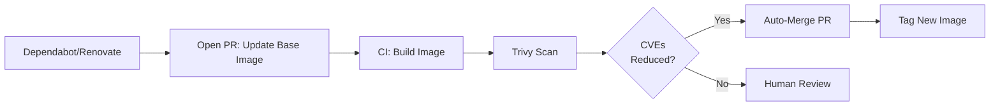
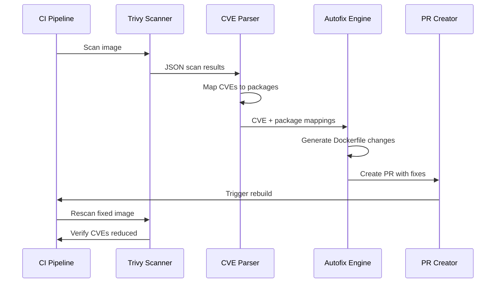
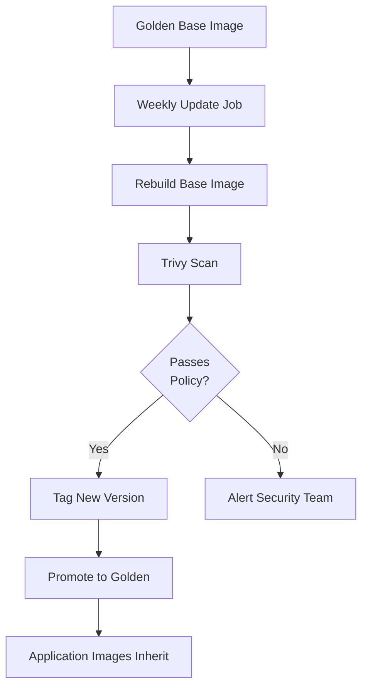
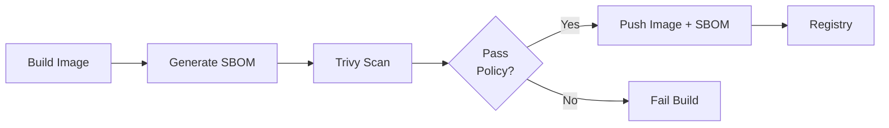
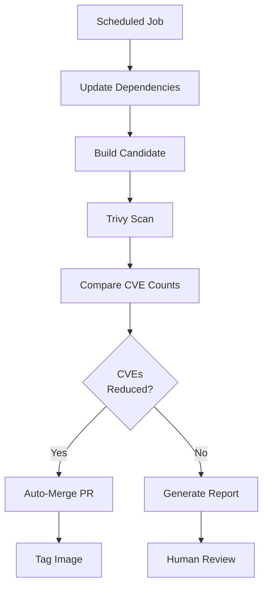
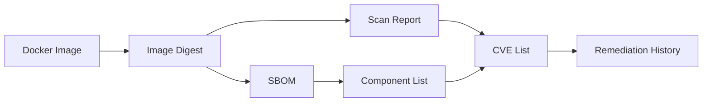

# Best Practices for SBOMs, Trivy Scans, and Automated CVE Mitigation in Docker Images

**Objective**: Master production-grade container security with SBOM generation, vulnerability scanning, and automated CVE mitigation. When you need to secure containerized workloads, maintain compliance, and reduce manual security toil—these best practices become your foundation.

## Introduction

Container security isn't optional. Every Docker image you ship is a potential attack vector. The question isn't whether to scan—it's how to scan systematically, generate Software Bill of Materials (SBOMs) for traceability, and automate remediation without breaking production.

**Why SBOMs Matter**:

SBOMs provide a complete inventory of software components in your images. They enable:
- **Supply chain traceability**: Know exactly what's in every image
- **Vulnerability correlation**: Map CVEs to specific components
- **Compliance**: Meet regulatory requirements (SLSA, SOC2, ISO 27001)
- **Incident response**: Quickly identify affected images when a CVE is disclosed

**Why Trivy (and Similar Scanners)**:

Trivy is fast, accurate, and integrates well into CI/CD pipelines. It scans:
- Container images (OS packages, language dependencies)
- Filesystems and repositories
- Infrastructure as Code (Dockerfiles, Kubernetes manifests)
- Git repositories

But scanning alone isn't enough. You need workflows that automatically reduce vulnerabilities, not just detect them.

**The Limitations of "Just Scan"**:

Running Trivy and failing builds on CVEs creates security theater, not security. Without remediation workflows:
- Developers ignore failing builds
- Critical vulnerabilities accumulate
- Security debt compounds
- Compliance becomes a checkbox exercise

This guide shows you how to build pipelines that scan, generate SBOMs, and automatically fix vulnerabilities in a controlled, auditable way.

## SBOM Fundamentals for Docker Images

### What is an SBOM?

A Software Bill of Materials (SBOM) is a machine-readable inventory of all software components in a container image. Think of it as a manifest that lists:
- Operating system packages (apt, yum, apk)
- Language dependencies (Python packages, npm modules, Go modules)
- Base image layers
- Build-time dependencies

**Common Formats**:

- **CycloneDX**: JSON/XML format, widely supported, good for tooling
- **SPDX**: ISO/IEC standard, comprehensive metadata, good for compliance
- **Syft JSON**: Syft's native format, easy to parse

**Where SBOMs Fit**:

1. **Build Time**: Generate SBOM during image build, store as artifact
2. **Release Time**: Attach SBOM to image tag, publish to registry
3. **Runtime/Deployment**: Reference SBOM for vulnerability correlation, compliance audits

### Inside Image vs Sidecar Artifact

**Inside Image** (SBOM as label/annotation):
- Pros: Always travels with image, no separate artifact management
- Cons: Increases image size, harder to update without rebuilding

**Sidecar Artifact** (SBOM as separate file):
- Pros: Smaller images, can update SBOM without rebuilding, easier to version
- Cons: Requires artifact management, risk of SBOM/image mismatch

**Recommendation**: Use sidecar artifacts stored alongside images in your registry or artifact repository. Reference SBOMs via image labels or annotations.

## Tools & Ecosystem Overview

### Trivy

Trivy is a comprehensive security scanner that:
- Scans container images for OS and language vulnerabilities
- Generates SBOMs in multiple formats (CycloneDX, SPDX)
- Scans filesystems, Git repos, and IaC
- Integrates with CI/CD pipelines
- Provides JSON, SARIF, and HTML output formats

**Why Focus on Trivy**:
- Fast scanning (parallel processing, caching)
- Accurate results (comprehensive vulnerability databases)
- Active development and community
- Good documentation and examples
- Free and open source

### Alternative Tools

**Syft + Grype** (Anchore):
- Syft generates SBOMs, Grype scans them
- Good alternative if you prefer separate tools
- Syft has excellent language dependency detection

**Docker Scout**:
- Docker's native scanning tool
- Integrated with Docker Hub and Docker Desktop
- Good for Docker-native workflows

**GitLab / GitHub Native Scanners**:
- Built into CI/CD platforms
- Convenient but less flexible than Trivy
- Good for getting started, consider Trivy for advanced workflows

**Recommendation**: Start with Trivy for maximum flexibility. Use platform-native scanners as secondary validation.

## Generating SBOMs for Docker Images

### Generating SBOMs from Images

**Basic Trivy SBOM Generation**:

```bash
# Generate CycloneDX JSON SBOM
trivy image --format cyclonedx --output sbom.cdx.json myimage:tag

# Generate SPDX JSON SBOM
trivy image --format spdx-json --output sbom.spdx.json myimage:tag

# Generate Syft JSON (using Syft directly)
syft myimage:tag -o json > sbom.syft.json
```

**Tying SBOMs to Image Tags**:

Use image labels to reference SBOMs:

```dockerfile
# In Dockerfile
LABEL org.opencontainers.image.source="https://github.com/org/repo"
LABEL sbom.digest="sha256:abc123..."
LABEL sbom.format="cyclonedx"
LABEL sbom.location="s3://bucket/sboms/myimage-tag.cdx.json"
```

Or use OCI annotations:

```bash
# After building image
docker buildx imagetools create \
  --annotation "org.opencontainers.image.sbom.digest=sha256:abc123" \
  --annotation "org.opencontainers.image.sbom.format=cyclonedx" \
  myimage:tag
```

### Generating SBOMs at Build Time

**Multi-Stage Build Pattern**:

```dockerfile
# Dockerfile
FROM python:3.11-slim AS builder

WORKDIR /app
COPY requirements.txt .
RUN pip install --user -r requirements.txt

# Generate SBOM in build stage
FROM aquasec/trivy:latest AS trivy
COPY --from=builder /root/.local /tmp/deps
RUN trivy fs --format cyclonedx --output /tmp/sbom.cdx.json /tmp/deps

FROM python:3.11-slim
COPY --from=builder /root/.local /root/.local
COPY --from=trivy /tmp/sbom.cdx.json /sbom.cdx.json
ENV PATH=/root/.local/bin:$PATH

COPY app.py .
CMD ["python", "app.py"]
```

**CI/CD Build-Time Generation**:

```yaml
# GitHub Actions example
- name: Build Docker image
  run: docker build -t myimage:${{ github.sha }} .

- name: Generate SBOM
  run: |
    trivy image \
      --format cyclonedx \
      --output sbom.cdx.json \
      myimage:${{ github.sha }}

- name: Upload SBOM artifact
  uses: actions/upload-artifact@v3
  with:
    name: sbom
    path: sbom.cdx.json
```

### Storing SBOMs

**Option 1: Artifact Repository (S3, GCS, Artifactory)**:

```bash
# Upload SBOM to S3 with versioned naming
aws s3 cp sbom.cdx.json \
  s3://my-artifacts/sboms/myimage-${IMAGE_TAG}-${IMAGE_DIGEST}.cdx.json

# Store with metadata
aws s3 cp sbom.cdx.json \
  s3://my-artifacts/sboms/myimage-${IMAGE_TAG}.cdx.json \
  --metadata "image-digest=${IMAGE_DIGEST},image-tag=${IMAGE_TAG}"
```

**Option 2: OCI Artifacts in Container Registry**:

```bash
# Push SBOM as OCI artifact (Docker Hub, GHCR, Harbor support this)
oras push \
  myregistry.io/myimage:${TAG} \
  sbom.cdx.json:application/vnd.cyclonedx+json

# Or using Trivy's built-in support
trivy image --format cyclonedx \
  --output sbom.cdx.json \
  --sbom-artifact-type cyclonedx \
  myimage:tag
```

**Best Practices**:

1. **Always generate SBOMs for release images**: Tagged releases, not just dev builds
2. **Version SBOMs with image digest**: Use `image-digest` in SBOM filename or metadata
3. **Include SBOM references in images**: Use labels/annotations to link image to SBOM
4. **Store SBOMs immutably**: Use content-addressable storage (digest-based naming)
5. **Generate multiple formats**: CycloneDX for tooling, SPDX for compliance

## Scanning Docker Images with Trivy

### Core Patterns

**Scanning Local Images**:

```bash
# Basic scan
trivy image myimage:tag

# Scan with severity filter
trivy image --severity HIGH,CRITICAL myimage:tag

# Scan and fail on policy violations
trivy image --exit-code 1 --severity HIGH,CRITICAL myimage:tag

# Scan with JSON output
trivy image --format json --output scan.json myimage:tag
```

**Scanning Remote Registry Images**:

```bash
# Scan from Docker Hub
trivy image docker.io/library/nginx:latest

# Scan from private registry (with auth)
trivy image --username $REGISTRY_USER --password $REGISTRY_PASS \
  myregistry.io/myimage:tag

# Scan from AWS ECR
trivy image --aws-region us-east-1 \
  123456789012.dkr.ecr.us-east-1.amazonaws.com/myimage:tag
```

**Scanning Dockerfiles**:

```bash
# Scan Dockerfile for misconfigurations
trivy config Dockerfile

# Scan with policy checks
trivy config --severity HIGH,CRITICAL Dockerfile
```

### Recommended Configurations

**Severity Thresholds**:

```bash
# Fail build on CRITICAL and HIGH only
trivy image \
  --exit-code 1 \
  --severity HIGH,CRITICAL \
  --ignorefile .trivyignore \
  myimage:tag
```

**Ignoring Specific CVEs**:

Create `.trivyignore` file:

```text
# .trivyignore
# CVE-2023-12345: False positive in our use case
# Justification: This CVE affects a feature we don't use
CVE-2023-12345

# CVE-2023-67890: Acceptable risk, will fix in next release
# Justification: Low severity in our deployment context, scheduled fix Q2 2024
CVE-2023-67890
```

**Caching for Performance**:

```bash
# Use cache directory (persist across CI runs)
trivy image --cache-dir /tmp/trivy-cache myimage:tag

# Or use Trivy DB cache
trivy image --cache-backend redis://redis:6379 myimage:tag
```

### CI/CD Integration Examples

**GitHub Actions (Basic)**:

```yaml
name: Security Scan

on:
  push:
    branches: [main]
  pull_request:

jobs:
  scan:
    runs-on: ubuntu-latest
    steps:
      - uses: actions/checkout@v3

      - name: Build image
        run: docker build -t myimage:${{ github.sha }} .

      - name: Run Trivy vulnerability scanner
        uses: aquasecurity/trivy-action@master
        with:
          image-ref: myimage:${{ github.sha }}
          format: 'sarif'
          output: 'trivy-results.sarif'
          severity: 'CRITICAL,HIGH'

      - name: Upload Trivy results to GitHub Security
        uses: github/codeql-action/upload-sarif@v2
        with:
          sarif_file: 'trivy-results.sarif'
```

**GitHub Actions (Advanced with SBOM)**:

```yaml
name: Build, SBOM, and Scan

on:
  push:
    tags:
      - 'v*'

jobs:
  security:
    runs-on: ubuntu-latest
    steps:
      - uses: actions/checkout@v3

      - name: Set up Docker Buildx
        uses: docker/setup-buildx-action@v2

      - name: Build image
        uses: docker/build-push-action@v4
        with:
          context: .
          push: true
          tags: myregistry.io/myimage:${{ github.ref_name }}
          cache-from: type=registry,ref=myregistry.io/myimage:buildcache
          cache-to: type=registry,ref=myregistry.io/myimage:buildcache

      - name: Generate SBOM
        run: |
          trivy image \
            --format cyclonedx \
            --output sbom.cdx.json \
            myregistry.io/myimage:${{ github.ref_name }}

      - name: Upload SBOM
        uses: actions/upload-artifact@v3
        with:
          name: sbom
          path: sbom.cdx.json

      - name: Scan image
        run: |
          trivy image \
            --format json \
            --output scan.json \
            --exit-code 1 \
            --severity HIGH,CRITICAL \
            --ignorefile .trivyignore \
            myregistry.io/myimage:${{ github.ref_name }}

      - name: Upload scan results
        uses: actions/upload-artifact@v3
        with:
          name: scan-results
          path: scan.json

      - name: Publish SBOM to registry
        run: |
          oras push \
            myregistry.io/myimage:${{ github.ref_name }} \
            sbom.cdx.json:application/vnd.cyclonedx+json
```

**GitLab CI**:

```yaml
# .gitlab-ci.yml
stages:
  - build
  - security

build:
  stage: build
  script:
    - docker build -t $CI_REGISTRY_IMAGE:$CI_COMMIT_SHA .
    - docker push $CI_REGISTRY_IMAGE:$CI_COMMIT_SHA

security:
  stage: security
  image: aquasec/trivy:latest
  script:
    # Generate SBOM
    - trivy image --format cyclonedx --output sbom.cdx.json $CI_REGISTRY_IMAGE:$CI_COMMIT_SHA
    
    # Scan image
    - trivy image --format json --output scan.json --exit-code 1 --severity HIGH,CRITICAL $CI_REGISTRY_IMAGE:$CI_COMMIT_SHA
    
    # Upload artifacts
    - |
      if [ -f sbom.cdx.json ]; then
        echo "SBOM generated successfully"
      fi
  artifacts:
    reports:
      sast: scan.json
    paths:
      - sbom.cdx.json
      - scan.json
    expire_in: 30 days
```

### Output Management

**Storing Reports**:

```bash
# JSON for programmatic processing
trivy image --format json --output scan.json myimage:tag

# SARIF for GitHub/GitLab integration
trivy image --format sarif --output scan.sarif myimage:tag

# HTML for human-readable reports
trivy image --format template --template "@contrib/html.tpl" --output scan.html myimage:tag
```

**Surfacing Results**:

- **CI Artifacts**: Upload JSON/SARIF/HTML reports as build artifacts
- **Security Dashboards**: Integrate SARIF with GitHub Security, GitLab Security Dashboard
- **Alerting**: Parse JSON output, send alerts for new CRITICAL CVEs
- **Compliance Reports**: Generate periodic HTML reports for audits

## Policies & Governance Around CVEs

### Defining Risk Thresholds

**Example Policy**:

```yaml
# security-policy.yaml
vulnerability_policy:
  fail_build:
    severity: ["CRITICAL"]
    count_threshold: 0  # Fail on any CRITICAL
  
  warn_build:
    severity: ["HIGH"]
    count_threshold: 5  # Warn if more than 5 HIGH severity
  
  ignore_list:
    file: .trivyignore
    require_justification: true
    review_required: true
```

**Implementation**:

```bash
# Fail on CRITICAL, warn on HIGH
trivy image \
  --exit-code 1 \
  --severity CRITICAL \
  --ignorefile .trivyignore \
  myimage:tag

# Generate report for HIGH (non-blocking)
trivy image \
  --format json \
  --severity HIGH \
  --output high-severity-report.json \
  myimage:tag
```

### Managing False Positives

**Process**:

1. **Identify false positive**: Verify CVE doesn't affect your deployment
2. **Document justification**: Add comment in `.trivyignore`
3. **Review**: Security team reviews ignore list entries
4. **Periodic audit**: Re-evaluate ignored CVEs quarterly

**Example `.trivyignore` with Justifications**:

```text
# CVE-2023-12345: False positive
# Component: libssl1.1
# Justification: CVE affects TLS 1.0/1.1, we only use TLS 1.2+
# Reviewed: 2024-01-15 by security-team
# Next review: 2024-04-15
CVE-2023-12345

# CVE-2023-67890: Acceptable risk
# Component: python3.9
# Justification: Low severity in containerized context, no network exposure
# Mitigation: Network policies restrict access
# Reviewed: 2024-01-20 by security-team
CVE-2023-67890
```

### OS-Level vs App-Level CVEs

**OS-Level CVEs**:
- Fixed by updating base image or running `apt-get upgrade`
- Usually higher priority (affects entire container)
- Mitigation: Regular base image updates

**App-Level CVEs**:
- Fixed by updating language dependencies
- May require code changes
- Mitigation: Dependency update automation

**Policy Example**:

```bash
# Separate handling for OS vs app CVEs
# OS CVEs: Fail on CRITICAL
trivy image --severity CRITICAL --scanners os myimage:tag

# App CVEs: Warn on HIGH, fail on CRITICAL
trivy image --severity HIGH,CRITICAL --scanners lang myimage:tag
```

### Maintaining Allowlists

**Process**:

1. **Request**: Developer requests CVE addition to ignore list
2. **Justification**: Require written justification
3. **Review**: Security team reviews request
4. **Approval**: Merge to `.trivyignore` with review comment
5. **Audit**: Quarterly review of all ignored CVEs

**Automation**:

```bash
# Validate .trivyignore format
trivy image --ignorefile .trivyignore --validate myimage:tag

# Generate report of ignored CVEs
trivy image --format json --ignorefile .trivyignore myimage:tag | \
  jq '.Results[] | select(.Vulnerabilities != null) | .Vulnerabilities[] | select(.VulnerabilityID | IN($ignored[]))'
```

## Designing Automated CVE Mitigation Workflows

### 7.1 Base Image Hygiene

**Strategy**: Regularly update base images and rebuild.

**Best Practices**:

1. **Use minimal base images**: `-slim`, `distroless`, or `alpine`
2. **Pin to digests**: Use `@sha256:...` for reproducibility
3. **Automate updates**: Use Dependabot/Renovate to bump base images
4. **Rescan after updates**: Automatically run Trivy on updated images

**Example Workflow**:

```yaml
# .github/dependabot.yml
version: 2
updates:
  - package-ecosystem: "docker"
    directory: "/"
    schedule:
      interval: "weekly"
    open-pull-requests-limit: 5
```

**Automated Base Image Update Flow**:



**Implementation**:

```yaml
# GitHub Actions: Auto-merge if CVE count reduced
name: Auto-merge Base Image Updates

on:
  pull_request:
    paths:
      - 'Dockerfile'

jobs:
  check-cves:
    runs-on: ubuntu-latest
    steps:
      - uses: actions/checkout@v3
      
      - name: Build candidate image
        run: docker build -t candidate:${{ github.sha }} .
      
      - name: Scan current image
        run: |
          trivy image --format json --output current-scan.json \
            myregistry.io/myimage:latest
          CURRENT_CVES=$(jq '[.Results[].Vulnerabilities[]? | select(.Severity == "CRITICAL" or .Severity == "HIGH")] | length' current-scan.json)
          echo "CURRENT_CVES=$CURRENT_CVES" >> $GITHUB_ENV
      
      - name: Scan candidate image
        run: |
          trivy image --format json --output candidate-scan.json \
            candidate:${{ github.sha }}
          CANDIDATE_CVES=$(jq '[.Results[].Vulnerabilities[]? | select(.Severity == "CRITICAL" or .Severity == "HIGH")] | length' candidate-scan.json)
          echo "CANDIDATE_CVES=$CANDIDATE_CVES" >> $GITHUB_ENV
      
      - name: Auto-merge if improved
        if: env.CANDIDATE_CVES < env.CURRENT_CVES
        run: |
          gh pr merge ${{ github.event.pull_request.number }} --auto --squash
```

### 7.2 Package-Level Updates in Dockerfiles

**Strategy**: Automatically bump OS packages and language dependencies.

**OS Package Updates**:

```dockerfile
# Option 1: Update at build time (pros: latest packages, cons: non-deterministic)
FROM debian:bookworm-slim
RUN apt-get update && \
    apt-get upgrade -y && \
    apt-get install -y python3 && \
    apt-get clean && \
    rm -rf /var/lib/apt/lists/*

# Option 2: Pin versions, update via automation (pros: deterministic, cons: manual updates)
FROM debian:bookworm-slim
RUN apt-get update && \
    apt-get install -y \
      python3=3.11.2-1 \
      python3-pip=23.0-1 && \
    apt-get clean && \
    rm -rf /var/lib/apt/lists/*
```

**Language Dependency Updates**:

**Python (pip/poetry/uv)**:

```dockerfile
# Use lock files for reproducibility
COPY requirements.txt poetry.lock ./
RUN pip install --no-cache-dir -r requirements.txt

# Or with poetry
RUN poetry install --no-dev --no-interaction
```

**Automated Dependency Updates**:

```yaml
# .github/dependabot.yml
version: 2
updates:
  - package-ecosystem: "pip"
    directory: "/"
    schedule:
      interval: "weekly"
    open-pull-requests-limit: 10
    versioning-strategy: increase
```

**Node.js (npm/yarn)**:

```dockerfile
COPY package.json package-lock.json ./
RUN npm ci --only=production
```

**Go Modules**:

```dockerfile
COPY go.mod go.sum ./
RUN go mod download
```

**Guardrails**:

1. **Use lock files**: `requirements.txt`, `package-lock.json`, `go.sum`
2. **Automated PRs**: Dependabot/Renovate create PRs for updates
3. **CI validation**: Rebuild and rescan on dependency updates
4. **Test coverage**: Ensure tests catch breaking changes

### 7.3 Autofix Loop with Scanner Feedback

**Concept**: Parse Trivy results, suggest Dockerfile changes, create PRs.

**Workflow**:



**Implementation**:

```python
# scripts/autofix.py
import json
import subprocess
import re
from typing import Dict, List

def parse_trivy_results(scan_json: str) -> List[Dict]:
    """Parse Trivy JSON output and extract fixable CVEs."""
    with open(scan_json) as f:
        data = json.load(f)
    
    fixable_cves = []
    for result in data.get("Results", []):
        for vuln in result.get("Vulnerabilities", []):
            if vuln.get("Severity") in ["CRITICAL", "HIGH"]:
                pkg_name = vuln.get("PkgName")
                installed_version = vuln.get("InstalledVersion")
                fixed_version = vuln.get("FixedVersion")
                
                if fixed_version:
                    fixable_cves.append({
                        "cve_id": vuln.get("VulnerabilityID"),
                        "package": pkg_name,
                        "current": installed_version,
                        "fixed": fixed_version,
                        "severity": vuln.get("Severity"),
                    })
    
    return fixable_cves

def generate_dockerfile_fix(dockerfile_path: str, fixes: List[Dict]) -> str:
    """Generate updated Dockerfile with package version fixes."""
    with open(dockerfile_path) as f:
        dockerfile = f.read()
    
    # Map fixes to Dockerfile changes
    for fix in fixes:
        pkg = fix["package"]
        old_ver = fix["current"]
        new_ver = fix["fixed"]
        
        # Pattern: apt-get install package=version
        pattern = f"{pkg}={re.escape(old_ver)}"
        replacement = f"{pkg}={new_ver}"
        dockerfile = re.sub(pattern, replacement, dockerfile)
    
    return dockerfile

def create_fix_pr(dockerfile_changes: str, fixes: List[Dict]) -> None:
    """Create PR with suggested fixes."""
    # Write updated Dockerfile
    with open("Dockerfile.fixed", "w") as f:
        f.write(dockerfile_changes)
    
    # Create PR via GitHub CLI or API
    subprocess.run([
        "gh", "pr", "create",
        "--title", f"Security: Auto-fix {len(fixes)} CVEs",
        "--body", generate_pr_body(fixes),
        "--file", "Dockerfile.fixed",
    ])

if __name__ == "__main__":
    fixes = parse_trivy_results("scan.json")
    if fixes:
        dockerfile_fixed = generate_dockerfile_fix("Dockerfile", fixes)
        create_fix_pr(dockerfile_fixed, fixes)
```

**CI Integration**:

```yaml
# GitHub Actions: Autofix workflow
name: Autofix CVEs

on:
  schedule:
    - cron: '0 0 * * 1'  # Weekly
  workflow_dispatch:

jobs:
  autofix:
    runs-on: ubuntu-latest
    steps:
      - uses: actions/checkout@v3
      
      - name: Build and scan
        run: |
          docker build -t testimage .
          trivy image --format json --output scan.json testimage
      
      - name: Run autofix
        run: python scripts/autofix.py
      
      - name: Create PR if fixes available
        if: steps.autofix.outputs.has_fixes == 'true'
        uses: peter-evans/create-pull-request@v5
        with:
          title: 'Security: Auto-fix CVEs'
          body: 'Automated CVE fixes from Trivy scan'
          branch: autofix/cves
```

**Important**: Autofix should create PRs for review, not mutate main branch directly.

### 7.4 Golden Base Images

**Strategy**: Maintain blessed base images, periodically update and scan.

**Workflow**:



**Implementation**:

```dockerfile
# golden-base/Dockerfile
FROM debian:bookworm-slim

# Install common dependencies
RUN apt-get update && \
    apt-get install -y \
      curl \
      ca-certificates \
      && \
    apt-get clean && \
    rm -rf /var/lib/apt/lists/*

# Label with SBOM reference
LABEL org.opencontainers.image.title="Golden Base Image"
LABEL org.opencontainers.image.version="2024.01"
```

**Golden Image Update Pipeline**:

```yaml
# .github/workflows/update-golden-base.yml
name: Update Golden Base Image

on:
  schedule:
    - cron: '0 0 * * 1'  # Weekly
  workflow_dispatch:

jobs:
  update:
    runs-on: ubuntu-latest
    steps:
      - uses: actions/checkout@v3
      
      - name: Build golden base
        run: |
          docker build -t golden-base:latest ./golden-base
      
      - name: Generate SBOM
        run: |
          trivy image --format cyclonedx --output golden-base-sbom.cdx.json \
            golden-base:latest
      
      - name: Scan golden base
        run: |
          trivy image --format json --output golden-base-scan.json \
            --exit-code 1 --severity CRITICAL \
            golden-base:latest
      
      - name: Tag and push if clean
        if: success()
        run: |
          VERSION=$(date +%Y.%m.%d)
          docker tag golden-base:latest \
            myregistry.io/golden-base:${VERSION}
          docker tag golden-base:latest \
            myregistry.io/golden-base:latest
          docker push myregistry.io/golden-base:${VERSION}
          docker push myregistry.io/golden-base:latest
          
          # Push SBOM
          oras push myregistry.io/golden-base:${VERSION} \
            golden-base-sbom.cdx.json:application/vnd.cyclonedx+json
```

**Application Images Inherit Golden Base**:

```dockerfile
# Application Dockerfile
FROM myregistry.io/golden-base:latest

# Add application-specific dependencies
COPY requirements.txt .
RUN pip install -r requirements.txt

COPY app.py .
CMD ["python", "app.py"]
```

## Example End-to-End CI/CD Pipelines

### Pipeline 1: Standard Security Gate

**Flow**:



**Implementation**:

```yaml
# .github/workflows/security-gate.yml
name: Security Gate

on:
  push:
    branches: [main]
  pull_request:

jobs:
  security:
    runs-on: ubuntu-latest
    steps:
      - uses: actions/checkout@v3
      
      - name: Set up Docker Buildx
        uses: docker/setup-buildx-action@v4
      
      - name: Build image
        uses: docker/build-push-action@v4
        with:
          context: .
          push: false
          tags: myimage:${{ github.sha }}
          cache-from: type=gha
          cache-to: type=gha,mode=max
      
      - name: Generate SBOM
        run: |
          trivy image \
            --format cyclonedx \
            --output sbom.cdx.json \
            myimage:${{ github.sha }}
      
      - name: Scan image
        run: |
          trivy image \
            --format json \
            --output scan.json \
            --exit-code 1 \
            --severity CRITICAL,HIGH \
            --ignorefile .trivyignore \
            myimage:${{ github.sha }}
      
      - name: Upload SBOM
        uses: actions/upload-artifact@v3
        with:
          name: sbom
          path: sbom.cdx.json
          retention-days: 90
      
      - name: Upload scan results
        uses: actions/upload-artifact@v3
        with:
          name: scan-results
          path: scan.json
          retention-days: 90
      
      - name: Push image and SBOM (on main)
        if: github.ref == 'refs/heads/main' && github.event_name == 'push'
        run: |
          docker push myimage:${{ github.sha }}
          docker tag myimage:${{ github.sha }} myimage:latest
          docker push myimage:latest
          
          # Push SBOM as OCI artifact
          oras push myregistry.io/myimage:${{ github.sha }} \
            sbom.cdx.json:application/vnd.cyclonedx+json \
            --username ${{ secrets.REGISTRY_USER }} \
            --password ${{ secrets.REGISTRY_PASS }}
```

### Pipeline 2: Autofix Loop

**Flow**:



**Implementation**:

```yaml
# .github/workflows/autofix-loop.yml
name: Autofix Loop

on:
  schedule:
    - cron: '0 2 * * 1'  # Monday 2 AM
  workflow_dispatch:

jobs:
  autofix:
    runs-on: ubuntu-latest
    steps:
      - uses: actions/checkout@v3
        with:
          token: ${{ secrets.GITHUB_TOKEN }}
      
      - name: Update dependencies
        run: |
          # Update base image (example: Dependabot would do this)
          # Or run: pip install --upgrade -r requirements.txt
          # Generate updated requirements.txt
          pip-compile --upgrade requirements.in
      
      - name: Build current image
        run: |
          docker build -t current:latest .
          trivy image --format json --output current-scan.json current:latest
          CURRENT_CVES=$(jq '[.Results[].Vulnerabilities[]? | select(.Severity == "CRITICAL" or .Severity == "HIGH")] | length' current-scan.json)
          echo "CURRENT_CVES=$CURRENT_CVES" >> $GITHUB_ENV
      
      - name: Build candidate image
        run: |
          docker build -t candidate:latest .
          trivy image --format json --output candidate-scan.json candidate:latest
          CANDIDATE_CVES=$(jq '[.Results[].Vulnerabilities[]? | select(.Severity == "CRITICAL" or .Severity == "HIGH")] | length' candidate-scan.json)
          echo "CANDIDATE_CVES=$CANDIDATE_CVES" >> $GITHUB_ENV
      
      - name: Create PR if improved
        if: env.CANDIDATE_CVES < env.CURRENT_CVES
        run: |
          git config user.name "Autofix Bot"
          git config user.email "autofix@example.com"
          git checkout -b autofix/$(date +%Y%m%d)
          git add requirements.txt Dockerfile
          git commit -m "Security: Auto-fix CVEs (reduced from ${{ env.CURRENT_CVES }} to ${{ env.CANDIDATE_CVES }})"
          git push origin autofix/$(date +%Y%m%d)
          
          gh pr create \
            --title "Security: Auto-fix CVEs" \
            --body "Automated CVE fixes. Reduced HIGH/CRITICAL CVEs from ${{ env.CURRENT_CVES }} to ${{ env.CANDIDATE_CVES }}" \
            --base main
      
      - name: Generate report if not improved
        if: env.CANDIDATE_CVES >= env.CURRENT_CVES
        run: |
          echo "CVE count not reduced. Current: ${{ env.CURRENT_CVES }}, Candidate: ${{ env.CANDIDATE_CVES }}"
          trivy image --format template --template "@contrib/html.tpl" \
            --output report.html candidate:latest
          # Upload report or send alert
```

## Integration with Container Registries & Artifact Repositories

### Attaching SBOMs as OCI Artifacts

**Docker Hub / GHCR**:

```bash
# Push SBOM as OCI artifact
oras push \
  ghcr.io/org/repo:tag \
  sbom.cdx.json:application/vnd.cyclonedx+json \
  --username $USERNAME \
  --password $TOKEN
```

**Harbor**:

```bash
# Harbor supports OCI artifacts natively
oras push \
  harbor.example.com/project/repo:tag \
  sbom.cdx.json:application/vnd.cyclonedx+json
```

**AWS ECR**:

```bash
# ECR supports OCI artifacts
aws ecr put-image \
  --repository-name myrepo \
  --image-manifest "$(cat sbom.cdx.json | base64)"
```

### Tagging Images with Security Posture

**Labels for Security Metadata**:

```dockerfile
# In Dockerfile or via build args
LABEL security.scan.date="2024-01-15"
LABEL security.scan.tool="trivy"
LABEL security.scan.version="0.45.0"
LABEL security.cve.count.critical="0"
LABEL security.cve.count.high="3"
LABEL security.sbom.digest="sha256:abc123..."
LABEL security.sbom.format="cyclonedx"
```

**Setting Labels in CI**:

```yaml
- name: Extract security metadata
  run: |
    SCAN_DATE=$(date -u +%Y-%m-%dT%H:%M:%SZ)
    CRITICAL_COUNT=$(jq '[.Results[].Vulnerabilities[]? | select(.Severity == "CRITICAL")] | length' scan.json)
    HIGH_COUNT=$(jq '[.Results[].Vulnerabilities[]? | select(.Severity == "HIGH")] | length' scan.json)
    
    docker build \
      --label "security.scan.date=$SCAN_DATE" \
      --label "security.cve.count.critical=$CRITICAL_COUNT" \
      --label "security.cve.count.high=$HIGH_COUNT" \
      -t myimage:tag .
```

### Registry-Native Scanners

**When to Use Registry Scanners**:

- **Convenience**: Built into platform, no setup
- **Compliance**: Required by organizational policy
- **Baseline**: Good starting point

**When to Use Trivy**:

- **Flexibility**: More control over scanning policies
- **CI/CD Integration**: Better integration with build pipelines
- **SBOM Generation**: Native SBOM support
- **Custom Policies**: More granular control

**Hybrid Approach**:

Use both:
- Trivy in CI/CD for build-time gates
- Registry scanners for runtime monitoring and compliance reporting

## Operational Best Practices

### Regular Scheduled Scans

**Scan Existing Images in Registry**:

```yaml
# .github/workflows/scan-registry.yml
name: Scan Registry Images

on:
  schedule:
    - cron: '0 0 * * 0'  # Weekly
  workflow_dispatch:

jobs:
  scan-registry:
    runs-on: ubuntu-latest
    strategy:
      matrix:
        image:
          - myregistry.io/app:v1.0
          - myregistry.io/app:v1.1
          - myregistry.io/app:latest
    steps:
      - name: Scan image
        run: |
          trivy image \
            --format json \
            --output scan-${{ matrix.image }}.json \
            ${{ matrix.image }}
      
      - name: Check for new CRITICAL CVEs
        run: |
          CRITICAL_COUNT=$(jq '[.Results[].Vulnerabilities[]? | select(.Severity == "CRITICAL")] | length' scan-${{ matrix.image }}.json)
          if [ "$CRITICAL_COUNT" -gt 0 ]; then
            echo "::error::Found $CRITICAL_COUNT CRITICAL CVEs in ${{ matrix.image }}"
            exit 1
          fi
```

### Reporting & Alerting

**Slack Integration**:

```python
# scripts/alert_slack.py
import json
import requests
import os

def send_slack_alert(scan_json: str, webhook_url: str):
    with open(scan_json) as f:
        data = json.load(f)
    
    critical_cves = []
    for result in data.get("Results", []):
        for vuln in result.get("Vulnerabilities", []):
            if vuln.get("Severity") == "CRITICAL":
                critical_cves.append({
                    "id": vuln.get("VulnerabilityID"),
                    "package": vuln.get("PkgName"),
                    "title": vuln.get("Title"),
                })
    
    if critical_cves:
        message = {
            "text": f"🚨 Found {len(critical_cves)} CRITICAL CVEs",
            "blocks": [
                {
                    "type": "section",
                    "text": {
                        "type": "mrkdwn",
                        "text": f"*{len(critical_cves)} CRITICAL CVEs detected*\n" +
                                "\n".join([f"• {cve['id']}: {cve['package']}" for cve in critical_cves])
                    }
                }
            ]
        }
        requests.post(webhook_url, json=message)

if __name__ == "__main__":
    send_slack_alert("scan.json", os.getenv("SLACK_WEBHOOK_URL"))
```

**Email Alerts**:

```bash
# In CI pipeline
if [ "$CRITICAL_COUNT" -gt 0 ]; then
  echo "Found $CRITICAL_COUNT CRITICAL CVEs" | \
    mail -s "Security Alert: CRITICAL CVEs in $IMAGE" \
    security-team@example.com
fi
```

### Policy for Deprecating Images

**Deprecation Workflow**:

1. **Detect**: Scheduled scan finds unresolved CRITICAL CVEs
2. **Alert**: Notify security team and image owners
3. **Grace Period**: 30 days to fix or justify
4. **Deprecate**: Mark image as deprecated in registry
5. **Block**: Prevent new deployments of deprecated images

**Implementation**:

```bash
# Mark image as deprecated
docker manifest annotate \
  myregistry.io/myimage:tag \
  --annotation org.opencontainers.image.deprecated=true \
  --annotation org.opencontainers.image.deprecated.reason="CRITICAL CVEs unresolved"

# Or use registry API
curl -X PATCH \
  -H "Authorization: Bearer $TOKEN" \
  -H "Content-Type: application/json" \
  -d '{"deprecated": true, "reason": "CRITICAL CVEs"}' \
  https://registry.example.com/v2/org/repo/manifests/tag
```

### Storing Historical SBOMs and Scan Results

**Artifact Repository Pattern**:

```bash
# Store with versioned paths
aws s3 cp sbom.cdx.json \
  s3://artifacts/sboms/myimage/${IMAGE_TAG}/${IMAGE_DIGEST}.cdx.json

aws s3 cp scan.json \
  s3://artifacts/scans/myimage/${IMAGE_TAG}/${SCAN_DATE}.json
```

**Database Pattern**:

```sql
-- Store scan results in database
CREATE TABLE image_scans (
    id SERIAL PRIMARY KEY,
    image_name VARCHAR(255),
    image_tag VARCHAR(255),
    image_digest VARCHAR(255),
    scan_date TIMESTAMP,
    critical_count INTEGER,
    high_count INTEGER,
    medium_count INTEGER,
    low_count INTEGER,
    scan_report JSONB,
    sbom_location TEXT
);

CREATE INDEX idx_image_scans_image ON image_scans(image_name, image_tag);
CREATE INDEX idx_image_scans_date ON image_scans(scan_date);
```

## Security & Compliance Considerations

### Supply Chain Security Frameworks

**SLSA (Supply-chain Levels for Software Artifacts)**:

- **Level 1**: Basic provenance (SBOMs provide this)
- **Level 2**: Version-controlled builds (CI/CD provides this)
- **Level 3**: Non-falsifiable provenance (signed SBOMs, attestations)

**Mapping to SLSA**:

- **SBOMs**: Provide software provenance (what's in the image)
- **Scan Results**: Provide security attestations
- **Signed Artifacts**: Use cosign or similar to sign images + SBOMs

**Example: Signed SBOM**:

```bash
# Generate and sign SBOM
trivy image --format cyclonedx --output sbom.cdx.json myimage:tag
cosign sign-blob --bundle sbom.cdx.json.bundle sbom.cdx.json
```

### Compliance Expectations

**SOC 2**:
- **Control**: Change management, vulnerability management
- **Evidence**: SBOMs, scan reports, remediation workflows

**ISO 27001**:
- **Control**: A.12.6.1 (Management of technical vulnerabilities)
- **Evidence**: Vulnerability scanning, patch management, SBOMs

**Traceability Requirements**:



**Implementation**:

- Store image digest in SBOM metadata
- Link scan reports to image digests
- Maintain audit trail of all scans and fixes

### Reproducibility

**Ensuring Reproducible Builds**:

1. **Pin base images**: Use digests, not tags
2. **Lock dependencies**: Use lock files (requirements.txt, package-lock.json)
3. **Deterministic builds**: Set build timestamps, use build args
4. **Regenerate SBOMs**: Same image should produce same SBOM

**Example Reproducible Dockerfile**:

```dockerfile
# Pin base image to digest
FROM debian@sha256:abc123... AS base

# Use specific package versions
RUN apt-get update && \
    apt-get install -y \
      python3=3.11.2-1 \
      && \
    apt-get clean

# Copy lock file
COPY requirements.txt ./
RUN pip install --no-cache-dir -r requirements.txt
```

## Limitations and Non-Goals

### What Automation Cannot Safely Do

**Arbitrary Auto-Edit of Application Code**:
- Don't automatically modify application source code
- Don't change business logic to fix CVEs
- Focus on dependency and base image updates only

**Auto-Upgrade Major Versions**:
- Major version upgrades (Python 3.11 → 3.12) require testing
- Breaking changes may require code modifications
- Use automated PRs for review, not direct merges

**Bypassing Security Policies**:
- Don't auto-ignore CVEs without review
- Don't lower severity thresholds automatically
- Maintain human oversight for security decisions

### What You Still Need

**Good Tests**:
- Comprehensive test suites catch breaking changes
- Integration tests verify image functionality
- Security tests validate fixes don't introduce regressions

**Human Review**:
- Review autofix PRs before merging
- Validate CVE ignore list justifications
- Approve major version upgrades

**Monitoring**:
- Monitor production for new vulnerabilities
- Track CVE trends over time
- Alert on critical CVEs in running containers

## Conclusion

A sane maturity path for container security:

### Phase 1: Generate SBOMs + Scan Images

**Goals**:
- Generate SBOMs for all release images
- Run Trivy scans in CI/CD
- Store SBOMs and scan results

**Implementation**:
- Add Trivy to CI/CD pipelines
- Generate SBOMs at build time
- Store artifacts in registry or S3

### Phase 2: Enforce Basic Gating Policy

**Goals**:
- Fail builds on CRITICAL CVEs
- Warn on HIGH severity
- Maintain ignore list with justifications

**Implementation**:
- Configure Trivy exit codes
- Create `.trivyignore` with reviews
- Integrate scan results into CI gates

### Phase 3: Introduce Golden Base Images

**Goals**:
- Maintain blessed base images
- Regular updates and scanning
- Application images inherit golden bases

**Implementation**:
- Create golden base image repository
- Weekly update and scan pipeline
- Update application Dockerfiles to use golden bases

### Phase 4: Add Dependency Update Automation

**Goals**:
- Automatically update dependencies
- Validate updates with scans
- Create PRs for review

**Implementation**:
- Configure Dependabot/Renovate
- CI validates dependency updates
- Auto-merge safe updates

### Phase 5: Add Autofix Proposal Loops

**Goals**:
- Parse Trivy results programmatically
- Generate Dockerfile fixes
- Create PRs with suggested changes

**Implementation**:
- Build autofix scripts
- Integrate with CI/CD
- Maintain human review process

**Key Principles**:

1. **Automate the boring**: Dependency updates, base image bumps
2. **Review the risky**: Major version changes, security policy changes
3. **Track everything**: SBOMs, scans, remediation history
4. **Fail fast**: Catch vulnerabilities early in CI/CD
5. **Fix systematically**: Use automation to reduce manual toil

This approach transforms container security from a manual, error-prone process into a systematic, automated workflow that scales with your infrastructure.

## See Also

- **[Docker & Compose](docker-and-compose.md)** - Production containerization patterns
- **[Ansible Security Hardening](ansible-security-hardening.md)** - Infrastructure security practices
- **[CI/CD Pipelines](../architecture-design/ci-cd-pipelines.md)** - Continuous integration patterns

---

*This guide provides the complete machinery for production-grade container security. The patterns scale from single images to enterprise registries, from manual processes to fully automated remediation workflows.*

