# Advanced Tmux Workflows (2025 Edition)

**Objective**: Master production-grade tmux workflows for distributed geospatial and data engineering environments. When you need to orchestrate complex multi-service workflows, when you want to maintain persistent development environments, when you're debugging across multiple systems—advanced tmux becomes your weapon of choice.

tmux is more than pane-splitting—it's your personal mission control.

## 0) Prerequisites (Read Once, Live by Them)

### The Five Commandments

1. **Understand session orchestration**
   - Named sessions per project and workflow
   - Window hierarchies for different service types
   - Pane layouts for dedicated monitoring and control
   - Session persistence and recovery patterns

2. **Master tmux scripting and automation**
   - tmuxp and teamocil for reproducible environments
   - Shell scripts for complex session setup
   - Integration with CI/CD and deployment pipelines
   - Team collaboration and knowledge sharing

3. **Know your remote workflows**
   - SSH session management and persistence
   - Connection resilience under unstable networks
   - Collaborative debugging with tmate
   - Air-gapped environment considerations

4. **Validate everything**
   - Test session recovery after disconnections
   - Verify scripted environment reproducibility
   - Check keybinding efficiency and muscle memory
   - Monitor resource usage and performance impact

5. **Plan for production**
   - Design for team collaboration and knowledge transfer
   - Enable session persistence and recovery
   - Support multiple concurrent workflows
   - Document operational procedures and runbooks

**Why These Principles**: Advanced tmux requires understanding distributed systems, workflow orchestration, and team collaboration. Understanding these patterns prevents workflow chaos and enables reliable development environments.

## 1) Session Orchestration

### Named Sessions per Project

```bash
# Create project-specific sessions
tmux new-session -d -s hermit -c ~/projects/hermit
tmux new-session -d -s blacklake -c ~/projects/blacklake
tmux new-session -d -s rdw -c ~/projects/rdw
tmux new-session -d -s gpu1 -c ~/projects/geospatial-ml

# Attach to specific session
tmux attach-session -t hermit

# List all sessions
tmux list-sessions

# Kill specific session
tmux kill-session -t hermit
```

**Why Named Sessions Matter**: Project-specific sessions prevent workflow confusion and enable focused development. Understanding these patterns prevents session chaos and enables efficient multitasking.

### Session Configuration

```bash
# ~/.tmux.conf
# Session management
set -g default-terminal "screen-256color"
set -g terminal-overrides ",xterm-256color:Tc"
set -g history-limit 10000
set -g mouse on

# Session persistence
set -g @resurrect-capture-pane-contents 'on'
set -g @resurrect-strategy-vim 'session'
set -g @resurrect-strategy-nvim 'session'

# Window and pane numbering
set -g base-index 1
setw -g pane-base-index 1

# Renumber windows when one is closed
set -g renumber-windows on

# Increase scrollback buffer
set -g history-limit 50000

# Enable focus events
set -g focus-events on

# Aggressive resize
setw -g aggressive-resize on
```

**Why Session Configuration Matters**: Proper configuration enables efficient session management and persistence. Understanding these patterns prevents configuration issues and enables reliable tmux operations.

## 2) Windows & Panes as Dedicated Roles

### Window Layout for Data Engineering

```bash
# Create dedicated windows for different services
tmux new-window -t hermit -n docker -c ~/projects/hermit
tmux new-window -t hermit -n prefect -c ~/projects/hermit
tmux new-window -t hermit -n postgres -c ~/projects/hermit
tmux new-window -t hermit -n monitoring -c ~/projects/hermit

# Split panes for specific roles
tmux split-window -h -t hermit:docker
tmux split-window -v -t hermit:docker.0
tmux split-window -v -t hermit:docker.1

# Layout: Docker Buildx logs, MinIO logs, Prefect logs, Grafana agent
tmux send-keys -t hermit:docker.0 "docker buildx bake --progress=plain 2>&1 | tee build.log" Enter
tmux send-keys -t hermit:docker.1 "docker logs -f minio" Enter
tmux send-keys -t hermit:docker.2 "prefect agent start -q gpu" Enter
tmux send-keys -t hermit:docker.3 "docker logs -f grafana-agent" Enter
```

**Why Window Layout Matters**: Dedicated windows prevent service confusion and enable focused monitoring. Understanding these patterns prevents workflow chaos and enables efficient service management.

### Pane Synchronization for Cluster Control

```bash
# Synchronize panes for cluster operations
tmux set-window-option -t hermit:prefect synchronize-panes on

# Broadcast commands to all Prefect agents
tmux send-keys -t hermit:prefect "prefect agent start -q cpu" Enter

# Disable synchronization
tmux set-window-option -t hermit:prefect synchronize-panes off
```

**Why Pane Synchronization Matters**: Synchronized panes enable efficient cluster management and operations. Understanding these patterns prevents manual repetition and enables reliable distributed operations.

## 3) Scripting for Reproducibility

### tmuxp Configuration

```yaml
# ~/.tmuxp/hermit.yml
session_name: hermit
start_directory: ~/projects/hermit
windows:
  - window_name: docker
    layout: tiled
    panes:
      - shell_command: docker buildx bake --progress=plain 2>&1 | tee build.log
      - shell_command: docker logs -f minio
      - shell_command: prefect agent start -q gpu
      - shell_command: docker logs -f grafana-agent
  
  - window_name: prefect
    layout: tiled
    panes:
      - shell_command: prefect agent start -q cpu
      - shell_command: prefect agent start -q gpu
      - shell_command: prefect server start
      - shell_command: prefect ui start
  
  - window_name: postgres
    layout: tiled
    panes:
      - shell_command: psql -h localhost -U postgres -d hermit
      - shell_command: psql -h localhost -U postgres -d blacklake
      - shell_command: psql -h localhost -U postgres -d rdw
      - shell_command: watch -n 5 "psql -h localhost -U postgres -c 'SELECT * FROM pg_stat_activity;'"
  
  - window_name: monitoring
    layout: tiled
    panes:
      - shell_command: docker logs -f prometheus
      - shell_command: docker logs -f grafana
      - shell_command: docker logs -f loki
      - shell_command: docker logs -f tempo
```

### Shell Script for Complex Setup

```bash
#!/bin/bash
# ~/bin/setup-hermit-session.sh

# Kill existing session if it exists
tmux kill-session -t hermit 2>/dev/null

# Create new session
tmux new-session -d -s hermit -c ~/projects/hermit

# Create windows
tmux new-window -t hermit -n docker
tmux new-window -t hermit -n prefect
tmux new-window -t hermit -n postgres
tmux new-window -t hermit -n monitoring
tmux new-window -t hermit -n logs

# Configure docker window
tmux split-window -h -t hermit:docker
tmux split-window -v -t hermit:docker.0
tmux split-window -v -t hermit:docker.1
tmux select-layout -t hermit:docker tiled

# Start services in docker window
tmux send-keys -t hermit:docker.0 "docker buildx bake --progress=plain 2>&1 | tee build.log" Enter
tmux send-keys -t hermit:docker.1 "docker logs -f minio" Enter
tmux send-keys -t hermit:docker.2 "prefect agent start -q gpu" Enter
tmux send-keys -t hermit:docker.3 "docker logs -f grafana-agent" Enter

# Configure prefect window
tmux split-window -h -t hermit:prefect
tmux split-window -v -t hermit:prefect.0
tmux split-window -v -t hermit:prefect.1
tmux select-layout -t hermit:prefect tiled

# Start Prefect services
tmux send-keys -t hermit:prefect.0 "prefect agent start -q cpu" Enter
tmux send-keys -t hermit:prefect.1 "prefect agent start -q gpu" Enter
tmux send-keys -t hermit:prefect.2 "prefect server start" Enter
tmux send-keys -t hermit:prefect.3 "prefect ui start" Enter

# Configure postgres window
tmux split-window -h -t hermit:postgres
tmux split-window -v -t hermit:postgres.0
tmux split-window -v -t hermit:postgres.1
tmux select-layout -t hermit:postgres tiled

# Start database connections
tmux send-keys -t hermit:postgres.0 "psql -h localhost -U postgres -d hermit" Enter
tmux send-keys -t hermit:postgres.1 "psql -h localhost -U postgres -d blacklake" Enter
tmux send-keys -t hermit:postgres.2 "psql -h localhost -U postgres -d rdw" Enter
tmux send-keys -t hermit:postgres.3 "watch -n 5 \"psql -h localhost -U postgres -c 'SELECT * FROM pg_stat_activity;'\"" Enter

# Configure monitoring window
tmux split-window -h -t hermit:monitoring
tmux split-window -v -t hermit:monitoring.0
tmux split-window -v -t hermit:monitoring.1
tmux select-layout -t hermit:monitoring tiled

# Start monitoring services
tmux send-keys -t hermit:monitoring.0 "docker logs -f prometheus" Enter
tmux send-keys -t hermit:monitoring.1 "docker logs -f grafana" Enter
tmux send-keys -t hermit:monitoring.2 "docker logs -f loki" Enter
tmux send-keys -t hermit:monitoring.3 "docker logs -f tempo" Enter

# Configure logs window
tmux split-window -h -t hermit:logs
tmux split-window -v -t hermit:logs.0
tmux split-window -v -t hermit:logs.1
tmux select-layout -t hermit:logs tiled

# Start log monitoring
tmux send-keys -t hermit:logs.0 "tail -f ~/projects/hermit/logs/application.log" Enter
tmux send-keys -t hermit:logs.1 "tail -f ~/projects/hermit/logs/error.log" Enter
tmux send-keys -t hermit:logs.2 "tail -f ~/projects/hermit/logs/access.log" Enter
tmux send-keys -t hermit:logs.3 "tail -f ~/projects/hermit/logs/debug.log" Enter

# Select first window and attach
tmux select-window -t hermit:docker
tmux attach-session -t hermit
```

**Why Scripting Matters**: Reproducible environments prevent setup chaos and enable team collaboration. Understanding these patterns prevents manual repetition and enables reliable development workflows.

## 4) Keybindings & Optimizations

### Custom Keybindings

```bash
# ~/.tmux.conf
# Pane navigation
bind-key -n C-h select-pane -L
bind-key -n C-j select-pane -D
bind-key -n C-k select-pane -U
bind-key -n C-l select-pane -R

# Window navigation
bind-key -n C-Left previous-window
bind-key -n C-Right next-window

# Pane resizing
bind-key -r H resize-pane -L 5
bind-key -r J resize-pane -D 5
bind-key -r K resize-pane -U 5
bind-key -r L resize-pane -R 5

# Pane splitting
bind-key | split-window -h -c "#{pane_current_path}"
bind-key - split-window -v -c "#{pane_current_path}"

# Pane synchronization toggle
bind-key S set-window-option synchronize-panes

# Quick session switching
bind-key -n C-b switch-client -l

# Session management
bind-key -n C-n new-session
bind-key -n C-w kill-window
bind-key -n C-q kill-session

# Copy mode
bind-key -n C-c copy-mode
bind-key -T copy-mode-vi v send-keys -X begin-selection
bind-key -T copy-mode-vi y send-keys -X copy-selection-and-cancel

# Reload configuration
bind-key r source-file ~/.tmux.conf \; display-message "Config reloaded!"

# Status bar customization
set -g status-bg colour235
set -g status-fg colour136
set -g status-left-length 40
set -g status-left "#[fg=green]: #h : #[fg=brightblue]#(curl icanhazip.com) #[fg=yellow]#(ifconfig en0 | grep 'inet ' | awk '{print \"en0 \" $2}') #[fg=red]#(ifconfig en1 | grep 'inet ' | awk '{print \"en1 \" $2}') "
set -g status-right '#[fg=green]#(tmux-mem-cpu-load) #[fg=blue] %Y-%m-%d %H:%M:%S'
set -g status-right-length 60
set -g status-justify centre
set -g status-left-length 20
set -g status-left '#[fg=green]#S #[fg=blue]| '
set -g status-right '#[fg=blue]| %Y-%m-%d %H:%M:%S #[fg=green]#(tmux-mem-cpu-load)'
```

**Why Keybindings Matter**: Efficient keybindings prevent workflow interruption and enable muscle memory. Understanding these patterns prevents navigation chaos and enables productive tmux usage.

### Workflow Optimizations

```bash
# Quick pane switching with visual feedback
bind-key -n C-h select-pane -L \; display-pane -t "#{pane_id}" -F "Left: #{pane_current_command}"
bind-key -n C-j select-pane -D \; display-pane -t "#{pane_id}" -F "Down: #{pane_current_command}"
bind-key -n C-k select-pane -U \; display-pane -t "#{pane_id}" -F "Up: #{pane_current_command}"
bind-key -n C-l select-pane -R \; display-pane -t "#{pane_id}" -F "Right: #{pane_current_command}"

# Quick window switching
bind-key -n C-1 select-window -t 1
bind-key -n C-2 select-window -t 2
bind-key -n C-3 select-window -t 3
bind-key -n C-4 select-window -t 4
bind-key -n C-5 select-window -t 5

# Quick session switching
bind-key -n C-s choose-session
bind-key -n C-t choose-window
bind-key -n C-p choose-pane
```

**Why Workflow Optimizations Matter**: Optimized workflows prevent context switching and enable focused development. Understanding these patterns prevents workflow interruption and enables efficient multitasking.

## 5) Remote Development Patterns

### SSH + Tmux Resilience

```bash
# ~/.ssh/config
Host hermit-server
    HostName hermit.company.com
    User engineer
    Port 22
    ServerAliveInterval 60
    ServerAliveCountMax 3
    TCPKeepAlive yes
    RemoteCommand tmux new-session -A -s hermit
    RequestTTY yes

# Connect and attach to existing session
ssh hermit-server

# Or create new session if none exists
ssh hermit-server -t "tmux new-session -A -s hermit"
```

**Why SSH + Tmux Matters**: Remote session persistence prevents work loss and enables seamless development. Understanding these patterns prevents connection chaos and enables reliable remote workflows.

### Collaborative Debugging with tmate

```bash
# Install tmate
brew install tmate  # macOS
sudo apt-get install tmate  # Ubuntu

# Start collaborative session
tmate -S /tmp/tmate.sock new-session -d
tmate -S /tmp/tmate.sock wait tmate-ready
tmate -S /tmp/tmate.sock display -p '#{tmate_ssh}'
tmate -S /tmp/tmate.sock display -p '#{tmate_web}'

# Share session with team
echo "Share this SSH command: $(tmate -S /tmp/tmate.sock display -p '#{tmate_ssh}')"
echo "Share this web URL: $(tmate -S /tmp/tmate.sock display -p '#{tmate_web}')"
```

**Why Collaborative Debugging Matters**: Team collaboration enables knowledge sharing and faster problem resolution. Understanding these patterns prevents isolation and enables effective team debugging.

### Air-Gapped Environment Considerations

```bash
# Air-gapped session setup
tmux new-session -d -s air-gapped -c /opt/air-gapped/project

# Configure for offline work
tmux send-keys -t air-gapped "export OFFLINE_MODE=true" Enter
tmux send-keys -t air-gapped "export NO_INTERNET=true" Enter
tmux send-keys -t air-gapped "export LOCAL_REGISTRY=registry.local:5000" Enter

# Create offline documentation
tmux new-window -t air-gapped -n docs
tmux send-keys -t air-gapped:docs "cd /opt/air-gapped/docs && python -m http.server 8080" Enter
```

**Why Air-Gapped Considerations Matter**: Offline environments require special configuration and preparation. Understanding these patterns prevents offline failures and enables reliable air-gapped development.

## 6) Integration with Workflows

### Docker Buildx Integration

```bash
# Multi-arch build monitoring
tmux new-session -d -s buildx -c ~/projects/multi-arch
tmux split-window -h -t buildx
tmux split-window -v -t buildx.0
tmux split-window -v -t buildx.1

# Start multi-arch build
tmux send-keys -t buildx.0 "docker buildx bake --progress=plain --platform linux/amd64,linux/arm64 2>&1 | tee build.log" Enter

# Monitor build progress
tmux send-keys -t buildx.1 "watch -n 5 'docker buildx ls'" Enter

# Monitor system resources
tmux send-keys -t buildx.2 "htop" Enter

# Monitor Docker daemon
tmux send-keys -t buildx.3 "docker system events" Enter
```

**Why Docker Integration Matters**: Build monitoring prevents failures and enables efficient multi-arch development. Understanding these patterns prevents build chaos and enables reliable container workflows.

### Prefect Flow Orchestration

```bash
# Prefect workflow monitoring
tmux new-session -d -s prefect-flows -c ~/projects/prefect-workflows
tmux new-window -t prefect-flows -n agents
tmux new-window -t prefect-flows -n flows
tmux new-window -t prefect-flows -n monitoring

# Start Prefect agents
tmux send-keys -t prefect-flows:agents "prefect agent start -q cpu" Enter
tmux split-window -h -t prefect-flows:agents
tmux send-keys -t prefect-flows:agents.1 "prefect agent start -q gpu" Enter

# Monitor flow execution
tmux send-keys -t prefect-flows:flows "prefect flow run --name 'geospatial-etl'" Enter
tmux split-window -h -t prefect-flows:flows
tmux send-keys -t prefect-flows:flows.1 "prefect flow run --name 'data-quality-check'" Enter

# Monitor system resources
tmux send-keys -t prefect-flows:monitoring "prefect server start" Enter
tmux split-window -h -t prefect-flows:monitoring
tmux send-keys -t prefect-flows:monitoring.1 "prefect ui start" Enter
```

**Why Prefect Integration Matters**: Workflow orchestration prevents execution failures and enables efficient data processing. Understanding these patterns prevents workflow chaos and enables reliable data engineering.

### PostgreSQL Debugging

```bash
# Database debugging session
tmux new-session -d -s postgres-debug -c ~/projects/database-debug
tmux split-window -h -t postgres-debug
tmux split-window -v -t postgres-debug.0
tmux split-window -v -t postgres-debug.1

# Connect to different databases
tmux send-keys -t postgres-debug.0 "psql -h localhost -U postgres -d hermit" Enter
tmux send-keys -t postgres-debug.1 "psql -h localhost -U postgres -d blacklake" Enter
tmux send-keys -t postgres-debug.2 "psql -h localhost -U postgres -d rdw" Enter

# Monitor database activity
tmux send-keys -t postgres-debug.3 "watch -n 5 \"psql -h localhost -U postgres -c 'SELECT * FROM pg_stat_activity;'\"" Enter
```

**Why PostgreSQL Integration Matters**: Database debugging prevents data issues and enables efficient database operations. Understanding these patterns prevents database chaos and enables reliable data management.

## 7) Monitoring & Observability

### Multi-Service Log Monitoring

```bash
# Comprehensive log monitoring
tmux new-session -d -s logs -c ~/projects/log-monitoring
tmux split-window -h -t logs
tmux split-window -v -t logs.0
tmux split-window -v -t logs.1

# Monitor application logs
tmux send-keys -t logs.0 "tail -f ~/projects/hermit/logs/application.log" Enter
tmux send-keys -t logs.1 "tail -f ~/projects/hermit/logs/error.log" Enter
tmux send-keys -t logs.2 "tail -f ~/projects/hermit/logs/access.log" Enter
tmux send-keys -t logs.3 "tail -f ~/projects/hermit/logs/debug.log" Enter

# Monitor system logs
tmux new-window -t logs -n system
tmux split-window -h -t logs:system
tmux split-window -v -t logs:system.0
tmux split-window -v -t logs:system.1

tmux send-keys -t logs:system.0 "journalctl -f -u docker" Enter
tmux send-keys -t logs:system.1 "journalctl -f -u postgresql" Enter
tmux send-keys -t logs:system.2 "journalctl -f -u nginx" Enter
tmux send-keys -t logs:system.3 "journalctl -f -u prometheus" Enter
```

**Why Log Monitoring Matters**: Comprehensive log monitoring prevents blind spots and enables proactive issue resolution. Understanding these patterns prevents monitoring failures and enables reliable observability.

### GPU vs CPU Session Split

```bash
# GPU/CPU workload separation
tmux new-session -d -s gpu-workloads -c ~/projects/gpu-ml
tmux new-session -d -s cpu-workloads -c ~/projects/cpu-processing

# GPU session for ML workloads
tmux new-window -t gpu-workloads -n training
tmux new-window -t gpu-workloads -n inference
tmux new-window -t gpu-workloads -n monitoring

# Start GPU training
tmux send-keys -t gpu-workloads:training "python train_geospatial_model.py --gpu 0" Enter
tmux split-window -h -t gpu-workloads:training
tmux send-keys -t gpu-workloads:training.1 "nvidia-smi -l 1" Enter

# Start GPU inference
tmux send-keys -t gpu-workloads:inference "python inference_pipeline.py --gpu 1" Enter
tmux split-window -h -t gpu-workloads:inference
tmux send-keys -t gpu-workloads:inference.1 "watch -n 5 'nvidia-smi'" Enter

# Monitor GPU resources
tmux send-keys -t gpu-workloads:monitoring "htop" Enter
tmux split-window -h -t gpu-workloads:monitoring
tmux send-keys -t gpu-workloads:monitoring.1 "watch -n 5 'nvidia-smi --query-gpu=utilization.gpu,memory.used,memory.total --format=csv'" Enter

# CPU session for data processing
tmux new-window -t cpu-workloads -n etl
tmux new-window -t cpu-workloads -n analysis
tmux new-window -t cpu-workloads -n monitoring

# Start CPU ETL
tmux send-keys -t cpu-workloads:etl "python etl_pipeline.py --workers 8" Enter
tmux split-window -h -t cpu-workloads:etl
tmux send-keys -t cpu-workloads:etl.1 "htop" Enter

# Start CPU analysis
tmux send-keys -t cpu-workloads:analysis "python data_analysis.py --cores 16" Enter
tmux split-window -h -t cpu-workloads:analysis
tmux send-keys -t cpu-workloads:analysis.1 "watch -n 5 'ps aux | grep python'" Enter

# Monitor CPU resources
tmux send-keys -t cpu-workloads:monitoring "htop" Enter
tmux split-window -h -t cpu-workloads:monitoring
tmux send-keys -t cpu-workloads:monitoring.1 "watch -n 5 'top -bn1 | head -20'" Enter
```

**Why GPU/CPU Split Matters**: Resource separation prevents resource contention and enables efficient workload management. Understanding these patterns prevents performance issues and enables reliable resource utilization.

## 8) Workflow Orchestration Diagram

### Complete Tmux Workflow

```mermaid
graph TB
    subgraph "Tmux Session: hermit"
        A[Window: Docker] --> B[Pane: Buildx Logs]
        A --> C[Pane: MinIO Logs]
        A --> D[Pane: Prefect Agent]
        A --> E[Pane: Grafana Agent]
        
        F[Window: Prefect] --> G[Pane: CPU Agent]
        F --> H[Pane: GPU Agent]
        F --> I[Pane: Prefect Server]
        F --> J[Pane: Prefect UI]
        
        K[Window: Postgres] --> L[Pane: Hermit DB]
        K --> M[Pane: Blacklake DB]
        K --> N[Pane: RDW DB]
        K --> O[Pane: Activity Monitor]
        
        P[Window: Monitoring] --> Q[Pane: Prometheus]
        P --> R[Pane: Grafana]
        P --> S[Pane: Loki]
        P --> T[Pane: Tempo]
    end
    
    subgraph "External Services"
        U[Docker Buildx]
        V[MinIO Storage]
        W[Prefect Orchestration]
        X[PostgreSQL Cluster]
        Y[Monitoring Stack]
    end
    
    B --> U
    C --> V
    D --> W
    E --> Y
    G --> W
    H --> W
    I --> W
    J --> W
    L --> X
    M --> X
    N --> X
    O --> X
    Q --> Y
    R --> Y
    S --> Y
    T --> Y
```



**Why Workflow Diagrams Matter**: Visual representation of tmux workflows enables understanding of complex orchestration. Understanding these patterns prevents workflow confusion and enables reliable development environments.

## 9) TL;DR Runbook

### Essential Commands

```bash
# Create project sessions
tmux new-session -d -s hermit -c ~/projects/hermit
tmux new-session -d -s blacklake -c ~/projects/blacklake
tmux new-session -d -s rdw -c ~/projects/rdw

# Attach to sessions
tmux attach-session -t hermit
tmux attach-session -t blacklake
tmux attach-session -t rdw

# Create windows and panes
tmux new-window -t hermit -n docker
tmux split-window -h -t hermit:docker
tmux split-window -v -t hermit:docker.0
tmux split-window -v -t hermit:docker.1

# Synchronize panes for cluster control
tmux set-window-option -t hermit:docker synchronize-panes on

# Script reproducible environments
tmuxp load ~/.tmuxp/hermit.yml
```

### Essential Patterns

```bash
# Essential tmux patterns
tmux_patterns = {
    "session_orchestration": "Name sessions per project, script reproducible layouts",
    "pane_synchronization": "Use panes for dedicated logs/agents/db shells, synchronize for cluster control",
    "remote_workflows": "SSH + tmux = resilience, tmate for collaboration",
    "workflow_integration": "Integrate Docker, Prefect, Postgres, Valhalla in single tmux cockpit",
    "monitoring": "Use tail -f across multiple worker logs, synchronized pane input for cluster control",
    "resource_separation": "Quick CPU/GPU session split for different workload types"
}
```

### Quick Reference

```bash
# Essential tmux operations
# 1. Create project session
tmux new-session -d -s project-name -c ~/projects/project-name

# 2. Create windows and panes
tmux new-window -t project-name -n service-name
tmux split-window -h -t project-name:service-name
tmux split-window -v -t project-name:service-name.0
tmux split-window -v -t project-name:service-name.1

# 3. Start services in panes
tmux send-keys -t project-name:service-name.0 "service-command" Enter
tmux send-keys -t project-name:service-name.1 "monitoring-command" Enter

# 4. Synchronize panes for cluster control
tmux set-window-option -t project-name:service-name synchronize-panes on

# 5. Attach to session
tmux attach-session -t project-name
```

**Why This Runbook**: These patterns cover 90% of advanced tmux needs. Master these before exploring complex orchestration scenarios.

## 10) The Machine's Summary

Advanced tmux requires understanding distributed systems, workflow orchestration, and team collaboration. When used correctly, tmux enables reliable development environments, efficient multitasking, and seamless remote work. The key is understanding session orchestration, mastering automation, and following workflow best practices.

**The Dark Truth**: Without proper tmux understanding, your development environment remains chaotic and unproductive. Advanced tmux is your weapon. Use it wisely.

**The Machine's Mantra**: "In the sessions we trust, in the panes we orchestrate, and in the workflows we find the path to productive development."

**Why This Matters**: Advanced tmux enables efficient development that can handle complex multi-service workflows, maintain persistent environments, and provide seamless collaboration while ensuring productivity and reliability.

---

*This guide provides the complete machinery for advanced tmux workflows. The patterns scale from simple pane management to complex orchestration, from local development to distributed team collaboration.*
