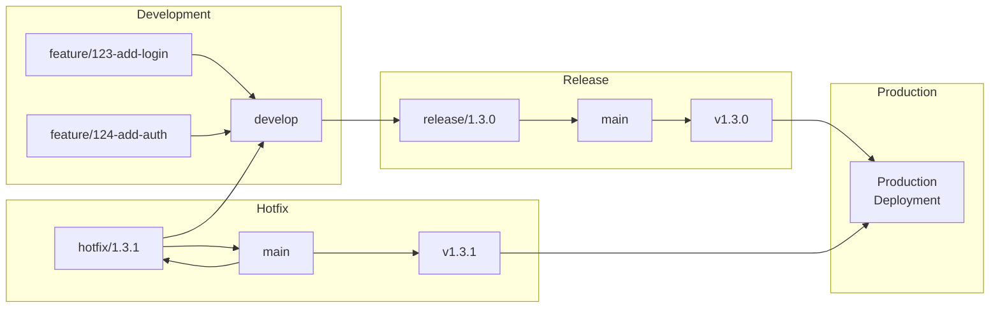
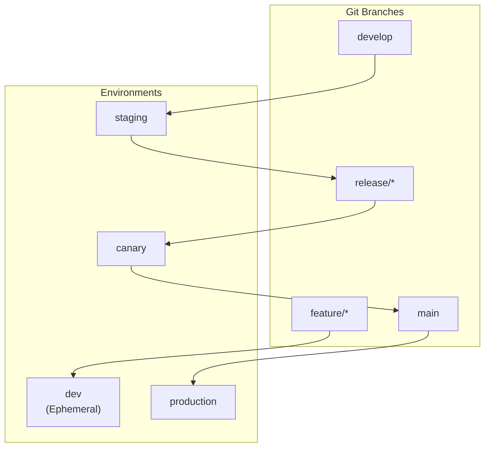
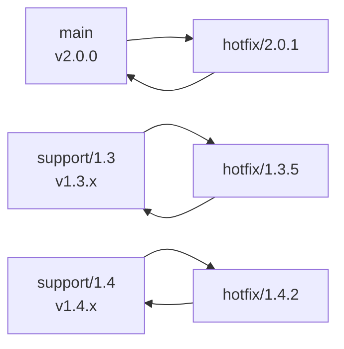

# Modern GitFlow Best Practices: Branching, Releases, Hotfixes, and CI/CD Governance

**Objective**: Master production-grade GitFlow workflows for enterprise software development. When you need structured branching, controlled releases, hotfix processes, and CI/CD governance—these best practices become your foundation.

## Introduction

GitFlow isn't dead. It's evolved. The original model from 2010 remains relevant for teams that need:
- **Structured releases**: Predictable, versioned releases with clear cutover points
- **Parallel development**: Multiple features in flight without blocking each other
- **Hotfix capabilities**: Emergency fixes to production without disrupting development
- **Regulatory compliance**: Audit trails, backports, and controlled deployments

This guide covers modern GitFlow: the patterns that work, the automation that scales, and the pitfalls that kill teams.

## Why GitFlow Still Matters (and When It Doesn't)

### Origins

GitFlow was introduced by Vincent Driessen in 2010. It provides a branching model that separates:
- **Development work** (feature branches)
- **Integration** (develop branch)
- **Releases** (release branches)
- **Production** (main branch)
- **Emergency fixes** (hotfix branches)

### When GitFlow Makes Sense

**Enterprise Releases**:
- Scheduled releases with QA cycles
- Versioned software with changelogs
- Multiple teams contributing to same codebase

**Multi-Team Repositories**:
- Clear integration points (develop branch)
- Reduced merge conflicts through structured branching
- Parallel feature development

**Backported Patches**:
- Support for multiple production versions
- Security patches to older releases
- Regulatory requirements for version tracking

**Regulated Environments**:
- Audit trails for every change
- Controlled release processes
- Clear separation of development and production

### When Lighter Models Are Better

**Trunk-Based Development**:
- Small teams (< 10 developers)
- Continuous deployment (multiple deploys per day)
- Microservices with independent release cycles
- Fast-moving startups

**GitHub Flow**:
- Web applications with frequent releases
- Single production environment
- No need for release stabilization

**Recommendation**: Use GitFlow for monoliths, enterprise software, and regulated environments. Use trunk-based for microservices and fast-moving teams.

## Core GitFlow Model (Modern Interpretation)

### Branch Types

**main** (formerly `master`):
- **Purpose**: Production-ready code, tagged releases
- **Protection**: Protected, no direct commits
- **Merges from**: Release branches, hotfix branches
- **Deploys to**: Production

**develop**:
- **Purpose**: Integration branch for completed features
- **Protection**: Protected, no direct commits
- **Merges from**: Feature branches
- **Deploys to**: Development/staging

**feature/**:
- **Purpose**: New features, experimental work
- **Lifespan**: Short-lived (< 5 days ideal)
- **Merges to**: develop
- **Naming**: `feature/TICKET-short-description`

**release/**:
- **Purpose**: Release preparation, bug fixes only
- **Lifespan**: Days to weeks (stabilization period)
- **Merges to**: main (tagged), develop (forward-merge)
- **Naming**: `release/x.y.z`

**hotfix/**:
- **Purpose**: Critical production fixes
- **Lifespan**: Hours to days
- **Merges to**: main (tagged), develop (forward-merge)
- **Naming**: `hotfix/x.y.z`

**support/** (optional):
- **Purpose**: Long-term maintenance of specific versions
- **Lifespan**: Months to years
- **Merges to**: main (tagged), develop (forward-merge)
- **Naming**: `support/x.y`

### Branch Flow Diagram



### Permitted Operations

**Feature Branches**:
- ✅ Rebase on develop (before PR)
- ✅ Squash merge to develop
- ❌ Force push after PR opened
- ❌ Merge to main directly

**Develop Branch**:
- ✅ Merge from feature branches
- ✅ Merge from release branches (forward-merge)
- ✅ Merge from hotfix branches (forward-merge)
- ❌ Direct commits
- ❌ Force push
- ❌ Rebase (shared branch)

**Release Branches**:
- ✅ Bugfix commits
- ✅ Version bumps
- ✅ Changelog updates
- ❌ New features
- ❌ Force push
- ✅ Merge to main (tagged)
- ✅ Merge to develop (forward-merge)

**Main Branch**:
- ✅ Merge from release branches (tagged)
- ✅ Merge from hotfix branches (tagged)
- ❌ Direct commits
- ❌ Force push
- ❌ Feature merges

**Hotfix Branches**:
- ✅ Critical bugfixes only
- ✅ Version bumps (patch)
- ✅ Merge to main (tagged)
- ✅ Merge to develop (forward-merge)
- ❌ New features

### Branch Protection Recommendations

**GitHub Example**:

```yaml
# .github/branch-protection.yml (conceptual)
branches:
  main:
    required_status_checks:
      - ci/tests
      - ci/lint
    enforce_admins: true
    required_pull_request_reviews:
      required_approving_review_count: 2
      dismiss_stale_reviews: true
    restrictions:
      users: []
      teams: ["release-team"]
    allow_force_pushes: false
    allow_deletions: false
  
  develop:
    required_status_checks:
      - ci/tests
      - ci/lint
    enforce_admins: true
    required_pull_request_reviews:
      required_approving_review_count: 1
    allow_force_pushes: false
```

**GitLab Example**:

```yaml
# .gitlab/merge_request_templates/branch-protection.md
## Branch Protection Rules

- **main**: Requires 2 approvals, CI must pass, no force push
- **develop**: Requires 1 approval, CI must pass, no force push
- **release/***: Requires 1 approval, CI must pass, no force push
- **hotfix/***: Requires 1 approval, CI must pass, fast-track allowed
```

## Best Practices for Each Branch Type

### Feature Branches

**Naming Convention**:

```bash
# Pattern: feature/TICKET-short-description
feature/123-add-user-authentication
feature/456-implement-payment-gateway
feature/789-fix-login-bug
```

**Best Practices**:

1. **Keep Small**: Target < 5 days lifespan
   - Large features → break into smaller PRs
   - Use feature flags for incomplete work

2. **Rebase Often**: Rebase on develop before opening PR
   ```bash
   git checkout feature/123-add-auth
   git fetch origin
   git rebase origin/develop
   ```

3. **Always Require PR**: Never merge feature branches directly
   - PR → develop (required)
   - CI must pass
   - At least one approval

4. **Use Feature Flags**: For incomplete features
   ```python
   # app/config.py
   FEATURE_NEW_AUTH = os.getenv("FEATURE_NEW_AUTH", "false") == "true"
   
   if FEATURE_NEW_AUTH:
       # New auth code
   else:
       # Old auth code
   ```

**Example Workflow**:

```bash
# Start feature
git checkout develop
git pull origin develop
git checkout -b feature/123-add-auth

# Work and commit
git add .
git commit -m "feat: add OAuth2 authentication"

# Rebase before PR
git fetch origin
git rebase origin/develop

# Push and open PR
git push origin feature/123-add-auth
# Open PR: feature/123-add-auth → develop
```

### Develop Branch

**Purpose**: Integration branch for all completed features.

**Best Practices**:

1. **Integration Testing**: Always run full test suite
   ```yaml
   # .github/workflows/develop.yml
   on:
     push:
       branches: [develop]
   jobs:
     test:
       runs-on: ubuntu-latest
       steps:
         - uses: actions/checkout@v3
         - name: Run tests
           run: pytest
   ```

2. **Feature Toggles**: Use toggles to reduce conflicts
   - Merge incomplete features behind flags
   - Enable in develop for testing
   - Disable in production until ready

3. **Daily Sync**: Rebase feature branches daily
   ```bash
   # Daily routine
   git checkout develop
   git pull origin develop
   git checkout feature/your-branch
   git rebase origin/develop
   ```

4. **No Direct Commits**: All changes via PR
   - Enforce via branch protection
   - Use pre-commit hooks to prevent accidents

**Deployment**: Deploy develop to staging/dev environment automatically.

### Release Branches

**Purpose**: Stabilize code for release, prepare version bumps.

**Cutting a Release Branch**:

```bash
# From develop
git checkout develop
git pull origin develop
git checkout -b release/1.3.0

# Update version
# In package.json, setup.py, etc.
version = "1.3.0"

# Commit version bump
git add .
git commit -m "chore: bump version to 1.3.0"
git push origin release/1.3.0
```

**Stabilization Rules**:

1. **Only Bugfixes**: No new features
   ```bash
   # Allowed
   git commit -m "fix: resolve memory leak in user service"
   
   # Not allowed
   git commit -m "feat: add new dashboard"
   ```

2. **Update Version**: Bump version in release branch
   ```python
   # setup.py
   version = "1.3.0"  # Updated in release branch
   ```

3. **Prepare Changelog**: Document changes
   ```markdown
   # CHANGELOG.md
   ## [1.3.0] - 2024-01-15
   
   ### Added
   - OAuth2 authentication
   - User dashboard
   
   ### Fixed
   - Memory leak in user service
   - Login timeout issue
   ```

**Merging Release Branch**:

```bash
# 1. Merge to main (tagged)
git checkout main
git pull origin main
git merge --no-ff release/1.3.0
git tag -a v1.3.0 -m "Release version 1.3.0"
git push origin main
git push origin v1.3.0

# 2. Forward-merge to develop
git checkout develop
git pull origin develop
git merge --no-ff release/1.3.0
git push origin develop

# 3. Delete release branch
git branch -d release/1.3.0
git push origin --delete release/1.3.0
```

**Why Forward-Merge**: Ensures develop has all release fixes, preventing regressions.

### Main Branch

**Purpose**: Production-ready code, tagged releases.

**Protection Rules**:

1. **Protected**: No direct commits
2. **Only Merges**: Release branches and hotfixes
3. **Tagged**: Every merge must be tagged
4. **Automatic Deployments**: Deploy to production on tag

**Example CI/CD**:

```yaml
# .github/workflows/production.yml
on:
  push:
    branches: [main]
    tags:
      - 'v*'

jobs:
  deploy:
    runs-on: ubuntu-latest
    steps:
      - uses: actions/checkout@v3
      - name: Deploy to production
        run: |
          # Deploy logic
          echo "Deploying version ${{ github.ref_name }}"
```

### Hotfix Branches

**Purpose**: Critical production fixes that can't wait for next release.

**Cutting a Hotfix**:

```bash
# From main
git checkout main
git pull origin main
git checkout -b hotfix/1.3.1

# Fix the bug
git add .
git commit -m "fix: resolve critical security vulnerability"

# Bump patch version
# version = "1.3.1"
git add .
git commit -m "chore: bump version to 1.3.1"
```

**Merging Hotfix**:

```bash
# 1. Merge to main (tagged)
git checkout main
git pull origin main
git merge --no-ff hotfix/1.3.1
git tag -a v1.3.1 -m "Hotfix version 1.3.1"
git push origin main
git push origin v1.3.1

# 2. Forward-merge to develop
git checkout develop
git pull origin develop
git merge --no-ff hotfix/1.3.1
git push origin develop

# 3. Optionally merge to active release branch
git checkout release/1.4.0
git merge --no-ff hotfix/1.3.1
git push origin release/1.4.0

# 4. Delete hotfix branch
git branch -d hotfix/1.3.1
git push origin --delete hotfix/1.3.1
```

**Critical Rule**: Always forward-merge hotfixes to develop and active release branches to prevent regressions.

### Support Branches

**Purpose**: Long-term maintenance of specific versions (e.g., LTS releases).

**When to Use**:

- Multiple production versions in use
- Long-term support commitments
- Regulatory requirements for version tracking

**Creating Support Branch**:

```bash
# From tagged release
git checkout v1.3.0
git checkout -b support/1.3
git push origin support/1.3
```

**Maintaining Support Branch**:

```bash
# Apply fixes
git checkout support/1.3
git cherry-pick <commit-hash>  # From main or develop

# Release from support branch
git checkout support/1.3
git checkout -b release/1.3.5
# ... stabilization ...
git merge --no-ff release/1.3.5
git tag -a v1.3.5 -m "Release version 1.3.5"
```

## Semantic Versioning and Release Strategy

### SemVer Format

**MAJOR.MINOR.PATCH**:
- **MAJOR**: Breaking changes (1.0.0 → 2.0.0)
- **MINOR**: New features, backward compatible (1.0.0 → 1.1.0)
- **PATCH**: Bug fixes, backward compatible (1.0.0 → 1.0.1)

### Version Bump Rules

**Feature Merges**: No version bump
- Features merge to develop
- Version stays unchanged

**Release Branches**: Bump MINOR or MAJOR
- `release/1.3.0` → version = "1.3.0"
- New features → MINOR bump
- Breaking changes → MAJOR bump

**Hotfix Branches**: Bump PATCH
- `hotfix/1.3.1` → version = "1.3.1"
- Always PATCH increment

### Tagging Strategy

**Tag Format**: `vMAJOR.MINOR.PATCH`

```bash
# Tag release
git tag -a v1.3.0 -m "Release version 1.3.0"
git push origin v1.3.0

# Tag hotfix
git tag -a v1.3.1 -m "Hotfix version 1.3.1"
git push origin v1.3.1
```

**Tagging Policy**:

1. **Always on main**: Tags only on main branch
2. **Annotated tags**: Use `-a` for metadata
3. **Signed tags**: For security-critical projects
   ```bash
   git tag -s v1.3.0 -m "Release version 1.3.0"
   ```

### Versioning Policy Example

```yaml
# versioning-policy.yml
versioning:
  major:
    triggers:
      - Breaking API changes
      - Database schema changes
      - Incompatible configuration changes
  
  minor:
    triggers:
      - New features
      - New API endpoints
      - Backward-compatible changes
  
  patch:
    triggers:
      - Bug fixes
      - Security patches
      - Documentation updates
```

## Pull Request Best Practices

### Required PR Checks

**CI Tests**:

```yaml
# .github/workflows/pr-checks.yml
on:
  pull_request:
    branches: [develop, main]

jobs:
  test:
    runs-on: ubuntu-latest
    steps:
      - uses: actions/checkout@v3
      - name: Run tests
        run: pytest
      - name: Run linting
        run: flake8 .
```

**Static Analysis**:

```yaml
jobs:
  static-analysis:
    runs-on: ubuntu-latest
    steps:
      - uses: actions/checkout@v3
      - name: Run SonarQube
        uses: sonarsource/sonarqube-scan-action@master
```

**Conventional Commits**:

```bash
# Enforce commit message format
# feat: add user authentication
# fix: resolve memory leak
# chore: update dependencies
# docs: update README
```

**Required Reviewers**:

- **develop**: 1 approval required
- **main**: 2 approvals required
- **release/***: 1 approval required
- **hotfix/***: 1 approval required (fast-track allowed)

### Review Best Practices

**Focus Areas**:

1. **Correctness**: Does it work?
2. **Complexity**: Is it maintainable?
3. **Design**: Does it fit architecture?
4. **Tests**: Are edge cases covered?

**Review Checklist**:

- [ ] Code works as intended
- [ ] Tests pass and cover changes
- [ ] No breaking changes (or documented)
- [ ] Documentation updated
- [ ] No security vulnerabilities
- [ ] Performance acceptable

### Squash vs Merge Commits

**Squash for Features**:

```bash
# Feature PR → develop: Squash merge
# Creates single commit: "feat: add user authentication"
```

**Merge Commits for Releases**:

```bash
# Release PR → main: Merge commit
# Preserves release branch history
git merge --no-ff release/1.3.0
```

**Never Allow**: Direct PRs to main except releases/hotfixes.

## Automation & CI/CD Integration

### GitHub/GitLab Branch Protections

**GitHub Actions Example**:

```yaml
# .github/workflows/branch-protection.yml
name: Branch Protection

on:
  push:
    branches: [main, develop]

jobs:
  validate:
    runs-on: ubuntu-latest
    steps:
      - uses: actions/checkout@v3
      - name: Validate branch protection
        run: |
          if [ "${{ github.ref }}" == "refs/heads/main" ]; then
            echo "Main branch: Requiring 2 approvals"
          fi
```

**GitLab CI Example**:

```yaml
# .gitlab-ci.yml
stages:
  - validate
  - test
  - deploy

validate:main:
  stage: validate
  script:
    - echo "Validating main branch protection"
    - |
      if [ "$CI_COMMIT_REF_NAME" == "main" ]; then
        echo "Main branch requires 2 approvals"
      fi
  only:
    - main
```

### Automatic SemVer Tagging

**Detect Version Bump**:

```yaml
# .github/workflows/auto-tag.yml
on:
  pull_request:
    types: [closed]
    branches: [main]

jobs:
  tag:
    if: github.event.pull_request.merged == true
    runs-on: ubuntu-latest
    steps:
      - uses: actions/checkout@v3
        fetch-depth: 0
      
      - name: Detect version bump
        id: version
        run: |
          # Extract version from PR title or commit
          VERSION=$(grep -oP 'release/\K[\d.]+' <<< "${{ github.event.pull_request.head.ref }}" || echo "")
          if [ -n "$VERSION" ]; then
            echo "version=$VERSION" >> $GITHUB_OUTPUT
          fi
      
      - name: Create tag
        if: steps.version.outputs.version != ''
        run: |
          git tag -a "v${{ steps.version.outputs.version }}" -m "Release ${{ steps.version.outputs.version }}"
          git push origin "v${{ steps.version.outputs.version }}"
```

### Automated Changelogs

**Generate from Git Log**:

```bash
# Generate changelog between tags
git log v1.2.0..v1.3.0 --oneline --pretty=format:"- %s"

# With conventional commits
git log v1.2.0..v1.3.0 --pretty=format:"- %s" | \
  grep -E "^(feat|fix|chore|docs):" | \
  sort
```

**Using semantic-release**:

```json
{
  "release": {
    "branches": ["main"],
    "plugins": [
      "@semantic-release/commit-analyzer",
      "@semantic-release/release-notes-generator",
      "@semantic-release/changelog",
      "@semantic-release/git",
      "@semantic-release/github"
    ]
  }
}
```

### Automated Deployments

**Deploy from main only**:

```yaml
# .github/workflows/deploy-production.yml
on:
  push:
    branches: [main]
    tags:
      - 'v*'

jobs:
  deploy:
    runs-on: ubuntu-latest
    steps:
      - uses: actions/checkout@v3
      - name: Deploy to production
        run: |
          VERSION=${GITHUB_REF#refs/tags/v}
          echo "Deploying version $VERSION to production"
          # Deploy logic
```

**Deploy to staging from develop**:

```yaml
# .github/workflows/deploy-staging.yml
on:
  push:
    branches: [develop]

jobs:
  deploy:
    runs-on: ubuntu-latest
    steps:
      - uses: actions/checkout@v3
      - name: Deploy to staging
        run: |
          echo "Deploying develop to staging"
          # Deploy logic
```

**Canary deployments from release branches**:

```yaml
# .github/workflows/deploy-canary.yml
on:
  push:
    branches:
      - 'release/**'

jobs:
  deploy:
    runs-on: ubuntu-latest
    steps:
      - uses: actions/checkout@v3
      - name: Deploy canary
        run: |
          echo "Deploying release branch to canary"
          # Canary deploy logic
```

## Multi-Environment Deployment Model

### Environment Mapping

**Standard Environments**:

- **dev**: Feature branches (ephemeral previews)
- **staging**: develop branch
- **canary**: release branches
- **prod**: main branch (tagged releases)

### Deployment Flow



### Environment-Specific Configurations

**Feature Branch Previews**:

```yaml
# Deploy feature branches to ephemeral environments
on:
  pull_request:
    types: [opened, synchronize]

jobs:
  deploy-preview:
    runs-on: ubuntu-latest
    steps:
      - uses: actions/checkout@v3
      - name: Deploy preview
        run: |
          PREVIEW_ENV="pr-${{ github.event.pull_request.number }}"
          echo "Deploying to $PREVIEW_ENV"
          # Deploy to preview environment
```

**Develop → Staging**:

```yaml
# Auto-deploy develop to staging
on:
  push:
    branches: [develop]

jobs:
  deploy-staging:
    runs-on: ubuntu-latest
    steps:
      - uses: actions/checkout@v3
      - name: Deploy to staging
        run: |
          echo "Deploying develop to staging"
          # Deploy logic
```

**Release → Canary**:

```yaml
# Deploy release branches to canary
on:
  push:
    branches:
      - 'release/**'

jobs:
  deploy-canary:
    runs-on: ubuntu-latest
    steps:
      - uses: actions/checkout@v3
      - name: Deploy to canary
        run: |
          echo "Deploying release branch to canary"
          # Canary deploy logic
```

**Main → Production**:

```yaml
# Deploy tagged releases to production
on:
  push:
    tags:
      - 'v*'

jobs:
  deploy-production:
    runs-on: ubuntu-latest
    steps:
      - uses: actions/checkout@v3
      - name: Deploy to production
        run: |
          VERSION=${GITHUB_REF#refs/tags/v}
          echo "Deploying version $VERSION to production"
          # Production deploy logic
```

## Handling Big Teams & Monorepos

### Reducing Merge Hell

**Small PRs**:

- Target < 500 lines changed
- One logical change per PR
- Break large features into multiple PRs

**Feature Flags**:

```python
# Use feature flags to merge incomplete work
FEATURE_NEW_DASHBOARD = os.getenv("FEATURE_NEW_DASHBOARD", "false") == "true"

if FEATURE_NEW_DASHBOARD:
    # New code
else:
    # Old code
```

**Integration Fridays**:

- Designate one day per week for integration
- Freeze develop branch for stabilization
- Merge all ready features on Friday

### Monorepo Strategies

**Shared Develop Branch**:

```bash
# All components share develop
monorepo/
├── services/
│   ├── user-service/
│   ├── order-service/
│   └── payment-service/
└── shared/
    └── common-lib/
```

**Component-Level Release Branches**:

```bash
# Release specific components
release/user-service-1.3.0
release/order-service-2.1.0
```

**Scoped Builds**:

```yaml
# Only build changed components
on:
  push:
    branches: [develop]

jobs:
  detect-changes:
    runs-on: ubuntu-latest
    steps:
      - uses: actions/checkout@v3
      - name: Detect changed services
        run: |
          CHANGED=$(git diff --name-only origin/develop...HEAD | grep -E '^services/' | cut -d'/' -f2 | sort -u)
          echo "changed_services=$CHANGED" >> $GITHUB_ENV
  
  build:
    needs: detect-changes
    strategy:
      matrix:
        service: ${{ fromJSON(env.changed_services) }}
    steps:
      - name: Build ${{ matrix.service }}
        run: |
          echo "Building ${{ matrix.service }}"
```

### Bootstrapping Rules

**Freeze Windows**:

- **Release Freeze**: No new features 1 week before release
- **Integration Freeze**: No merges to develop on release day
- **Hotfix Only**: Only critical fixes during freeze

**Release Captains**:

- Rotate release captain role
- Responsible for cutting release branches
- Manages release process
- Coordinates with QA

## Handling Backports, Emergency Fixes & Parallel Releases

### Backport Process

**Using Support Branches**:

```bash
# 1. Fix in main
git checkout main
git checkout -b hotfix/1.4.1
# ... fix ...
git commit -m "fix: resolve critical bug"
git checkout main
git merge --no-ff hotfix/1.4.1
git tag v1.4.1

# 2. Backport to support/1.3
git checkout support/1.3
git cherry-pick <commit-hash>
git checkout -b release/1.3.5
# ... stabilization ...
git merge --no-ff release/1.3.5
git tag v1.3.5
```

### Parallel Release Lines

**Maintaining Multiple Versions**:



### Emergency Fixes on Older Versions

**Process**:

1. **Identify Version**: Determine which version needs fix
2. **Checkout Support Branch**: `git checkout support/1.3`
3. **Apply Fix**: Cherry-pick or manual fix
4. **Test**: Verify fix works
5. **Release**: Cut release branch, tag, deploy

**Example**:

```bash
# Emergency fix for v1.3.0 in production
git checkout support/1.3
git checkout -b hotfix/1.3.5

# Apply fix (cherry-pick from main or manual)
git cherry-pick <commit-hash>

# Or manual fix
# ... edit files ...
git commit -m "fix: resolve critical security issue"

# Release
git checkout support/1.3
git merge --no-ff hotfix/1.3.5
git tag v1.3.5
git push origin v1.3.5
```

### Pull-Forward Rule

**Always Forward-Merge**:

1. **Hotfix to main**: Merge hotfix → main
2. **Hotfix to develop**: Merge hotfix → develop
3. **Hotfix to release**: Merge hotfix → active release branches
4. **Hotfix to support**: Merge hotfix → relevant support branches

**Why**: Prevents regressions and ensures all branches have fixes.

## Comparing GitFlow with Other Models

### GitFlow vs Trunk-Based Development

**GitFlow**:
- ✅ Structured releases
- ✅ Parallel development
- ✅ Hotfix capabilities
- ❌ More complex
- ❌ Slower integration

**Trunk-Based**:
- ✅ Fast integration
- ✅ Simple model
- ✅ Continuous deployment
- ❌ Less structure
- ❌ Harder hotfixes

**When to Use**:
- **GitFlow**: Enterprise software, regulated environments
- **Trunk-Based**: Microservices, fast-moving teams

### GitFlow vs GitHub Flow

**GitFlow**:
- ✅ Release branches
- ✅ Hotfix branches
- ✅ Multiple environments
- ❌ More branches
- ❌ More process

**GitHub Flow**:
- ✅ Simple model
- ✅ Fast releases
- ✅ Single production
- ❌ No release stabilization
- ❌ Limited hotfix process

**When to Use**:
- **GitFlow**: Scheduled releases, multiple environments
- **GitHub Flow**: Web apps, frequent releases

### Hybrid Models

**Trunk + Release Branches**:

```bash
# Use trunk-based for development
# Add release branches for stabilization
main (trunk)
  ├── feature/* → main
  ├── release/1.3.0 → main
  └── hotfix/1.3.1 → main
```

**When to Use**: Fast development with structured releases.

## Anti-Patterns to Avoid

### Critical Mistakes

**1. Huge Feature Branches**:
- ❌ Feature branch with 50+ files changed
- ✅ Break into smaller PRs (< 500 lines)

**2. Long-Lived Unmerged Release Branches**:
- ❌ Release branch open for months
- ✅ Keep release branches short (< 2 weeks)

**3. Direct Commits to main/develop**:
- ❌ `git commit -m "quick fix"` on main
- ✅ Always use PRs

**4. No Merge-Forward from Hotfixes**:
- ❌ Hotfix only merged to main
- ✅ Always forward-merge to develop and release branches

**5. Branch Names That Mean Nothing**:
- ❌ `feature/bob-branch`
- ✅ `feature/123-add-authentication`

**6. Overusing Rebase on Shared Branches**:
- ❌ `git rebase` on develop
- ✅ Only rebase feature branches before PR

**7. Cutting Releases Without Updating Versions**:
- ❌ Release branch without version bump
- ✅ Always bump version in release branch

**8. Force Pushing to Protected Branches**:
- ❌ `git push --force` to main
- ✅ Never force push protected branches

**9. Merging Features Directly to main**:
- ❌ Feature PR → main
- ✅ Feature PR → develop only

**10. Ignoring CI Failures**:
- ❌ Merge PR with failing CI
- ✅ Always fix CI before merge

## Conclusion & Maturity Roadmap

### Stage 1: Basic GitFlow + PR Reviews

**Goals**:
- Establish main and develop branches
- Require PRs for all merges
- Basic branch protection

**Implementation**:
```bash
# Protect main and develop
# Require 1 approval for develop
# Require 2 approvals for main
```

### Stage 2: Automated CI + Version Bumping

**Goals**:
- CI runs on all PRs
- Automated version detection
- Automated tagging

**Implementation**:
```yaml
# CI on PRs
# Auto-detect version bumps
# Auto-tag releases
```

### Stage 3: Release Branches + Auto Deployments

**Goals**:
- Release branch workflow
- Automated deployments to staging
- Automated deployments to production

**Implementation**:
```yaml
# Release branch → staging
# Tagged main → production
```

### Stage 4: Hotfix Pipelines + Multiple Support Branches

**Goals**:
- Hotfix branch workflow
- Support branches for LTS
- Backport automation

**Implementation**:
```yaml
# Hotfix → main + develop
# Support branch maintenance
# Automated backports
```

### Stage 5: Fully Automated Semantic Versioning + Changelogs + Governance

**Goals**:
- Automated semantic versioning
- Automated changelog generation
- Complete governance automation

**Implementation**:
```yaml
# semantic-release
# Automated changelogs
# Policy enforcement
```

### Key Principles

1. **Start Simple**: Begin with basic GitFlow, add complexity gradually
2. **Automate Early**: Automate repetitive tasks (tagging, changelogs)
3. **Document Decisions**: Document why you chose GitFlow
4. **Train Team**: Ensure everyone understands the workflow
5. **Iterate**: Adjust workflow based on team needs
6. **Enforce Policies**: Use branch protection and CI gates
7. **Monitor Health**: Track PR sizes, merge times, conflicts

**Remember**: GitFlow is a tool, not a religion. Adapt it to your team's needs, but maintain the core principles: structured releases, controlled merges, and clear separation of concerns.

## See Also

- **[Git Production Best Practices](git-production.md)** - Enterprise Git workflows and repository management
- **[Git Workflows & Collaboration](git-workflows-collaboration.md)** - Team collaboration patterns and workflows
- **[CI/CD Pipelines](../architecture-design/ci-cd-pipelines.md)** - Continuous integration and deployment patterns

---

*This guide provides the complete machinery for production-grade GitFlow workflows. The patterns scale from small teams to enterprise organizations, from simple releases to complex multi-version maintenance.*

