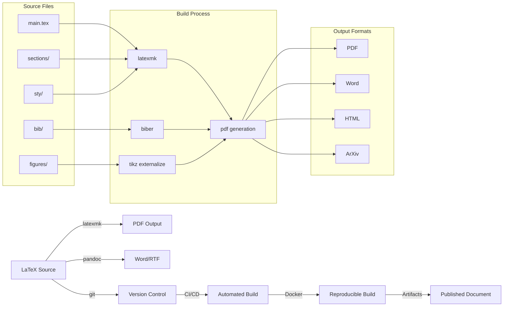

# LaTeX Workflows Best Practices

**Objective**: Master production-grade LaTeX workflows for reproducible technical writing, academic papers, and engineering documentation. When you need to write professional technical documents, when you want to create beautiful diagrams and figures, when you're responsible for maintaining consistent formatting across teams—LaTeX workflows become your weapon of choice.

LaTeX isn't just typesetting—it's reproducible writing. Done poorly, it's chaos. Done well, it's a publishing pipeline as solid as any codebase.

## 0) Prerequisites (Read Once, Live by Them)

### The Five Commandments

1. **Structure your projects properly**
   - Separate content from formatting
   - Use modular file organization
   - Version control everything except build artifacts
   - Document your build process

2. **Ensure build reproducibility**
   - Pin LaTeX distributions and packages
   - Use Docker for consistent builds
   - Automate with CI/CD pipelines
   - Test on multiple environments

3. **Master essential packages**
   - geometry for document layout
   - hyperref for links and metadata
   - cleveref for smart references
   - tikz/pgfplots for diagrams
   - biblatex for bibliography management

4. **Validate everything**
   - Test builds on clean environments
   - Verify package compatibility
   - Check for missing dependencies
   - Validate bibliography and citations

5. **Plan for collaboration**
   - Use version control effectively
   - Enable change tracking with latexdiff
   - Document style guidelines
   - Support multiple authors

**Why These Principles**: Production LaTeX requires understanding document structure, build reproducibility, and collaboration patterns. Understanding these patterns prevents document chaos and enables reliable technical writing.

## 1) Project Structure

### Essential Directory Layout

```
paper/
├── main.tex                 # Main document
├── sections/                # Content modules
│   ├── intro.tex
│   ├── methods.tex
│   ├── results.tex
│   └── conclusion.tex
├── figures/                 # All figures
│   ├── fig1.tikz
│   ├── fig2.pdf
│   └── fig3.png
├── bib/                     # Bibliography
│   └── refs.bib
├── sty/                     # Custom styles
│   ├── custom.sty
│   └── ieee.sty
├── data/                    # Raw data
│   └── results.csv
├── scripts/                 # Build scripts
│   ├── build.sh
│   └── clean.sh
└── .gitignore              # Version control
```

**Why Project Structure Matters**: Organized projects prevent file chaos and enable efficient collaboration. Understanding these patterns prevents document confusion and enables reliable technical writing.

### Main Document Template

```latex
% main.tex
\documentclass[11pt,a4paper]{article}

% Essential packages
\usepackage[utf8]{inputenc}
\usepackage[T1]{fontenc}
\usepackage{geometry}
\usepackage{hyperref}
\usepackage{cleveref}
\usepackage{siunitx}
\usepackage{tikz}
\usepackage{pgfplots}
\usepackage[backend=biber,style=ieee]{biblatex}

% Custom style
\usepackage{sty/custom}

% Document metadata
\title{Your Paper Title}
\author{Your Name}
\date{\today}

% Bibliography
\addbibresource{bib/refs.bib}

\begin{document}

\maketitle

% Abstract
\begin{abstract}
Your abstract here.
\end{abstract}

% Main content
\input{sections/intro}
\input{sections/methods}
\input{sections/results}
\input{sections/conclusion}

% Bibliography
\printbibliography

\end{document}
```

**Why Main Document Structure Matters**: Proper document structure enables modular writing and efficient collaboration. Understanding these patterns prevents document chaos and enables reliable technical writing.

## 2) Build Reproducibility

### latexmk Configuration

```latex
% .latexmkrc
$pdf_mode = 1;
$postscript_mode = 0;
$dvi_mode = 0;
$pdflatex = 'pdflatex -interaction=nonstopmode -halt-on-error';
$biber = 'biber --debug';
$clean_ext = 'aux bbl bcf blg fdb_latexmk fls log out run.xml synctex.gz toc';
$clean_full_ext = 'aux bbl bcf blg fdb_latexmk fls log out run.xml synctex.gz toc pdf';
```

**Why latexmk Matters**: Automated builds prevent manual errors and enable consistent output. Understanding these patterns prevents build chaos and enables reliable document generation.

### Docker Build Environment

```dockerfile
# Dockerfile
FROM texlive/texlive:latest

# Install additional packages
RUN tlmgr update --self
RUN tlmgr install \
    biber \
    biblatex \
    cleveref \
    siunitx \
    tikz \
    pgfplots \
    geometry \
    hyperref

# Set working directory
WORKDIR /workspace

# Copy source files
COPY . .

# Build command
CMD ["latexmk", "-pdf", "-interaction=nonstopmode", "main.tex"]
```

**Why Docker Builds Matter**: Containerized builds ensure reproducibility across environments. Understanding these patterns prevents "works on my machine" issues and enables reliable document generation.

### CI/CD Pipeline

```yaml
# .github/workflows/build.yml
name: Build LaTeX Document

on:
  push:
    branches: [ main ]
  pull_request:
    branches: [ main ]

jobs:
  build:
    runs-on: ubuntu-latest
    
    steps:
    - uses: actions/checkout@v3
    
    - name: Build LaTeX Document
      uses: xu-cheng/latex-action@v2
      with:
        root_file: main.tex
        latexmk_use_xelatex: false
        latexmk_shell_escape: false
        args: -pdf -interaction=nonstopmode
    
    - name: Upload PDF
      uses: actions/upload-artifact@v3
      with:
        name: paper-pdf
        path: main.pdf
```

**Why CI/CD Matters**: Automated builds prevent manual errors and enable continuous integration. Understanding these patterns prevents build chaos and enables reliable document generation.

## 3) Essential Packages

### Core Package Configuration

```latex
% Essential packages for technical writing
\usepackage[utf8]{inputenc}
\usepackage[T1]{fontenc}
\usepackage{geometry}
\usepackage{hyperref}
\usepackage{cleveref}
\usepackage{siunitx}
\usepackage{tikz}
\usepackage{pgfplots}
\usepackage[backend=biber,style=ieee]{biblatex}

% Package configuration
\geometry{margin=1in}
\hypersetup{
    colorlinks=true,
    linkcolor=blue,
    urlcolor=blue,
    citecolor=blue
}
\sisetup{
    output-decimal-marker={.},
    group-separator={,}
}
```

**Why Package Configuration Matters**: Proper package setup enables consistent formatting and functionality. Understanding these patterns prevents package conflicts and enables reliable document generation.

### Custom Style Files

```latex
% sty/custom.sty
\NeedsTeXFormat{LaTeX2e}
\ProvidesPackage{custom}[2025/01/27 Custom LaTeX Style]

% Math symbols
\newcommand{\vect}[1]{\mathbf{#1}}
\newcommand{\mat}[1]{\mathbf{#1}}
\newcommand{\R}{\mathbb{R}}
\newcommand{\C}{\mathbb{C}}
\newcommand{\N}{\mathbb{N}}
\newcommand{\Z}{\mathbb{Z}}

% Units
\newcommand{\unit}[1]{\,\si{#1}}
\newcommand{\units}[1]{\,\si{#1}}

% References
\newcommand{\figref}[1]{Figure~\ref{#1}}
\newcommand{\tabref}[1]{Table~\ref{#1}}
\newcommand{\eqref}[1]{Equation~\ref{#1}}

% Custom environments
\newtheorem{theorem}{Theorem}
\newtheorem{lemma}{Lemma}
\newtheorem{corollary}{Corollary}
\newtheorem{definition}{Definition}
\newtheorem{example}{Example}

% Custom commands
\newcommand{\todo}[1]{\textcolor{red}{TODO: #1}}
\newcommand{\note}[1]{\textcolor{blue}{Note: #1}}
```

**Why Custom Styles Matter**: Consistent formatting enables professional documents and efficient collaboration. Understanding these patterns prevents formatting chaos and enables reliable technical writing.

## 4) Bibliography Management

### BibLaTeX Configuration

```latex
% Bibliography setup
\usepackage[backend=biber,style=ieee]{biblatex}
\addbibresource{bib/refs.bib}

% Custom bibliography commands
\newcommand{\citeauthor}[1]{\citeauthor{#1}}
\newcommand{\citeyear}[1]{\citeyear{#1}}
\newcommand{\citep}[1]{(\cite{#1})}
\newcommand{\citet}[1]{\citeauthor{#1}~\cite{#1}}
```

**Why BibLaTeX Matters**: Proper bibliography management enables consistent citations and references. Understanding these patterns prevents citation chaos and enables reliable academic writing.

### Bibliography Database

```bibtex
% bib/refs.bib
@article{smith2023,
  author = {Smith, John and Jones, Jane},
  title = {Advanced LaTeX Workflows for Technical Writing},
  journal = {Journal of Technical Writing},
  volume = {15},
  number = {3},
  pages = {123--145},
  year = {2023},
  doi = {10.1000/example}
}

@book{latex2023,
  author = {LaTeX Community},
  title = {The LaTeX Companion},
  publisher = {Addison-Wesley},
  year = {2023},
  edition = {3rd}
}

@inproceedings{conference2023,
  author = {Doe, John},
  title = {Reproducible LaTeX Workflows},
  booktitle = {Proceedings of the Technical Writing Conference},
  pages = {45--52},
  year = {2023},
  publisher = {IEEE Press}
}
```

**Why Bibliography Database Matters**: Organized references enable efficient citation management. Understanding these patterns prevents reference chaos and enables reliable academic writing.

## 5) Diagrams & Figures

### TikZ Diagrams

```latex
% figures/flowchart.tikz
\begin{tikzpicture}[
    node distance=2cm,
    auto,
    thick,
    main node/.style={circle,fill=blue!20,draw,font=\sffamily\Large\bfseries},
    decision/.style={diamond,fill=yellow!20,draw,font=\sffamily\small},
    process/.style={rectangle,fill=green!20,draw,font=\sffamily\small}
]

\node[main node] (start) {Start};
\node[process,below of=start] (input) {Input Data};
\node[decision,below of=input] (check) {Valid?};
\node[process,right of=check] (process) {Process};
\node[process,below of=check] (error) {Error};
\node[main node,below of=process] (end) {End};

\path[->] (start) edge (input)
          (input) edge (check)
          (check) edge node {Yes} (process)
          (check) edge node {No} (error)
          (process) edge (end);
\end{tikzpicture}
```

**Why TikZ Diagrams Matter**: Programmatic diagrams enable consistent formatting and easy modification. Understanding these patterns prevents diagram chaos and enables reliable technical writing.

### PGFPlots for Data Visualization

```latex
% figures/plot.tikz
\begin{tikzpicture}
\begin{axis}[
    xlabel={Time (\si{\second})},
    ylabel={Temperature (\si{\celsius})},
    grid=major,
    legend pos=north west,
    width=0.8\textwidth,
    height=0.6\textwidth
]

\addplot[blue,mark=o] table[x=time,y=temp1] {data/results.csv};
\addplot[red,mark=square] table[x=time,y=temp2] {data/results.csv};

\legend{Temperature 1, Temperature 2}
\end{axis}
\end{tikzpicture}
```

**Why PGFPlots Matters**: Programmatic plots enable consistent data visualization. Understanding these patterns prevents plot chaos and enables reliable technical writing.

## 6) Version Control & Collaboration

### Git Configuration

```gitignore
# .gitignore
*.aux
*.bbl
*.bcf
*.blg
*.fdb_latexmk
*.fls
*.log
*.out
*.run.xml
*.synctex.gz
*.toc
*.pdf
!main.pdf
*.dvi
*.ps
*.eps
*.figlist
*.makefile
*.nav
*.snm
*.vrb
```

**Why Git Configuration Matters**: Proper version control prevents build artifact pollution. Understanding these patterns prevents repository chaos and enables reliable collaboration.

### Change Tracking with latexdiff

```bash
# Track changes between versions
latexdiff old.tex new.tex > changes.tex
pdflatex changes.tex

# Track changes in Git
git config diff.latex.textconv "latexdiff --flatten %f"
git config diff.latex.cachetextconv true
```

**Why Change Tracking Matters**: Document versioning enables effective collaboration and review. Understanding these patterns prevents version chaos and enables reliable technical writing.

## 7) Debugging & Stability

### Common Error Handling

```latex
% Debugging commands
\listfiles                    % List all loaded packages
\tracingall                  % Enable full tracing
\showthe\baselineskip         % Show current baselineskip
\showthe\textwidth           % Show current text width

% Handle overfull hboxes
\sloppy                       % Allow more flexible spacing
\hbadness=10000              % Suppress hbox warnings
\vfuzz=2pt                    % Allow small overfull vboxes
```

**Why Debugging Matters**: Proper error handling prevents document build failures. Understanding these patterns prevents build chaos and enables reliable document generation.

### Package Compatibility

```latex
% Check package compatibility
\RequirePackage{etoolbox}
\RequirePackage{xparse}

% Safe package loading
\@ifpackagelater{geometry}{2010/09/12}{%
    \usepackage[geometry]{geometry}%
}{%
    \usepackage{geometry}%
}
```

**Why Package Compatibility Matters**: Proper package management prevents conflicts and build failures. Understanding these patterns prevents package chaos and enables reliable document generation.

## 8) Publishing & Exporting

### Pandoc Integration

```bash
# Convert LaTeX to other formats
pandoc main.tex -o main.docx
pandoc main.tex -o main.rtf
pandoc main.tex -o main.html

# Preserve formatting
pandoc main.tex -o main.docx --reference-doc=template.docx
```

**Why Pandoc Integration Matters**: Format conversion enables document sharing and collaboration. Understanding these patterns prevents format chaos and enables reliable document distribution.

### ArXiv Submission

```latex
% ArXiv-specific configuration
\documentclass[11pt,a4paper]{article}
\usepackage[utf8]{inputenc}
\usepackage[T1]{fontenc}

% Use natbib instead of biblatex for ArXiv
\usepackage{natbib}
\bibliographystyle{ieeetr}

% Include .bbl file for ArXiv
\input{main.bbl}
```

**Why ArXiv Configuration Matters**: Academic submission requires specific formatting and compatibility. Understanding these patterns prevents submission failures and enables reliable academic publishing.

## 9) Build Pipeline Diagram

### LaTeX Build Workflow



**Why Build Pipeline Diagrams Matter**: Visual representation of build processes enables understanding of complex document generation. Understanding these patterns prevents build confusion and enables reliable document generation.

## 10) TL;DR Runbook

### Essential Commands

```bash
# Build document
latexmk -pdf -interaction=nonstopmode main.tex

# Clean build artifacts
latexmk -c

# Track changes
latexdiff old.tex new.tex > changes.tex

# Convert to other formats
pandoc main.tex -o main.docx

# Docker build
docker build -t latex-doc .
docker run -v $(pwd):/workspace latex-doc
```

### Essential Patterns

```yaml
# Essential LaTeX patterns
latex_patterns:
  "project_structure": "Structure projects with sections/, figures/, bib/, sty/",
  "build_reproducibility": "Use latexmk + Docker for reproducible builds",
  "package_management": "Pin packages, centralize macros in .sty",
  "bibliography": "Use BibLaTeX + Zotero integration",
  "diagram_performance": "Externalize TikZ/PGFPlots for performance",
  "version_control": "Version-control properly, diff with latexdiff",
  "reproducibility": "Never rely on 'it works on my machine' TeX"
```

### Quick Reference

```latex
% Essential LaTeX operations
% 1. Document structure
\documentclass[11pt,a4paper]{article}
\usepackage{geometry,hyperref,cleveref,siunitx,tikz,pgfplots}
\usepackage[backend=biber,style=ieee]{biblatex}

% 2. Custom styles
\newcommand{\vect}[1]{\mathbf{#1}}
\newcommand{\R}{\mathbb{R}}

% 3. Bibliography
\addbibresource{bib/refs.bib}
\printbibliography

% 4. Figures
\begin{tikzpicture}
\begin{axis}[xlabel={Time},ylabel={Temperature}]
\addplot[blue] table[x=time,y=temp] {data.csv};
\end{axis}
\end{tikzpicture}

% 5. References
\cite{smith2023}
\figref{fig:example}
\eqref{eq:example}
```

**Why This Runbook**: These patterns cover 90% of LaTeX workflow needs. Master these before exploring advanced document generation scenarios.

## 11) The Machine's Summary

LaTeX workflows require understanding document structure, build reproducibility, and collaboration patterns. When used correctly, LaTeX enables reliable technical writing, beautiful document formatting, and efficient collaboration. The key is understanding document organization, mastering build processes, and following collaboration best practices.

**The Dark Truth**: Without proper LaTeX understanding, your documents remain chaotic and unprofessional. LaTeX workflows are your weapon. Use them wisely.

**The Machine's Mantra**: "In the structure we trust, in the reproducibility we find reliability, and in the collaboration we find the path to professional technical writing."

**Why This Matters**: LaTeX workflows enable efficient technical writing that can handle complex documents, maintain consistent formatting, and provide professional output while ensuring reproducibility and collaboration.

---

*This guide provides the complete machinery for LaTeX workflows. The patterns scale from simple documents to complex academic papers, from basic formatting to advanced document generation.*
