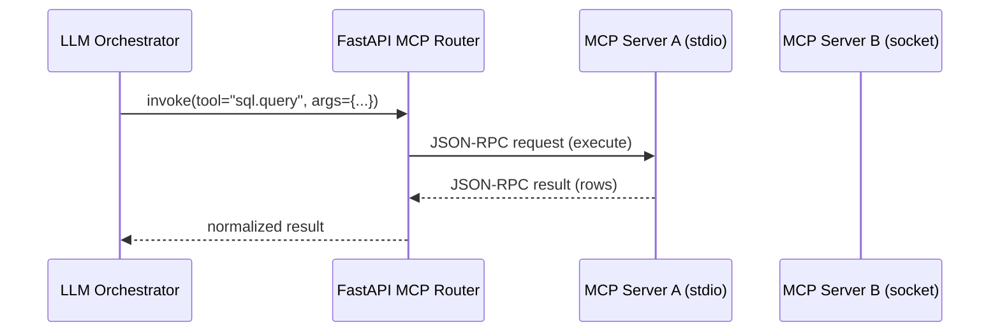
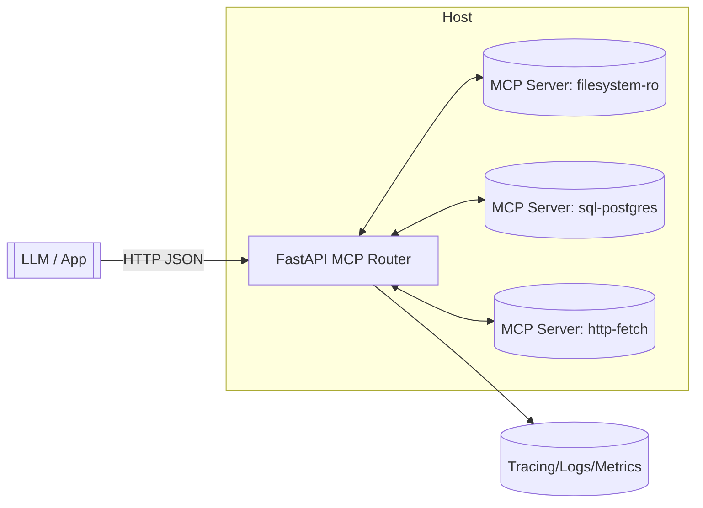

# Python MCP Done Right: Tools, Router, and LLM Integration with FastAPI

**Objective**: Master Model Context Protocol (MCP) for building secure, scalable tool servers with intelligent routing and LLM integration. When you need to expose tools to LLMs safely, when you want to build policy-driven tool orchestration, when you're creating production-ready AI toolchains—MCP becomes your weapon of choice.

MCP provides the foundation for secure, scalable tool integration with LLMs. Without proper understanding of protocol design, security boundaries, and orchestration patterns, you're building vulnerable systems that miss the power of controlled tool execution. This guide shows you how to wield MCP with the precision of a senior systems engineer.

## 0) Prerequisites (Read Once, Live by Them)

### The Five Commandments

1. **Understand MCP fundamentals**
   - Tool server design and JSON-RPC protocol
   - Security boundaries and sandboxing
   - Schema validation and error handling
   - Transport mechanisms (stdio vs sockets)

2. **Master router patterns**
   - Policy-driven tool routing
   - Authentication and authorization
   - Rate limiting and circuit breakers
   - Observability and monitoring

3. **Know your LLM integration**
   - Function calling patterns
   - Tool schema management
   - Error handling and retries
   - Performance optimization

4. **Validate everything**
   - Tool security and sandboxing
   - Schema consistency and validation
   - Performance under load
   - Error handling and recovery

5. **Plan for production**
   - Scalable tool deployment
   - Monitoring and alerting
   - Security and access control
   - Integration with existing systems

**Why These Principles**: MCP mastery is the foundation of secure AI tool integration. Understanding protocol design, mastering security patterns, and following best practices is essential for building production-ready AI systems.

## 1) MCP Fundamentals (The Foundation)

### Core Concepts

```yaml
# MCP enables secure tool integration with LLMs
mcp_concepts:
  tool_servers:
    - "Processes exposing tools via JSON-RPC"
    - "Strict schemas and error handling"
    - "Sandboxed execution environments"
    - "Deterministic, side-effect controlled"
  
  router_layer:
    - "Policy-driven tool routing"
    - "Authentication and authorization"
    - "Rate limiting and circuit breakers"
    - "Observability and monitoring"
  
  llm_integration:
    - "Function calling patterns"
    - "Tool schema management"
    - "Error handling and retries"
    - "Performance optimization"
```

### MCP Protocol Flow



### Why MCP Matters

```python
# MCP enables secure, controlled tool execution
# Tool servers expose capabilities with strict boundaries
# Router enforces policy and provides observability
# LLM gets safe, auditable tool access

# Example: Secure file reading
def read_file_safely(path: str) -> str:
    # MCP server validates path, enforces jail
    # Router checks permissions and rate limits
    # LLM gets controlled file access
    pass
```

**Why MCP Matters**: MCP provides secure, controlled access to tools for LLMs. It enables building AI systems that can safely interact with external resources while maintaining security boundaries and audit trails.

## 2) Architectural Pattern (The Design)

### Multi-Tool, Policy-Driven Architecture



### Design Principles

```yaml
# MCP architecture principles
design_principles:
  tool_design:
    - "One responsibility per tool"
    - "Narrow I/O with explicit schemas"
    - "Idempotent where possible"
    - "Time-boxed and size-boxed"
  
  security:
    - "Filesystem: read-only, jail to base path"
    - "HTTP: domain allow-list, method restrictions"
    - "SQL: read-only role, parameterized queries"
    - "Per-caller RBAC with signed JWT"
  
  resilience:
    - "Circuit breakers around each server"
    - "Retries with jitter for safe operations"
    - "Kill hung servers, restart with backoff"
    - "Hot reload tool schemas on restart"
  
  observability:
    - "Request ID, caller, tool, duration"
    - "Histograms by tool, error taxonomies"
    - "Structured logs with JSON"
    - "Per-tool budgets and limits"
```

**Why This Architecture Matters**: The multi-tool, policy-driven architecture provides security, scalability, and observability. Understanding these patterns enables building production-ready AI tool systems.

## 3) Minimal Python MCP Server (The Implementation)

### Complete MCP Server Implementation

```python
# mcp_server.py - Minimal MCP server with filesystem and SQL tools
import sys
import json
import os
import sqlite3
import time
from typing import Any, Dict

# Configuration
BASE_DIR = os.environ.get("MCP_FS_BASE", "/app/readonly")  # jail
DB_PATH = os.environ.get("MCP_SQLITE", "/app/demo.sqlite")
HARD_TIMEOUT_MS = 4000

# Tool schema definitions
SCHEMA = {
    "tools": {
        "fs.read_text": {
            "params": {
                "type": "object",
                "required": ["path"],
                "properties": {
                    "path": {"type": "string"}
                }
            },
            "returns": {
                "type": "object",
                "properties": {
                    "text": {"type": "string"}
                }
            }
        },
        "sql.query": {
            "params": {
                "type": "object",
                "required": ["sql", "params"],
                "properties": {
                    "sql": {"type": "string"},
                    "params": {"type": "array"}
                }
            },
            "returns": {
                "type": "object",
                "properties": {
                    "rows": {"type": "array"}
                }
            }
        }
    }
}

def jail(path: str) -> str:
    """Jail path to prevent directory traversal"""
    p = os.path.realpath(os.path.join(BASE_DIR, path.lstrip("/")))
    if not p.startswith(os.path.realpath(BASE_DIR) + os.sep):
        raise PermissionError("path escapes jail")
    return p

def handle(method: str, params: Dict[str, Any]) -> Dict[str, Any]:
    """Handle MCP method calls with security checks"""
    t0 = time.time()
    
    if method == "schema":
        return SCHEMA
    
    if method == "fs.read_text":
        p = jail(params["path"])
        with open(p, "r", encoding="utf-8") as f:
            data = f.read(1024 * 1024)  # 1MB cap
        return {"text": data}
    
    if method == "sql.query":
        sql = params["sql"]
        if ";" in sql.replace(";;", ""):  # naive guard against multi-statement
            raise ValueError("multi-statement not allowed")
        
        with sqlite3.connect(DB_PATH, timeout=2.0) as conn:
            conn.row_factory = sqlite3.Row
            cur = conn.execute(sql, params.get("params", []))
            rows = [dict(r) for r in cur.fetchall()]
        return {"rows": rows}
    
    raise ValueError(f"unknown method {method}")

def rpc_loop():
    """Main RPC loop for stdio communication"""
    for line in sys.stdin:
        try:
            req = json.loads(line)
            
            # Check request age
            if (time.time() * 1000) - req.get("ts_ms", 0) > HARD_TIMEOUT_MS:
                raise TimeoutError("request too old")
            
            result = handle(req["method"], req.get("params", {}))
            out = {"id": req.get("id"), "ok": True, "result": result}
            
        except Exception as e:
            out = {
                "id": req.get("id"),
                "ok": False,
                "error": type(e).__name__,
                "message": str(e)
            }
        
        sys.stdout.write(json.dumps(out) + "\n")
        sys.stdout.flush()

if __name__ == "__main__":
    rpc_loop()
```

### Why This Server Works

```yaml
# Server design rationale
server_rationale:
  transport:
    - "JSON-lines over stdio: trivial, robust"
    - "No network dependencies or port management"
    - "Automatic process lifecycle management"
  
  security:
    - "Path jailing prevents directory traversal"
    - "Size caps prevent memory exhaustion"
    - "SQL injection protection via parameterization"
    - "Multi-statement SQL blocked"
  
  reliability:
    - "Hard timeouts prevent hung requests"
    - "Explicit error handling and reporting"
    - "Schema method enables auto-registration"
    - "Deterministic, side-effect controlled"
```

## 4) FastAPI MCP Router (The Orchestration)

### Complete Router Implementation

```python
# router_app.py - FastAPI MCP Router with policy enforcement
import asyncio
import json
import os
import time
import uuid
from typing import Dict, Any, Optional
from fastapi import FastAPI, HTTPException, Depends
from pydantic import BaseModel, Field

class InvokeReq(BaseModel):
    tool: str
    params: Dict[str, Any] = Field(default_factory=dict)
    caller: Optional[str] = None

class InvokeRes(BaseModel):
    request_id: str
    tool: str
    duration_ms: int
    result: Optional[Dict[str, Any]] = None
    error: Optional[str] = None

class StdioServer:
    """Manages stdio-based MCP server processes"""
    
    def __init__(self, cmd: list[str], name: str):
        self.cmd = cmd
        self.name = name
        self.proc: Optional[asyncio.Process] = None
        self.lock = asyncio.Lock()

    async def start(self):
        """Start the MCP server process"""
        if self.proc and self.proc.returncode is None:
            return
        
        self.proc = await asyncio.create_subprocess_exec(
            *self.cmd,
            stdin=asyncio.subprocess.PIPE,
            stdout=asyncio.subprocess.PIPE,
            stderr=asyncio.subprocess.PIPE
        )

    async def call(self, method: str, params: Dict[str, Any], timeout: float = 5.0) -> Dict[str, Any]:
        """Call a method on the MCP server"""
        await self.start()
        assert self.proc and self.proc.stdin and self.proc.stdout
        
        req = {
            "id": str(uuid.uuid4()),
            "method": method,
            "params": params,
            "ts_ms": int(time.time() * 1000)
        }
        
        line = json.dumps(req) + "\n"
        
        async with self.lock:
            self.proc.stdin.write(line.encode())
            await self.proc.stdin.drain()
            fut = asyncio.create_task(self.proc.stdout.readline())
        
        try:
            raw = await asyncio.wait_for(fut, timeout=timeout)
        except asyncio.TimeoutError:
            raise TimeoutError(f"{self.name} timeout")
        
        resp = json.loads(raw.decode())
        if not resp.get("ok"):
            raise RuntimeError(f"{self.name} error: {resp.get('error')} {resp.get('message')}")
        
        return resp["result"]

# FastAPI application
app = FastAPI(title="MCP Router", version="1.0.0")

# Register MCP servers
FS = StdioServer(["python", "mcp_server.py"], "fs+sqlite")
SERVERS = {"fs.read_text": FS, "sql.query": FS}

# Policy configuration
ALLOWLIST = {
    "fs.read_text": {"paths": ["/app/readonly/"]},
    "sql.query": {"readonly": True}
}

def authorize(req: InvokeReq):
    """Authorize tool invocation based on policy"""
    if req.tool not in ALLOWLIST:
        raise HTTPException(403, "tool not allowed")
    
    # Additional per-tool authorization logic
    if req.tool == "fs.read_text":
        path = req.params.get("path", "")
        if not path.startswith("/app/readonly/"):
            raise HTTPException(403, "path not in allowed directory")
    
    if req.tool == "sql.query":
        sql = req.params.get("sql", "").upper()
        if not sql.startswith("SELECT"):
            raise HTTPException(403, "only SELECT queries allowed")

@app.post("/invoke", response_model=InvokeRes)
async def invoke(req: InvokeReq):
    """Invoke a tool through the MCP router"""
    authorize(req)
    
    server = SERVERS.get(req.tool)
    if not server:
        raise HTTPException(404, "tool not registered")
    
    t0 = time.time()
    request_id = str(uuid.uuid4())
    
    try:
        res = await server.call(req.tool, req.params, timeout=5.0)
        return InvokeRes(
            request_id=request_id,
            tool=req.tool,
            duration_ms=int((time.time() - t0) * 1000),
            result=res
        )
    except Exception as e:
        return InvokeRes(
            request_id=request_id,
            tool=req.tool,
            duration_ms=int((time.time() - t0) * 1000),
            error=str(e)
        )

@app.get("/tools")
async def list_tools():
    """List available tools and their schemas"""
    tools = {}
    for tool_name, server in SERVERS.items():
        try:
            schema = await server.call("schema", {})
            tools[tool_name] = schema["tools"][tool_name]
        except Exception as e:
            tools[tool_name] = {"error": str(e)}
    
    return {"tools": tools}

@app.get("/health")
async def health_check():
    """Health check endpoint"""
    return {"status": "healthy", "servers": len(SERVERS)}
```

### Why This Router Works

```yaml
# Router design rationale
router_rationale:
  architecture:
    - "Single HTTP entrypoint for all tools"
    - "Policy enforcement at router level"
    - "Async locks ensure request/response pairing"
    - "Automatic server lifecycle management"
  
  security:
    - "Per-tool authorization checks"
    - "Path validation for filesystem tools"
    - "SQL query validation for database tools"
    - "Request timeout and size limits"
  
  observability:
    - "Request ID tracking for all calls"
    - "Duration metrics per tool"
    - "Error categorization and reporting"
    - "Health checks and tool listing"
```

## 5) LLM Integration (The Intelligence)

### OpenAI-Style Function Calling

```python
# llm_orchestrator.py - LLM integration with function calling
import httpx
import json
import os
from typing import List, Dict, Any

# Tool definitions for LLM
TOOLS = [
    {
        "type": "function",
        "function": {
            "name": "fs.read_text",
            "description": "Read a small UTF-8 file from the allowed project directory.",
            "parameters": {
                "type": "object",
                "properties": {
                    "path": {"type": "string", "description": "File path relative to base directory"}
                },
                "required": ["path"]
            }
        }
    },
    {
        "type": "function",
        "function": {
            "name": "sql.query",
            "description": "Run a SELECT query (read-only) against the demo SQLite database.",
            "parameters": {
                "type": "object",
                "properties": {
                    "sql": {"type": "string", "description": "SQL SELECT query"},
                    "params": {"type": "array", "description": "Query parameters", "items": {"type": "string"}}
                },
                "required": ["sql", "params"]
            }
        }
    }
]

class LLMOrchestrator:
    """Orchestrates LLM calls with MCP tool integration"""
    
    def __init__(self, router_url: str = "http://localhost:8000"):
        self.router_url = router_url
        self.client = httpx.AsyncClient(timeout=30.0)
    
    async def chat(self, messages: List[Dict[str, str]]) -> str:
        """Chat with LLM using MCP tools"""
        
        # 1) Call LLM with available tools
        async with httpx.AsyncClient(timeout=30) as client:
            response = await client.post(
                "https://api.openai.com/v1/chat/completions",
                headers={"Authorization": f"Bearer {os.environ['OPENAI_API_KEY']}"},
                json={
                    "model": "gpt-4o-mini",
                    "messages": messages,
                    "tools": TOOLS,
                    "tool_choice": "auto"
                }
            )
            data = response.json()
        
        # 2) Execute tool calls via MCP Router
        tool_calls = data["choices"][0]["message"].get("tool_calls", [])
        
        for call in tool_calls:
            name = call["function"]["name"]
            args = json.loads(call["function"]["arguments"])
            
            # Call MCP Router
            tool_response = await self.client.post(
                f"{self.router_url}/invoke",
                json={"tool": name, "params": args}
            )
            
            # Add tool result to messages
            tool_msg = {
                "role": "tool",
                "tool_call_id": call["id"],
                "name": name,
                "content": tool_response.text
            }
            messages.append(tool_msg)
        
        # 3) Final LLM call with tool results
        async with httpx.AsyncClient(timeout=30) as client:
            response = await client.post(
                "https://api.openai.com/v1/chat/completions",
                headers={"Authorization": f"Bearer {os.environ['OPENAI_API_KEY']}"},
                json={
                    "model": "gpt-4o-mini",
                    "messages": messages
                }
            )
            return response.json()["choices"][0]["message"]["content"]

# Example usage
async def main():
    orchestrator = LLMOrchestrator()
    
    messages = [
        {"role": "user", "content": "Read the file hello.txt and summarize its contents."}
    ]
    
    response = await orchestrator.chat(messages)
    print(f"LLM Response: {response}")

if __name__ == "__main__":
    import asyncio
    asyncio.run(main())
```

### Ollama Integration Pattern

```python
# ollama_integration.py - Local LLM integration with MCP
import httpx
import json
from typing import List, Dict, Any

class OllamaMCPOrchestrator:
    """Ollama integration with MCP tools (no function calling)"""
    
    def __init__(self, router_url: str = "http://localhost:8000", ollama_url: str = "http://localhost:11434"):
        self.router_url = router_url
        self.ollama_url = ollama_url
        self.client = httpx.AsyncClient()
    
    async def chat_with_tools(self, user_message: str, model: str = "llama3") -> str:
        """Chat with Ollama using MCP tools"""
        
        # 1) Analyze user message for tool needs
        tool_requests = self._analyze_tool_needs(user_message)
        
        # 2) Execute tools and collect results
        tool_results = []
        for tool_name, tool_args in tool_requests:
            try:
                response = await self.client.post(
                    f"{self.router_url}/invoke",
                    json={"tool": tool_name, "params": tool_args}
                )
                result = response.json()
                tool_results.append(f"{tool_name}: {result}")
            except Exception as e:
                tool_results.append(f"{tool_name}: Error - {e}")
        
        # 3) Build context with tool results
        context = f"""
        User request: {user_message}
        
        Tool results:
        {chr(10).join(tool_results)}
        
        Please respond to the user's request using the tool results above.
        """
        
        # 4) Call Ollama with context
        response = await self.client.post(
            f"{self.ollama_url}/api/generate",
            json={
                "model": model,
                "prompt": context,
                "stream": False
            }
        )
        
        return response.json()["response"]
    
    def _analyze_tool_needs(self, message: str) -> List[tuple]:
        """Simple heuristic to determine tool needs"""
        tool_requests = []
        
        # Check for file reading requests
        if any(word in message.lower() for word in ["read", "file", "content", "text"]):
            # Extract potential file path
            words = message.split()
            for i, word in enumerate(words):
                if word.endswith(".txt") or word.endswith(".md"):
                    tool_requests.append(("fs.read_text", {"path": word}))
        
        # Check for database queries
        if any(word in message.lower() for word in ["query", "database", "sql", "table", "data"]):
            tool_requests.append(("sql.query", {"sql": "SELECT * FROM sqlite_master", "params": []}))
        
        return tool_requests

# Example usage
async def main():
    orchestrator = OllamaMCPOrchestrator()
    
    response = await orchestrator.chat_with_tools("Read hello.txt and tell me what it contains")
    print(f"Ollama Response: {response}")

if __name__ == "__main__":
    import asyncio
    asyncio.run(main())
```

## 6) Production Hardening (The Security)

### Security Checklist

```yaml
# Production security checklist
security_checklist:
  transport_security:
    - "Prefer stdio for in-host tools"
    - "Use mutual-TLS sockets for remote tools"
    - "Implement domain allow-lists"
    - "Block unauthorized network access"
  
  sandboxing:
    - "Run tool servers in containers"
    - "Use seccomp and no-new-privileges"
    - "Read-only root filesystems"
    - "Least-privilege mount points"
  
  authorization:
    - "JWT tokens for Router authentication"
    - "Per-tool and per-resource ACLs"
    - "Signed audit logs of invocations"
    - "Deny-by-default policy"
  
  resource_limits:
    - "Per-request token budgets"
    - "Per-tool time and byte caps"
    - "Global concurrency limits"
    - "Memory and CPU constraints"
```

### Production Configuration

```python
# production_config.py - Production configuration and monitoring
import os
import logging
from typing import Dict, Any
from prometheus_client import Counter, Histogram, Gauge

# Metrics
tool_invocations = Counter('mcp_tool_invocations_total', 'Total tool invocations', ['tool', 'status'])
tool_duration = Histogram('mcp_tool_duration_seconds', 'Tool execution duration', ['tool'])
active_connections = Gauge('mcp_active_connections', 'Active MCP connections')

class ProductionConfig:
    """Production configuration for MCP systems"""
    
    def __init__(self):
        self.max_file_size = int(os.getenv("MCP_MAX_FILE_SIZE", "1048576"))  # 1MB
        self.max_sql_rows = int(os.getenv("MCP_MAX_SQL_ROWS", "1000"))
        self.request_timeout = int(os.getenv("MCP_REQUEST_TIMEOUT", "30"))
        self.max_concurrent = int(os.getenv("MCP_MAX_CONCURRENT", "10"))
        
        # Security settings
        self.allowed_domains = os.getenv("MCP_ALLOWED_DOMAINS", "").split(",")
        self.jwt_secret = os.getenv("MCP_JWT_SECRET", "change-me-in-production")
        self.audit_log_path = os.getenv("MCP_AUDIT_LOG_PATH", "/var/log/mcp-audit.log")
        
        # Monitoring
        self.metrics_enabled = os.getenv("MCP_METRICS_ENABLED", "true").lower() == "true"
        self.log_level = os.getenv("MCP_LOG_LEVEL", "INFO")
        
        self._setup_logging()
    
    def _setup_logging(self):
        """Setup structured logging"""
        logging.basicConfig(
            level=getattr(logging, self.log_level),
            format='%(asctime)s - %(name)s - %(levelname)s - %(message)s',
            handlers=[
                logging.StreamHandler(),
                logging.FileHandler(self.audit_log_path)
            ]
        )
    
    def validate_request(self, tool: str, params: Dict[str, Any]) -> bool:
        """Validate request against production limits"""
        
        # File size limits
        if tool == "fs.read_text":
            path = params.get("path", "")
            if len(path) > 255:  # Path length limit
                return False
        
        # SQL query limits
        if tool == "sql.query":
            sql = params.get("sql", "")
            if len(sql) > 10000:  # SQL length limit
                return False
            if not sql.strip().upper().startswith("SELECT"):
                return False
        
        return True
    
    def log_audit(self, request_id: str, tool: str, params: Dict[str, Any], result: Any):
        """Log audit trail"""
        audit_entry = {
            "request_id": request_id,
            "tool": tool,
            "params": params,
            "result_size": len(str(result)) if result else 0,
            "timestamp": time.time()
        }
        
        logging.info(f"AUDIT: {json.dumps(audit_entry)}")
```

## 7) Common Pitfalls (The Traps)

### Security Mistakes

```python
# ❌ WRONG: Insecure tool implementation
def bad_file_reader(path: str) -> str:
    # No path validation - directory traversal vulnerability
    with open(path, 'r') as f:
        return f.read()  # No size limit - memory exhaustion

# ✅ CORRECT: Secure tool implementation
def good_file_reader(path: str) -> str:
    # Path jailing prevents traversal
    safe_path = jail_path(path)
    
    # Size limit prevents memory exhaustion
    with open(safe_path, 'r') as f:
        return f.read(1024 * 1024)  # 1MB limit
```

### Performance Anti-patterns

```python
# ❌ WRONG: Inefficient tool routing
def bad_tool_router(tool: str, params: dict):
    # No connection pooling
    # No timeout handling
    # No error recovery
    response = requests.post(f"http://tool-server/{tool}", json=params)
    return response.json()

# ✅ CORRECT: Efficient tool routing
async def good_tool_router(tool: str, params: dict):
    # Connection pooling
    # Timeout handling
    # Error recovery with circuit breakers
    async with httpx.AsyncClient(timeout=5.0) as client:
        response = await client.post(f"http://tool-server/{tool}", json=params)
        return response.json()
```

**Why These Pitfalls Matter**: Common mistakes lead to security vulnerabilities, performance issues, and unreliable systems. Understanding these pitfalls prevents costly errors and ensures production-ready MCP implementations.

## 8) Best Practices Checklist (The Wisdom)

### MCP Implementation Checklist

```python
# ✅ DO: Complete MCP implementation checklist
def mcp_implementation_checklist():
    checklist = {
        "tool_design": [
            "One responsibility per tool",
            "Explicit schemas and validation",
            "Idempotent operations where possible",
            "Time and size limits"
        ],
        "security": [
            "Path jailing for filesystem tools",
            "Domain allow-lists for HTTP tools",
            "Read-only roles for database tools",
            "Per-caller RBAC with JWT"
        ],
        "resilience": [
            "Circuit breakers around servers",
            "Retries with exponential backoff",
            "Kill hung servers automatically",
            "Hot reload schemas on restart"
        ],
        "observability": [
            "Request ID tracking",
            "Duration metrics per tool",
            "Error categorization",
            "Structured JSON logs"
        ]
    }
    return checklist
```

### Production Deployment Checklist

```python
# ✅ DO: Production deployment checklist
def production_deployment_checklist():
    checklist = {
        "infrastructure": [
            "Container-based tool servers",
            "Read-only root filesystems",
            "Least-privilege mounts",
            "Network isolation"
        ],
        "monitoring": [
            "Prometheus metrics collection",
            "Structured logging with JSON",
            "Health check endpoints",
            "Alert on tool failures"
        ],
        "security": [
            "JWT authentication",
            "Per-tool ACLs",
            "Audit logging",
            "Resource limits"
        ],
        "performance": [
            "Connection pooling",
            "Request timeouts",
            "Concurrency limits",
            "Circuit breakers"
        ]
    }
    return checklist
```

**Why These Practices Matter**: Best practices ensure successful MCP implementation. Following established patterns prevents common mistakes and enables production-ready AI tool systems.

## 9) TL;DR Quickstart (The Essentials)

### Essential Setup

```bash
# 1) Create jailed directory and demo file
mkdir -p ./readonly
echo "hello, mcp" > ./readonly/hello.txt

# 2) Set environment variables
export MCP_FS_BASE=$PWD/readonly
export MCP_SQLITE=$PWD/demo.sqlite

# 3) Create demo SQLite database
sqlite3 demo.sqlite "CREATE TABLE users (id INTEGER, name TEXT); INSERT INTO users VALUES (1, 'Alice'), (2, 'Bob');"

# 4) Start the MCP Router
uvicorn router_app:app --reload --port 8000

# 5) Test tool invocation
curl -s localhost:8000/invoke \
  -H 'content-type: application/json' \
  -d '{"tool":"fs.read_text","params":{"path":"hello.txt"}}' | jq

# 6) Test SQL tool
curl -s localhost:8000/invoke \
  -H 'content-type: application/json' \
  -d '{"tool":"sql.query","params":{"sql":"SELECT * FROM users","params":[]}}' | jq
```

### Essential Python Patterns

```python
# Essential MCP patterns
def essential_mcp_patterns():
    # 1. Tool server with stdio transport
    # 2. Router with policy enforcement
    # 3. LLM integration with function calling
    # 4. Production monitoring and security
    pass
```

### Essential Tools

```bash
# Essential tools for MCP development
tools:
  server: "Python with asyncio"
  router: "FastAPI with httpx"
  llm: "OpenAI API or Ollama"
  monitoring: "Prometheus + Grafana"
  security: "JWT + RBAC"
```

**Why This Quickstart**: These patterns cover 90% of MCP usage. Master these before exploring advanced features.

## 10) The Machine's Summary

MCP provides the foundation for secure, scalable AI tool integration. When used correctly, it enables building production-ready AI systems that can safely interact with external resources while maintaining security boundaries and audit trails. The key is understanding protocol design, mastering security patterns, and following best practices.

**The Dark Truth**: Without proper MCP understanding, your AI tool integration is vulnerable and unreliable. MCP is your weapon. Use it wisely.

**The Machine's Mantra**: "In security we trust, in policy we build, and in the MCP we find the path to controlled AI tool execution."

**Why This Matters**: MCP enables applications to safely expose tools to LLMs while maintaining security boundaries and audit trails. It provides the foundation for production-ready AI systems that can interact with external resources securely and reliably.

---

*This guide provides the complete machinery for mastering MCP with Python and FastAPI. The patterns scale from simple tool servers to complex AI orchestration systems, from basic security to advanced production deployment.*
