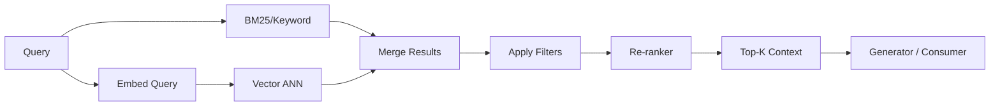
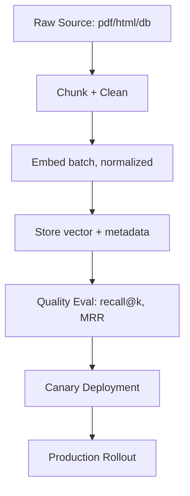

# Embeddings, Vector Databases, and Embedding LLMs — A Survival Guide

**Objective**: Master production-grade embeddings, vector databases, and embedding LLMs for search, RAG, and semantic applications. When you need to build scalable semantic search, when you want to implement production RAG systems, when you're deploying embedding models at scale—vector databases become your weapon of choice.

Vector databases provide the foundation for semantic search and retrieval-augmented generation. Without proper understanding of embeddings, vector operations, and production deployment, you're building fragile systems that miss the power of semantic understanding. This guide shows you how to wield vector databases with the precision of a senior search engineer.

## 0) Prerequisites (Read Once, Live by Them)

### The Five Commandments

1. **Understand embedding fundamentals**
   - Dense vector representations and similarity metrics
   - Model families and domain-specific embeddings
   - Normalization and dimensionality
   - Multimodal and multilingual considerations

2. **Master vector database patterns**
   - ANN indexes and retrieval algorithms
   - Hybrid search and re-ranking
   - Filtering and multi-tenancy
   - Performance optimization and scaling

3. **Know your production concerns**
   - Embedding model serving and batching
   - Cost optimization and quantization
   - Data privacy and PII handling
   - Versioning and migration strategies

4. **Validate everything**
   - Embedding quality and evaluation
   - Retrieval performance and recall
   - System reliability and monitoring
   - Cost and resource utilization

5. **Plan for scale**
   - Sharding and distributed systems
   - Caching and performance optimization
   - Disaster recovery and backup
   - Integration with existing workflows

**Why These Principles**: Vector database mastery is the foundation of semantic search and RAG systems. Understanding embeddings, mastering evaluation techniques, and following best practices is essential for building production-ready semantic applications.

## 1) Embeddings 101 (Text & Multimodal)

### Core Concepts

```yaml
# Embeddings enable semantic understanding
embedding_concepts:
  dense_vectors:
    - "High-dimensional vector representations"
    - "Capture semantic relationships"
    - "Enable similarity computation"
    - "Support downstream tasks"
  
  similarity_metrics:
    - "Cosine similarity (normalized vectors)"
    - "Dot product (unnormalized vectors)"
    - "Euclidean distance (L2 norm)"
    - "Inner product (efficient computation)"
  
  model_families:
    - "General text: BGE, GTE, E5, Instructor"
    - "Code: CodeBERT, StarCoder embeddings"
    - "Multimodal: CLIP, SigLIP, JinaCLIP"
    - "Multilingual: BGE-M3, E5-Multilingual"
```

### Model Selection Guide

```python
# Model selection based on use case
model_selection = {
    "general_text": {
        "models": ["BAAI/bge-large-en-v1.5", "thenlper/gte-large", "intfloat/e5-large-v2"],
        "dimensions": [1024, 1024, 1024],
        "use_cases": ["RAG", "semantic search", "clustering"]
    },
    "code": {
        "models": ["microsoft/codebert-base", "bigcode/starcoder"],
        "dimensions": [768, 4096],
        "use_cases": ["code search", "code completion", "code understanding"]
    },
    "multimodal": {
        "models": ["openai/clip-vit-base-patch32", "google/siglip-base-patch16-224"],
        "dimensions": [512, 768],
        "use_cases": ["image-text search", "visual question answering"]
    }
}
```

### Distance Metric Guidance

```python
# Distance metric selection
def choose_distance_metric(vectors_normalized=True, use_case="similarity"):
    """
    Choose appropriate distance metric based on vector properties and use case
    """
    if vectors_normalized:
        # Cosine and dot product are equivalent for normalized vectors
        return "cosine"  # More robust to vector magnitude variations
    else:
        if use_case == "similarity":
            return "cosine"  # Robust to magnitude differences
        elif use_case == "ranking":
            return "dot"  # Preserves magnitude information
        else:
            return "euclidean"  # Geometric distance
```

**Why This Matters**: Proper model selection and distance metrics determine retrieval quality. Understanding these fundamentals prevents poor search results and performance issues.

## 2) Chunking, Windows, and Metadata

### Chunking Rules

```python
# Optimal chunking strategies
def chunk_text(text, chunk_size=400, overlap=50, strategy="semantic"):
    """
    Chunk text with optimal parameters for embedding quality
    """
    if strategy == "semantic":
        # Preserve semantic boundaries (sentences, paragraphs)
        sentences = text.split('. ')
        chunks = []
        current_chunk = ""
        
        for sentence in sentences:
            if len(current_chunk + sentence) < chunk_size:
                current_chunk += sentence + ". "
            else:
                if current_chunk:
                    chunks.append(current_chunk.strip())
                current_chunk = sentence + ". "
        
        if current_chunk:
            chunks.append(current_chunk.strip())
            
    elif strategy == "fixed":
        # Fixed-size chunks with overlap
        chunks = []
        start = 0
        while start < len(text):
            end = min(start + chunk_size, len(text))
            chunks.append(text[start:end])
            start += chunk_size - overlap
    
    return chunks

# Chunking parameters by domain
chunking_configs = {
    "legal": {"size": 300, "overlap": 30, "strategy": "semantic"},
    "technical": {"size": 400, "overlap": 50, "strategy": "semantic"},
    "conversational": {"size": 200, "overlap": 25, "strategy": "fixed"},
    "multimodal": {"size": 500, "overlap": 75, "strategy": "semantic"}
}
```

### Metadata Schema

```python
# Comprehensive metadata schema
from dataclasses import dataclass
from typing import List, Dict, Any, Optional
from datetime import datetime

@dataclass
class DocumentMetadata:
    """Standard metadata schema for vector database documents"""
    # Core fields
    id: str
    text: str
    vector: List[float]
    dims: int
    model: str
    version: str
    
    # Source information
    source: Dict[str, Any]  # {uri: str, type: str, size: int}
    
    # Content metadata
    title: Optional[str] = None
    section: Optional[str] = None
    language: str = "en"
    tags: List[str] = None
    
    # Temporal information
    created_at: datetime = None
    updated_at: datetime = None
    
    # Privacy and compliance
    pii: Dict[str, Any] = None  # {present: bool, redaction: str, level: str}
    tenant_id: str = None
    
    # Quality metrics
    embedding_quality: Dict[str, float] = None
    chunk_entropy: float = None
    
    def __post_init__(self):
        if self.tags is None:
            self.tags = []
        if self.created_at is None:
            self.created_at = datetime.utcnow()
        if self.updated_at is None:
            self.updated_at = datetime.utcnow()
```

**Why This Matters**: Proper chunking and metadata enable effective retrieval and filtering. Understanding these patterns prevents information loss and enables sophisticated search capabilities.

## 3) Retrieval Patterns (ANN, Hybrid, Filters, Re-ranking)

### Retrieval Pipeline Architecture



### ANN Index Selection

```python
# ANN index selection based on scale and requirements
def choose_ann_index(vector_count, latency_requirements, memory_budget):
    """
    Select appropriate ANN index based on scale and constraints
    """
    if vector_count < 1_000_000:
        # Small scale: HNSW for best recall/latency
        return {
            "algorithm": "HNSW",
            "parameters": {"M": 16, "ef_construction": 200, "ef": 100},
            "memory_usage": "~4x vector size",
            "latency": "1-5ms"
        }
    elif vector_count < 100_000_000:
        # Medium scale: HNSW with optimization or IVF-PQ
        return {
            "algorithm": "HNSW",
            "parameters": {"M": 32, "ef_construction": 400, "ef": 200},
            "memory_usage": "~6x vector size",
            "latency": "5-20ms"
        }
    else:
        # Large scale: IVF-PQ for memory efficiency
        return {
            "algorithm": "IVF-PQ",
            "parameters": {"nlist": 4096, "m": 64, "nbits": 8},
            "memory_usage": "~0.5x vector size",
            "latency": "10-50ms"
        }
```

### Hybrid Search Implementation

```python
# Hybrid search combining BM25 and vector search
from sentence_transformers import SentenceTransformer
from qdrant_client import QdrantClient
import numpy as np

class HybridRetriever:
    """Hybrid retrieval combining BM25 and vector search"""
    
    def __init__(self, vector_db, bm25_index, embedding_model):
        self.vector_db = vector_db
        self.bm25_index = bm25_index
        self.embedding_model = embedding_model
    
    def search(self, query, k=10, alpha=0.7, filters=None):
        """
        Hybrid search combining BM25 and vector similarity
        alpha: weight for vector search (1.0 = vector only, 0.0 = BM25 only)
        """
        # Vector search
        query_vector = self.embedding_model.encode([query])[0]
        vector_results = self.vector_db.search(
            collection_name="documents",
            query_vector=query_vector.tolist(),
            limit=k * 2,  # Get more candidates for reranking
            query_filter=filters
        )
        
        # BM25 search
        bm25_results = self.bm25_index.search(query, k=k * 2)
        
        # Combine and rerank
        combined_results = self._combine_results(
            vector_results, bm25_results, alpha
        )
        
        return combined_results[:k]
    
    def _combine_results(self, vector_results, bm25_results, alpha):
        """Combine and normalize scores from both retrieval methods"""
        # Create score maps
        vector_scores = {hit.id: hit.score for hit in vector_results}
        bm25_scores = {hit.id: hit.score for hit in bm25_results}
        
        # Normalize scores
        vector_max = max(vector_scores.values()) if vector_scores else 1.0
        bm25_max = max(bm25_scores.values()) if bm25_scores else 1.0
        
        # Combine scores
        combined_scores = {}
        all_ids = set(vector_scores.keys()) | set(bm25_scores.keys())
        
        for doc_id in all_ids:
            vector_score = vector_scores.get(doc_id, 0) / vector_max
            bm25_score = bm25_scores.get(doc_id, 0) / bm25_max
            
            combined_score = alpha * vector_score + (1 - alpha) * bm25_score
            combined_scores[doc_id] = combined_score
        
        # Sort by combined score
        return sorted(combined_scores.items(), key=lambda x: x[1], reverse=True)
```

**Why This Matters**: Hybrid retrieval combines the strengths of keyword and semantic search. Understanding these patterns enables more accurate and comprehensive search results.

## 4) Vector Database Choices & Compose Stacks

### Qdrant (HNSW, Payload Filters)

```yaml
# docker-compose.yml for Qdrant
version: "3.9"
services:
  qdrant:
    image: qdrant/qdrant:v1.10.0
    ports: ["6333:6333"]
    volumes: ["qdrant:/qdrant/storage"]
    environment:
      QDRANT__SERVICE__HTTP_PORT: 6333
      QDRANT__SERVICE__GRPC_PORT: 6334
    healthcheck:
      test: ["CMD", "curl", "-f", "http://localhost:6333/health"]
      interval: 30s
      timeout: 10s
      retries: 3

volumes:
  qdrant: {}
```

```python
# Qdrant Python integration
from qdrant_client import QdrantClient
from qdrant_client.http import models
import numpy as np
import uuid

class QdrantVectorDB:
    """Qdrant vector database implementation"""
    
    def __init__(self, host="localhost", port=6333):
        self.client = QdrantClient(host=host, port=port)
        self.collection_name = "documents"
    
    def create_collection(self, vector_size=768, distance="Cosine"):
        """Create vector collection with HNSW index"""
        self.client.recreate_collection(
            collection_name=self.collection_name,
            vectors_config=models.VectorParams(
                size=vector_size,
                distance=getattr(models.Distance, distance.upper())
            )
        )
    
    def upsert_documents(self, documents, vectors, metadata_list):
        """Insert documents with vectors and metadata"""
        points = []
        for i, (doc, vec, meta) in enumerate(zip(documents, vectors, metadata_list)):
            points.append(models.PointStruct(
                id=str(uuid.uuid4()),
                vector=vec.tolist(),
                payload={
                    "text": doc,
                    "metadata": meta
                }
            ))
        
        self.client.upsert(
            collection_name=self.collection_name,
            points=points
        )
    
    def search(self, query_vector, k=10, filters=None):
        """Search with optional filters"""
        results = self.client.search(
            collection_name=self.collection_name,
            query_vector=query_vector.tolist(),
            limit=k,
            query_filter=filters
        )
        return results
```

### Weaviate (Hybrid Modules)

```yaml
# docker-compose.yml for Weaviate
version: "3.9"
services:
  weaviate:
    image: semitechnologies/weaviate:1.24.10
    ports: ["8080:8080"]
    environment:
      QUERY_DEFAULTS_LIMIT: 25
      AUTHENTICATION_ANONYMOUS_ACCESS_ENABLED: "true"
      PERSISTENCE_DATA_PATH: "/var/lib/weaviate"
      DEFAULT_VECTORIZER_MODULE: "none"
      ENABLE_MODULES: "text2vec-transformers,text2vec-cohere,text2vec-openai"
    volumes: ["weaviate:/var/lib/weaviate"]

volumes:
  weaviate: {}
```

```python
# Weaviate Python integration
import weaviate
import numpy as np

class WeaviateVectorDB:
    """Weaviate vector database implementation"""
    
    def __init__(self, host="localhost", port=8080):
        self.client = weaviate.Client(f"http://{host}:{port}")
        self.class_name = "Document"
    
    def create_schema(self):
        """Create Weaviate schema for documents"""
        schema = {
            "class": self.class_name,
            "description": "Document collection",
            "vectorizer": "none",  # Use custom vectors
            "properties": [
                {"name": "text", "dataType": ["text"]},
                {"name": "metadata", "dataType": ["object"]}
            ]
        }
        self.client.schema.create_class(schema)
    
    def upsert_documents(self, documents, vectors, metadata_list):
        """Insert documents with custom vectors"""
        for doc, vec, meta in zip(documents, vectors, metadata_list):
            self.client.data_object.create(
                data_object={
                    "text": doc,
                    "metadata": meta
                },
                class_name=self.class_name,
                vector=vec.tolist()
            )
    
    def search(self, query_vector, k=10, where_filter=None):
        """Search with optional filters"""
        query = self.client.query.get(
            self.class_name, ["text", "metadata"]
        ).with_near_vector({
            "vector": query_vector.tolist()
        }).with_limit(k)
        
        if where_filter:
            query = query.with_where(where_filter)
        
        return query.do()
```

### Postgres + pgvector (Transactional + SQL Filters)

```sql
-- Postgres setup with pgvector
CREATE EXTENSION IF NOT EXISTS vector;

CREATE TABLE documents (
    id bigserial PRIMARY KEY,
    text text NOT NULL,
    embedding vector(768),
    model text,
    version text,
    tenant_id text,
    created_at timestamptz DEFAULT now(),
    section text,
    tags text[],
    metadata jsonb
);

-- Create vector index
CREATE INDEX ON documents USING ivfflat (embedding vector_cosine_ops) 
WITH (lists = 200);

-- Create additional indexes for filtering
CREATE INDEX ON documents (tenant_id);
CREATE INDEX ON documents (created_at);
CREATE INDEX ON documents USING gin (tags);
```

```python
# Postgres + pgvector Python integration
import psycopg2
import numpy as np
from psycopg2.extras import RealDictCursor

class PostgresVectorDB:
    """Postgres + pgvector implementation"""
    
    def __init__(self, connection_string):
        self.conn = psycopg2.connect(connection_string)
        self.conn.autocommit = True
    
    def upsert_documents(self, documents, vectors, metadata_list):
        """Insert documents with vectors and metadata"""
        with self.conn.cursor() as cur:
            for doc, vec, meta in zip(documents, vectors, metadata_list):
                cur.execute("""
                    INSERT INTO documents (text, embedding, model, version, tenant_id, metadata)
                    VALUES (%s, %s, %s, %s, %s, %s)
                """, (
                    doc,
                    vec.tolist(),
                    meta.get('model', 'unknown'),
                    meta.get('version', 'v1'),
                    meta.get('tenant_id'),
                    meta
                ))
    
    def search(self, query_vector, k=10, tenant_id=None, filters=None):
        """Search with SQL filters"""
        with self.conn.cursor(cursor_factory=RealDictCursor) as cur:
            sql = """
                SELECT id, text, metadata, 
                       1 - (embedding <=> %s) as similarity
                FROM documents
                WHERE 1=1
            """
            params = [query_vector.tolist()]
            
            if tenant_id:
                sql += " AND tenant_id = %s"
                params.append(tenant_id)
            
            if filters:
                for key, value in filters.items():
                    sql += f" AND metadata->>%s = %s"
                    params.extend([key, value])
            
            sql += " ORDER BY embedding <=> %s LIMIT %s"
            params.extend([query_vector.tolist(), k])
            
            cur.execute(sql, params)
            return cur.fetchall()
```

**Why These Choices Matter**: Different vector databases excel at different use cases. Understanding these options enables optimal selection based on scale, features, and operational requirements.

## 5) Embedding LLMs in Production

### Model Serving Options

```python
# Production embedding model serving
from sentence_transformers import SentenceTransformer
import torch
import numpy as np
from typing import List, Union

class EmbeddingService:
    """Production embedding service with optimization"""
    
    def __init__(self, model_name="BAAI/bge-small-en-v1.5", device="cuda"):
        self.model = SentenceTransformer(model_name)
        self.device = device
        self.model.to(device)
        self.model.eval()
        
        # Enable optimization
        if device == "cuda":
            self.model.half()  # Use FP16 for speed
    
    def encode_batch(self, texts: List[str], batch_size=64, normalize=True):
        """Encode texts with batching and normalization"""
        embeddings = self.model.encode(
            texts,
            batch_size=batch_size,
            show_progress_bar=True,
            normalize_embeddings=normalize,
            convert_to_tensor=True
        )
        return embeddings.cpu().numpy()
    
    def encode_single(self, text: str, normalize=True):
        """Encode single text"""
        embedding = self.model.encode(
            [text],
            normalize_embeddings=normalize,
            convert_to_tensor=True
        )
        return embedding[0].cpu().numpy()
```

### Quantization for Cost Optimization

```python
# Quantization for production deployment
import torch
from sentence_transformers import SentenceTransformer

class QuantizedEmbeddingService:
    """Quantized embedding service for cost optimization"""
    
    def __init__(self, model_name, quantization="int8"):
        self.model = SentenceTransformer(model_name)
        self.quantization = quantization
        
        if quantization == "int8":
            self.model = torch.quantization.quantize_dynamic(
                self.model, {torch.nn.Linear}, dtype=torch.qint8
            )
        elif quantization == "int4":
            # Custom int4 quantization
            self.model = self._quantize_int4(self.model)
    
    def _quantize_int4(self, model):
        """Custom int4 quantization implementation"""
        # Implementation depends on specific model architecture
        # This is a placeholder for the actual quantization logic
        return model
    
    def encode(self, texts, batch_size=128):
        """Encode with quantized model"""
        with torch.no_grad():
            embeddings = self.model.encode(
                texts,
                batch_size=batch_size,
                normalize_embeddings=True,
                convert_to_tensor=True
            )
        return embeddings.cpu().numpy()
```

### Ollama Integration

```python
# Ollama embedding service
import requests
import json
from typing import List

class OllamaEmbeddingService:
    """Ollama-based embedding service"""
    
    def __init__(self, base_url="http://localhost:11434", model="nomic-embed-text"):
        self.base_url = base_url
        self.model = model
    
    def encode(self, texts: List[str]) -> List[List[float]]:
        """Encode texts using Ollama"""
        embeddings = []
        
        for text in texts:
            response = requests.post(
                f"{self.base_url}/api/embeddings",
                json={
                    "model": self.model,
                    "input": text
                }
            )
            
            if response.status_code == 200:
                result = response.json()
                embeddings.append(result["embedding"])
            else:
                raise Exception(f"Ollama API error: {response.status_code}")
        
        return embeddings
```

**Why Production Serving Matters**: Proper model serving enables scalable embedding generation. Understanding these patterns prevents performance bottlenecks and cost overruns.

## 6) Ingestion Pipeline with Evaluation

### ETL Pipeline Architecture



### Complete Ingestion Pipeline

```python
# End-to-end ingestion pipeline
import pandas as pd
from sentence_transformers import SentenceTransformer
from qdrant_client import QdrantClient
from qdrant_client.http import models
import uuid
from typing import List, Dict, Any

class EmbeddingPipeline:
    """Complete embedding ingestion pipeline"""
    
    def __init__(self, vector_db, embedding_model):
        self.vector_db = vector_db
        self.embedding_model = embedding_model
    
    def process_documents(self, documents: List[Dict[str, Any]], 
                         chunk_size=400, overlap=50):
        """Process documents through complete pipeline"""
        
        # 1. Chunk documents
        chunks = []
        for doc in documents:
            doc_chunks = self._chunk_text(doc['text'], chunk_size, overlap)
            for i, chunk in enumerate(doc_chunks):
                chunks.append({
                    'id': f"{doc['id']}_chunk_{i}",
                    'text': chunk,
                    'source': doc['source'],
                    'metadata': doc.get('metadata', {})
                })
        
        # 2. Generate embeddings
        texts = [chunk['text'] for chunk in chunks]
        embeddings = self.embedding_model.encode(
            texts, 
            batch_size=64, 
            normalize_embeddings=True
        )
        
        # 3. Store in vector database
        self.vector_db.upsert_documents(chunks, embeddings, [chunk['metadata'] for chunk in chunks])
        
        return len(chunks)
    
    def _chunk_text(self, text: str, chunk_size: int, overlap: int) -> List[str]:
        """Chunk text with overlap"""
        chunks = []
        start = 0
        
        while start < len(text):
            end = min(start + chunk_size, len(text))
            chunk = text[start:end]
            chunks.append(chunk)
            start += chunk_size - overlap
        
        return chunks
```

### Evaluation Framework

```python
# Embedding quality evaluation
import numpy as np
from sklearn.metrics.pairwise import cosine_similarity
from typing import List, Dict, Tuple

class EmbeddingEvaluator:
    """Comprehensive embedding evaluation"""
    
    def __init__(self, vector_db, embedding_model):
        self.vector_db = vector_db
        self.embedding_model = embedding_model
    
    def evaluate_retrieval(self, test_queries: List[Dict[str, Any]], k=10):
        """Evaluate retrieval performance"""
        results = []
        
        for query_data in test_queries:
            query = query_data['query']
            relevant_docs = query_data['relevant_docs']
            
            # Get query embedding
            query_embedding = self.embedding_model.encode([query])[0]
            
            # Search vector database
            search_results = self.vector_db.search(
                query_embedding, 
                k=k
            )
            
            # Calculate metrics
            retrieved_ids = [hit.id for hit in search_results]
            recall = len(set(retrieved_ids) & set(relevant_docs)) / len(relevant_docs)
            
            results.append({
                'query': query,
                'recall': recall,
                'retrieved_ids': retrieved_ids,
                'relevant_ids': relevant_docs
            })
        
        return results
    
    def calculate_mrr(self, evaluation_results: List[Dict]) -> float:
        """Calculate Mean Reciprocal Rank"""
        reciprocal_ranks = []
        
        for result in evaluation_results:
            retrieved_ids = result['retrieved_ids']
            relevant_ids = set(result['relevant_ids'])
            
            for i, doc_id in enumerate(retrieved_ids):
                if doc_id in relevant_ids:
                    reciprocal_ranks.append(1.0 / (i + 1))
                    break
            else:
                reciprocal_ranks.append(0.0)
        
        return np.mean(reciprocal_ranks)
```

**Why Evaluation Matters**: Proper evaluation ensures embedding quality and retrieval performance. Understanding these metrics prevents deployment of poor-performing systems.

## 7) RAG Assembly

### Complete RAG Implementation

```python
# Production RAG system
from sentence_transformers import SentenceTransformer, CrossEncoder
from typing import List, Dict, Any
import json

class RAGSystem:
    """Complete RAG system with retrieval and generation"""
    
    def __init__(self, vector_db, embedding_model, reranker_model, llm_client):
        self.vector_db = vector_db
        self.embedding_model = embedding_model
        self.reranker = CrossEncoder(reranker_model)
        self.llm_client = llm_client
    
    def retrieve_and_generate(self, query: str, k=10, rerank_k=5, 
                            filters=None, max_tokens=2000):
        """Complete RAG pipeline"""
        
        # 1. Retrieve documents
        query_embedding = self.embedding_model.encode([query])[0]
        retrieved_docs = self.vector_db.search(
            query_embedding, 
            k=k, 
            filters=filters
        )
        
        # 2. Rerank documents
        if len(retrieved_docs) > rerank_k:
            reranked_docs = self._rerank_documents(query, retrieved_docs, rerank_k)
        else:
            reranked_docs = retrieved_docs
        
        # 3. Prepare context
        context = self._prepare_context(reranked_docs, max_tokens)
        
        # 4. Generate response
        response = self._generate_response(query, context)
        
        return {
            'response': response,
            'sources': reranked_docs,
            'context': context
        }
    
    def _rerank_documents(self, query: str, documents: List, k: int) -> List:
        """Rerank documents using cross-encoder"""
        pairs = [(query, doc.text) for doc in documents]
        scores = self.reranker.predict(pairs)
        
        # Sort by rerank scores
        scored_docs = list(zip(documents, scores))
        scored_docs.sort(key=lambda x: x[1], reverse=True)
        
        return [doc for doc, score in scored_docs[:k]]
    
    def _prepare_context(self, documents: List, max_tokens: int) -> str:
        """Prepare context from retrieved documents"""
        context_parts = []
        current_tokens = 0
        
        for doc in documents:
            doc_text = f"Source: {doc.metadata.get('source', 'Unknown')}\n{doc.text}\n\n"
            doc_tokens = len(doc_text.split())  # Rough token count
            
            if current_tokens + doc_tokens > max_tokens:
                break
            
            context_parts.append(doc_text)
            current_tokens += doc_tokens
        
        return "".join(context_parts)
    
    def _generate_response(self, query: str, context: str) -> str:
        """Generate response using LLM"""
        prompt = f"""
        Context:
        {context}
        
        Question: {query}
        
        Answer based on the provided context. If the context doesn't contain relevant information, say so.
        """
        
        response = self.llm_client.generate(prompt)
        return response
```

**Why RAG Assembly Matters**: Proper RAG implementation combines retrieval and generation effectively. Understanding these patterns enables accurate and contextual responses.

## 8) Safety, Privacy, and Multi-tenancy

### PII Detection and Redaction

```python
# PII detection and redaction for embeddings
import re
from typing import Dict, List, Any
import hashlib

class PIIDetector:
    """PII detection and redaction for embedding pipelines"""
    
    def __init__(self):
        self.pii_patterns = {
            'email': r'\b[A-Za-z0-9._%+-]+@[A-Za-z0-9.-]+\.[A-Z|a-z]{2,}\b',
            'phone': r'\b\d{3}[-.]?\d{3}[-.]?\d{4}\b',
            'ssn': r'\b\d{3}-\d{2}-\d{4}\b',
            'credit_card': r'\b\d{4}[-\s]?\d{4}[-\s]?\d{4}[-\s]?\d{4}\b'
        }
    
    def detect_pii(self, text: str) -> Dict[str, List[str]]:
        """Detect PII in text"""
        detected = {}
        
        for pii_type, pattern in self.pii_patterns.items():
            matches = re.findall(pattern, text)
            if matches:
                detected[pii_type] = matches
        
        return detected
    
    def redact_pii(self, text: str, redaction_level="mask") -> tuple[str, Dict[str, Any]]:
        """Redact PII from text"""
        redacted_text = text
        pii_info = {}
        
        for pii_type, pattern in self.pii_patterns.items():
            matches = re.findall(pattern, text)
            if matches:
                pii_info[pii_type] = len(matches)
                
                if redaction_level == "mask":
                    redacted_text = re.sub(pattern, f"[{pii_type.upper()}]", redacted_text)
                elif redaction_level == "hash":
                    for match in matches:
                        hashed = hashlib.sha256(match.encode()).hexdigest()[:8]
                        redacted_text = redacted_text.replace(match, f"[HASH:{hashed}]")
        
        return redacted_text, pii_info
```

### Multi-tenant Security

```python
# Multi-tenant security for vector databases
from typing import Dict, Any, Optional
import uuid

class MultiTenantVectorDB:
    """Multi-tenant vector database with security controls"""
    
    def __init__(self, vector_db):
        self.vector_db = vector_db
        self.tenant_collections = {}
    
    def create_tenant_collection(self, tenant_id: str, vector_size: int):
        """Create isolated collection for tenant"""
        collection_name = f"tenant_{tenant_id}"
        
        # Create collection with tenant-specific configuration
        self.vector_db.create_collection(
            collection_name=collection_name,
            vector_size=vector_size
        )
        
        self.tenant_collections[tenant_id] = collection_name
        return collection_name
    
    def search_tenant(self, tenant_id: str, query_vector, k=10, filters=None):
        """Search within tenant's collection only"""
        if tenant_id not in self.tenant_collections:
            raise ValueError(f"Tenant {tenant_id} not found")
        
        collection_name = self.tenant_collections[tenant_id]
        
        # Add tenant filter to prevent cross-tenant access
        tenant_filter = {"must": [{"key": "tenant_id", "match": {"value": tenant_id}}]}
        
        if filters:
            tenant_filter["must"].extend(filters.get("must", []))
        
        return self.vector_db.search(
            collection_name=collection_name,
            query_vector=query_vector,
            k=k,
            filters=tenant_filter
        )
    
    def delete_tenant_data(self, tenant_id: str):
        """Delete all data for tenant"""
        if tenant_id in self.tenant_collections:
            collection_name = self.tenant_collections[tenant_id]
            self.vector_db.delete_collection(collection_name)
            del self.tenant_collections[tenant_id]
```

**Why Safety Matters**: Proper security controls prevent data leakage and ensure compliance. Understanding these patterns enables safe multi-tenant deployments.

## 9) Cost & Scale Optimization

### Scale-Based Architecture

```python
# Scale-based architecture decisions
def choose_architecture(vector_count: int, qps: int, latency_requirements: Dict):
    """Choose architecture based on scale requirements"""
    
    if vector_count < 1_000_000:
        # Small scale: Single instance
        return {
            "architecture": "single_instance",
            "vector_db": "qdrant_single",
            "embedding_service": "local_model",
            "estimated_cost": "$100-500/month"
        }
    elif vector_count < 100_000_000:
        # Medium scale: Clustered
        return {
            "architecture": "clustered",
            "vector_db": "qdrant_cluster",
            "embedding_service": "distributed_model",
            "estimated_cost": "$1000-5000/month"
        }
    else:
        # Large scale: Distributed
        return {
            "architecture": "distributed",
            "vector_db": "sharded_cluster",
            "embedding_service": "gpu_cluster",
            "estimated_cost": "$10000+/month"
        }
```

### Cost Optimization Strategies

```python
# Cost optimization strategies
class CostOptimizer:
    """Cost optimization for vector databases"""
    
    def __init__(self):
        self.optimization_strategies = {
            "quantization": {
                "int8": {"memory_reduction": 0.5, "latency_impact": 1.2},
                "int4": {"memory_reduction": 0.75, "latency_impact": 1.5}
            },
            "compression": {
                "pq": {"memory_reduction": 0.8, "recall_impact": 0.95},
                "lsh": {"memory_reduction": 0.9, "recall_impact": 0.85}
            },
            "caching": {
                "query_cache": {"hit_rate": 0.7, "latency_improvement": 0.1},
                "embedding_cache": {"hit_rate": 0.5, "latency_improvement": 0.3}
            }
        }
    
    def optimize_for_cost(self, requirements: Dict) -> Dict:
        """Optimize system for cost constraints"""
        optimizations = []
        
        if requirements.get("memory_budget") < 1000:  # GB
            optimizations.append("quantization_int8")
            optimizations.append("compression_pq")
        
        if requirements.get("latency_budget") > 100:  # ms
            optimizations.append("caching_query")
            optimizations.append("caching_embedding")
        
        return {
            "optimizations": optimizations,
            "estimated_savings": self._calculate_savings(optimizations),
            "trade_offs": self._identify_trade_offs(optimizations)
        }
```

**Why Cost Optimization Matters**: Proper cost management prevents budget overruns while maintaining performance. Understanding these strategies enables sustainable scaling.

## 10) Red Flags (Anti-Patterns)

### Common Failures

```python
# Red flags and anti-patterns
RED_FLAGS = {
    "mixing_dimensions": {
        "description": "Mixing different embedding dimensions in same collection",
        "impact": "Search failures, incorrect results",
        "solution": "Use consistent embedding models and dimensions"
    },
    "unnormalized_vectors": {
        "description": "Forgetting to normalize query vectors while index vectors are normalized",
        "impact": "Poor similarity scores, incorrect ranking",
        "solution": "Always normalize both index and query vectors"
    },
    "no_filters": {
        "description": "No tenant or access filters on vector search",
        "impact": "Data leakage, security violations",
        "solution": "Implement mandatory filters for multi-tenant systems"
    },
    "no_evaluation": {
        "description": "Re-embedding without A/B evaluation",
        "impact": "Performance degradation, user complaints",
        "solution": "Always evaluate embedding changes before deployment"
    },
    "no_metadata": {
        "description": "Returning raw chunks with no source information",
        "impact": "Audit nightmare, compliance issues",
        "solution": "Always include source metadata and citations"
    }
}

def check_for_red_flags(system_config: Dict) -> List[str]:
    """Check system configuration for red flags"""
    issues = []
    
    if system_config.get("mixed_dimensions"):
        issues.append("mixing_dimensions")
    
    if not system_config.get("normalized_vectors"):
        issues.append("unnormalized_vectors")
    
    if not system_config.get("filters_enabled"):
        issues.append("no_filters")
    
    if not system_config.get("evaluation_enabled"):
        issues.append("no_evaluation")
    
    if not system_config.get("metadata_included"):
        issues.append("no_metadata")
    
    return issues
```

**Why Red Flags Matter**: Common anti-patterns lead to system failures and security issues. Understanding these patterns prevents costly mistakes and ensures reliable deployments.

## 11) TL;DR Runbook (The Essentials)

### Essential Setup

```bash
# 1) Start vector database
docker compose up -d qdrant

# 2) Install dependencies
pip install sentence-transformers qdrant-client numpy

# 3) Run ingestion pipeline
python ingest.py --source data/ --model BAAI/bge-small-en-v1.5

# 4) Test search
python search.py --query "machine learning" --k 10

# 5) Evaluate performance
python eval.py --test-set eval.jsonl --collection documents
```

### Essential Python Patterns

```python
# Essential embedding patterns
def essential_embedding_patterns():
    # 1. Model selection and loading
    # 2. Text preprocessing and chunking
    # 3. Embedding generation and normalization
    # 4. Vector database operations
    # 5. Search and retrieval
    # 6. Evaluation and monitoring
    pass
```

### Essential Tools

```bash
# Essential tools for embedding systems
tools:
  models: "sentence-transformers, transformers, torch"
  databases: "Qdrant, Weaviate, pgvector"
  evaluation: "scikit-learn, numpy, pandas"
  serving: "FastAPI, Docker, Kubernetes"
```

**Why This Quickstart**: These patterns cover 90% of embedding system usage. Master these before exploring advanced features.

## 12) The Machine's Summary

Vector databases provide the foundation for semantic search and RAG systems. When used correctly, they enable intelligent applications that can understand meaning, context, and relationships in text data while maintaining performance and reliability. The key is understanding embeddings, mastering evaluation techniques, and following best practices.

**The Dark Truth**: Without proper vector database understanding, your semantic search is shallow and unreliable. Vector databases are your weapon. Use them wisely.

**The Machine's Mantra**: "In embeddings we trust, in vectors we build, and in the semantic search we find the path to intelligent information retrieval."

**Why This Matters**: Vector databases enable applications to understand meaning, context, and relationships in text data. They provide the foundation for intelligent AI systems that can reason about language and provide meaningful responses.

---

*This guide provides the complete machinery for mastering embeddings, vector databases, and embedding LLMs. The patterns scale from simple similarity search to complex RAG systems, from basic retrieval to advanced semantic understanding.*
