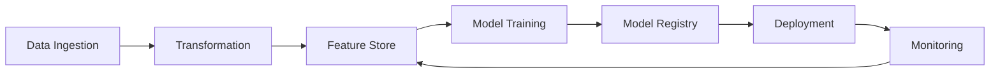
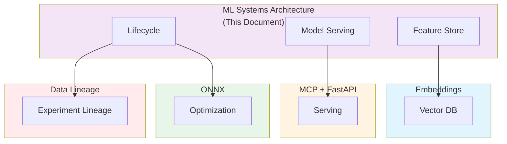

# ML Systems Architecture: Feature Stores, Model Serving, Experiment Governance, and Cross-System Reproducibility

**Objective**: Establish comprehensive ML systems architecture covering the full lifecycle from data ingestion to model deployment and monitoring. When you need feature stores, when you want experiment governance, when you need reproducibility—this guide provides the complete framework.

## Introduction

ML systems require careful architecture to ensure reproducibility, governance, and operational excellence. This guide establishes patterns for feature stores, model serving, experiment governance, and cross-system reproducibility across all ML workloads.

**What This Guide Covers**:
- Full lifecycle architecture: ingest → transform → feature store → model training → registry → deployment → monitoring
- MLflow + ONNX + browser inference + geospatial ML pipelines
- Reproducibility standards across CPUs/GPUs/edge devices
- Metadata governance for experiment lineage
- Feature store schema contracts
- Model drift detection and automated rollback
- Multi-environment ML governance (dev/stage/prod/air-gapped prod)

**Prerequisites**:
- Understanding of machine learning workflows and MLOps
- Familiarity with MLflow, ONNX, and model serving
- Experience with feature stores and experiment tracking

**Related Documents**:
This document integrates with:
- **[Embeddings & Vector Databases](embeddings-and-vector-databases.md)** - Vector storage for ML
- **[MCP + FastAPI Full Stack](mcp-fastapi-stack.md)** - ML serving infrastructure
- **[ONNX Model Optimization](onnx-model-optimization.md)** - Model optimization
- **[Data Lineage Contracts](../database-data/data-lineage-contracts.md)** - ML experiment lineage
- **[Chaos Engineering Governance](../operations-monitoring/chaos-engineering-governance.md)** - ML system resilience
- **[Multi-Region DR Strategy](../architecture-design/multi-region-dr-strategy.md)** - ML system DR
- **[Semantic Layer Engineering](../database-data/semantic-layer-engineering.md)** - ML semantic layers

## The Philosophy of ML Systems Architecture

### ML Lifecycle Principles

**Principle 1: Reproducibility**
- Version all artifacts
- Track all dependencies
- Enable exact reproduction

**Principle 2: Governance**
- Track all experiments
- Enforce policies
- Audit all changes

**Principle 3: Observability**
- Monitor model performance
- Track data drift
- Alert on anomalies

## Full Lifecycle Architecture

### Lifecycle Pipeline

**Architecture**:


### Implementation

**Pipeline Definition**:
```python
# ML lifecycle pipeline
class MLLifecyclePipeline:
    def __init__(self):
        self.ingest = DataIngestion()
        self.transform = DataTransformation()
        self.feature_store = FeatureStore()
        self.training = ModelTraining()
        self.registry = ModelRegistry()
        self.deployment = ModelDeployment()
        self.monitoring = ModelMonitoring()
    
    def run(self, experiment: Experiment) -> Model:
        """Run full ML lifecycle"""
        # Ingest
        data = self.ingest.ingest(experiment.data_source)
        
        # Transform
        transformed = self.transform.transform(data)
        
        # Store features
        features = self.feature_store.store(transformed)
        
        # Train
        model = self.training.train(features, experiment.config)
        
        # Register
        registered = self.registry.register(model, experiment)
        
        # Deploy
        deployed = self.deployment.deploy(registered)
        
        # Monitor
        self.monitoring.monitor(deployed)
        
        return deployed
```

## MLflow Integration

### MLflow Setup

**Configuration**:
```python
# MLflow configuration
import mlflow

mlflow.set_tracking_uri("http://mlflow-server:5000")
mlflow.set_experiment("geospatial-ml")

# Log experiment
with mlflow.start_run():
    mlflow.log_params(params)
    mlflow.log_metrics(metrics)
    mlflow.log_model(model, "model")
```

### Experiment Tracking

**Pattern**: Track all experiments.

**Example**:
```python
# Experiment tracking
class ExperimentTracker:
    def track_experiment(self, experiment: Experiment):
        """Track ML experiment"""
        with mlflow.start_run(run_name=experiment.name):
            # Log parameters
            mlflow.log_params(experiment.params)
            
            # Log metrics
            mlflow.log_metrics(experiment.metrics)
            
            # Log artifacts
            mlflow.log_artifacts(experiment.artifacts)
            
            # Log model
            mlflow.log_model(experiment.model, "model")
```

## ONNX Integration

### ONNX Model Export

**Pattern**: Export models to ONNX.

**Example**:
```python
# ONNX export
import onnx
from onnx import helper

def export_to_onnx(model, input_shape, output_path):
    """Export model to ONNX"""
    onnx_model = helper.make_model(
        graph=model.graph,
        producer_name="ml-pipeline"
    )
    
    onnx.save(onnx_model, output_path)
```

See: **[ONNX Model Optimization](onnx-model-optimization.md)**

## Browser Inference

### Browser Inference Setup

**Pattern**: Deploy models for browser inference.

**Example**:
```javascript
// Browser inference
import * as ort from 'onnxruntime-web';

async function loadModel(modelPath) {
    const session = await ort.InferenceSession.create(modelPath);
    return session;
}

async function predict(session, input) {
    const results = await session.run(input);
    return results;
}
```

## Geospatial ML Pipelines

### Geospatial Pipeline

**Pattern**: ML pipelines for geospatial data.

**Example**:
```python
# Geospatial ML pipeline
class GeospatialMLPipeline:
    def __init__(self):
        self.feature_extractor = GeospatialFeatureExtractor()
        self.model = GeospatialModel()
    
    def process(self, geospatial_data: GeospatialData) -> Prediction:
        """Process geospatial data"""
        features = self.feature_extractor.extract(geospatial_data)
        prediction = self.model.predict(features)
        return prediction
```

## Reproducibility Standards

### Reproducibility Framework

**Pattern**: Ensure reproducibility across environments.

**Example**:
```python
# Reproducibility framework
class ReproducibilityFramework:
    def __init__(self):
        self.version_control = VersionControl()
        self.dependency_tracker = DependencyTracker()
        self.environment_manager = EnvironmentManager()
    
    def ensure_reproducibility(self, experiment: Experiment) -> ReproducibilityReport:
        """Ensure experiment reproducibility"""
        # Version all artifacts
        versions = self.version_control.version_all(experiment)
        
        # Track dependencies
        dependencies = self.dependency_tracker.track(experiment)
        
        # Manage environment
        environment = self.environment_manager.create(experiment)
        
        return ReproducibilityReport(
            versions=versions,
            dependencies=dependencies,
            environment=environment
        )
```

### Cross-Device Reproducibility

**Pattern**: Reproduce across CPUs/GPUs/edge devices.

**Example**:
```python
# Cross-device reproducibility
class CrossDeviceReproducibility:
    def reproduce(self, model: Model, device: Device) -> ReproducedModel:
        """Reproduce model on device"""
        # Adapt model for device
        adapted = self.adapt_model(model, device)
        
        # Verify reproducibility
        verified = self.verify_reproduction(adapted, model)
        
        return ReproducedModel(adapted, verified)
```

## Metadata Governance

### Experiment Lineage

**Pattern**: Track experiment lineage.

**Example**:
```python
# Experiment lineage
class ExperimentLineage:
    def track_lineage(self, experiment: Experiment) -> Lineage:
        """Track experiment lineage"""
        lineage = {
            'experiment_id': experiment.id,
            'data_source': experiment.data_source,
            'features': experiment.features,
            'model': experiment.model,
            'dependencies': experiment.dependencies,
            'timestamp': experiment.timestamp
        }
        
        return Lineage(lineage)
```

See: **[Data Lineage Contracts](../database-data/data-lineage-contracts.md)**

## Feature Store Schema Contracts

### Feature Store Contracts

**Pattern**: Define feature store contracts.

**Example**:
```python
# Feature store contract
class FeatureStoreContract:
    def __init__(self):
        self.schema = FeatureSchema()
        self.validation = FeatureValidation()
    
    def validate_feature(self, feature: Feature) -> bool:
        """Validate feature against contract"""
        return self.validation.validate(feature, self.schema)
```

## Model Drift Detection

### Drift Detection

**Pattern**: Detect model drift.

**Example**:
```python
# Model drift detection
class ModelDriftDetector:
    def detect_drift(self, model: Model, data: Data) -> DriftReport:
        """Detect model drift"""
        # Compare predictions
        predictions = model.predict(data)
        baseline_predictions = self.baseline_model.predict(data)
        
        # Calculate drift
        drift = self.calculate_drift(predictions, baseline_predictions)
        
        # Generate report
        report = DriftReport(
            drift_score=drift,
            threshold=self.drift_threshold,
            action="rollback" if drift > self.drift_threshold else "monitor"
        )
        
        return report
```

### Automated Rollback

**Pattern**: Automatically rollback on drift.

**Example**:
```python
# Automated rollback
class AutomatedRollback:
    def rollback(self, model: Model, drift_report: DriftReport):
        """Automatically rollback model"""
        if drift_report.action == "rollback":
            # Get previous model
            previous = self.registry.get_previous_version(model)
            
            # Deploy previous
            self.deployment.deploy(previous)
            
            # Alert
            self.alerting.alert("Model rolled back due to drift")
```

## Multi-Environment ML Governance

### Environment Configuration

**Pattern**: Govern ML across environments.

**Example**:
```yaml
# Multi-environment ML governance
ml_governance:
  environments:
    dev:
      model_registry: "mlflow-dev"
      feature_store: "feature-store-dev"
      deployment: "manual"
    staging:
      model_registry: "mlflow-staging"
      feature_store: "feature-store-staging"
      deployment: "automated"
    prod:
      model_registry: "mlflow-prod"
      feature_store: "feature-store-prod"
      deployment: "automated-with-approval"
    air_gapped_prod:
      model_registry: "mlflow-air-gapped"
      feature_store: "feature-store-air-gapped"
      deployment: "manual-with-verification"
```

## Cross-Document Architecture



## Checklists

### ML Systems Compliance Checklist

- [ ] Lifecycle pipeline defined
- [ ] MLflow integration configured
- [ ] ONNX export enabled
- [ ] Browser inference supported
- [ ] Reproducibility framework active
- [ ] Experiment lineage tracked
- [ ] Feature store contracts defined
- [ ] Drift detection enabled
- [ ] Automated rollback configured
- [ ] Multi-environment governance active

## Anti-Patterns

### ML Systems Anti-Patterns

**No Versioning**:
```python
# Bad: No versioning
model = train_model(data)

# Good: Versioned
model = train_model(data)
versioned = registry.register(model, version="v1.2.3")
```

**No Lineage Tracking**:
```python
# Bad: No lineage
experiment = run_experiment()

# Good: Lineage tracked
experiment = run_experiment()
lineage = track_lineage(experiment)
```

## See Also

- **[Embeddings & Vector Databases](embeddings-and-vector-databases.md)** - Vector storage
- **[MCP + FastAPI Full Stack](mcp-fastapi-stack.md)** - Serving infrastructure
- **[ONNX Model Optimization](onnx-model-optimization.md)** - Model optimization
- **[Data Lineage Contracts](../database-data/data-lineage-contracts.md)** - Experiment lineage
- **[Chaos Engineering Governance](../operations-monitoring/chaos-engineering-governance.md)** - ML resilience
- **[Multi-Region DR Strategy](../architecture-design/multi-region-dr-strategy.md)** - ML DR
- **[Semantic Layer Engineering](../database-data/semantic-layer-engineering.md)** - ML semantic layers

---

*This guide establishes comprehensive ML systems architecture patterns. Start with lifecycle design, extend to governance, and continuously monitor and improve model performance.*

