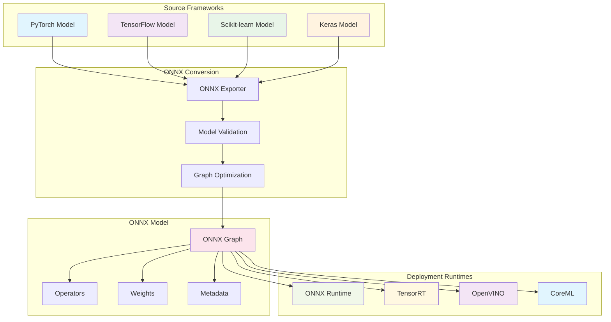

# ONNX Model Optimization: Production-Ready Machine Learning Deployment

**Objective**: Master ONNX model creation, optimization, and deployment for production machine learning systems. When you need cross-platform model deployment, when you're optimizing for inference performance, when you need to standardize model formats across frameworks—ONNX becomes your weapon of choice.

ONNX model optimization is the foundation of production machine learning deployment. Without proper ONNX understanding, you're building inefficient models, struggling with framework compatibility, and missing the power of cross-platform deployment. This guide shows you how to wield ONNX with the precision of a machine learning engineer.

## 0) Prerequisites (Read Once, Live by Them)

### The Five Commandments

1. **Understand the ONNX ecosystem**
   - Open Neural Network Exchange format
   - Cross-framework compatibility
   - Runtime optimization and deployment

2. **Master the conversion process**
   - Framework-specific exporters
   - Model validation and verification
   - Optimization techniques and tools

3. **Know your optimization patterns**
   - Model quantization and pruning
   - Graph optimization and fusion
   - Runtime-specific optimizations

4. **Validate everything**
   - Model accuracy preservation
   - Performance benchmarking
   - Cross-platform compatibility

5. **Plan for production**
   - Deployment strategies and runtimes
   - Monitoring and observability
   - Security and governance

**Why These Principles**: ONNX mastery is the foundation of production machine learning deployment. Understanding the ecosystem, mastering conversion, and following best practices is essential for building scalable, efficient ML systems.

## 1) What is ONNX? (The Foundation)

### Core Concepts

```yaml
# ONNX (Open Neural Network Exchange) is a standard format
# for representing machine learning models across frameworks

onnx_ecosystem:
  format:
    - "Open standard for ML models"
    - "Cross-framework compatibility"
    - "Graph-based representation"
    - "Operator standardization"
  
  frameworks:
    - "PyTorch (torch.onnx)"
    - "TensorFlow (tf2onnx)"
    - "Scikit-learn (skl2onnx)"
    - "Keras (keras2onnx)"
  
  runtimes:
    - "ONNX Runtime (CPU/GPU)"
    - "TensorRT (NVIDIA)"
    - "OpenVINO (Intel)"
    - "CoreML (Apple)"
```

### ONNX Architecture



### Why ONNX Matters

```python
# ONNX provides:
# - Cross-framework model portability
# - Optimized inference runtimes
# - Standardized model format
# - Hardware acceleration support
# - Production deployment flexibility

# Example: Convert PyTorch model to ONNX
import torch
import torch.onnx

# Create a simple model
class SimpleModel(torch.nn.Module):
    def __init__(self):
        super().__init__()
        self.linear = torch.nn.Linear(10, 1)
    
    def forward(self, x):
        return self.linear(x)

model = SimpleModel()
dummy_input = torch.randn(1, 10)

# Export to ONNX
torch.onnx.export(
    model,
    dummy_input,
    "model.onnx",
    export_params=True,
    opset_version=11,
    do_constant_folding=True,
    input_names=['input'],
    output_names=['output']
)
```

**Why ONNX Matters**: ONNX provides a standardized format for machine learning models, enabling cross-framework compatibility and optimized deployment across different hardware platforms.

## 2) Model Conversion Best Practices (The Foundation)

### PyTorch to ONNX Conversion

```python
# ✅ DO: Proper PyTorch to ONNX conversion
import torch
import torch.onnx
import onnx
import onnxruntime as ort

class OptimizedModel(torch.nn.Module):
    def __init__(self):
        super().__init__()
        self.linear1 = torch.nn.Linear(784, 128)
        self.relu = torch.nn.ReLU()
        self.linear2 = torch.nn.Linear(128, 10)
        self.dropout = torch.nn.Dropout(0.2)
    
    def forward(self, x):
        x = self.linear1(x)
        x = self.relu(x)
        x = self.dropout(x)
        x = self.linear2(x)
        return x

def convert_pytorch_to_onnx():
    # Create model
    model = OptimizedModel()
    model.eval()  # Set to evaluation mode
    
    # Create dummy input
    dummy_input = torch.randn(1, 784)
    
    # Export to ONNX
    torch.onnx.export(
        model,
        dummy_input,
        "optimized_model.onnx",
        export_params=True,
        opset_version=11,
        do_constant_folding=True,
        input_names=['input'],
        output_names=['output'],
        dynamic_axes={
            'input': {0: 'batch_size'},
            'output': {0: 'batch_size'}
        }
    )
    
    # Validate the exported model
    onnx_model = onnx.load("optimized_model.onnx")
    onnx.checker.check_model(onnx_model)
    
    return onnx_model
```

### TensorFlow to ONNX Conversion

```python
# ✅ DO: TensorFlow to ONNX conversion
import tensorflow as tf
import tf2onnx
import onnx

def convert_tensorflow_to_onnx():
    # Create TensorFlow model
    model = tf.keras.Sequential([
        tf.keras.layers.Dense(128, activation='relu', input_shape=(784,)),
        tf.keras.layers.Dropout(0.2),
        tf.keras.layers.Dense(10, activation='softmax')
    ])
    
    # Compile model
    model.compile(
        optimizer='adam',
        loss='sparse_categorical_crossentropy',
        metrics=['accuracy']
    )
    
    # Convert to ONNX
    spec = (tf.TensorSpec((None, 784), tf.float32, name="input"),)
    onnx_model, _ = tf2onnx.convert.from_keras(
        model,
        input_signature=spec,
        opset=11
    )
    
    # Save model
    with open("tf_model.onnx", "wb") as f:
        f.write(onnx_model.SerializeToString())
    
    return onnx_model
```

### Scikit-learn to ONNX Conversion

```python
# ✅ DO: Scikit-learn to ONNX conversion
from sklearn.ensemble import RandomForestClassifier
from sklearn.datasets import make_classification
from skl2onnx import convert_sklearn
from skl2onnx.common.data_types import FloatTensorType
import onnx

def convert_sklearn_to_onnx():
    # Create and train model
    X, y = make_classification(n_samples=1000, n_features=20, random_state=42)
    model = RandomForestClassifier(n_estimators=100, random_state=42)
    model.fit(X, y)
    
    # Define input type
    initial_type = [('float_input', FloatTensorType([None, 20]))]
    
    # Convert to ONNX
    onnx_model = convert_sklearn(
        model,
        initial_types=initial_type,
        target_opset=11
    )
    
    # Save model
    with open("sklearn_model.onnx", "wb") as f:
        f.write(onnx_model.SerializeToString())
    
    return onnx_model
```

**Why This Conversion Matters**: Proper model conversion ensures compatibility and performance. Understanding framework-specific exporters and validation techniques prevents conversion errors and maintains model accuracy.

## 3) Model Optimization Techniques (The Performance)

### Graph Optimization

```python
# ✅ DO: ONNX graph optimization
import onnx
from onnx import optimizer
from onnxruntime.tools import optimizer as ort_optimizer

def optimize_onnx_model(model_path):
    # Load model
    model = onnx.load(model_path)
    
    # Apply graph optimizations
    optimized_model = optimizer.optimize(model, [
        'eliminate_identity',
        'eliminate_nop_transpose',
        'fuse_consecutive_transposes',
        'fuse_transpose_into_gemm',
        'eliminate_unused_initializer'
    ])
    
    # Save optimized model
    onnx.save(optimized_model, "optimized_model.onnx")
    
    return optimized_model

# ✅ DO: ONNX Runtime optimization
def optimize_with_ort(model_path):
    # Create optimization config
    config = ort_optimizer.OptimizationConfig(
        enable_constant_folding=True,
        enable_eliminate_identity=True,
        enable_eliminate_nop_transpose=True,
        enable_fuse_consecutive_transposes=True,
        enable_fuse_transpose_into_gemm=True,
        enable_eliminate_unused_initializer=True
    )
    
    # Optimize model
    optimized_model = ort_optimizer.optimize_model(
        model_path,
        config=config
    )
    
    # Save optimized model
    optimized_model.save_model_to_file("ort_optimized_model.onnx")
    
    return optimized_model
```

### Model Quantization

```python
# ✅ DO: Dynamic quantization
import onnxruntime as ort
from onnxruntime.quantization import quantize_dynamic, QuantType

def quantize_model_dynamic(model_path):
    # Apply dynamic quantization
    quantized_model = quantize_dynamic(
        model_path,
        "quantized_model.onnx",
        weight_type=QuantType.QUInt8
    )
    
    return quantized_model

# ✅ DO: Static quantization
from onnxruntime.quantization import quantize_static, CalibrationDataReader

class CalibrationDataReader(CalibrationDataReader):
    def __init__(self, data_loader):
        self.data_loader = data_loader
        self.iterator = iter(data_loader)
    
    def get_next(self):
        try:
            data = next(self.iterator)
            return {"input": data[0].numpy()}
        except StopIteration:
            return None

def quantize_model_static(model_path, calibration_data):
    # Apply static quantization
    quantized_model = quantize_static(
        model_path,
        "static_quantized_model.onnx",
        calibration_data_reader=calibration_data,
        quant_format=QuantFormat.QOperator,
        activation_type=QuantType.QUInt8,
        weight_type=QuantType.QUInt8
    )
    
    return quantized_model
```

### Model Pruning

```python
# ✅ DO: ONNX model pruning
import onnx
from onnx import numpy_helper
import numpy as np

def prune_onnx_model(model_path, sparsity_threshold=0.1):
    # Load model
    model = onnx.load(model_path)
    
    # Prune weights
    for initializer in model.graph.initializer:
        if initializer.data_type == onnx.TensorProto.FLOAT:
            weights = numpy_helper.to_array(initializer)
            
            # Calculate sparsity
            sparsity = np.sum(np.abs(weights) < sparsity_threshold) / weights.size
            
            if sparsity > 0.5:  # If more than 50% sparse
                # Zero out small weights
                weights[np.abs(weights) < sparsity_threshold] = 0
                
                # Update initializer
                initializer.raw_data = weights.astype(np.float32).tobytes()
    
    # Save pruned model
    onnx.save(model, "pruned_model.onnx")
    
    return model
```

**Why This Optimization Matters**: Model optimization techniques significantly improve inference performance and reduce model size. Graph optimization, quantization, and pruning provide the foundation for production-ready models.

## 4) Runtime Optimization (The Deployment)

### ONNX Runtime Configuration

```python
# ✅ DO: Optimized ONNX Runtime configuration
import onnxruntime as ort
import numpy as np

def create_optimized_session(model_path):
    # Create session options
    session_options = ort.SessionOptions()
    
    # Enable graph optimization
    session_options.graph_optimization_level = ort.GraphOptimizationLevel.ORT_ENABLE_ALL
    
    # Enable execution providers
    providers = [
        'CUDAExecutionProvider',  # GPU
        'CPUExecutionProvider'     # CPU fallback
    ]
    
    # Create session
    session = ort.InferenceSession(
        model_path,
        sess_options=session_options,
        providers=providers
    )
    
    return session

# ✅ DO: Batch inference optimization
def optimized_batch_inference(session, input_data, batch_size=32):
    results = []
    
    # Process in batches
    for i in range(0, len(input_data), batch_size):
        batch = input_data[i:i + batch_size]
        
        # Run inference
        outputs = session.run(
            None,
            {"input": batch}
        )
        
        results.extend(outputs[0])
    
    return results
```

### Memory Optimization

```python
# ✅ DO: Memory-efficient inference
class MemoryEfficientONNX:
    def __init__(self, model_path):
        self.session = self._create_session(model_path)
        self.input_name = self.session.get_inputs()[0].name
        self.output_name = self.session.get_outputs()[0].name
    
    def _create_session(self, model_path):
        # Configure for memory efficiency
        session_options = ort.SessionOptions()
        session_options.enable_mem_pattern = False
        session_options.enable_cpu_mem_arena = False
        
        return ort.InferenceSession(model_path, session_options)
    
    def predict(self, input_data):
        # Single inference to minimize memory usage
        return self.session.run(
            [self.output_name],
            {self.input_name: input_data}
        )[0]
```

### Performance Benchmarking

```python
# ✅ DO: Comprehensive performance benchmarking
import time
import psutil
import onnxruntime as ort

class ONNXBenchmark:
    def __init__(self, model_path):
        self.session = ort.InferenceSession(model_path)
        self.input_name = self.session.get_inputs()[0].name
    
    def benchmark_inference(self, input_data, iterations=100):
        # Warmup
        for _ in range(10):
            self.session.run(None, {self.input_name: input_data})
        
        # Benchmark
        times = []
        for _ in range(iterations):
            start_time = time.time()
            self.session.run(None, {self.input_name: input_data})
            end_time = time.time()
            times.append(end_time - start_time)
        
        return {
            "mean_time": np.mean(times),
            "std_time": np.std(times),
            "min_time": np.min(times),
            "max_time": np.max(times),
            "throughput": 1.0 / np.mean(times)
        }
    
    def benchmark_memory(self, input_data):
        # Monitor memory usage
        process = psutil.Process()
        initial_memory = process.memory_info().rss
        
        # Run inference
        self.session.run(None, {self.input_name: input_data})
        
        peak_memory = process.memory_info().rss
        memory_usage = peak_memory - initial_memory
        
        return {
            "initial_memory": initial_memory,
            "peak_memory": peak_memory,
            "memory_usage": memory_usage
        }
```

**Why This Runtime Optimization Matters**: Runtime optimization ensures efficient model deployment. Proper configuration, memory management, and performance benchmarking provide the foundation for production-ready inference.

## 5) Production Deployment Patterns (The Scale)

### Model Versioning and Management

```python
# ✅ DO: Model versioning system
import os
import json
from datetime import datetime
import hashlib

class ONNXModelManager:
    def __init__(self, model_dir="models"):
        self.model_dir = model_dir
        os.makedirs(model_dir, exist_ok=True)
    
    def save_model(self, model, metadata=None):
        # Generate version
        timestamp = datetime.now().strftime("%Y%m%d_%H%M%S")
        model_hash = hashlib.md5(model.SerializeToString()).hexdigest()[:8]
        version = f"{timestamp}_{model_hash}"
        
        # Create version directory
        version_dir = os.path.join(self.model_dir, version)
        os.makedirs(version_dir, exist_ok=True)
        
        # Save model
        model_path = os.path.join(version_dir, "model.onnx")
        onnx.save(model, model_path)
        
        # Save metadata
        if metadata:
            metadata_path = os.path.join(version_dir, "metadata.json")
            with open(metadata_path, 'w') as f:
                json.dump(metadata, f, indent=2)
        
        # Update latest symlink
        latest_path = os.path.join(self.model_dir, "latest")
        if os.path.exists(latest_path):
            os.unlink(latest_path)
        os.symlink(version, latest_path)
        
        return version
    
    def load_model(self, version="latest"):
        if version == "latest":
            version = os.readlink(os.path.join(self.model_dir, "latest"))
        
        model_path = os.path.join(self.model_dir, version, "model.onnx")
        return onnx.load(model_path)
```

### Model Serving Infrastructure

```python
# ✅ DO: Production model serving
from flask import Flask, request, jsonify
import onnxruntime as ort
import numpy as np
import logging

class ONNXModelServer:
    def __init__(self, model_path):
        self.app = Flask(__name__)
        self.session = self._create_session(model_path)
        self.setup_routes()
    
    def _create_session(self, model_path):
        # Production session configuration
        session_options = ort.SessionOptions()
        session_options.graph_optimization_level = ort.GraphOptimizationLevel.ORT_ENABLE_ALL
        
        return ort.InferenceSession(model_path, session_options)
    
    def setup_routes(self):
        @self.app.route('/predict', methods=['POST'])
        def predict():
            try:
                # Get input data
                data = request.get_json()
                input_data = np.array(data['input'], dtype=np.float32)
                
                # Run inference
                outputs = self.session.run(None, {"input": input_data})
                
                return jsonify({
                    "prediction": outputs[0].tolist(),
                    "status": "success"
                })
            except Exception as e:
                logging.error(f"Prediction error: {str(e)}")
                return jsonify({"error": str(e)}), 500
        
        @self.app.route('/health', methods=['GET'])
        def health():
            return jsonify({"status": "healthy"})
    
    def run(self, host='0.0.0.0', port=5000):
        self.app.run(host=host, port=port, debug=False)
```

### Model Monitoring and Observability

```python
# ✅ DO: Model monitoring and observability
import time
import logging
from collections import defaultdict
import threading

class ONNXModelMonitor:
    def __init__(self):
        self.metrics = defaultdict(list)
        self.lock = threading.Lock()
    
    def record_inference(self, model_name, input_shape, output_shape, inference_time):
        with self.lock:
            self.metrics[model_name].append({
                "timestamp": time.time(),
                "input_shape": input_shape,
                "output_shape": output_shape,
                "inference_time": inference_time
            })
    
    def get_metrics(self, model_name):
        with self.lock:
            model_metrics = self.metrics[model_name]
            if not model_metrics:
                return {}
            
            inference_times = [m["inference_time"] for m in model_metrics]
            return {
                "total_inferences": len(model_metrics),
                "avg_inference_time": np.mean(inference_times),
                "p95_inference_time": np.percentile(inference_times, 95),
                "p99_inference_time": np.percentile(inference_times, 99)
            }
    
    def check_health(self, model_name):
        metrics = self.get_metrics(model_name)
        if not metrics:
            return {"status": "no_data"}
        
        # Check for performance degradation
        if metrics["p95_inference_time"] > 1.0:  # 1 second threshold
            return {"status": "degraded", "reason": "high_latency"}
        
        return {"status": "healthy"}
```

**Why This Deployment Matters**: Production deployment patterns ensure scalable, reliable model serving. Model versioning, serving infrastructure, and monitoring provide the foundation for enterprise-grade ML systems.

## 6) Security and Governance (The Protection)

### Model Security

```python
# ✅ DO: Model security and validation
import hashlib
import onnx
from onnx import checker

class ONNXSecurity:
    def __init__(self, model_path):
        self.model_path = model_path
        self.model = onnx.load(model_path)
    
    def validate_model(self):
        # Check model integrity
        try:
            checker.check_model(self.model)
            return {"status": "valid", "message": "Model is valid"}
        except Exception as e:
            return {"status": "invalid", "message": str(e)}
    
    def calculate_model_hash(self):
        # Calculate model hash for integrity verification
        with open(self.model_path, 'rb') as f:
            model_data = f.read()
        return hashlib.sha256(model_data).hexdigest()
    
    def check_operators(self):
        # Check for potentially dangerous operators
        dangerous_ops = ['File', 'ReadFile', 'WriteFile', 'System']
        model_ops = [node.op_type for node in self.model.graph.node]
        
        dangerous_found = [op for op in dangerous_ops if op in model_ops]
        if dangerous_found:
            return {"status": "warning", "dangerous_ops": dangerous_found}
        
        return {"status": "safe", "dangerous_ops": []}
```

### Access Control and Audit

```python
# ✅ DO: Model access control and audit
import json
from datetime import datetime
import logging

class ONNXAccessControl:
    def __init__(self, audit_log_path="audit.log"):
        self.audit_log_path = audit_log_path
        self.logger = self._setup_logger()
    
    def _setup_logger(self):
        logger = logging.getLogger('onnx_audit')
        logger.setLevel(logging.INFO)
        
        handler = logging.FileHandler(self.audit_log_path)
        formatter = logging.Formatter('%(asctime)s - %(levelname)s - %(message)s')
        handler.setFormatter(formatter)
        logger.addHandler(handler)
        
        return logger
    
    def log_model_access(self, user_id, model_name, action, success=True):
        audit_entry = {
            "timestamp": datetime.now().isoformat(),
            "user_id": user_id,
            "model_name": model_name,
            "action": action,
            "success": success
        }
        
        self.logger.info(json.dumps(audit_entry))
    
    def check_permissions(self, user_id, model_name, action):
        # Implement permission checking logic
        # This is a simplified example
        if action == "predict":
            return True  # Allow prediction
        elif action == "admin":
            return user_id in ["admin", "ml_engineer"]  # Admin users
        else:
            return False
```

### Model Encryption and Protection

```python
# ✅ DO: Model encryption and protection
import cryptography.fernet
import base64
import os

class ONNXModelProtection:
    def __init__(self, encryption_key=None):
        if encryption_key:
            self.key = encryption_key.encode()
        else:
            self.key = cryptography.fernet.Fernet.generate_key()
        
        self.cipher = cryptography.fernet.Fernet(self.key)
    
    def encrypt_model(self, model_path, encrypted_path):
        # Read model
        with open(model_path, 'rb') as f:
            model_data = f.read()
        
        # Encrypt model
        encrypted_data = self.cipher.encrypt(model_data)
        
        # Save encrypted model
        with open(encrypted_path, 'wb') as f:
            f.write(encrypted_data)
    
    def decrypt_model(self, encrypted_path, decrypted_path):
        # Read encrypted model
        with open(encrypted_path, 'rb') as f:
            encrypted_data = f.read()
        
        # Decrypt model
        decrypted_data = self.cipher.decrypt(encrypted_data)
        
        # Save decrypted model
        with open(decrypted_path, 'wb') as f:
            f.write(decrypted_data)
    
    def load_encrypted_model(self, encrypted_path):
        # Decrypt and load model in memory
        with open(encrypted_path, 'rb') as f:
            encrypted_data = f.read()
        
        decrypted_data = self.cipher.decrypt(encrypted_data)
        return onnx.load_from_string(decrypted_data)
```

**Why This Security Matters**: Model security ensures protection of intellectual property and prevents unauthorized access. Security measures, access control, and encryption provide the foundation for enterprise-grade model deployment.

## 7) Common Pitfalls (The Traps)

### Conversion Pitfalls

```python
# ❌ WRONG: Not setting model to evaluation mode
model = MyModel()
# model.eval()  # Missing this!
torch.onnx.export(model, dummy_input, "model.onnx")

# ✅ CORRECT: Set model to evaluation mode
model = MyModel()
model.eval()  # Essential for proper conversion
torch.onnx.export(model, dummy_input, "model.onnx")

# ❌ WRONG: Using unsupported operations
class BadModel(torch.nn.Module):
    def forward(self, x):
        # Custom operations not supported in ONNX
        return torch.custom_op(x)  # This will fail!

# ✅ CORRECT: Use ONNX-compatible operations
class GoodModel(torch.nn.Module):
    def forward(self, x):
        # Use standard operations
        return torch.nn.functional.relu(x)
```

### Optimization Pitfalls

```python
# ❌ WRONG: Aggressive quantization without validation
quantized_model = quantize_dynamic(
    model_path,
    "quantized.onnx",
    weight_type=QuantType.QUInt8
)
# No accuracy validation!

# ✅ CORRECT: Validate quantization impact
def validate_quantization(original_model, quantized_model, test_data):
    # Test original model
    original_outputs = run_inference(original_model, test_data)
    
    # Test quantized model
    quantized_outputs = run_inference(quantized_model, test_data)
    
    # Calculate accuracy difference
    accuracy_diff = calculate_accuracy_diff(original_outputs, quantized_outputs)
    
    if accuracy_diff > 0.05:  # 5% threshold
        raise ValueError(f"Quantization accuracy loss too high: {accuracy_diff}")
    
    return quantized_model
```

### Deployment Pitfalls

```python
# ❌ WRONG: Not handling dynamic shapes properly
torch.onnx.export(
    model,
    dummy_input,
    "model.onnx",
    # Missing dynamic_axes!
)

# ✅ CORRECT: Specify dynamic axes
torch.onnx.export(
    model,
    dummy_input,
    "model.onnx",
    dynamic_axes={
        'input': {0: 'batch_size'},
        'output': {0: 'batch_size'}
    }
)

# ❌ WRONG: Not validating model after conversion
onnx_model = onnx.load("model.onnx")
# No validation!

# ✅ CORRECT: Validate converted model
def validate_converted_model(onnx_model, test_inputs):
    try:
        onnx.checker.check_model(onnx_model)
        
        # Test inference
        session = ort.InferenceSession(onnx_model.SerializeToString())
        outputs = session.run(None, {"input": test_inputs})
        
        return True
    except Exception as e:
        print(f"Model validation failed: {e}")
        return False
```

**Why These Pitfalls Matter**: Common mistakes lead to conversion failures, performance issues, and deployment problems. Understanding these pitfalls prevents costly errors and ensures successful model deployment.

## 8) Best Practices Checklist (The Wisdom)

### Model Conversion Checklist

```python
# ✅ DO: Complete conversion checklist
def onnx_conversion_checklist():
    checklist = {
        "model_preparation": [
            "Set model to evaluation mode (model.eval())",
            "Remove training-specific operations",
            "Use ONNX-compatible operations only",
            "Handle dynamic shapes properly"
        ],
        "export_configuration": [
            "Set appropriate opset version",
            "Enable constant folding",
            "Specify input/output names",
            "Configure dynamic axes if needed"
        ],
        "validation": [
            "Check model integrity with onnx.checker",
            "Validate inference results",
            "Compare accuracy with original model",
            "Test with different input sizes"
        ],
        "optimization": [
            "Apply graph optimizations",
            "Consider quantization if needed",
            "Benchmark performance",
            "Validate optimized model accuracy"
        ]
    }
    return checklist
```

### Production Deployment Checklist

```python
# ✅ DO: Production deployment checklist
def production_deployment_checklist():
    checklist = {
        "model_management": [
            "Implement model versioning",
            "Set up model registry",
            "Configure model validation",
            "Implement rollback strategy"
        ],
        "performance": [
            "Benchmark inference latency",
            "Test memory usage",
            "Validate throughput",
            "Optimize for target hardware"
        ],
        "monitoring": [
            "Set up model monitoring",
            "Configure alerting",
            "Track model performance",
            "Monitor resource usage"
        ],
        "security": [
            "Implement access control",
            "Set up audit logging",
            "Encrypt sensitive models",
            "Validate model integrity"
        ]
    }
    return checklist
```

### Optimization Best Practices

```python
# ✅ DO: Optimization best practices
class ONNXOptimizationBestPractices:
    @staticmethod
    def optimize_for_inference(model_path):
        # 1. Graph optimization
        optimized_model = apply_graph_optimizations(model_path)
        
        # 2. Quantization (if accuracy allows)
        if validate_quantization_impact(optimized_model):
            quantized_model = quantize_model(optimized_model)
        else:
            quantized_model = optimized_model
        
        # 3. Runtime optimization
        runtime_optimized = configure_runtime_optimization(quantized_model)
        
        return runtime_optimized
    
    @staticmethod
    def validate_optimization(model_path, test_data):
        # Validate accuracy preservation
        original_accuracy = test_model_accuracy(model_path, test_data)
        optimized_accuracy = test_model_accuracy(model_path, test_data)
        
        accuracy_loss = abs(original_accuracy - optimized_accuracy)
        if accuracy_loss > 0.01:  # 1% threshold
            raise ValueError(f"Optimization accuracy loss too high: {accuracy_loss}")
        
        return True
```

**Why These Practices Matter**: Best practices ensure successful model conversion, optimization, and deployment. Following established patterns prevents common mistakes and enables production-ready ML systems.

## 9) TL;DR Quickstart (The Essentials)

### Essential Commands

```bash
# Install ONNX tools
pip install onnx onnxruntime torch

# Convert PyTorch model
python -c "
import torch
import torch.onnx
model = torch.nn.Linear(10, 1)
dummy_input = torch.randn(1, 10)
torch.onnx.export(model, dummy_input, 'model.onnx')
"

# Validate ONNX model
python -c "
import onnx
model = onnx.load('model.onnx')
onnx.checker.check_model(model)
print('Model is valid!')
"
```

### Essential Code

```python
# Basic ONNX conversion
import torch
import torch.onnx
import onnx

# Create and export model
model = torch.nn.Linear(10, 1)
model.eval()
dummy_input = torch.randn(1, 10)

torch.onnx.export(
    model,
    dummy_input,
    "model.onnx",
    export_params=True,
    opset_version=11,
    input_names=['input'],
    output_names=['output']
)

# Validate and run inference
onnx_model = onnx.load("model.onnx")
onnx.checker.check_model(onnx_model)

# Run inference
import onnxruntime as ort
session = ort.InferenceSession("model.onnx")
result = session.run(None, {"input": dummy_input.numpy()})
print(f"Prediction: {result[0]}")
```

### Essential Optimization

```python
# Model optimization
from onnx import optimizer

# Load and optimize model
model = onnx.load("model.onnx")
optimized_model = optimizer.optimize(model, [
    'eliminate_identity',
    'fuse_consecutive_transposes',
    'eliminate_unused_initializer'
])

# Save optimized model
onnx.save(optimized_model, "optimized_model.onnx")
```

**Why This Quickstart**: These commands and patterns cover 90% of daily ONNX usage. Master these before exploring advanced features.

## 10) The Machine's Summary

ONNX model optimization provides the foundation for production machine learning deployment. When used correctly, it enables cross-platform compatibility, optimized inference, and scalable model serving. The key is understanding the conversion process, mastering optimization techniques, and following best practices.

**The Dark Truth**: Without proper ONNX understanding, your model deployment is inefficient. ONNX is your weapon. Use it wisely.

**The Machine's Mantra**: "In standardization we trust, in optimization we build, and in the runtime we find the path to scalable ML deployment."

**Why This Matters**: ONNX enables applications to deploy machine learning models across different platforms and hardware. It provides the foundation for production-ready ML systems and cross-framework compatibility.

---

*This guide provides the complete machinery for mastering ONNX model optimization. The patterns scale from development to production, from simple conversions to complex deployment architectures.*
